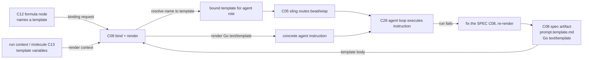
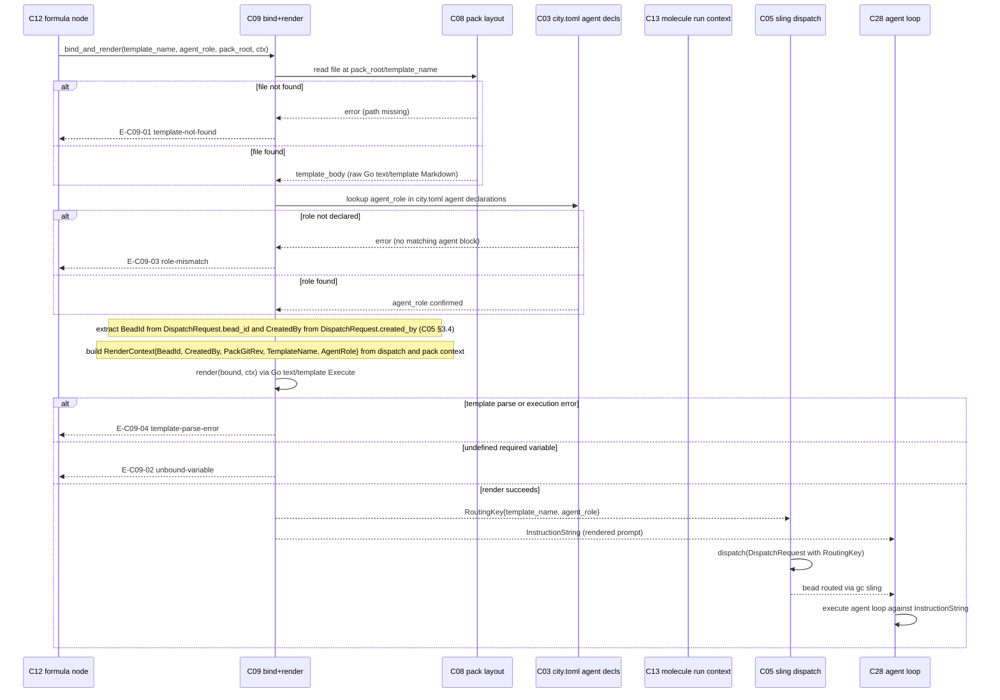

# C09 — Prompt template & spec→execution binding (`prompt-template-binding`)  (Spec, canonical track)

> Source: README §"Principle 1 — Specs are the source of truth" (lines 106, 109, 111 — "Spec format" + "Spec → execution binding" rows); AI-CONTEXT §3.2 (concept table line 89 "Prompt Templates: Go `text/template` markdown"; line 92 "Dispatch (Sling) routes bead/wisp to agent or pool"), §3.3 vocab (line 101 `formula`, line 105 `sling`), §3.4 (smallest viable install, line 119 `agents/<name>/prompt.template.md`), §13.1 (Phase 0 prompt-template content, line 542); F-MODE-COVERAGE F18, F36, F37, F38 (of these, F18 + F38 are C09-relevant-but-*handled-upstream* at C10/C07/P6 — C09 is only their conduit; F36 + F37 are inherent/conduit at the rendered-instruction surface — see §6). Companion: faithful spec [`spec/C08-spec-artifact.md`](./C08-spec-artifact.md) (esp. OQ-1, the C08↔C09 collapse). Cross-track provenance: the frozen optimized reference [`spec-optimized/C08-spec-artifact.md`](../spec-optimized/C08-spec-artifact.md) DELTA-01 re-scopes this seam (noted, not adopted on the canonical track).
> Inventory ID: C09   Kind: interface   Status: sweep-2
> Maps from: A28, A32b, B27. Depends on: C08 (spec artifact), C05 (sling/dispatch). Key gaps: — (none assigned).
> Binding decisions obeyed: **D-6** (canonical track), **D-29** (`created_by` wire type = `"kind:id"` string).

## 1. Purpose & responsibility

C09 is the **prompt-template + spec→execution binding** interface. It is the seam that turns a static spec artifact (C08) into a *concrete agent instruction* and decides **which spec drives which work**. v4 places this natively on Gas City's prompt-template machinery and dispatch:

- README:106 — the spec **format** is "Gas City prompt templates (Go `text/template` + Markdown)" at `agents/<name>/prompt.template.md`.
- README:109 — the spec→execution **binding** is "Gas City formulas reference templates by name; sling routes work to agents with specific templates."
- README:111 — "P1 is essentially handled by Gas City's prompt-template machinery."

C09 owns the two halves of that one mechanism:

- **The template-rendering contract (the "becomes an agent instruction" half).** Taking the Go `text/template` Markdown spec artifact (C08) and rendering it — substituting template variables from the run context — into the literal instruction string handed to the agent loop (C28).
- **The binding contract (the "which spec drives which work" half).** The named association *formula-node → template name → agent role*, resolved at dispatch time by sling (C05), so that a given bead/wisp executes against the intended spec.

> [FAITHFUL-FILL] v4 names "prompt template" (the artifact) and "spec→execution binding" (the wiring) as two rows of the same Principle-1 table but never names a *single component* called C09; the inventory fuses them under one ID ("Prompt template & spec→execution binding"). Faithful elaboration: C09 is the **render + bind interface** that consumes C08's artifact, owns no artifact of its own beyond the template-variable contract, and delegates routing to C05. This is the smallest framing that keeps C08 (the artifact) and C05 (the router) as the components the inventory already assigns, with C09 as the connective interface between them.

**What C09 is NOT:**
- It is **not** the spec artifact itself — the on-disk Markdown source-of-truth is **C08**. C09 *renders* and *references* it (README:106 vs 109; inventory C09 `Depends on: C08`).

  > Note (C08↔C09 boundary, faithful). The companion faithful C08 spec resolves OQ-1 to **Reading A (collapse)**: the `agents/<name>/prompt.template.md` file *is* the canonical spec artifact (C08), and that same file is the Go `text/template` C09 renders. So on the canonical track, C08 owns the file-as-artifact (its shape, path, version-control, renderability invariant) and C09 owns the *act* of rendering it + binding it to work. The file is shared; the ownership split is artifact (C08) vs. render/bind transform (C09). This is deliberately *different* from optimized DELTA-01, which splits the spec into a standalone bundle that the template merely references — the canonical track does not adopt that split (see §9 OQ-1).
- It is **not** the dispatch/routing engine — sling (C05) routes the bead/wisp to an agent/pool. C09 supplies the *template-name binding* sling uses; C09 does not own the dispatch loop (README:109; AI-CONTEXT:92; inventory C09 `Depends on: C05`).
- It is **not** the workflow/methodology DAG — the formula (C12) is the DAG that *references templates by name*; C09 is the binding the formula points *into*, not the formula format itself (README:109; inventory C12).
- It is **not** the structural validator (C10 EARS linter) nor the intent crucible (C11). C09 consumes a spec; it does not lint or author one.
- It is **not** the agent loop (C28). C09 produces the instruction string; C28 executes the multi-turn reasoning against it.

## 2. Context & dependencies

| Direction | Component | Relationship (v4 source) |
|---|---|---|
| Upstream (renders) | **C08** spec artifact | The Go `text/template` Markdown spec is C09's render input; C09 requires it parse as a valid template (C08 INV-2). Hard inventory dependency (`Depends on: C08`). |
| Upstream / lateral (binds via) | **C05** sling/dispatch | Sling routes a bead/wisp to an agent with a specific template; C09 supplies the formula-node→template-name binding sling resolves. Hard inventory dependency (`Depends on: C05`). |
| Upstream (references templates) | **C12** formula/pipeline file | "Gas City formulas reference templates by name" (README:109) — a formula node names the template C09 renders. C09 is the resolution point for that name→template binding. |
| Downstream (consumes instruction) | **C28** Claude Code agent loop | The rendered instruction is the agent's initial prompt; C28 executes against it (AI-CONTEXT §3.2 line 89; README:362 "one prompt template at `agents/worker/prompt.template.md`"). |
| Lateral (run state) | **C13** molecule | A molecule is the instantiated workflow (live bead-tree). At Phase 0, C13 is **not** a hard runtime dependency for render-context variables: `BeadId` and `CreatedBy` are sourced from the C05 `DispatchRequest` (§3.4 `bead_id`/`created_by` fields); `PackGitRev`/`TemplateName`/`AgentRole` from the C08 pack context. C13 may supply additional pack-specific variables declared in `pack.toml [template_vars]` in later phases. Soft — not a hard inventory edge at Phase 0. |
| Lateral (attribution) | **C41** identity/attribution | The binding decision (which spec drove which work) is an attributable action; `created_by` rides the dispatch. Soft upstream. |

C09 sits in the **Spec Intake** subsystem and is **foundational** (inventory: Foundational? = yes): it is the connective tissue between the spec artifact (C08) and the build flow (C05 sling, C12 formula, C28 agent loop). It is a **Batch-2** component (per the inventory's suggested batches) because it depends on Batch-1 C08 and on C05.

## 3. Interfaces / contracts

Sweep-1: interfaces **named + described** (concrete signatures, the template-variable schema, and the binding-record schema deferred to sweep 2).

### 3.1 Inbound

- **Template-source interface (C08 → C09).** A Go `text/template` Markdown file at `agents/<name>/prompt.template.md` (README:106; AI-CONTEXT:119). C09 receives the template body (or a reference resolving to it) plus the agent name it belongs to.
- **Render-context interface (dispatch + pack context → C09).** The set of template variables available at render time. At Phase 0, the canonical variable set (§3.2a) is assembled from two already-present inbounds: (a) the C05 `DispatchRequest` (supplies `BeadId` via `bead_id` and `CreatedBy` via `created_by`; both required fields per §3.4) and (b) the C08 pack context (supplies `TemplateName`, `AgentRole`, `PackGitRev`). v4 does not enumerate the variable set (Phase 0 content is "arbitrary; whatever the worker's initial prompt should be", AI-CONTEXT:542), so at the smallest install the context may be empty and the render is effectively pass-through. **Sweep-2 note:** C13 (molecule/bead run context) is NOT a required Phase-0 inbound for these variables — it may supply additional pack-specific variables in later phases via the `pack.toml [template_vars]` escape hatch.

  > [FAITHFUL-FILL] v4 names neither the template-variable namespace nor any specific variable. The minimal faithful contract: the render context is **whatever the Go `text/template` body references**, drawn from the dispatch/run context; no required variables exist at Phase 0 (the template may be a constant string, AI-CONTEXT:542). A fixed variable schema would be an architectural addition v4 does not make; it is left to be enumerated as templates begin using variables (sweep 2 / per-pack convention).

- **Binding-request interface (C12 formula / C05 sling → C09).** A formula node names a template ("formulas reference templates by name", README:109); at dispatch sling asks C09 to resolve that name to the concrete template for the target agent role, and to render it for this work item.

### 3.1a OQ-1 RESOLVED (Sweep-2): C08↔C09 inbound contract + authority chain

**RESOLVED (Sweep-2):** The C08↔C09 boundary and the C12→C09→C05 authority chain are settled by the faithful collapse (C08 OQ-1 Reading A) and the C05 Sweep-2 OQ-1 resolution:

> **D-8 — Convoy → C05; Order → C40.** "Convoy" (atomic multi-bead dispatch) is a Gas City sling concept referenced by C05; "Order" (durable workflow) is owned by C40. C12 references both but defines neither; C07 carries glossary entries.
> — [review-log D-8](../_meta/review-log.md), Batch-2 review integration (2026-05-31)

> **C05:OQ-1 resolution (verbatim from C05 Sweep-2 spec §9):** "The authority split is settled by the faithful reading of README:109 + C09's inventory dependency on C05: **C12** names the template (the formula step references a template name by string — C12's authoring domain). **C09** owns **resolution**: it turns the formula's template name into a `(template_name, agent_role)` binding. C09 is the component that knows how `agents/<name>/prompt.template.md` maps to which role. **C05** owns **routing**: it takes the resolved `(template_name, agent_role)` pair from C09 and issues `gc sling`. C05 never sees raw formula template-name strings; it receives already-resolved keys."

The authority chain for a dispatch is therefore:

1. **C12** authors a formula step that references a template by name string (e.g., `"agents/worker/prompt.template.md"`) — C12's domain only.
2. **C09** receives this name + the target agent role and **resolves** them: it loads the template body from the pack layout at `agents/<name>/prompt.template.md`, produces `(template_name, agent_role)` as the resolved binding key, and **renders** the Go `text/template` into the concrete instruction string.
3. **C09** hands the resolved key `(template_name, agent_role)` to **C05** as the `RoutingKey` in the `DispatchRequest`. C05 sees only the already-resolved key; it never resolves names.
4. **C05** issues `gc sling` to dispatch the bead to the correct agent.

**C09's inbound contract from C08:** On the canonical track (C08 Reading A / collapse), C09's template-source input is the `prompt.template.md` file body directly — C08 owns the file-as-artifact, C09 owns the act of rendering it. C09 does **not** receive a separate `spec_id`; it reads the file at the pack-layout path. If an integrator later adopts the optimized DELTA-01 split (standalone spec bundle), C09's inbound gains a `spec_id` resolution step before rendering — the render and bind responsibilities survive either way; only the resolution step is added. The canonical track does not adopt that split.

### 3.1b Concrete signatures (Sweep-2)

C09's authored code is the resolution and rendering logic that sits between C12's name-reference and C05's dispatch call. The following signatures represent the C09 policy contract:

```
# Resolve a formula-node template name + target agent role to a bound template.
# Input:  template_name (the string a C12 formula node references)
#         agent_role    (the role the formula step targets, e.g. "dog", "worker")
#         pack_root     (the git pack root; C08 artifact lives at pack_root/agents/<name>/prompt.template.md)
# Output: BoundTemplate {template_name, agent_role, template_body, pack_git_rev}
# Errors: E-C09-01 (template-not-found), E-C09-03 (role-mismatch)
resolve(template_name: string, agent_role: string, pack_root: PackRoot) -> Result<BoundTemplate, BindingError>

# Render a bound template against a render context, producing the concrete instruction string.
# Input:  bound  (output of resolve)
#         ctx    (RenderContext — the template variable set; see §3.2 field table)
# Output: InstructionString (the literal text handed to C28 as its initial prompt)
# Errors: E-C09-02 (unbound-variable), E-C09-04 (template-parse-error)
# Invariant: deterministic — same bound + same ctx => byte-identical output (INV-1)
render(bound: BoundTemplate, ctx: RenderContext) -> Result<InstructionString, BindingError>

# Top-level entry point: resolve + render in one call.
# Called by C05 at dispatch time (via the DispatchRequest routing-key seam).
# Output: RoutingKey {template_name, agent_role} — handed to C05 DispatchRequest
#         InstructionString                       — handed to C28 as initial prompt
bind_and_render(template_name: string, agent_role: string, pack_root: PackRoot, ctx: RenderContext)
  -> Result<(RoutingKey, InstructionString), BindingError>
```

> [FAITHFUL-FILL] These are the minimal faithful signatures for the C09 render+bind interface. v4 never names these function boundaries; they are inferred from "Gas City formulas reference templates by name; sling routes work to agents with specific templates" (README:109) as the smallest decomposition that separates resolution (find the template body), rendering (expand template actions), and handoff to sling (produce the routing key). `bind_and_render` is the single entry point C05 calls at dispatch time; `resolve` and `render` are its constituent steps, testable in isolation.

### 3.2 Outbound

- **Rendered-instruction contract (C09 → C28).** The output is a concrete instruction string (the rendered template), handed to the agent loop as its initial prompt. Postcondition: every `{{ }}` action in the template is resolved against the render context; an unresolved/erroring template is a render failure, not a silently-empty prompt (see §6).
- **Binding-record contract (C09 → attribution/work-graph).** The fact "this spec/template revision drove this work item" is an attributable record (which template name, for which agent role, against which bead). Faithful: this rides the existing dispatch + git identity (C41); C09 does not introduce a new store.

### 3.3 Invariants

- **INV-1 (render-faithfulness).** The rendered instruction is a pure function of (template body, render context). Same template + same context ⇒ byte-identical instruction. (Go `text/template` is deterministic; this is the property that makes a run reproducible against a spec revision.) (README:106.)
- **INV-2 (binding-uniqueness at dispatch).** For a given work item dispatched by sling, exactly one template is bound and rendered — "sling routes work to agents with *specific* templates" (README:109). Ambiguous binding (a formula node naming a template that resolves to zero or multiple) is a dispatch error, not a guess.
- **INV-3 (no methodology in the template).** The template carries the *spec/instruction*, not the workflow DAG; "the methodology lives in the file [the formula], not in agent prompts" (README:128). C09 must not let the formula's process logic leak into the rendered instruction.
- **INV-4 (spec-revision binding is explicit).** The binding identifies *which revision* of the spec/template drove the work — faithfully, the git revision of the pack (C08 INV-3). A run is attributable to a specific committed template state.

> [FAITHFUL-FILL] INV-1's "byte-identical / pure function" is not stated verbatim in v4; it is the minimal consistent inference from the format being Go `text/template` (deterministic by construction) plus Principle 1's reproducibility ("fix the spec and rebuild" presumes the same spec yields the same instruction). Without it, "rebuild" has no defined meaning. This is the smallest constraint that makes the C08→C09→C28 chain reproducible.

## 3.2a OQ-2 RESOLVED (Sweep-2): Template-variable namespace

**RESOLVED (Sweep-2):** v4 enumerates no template variables ("arbitrary", AI-CONTEXT:542). The canonical namespace is defined here as the **minimal faithful set** that covers bead-identity, run-identity, and spec-identity — the fields C09 can plausibly inject from its inbound contracts (C08 pack context + C13 molecule/bead state + C05 dispatch). Variables outside this set are **not supported** at Phase 0 and produce E-C09-02 (unbound-variable) if referenced.

> [FAITHFUL-FILL] v4 names no template variables; this table is the smallest faithful addition that makes the render contract concrete. Every variable is sourced from an already-named C09 inbound: the C08 pack (layout path for `TemplateName`/`AgentRole`/`PackGitRev`) and the C05 `DispatchRequest` (for `BeadId` via the `bead_id` field, and `CreatedBy` via the `created_by` field — both required fields in the §3.4 table). **C13 is NOT a required runtime dependency for the canonical Phase-0 variable set**: all six Phase-0 variables are derivable from the C08 pack context and the C05 DispatchRequest already present at bind time. No arbitrary/external injection is allowed at Phase 0. Undefined-required-variable → E-C09-02 (fail loud, per §6 INV-1 faithful choice and OQ-2 default).

### Template-variable namespace table (Sweep-2)

| Variable | Type | Req | Semantics | R/W-by |
|---|---|---|---|---|
| `{{.TemplateName}}` | `string` | O | The resolved template name (path relative to pack root, e.g. `agents/worker/prompt.template.md`). Injected by C09 from the `BoundTemplate.template_name` field. | C09 writes (resolved); template author reads |
| `{{.AgentRole}}` | `string` | O | The target agent role (e.g. `dog`, `worker`). Injected by C09 from the `BoundTemplate.agent_role` field. | C09 writes (resolved); template author reads |
| `{{.PackGitRev}}` | `string` | O | The git revision of the pack at render time (`BoundTemplate.pack_git_rev`). Provides the INV-4 spec-revision anchor in rendered text, if the template author wants to surface it. | C09 writes (resolved); template author reads |
| `{{.BeadId}}` | `bead_id` | O | The bead ID of the work item being dispatched (from the C05 DispatchRequest `bead_id` field, §3.4). Lets a template reference its own work-item identity. | C05 DispatchRequest writes (`bead_id` field, §3.4); C09 injects from dispatch context; template author reads |
| `{{.CreatedBy}}` | `string` | O | The `created_by` actor wire value for this dispatch, in `"kind:id"` colon-delimited format (D-29). Lets a template surface the dispatcher identity. | C05 DispatchRequest writes; C09 injects; template author reads |
| *(future / pack-specific)* | — | — | Additional variables MAY be introduced by later pack conventions; they MUST be declared in a `[template_vars]` section of `pack.toml` so C09 can validate them. Undeclared variables render as E-C09-02. | Pack author declares; C09 validates |

> [FAITHFUL-FILL] The `[template_vars]` declaration convention for pack-specific variables is the smallest faithful addition that keeps the namespace bounded (so C09 can surface E-C09-02 on unknown references) without inventing a full registry. v4 names `pack.toml` as the pack's config file (AI-CONTEXT:119); a `[template_vars]` section is the minimal consistent extension. Phase-0 templates that reference no variables at all (the pass-through case, AI-CONTEXT:542) have no `[template_vars]` section and C09 injects nothing — the render is a simple identity pass-through.

**OQ-2 resolution summary:** The canonical namespace is the six fields above (five concrete + one future-convention slot). Undefined required variables are E-C09-02 (fail loud). Optional variables resolve to the empty string if not injected (the Go `text/template` default for a missing field). Phase-0 default is zero-variable pass-through.

## 3.2b OQ-3 RESOLVED (Sweep-2): Binding registry vs. naming convention

**RESOLVED (Sweep-2):** The formula-node→template-name→agent-role binding is **an implicit pack-layout naming convention, not an explicit registry**. The convention is:

- The **template name** is the pack-relative path to the `agents/<name>/prompt.template.md` file (the path string the formula node carries — e.g. `"agents/worker/prompt.template.md"`).
- The **agent role** is the `<name>` component of that path (e.g. `worker` → mapped to the actual Gas City role name: `dog`, per F11). C09 maps path-basename to role name by the pack's `city.toml` / `pack.toml` agent declarations (C03) — the same `[[agent]]` blocks that define the rig names.
- **Resolution** is therefore: `template_name_string → file at pack_root/<template_name_string>` (OS path join) + `<name>` → lookup in `city.toml` agent declarations → `agent_role`. C09 performs both lookups; no separate binding store is introduced.

> **OQ-3 resolution:** The naming convention is sufficient at Phase 0 (one template per agent role, one role per pack section). A formal binding registry would be warranted if a single role gained many templates (dynamic selection) or if packs began composing templates cross-pack. Neither condition appears in Phase-0 v4. v4 names `pack.toml` and `city.toml` (AI-CONTEXT:119; README:120, 361); treating their `[[agent]]` declarations as the binding map is the smallest consistent choice that introduces no new store. Deferred: cross-pack template reference (a later-phase concern, not named in v4).

**Binding lives in:** `pack.toml` / `city.toml` agent declarations (C03). C09 reads these at resolve time; it does not write or own them. The binding relation is `agents/<name>/prompt.template.md` (C08 layout) × `[[agent]] name=<name>` (C03 city config) → `(template_name, agent_role)` pair.

## 4. Data model / state

C09 is an **interface/transform**, not a data store. It owns no durable state of its own; its "state" is the binding relation and the transient render context.

| Aspect | Faithful spec (v4 source) |
|---|---|
| Owned artifact | None of its own. The template body is C08's artifact (collapse: the `prompt.template.md` file); the formula's template-name reference is C12's; the dispatch record is sling's (C05). |
| Binding relation | `formula-node → template-name → agent-role`, resolved at dispatch (README:109). **OQ-3 RESOLVED:** this is a *naming convention* over the pack layout (`agents/<name>/prompt.template.md` × `city.toml` agent declarations) — not a separate registry (see §3.2b). |
| Render context | Transient per-render variable set assembled from the C05 `DispatchRequest` (`BeadId` from `bead_id`, `CreatedBy` from `created_by`) + the C08 pack context (`PackGitRev`, `TemplateName`, `AgentRole`). Lifetime = one render. Namespace: §3.2a table (six fields at Phase 0). **C13 is not a hard runtime dependency** for the canonical Phase-0 variable set — all variables come from inbounds already present at dispatch time. |
| Persistence | None owned. Durability of "which spec drove which work" rides the bead/work-graph (C19) dispatch record + git revision of the pack (C08). |
| Consistency | The pack git revision is the consistency boundary for *which* template text exists; sling's dispatch is the consistency point for *which* template is bound to a work item. |

### 4.1 BoundTemplate schema (Sweep-2)

The `BoundTemplate` is the transient intermediate produced by `resolve` and consumed by `render` and C05. It is not persisted; its attribution fields ride the C05 `DispatchRequest` into the C23 event bus.

| Field | Type | Req | Semantics | R/W-by |
|---|---|---|---|---|
| `template_name` | `string` | R | Pack-relative path to the template file (e.g. `agents/worker/prompt.template.md`). The routing key half passed to C05. | C09 resolve writes; C09 render reads; C05 reads (RoutingKey) |
| `agent_role` | `string` | R | Agent role resolved from the city.toml `[[agent]]` declaration (e.g. `dog`). The routing key half passed to C05. | C09 resolve writes; C05 reads (RoutingKey) |
| `template_body` | `string` | R | Raw Go `text/template` Markdown content loaded from the pack file. | C09 resolve writes (from C08 artifact); C09 render reads |
| `pack_git_rev` | `string` | R | Git revision of the pack at resolve time (INV-4 spec-revision anchor). | C09 resolve writes (from pack head); C09/C05 pass to attribution |

> [FAITHFUL-FILL] `BoundTemplate` is the minimal faithful transient struct that makes `resolve` and `render` separately testable (they are the §3.1b decomposition). v4 never names this struct; it is inferred from "resolve the name, render the body, hand off the key" as the smallest intermediate that avoids re-reading the file for every render.

> [FAITHFUL-FILL] v4 specifies no explicit "binding registry" data structure. The minimal faithful reading is that the binding is **implicit in the pack layout + formula references**: a formula node names a template, and `agents/<name>/prompt.template.md` resolves that name by Gas City's native convention. Introducing a standalone binding store would be an architectural addition v4 does not make (OQ-3 RESOLVED above).

## 5. Behavior

The core flow is **bind → render → dispatch**:



Key flow notes:
- **Bind.** A formula (C12) node references a template by name; at dispatch, sling (C05) + C09 resolve that name to the concrete `agents/<name>/prompt.template.md` for the target agent role (README:109).
- **Render.** C09 substitutes the template variables from the run context into the Go `text/template`, producing the literal instruction. At Phase 0 with no variables this is effectively pass-through of the authored Markdown (AI-CONTEXT:542).
- **Dispatch.** The bound+rendered instruction is the agent's initial prompt; sling routes the bead/wisp to the agent (C05), which the agent loop (C28) executes.
- **Loop closure.** When a run fails, the fix targets the *spec* (C08), and C09 re-renders the new spec revision — C09 carries the "rebuild" half of "fix the spec and rebuild" (Principle 1, README:102): the same binding, a new spec revision, a re-render.

### 5.1 Template resolution sequence diagram (Sweep-2)

The following diagram shows the full C08→C09→C05→C28 handoff contract: template resolution, variable substitution, bound-prompt production, and dispatch to sling.



> **Mermaid note:** no `;` characters appear in any label above; all transition text uses comma or space delimiters per the SWEEP2-DISPATCH hazard rule.

## 6. Failure modes & handling

| F-mode | Applies to C09 how | v4 handling (faithful) |
|---|---|---|
| **F18** Prose specs lack rigor | C09 renders free-form Markdown prose into the instruction; prose ambiguity flows straight through to the agent. | C09 does not resolve prose ambiguity; the EARS linter (C10) lints the C08 artifact upstream, and satisfaction-not-test-pass (P6) checks the *result*. **Partial — prose ambiguity remains** (F-MODE F18). C09 is a faithful conduit, not a disambiguator. |
| **F36** Instruction-following ceiling | The rendered instruction is the single prompt; if it exceeds the model's instruction-following ceiling, the agent silently drops requirements. | Mitigated upstream by spec-chunking — "small focused specs", one `prompt.template.md` per agent role (F-MODE F36; C08 §6). C09 renders one chunk per agent; the per-chunk ceiling persists (inherent residual). |
| **F37** Silent contradictory-prompt collapse | If a template renders internally contradictory instructions, the agent may silently collapse them. | v4's guard is multi-model paraphrase divergence (gene-transfusion from GF-M pattern, runnable as a pack) — **Partial** (F-MODE:23, F37). Not a C09-native guard. *Faithful inference (not a v4-stated F37 mechanism):* because INV-1 makes rendering deterministic (itself a [FAITHFUL-FILL], §3.3), a contradictory rendered prompt is at least *reproducible* and so diagnosable — a side-benefit of determinism, not part of v4's F37 handling. |
| **F38** Vocabulary lint debt | Undefined terms in the template flow into the instruction. | EARS-style linter (C10) detects deterministically on the C08 surface; C07 glossary is the term source — **Addressed** upstream of C09 (F-MODE F38). |
| **Render failure** (interface-local) | Template fails to parse (violates C08 INV-2) or references an undefined variable. | Faithful handling: a render error is a **dispatch failure**, surfaced as an error, not a silently-empty or partial prompt (INV-1/§3.2 postcondition). The work item does not run against a malformed instruction. |
| **Binding ambiguity** (interface-local) | A formula names a template that resolves to zero or multiple templates. | INV-2: ambiguous binding is a dispatch error, not a guess (README:109 "specific templates"). |

> [FAITHFUL-FILL] "Render failure" and "binding ambiguity" are interface-local failure modes not enumerated in F-MODE-COVERAGE (which catalogs system-level F-modes, not per-component error conditions). They are the minimal error taxonomy implied by INV-1/INV-2: a template that cannot render, or a name that cannot uniquely resolve, must fail loudly rather than produce a degraded prompt — otherwise Principle-1 reproducibility ("rebuild" yields the same instruction) is violated. No v4 source contradicts fail-loud; it is the smallest consistent choice.

### 6.1 Error taxonomy (Sweep-2)

| E-code | Condition | Surfaced-as | Caller recovery |
|---|---|---|---|
| **E-C09-01** | Template-not-found: the pack-relative path `template_name` does not resolve to a file at `pack_root/<template_name>` | `resolve` returns a `BindingError`; bead is left un-dispatched; `bind_and_render` propagates to C05/C18 | C18 reconciler surfaces the error; fix is a pack/formula correction (wrong path in the formula node) — requires human edit of C08 artifact or C12 formula |
| **E-C09-02** | Unbound-variable: the template body references a `{{.VarName}}` that is neither in the §3.2a canonical namespace nor declared in `pack.toml [template_vars]`; or a declared-required variable is absent from the RenderContext | `render` returns a `BindingError`; the partial instruction is discarded | Fix is authoring: add the variable to `pack.toml [template_vars]` and ensure C13 / C05 injects it, or remove the reference from the template |
| **E-C09-03** | Role-mismatch: the `agent_role` argument does not correspond to any `[[agent]] name=<role>` in the `city.toml` agent declarations (C03) | `resolve` returns a `BindingError`; bead left un-dispatched | Fix is config: add the missing `[[agent]]` block to `city.toml` (C03 authored surface) or correct the formula node's role reference |
| **E-C09-04** | Template-parse-error: the `template_body` does not parse as a valid Go `text/template` (violates C08 INV-2, e.g. unclosed `{{` action) | `render` returns a `BindingError` at parse time before execution; bead left un-dispatched | Fix is spec editing: the C08 artifact has a template syntax error; fix the `prompt.template.md` file (this is exactly the Principle-1 loop — fix the spec) |

## 7. Cross-cutting (security / cost / scale / observability / ops)

- **Security.** C09 renders untrusted-by-construction human Markdown into an instruction; the security posture is that the *template author* is trusted (it is version-controlled + attributable, C41) and secrets do not belong in templates (credential handling is C03/`city.toml`, not C09 — G37 is *C03's* gap, invoked here only to push the concern out of C09; C09 has no assigned gap). Template injection via uncontrolled variables is bounded by the render context being run-internal, not external input, at the faithful Phase-0 scope.
- **Cost / scale.** Rendering a Go `text/template` is negligible compute. The scale concern is dispatch throughput (C05 sling) and the agent-side Max rate-limit ceiling (G34 — *C28/C29's* gap) — both outside C09. C09 adds no material cost.
- **Observability.** "Which template revision rendered into which instruction for which work item" is the attributable join — it rides the dispatch record (C05) + pack git revision (C08) + actor identity (C41). C09 emits no telemetry of its own; the rendered instruction is observable as the agent's initial prompt in the trajectory store (CXDB C21) once the run executes.
- **Ops.** A template/format change is a git commit to the pack; re-rendering picks up the new revision on the next dispatch (INV-4). No separate deploy step for a binding change beyond committing the pack.

## 8. Acceptance criteria & test strategy

Sweep-1 acceptance (high-level):
1. **AC-1 (render defined).** Given a conformant C08 template (`agents/<name>/prompt.template.md`, valid Go `text/template`) and a render context, C09 produces a concrete instruction string with all template actions resolved (README:106; INV-1).
2. **AC-2 (determinism).** Same template + same context ⇒ byte-identical instruction across renders (INV-1).
3. **AC-3 (binding defined).** A formula node naming a template resolves, at dispatch via sling, to exactly one template for the target agent role (README:109; INV-2).
4. **AC-4 (render-failure is loud).** An un-renderable template (parse error / undefined required variable) yields a dispatch error, not an empty or partial prompt (§6).
5. **AC-5 (binding-ambiguity is loud).** A template name resolving to zero or multiple templates is a dispatch error (INV-2).
6. **AC-6 (rebuild loop).** After a spec (C08) revision, C09 re-renders the *new* revision and the new instruction drives the rebuild — demonstrating the "rebuild" half of "fix the spec, not the output" (Principle 1; C08 AC-5).
7. **AC-7 (no-methodology-leak).** The rendered instruction contains the spec/instruction, not the formula's workflow DAG (INV-3; README:128).

Test strategy (sweep-1): a minimal valid `prompt.template.md` rendered with an empty context (Phase-0 pass-through, AI-CONTEXT:542); a template-with-variables rendered against a fixture context (determinism check); a negative un-renderable template (AC-4); a binding fixture where a formula node resolves to one template (AC-3) and a negative where it resolves to zero/two (AC-5); a rebuild fixture (revise C08 → re-render → changed instruction, AC-6). Concrete signatures, the template-variable schema, and the binding-record schema deferred to sweep 2.

### 8.1 Concrete acceptance tests (Sweep-2)

| AC-code | Given / When / Then | Verifies |
|---|---|---|
| **AC-C09-01** | Given: a conformant `agents/worker/prompt.template.md` (valid Go `text/template`, no variables) and a RenderContext with no fields. When: `bind_and_render("agents/worker/prompt.template.md", "dog", pack_root, empty_ctx)`. Then: `InstructionString` equals the raw Markdown body verbatim; `RoutingKey.template_name == "agents/worker/prompt.template.md"` and `RoutingKey.agent_role == "dog"`. | INV-1 (determinism); Phase-0 pass-through (AI-CONTEXT:542); AC-1 (render defined) |
| **AC-C09-02** | Given: the same template as AC-C09-01. When: `bind_and_render` is called twice with identical inputs. Then: both `InstructionString` outputs are byte-identical. | INV-1 (pure function — same input same output); AC-2 (determinism) |
| **AC-C09-03** | Given: a template body `Hello {{.AgentRole}}` and a RenderContext with `AgentRole="dog"`. When: `render(bound, ctx)`. Then: `InstructionString == "Hello dog"`. | §3.2a namespace (variable injection); INV-1 |
| **AC-C09-04** | Given: a template body referencing `{{.UndeclaredVar}}` (not in §3.2a namespace and not in `pack.toml [template_vars]`). When: `render(bound, ctx)`. Then: result is E-C09-02; no partial instruction string is returned. | E-C09-02 (unbound-variable); INV-1/§6 fail-loud; AC-4 (render-failure is loud). Cross-refs: E-C09-02. |
| **AC-C09-05** | Given: a template name `"agents/nonexistent/prompt.template.md"` that does not exist on disk. When: `resolve(template_name, agent_role, pack_root)`. Then: result is E-C09-01; bead is left un-dispatched. | E-C09-01 (template-not-found); INV-2; AC-5 (binding-ambiguity is loud). Cross-refs: E-C09-01. |
| **AC-C09-06** | Given: `city.toml` with no `[[agent]]` block matching `agent_role="refinery"`. When: `resolve("agents/worker/prompt.template.md", "refinery", pack_root)`. Then: result is E-C09-03; bead is left un-dispatched. | E-C09-03 (role-mismatch); INV-2; OQ-3 convention binding. Cross-refs: E-C09-03. |
| **AC-C09-07** | Given: a template body with an unclosed action `{{.AgentRole` (malformed template). When: `render(bound, ctx)`. Then: result is E-C09-04; no partial instruction string is returned. | E-C09-04 (template-parse-error); C08 INV-2; AC-4. Cross-refs: E-C09-04. |
| **AC-C09-08** | Given: a conformant template at pack git rev R1. When: the spec is edited and committed (pack git rev R2); `bind_and_render` is called again. Then: `BoundTemplate.pack_git_rev == R2` and the `InstructionString` reflects the R2 template body (not R1). | INV-4 (spec-revision binding is explicit); AC-6 (rebuild loop). |
| **AC-C09-09** | Given: a rendered instruction produced by AC-C09-01. When: the instruction text is inspected. Then: it contains no formula-DAG workflow instructions — only the `prompt.template.md` spec content. | INV-3 (no methodology leak); AC-7. |
| **AC-C09-10** | Given: a successful `bind_and_render`. When: the `RoutingKey` is passed to `C05.dispatch(DispatchRequest{..., target_role=RoutingKey.agent_role, template_name=RoutingKey.template_name, ...})`. Then: C05 issues `gc sling` to the matching agent; C28 receives the `InstructionString` as its initial prompt. | C08→C09→C05→C28 handoff contract (§3.1a authority chain); INV-1 + INV-2. |

**E↔AC cross-reference summary:**
- E-C09-01 → AC-C09-05
- E-C09-02 → AC-C09-04
- E-C09-03 → AC-C09-06
- E-C09-04 → AC-C09-07

## 9. Open questions

- **OQ-1 (→ [review-log](../_meta/review-log.md), top open question).** *C08↔C09 boundary under the faithful collapse.* The canonical track adopts C08's Reading A: the `prompt.template.md` file **is** the spec artifact (C08) and also the template C09 renders — one file, ownership split as artifact (C08) vs. render/bind transform (C09). The optimized track ([`spec-optimized/C08-spec-artifact.md`](../spec-optimized/C08-spec-artifact.md) DELTA-01 + its OQ1) re-scopes this seam: the spec becomes a standalone bundle that the prompt template *references* by `spec_id`, making C09 a *referencer/renderer-around* rather than *renderer-of* the spec. Faithful disposition: keep the collapse (it is the only v4-named format+path), but flag that **if the integrator adopts the optimized split, C09's inbound contract changes from "template body = spec" to "template references a resolvable `spec_id`"** — the rendering and binding responsibilities survive either way, only the inbound resolution step is added. This is the load-bearing cross-component reconciliation item shared with the C08 author.
- **OQ-2 RESOLVED (Sweep-2).** *Template-variable namespace.* Resolved in §3.2a: six canonical variables (`{{.TemplateName}}`, `{{.AgentRole}}`, `{{.PackGitRev}}`, `{{.BeadId}}`, `{{.CreatedBy}}`, plus a `pack.toml [template_vars]` escape hatch for pack-specific variables). Undefined variables produce E-C09-02 (fail loud). Phase-0 default is zero-variable pass-through. Optional variables resolve to the Go `text/template` zero value (empty string) if not injected.
- **OQ-3 RESOLVED (Sweep-2).** *Binding registry vs. naming convention.* Resolved in §3.2b: the binding is an implicit pack-layout naming convention — `agents/<name>/prompt.template.md` × `city.toml [[agent]] name=<name>` declarations (C03) — not an explicit registry. No new store is introduced. A formal registry is deferred to when a single role gains multiple templates (not a Phase-0 case).
