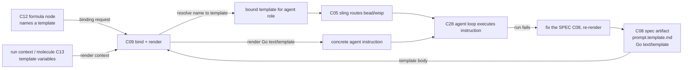

# C09 — Prompt template & spec→execution binding (`prompt-template-binding`)  (Spec, Track A)

> Source: README §"Principle 1 — Specs are the source of truth" (lines 106, 109, 111 — "Spec format" + "Spec → execution binding" rows); AI-CONTEXT §3.2 (concept table line 89 "Prompt Templates: Go `text/template` markdown"; line 92 "Dispatch (Sling) routes bead/wisp to agent or pool"), §3.3 vocab (line 101 `formula`, line 105 `sling`), §3.4 (smallest viable install, line 119 `agents/<name>/prompt.template.md`), §13.1 (Phase 0 prompt-template content, line 542); F-MODE-COVERAGE F18, F36, F37, F38 (of these, F18 + F38 are C09-relevant-but-*handled-upstream* at C10/C07/P6 — C09 is only their conduit; F36 + F37 are inherent/conduit at the rendered-instruction surface — see §6). Companion: faithful spec [`spec/C08-spec-artifact.md`](./C08-spec-artifact.md) (esp. OQ-1, the C08↔C09 collapse). Cross-track awareness: optimized [`spec-optimized/C08-spec-artifact.md`](../spec-optimized/C08-spec-artifact.md) DELTA-01 re-scopes this seam (noted, not adopted in Track A).
> Inventory ID: C09   Kind: interface   Status: sweep-1
> Maps from: A28, A32b, B27. Depends on: C08 (spec artifact), C05 (sling/dispatch). Key gaps: — (none assigned).

## 1. Purpose & responsibility

C09 is the **prompt-template + spec→execution binding** interface. It is the seam that turns a static spec artifact (C08) into a *concrete agent instruction* and decides **which spec drives which work**. v4 places this natively on Gas City's prompt-template machinery and dispatch:

- README:106 — the spec **format** is "Gas City prompt templates (Go `text/template` + Markdown)" at `agents/<name>/prompt.template.md`.
- README:109 — the spec→execution **binding** is "Gas City formulas reference templates by name; sling routes work to agents with specific templates."
- README:111 — "P1 is essentially handled by Gas City's prompt-template machinery."

C09 owns the two halves of that one mechanism:

- **The template-rendering contract (the "becomes an agent instruction" half).** Taking the Go `text/template` Markdown spec artifact (C08) and rendering it — substituting template variables from the run context — into the literal instruction string handed to the agent loop (C28).
- **The binding contract (the "which spec drives which work" half).** The named association *formula-node → template name → agent role*, resolved at dispatch time by sling (C05), so that a given bead/wisp executes against the intended spec.

> [FAITHFUL-FILL] v4 names "prompt template" (the artifact) and "spec→execution binding" (the wiring) as two rows of the same Principle-1 table but never names a *single component* called C09; the inventory fuses them under one ID ("Prompt template & spec→execution binding"). Faithful elaboration: C09 is the **render + bind interface** that consumes C08's artifact, owns no artifact of its own beyond the template-variable contract, and delegates routing to C05. This is the smallest framing that keeps C08 (the artifact) and C05 (the router) as the components the inventory already assigns, with C09 as the connective interface between them.

**What C09 is NOT:**
- It is **not** the spec artifact itself — the on-disk Markdown source-of-truth is **C08**. C09 *renders* and *references* it (README:106 vs 109; inventory C09 `Depends on: C08`).

  > Note (C08↔C09 boundary, faithful). The companion faithful C08 spec resolves OQ-1 to **Reading A (collapse)**: the `agents/<name>/prompt.template.md` file *is* the canonical spec artifact (C08), and that same file is the Go `text/template` C09 renders. So in Track A, C08 owns the file-as-artifact (its shape, path, version-control, renderability invariant) and C09 owns the *act* of rendering it + binding it to work. The file is shared; the ownership split is artifact (C08) vs. render/bind transform (C09). This is deliberately *different* from optimized DELTA-01, which splits the spec into a standalone bundle that the template merely references — Track A does not adopt that split (see §9 OQ-1).
- It is **not** the dispatch/routing engine — sling (C05) routes the bead/wisp to an agent/pool. C09 supplies the *template-name binding* sling uses; C09 does not own the dispatch loop (README:109; AI-CONTEXT:92; inventory C09 `Depends on: C05`).
- It is **not** the workflow/methodology DAG — the formula (C12) is the DAG that *references templates by name*; C09 is the binding the formula points *into*, not the formula format itself (README:109; inventory C12).
- It is **not** the structural validator (C10 EARS linter) nor the intent crucible (C11). C09 consumes a spec; it does not lint or author one.
- It is **not** the agent loop (C28). C09 produces the instruction string; C28 executes the multi-turn reasoning against it.

## 2. Context & dependencies

| Direction | Component | Relationship (v4 source) |
|---|---|---|
| Upstream (renders) | **C08** spec artifact | The Go `text/template` Markdown spec is C09's render input; C09 requires it parse as a valid template (C08 INV-2). Hard inventory dependency (`Depends on: C08`). |
| Upstream / lateral (binds via) | **C05** sling/dispatch | Sling routes a bead/wisp to an agent with a specific template; C09 supplies the formula-node→template-name binding sling resolves. Hard inventory dependency (`Depends on: C05`). |
| Upstream (references templates) | **C12** formula/pipeline file | "Gas City formulas reference templates by name" (README:109) — a formula node names the template C09 renders. C09 is the resolution point for that name→template binding. |
| Downstream (consumes instruction) | **C28** Claude Code agent loop | The rendered instruction is the agent's initial prompt; C28 executes against it (AI-CONTEXT §3.2 line 89; README:362 "one prompt template at `agents/worker/prompt.template.md`"). |
| Lateral (run state supplies variables) | **C13** molecule | A molecule is the instantiated workflow (live bead-tree); its run context is the source of the template variables C09 substitutes. Soft — variable source, not a hard inventory edge. |
| Lateral (attribution) | **C41** identity/attribution | The binding decision (which spec drove which work) is an attributable action; `created_by` rides the dispatch. Soft upstream. |

C09 sits in the **Spec Intake** subsystem and is **foundational** (inventory: Foundational? = yes): it is the connective tissue between the spec artifact (C08) and the build flow (C05 sling, C12 formula, C28 agent loop). It is a **Batch-2** component (per the inventory's suggested batches) because it depends on Batch-1 C08 and on C05.

## 3. Interfaces / contracts

Sweep-1: interfaces **named + described** (concrete signatures, the template-variable schema, and the binding-record schema deferred to sweep 2).

### 3.1 Inbound

- **Template-source interface (C08 → C09).** A Go `text/template` Markdown file at `agents/<name>/prompt.template.md` (README:106; AI-CONTEXT:119). C09 receives the template body (or a reference resolving to it) plus the agent name it belongs to.
- **Render-context interface (run state → C09).** The set of template variables available at render time, supplied by the run context (the molecule/bead, C13) — e.g., bead fields, work parameters. v4 does not enumerate the variable set (Phase 0 content is "arbitrary; whatever the worker's initial prompt should be", AI-CONTEXT:542), so at the smallest install the context may be empty and the render is effectively pass-through.

  > [FAITHFUL-FILL] v4 names neither the template-variable namespace nor any specific variable. The minimal faithful contract: the render context is **whatever the Go `text/template` body references**, drawn from the dispatch/run context; no required variables exist at Phase 0 (the template may be a constant string, AI-CONTEXT:542). A fixed variable schema would be an architectural addition v4 does not make; it is left to be enumerated as templates begin using variables (sweep 2 / per-pack convention).

- **Binding-request interface (C12 formula / C05 sling → C09).** A formula node names a template ("formulas reference templates by name", README:109); at dispatch sling asks C09 to resolve that name to the concrete template for the target agent role, and to render it for this work item.

### 3.2 Outbound

- **Rendered-instruction contract (C09 → C28).** The output is a concrete instruction string (the rendered template), handed to the agent loop as its initial prompt. Postcondition: every `{{ }}` action in the template is resolved against the render context; an unresolved/erroring template is a render failure, not a silently-empty prompt (see §6).
- **Binding-record contract (C09 → attribution/work-graph).** The fact "this spec/template revision drove this work item" is an attributable record (which template name, for which agent role, against which bead). Faithful: this rides the existing dispatch + git identity (C41); C09 does not introduce a new store.

### 3.3 Invariants

- **INV-1 (render-faithfulness).** The rendered instruction is a pure function of (template body, render context). Same template + same context ⇒ byte-identical instruction. (Go `text/template` is deterministic; this is the property that makes a run reproducible against a spec revision.) (README:106.)
- **INV-2 (binding-uniqueness at dispatch).** For a given work item dispatched by sling, exactly one template is bound and rendered — "sling routes work to agents with *specific* templates" (README:109). Ambiguous binding (a formula node naming a template that resolves to zero or multiple) is a dispatch error, not a guess.
- **INV-3 (no methodology in the template).** The template carries the *spec/instruction*, not the workflow DAG; "the methodology lives in the file [the formula], not in agent prompts" (README:128). C09 must not let the formula's process logic leak into the rendered instruction.
- **INV-4 (spec-revision binding is explicit).** The binding identifies *which revision* of the spec/template drove the work — faithfully, the git revision of the pack (C08 INV-3). A run is attributable to a specific committed template state.

> [FAITHFUL-FILL] INV-1's "byte-identical / pure function" is not stated verbatim in v4; it is the minimal consistent inference from the format being Go `text/template` (deterministic by construction) plus Principle 1's reproducibility ("fix the spec and rebuild" presumes the same spec yields the same instruction). Without it, "rebuild" has no defined meaning. This is the smallest constraint that makes the C08→C09→C28 chain reproducible.

## 4. Data model / state

C09 is an **interface/transform**, not a data store. It owns no durable state of its own; its "state" is the binding relation and the transient render context.

| Aspect | Faithful spec (v4 source) |
|---|---|
| Owned artifact | None of its own. The template body is C08's artifact (collapse: the `prompt.template.md` file); the formula's template-name reference is C12's; the dispatch record is sling's (C05). |
| Binding relation | `formula-node → template-name → agent-role`, resolved at dispatch (README:109). Faithfully this is a *naming convention* over the pack layout (`agents/<name>/prompt.template.md` keyed by agent name), not a separate registry. |
| Render context | Transient per-render variable set from the run context (C13). Lifetime = one render. |
| Persistence | None owned. Durability of "which spec drove which work" rides the bead/work-graph (C19) dispatch record + git revision of the pack (C08). |
| Consistency | The pack git revision is the consistency boundary for *which* template text exists; sling's dispatch is the consistency point for *which* template is bound to a work item. |

> [FAITHFUL-FILL] v4 specifies no explicit "binding registry" data structure. The minimal faithful reading is that the binding is **implicit in the pack layout + formula references**: a formula node names a template, and `agents/<name>/prompt.template.md` resolves that name by Gas City's native convention. Introducing a standalone binding store would be an architectural addition v4 does not make.

## 5. Behavior

The core flow is **bind → render → dispatch**:

Key flow notes:
- **Bind.** A formula (C12) node references a template by name; at dispatch, sling (C05) + C09 resolve that name to the concrete `agents/<name>/prompt.template.md` for the target agent role (README:109).
- **Render.** C09 substitutes the template variables from the run context into the Go `text/template`, producing the literal instruction. At Phase 0 with no variables this is effectively pass-through of the authored Markdown (AI-CONTEXT:542).
- **Dispatch.** The bound+rendered instruction is the agent's initial prompt; sling routes the bead/wisp to the agent (C05), which the agent loop (C28) executes.
- **Loop closure.** When a run fails, the fix targets the *spec* (C08), and C09 re-renders the new spec revision — C09 carries the "rebuild" half of "fix the spec and rebuild" (Principle 1, README:102): the same binding, a new spec revision, a re-render.

## 6. Failure modes & handling

| F-mode | Applies to C09 how | v4 handling (faithful) |
|---|---|---|
| **F18** Prose specs lack rigor | C09 renders free-form Markdown prose into the instruction; prose ambiguity flows straight through to the agent. | C09 does not resolve prose ambiguity; the EARS linter (C10) lints the C08 artifact upstream, and satisfaction-not-test-pass (P6) checks the *result*. **Partial — prose ambiguity remains** (F-MODE F18). C09 is a faithful conduit, not a disambiguator. |
| **F36** Instruction-following ceiling | The rendered instruction is the single prompt; if it exceeds the model's instruction-following ceiling, the agent silently drops requirements. | Mitigated upstream by spec-chunking — "small focused specs", one `prompt.template.md` per agent role (F-MODE F36; C08 §6). C09 renders one chunk per agent; the per-chunk ceiling persists (inherent residual). |
| **F37** Silent contradictory-prompt collapse | If a template renders internally contradictory instructions, the agent may silently collapse them. | v4's guard is multi-model paraphrase divergence (gene-transfusion from GF-M pattern, runnable as a pack) — **Partial** (F-MODE:23, F37). Not a C09-native guard. *Faithful inference (not a v4-stated F37 mechanism):* because INV-1 makes rendering deterministic (itself a [FAITHFUL-FILL], §3.3), a contradictory rendered prompt is at least *reproducible* and so diagnosable — a side-benefit of determinism, not part of v4's F37 handling. |
| **F38** Vocabulary lint debt | Undefined terms in the template flow into the instruction. | EARS-style linter (C10) detects deterministically on the C08 surface; C07 glossary is the term source — **Addressed** upstream of C09 (F-MODE F38). |
| **Render failure** (interface-local) | Template fails to parse (violates C08 INV-2) or references an undefined variable. | Faithful handling: a render error is a **dispatch failure**, surfaced as an error, not a silently-empty or partial prompt (INV-1/§3.2 postcondition). The work item does not run against a malformed instruction. |
| **Binding ambiguity** (interface-local) | A formula names a template that resolves to zero or multiple templates. | INV-2: ambiguous binding is a dispatch error, not a guess (README:109 "specific templates"). |

> [FAITHFUL-FILL] "Render failure" and "binding ambiguity" are interface-local failure modes not enumerated in F-MODE-COVERAGE (which catalogs system-level F-modes, not per-component error conditions). They are the minimal error taxonomy implied by INV-1/INV-2: a template that cannot render, or a name that cannot uniquely resolve, must fail loudly rather than produce a degraded prompt — otherwise Principle-1 reproducibility ("rebuild" yields the same instruction) is violated. No v4 source contradicts fail-loud; it is the smallest consistent choice.

## 7. Cross-cutting (security / cost / scale / observability / ops)

- **Security.** C09 renders untrusted-by-construction human Markdown into an instruction; the security posture is that the *template author* is trusted (it is version-controlled + attributable, C41) and secrets do not belong in templates (credential handling is C03/`city.toml`, not C09 — G37 is *C03's* gap, invoked here only to push the concern out of C09; C09 has no assigned gap). Template injection via uncontrolled variables is bounded by the render context being run-internal, not external input, at the faithful Phase-0 scope.
- **Cost / scale.** Rendering a Go `text/template` is negligible compute. The scale concern is dispatch throughput (C05 sling) and the agent-side Max rate-limit ceiling (G34 — *C28/C29's* gap) — both outside C09. C09 adds no material cost.
- **Observability.** "Which template revision rendered into which instruction for which work item" is the attributable join — it rides the dispatch record (C05) + pack git revision (C08) + actor identity (C41). C09 emits no telemetry of its own; the rendered instruction is observable as the agent's initial prompt in the trajectory store (CXDB C21) once the run executes.
- **Ops.** A template/format change is a git commit to the pack; re-rendering picks up the new revision on the next dispatch (INV-4). No separate deploy step for a binding change beyond committing the pack.

## 8. Acceptance criteria & test strategy

Sweep-1 acceptance (high-level):
1. **AC-1 (render defined).** Given a conformant C08 template (`agents/<name>/prompt.template.md`, valid Go `text/template`) and a render context, C09 produces a concrete instruction string with all template actions resolved (README:106; INV-1).
2. **AC-2 (determinism).** Same template + same context ⇒ byte-identical instruction across renders (INV-1).
3. **AC-3 (binding defined).** A formula node naming a template resolves, at dispatch via sling, to exactly one template for the target agent role (README:109; INV-2).
4. **AC-4 (render-failure is loud).** An un-renderable template (parse error / undefined required variable) yields a dispatch error, not an empty or partial prompt (§6).
5. **AC-5 (binding-ambiguity is loud).** A template name resolving to zero or multiple templates is a dispatch error (INV-2).
6. **AC-6 (rebuild loop).** After a spec (C08) revision, C09 re-renders the *new* revision and the new instruction drives the rebuild — demonstrating the "rebuild" half of "fix the spec, not the output" (Principle 1; C08 AC-5).
7. **AC-7 (no-methodology-leak).** The rendered instruction contains the spec/instruction, not the formula's workflow DAG (INV-3; README:128).

Test strategy (sweep-1): a minimal valid `prompt.template.md` rendered with an empty context (Phase-0 pass-through, AI-CONTEXT:542); a template-with-variables rendered against a fixture context (determinism check); a negative un-renderable template (AC-4); a binding fixture where a formula node resolves to one template (AC-3) and a negative where it resolves to zero/two (AC-5); a rebuild fixture (revise C08 → re-render → changed instruction, AC-6). Concrete signatures, the template-variable schema, and the binding-record schema deferred to sweep 2.

## 9. Open questions

- **OQ-1 (→ [review-log](../_meta/review-log.md), top open question).** *C08↔C09 boundary under the faithful collapse.* Track A adopts C08's Reading A: the `prompt.template.md` file **is** the spec artifact (C08) and also the template C09 renders — one file, ownership split as artifact (C08) vs. render/bind transform (C09). The optimized track ([`spec-optimized/C08-spec-artifact.md`](../spec-optimized/C08-spec-artifact.md) DELTA-01 + its OQ1) re-scopes this seam: the spec becomes a standalone bundle that the prompt template *references* by `spec_id`, making C09 a *referencer/renderer-around* rather than *renderer-of* the spec. Faithful disposition: keep the collapse (it is the only v4-named format+path), but flag that **if the integrator adopts the optimized split, C09's inbound contract changes from "template body = spec" to "template references a resolvable `spec_id`"** — the rendering and binding responsibilities survive either way, only the inbound resolution step is added. This is the load-bearing cross-component reconciliation item shared with the C08 author.
- **OQ-2.** *Template-variable namespace.* v4 enumerates no template variables (Phase-0 content is "arbitrary", AI-CONTEXT:542). Whether a canonical variable namespace (bead fields, work params, run identity) should be defined — and whether unknown variables are an error (AC-4) or render-empty — is left open for sweep 2. Faithful default: undefined required variable ⇒ render error (fail loud).
- **OQ-3.** *Binding registry vs. naming convention.* Faithful reading treats the formula-node→template-name→agent-role binding as an implicit naming convention over the pack layout (no separate store). Whether a future need (many templates per role, dynamic selection) warrants an explicit binding registry is deferred; v4 names none.
