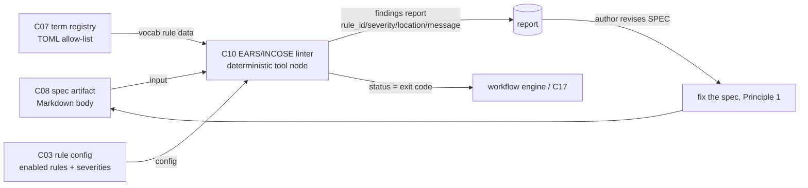

# C10 — Spec linter (EARS / INCOSE) (`spec-linter-ears`)  (Spec, Track A)

> Source: README §"Principle 1 — Specs are the source of truth", the "Spec linter (optional)" row (line 108 "EARS-style structural rules (INCOSE R7-R35) — Custom Go package (transfusion target: any EARS-rule implementation) — Gas City pack with deterministic tool node") and placement summary (line 111 "Spec linter is a small custom add when you want EARS-style discipline"); F-MODE-COVERAGE F18 (line 20, "Prose specs lack rigor — EARS-style spec linter (P1 component) + satisfaction-not-test-pass (P6) — Partial") and F38 (line 74, "Vocabulary lint debt — EARS-style spec linter (P1 component); deterministically detectable — Addressed"); README §"Principle 4 — Deterministic-first" (the tool-node posture C10 is built as, lines 152–162); one-shot-specs-and-research.md Part 2 ("Research on Spec Attributes vs. Code-Generation Success", lines 86–122 — the ambiguity/completeness/specificity attributes the rules screen for). component-inventory C10 row (line 22: subsystem Spec Intake; kind component; maps A32, B69; depends C08; foundational no). Sibling specs: `spec/C08-spec-artifact.md` (the artifact lints), `spec/C07-vocabulary-glossary.md` §3.2 (the term registry F38 keys against), `spec/C17-tool-node-abstraction.md` (the deterministic-node abstraction C10 is built over).
> Inventory ID: C10   Kind: component (deterministic tool node)   Status: sweep-1
> Track: A (faithful)

## 1. Purpose & responsibility

C10 is the **EARS / INCOSE spec linter**: a deterministic structural-rule checker that reads a spec
artifact (C08) and emits findings where the spec's prose violates well-formedness rules drawn from the
**EARS** requirement-syntax patterns and the **INCOSE Guide to Writing Requirements rules R7–R35**
(README:108). It is the P1 "small custom add when you want EARS-style discipline" (README:111), realized
as a **Gas City pack with a deterministic tool node** (README:108) — i.e. built against the C17 tool-node
abstraction over the C02 ABI, with **no model call** (Principle 4: deterministic-first; README:154).

Its reason to exist is two named failure modes:

- **F18 — Prose specs lack rigor.** C10 is the *structural* half of the F18 mitigation (the other half is
  satisfaction-not-test-pass, P6 / C32–C33). It catches the deterministically-detectable rigor defects
  (passive voice, vague terms, missing actor, compound "and/or" requirements, no measurable response).
  F-MODE-COVERAGE marks F18 **Partial** — "fundamental prose ambiguity remains" — and C10 owns exactly the
  *detectable* portion, not the residual semantic ambiguity (F-MODE:20).
- **F38 — Vocabulary lint debt.** C10 is the **owner** of F38 (F-MODE:74 "Addressed", "deterministically
  detectable"). It flags terms used in a spec that are not in the canonical term registry (C07 §3.2), or
  used via a non-canonical alias. C07 supplies the allow-list; C10 supplies the verdict (C07 §3.3 lint-time
  contract).

**Responsibilities**
- Run a fixed, ordered set of **deterministic structural rules** (the EARS patterns + INCOSE R7–R35 set)
  over a spec's Markdown body.
- Run the **vocabulary-lint rule** against the C07 term registry (F38).
- Emit a **structured findings report** (rule id, severity, location, message) and a **status** the
  workflow engine reads to advance or block (per C17/C02: exit code = status).
- Be **reproducible**: same spec + same rule set + same term registry ⇒ identical findings (the C17
  determinism contract).

**What C10 is NOT**
- NOT the **spec format / artifact** (C08). C10 *consumes* the artifact; it does not define where the spec
  lives or how it is rendered. C08 explicitly states "It is **not** the structural validator — EARS/INCOSE
  linting is C10" (C08 §1).
- NOT the **term registry** (C07). C07 owns the canonical vocabulary data; C10 owns the *rule* that keys
  against it. "The lint *rules* live in C10 … C07 is the data; the linters are the consumers" (C07 §1, §3.3).
- NOT the **workflow linter** (C15) or **discipline linter** (C16). Those lint *formulas* (the DAG/process),
  not *specs* (the prose). C10's input surface is the C08 spec body; C15/C16's is the C12 formula.
- NOT a **semantic / model-based reviewer.** C10 makes no model call and asserts nothing about whether the
  spec is *correct* or *complete in meaning* — only whether it is *structurally well-formed* by the fixed
  rule set. Semantic adequacy is P6's (judge/satisfaction) territory; the residual F18 ambiguity is
  conceded, not closed, by C10.
- NOT a **gate that blocks the build by default.** v4 calls the linter **"optional"** (README:108, 111). Its
  default disposition (warn vs. block) is config (C03) and is left to the operator — see §3.4 / OQ-1.
- NOT the **intent-intake crucible** (C11). C11 captures structured intent up front; C10 checks the prose
  that results, after the fact.

## 2. Context & dependencies

| Direction | Component | Relationship (source) |
|---|---|---|
| Upstream (input artifact) | **C08** spec artifact | C10's input surface is the C08 Markdown body; C08 §3.2 names the "lint contract (artifact → C10)" and AC-4 "lintable surface". |
| Upstream (term data) | **C07** vocabulary-glossary | C10's vocab-lint rule (F38) keys against C07's machine-readable term registry (C07 §3.2, §3.3, §49 "Consumed by C10"). |
| Upstream (built-as) | **C17** tool-node abstraction | C10 is "a tool node" built over C17's deterministic-node abstraction (C17 §1 "NOT the individual deterministic tools themselves (the EARS spec linter C10 …)"; C17 §64 lists C10 as an instance). |
| Upstream (wire/pack) | **C02** pack/tool-node ABI | The Gas City pack + `[[tool]] type="subprocess"` declaration C10's binary is invoked through (README:108 "Gas City pack with deterministic tool node"; via C17). |
| Upstream (config) | **C03** config/feature-flags | Whether the linter runs, and at what severity/blocking disposition, is layered TOML config — it is "optional" (README:108, 111). |
| Downstream (consumes findings) | spec authoring loop / **C39** fix-task | Findings route back to the human (or fix-task loop) to revise the **spec**, consistent with Principle 1 "fix the spec" (README:102). |
| Lateral (companion in F18) | **C32 / C33** judge + satisfaction | C10 is the *deterministic* half of F18; the *semantic* half is the cross-family judge + satisfaction metric (F-MODE:20). They are complementary, not coupled. |

C10 is **not foundational** (inventory: no) and lives in **Batch 2** (component-inventory line 109:
"spec-linter" alongside session/sling/prompt-binding), because it depends on the **Batch 1** artifacts
C08 (spec format), C07 (term registry), C17/C02 (tool-node abstraction + ABI) being frozen first.

## 3. Interfaces / contracts

Sweep 1 — interfaces **named and described**; concrete signatures/schemas/rule-table deferred to sweep 2.

### 3.1 Inbound: how C10 is invoked
C10 is invoked as a **deterministic tool node** (C17) inside a formula, or run standalone as a CLI/pack
binary. Per the C17/C02 contract it receives (sweep-1 named; wire-level realization is C02's):

| Input | Description | Source |
|---|---|---|
| Spec path(s) | The C08 artifact(s) to lint — one `prompt.template.md` (or the spec-document body) per invocation; the declared input placeholder a formula node substitutes (e.g. `{spec_path}`). | C08 §3.2; C17 §3.1 declared inputs |
| Term registry | The C07 TOML term registry (path or loaded form) for the vocab-lint rule. | C07 §3.2 |
| Rule config | Which rules are enabled and their severities / blocking disposition (from layered TOML, C03). "Optional" ⇒ the enable/severity set is config-driven. | README:108; C03 |

### 3.2 Outbound: what C10 produces
- **Findings report** (structured): a list of findings, each with `rule_id`, `severity`
  (e.g. error|warning|info), `location` (line/section in the spec), and a human-readable `message`. Surfaced
  as the tool node's **declared output** (a partition file and/or structured result, per C17 §3.1 / C02 §3.3).
- **Status**: success/failure as the C02 **exit code**, which the workflow engine reads to advance or block
  the DAG (C17 §3.1 status). The mapping from "findings present" → "nonzero exit" is governed by the
  blocking disposition in §3.4 (config).

> [FAITHFUL-FILL] **Findings-report shape (rule_id / severity / location / message).** v4 names neither a
> report schema nor a field set — it says only "structural rules … deterministic tool node" (README:108).
> The four named fields are the minimal consistent elaboration: a *deterministic structural* linter must
> name *which rule* fired and *where*, or its output is not actionable as a "fix the spec" signal
> (Principle 1). This mirrors the universally-shared shape of every lint tool (the "transfusion target: any
> EARS-rule implementation", README:108, all carry rule-id + location + message). The exact serialization
> (JSON vs. SARIF vs. text) is deferred to sweep 2 and constrained only by the C02 output ABI.

### 3.3 The rule set (EARS + INCOSE R7–R35)
C10's substance is a **fixed, ordered, deterministic rule set**. v4 names the source bodies but not the
individual rules in line; faithfully, the rule set is the union of:

1. **EARS pattern conformance.** Each requirement statement should match one of the EARS sentence patterns
   (ubiquitous / event-driven `When …` / state-driven `While …` / unwanted-behavior `If … then …` /
   optional-feature `Where …`, optionally complex combinations) with a single clear actor and a measurable
   system response using "shall". This is the "EARS-style structural rules" of README:108.
2. **INCOSE *Guide to Writing Requirements* rules R7–R35.** The structural well-formedness rules in that
   numbered range — e.g. use of active voice, avoid vague terms ("appropriate", "as required", "etc."),
   avoid escape clauses, one requirement per statement (no compound "and/or"), use defined terms, avoid
   pronouns, quantify with units, avoid negation where a positive form exists. README:108 cites the range
   "INCOSE R7-R35" explicitly as the rule source.
3. **Vocabulary-lint rule (F38).** Any term used in the spec that is not in C07's registry (or used via a
   non-canonical alias) is a finding. This is the "deterministically detectable" F38 rule (F-MODE:74; C07
   §3.3 lint-time).

> [FAITHFUL-FILL] **The R7–R35 rules are referenced by number, not enumerated inline in v4.** README:108
> cites "INCOSE R7-R35" as an external, named, stable rule corpus (the INCOSE *Guide to Writing
> Requirements*). The faithful elaboration is: C10 implements the rules in that numbered range as its
> structural rule set; the *authoritative wording* of each Rxx lives in the INCOSE guide, not in v4, and
> the concrete per-rule mapping (Rxx → detector + severity) is a **sweep-2** deliverable. Listing every rule
> here would be inventing v4 content; naming the corpus + range and deferring the per-rule table is the
> minimal consistent choice. The rules are *structural/lexical* (detectable without a model), consistent
> with C10 being a **deterministic** tool node — INCOSE rules requiring human judgement (if any in-range are
> not mechanically checkable) degrade to "best-effort heuristic finding", flagged at sweep 2.

> [FAITHFUL-FILL] **Per-statement granularity over a free-form Markdown body.** C08 §4 fills the spec body
> as **free-form Markdown** with *no required section schema*. C10 therefore cannot assume a fixed
> "requirements section"; it must identify candidate requirement statements heuristically (e.g. sentences
> containing "shall"/"must"/"should", or list items) and apply rules to those. This is the minimal
> consistent reading: lint what is recognizably a requirement, warn (not error) on un-parseable prose, since
> v4 imposes no spec structure C10 could rely on. (If OQ-2 in C08 resolves to allow a required structure,
> C10 can tighten; faithful default assumes none.)

### 3.4 Invariants
- **INV-1 (deterministic).** Same spec body + same enabled rule set + same C07 registry snapshot ⇒
  byte-identical findings. C10 makes no model call and reads no clock/network (C17 determinism contract;
  README:154).
- **INV-2 (no mutation).** C10 is **read-only** over the spec — it emits findings, never edits the artifact.
  (Fixing the spec is a human/fix-task action; Principle 1.)
- **INV-3 (advisory by default / config-gated severity).** Because v4 marks the linter "optional"
  (README:108, 111), C10's *default* posture is **advisory** (emit findings; do not hard-block the build);
  whether a finding class blocks is C03 config, set per pack/city.

> [AMBIGUITY: OQ-1 — blocking vs. advisory] v4 says the linter is **"optional"** (README:108, 111) but also
> places it in the spec-intake path whose whole point is rigor (F18). Two readings:
> - **Reading A (advisory-by-default — chosen).** "Optional" means the linter is an opt-in pack that, when
>   present, **reports** findings; blocking is a separate per-finding config choice (C03). Default =
>   warn-not-block.
> - **Reading B (gate-when-enabled).** "Optional" means *whether you install it* is optional, but once
>   enabled it **gates** (nonzero exit blocks the formula).
> **Faithful pick: Reading A.** It is the smaller, more consistent choice: README twice stresses "optional /
> small custom add … when you want EARS-style discipline", and F-MODE marks F18 **Partial** (the linter is
> not claimed to be a hard correctness gate — the *gate* is P6 satisfaction, not P1 linting). The blocking
> disposition is therefore config (INV-3), defaulting to advisory, and a pack may opt a finding class into
> blocking. Restated as OQ-1; integrator's call whether any rule class blocks by default.

## 4. Data model / state

C10 is a **stateless deterministic tool**; it owns **no persistent store**.

| Aspect | Faithful spec (source) |
|---|---|
| Inputs (read-only) | The C08 spec body (Markdown) + the C07 term registry (TOML) + rule config (C03 TOML). |
| Owned config artifact | The **rule set definition** (which Rxx/EARS rules exist, default severities). Ships *inside C10's pack* (README:108 "Custom Go package … Gas City pack"). > [FAITHFUL-FILL]: v4 names no separate rule-config file; minimal-consistent home is the linter pack's own TOML/embedded rule table, loaded like any other pack config. C10 introduces no new shared on-disk artifact (consistent with C17 "no new on-disk artifact"). |
| Outputs (transient) | The findings report (written to the tool node's `work_partition` and/or returned), per C02. Not durable C10 state; durability of a *run's* findings is the bead/CXDB record (C19–C21), not C10. |
| Per-run state | None retained between runs (INV-1 determinism). |

## 5. Behavior

Key flow (sweep-1 narrative; sequence diagram at sweep 2):
1. A formula node (or operator CLI) invokes C10 with a spec path, the C07 registry, and rule config.
2. C10 parses the Markdown body, identifies candidate requirement statements (§3.3 fill), and applies the
   **ordered rule set**: EARS pattern conformance, INCOSE R7–R35 structural rules, and the C07 vocab-lint
   rule — deterministically, no model call.
3. C10 emits the **findings report** (rule_id/severity/location/message) and sets **status** per the
   blocking disposition (§3.4): advisory by default (zero exit + findings reported), or nonzero if a
   config-enabled blocking rule class fired.
4. The workflow engine reads status (advance/block); findings route to the author/fix-task to revise the
   **spec** (Principle 1 loop), then re-lint.

## 6. Failure modes & handling

| F-mode | Relevance to C10 | Handling (faithful) |
|---|---|---|
| **F18** Prose specs lack rigor | C10 is the **deterministic structural** half of the mitigation. | Run the EARS/INCOSE rule set; emit findings. **Partial** — C10 catches structurally-detectable rigor defects only; "fundamental prose ambiguity remains" (F-MODE:20). The *semantic* half is P6 satisfaction (C32–C33), not C10. C10 does **not** claim to close F18. |
| **F38** Vocabulary lint debt | C10 is the **owner**. | Vocab-lint rule keys against C07's registry; undefined/non-canonical terms are findings. "Deterministically detectable", **Addressed** (F-MODE:74). |
| **F51** Ashby-deficient probabilistic guard | C10 is a deterministic guard, the **primary** kind P4 wants. | Being a no-model tool node, C10 is exactly the deterministic boundary-typing guard F51 favors over an LLM check (F-MODE:76). |
| **Un-parseable / non-requirement prose** | A spec body that isn't recognizable requirement statements. | Warn, do not error: C10 lints recognizable requirements and surfaces a low-severity "could not parse as requirement" note rather than failing the run (§3.3 fill; consistent with C08 free-form body). |
| **Stale / missing term registry** | C07 registry absent or out of date when the vocab rule runs. | The vocab rule degrades to skipped-with-warning rather than crashing; the structural EARS/INCOSE rules still run. > [FAITHFUL-FILL]: v4 specifies no behavior here; minimal-consistent is graceful degradation (C10 still useful without C07), since C07 is a *data* dependency for one rule, not for the whole linter. |

No C10-assigned Gxx gap exists (inventory C10 gap column "—"). The F18 residual ("fundamental prose
ambiguity remains") is an **inherent**, architecture-level concession, not a C10 defect: C10 owns the
detectable subset and explicitly does not claim the rest.

## 7. Cross-cutting (security / cost / scale / observability / ops)

- **Security.** As a C17/C02 subprocess tool node, C10 runs in its `work_partition`, read-only over the
  spec; it carries no model-prompt-injection surface (it makes no model call — the F51 reason deterministic
  guards are primary, C17 §7).
- **Cost / scale.** **Zero token cost** (no model call) — "tool nodes are cheap and reproducible"
  (README:154). Cost is process-startup + linear text scan; negligible for a single spec file.
- **Observability.** A C10 run is an actor action: it lands as a bead (C19/C20) carrying `created_by`
  (C41) on the event bus (C23), like any tool node (C17 §7). Findings counts over time are a natural
  meta-metric input (C46), though C10 itself emits no telemetry beyond its findings + status.
- **Ops / transfusion.** README:108 marks C10's OSS source as "transfusion target: any EARS-rule
  implementation" — i.e. C10 is to be built by **gene-transfusion** (C51) from an existing EARS/INCOSE rule
  implementation, recording `transfused_from`. The custom Go package is "your work" (README:108): a small
  pack, not a large dependency.

## 8. Acceptance criteria & test strategy

Sweep-1 high-level criteria (concrete test cases at sweep 2):
1. **AC-1 (rule set runs).** Given a spec body, C10 applies the EARS pattern + INCOSE R7–R35 structural
   rules and the C07 vocab rule, producing a findings report (README:108).
2. **AC-2 (deterministic).** Same spec + same enabled rule set + same registry snapshot ⇒ byte-identical
   findings, with no model call (INV-1; README:154).
3. **AC-3 (read-only).** C10 never mutates the spec artifact (INV-2).
4. **AC-4 (F38 vocab-lint).** A spec using a term absent from the C07 registry (or a non-canonical alias)
   produces a vocab finding; a spec using only registry terms produces none (F-MODE:74; C07 §3.3).
5. **AC-5 (F18 structural findings).** Known anti-patterns — passive voice, vague term ("appropriate"),
   compound "and/or" requirement, missing measurable response, no actor — each produce the expected INCOSE/
   EARS finding; well-formed EARS statements produce none.
6. **AC-6 (status / blocking config).** With advisory config (default), findings present ⇒ zero exit
   (report only); with a rule class opted into blocking (C03), a matching finding ⇒ nonzero exit that the
   workflow engine treats as a block (§3.4; INV-3).
7. **AC-7 (built as a tool node).** C10 is invoked through the C17 deterministic-node abstraction over the
   C02 ABI (declared inputs → status + declared outputs), with no per-language workflow code (C17 §3).

Test strategy (sweep-1): a positive corpus (well-formed EARS spec → zero findings), a negative corpus (one
spec per anti-pattern → expected finding), a vocab corpus (in-registry vs. out-of-registry terms), and a
determinism test (run twice, diff findings). Concrete rule-by-rule fixtures deferred to sweep 2 alongside
the Rxx→detector table.

## 9. Open questions

(Mirrored into `_meta/review-log.md`.)

1. **[top open question] OQ-1 — blocking vs. advisory disposition** (§3.4 [AMBIGUITY]). v4 calls the linter
   "optional"; sweep-1 picks **advisory-by-default, blocking-by-config**. Sweep 2 must confirm with C03
   whether *any* finding class (e.g. F38 undefined-term, or a hard EARS-syntax failure) should block by
   default, given F18 is only **Partial** and the real correctness gate is P6 satisfaction — i.e. is the
   spec linter ever a hard gate, or always advisory?
2. **OQ-2 — per-rule R7–R35 mapping.** README cites the INCOSE range by number; the concrete Rxx → detector
   + severity + mechanically-checkable-vs-heuristic table is a sweep-2 deliverable (§3.3 fill). Which
   in-range rules are *not* mechanically checkable (and so degrade to best-effort) must be enumerated.
3. **OQ-3 — requirement-statement extraction over free-form Markdown.** C08's body is free-form (no required
   section schema, C08 §4/OQ-2). C10's heuristic for "what counts as a requirement statement" (§3.3 fill)
   depends on whether C08 ever gains an optional structure. If C08 OQ-2 resolves toward allowing required
   structure, C10 can tighten extraction; the faithful default assumes none.
4. **OQ-4 — findings serialization.** JSON vs. SARIF vs. text for the report (§3.2 fill) — constrained only
   by the C02 output ABI; pick at sweep 2 (SARIF is the natural transfusion-friendly choice but v4 names
   none).
