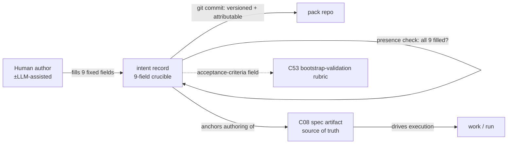

# C11 — Intent intake (9-field crucible) (`intent-intake`)  (Spec, canonical track)

> Source: F-MODE-COVERAGE F41 (line 91: "Under-defined-intent debt — **Intent Crucible pack (gene transfusion from GF-C) — 9-field structured intake** — Addressed"); one-shot-specs-and-research.md Part 2 "Research on Spec Attributes vs. Code-Generation Success" (lines 86–122 — the **completeness / ambiguity / specificity / requirement-classes** attributes that causally affect how far an AI gets, esp. HumanEvalComm arXiv:2406.00215 and the class-level-completeness "sweet spot" arXiv:2510.26130) + Part 1 (the DoD / acceptance-criteria practice: Kilroy `DoD.md`, line 29; StrongDM three-spec shape, line 14); component-inventory C11 row (line 23: subsystem **Spec Intake**; kind **component**; maps **A97, A149**; depends **C08**; key gap **G23**; foundational **no**); gene-transfusion discipline C51 (the `transfused_from` + exemplar-correctness + license posture the GF-C transfusion is governed by). Sibling specs: `spec/C08-spec-artifact.md` (the artifact the crucible feeds), `spec/C10-spec-linter-ears.md` (the *after-the-fact* prose checker, contrasted in C10 §"NOT"), `spec/C09-prompt-template-binding.md` §1 (names C11 as "the intent crucible", not the binder).
> Inventory ID: C11   Kind: component   Status: sweep-1
> Track: canonical (per **D-6**: one track; no "Track A/B" framing)

## 1. Purpose & responsibility

C11 is the **Intent Crucible**: a *structured, fixed-field intake form* that captures a piece of intended work as a small, complete set of named fields **before** a human authors the source-of-truth spec (C08). Its single reason to exist is one named failure mode — **F41 "Under-defined-intent debt"** — which F-MODE-COVERAGE marks **Addressed** by an "Intent Crucible pack … 9-field structured intake" gene-transfused from the external exemplar **GF-C** (F-MODE:91).

The mechanism is deliberately minimal and serves Principle 1 (*specs are the source of truth*): the crucible does **not** replace the C08 spec — it is the **upstream structured prompt** that forces the under-specified dimensions of intent (the ones research links to code-gen failure — completeness, ambiguity, specificity, requirement class; one-shot Part 2) to be *named* up front, so the C08 spec the human writes is anchored rather than guessed. C08 already records this relationship from its side: "C11 … is the structured intake that *feeds* spec authoring; C08 is the durable artifact it produces toward" (C08 §2).

**Responsibilities**
- Define the **fixed 9-field intent schema** — the named slots a piece of intent must fill (the field set itself is a FAITHFUL-FILL; see §4 / §3.2, grounded in the one-shot Part 2 attributes).
- Capture one **intent record** per unit of work: a small structured document, authored by a human (optionally LLM-*assisted*), persisted as a versioned artifact carrying its author (`created_by`, C41).
- Carry the **crucible pack's** `transfused_from` provenance (the GF-C lineage) per the C51 gene-transfusion discipline — this is component-level provenance of C11 itself (A93: `transfused_from` is recorded *per factory-built component*), **not** per intent record (see §3.3 field #9 and INV-4).
- Hand the completed record **to C08** as the anchoring input for spec authoring (the C11→C08 seam).

**What C11 is NOT** (boundaries)
- **NOT the spec artifact (C08).** The crucible is *intake*, not the source of truth. C08 is "**not** structured intent capture (the 9-field crucible) — that is C11" (C08 §1). The durable, execution-driving artifact is C08; C11's record is its *upstream anchor*, not a second source of truth.
- **NOT a spec linter (C10).** C10 checks the *prose that results*, deterministically, after the fact (EARS/INCOSE); C11 *structures the intent up front*. C10 §"NOT" states this contrast explicitly: "C11 captures structured intent up front; C10 checks the prose that results, after the fact." C11 runs **no** EARS/INCOSE rule set.
- **NOT a workflow / process engine.** The crucible is a *form + field schema*, not a methodology, DAG, or multi-step elicitation pipeline. Any workflow lives in a **formula** (C12), never here. (THE BAR: a workflow engine for intake is exactly the over-build to refuse — see §3.4.)
- **NOT a validation gate beyond a field schema.** Its only "check" is *field presence/shape* (are the 9 slots filled?). It runs **no** semantic-adequacy gate, no acceptance test, no model-judged completeness score. Semantic adequacy is P6's territory (judge/satisfaction, C32–C33); structural prose rigor is C10's. (THE BAR: validation gates beyond a field schema → DROP — §3.4.)
- **NOT the binder.** C09 decides *which spec drives which work*; C11 does not render, bind, or dispatch (C09 §1).
- **NOT the bootstrap-validation gate.** The crucible can *supply rubric material* (its acceptance-criteria field) but it does not own the "did the factory-built component pass?" decision — that is **C53** (see §"G23", §9).

## 2. Context & dependencies

| Direction | Component | Relationship (source) |
|---|---|---|
| Upstream (hard dep) | **C08** spec artifact | Inventory C11 `Depends on: C08`. C11 produces *toward* the C08 spec; the crucible record is the structured anchor a human turns into the C08 `prompt.template.md` body. Direction is C11 → feeds → C08 authoring; C11 depends on C08's format being defined so its hand-off lands somewhere named. |
| Upstream (storage) | **C03 / C02** config + pack ABI | The crucible is a **Gas City pack** (F-MODE:91 "Intent Crucible **pack**"); like every pack its presence/section gating rides the layered TOML (C03) and it is distributed via the pack ABI (C02). Soft/structural, not an inventory-listed dep. |
| Upstream (discipline) | **C51** gene-transfusion | C11 is itself a transfused component (from GF-C). C51 owns the `transfused_from` provenance field, the exemplar-correctness predicate, and **license handling** for GF-C. C11 records lineage; it does not define the predicate. |
| Upstream (attribution) | **C41** actor/identity | Each intent record is authored by an actor; `created_by` rides the record per the universal attribution model (soft upstream, mirrors C08's C41 relationship). |
| Downstream (consumer) | **C08** authoring | The completed record is consumed by a human (optionally LLM-assisted) writing the C08 spec. C11 emits an artifact, not a live call. |
| Sibling (contrast, no dep) | **C10** spec linter | Runs *after* a spec exists; C11 runs *before*. No data dependency either way; complementary halves of "specs with rigor". |
| Downstream (bootstrap, soft) | **C53** bootstrap-validation | The acceptance-criteria field of a crucible record can *seed* C53's go/no-go rubric (the G23 link, §9). C11 supplies material; C53 owns the gate. |

C11 sits in the **Spec Intake** subsystem, immediately upstream of C08. It is **not foundational** (inventory: Foundational? = no) and is in **Batch 3** (component-inventory Batch 3 lists C11) — it consumes the already-frozen C08 format, so nothing in Batch 1/2 waits on it.

## 3. Interfaces / contracts

Sweep-1: interfaces **named + described**; concrete field signatures/schemas deferred to sweep 2.

### 3.1 Inbound
- **Authoring interface (human → intent record).** A human (optionally LLM-assisted) fills the 9 fields. The crucible presents the fixed schema; the human supplies values. v4 gives no UI mandate — faithful reading is a structured Markdown/TOML form authored in the same git-versioned pack world as C08 (F-MODE:91 "pack").
- **Provenance interface (C51 → record).** The record carries `transfused_from` lineage (GF-C) and `created_by` (C41), set at authoring time.

### 3.2 Outbound
- **Anchor-handoff contract (record → C08 authoring).** The completed, all-9-fields-present record is the structured input a human turns into the C08 spec body. Sweep-1 names this seam; the concrete mapping (which crucible field anchors which part of the C08 prose) is a sweep-2 contract. This is C11's single load-bearing outbound interface.
- **Rubric-material contract (record → C53, optional).** The record's *acceptance-criteria / definition-of-done* field is exposed as candidate rubric input for bootstrap-validation (C53). Named here, owned by C53 (§9, G23).

### 3.3 The 9 fields (named slots)

> [FAITHFUL-FILL] **The nine field names *and the 9-way partition* are inferred; only the count is a v4 fact.** F-MODE:91 asserts "9-field structured intake" and names the source (GF-C) but lists **no field names anywhere in the four source docs**, and **GF-C is never defined** (the only other GF-C mention, F-MODE:19, is an unrelated signed-scenarios pattern). The *minimal consistent* field set is reverse-engineered from the spec attributes one-shot Part 2 names as causally affecting code-gen success — **completeness, ambiguity, specificity, requirement classes** (four attributes, lines 86–122) — plus the **definition-of-done / acceptance-criteria** and **target-system goal** practices the Part 1 corpus actually shows (Kilroy `DoD.md`; Fabro/StrongDM "embeds a target-system goal"). Note the arithmetic does **not** fall out cleanly: those research sources name ~4 attributes + ~2 Part-1 practices, which this spec *partitions into* nine slots (e.g. the single "completeness" attribute is split across Non-goals + Inputs; specificity → Scope). That partition into exactly nine is therefore itself part of the FAITHFUL-FILL, not a research result. What is faithful to F-MODE:91 is the **count (9)**; the field **names** *and* their **grouping** are the fill, for the integrator to confirm against the real GF-C exemplar at sweep 2 (→ OQ-1).

| # | Field (slot) | What it forces named | Grounding |
|---|---|---|---|
| 1 | **Goal / intended outcome** | The single thing the work should achieve. | one-shot Part 1 (each Fabro/StrongDM spec "embeds a target-system goal", lines 14, 68). |
| 2 | **Scope** (in-scope) | The boundary of what is being built. | specificity attribute (Part 2). |
| 3 | **Non-goals** (out-of-scope) | What is explicitly excluded — the F3 "can't enumerate what shouldn't happen" pressure relieved at intake time. | completeness attribute (Part 2); F3 framing (C08 §6). |
| 4 | **Actors / stakeholders** | Who acts / who it is for. | INCOSE "needs an actor" lineage shared with C10; requirement-class attribute (Part 2). |
| 5 | **Inputs / preconditions** | What must hold / be supplied. | completeness (Part 2). |
| 6 | **Constraints** (perf / security / cost / tech) | The non-functional envelope. | requirement-classes attribute (Part 2). |
| 7 | **Acceptance criteria / definition-of-done** | How "done" is judged — the field that also seeds the C53 rubric (G23). | Kilroy `DoD.md` (Part 1, line 29). |
| 8 | **Known ambiguities / open questions** | Where the intent is *deliberately* under-determined — names the ambiguity instead of hiding it (the HumanEvalComm "clarify vs silently guess" signal). | ambiguity attribute, HumanEvalComm arXiv:2406.00215 (Part 2). |
| 9 | **Exemplar / transfusion reference** | The concrete external example *the intended work should behave like* — an **intent-level** design pointer (distinct from C51's `transfused_from`, which records the provenance of the **C11 component itself**, INV-4; field #9 is per-record content, not the universal provenance metadata). | one-shot Part 1 (the corpus is exemplar specs to behave like); A93/A107 external-grounding lineage via inventory map. |

> [FAITHFUL-FILL] **Field-completeness is a presence check, not a quality gate.** F-MODE:91 says "structured intake", not "validated intake". The minimal consistent contract is: the crucible records whether each of the 9 slots is *filled* (including an explicit "n/a — none" being a valid fill for, e.g., Non-goals). It does **not** score, judge, or block on *quality* of the contents — that would be a validation gate beyond a field schema (refused per THE BAR, §3.4). "Filled" is the only invariant the crucible enforces.

### 3.4 Invariants & the over-build line
- **INV-1 (fixed schema).** The field set is a **fixed, named 9-slot schema**, not free-form and not operator-extensible at the format level (extension would make it a workflow/DSL, not a crucible). Count = 9 is faithful to F-MODE:91.
- **INV-2 (presence, not quality).** The only enforced check is *all 9 slots present* (§3.3 FAITHFUL-FILL). No semantic/model gate.
- **INV-3 (intake, not source-of-truth).** A crucible record is *upstream anchor*, never the execution-driving artifact; C08 remains the single source of truth (boundary §1).
- **INV-4 (provenance carried).** Each record carries `transfused_from` (GF-C lineage, C51) and `created_by` (C41).

> **THE BAR — what was DROPPED here (and why).** C11's whole justification is P1 (anchor the source-of-truth spec). Capability that earns its place: *the fixed field schema* (genuine low-effort custom code where the principle — a complete, anchored spec — could not be met by the stack alone, since neither Gas City nor C08 imposes intent structure). Refused as non-principle polish/hardening:
> - a **multi-step elicitation / interview workflow engine** (that's C12 formula territory; intake is a form);
> - **validation gates beyond field-presence** — semantic completeness scoring, model-judged intent adequacy, an acceptance-test gate at intake (semantic adequacy is P6/C32–33; prose rigor is C10);
> - a **second registry / store** for intent (records live as versioned pack artifacts alongside C08; no new persistence tier);
> - **operator-extensible field DSL** (turns the crucible into a schema language — over-build).
> When in doubt these were DROPPED; partial satisfaction by C08 (artifact + git versioning), C10 (prose rigor), and C32–33 (satisfaction) is counted as covering the rest.

## 4. Data model / state

C11 owns the **intent-record artifact** and its **schema**, not a live service or a separate store.

| Aspect | Faithful spec (source) |
|---|---|
| Schema | A **fixed 9-field** record (the named slots, §3.3). The schema is C11's load-bearing owned definition. |
| Physical form | A small structured document (Markdown or TOML) in the same git-versioned **pack** world as C08 (F-MODE:91 "pack"). No new database. |
| Identity | One record per unit of intended work; it anchors the C08 spec a human then authors. |
| Lifecycle | Authored (9 slots filled) → committed (versioned + attributable, like C08) → consumed by C08 authoring → (optionally) its DoD field seeds a C53 rubric. On a fix/iteration, the record is *revised* alongside the spec. |
| Persistence | **Git history is the durable record** (mirrors C08 §4 exactly — no separate persistence tier; refused per THE BAR). The bead graph (C19) / CXDB (C21) record *runs*; C11's own persistence is the pack repo. |
| Consistency | Git is the consistency boundary; one committed revision = one authoritative intent-record state. |

> [FAITHFUL-FILL] **No store of its own.** v4 names no datastore for intent records; the minimal consistent choice is to reuse C08's persistence model (git-versioned pack artifact) rather than introduce a registry. This keeps C11 a *pack + schema*, not a service, consistent with F-MODE:91 ("pack") and the canonical-track no-new-tier posture.

## 5. Behavior

The crucible's behavior is a single, linear, **non-looping** intake step at the head of the Principle-1 spec flow:

Key flow: **structure-then-spec.** The human fills the 9 slots; the crucible's only automated behavior is the *presence* check (all 9 filled — INV-2). The committed record then anchors the C08 spec the human authors. There is **no elicitation loop, no iteration engine, no gate that blocks the build** — iteration on the intent is just editing the record + spec and re-committing (the same fix-the-spec loop C08 §5 owns). C11 emits no telemetry of its own.

## 6. Failure modes & handling

| F-mode | Applies to C11 how | Handling (faithful) |
|---|---|---|
| **F41 — Under-defined-intent debt** | C11's reason to exist. Intent that omits scope, non-goals, acceptance criteria, or names no exemplar produces specs an AI "silently guesses" at. | The 9-field crucible **forces those dimensions to be named** at intake (F-MODE:91 "Addressed"). Faithful caveat: F41 is "Addressed" by *structuring* intent, not by guaranteeing its *quality* — a filled-but-shallow field is out of C11's reach (INV-2) and falls to C10 (prose rigor) / P6 (satisfaction). C11 closes the *structural* half of F41. |
| **F3 — Spec-completeness fallacy** (residual) | The Non-goals / Known-ambiguities fields invite enumerating "what should not happen", which is inherently incompletable. | C11 *reduces* under-definition but does **not** claim completeness; twins (P7) + scenarios (P5) partially compensate downstream. Residual gap is conceded (mirrors C08 §6 F3 disposition). |
| **F18 — Prose specs lack rigor** (boundary) | A crucible field's *contents* are prose and can be vague. | **Not C11's** — structural prose rigor is C10 (EARS/INCOSE), semantic adequacy is P6. C11 supplies structure, not rigor of contents. Stated to fix the boundary, not claimed as C11 coverage. |
| **F25 — Design starvation** (operator-side) | A structured 9-field form is *more* up-front work per unit of intent; it could slow an already-bottlenecked operator. | Conceded, not solved (F-MODE F25 "honest staffing"; G15). Faithful note: the crucible trades operator throughput for intent completeness; the LLM-*assisted* authoring path (§3.1) is the only mitigation, and it is assist-not-automate (no autonomous intent generation — that would defeat F41's point). |

## 7. Cross-cutting (security / cost / scale / observability / ops)

- **Security / secrets.** Intent records are plaintext structured docs in a git pack; no secrets belong in them (same posture as C08 §7; credential handling is C03/`city.toml`, G37, not C11).
- **Attribution / governance.** Each record is a git commit carrying actor identity via C41; its `transfused_from` (GF-C) lineage is carried per C51 (INV-4).
- **License hygiene.** Because C11 is itself a GF-C transfusion, **GF-C's license must be cleared** before its structure/content is reproduced — but that predicate and the license-handling are **C51's** (gene-transfusion discipline owns "exemplars under incompatible licenses", G07/G30). C11 records lineage; C51 clears it. (Noted, deferred to C51.)
- **Cost / scale.** Records are tiny text files; artifact cost is negligible. The real cost is *operator time* (F25, §6), not compute. No model call is required by the crucible itself (LLM assist is optional).
- **Observability.** C11 emits no telemetry; a committed intent record is a git object, observable via the same history C08 uses. Runs are recorded against the resulting C08 spec (C33/C46 reference the spec, not the crucible record).

## 8. Acceptance criteria & test strategy

Sweep-1 acceptance (high-level):
1. **AC-1 (schema defined).** There exists a documented **fixed 9-field** intent schema with named slots (§3.3), realized as a Gas City pack (F-MODE:91).
2. **AC-2 (presence check).** A record with all 9 slots filled (including explicit "n/a" fills) is *accepted*; a record missing any slot is *flagged incomplete* — and the check asserts **nothing about content quality** (INV-2).
3. **AC-3 (versioned + attributable).** Each intent record is a git commit carrying actor identity (C41) and `transfused_from` lineage (C51) (INV-4).
4. **AC-4 (anchors C08).** A completed record demonstrably anchors a C08 spec — i.e. the spec's goal/scope/DoD trace back to the corresponding crucible fields (the C11→C08 seam, §3.2).
5. **AC-5 (no over-build).** C11 ships with **no** elicitation workflow, **no** semantic/acceptance gate, **no** separate store, and **no** field-DSL — only the fixed schema + presence check (THE BAR, §3.4). This is an explicit *negative* acceptance criterion.
6. **AC-6 (G23 seam, deferred-owned).** The acceptance-criteria field is exposed as candidate rubric material to C53; C11 does **not** implement the bootstrap-validation gate (§9).

Test strategy (sweep-1): a minimal valid 9-field record (positive), a missing-field record (negative, AC-2), a versioned-record-with-attribution fixture (AC-3), and a trace fixture mapping crucible fields → a C08 spec (AC-4). Concrete schemas/tests deferred to sweep 2 (where the real GF-C field names should replace the FAITHFUL-FILL set).

## 9. Open questions

- **OQ-1 (→ review-log).** **The 9 field names are a FAITHFUL-FILL** (§3.3): v4 asserts "9-field" and the GF-C source but enumerates no field names, and **GF-C itself is undefined** in all four docs. The field set here is reverse-engineered from one-shot Part 2's named spec attributes + Part 1's DoD practice. The real GF-C exemplar must be located and its actual fields confirmed at sweep 2; if GF-C's set differs in *names* or *grouping*, this schema is revised (the *count* 9 is the faithful anchor). This is **the load-bearing ambiguity for C11**.
- **OQ-2.** **Crucible record vs. C08 spec — one artifact or two?** This mirrors C08's own OQ-1 (does "spec" collapse into `prompt.template.md`, or is there a standalone spec doc?). Faithful reading keeps them *distinct but co-versioned* (the record anchors, C08 drives). If C08's OQ-1 resolves to a standalone spec document, the crucible record may fold into that document's front-matter rather than being a separate file. Contingent on C08:OQ-1; integrator's call.
- **G23 (addressed-from-C11-side, gate deferred to C53).** C11's assigned gap **G23** is that **bootstrap-validation success criteria are subjective** ("deploy if it works" has no rubric). C11's *structural contribution*: field #7 (**acceptance criteria / definition-of-done**) is the place where a unit of intent's pass-bar is named, so a factory-built component authored via the crucible **arrives with an explicit DoD** rather than a subjective "looks good" — turning the raw material of a rubric into a required field. **Disposition:** C11 *supplies* the acceptance-criteria material and exposes it to C53 (AC-6, §3.2); it does **not own** the go/no-go gate, the scenario set, or the pass threshold — those are **C53** (bootstrap-validation milestone) and the satisfaction tier (C32–C33). G23 is therefore *partially addressed at the intake seam* (intent now carries a DoD) and *deferred for the gate itself* to C53, with reason: building the validation rubric/gate inside an intake form would be a validation gate beyond a field schema (refused per THE BAR) and would duplicate C53. (one-shot Part 1 Kilroy `DoD.md`; inventory G23 → C53/C11; F-MODE F41.)
