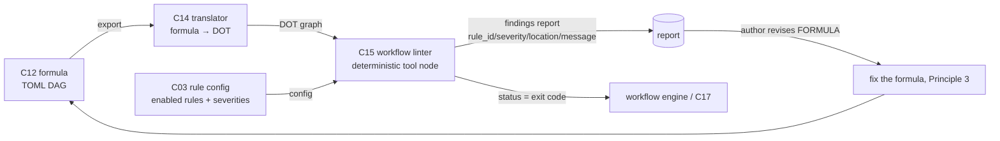

# C15 — Workflow linter (Mammoth 21-rule) (`workflow-linter`)  (Spec, canonical track)

> Source: README §"Principle 3 — Pipeline-file as process", the "Workflow linter" row (line 134 "Structural rules — Transfusion from Mammoth's 21-rule DOT linter (Go, MIT) — MIT (Mammoth) — Gas City pack") and the Principle-3 dataflow diagram (lines 137–148: formula ↔ translator ↔ DOT → "Mammoth-style 21-rule linter"); README Phase 1 (line 392 "P3 … including visualization and (optionally) Mammoth-derived 21-rule linter"); README license table (line 301 "Mammoth | MIT (verify; 2389 research convention) | DOT linter is the strongest transfusion target"); AI-CONTEXT §6.4 Mammoth (lines 272–278: "21-rule DOT linter for formula linting"; "strongest v4 transfusion target") and §12 open question (line 509 "Mammoth's exact 21 DOT linter rules: should be documented and ported to formulas"); F-MODE-COVERAGE F26 ("chain length is a formula property, visible and lintable"). component-inventory C15 row (line 27: subsystem Workflow Engine; kind component; maps A34b, B30; depends C14; gap G30; foundational no). Sibling specs: `spec/C12-formula-pipeline-file.md` (the formula DAG C15 lints — §3 node/edge model, §4 node-kind set, the acyclicity/loop invariant), `spec/C14-formula-dot-translator.md` (the bidirectional translator that produces the DOT surface — specced at sweep-1; its exact DOT-attribute encoding is a C14 sweep-2 item), and the LINTER sibling `spec/C10-spec-linter-ears.md` (same deterministic-tool-node + findings-report pattern, modeled on).
> Inventory ID: C15   Kind: component (deterministic tool node)   Status: sweep-1
> Track: canonical (single track; D-6)

## 1. Purpose & responsibility

C15 is the **workflow linter**: a deterministic structural-rule checker that reads a **formula** (the C12
TOML DAG) and emits findings where the *workflow graph itself* is malformed — a missing entry, an
unreachable node, a back-edge cycle, a dangling edge, an over-long chain. It is the **"Mammoth 21-rule DOT
linter"** transfused into a formula context (README:134; AI-CONTEXT §6.4) — built as a **Gas City pack with
a deterministic tool node** (README:134 "Gas City pack"), i.e. over the C17 tool-node abstraction / C02 ABI,
with **no model call** (Principle 4: deterministic-first; README:154). It is the C10 of the *workflow*
layer: same shape (findings report + status), different input surface (the DAG, not the prose spec).

Its reason to exist is **Principle 3 made enforceable**: "the methodology lives in the file, not in agent
prompts" (README:128) only pays off if a malformed file is *caught*. F-MODE-COVERAGE F26 names the property
C15 keys on — "chain length is a formula property, **visible and lintable**" — and C15 is the component that
makes "lintable" real for DAG structure.

**Responsibilities**
- Run a fixed, ordered set of **deterministic structural rules over the DAG** — the Mammoth 21-rule
  transfusion (cycle detection, reachability/orphan detection, entry/exit well-formedness, dangling-edge
  detection, chain-length/fan-out bounds), reading the formula's node/edge topology (C12 §3) via the DOT
  surface the C14 translator produces (README:134 diagram; inventory C15 depends on C14).
- Emit a **structured findings report** — each finding `{rule_id, severity, location, message}` — and a
  **status** (exit code) the workflow engine reads to advance or block (per C17/C02).
- Be **reproducible**: same formula + same rule set ⇒ byte-identical findings (the C17 determinism
  contract). No clock, no network, no model.

**What C15 is NOT**
- NOT the **formula format** (C12). C15 *consumes* the DAG; it does not define the TOML shape, the node/edge
  model, or the node-kind set. C12 §3 "C12 introduces no validator of its own — well-formedness checking is
  the Gas City loader's (C01) and C15's"; C12 is the artifact, C15 is one of its consumers.
- NOT the **spec linter** (C10). C10 lints the *prose spec* (C08 Markdown body); C15 lints the *workflow
  graph* (C12 formula). "Those lint *formulas* (the DAG/process), not *specs* (the prose)" (C10 §1). Disjoint
  input surfaces; same report shape.
- **NOT the discipline linter** (C16). C16 flags **semantic mis-use** — an LLM/agent node used where a
  deterministic tool node would suffice (F52, P4), keying on the per-node *kind*. C15 owns **graph
  structure** — is the DAG well-formed *as a graph*, regardless of what each node does. The kind-vs-structure
  split is the C15/C16 boundary; C15 never reasons about whether a node *should* be a tool.
- NOT the **vocabulary / undefined-term linter.** Undefined-vocabulary detection (F38) is **owned by C10**,
  NOT C15 (**D-9**). C15 makes no claim on F38; it does not read the C07 glossary and does not check term
  definedness. C15 owns DAG *structural* rules only.
- NOT the **translator or visualizer** (C14). C14 does the formula↔DOT conversion and graphviz rendering;
  C15 is a *consumer* of the DOT surface C14 emits (README:134 diagram: `D[DOT graphs] --> L[…linter]`). C15
  does not convert formats and does not render.
- NOT the **Gas City loader / runtime** (C01). C01 will reject a formula it cannot *execute* (e.g. an
  unresolvable node binding); C15 is the *static, pre-run advisory* check that catches malformed structure
  the loader may accept-then-fail-on or never reach. C15 is a lint pass, not the execution gate.
- NOT a **gate that blocks the build by default.** README marks the linter **"(optionally)"** (README:392).
  Its default disposition is **advisory** (emit findings; do not hard-block); whether a finding class blocks
  is config (C03) — see §3.4 / OQ-1, mirroring C10 INV-3.
- NOT a **configurable rule registry / scoring engine.** The rule set is the **fixed 21-rule Mammoth
  transfusion**, each finding a discrete `rule_id` + `severity`; C15 emits no 0–1 "workflow quality score"
  and ships no user-pluggable rule-registry machinery. (Over-build the bar drops — §9 / DROP note.)

## 2. Context & dependencies

| Direction | Component | Relationship (source) |
|---|---|---|
| Upstream (input surface) | **C14** formula↔DOT translator | C15's stated inventory dependency (`Depends on → C14`). C15 lints the **DOT surface** C14 produces from the formula (README:134 diagram `D --> L`; AI-CONTEXT §3.1 "enables Mammoth-style linting", §469). C14 **is specced at sweep-1** (`spec/C14-formula-dot-translator.md`): its `export(formula)→dot` surface gives C15 the node ids (1:1, "must survive the round trip"), a `kind=` attr, and directed edges (= dependency direction) C15's rules read. The **exact DOT-attribute encoding is deferred to C14 sweep-2**, and the **loop-construct DOT encoding C15's cycle rule needs is C14:OQ-2** (which defers to C12:OQ-2 for the primitive) — see footprint note + OQ-2. |
| Upstream (the artifact behind the DOT) | **C12** formula / pipeline-file | The DAG whose node/edge topology C15 reasons over. C12 §3 names C15 a downstream that runs "structural rules over the DAG"; C12 owns the node-kind set `{agent,tool,gate,sub_formula}` (**D-7**) — C15 *references*, never redefines it: it consumes the kind / loop-construct marker **only** to tell a sanctioned bounded loop from a raw back-edge (§3.3 rule 1), and otherwise reasons over pure topology. |
| Upstream (built-as) | **C17** tool-node abstraction | C15 is "a tool node" built over C17's deterministic-node abstraction (README:134 "Gas City pack"; like C10, a C17 instance). |
| Upstream (wire/pack) | **C02** pack/tool-node ABI | The Gas City pack + `[[tool]] type="subprocess"` declaration C15's binary is invoked through (via C17). |
| Upstream (config) | **C03** config/feature-flags | Whether the linter runs, and at what severity / blocking disposition — README:392 marks it "optional", so the enable/severity set is layered-TOML config. |
| Downstream (consumes findings) | formula author loop / **C39** fix-task | Findings route back to the human (or fix-task loop) to revise the **formula** (fix the file, Principle 3). |
| Lateral (sibling linters on the same artifact) | **C16** discipline linter | Runs on the *same* formula, disjoint concern (kind/discipline vs. structure). Complementary, not coupled. |

> **Dependency-footprint note (fidelity).** The inventory states one formal dependency: **C14**
> (`Depends on → C14`). C15 reads the formula's graph through C14's DOT export, consistent with README:134's
> diagram (`formula → translator → DOT → linter`). **C14 is specced at sweep-1**
> (`spec/C14-formula-dot-translator.md`) — its `export` surface is the contract C15 reads — but C14's
> **exact DOT-attribute encoding is a C14 sweep-2 item** (C14 §3.1 names the mapping, not attribute-level
> typing), and the **loop-construct encoding C15's cycle rule needs is C14:OQ-2**; C15 pins the contract it
> requires (node/edge-faithful DOT export + loop markers) against that surface — see §3.1 and OQ-2.
> C12 (the artifact), C17/C02 (the tool-node abstraction + ABI C15 is built *as*), and C03 (the
> "optional" enable/severity config) are **derived/soft** upstreams traced through the *other* component's
> doc, not asserted as inventory edges — the same posture C10 takes. Read the table as "C14 = stated
> dependency; the rest = consistent-elaboration upstreams."

C15 is **not foundational** (inventory: no) and lives in **Batch 3** (component-inventory line 111:
"DOT translator + linters" alongside C14/C16), because it depends on the **Batch 2** formula format (C12)
and the **Batch 3** translator (C14) being available first.

## 3. Interfaces / contracts

Sweep 1 — interfaces **named and described**; concrete signatures / schemas / the per-rule table deferred to
sweep 2.

### 3.1 Inbound: how C15 is invoked
C15 is invoked as a **deterministic tool node** (C17) inside a formula (e.g. a pre-run lint step), or run
standalone as a CLI / pack binary. Per the C17/C02 contract it receives (sweep-1 named; wire-level
realization is C02's):

| Input | Description | Source |
|---|---|---|
| Formula / DOT path | The C12 formula to lint, presented as the **DOT export** the C14 translator produces (the node/edge graph) — the declared input placeholder a formula node substitutes (e.g. `{formula_dot}`). | README:134 diagram; C14 `export` (`spec/C14-formula-dot-translator.md` §3.1) |
| Rule config | Which of the 21 rules are enabled and their severities / blocking disposition (layered TOML, C03). "Optional" ⇒ the enable/severity set is config-driven. | README:392; C03 |

> [FAITHFUL-FILL] **C15 lints the DOT export, not the raw TOML.** README:134's diagram routes
> `formula → translator → DOT → linter` and AI-CONTEXT §3.1/§469 says the translator "enables Mammoth-style
> linting" — i.e. the Mammoth linter is a **DOT** linter (README:134 "21-rule DOT linter"), so C15 consumes
> the **C14 DOT surface**, not the TOML directly. This is the minimal consistent reading and explains the
> `Depends on → C14` edge (lint the DOT C14 emits, don't re-parse TOML). If C14's round-trip proves a node/
> edge model is more faithfully read from the formula AST, C15 could read the C12 structure directly; the
> faithful default follows the diagram (DOT in). Pinned as OQ-2 — and the **loop-construct DOT encoding** the
> cycle rule depends on is tracked from C14's side as **C14:OQ-2** (the same seam, named from both ends).

### 3.2 Outbound: what C15 produces
- **Findings report** (structured): a list of findings, each with `rule_id`, `severity`
  (e.g. error|warning|info), `location` (the offending node id / edge / sub-path in the graph), and a
  human-readable `message`. Surfaced as the tool node's **declared output** (a partition file and/or
  structured result, per C17 §3.1 / C02 §3.3).
- **Status**: success/failure as the C02 **exit code**, which the workflow engine reads to advance or block
  the DAG (C17 §3.1 status). The mapping from "findings present" → "nonzero exit" is governed by the blocking
  disposition in §3.4 (config).

> [FAITHFUL-FILL] **Findings-report shape (rule_id / severity / location / message).** v4 names neither a
> report schema nor a field set — it says only "structural rules … 21-rule DOT linter" (README:134). The four
> fields are the minimal consistent elaboration and are taken **directly from the C10 sibling** (C10 §3.2):
> a deterministic structural linter must name *which rule* fired and *where* in the graph, or its output is
> not actionable as a "fix the formula" signal. `location` is graph-shaped (node id / edge / cycle path),
> where C10's is line/section — the only field-semantics delta from C10. The exact serialization (JSON, SARIF,
> or text) is deferred to sweep 2 and constrained only by the C02 output ABI; no format is pre-selected.

### 3.3 The rule set (Mammoth 21-rule structural transfusion)
C15's substance is a **fixed, ordered, deterministic rule set**: the **21 structural rules** transfused from
Mammoth's DOT linter (README:134; AI-CONTEXT §6.4). v4 names the *corpus and count* but not the individual
rules in line (AI-CONTEXT §509 explicitly lists "Mammoth's exact 21 DOT linter rules" as an **open item to
be documented and ported**). Faithfully, the rule set is the set of **graph-structural** checks over the DAG
— representative classes (the authoritative 21 land at sweep 2 from the Mammoth source):

1. **Cycle / acyclicity rules.** The formula is a **DAG**; raw back-edges are findings. C12's invariant is
   "acyclicity is the defining property; cycles are expressed as bounded loop constructs, not raw back-edges"
   (C12 §4). C15 flags a graph cycle that is *not* a sanctioned bounded-loop construct.
2. **Reachability / orphan rules.** Nodes unreachable from an entry, or sub-graphs with no path to an exit
   (orphans / dead steps).
3. **Entry / exit well-formedness.** Missing or ambiguous entry; missing terminal — a workflow that cannot
   start or cannot finish.
4. **Dangling-edge / reference rules.** Edges to/from a node id that does not exist in the node set
   (structural dangling reference — *not* binding-resolution, which is C01's at load time).
5. **Chain-length / fan-out bound rules.** Over-long linear chains or excessive fan-out/fan-in — the F26
   "chain length is a formula property, visible and lintable" class (F-MODE-COVERAGE F26).

> [FAITHFUL-FILL] **The 21 rules are referenced by count + corpus, not enumerated inline in v4.** README:134
> cites "Mammoth's 21-rule DOT linter" as an external, named, MIT-licensed rule corpus; AI-CONTEXT §509
> states the exact rules "should be documented and ported to formulas" — i.e. they are a **transfusion +
> sweep-2 deliverable**, not v4-inline content. Listing 21 invented rules here would be fabricating v4
> content; naming the corpus + count + the structural *classes* and deferring the per-rule (rule_id →
> detector → severity) table is the minimal consistent choice, exactly as C10 defers the INCOSE R7–R35 table.
> The rules are **graph-structural** (detectable from topology alone, no model) — consistent with C15 being a
> deterministic tool node. Any Mammoth rule that is DOT-syntactic-only and does not map onto a formula's
> node/edge model is dropped-with-note at sweep 2 (transfusion is *structural*, not verbatim — G30).

### 3.4 Invariants
- **INV-1 (deterministic).** Same formula (same DOT export) + same enabled rule set ⇒ byte-identical
  findings. C15 makes no model call and reads no clock/network (C17 determinism contract; README:154).
- **INV-2 (no mutation).** C15 is **read-only** over the formula — it emits findings, never edits the file.
  (Fixing the formula is a human/fix-task action; Principle 3.)
- **INV-3 (advisory by default / config-gated severity).** Because README marks the linter "(optionally)"
  (README:392), C15's *default* posture is **advisory** (emit findings; do not hard-block); whether a finding
  class blocks is C03 config, set per pack/city. (Same posture as C10 INV-3.)
- **INV-4 (structure-only).** C15 reasons about graph topology, **never** node semantics — it does not read
  prompt text, does not evaluate whether a node should be a tool (C16's job), and does not check vocabulary
  (C10/F38). This is the boundary that keeps C15 minimal.

> [AMBIGUITY: OQ-1 — blocking vs. advisory] README marks the linter **"(optionally)"** (README:392) but
> places it on the P3 path whose point is enforceable methodology (F26). Two readings:
> - **Reading A (advisory-by-default — chosen).** "Optional" means the linter is an opt-in pack that, when
>   present, **reports** findings; blocking is a separate per-finding config choice (C03). Default =
>   warn-not-block.
> - **Reading B (gate-when-enabled).** "Optional" means *whether you install it* is optional, but once
>   enabled it **gates** (nonzero exit blocks the formula).
> **Faithful pick: Reading A**, for parity with the C10 sibling (C10 OQ-1, same "optional" wording, same
> resolution) and because the *real* execution gate is C01's loader (it rejects unrunnable formulas), making
> C15 a static *advisory* pass by default. The blocking disposition is config (INV-3); a pack may opt a hard
> class (e.g. a true cycle) into blocking. Restated as OQ-1; integrator's call whether any rule class blocks
> by default.

## 4. Data model / state

C15 is a **stateless deterministic tool**; it owns **no persistent store**.

| Aspect | Faithful spec (source) |
|---|---|
| Inputs (read-only) | The formula's DOT export (C14) + rule config (C03 TOML). No glossary, no prose, no CXDB read. |
| Owned config artifact | The **rule-set definition** (which of the 21 rules exist, default severities). Ships *inside C15's pack* (README:134 "Gas City pack"). > [FAITHFUL-FILL]: v4 names no separate rule-config file; minimal-consistent home is the linter pack's own TOML / embedded rule table, loaded like any pack config — and, per the bar, a **fixed table**, not a user-pluggable registry (§9 DROP). C15 introduces no new shared on-disk artifact (consistent with C17 "no new on-disk artifact"). |
| Outputs (transient) | The findings report (written to the tool node's `work_partition` and/or returned), per C02. Durability of a run's findings is the bead/CXDB record (C19–C21), not C15. |
| Per-run state | None retained between runs (INV-1 determinism). |

## 5. Behavior

Key flow (sweep-1 narrative; sequence diagram at sweep 2):
1. A formula node (or operator CLI) invokes C15 with the formula's DOT export (from C14) and rule config.
2. C15 builds the node/edge graph and applies the **ordered 21-rule set**: cycle/acyclicity, reachability/
   orphan, entry/exit, dangling-edge, chain-length/fan-out — deterministically, no model call, structure
   only (INV-4).
3. C15 emits the **findings report** (rule_id/severity/location/message) and sets **status** per the blocking
   disposition (§3.4): advisory by default (zero exit + findings reported), or nonzero if a config-enabled
   blocking rule class fired.
4. The workflow engine reads status (advance/block); findings route to the author/fix-task to revise the
   **formula** (Principle 3 loop), then re-lint.

## 6. Failure modes & handling

| F-mode | Relevance to C15 | Handling (faithful) |
|---|---|---|
| **F26** Over-long / opaque chains | C15 is the mechanism that makes the F26 property enforceable. | The chain-length/fan-out rule class emits findings on over-long chains — "chain length is a formula property, **visible and lintable**" (F-MODE-COVERAGE F26). C15 supplies the "lintable". |
| **F51** Ashby-deficient probabilistic guard | C15 is *an instance of* the deterministic-first posture (no-model structural guard). | Being a no-model tool node, C15 is a deterministic, reproducible guard, the kind P4 makes primary (F-MODE:76 credits this *category*). C15 is a P4 exemplar over the workflow graph, not the boundary-typing guard F51 names (that's C17/C43). |
| **Malformed / un-parseable DOT** | The C14 export is missing or not parseable as a graph. | Fail cleanly with a single high-severity "could not parse workflow graph" finding rather than crashing; if C14 is unavailable the lint pass degrades to skipped-with-warning (it is an *optional* advisory pass — README:392). > [FAITHFUL-FILL]: v4 specifies no behavior; graceful degradation is the minimal-consistent choice (C15 is advisory, not a hard dependency of the run). |
| **G30 — transfusion-source license (Mammoth)** | C15's rule corpus is **transfused from Mammoth** (README:134), and G30 flags the Mammoth/Tracker license as *unverified*. | See the G30 note below — the faithful posture is structural-pattern transfusion under license verification, which keeps C15 buildable even if Mammoth's code is non-portable. |

> **G30 handling (assigned to C15 alongside C38/C51).** G30's headline target is the **Healer's Tracker
> transfusion** (C38); the same finding lands on C15 because **C15's 21 rules are transfused from Mammoth**
> (README:134), whose license is "verify; 2389 convention is MIT" (README:301; AI-CONTEXT §6.4 "License:
> verify") — *unverified* (G30; AI-CONTEXT §509 lists Mammoth's rules as an open documentation item).
> **Faithful resolution:** README:134 *already* states Mammoth's license as **MIT** ("Mammoth's 21-rule DOT
> linter (Go, MIT)") and README:301 names the DOT linter "the strongest transfusion target" — so the faithful
> default is **MIT, code-transfusable** *pending the README:551 / §508 license-verification step that v4 itself
> requires before adoption*. If verification fails (Mammoth non-permissive), C15 falls back to **pattern
> transfusion** (C51): the **21 structural rules are re-implemented from their documented behavior** — graph
> cycle/reachability/entry-exit/chain checks are textbook DAG algorithms, independently writable — rather
> than porting Mammoth's Go verbatim, recording `transfused_from` as pattern-only. This keeps C15 buildable
> on either license outcome and isolates the unverified-license risk to *sourcing*, not *capability*. The
> code-vs-pattern boundary G30 says is "left to chance" is thereby made explicit for C15: **default code-port
> (MIT per README), pattern-reimplement on verification failure.** Mirrored as OQ-3.

No *additional* C15-assigned Gxx beyond G30 (inventory C15 gap column: "G30"). There is no F-mode C15
*closes* on its own — it is an enforcement mechanism for the P3 "visible and lintable" property (F26), not a
mitigation owner.

## 7. Cross-cutting (security / cost / scale / observability / ops)

- **Security.** As a C17/C02 subprocess tool node, C15 runs in its `work_partition`, read-only over the
  formula; it makes **no model call**, so it carries no prompt-injection surface (the P4/deterministic-first
  reason no-model guards are primary; C17 §7).
- **Cost / scale.** **Zero token cost** (no model call) — "tool nodes are cheap and reproducible"
  (README:154). Cost is process-startup + a linear/near-linear graph traversal (DAG cycle/reachability are
  linear in nodes+edges); negligible for a single formula.
- **Observability.** A C15 run is an actor action: it lands as a bead (C19/C20) carrying `created_by` (C41)
  on the event bus (C23), like any tool node (C17 §7). Findings counts over time are a natural meta-metric
  input (C46), though C15 itself emits no telemetry beyond its findings + status.
- **Ops / transfusion.** README:134 marks C15's source as a **transfusion from Mammoth's 21-rule DOT linter**
  — C15 is built by **gene-transfusion** (C51), recording `transfused_from` (Mammoth), under the
  license-verification discipline G30 requires (§6 G30 note). The Gas City pack is "your work": a small pack,
  not a large dependency.

## 8. Acceptance criteria & test strategy

Sweep-1 high-level criteria (concrete test cases at sweep 2):
1. **AC-1 (rule set runs).** Given a formula's DOT export, C15 applies the Mammoth 21-rule structural set
   (cycle / reachability / entry-exit / dangling / chain-length classes), producing a findings report
   (README:134).
2. **AC-2 (deterministic).** Same formula + same enabled rule set ⇒ byte-identical findings, with no model
   call (INV-1; README:154).
3. **AC-3 (read-only).** C15 never mutates the formula artifact (INV-2).
4. **AC-4 (structure-only boundary).** C15 emits **no** finding about node *kind*/discipline (C16's domain)
   and **no** vocabulary finding (C10/F38, D-9); a formula that is structurally sound but uses an LLM node
   where a tool would do produces **zero C15 findings** (INV-4 — proves the C15/C16 split).
5. **AC-5 (structural findings).** Known malformations — a back-edge cycle (not a bounded loop), an
   unreachable/orphan node, a missing entry/exit, a dangling edge to a non-existent node id, an over-long
   chain — each produce the expected structural finding; a well-formed DAG produces none.
6. **AC-6 (status / blocking config).** With advisory config (default), findings present ⇒ zero exit (report
   only); with a rule class opted into blocking (C03), a matching finding ⇒ nonzero exit the workflow engine
   treats as a block (§3.4; INV-3).
7. **AC-7 (built as a tool node).** C15 is invoked through the C17 deterministic-node abstraction over the
   C02 ABI (declared input → status + declared output), with no per-language workflow code (C17 §3).
8. **AC-8 (transfusion recorded).** C15 records `transfused_from` = Mammoth (code-port or pattern-reimplement
   per the G30 outcome), per C51 discipline (§6 G30 note; §7).

Test strategy (sweep-1): a positive corpus (well-formed DAG → zero findings), a negative corpus (one formula
per malformation class → expected finding), a **boundary corpus** (structurally-sound-but-wrong-kind →
zero C15 findings, proving AC-4), and a determinism test (run twice, diff findings). Concrete rule-by-rule
fixtures (the 21 specific Mammoth rules) deferred to sweep 2 alongside the rule_id→detector table.

## 9. Open questions

(Mirrored into `_meta/review-log.md`.)

1. **[top open question] OQ-2 — does C15 lint the C14 DOT export or the C12 formula directly?** (§3.1
   [FAITHFUL-FILL]). The inventory edge is `Depends on → C14` and README:134's diagram routes DOT into the
   linter, so the faithful default is **DOT-in (via C14)** — but **C14 has no spec yet**, so the exact DOT
   surface (does it carry the node-kind tag, loop-construct markers, and node ids C15's structural rules
   need?) is unpinned. This is the load-bearing contract C15 needs C14 to freeze. If C14's round-trip is
   lossy on the topology C15 checks, C15 may need to read the C12 AST directly. Resolve when C14 is specced.
2. **OQ-1 — blocking vs. advisory disposition** (§3.4 [AMBIGUITY]). README marks the linter "optional";
   sweep-1 picks **advisory-by-default, blocking-by-config** (parity with C10 OQ-1). Sweep 2 must confirm
   with C03 whether any structural class (e.g. a true cycle) should hard-block by default, given C01's loader
   is the real execution gate.
3. **OQ-3 — Mammoth license + the 21-rule enumeration (G30).** README:134 states MIT but README:301/§508/§551
   flag it "verify". Sweep 2 must (a) complete the license verification v4 itself requires, and (b) document
   the **exact 21 Mammoth rules** (AI-CONTEXT §509 open item) as a rule_id→detector→severity table — noting,
   per the G30 resolution, which are **code-ported** vs **pattern-reimplemented** and which Mammoth DOT-only
   rules are dropped as non-mapping to the formula node/edge model.
4. **OQ-4 — findings serialization.** JSON vs. SARIF vs. text for the report (§3.2 fill) — equal candidates,
   constrained only by the C02 output ABI; pick at sweep 2, jointly with C10 (same report shape — share the
   schema where possible). v4 names no format, so sweep-1 pre-selects none.

> **What the bar dropped (recorded for the reviewer).** Three over-builds were considered and **dropped** as
> not tied to a 12-principle: (a) a **user-pluggable / configurable rule registry** — the rules are the fixed
> 21-rule Mammoth transfusion, a `rule_id`+`severity` table, not an extensibility framework (no principle
> asks for operator-authored DAG rules; INV/§4); (b) a **0–1 "workflow quality score"** — discrete findings
> are the actionable "fix the formula" signal (Principle 3); a scalar score adds Goodhart surface with no
> principle behind it (DROP, per the C10-shape mandate); (c) **vocabulary / undefined-term linting over the
> formula** — that is F38, **owned by C10** (D-9), not C15. C15 stays minimal: structure-only, fixed rules,
> findings + advisory status.
