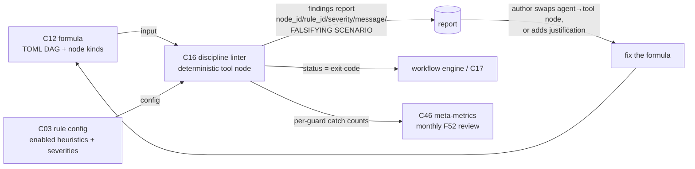

# C16 — Discipline linter (LLM-where-tool) (`discipline-linter`)  (Spec, canonical track)

> Source: README §"Principle 4 — Deterministic-first" (line 154 "Tool nodes are cheap and reproducible. Most steps don't need a model. Use models only where reasoning is required."; line 160 the "Discipline tooling" row — "Catches LLM-where-tool-suffices — Custom: linter pack that flags LLM nodes without justification — n/a (your work) — Gas City pack"; line 162 "P4 is native. The discipline-enforcement linter is a small add."); F-MODE-COVERAGE §8 Cautions (line 100, **F52 Tempting-Wrong-Hybrid**: "P4 (deterministic-first) could become discipline-without-purpose" → guard "**every deterministic guard must point at a specific scenario it catches, with measurable false-positive rate. No guard without a falsifying scenario. Counts of catches per guard reviewed monthly.**"), and §12 rec 1 (line 170 "Add F52 discipline as a Phase 0 requirement … No guard without a falsifying scenario"); component-inventory C16 row (line 28: subsystem Workflow Engine; kind component; maps **A36b, B31, B75**; depends **C12**; gap **G18**; foundational no). A-ID detail: component-inventory-A A36b (line 73 "Flags LLM nodes used where deterministic tool suffices … Each guard must cite a falsifying scenario"); component-inventory-B B31 (line 43 "Flags LLM nodes lacking justification; enforces deterministic-first") + B75 (line 87, the F52 caution: "Guard: every guard points at a falsifying scenario, reviewed monthly"). Sibling specs: `spec/C12-formula-pipeline-file.md` §3.1 (the formula's **node-kind set** `{agent, tool, gate, sub_formula}` C16 keys on — "The discipline linter C16 (F52, P4) … key on this distinction"; **D-7**), `spec/C15-workflow-linter.md` (the *structural* formula linter, a sibling not C16), `spec/C17-tool-node-abstraction.md` (the deterministic-node abstraction C16 is built as, and the `tool` kind it argues a node could be), `spec/C10-spec-linter-ears.md` (the analogous deterministic LINTER pattern over *specs*).
> Inventory ID: C16   Kind: component (deterministic tool node)   Status: sweep-1
> Track: canonical

## 1. Purpose & responsibility

C16 is the **discipline linter (LLM-where-tool)**: a deterministic checker that reads a C12 **formula**
(the TOML DAG) and flags **`agent` / LLM nodes used where a deterministic `tool` node would suffice** —
"LLM nodes without justification" (README:160). It is the small custom enforcement add P4 names
("Discipline tooling … Catches LLM-where-tool-suffices … linter pack … Gas City pack", README:160, 162),
built as a **deterministic tool node** itself (C17 over the C02 ABI; **no model call** — a linter that
enforces deterministic-first must itself be deterministic).

Its single reason to exist is one **caution**, not a failure mode v4 "addresses":

- **F52 — Tempting-Wrong-Hybrid (deterministic-wrapping reflex).** v4's emphasis on self-healing (P11) and
  self-optimization (P12) is "exactly the 'more controller patches' trap Schillace names. P4
  (deterministic-first) could become discipline-without-purpose" (F-MODE:100). C16 is the **explicit
  discipline** that guard names: it makes "use models only where reasoning is required" (README:154) a
  *checkable property of a formula* rather than operator goodwill, so deterministic-first does not erode as
  formulas accrete `agent` nodes that a tool could have served.

**The key invariant (reflexive F52 discipline).** F52's guard is "**No guard without a falsifying
scenario**" (F-MODE:100, :170) — and C16 is itself a guard. Therefore **every finding C16 emits MUST cite a
falsifying scenario**: a concrete, checkable statement of *what input would prove the LLM node is actually
needed* (i.e., what reasoning the deterministic tool cannot do). A C16 finding with no falsifying scenario
is itself the F52 trap (discipline-without-purpose) and is invalid by construction (INV-2). This — not the
flag itself — is C16's load-bearing contribution; the bare "this looks like it could be a tool" heuristic
is cheap and worthless without the falsifying-scenario obligation that makes each guard *reviewable* (the
monthly catch-count review, F-MODE:100, is the human side of the same loop).

**Responsibilities**
- Read a C12 formula and, for each **`agent`/LLM node** (kind from C12's node-kind set — **D-7**), apply a
  fixed set of **deterministic heuristics** for "a `tool` node would suffice here" (e.g. the node's prompt is
  a pure string/format transform, a lookup, a deterministic validation, or carries no reasoning verb).
- For each flag, **require and surface a falsifying scenario** — the node passes if a justification is
  present (an author-supplied "why a model is required here" annotation) OR if no heuristic fires; it is
  flagged only when a heuristic fires AND no justification rebuts it. The finding text states the scenario
  that would falsify the flag.
- Emit a **structured findings report** (node id, rule id, severity, message, **falsifying-scenario**) and a
  **status** the workflow engine reads (advisory by default; per the C17/C02 contract, exit code = status).
- Be **reproducible**: same formula + same rule set ⇒ identical findings, no model call (the C17 determinism
  contract; README:154).
- Surface **per-guard catch counts** as a meta-metric input so the monthly F52 review (F-MODE:100) has data.

**What C16 is NOT**
- NOT the **workflow / structural linter** (C15). C15 lints the formula's *structure/well-formedness* (cycles,
  dangling edges, schema). C16 lints one *semantic-discipline* property — "is this node an LLM where a tool
  would do". Same input (the C12 formula), different question; C15 ≠ C16.
- NOT the **spec linter** (C10). C10 lints *specs* (prose, EARS/INCOSE). C16 lints *formulas* (the DAG). The
  analogy is the LINTER *pattern* (deterministic, no-model, advisory), not the input surface.
- NOT the **owner of the node-kind taxonomy** (C12). The set `{agent, tool, gate, sub_formula}` is **C12's**
  vocabulary (C12 §3.1; **D-7**); C16 *consumes* the `agent`/`tool` distinction, it does not define it.
- NOT a **model-based / semantic reviewer.** C16 makes no model call; it cannot *prove* a node needs no
  reasoning — it raises a falsifiable flag a human (or the author's justification) resolves. It catches the
  deterministically-suspicious cases, not "every misuse" (consistent with F52 being a **caution/discipline**,
  not an "Addressed" mode).
- NOT a **hard gate by default.** The guard is **discipline**, not a correctness wall: default disposition is
  **advisory** (warn, surface the falsifying scenario, feed the monthly review); blocking is per-rule C03
  config (INV-3; §3.4).
- NOT the **self-healing-loop termination / loop-closure policy.** The numeric "N fix-attempts → escalate",
  oscillation detection, and L5 ship-authorization policy are **G18** and belong to **C39** (per ledger
  **XC-3**), not C16 — see §6 / OQ-G18. C16 guards the *static* LLM-vs-tool discipline (the F52 caution's
  linter half); it does not bound the *runtime* heal loop.

## 2. Context & dependencies

| Direction | Component | Relationship (source) |
|---|---|---|
| Upstream (input artifact) | **C12** formula | C16's input surface is the C12 TOML DAG; it keys on C12's per-node **kind** tag (`agent` vs `tool`). C12 §3.1 names C16 explicitly: "The discipline linter C16 (F52, P4) … key on this distinction." The **single inventory dependency** (C16 row: `Depends on → C12`). |
| Upstream (node-kind taxonomy) | **C12** node-kind set | The `{agent, tool, gate, sub_formula}` set is **C12-owned** (**D-7**); C16 references it, does not redefine it. Same component as the input dep — listed separately to mark the taxonomy boundary. |
| Upstream (built-as) | **C17** tool-node abstraction | C16 is itself "a tool node" built over C17's deterministic-node abstraction (a linter pack with no model call), invoked through the C02 ABI. The `tool` kind C16 argues a flagged node *could* be is C17's. |
| Upstream (wire/pack) | **C02** pack/tool-node ABI | The Gas City pack + subprocess declaration C16's binary is invoked through (README:160 "Gas City pack"; via C17). Derived, not an inventory edge. |
| Upstream (config) | **C03** config/feature-flags | Whether C16 runs, its per-rule severities, and blocking disposition are layered TOML config — it is a "small add" (README:162). Derived, not an inventory edge. |
| Downstream (consumes findings) | formula-authoring loop / **C39** fix-task | Findings route to the author (or fix-task loop) to revise the **formula** — swap an `agent` node for a `tool` node, or add the justifying falsifying-scenario annotation. |
| Lateral (meta-metric) | **C46** meta-metrics | Per-guard catch counts feed the **monthly F52 review** (F-MODE:100). C46 owns the metric store; C16 emits the count as an actor action (a bead), like any tool node. |
| Lateral (sibling linter, NOT a dep) | **C15** workflow linter | Same input (C12 formula), complementary question (structure vs. LLM-discipline). Run together over a formula; not coupled. |

> **Dependency-footprint note (fidelity).** The C16 inventory row states a single *formal* dependency:
> **C12** (`Depends on → C12`). C17/C02 (the tool-node abstraction + ABI C16 is built *as*) and C03 (the
> enable/severity config) are **derived/soft** upstreams this reading introduces — each traced through the
> *other* component's doc, not asserted as an inventory edge. Read the table as "C12 = stated dependency;
> the rest = consistent-elaboration upstreams (the same shape as the C10 linter)."

C16 is **not foundational** (inventory: no) and lives in **Batch 3** (component-inventory line 111, listed
alongside C14/C15/C18), because it depends on the **Batch 2** artifact **C12** (formula format, incl. its
node-kind set) and the C17/C02 tool-node abstraction being frozen first.

## 3. Interfaces / contracts

Sweep 1 — interfaces **named and described**; concrete signatures / rule-table / annotation schema deferred
to sweep 2.

### 3.1 Inbound: how C16 is invoked
C16 is invoked as a **deterministic tool node** (C17) inside a formula (typically a formula-authoring or
CI check), or run standalone as a CLI/pack binary. Per the C17/C02 contract it receives (sweep-1 named):

| Input | Description | Source |
|---|---|---|
| Formula path(s) | The C12 TOML DAG to lint — one formula per invocation; the declared input placeholder a node substitutes (e.g. `{formula_path}`). | C12 §3.1; C17 §3.1 declared inputs |
| Node-kind data | Read from the formula itself: each node's **kind** (`agent`/`tool`/…) from C12's node-kind set (**D-7**). Not a separate input — it is a field of the formula. | C12 §3.1 node-kind row |
| Justification annotations | The author's "why a model is required here" markers on `agent` nodes (the rebuttal that clears a flag). Read from the formula (a per-node field/comment). | §3.3 fill; README:154 "where reasoning is required" |
| Rule config | Which heuristics are enabled, their severities, and blocking disposition (layered TOML, C03). "Small add" ⇒ enable/severity is config-driven. | README:160, 162; C03 |

### 3.2 Outbound: what C16 produces
- **Findings report** (structured): a list of findings, each with `node_id`, `rule_id`, `severity`
  (e.g. error|warning|info), a human-readable `message`, and — mandatorily — a **`falsifying_scenario`**: the
  concrete statement of what would prove the LLM node *is* needed (the F52 obligation, §1). Surfaced as the
  tool node's **declared output** (a partition file and/or structured result, per C17 §3.1 / C02 §3.3).
- **Status**: success/failure as the C02 **exit code**, which the workflow engine reads to advance or block
  (C17 §3.1 status). "Findings present → nonzero exit" is governed by the blocking disposition (§3.4),
  default advisory.
- **Per-guard catch count**: a count, per `rule_id`, of how often each guard fired — the **monthly-review**
  meta-metric (F-MODE:100), fed to C46. Emitted as part of the run record (bead), not a separate store.

> [FAITHFUL-FILL] **Findings-report shape, incl. the mandatory `falsifying_scenario` field.** v4 names no
> report schema. The field set is the minimal consistent elaboration of F-MODE:100's literal requirement
> ("every guard must point at a specific scenario it catches … No guard without a falsifying scenario") plus
> the universal lint shape (rule-id + location + message, as on the analogous C10 linter). Making
> `falsifying_scenario` a **required field of every finding** is the faithful way to make "no guard without a
> falsifying scenario" structurally enforced rather than a slogan. The exact serialization (JSON/SARIF/text)
> is deferred to sweep 2, constrained only by the C02 output ABI; no format is pre-selected.

### 3.3 The heuristic set ("a tool node would suffice here")
C16's substance is a **fixed, ordered, deterministic heuristic set** over `agent` nodes. v4 names the
*property* ("LLM nodes without justification", README:160) but not the individual checks; faithfully, the
set is the deterministically-detectable signals that a node carries **no reasoning** (README:154 "use models
only where reasoning is required"). Candidate heuristics (the concrete per-rule table is **sweep-2**):

1. **Pure transform / format.** The node's task is a string/format/serialization transform a deterministic
   tool does losslessly (e.g. "convert TOML→DOT", "extract field X", "reformat as JSON") — flag: a `tool`
   node (or an existing C17 instance) suffices.
2. **Lookup / table.** The task is a finite lookup or table mapping with no judgement — flag.
3. **Deterministic validation / lint.** The task is a check expressible as a deterministic rule (the thing
   C10/C15 *are*) — flag: it should be a deterministic linter node, not a model.
4. **No reasoning verb / trivially-bounded output.** The prompt contains none of the reasoning markers (no
   "decide/judge/diagnose/design/choose-among") and produces a bounded mechanical output — flag, low
   severity.

> [FAITHFUL-FILL] **The heuristics are named by *property*, not enumerated in v4.** README:160 states the
> property ("flags LLM nodes without justification") and README:154 the principle ("models only where
> reasoning is required") but lists no checks. The faithful elaboration is the small set above — each a
> *deterministically-detectable* signal of "no reasoning" — with the concrete per-heuristic detector +
> severity + false-positive measurement as a **sweep-2** deliverable. Listing exhaustive heuristics here
> would invent v4 content; naming the property + a minimal seed set and deferring the table is the minimal
> consistent choice. Because the property is genuinely heuristic (a deterministic tool cannot *prove* "no
> reasoning needed"), **each flag is falsifiable by design** — which is precisely why the
> `falsifying_scenario` field and the author-justification rebuttal (not a hard verdict) are load-bearing.

> [FAITHFUL-FILL] **Justification = an author annotation that clears a flag.** README:160 says "without
> justification" — implying a *with-justification* path. v4 specifies no annotation format. The minimal
> consistent reading: an `agent` node may carry a short author "why a model is required here" marker (a
> per-node field/comment in the C12 formula); when present and non-empty, it **rebuts** the heuristic
> (the node is not flagged, or is downgraded to info "justified"). The marker's exact on-disk home is a C12
> formula-field question (→ C12 / sweep-2), parallel to the node-kind field home (C12 §3.1 [FAITHFUL-FILL]).
> This keeps C16 from re-litigating justified nodes every run and gives the monthly review a paper trail.

### 3.4 Invariants
- **INV-1 (deterministic).** Same formula + same enabled heuristic set ⇒ byte-identical findings. C16 makes
  no model call and reads no clock/network (C17 determinism contract; README:154). A linter that enforces
  deterministic-first must itself be deterministic.
- **INV-2 (no guard without a falsifying scenario).** Every emitted finding carries a non-empty
  `falsifying_scenario` (§1, §3.2; F-MODE:100). A finding without one is invalid and must not ship — this is
  the reflexive F52 discipline applied to C16 itself.
- **INV-3 (advisory by default / config-gated severity).** Because P4's discipline tooling is a "small add"
  and the F52 guard is *discipline* not a correctness wall, C16's **default** posture is **advisory** (emit
  findings + falsifying scenarios; do not hard-block); whether a heuristic class blocks is C03 config.
- **INV-4 (read-only).** C16 never mutates the formula — it emits findings; fixing the formula (swap node, or
  add justification) is a human/fix-task action.
- **INV-5 (no taxonomy ownership).** C16 reads but does not define the node-kind set; the set is C12's
  (**D-7**). If C12's set changes, C16 follows.

## 4. Data model / state

C16 is a **stateless deterministic tool**; it owns **no persistent store**.

| Aspect | Faithful spec (source) |
|---|---|
| Inputs (read-only) | The C12 formula (TOML), incl. per-node `kind` + author justification annotations + rule config (C03 TOML). |
| Owned config artifact | The **heuristic-set definition** (which checks exist, default severities). Ships *inside C16's pack* (README:160 "linter pack … Gas City pack"). > [FAITHFUL-FILL]: v4 names no separate rule-config file; minimal-consistent home is the linter pack's own TOML/embedded rule table, loaded like any pack config. C16 introduces no new shared on-disk artifact (consistent with C17 "no new on-disk artifact"). |
| Outputs (transient) | The findings report (incl. `falsifying_scenario` per finding) + per-guard catch counts, written to the tool node's `work_partition` and/or returned, per C02. Durability of a *run's* findings/counts is the bead/CXDB record (C19–C21) + the C46 meta-metric, not C16. |
| Per-run state | None retained between runs (INV-1). The **monthly catch-count trend** lives in C46, not in C16. |

## 5. Behavior

Key flow (sweep-1 narrative; sequence diagram at sweep 2):
1. A formula node (or authoring/CI CLI) invokes C16 with a formula path and rule config.
2. C16 parses the TOML DAG, and for each **`agent`/LLM node** (kind per C12, **D-7**) applies the **ordered
   heuristic set** (§3.3) — deterministically, no model call.
3. For each node where a heuristic fires AND no author **justification** rebuts it (§3.3), C16 emits a
   finding carrying a **falsifying scenario** (INV-2). It also tallies the **per-guard catch count**.
4. C16 emits the **findings report** + counts, and sets **status** per the blocking disposition (§3.4):
   advisory by default (zero exit + findings reported), nonzero only if a config-enabled blocking heuristic
   fired.
5. The workflow engine reads status (advance/block); findings route to the author/fix-task to revise the
   **formula** (swap node, or add justification), then re-lint. Catch counts flow to C46 for the **monthly
   F52 review** (F-MODE:100).

## 6. Failure modes & handling

| F-mode | Relevance to C16 | Handling (faithful) |
|---|---|---|
| **F52** Tempting-Wrong-Hybrid | C16 **is** the explicit-discipline guard this caution names (the linter half; F-MODE:100, :170). | Flag `agent` nodes where a `tool` suffices, each with a **falsifying scenario** (INV-2); feed per-guard catch counts to the **monthly review** (C46). This is a **caution/discipline**, not "Addressed": C16 cannot prove every misuse — it raises falsifiable flags. The reflexive risk (C16 itself becoming discipline-without-purpose) is exactly what INV-2 + the monthly catch-count review guard against. |
| **No-reasoning false positive** | A node legitimately needs a model but trips a heuristic. | The author **justification** annotation (§3.3) rebuts the flag; the finding's `falsifying_scenario` is precisely the prompt for that rebuttal. False-positive *rate* per heuristic is measured (F-MODE:100 "measurable false-positive rate") and tuned at sweep 2. Advisory default (INV-3) means a false positive never silently blocks. |
| **Un-parseable / malformed formula** | A formula C16 cannot parse (that is C15's structural job). | C16 defers structure to C15: on a parse failure it surfaces a low-severity "could not analyse node-discipline (formula did not parse — see C15)" note rather than asserting LLM-discipline findings. > [FAITHFUL-FILL]: v4 specifies no behavior; graceful degradation (don't double-own C15's structural errors) is minimal-consistent. |
| **Node-kind set drift** | C12 changes/extends the node-kind set. | C16 follows C12 (INV-5; **D-7**); the heuristic set keys on the *current* C12 set, no local copy. |

**G18 routing (not a C16 failure mode).** Inventory lists **G18** against C16, but per the brief, ledger
**XC-3**, and the gap's own text, C16 owns **only the LLM-vs-tool DISCIPLINE** portion of the F52 family.
The **self-healing-loop numeric termination policy** — *how many fix-attempts before escalation, oscillation
(a fix that creates a new anomaly), and L5 ship-authorization* — is **owned by C39** (`fix-task-loop-closure`;
inventory C39 row carries G18; XC-3 "the numeric policy … is deferred to C39"). C16 **routes it there and
does not build it here.** The two are different surfaces: C16 is a **static** linter over a formula
(design-time "is this node an LLM where a tool would do"); C39's policy is a **runtime** bound on the heal
loop (how many times the Healer may retry before escalating). Both descend from the same F52 "more
controller patches" worry, which is why the gap was provisionally tagged here — but the linter half (C16)
and the loop-bound half (C39) are cleanly separable (the loop "without human intervention" is README:248).
See OQ-G18.

## 7. Cross-cutting (security / cost / scale / observability / ops)

- **Security.** As a C17/C02 subprocess tool node, C16 runs in its `work_partition`, read-only over the
  formula; it carries **no model-prompt-injection surface** (it makes no model call — the P4 reason no-model
  guards are primary; C17 §7).
- **Cost / scale.** **Zero token cost** (no model call) — "tool nodes are cheap and reproducible"
  (README:154). Cost is process-startup + a linear pass over the formula's nodes; negligible per formula.
- **Observability.** A C16 run is an actor action: it lands as a bead (C19/C20) carrying `created_by` (C41)
  on the event bus (C23), like any tool node. **Per-guard catch counts are the explicit observability
  contract** for the F52 monthly review (F-MODE:100) — they are the input C46 aggregates.
- **Ops / transfusion.** README:160 marks C16's source as "n/a (your work)" — unlike C10 there is **no
  obvious OSS EARS-style corpus to transfuse**; C16's heuristics are custom-small. The pack is "your work":
  a small Gas City pack, not a dependency. (No `transfused_from` expected; confirm at sweep 2.)

## 8. Acceptance criteria & test strategy

Sweep-1 high-level criteria (concrete test cases at sweep 2):
1. **AC-1 (flags LLM-where-tool).** Given a formula with an `agent` node whose task is a pure transform /
   lookup / deterministic validation (and no justification), C16 produces a finding naming that node
   (README:160).
2. **AC-2 (every finding cites a falsifying scenario).** Every finding C16 emits carries a non-empty
   `falsifying_scenario`; a build of C16 that can emit a finding without one fails its own acceptance
   (INV-2; F-MODE:100). **This is the load-bearing AC.**
3. **AC-3 (justification rebuts).** An `agent` node that *would* trip a heuristic but carries a non-empty
   author justification produces **no** error finding (at most an info "justified") (§3.3; README:160
   "without justification").
4. **AC-4 (deterministic, no model call).** Same formula + same heuristic set ⇒ byte-identical findings,
   with no model call (INV-1; README:154).
5. **AC-5 (read-only).** C16 never mutates the formula (INV-4).
6. **AC-6 (advisory / blocking config).** With advisory config (default), findings present ⇒ zero exit
   (report only); with a heuristic class opted into blocking (C03), a matching finding ⇒ nonzero exit the
   workflow engine treats as a block (§3.4; INV-3).
7. **AC-7 (catch-count meta-metric).** A C16 run emits per-`rule_id` catch counts consumable by C46 for the
   monthly F52 review (F-MODE:100; §3.2).
8. **AC-8 (no taxonomy ownership / G18 routed).** C16 keys on C12's node-kind set without redefining it
   (**D-7**; INV-5), and emits **no** self-healing-loop termination/oscillation/L5-ship policy — that is
   C39's (G18 / XC-3; §6).
9. **AC-9 (built as a tool node).** C16 is invoked through the C17 deterministic-node abstraction over the
   C02 ABI (declared inputs → status + declared outputs), with no per-language workflow code (C17 §3).

Test strategy (sweep-1): a **positive corpus** (formula with an obvious LLM-where-tool node → one finding,
each with a falsifying scenario), a **justified corpus** (same node + justification → no error), a
**clean corpus** (all nodes correctly typed → zero findings), a **determinism** test (run twice, diff
findings), a **blocking-config** matrix, and a **reflexive-discipline** test asserting no finding can be
emitted without a falsifying scenario (AC-2). Concrete per-heuristic fixtures + false-positive-rate
measurement deferred to sweep 2 alongside the heuristic→detector table.

## 9. Open questions

(Mirrored into `_meta/review-log.md`.)

1. **[top open question] OQ-G18 — confirm C39 owns the heal-loop numeric policy (G18 routing).** Inventory
   tags **G18** against C16, but C16 builds only the LLM-vs-tool **linter** half; the numeric
   termination/oscillation/L5-ship policy is routed to **C39** per ledger **XC-3** ("Confirm C39 owns it").
   Sweep 2 must confirm with C39 (and possibly C18) that the routing holds and that C16 carries **none** of
   the loop-bound policy — only the static design-time discipline. If C39/C18 disclaim it, G18 needs a new
   home; it does **not** revert to C16.
2. **OQ-1 — blocking vs. advisory disposition.** P4 calls the discipline tooling a "small add"; sweep-1 picks
   **advisory-by-default, blocking-by-config** (mirrors C10 OQ-1). Should *any* heuristic class block by
   default, given F52 is a **caution/discipline**, not a correctness gate? Integrator/C03 call.
3. **OQ-2 — the concrete heuristic table + false-positive measurement.** README names the *property*, not the
   checks (§3.3 fill). The per-heuristic detector + severity + the **"measurable false-positive rate"**
   F-MODE:100 mandates is a sweep-2 deliverable; which heuristics are reliably mechanical vs. noisy must be
   enumerated and measured.
4. **OQ-3 — justification-annotation home (with C12).** The author "why a model is required here" marker
   (§3.3 fill) is a per-node field/comment whose on-disk home is a **C12 formula-field** question (parallel
   to C12's node-kind field-home [FAITHFUL-FILL], C12 §3.1 / G11). Resolve with C12 at sweep 2; C16 reads
   whatever field C12 standardizes.
5. **OQ-4 — findings serialization.** JSON vs. SARIF vs. text for the report incl. the `falsifying_scenario`
   field (§3.2 fill) — equal candidates, constrained only by the C02 output ABI; pick at sweep 2.
