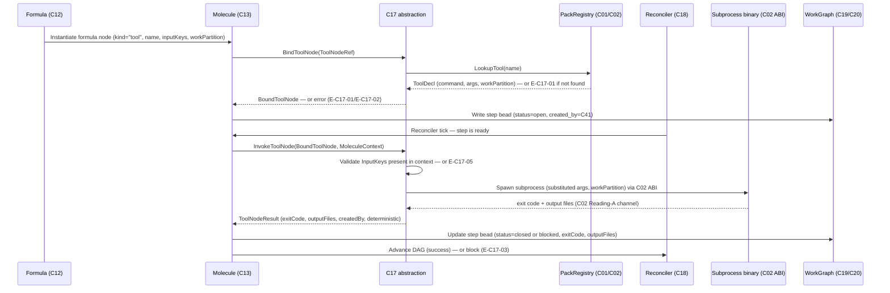

# C17 — Tool-Node Abstraction  (Spec, canonical track)

> Source: README §"Principle 4 — Deterministic-first" (lines 152–162; the "Tool node abstraction" row line 158 "Gas City native — tool beads … Native", and line 154 "Tool nodes are cheap and reproducible. Most steps don't need a model. Use models only where reasoning is required."), README §Part 3.1 "P4 (deterministic-first): reconciler + tool-node primitives available" (line 370), README §13.3-equivalent tool sketches (Inspect AI subprocess line 599, bridge line 389, satisfaction aggregator line 426). AI-CONTEXT §3.2 "nine concepts" concept 7 Formulas+Molecules / concept 9 Health Patrol (lines 91, 93), §3.5 P4 strength row "Strong (reconciler + tool nodes)" (line 69), §13.3 `[[tool]]` subprocess sketch (lines 599–608). F-MODE-COVERAGE F51 (Ashby-deficient probabilistic guard; line 76) and F52 (tempting-wrong-hybrid / deterministic-without-purpose; line 100). component-inventory C17 row (deps C02; gap G29; foundational yes); component-inventory-A A35 (Tool node abstraction; RM P4, AC §3.2), A17 (P4 deterministic-first cross-cutting). C02 spec `spec/C02-pack-extension-abi.md` (the ABI C17 is realized over).
> Inventory ID: C17   Kind: component   Status: sweep-2
> Track: A (faithful)
> Binding decisions obeyed: **D-7** (formula node-kind taxonomy home = C12; `tool` kind is C12's vocabulary; C17/C02 reference it, do not redefine the set). **D-6** (canonical track).

> [D-23 substrate-verified — gascity-prototype@b14c278, 2026-05-25] Substrate facts that underwrite this spec: **(F6)** `gc start` reconciles desired-vs-running agents; the reconciler is the engine that invokes tool nodes inside a running city. **(F7)** Phase-0 provider-kind = tmux; each agent = one interactive `claude` pane — this is the agent-node kind C17 explicitly excludes. **(F8)** inter-agent coordination passes through the bead store; a tool node's output likewise lands as a bead (C19/C20). **(F10)** bead prefix is the scoping mechanism for `work_partition` isolation; enforcement strength OPEN (prevent-vs-detect-OPEN). The `[[tool]] type="subprocess"` sketch from AI-CONTEXT §13.3 is the only verified native shape for a tool node invocation — all C17 signatures are built against it. Anything beyond args+partition-files+exit-code is `[needs G11 verification]`.

## 1. Purpose & responsibility

C17 is the **unified workflow-engine view of a deterministic step**: the single abstraction the v4
Workflow Engine uses for "a step that doesn't need a model." In Gas City terms this is a **tool bead /
tool node** (README:158 "Tool node abstraction — Unified interface for deterministic steps — Gas City
native — tool beads — Native"). It is the realization, inside formulas and molecules, of **Principle 4
(deterministic-first)**: "Tool nodes are cheap and reproducible. Most steps don't need a model. Use models
only where reasoning is required." (README:154; AI-CONTEXT §3.5 P4 = "Strong (reconciler + tool nodes)").

Where **C02** owns the *wire protocol + bundle format* for a subprocess tool node (the `[[tool]]`
declaration and the input/output/status ABI — the G29 seam), **C17 owns the workflow-engine abstraction
over that protocol**: how a deterministic step is named, placed in a formula/molecule (C12/C13), bound to
a concrete tool-node implementation, invoked by the reconciler/dispatch path, and how its result advances
the work graph. C17 is the contract that lets a formula author write "this node is deterministic" without
caring whether the binary is Go, Python, or a CLI, and without re-implementing the C02 ABI per node.

**Responsibilities**
- Define the **tool-node abstraction**: the logical shape of a deterministic workflow step — its identity
  (`name`), its bound implementation (a C02 `[[tool]]` subprocess), its declared inputs/outputs (the
  placeholder context it consumes and the partition/result it produces), and its **determinism contract**
  (same inputs → same outputs; no model call; reproducible).
- Provide the **uniform interface** that formulas (C12) and molecules (C13) use to reference a deterministic
  step, so a node can be placed in a DAG identically regardless of the tool's implementation language
  (README:253–255 Python tool nodes; README:426 Go tool node; README:170 Inspect-AI CLI as tool node).
- Establish the **node-kind boundary**: a *tool node* is the deterministic kind; an *LLM/agent node* (a
  step that calls a model) is a **different node kind** and is out of C17's scope. C17 is the surface P4's
  discipline tooling (C16 / A36b) checks against — "is this LLM node really necessary, or would a tool node
  suffice?" (README:160 "Discipline tooling — Catches LLM-where-tool-suffices"; F-MODE F52).
- Carry the **determinism / reproducibility invariant** that makes a tool node the *primary* guard in the
  deterministic-first posture (A17; F-MODE F51 "deterministic boundary typing is the primary guard;
  LLM-judge is secondary").

**Explicitly NOT**
- NOT the **subprocess ABI / pack bundle** (C02). C02 defines *how* a tool-node binary is declared and
  exchanges bytes; C17 defines the *workflow abstraction* that binds a deterministic step to such a binary.
  C17 **depends on** C02; it does not redefine the wire protocol.
- NOT the **Gas City substrate / executor** (C01). C01's reconciler + tool-bead executor *run* a tool node;
  C17 is the abstraction they execute, not the engine.
- NOT the **formula format** (C12) or the **molecule** runtime (C13). C17 is referenced *by* a formula node;
  it does not own the DAG template or the instantiated bead-tree.
- NOT an **LLM / agent node**. Model-calling steps are a different node kind (owned by the session/provider
  + model-floor side, C04/C28/C29). C17's whole point is to be the *non-model* alternative.
- NOT the **reconciler / Health Patrol** (C18). C18 decides *when* to (re)run a node and handles
  convergence/retry; C17 defines *what a node is*.
- NOT the individual deterministic tools themselves (the EARS spec linter C10, the workflow/discipline
  linters C15/C16, the CXDB bridge C24, the satisfaction aggregator, the anomaly/embedding/clustering
  Python nodes). Each of those is *a* tool node — an instance built against C17's abstraction and C02's ABI.

## 2. Context & dependencies

| Direction | Component | Relationship |
|---|---|---|
| Upstream (depends on) | **C02** pack/tool-node ABI | C17's abstraction is realized over C02's `[[tool]] type="subprocess"` declaration + input/output/status ABI (the G29 seam). C17 = workflow view; C02 = wire protocol. |
| Upstream (runtime) | **C01** Gas City substrate | C01's reconciler + tool-bead executor spawn and run the subprocess a C17 node binds to. |
| Upstream (terms) | **C07** vocabulary-glossary | Canonical meaning of `tool bead`/`tool node`, `formula`, `molecule`, `bead` (G06). |
| Downstream (places nodes) | **C12** formula format, **C13** molecule | A formula DAG references a C17 deterministic node; a molecule instantiates it as a bead. |
| Downstream (disciplines on it) | **C16** discipline linter (A36b), **C15** workflow linter | C16 flags LLM nodes that should be C17 tool nodes (F52); C15 lints the formula structure that places them. |
| Downstream (instances — "a tool node") | **C24** CXDB bridge, **C30/C31** scenario store/runner, **C10** EARS spec linter, **C33** satisfaction aggregator, **C44** digital twin, and every component the inventory marks "tool node" / "Python tool node" | Each is built *as* a C17 deterministic node over the C02 ABI. The inventory routes C30, C31, C44 explicitly through C17 as a dependency. (C32 the LLM-judge is *not* a C17 tool node — it is a model-calling step, the node kind C17 explicitly excludes.) |

C17 is **foundational** (inventory: yes) and lives in **Batch 1**, authored in parallel with C02/C01
because nearly every deterministic step in the factory is "a C17 tool node."

## 3. Interfaces / contracts

Sweep 1 — interfaces **named and described**; concrete signatures/schemas deferred to sweep 2.

### 3.1 The tool-node abstraction (the unified interface)

A **tool node** is a workflow step described by these named elements (sweep-1 descriptions; the wire-level
realization of inputs/outputs/status is C02's, referenced, not redefined):

| Element | Description | Source / fill |
|---|---|---|
| `name` (node identity) | The logical identity a formula/molecule references when placing the step. Resolves to a C02 `[[tool]]` of the same `name`. | README:158; C02 §3.2 `name` |
| `kind = deterministic` | Declares this is a tool node, not a model/agent node. The node-kind tag the discipline linter (C16/F52) keys on. | > [FAITHFUL-FILL] |
| Bound implementation | The C02 `[[tool]] type="subprocess"` (command/args/work_partition) the node executes. | C02 §3.2 |
| Declared inputs | The placeholder context the node consumes (e.g. `{scenario_path}`, `{task}`), drawn from the molecule/bead context and substituted into C02 `args` (+ optional stdin in C02's JSON profile). | AI-CONTEXT §13.3; C02 §3.2 |
| Declared outputs | What the node produces back to the work graph: files in its `work_partition` and/or a structured result, surfaced to the molecule as the step's product. | C02 §3.2; C02 §3.3 |
| Status | Success/failure of the step = the C02 exit-code status; the workflow engine reads it to advance or block the DAG. | C02 §3.2 (exit code) |
| **Determinism contract** | Same declared inputs ⇒ same declared outputs; no model call; reproducible. The invariant that makes the node a valid P4 deterministic guard. | README:154; A17; F51 |

> [FAITHFUL-FILL] **`kind = deterministic` tag.** v4 names "tool node" and "LLM node" as distinct (README
> contrasts deterministic tool nodes vs. model steps, and C16/A36b's whole job is "catches
> LLM-where-tool-suffices"), but the four docs never give the explicit node-kind field. The minimal
> faithful fill is a single node-kind tag distinguishing `deterministic` (tool node) from the model/agent
> kind, because the discipline linter (F52) cannot fire without a machine-readable distinction. C17 only
> *names* the tag; the enforcement policy is C16's.
> *Consistency note:* C02-faithful §3.2 already states a "deterministic-first" tool-node invariant for the
> same concept at the ABI layer. The two fills are the same distinction at different layers; the tag's
> *home* (the C12 formula-node entry vs. the C02 `[[tool]]` block — **not** a C17-owned new file) is the
> open reconciliation, tracked as OQ-2 with C12/C16.

**D-7 citation (verbatim, required — binding):**

> **D-7 — Formula node-kind taxonomy home = C12.** The node-kind set (agent/tool/gate/sub_formula) is named by C12 as the formula DAG's own vocabulary; C02 references C12's `tool` kind for the tool-node ABI but does not redefine the set. Sweep-1 FAITHFUL-FILL; authoritative list awaits real `gc` grammar (G11/Sweep-2). (from C12 deferred)

C17's consequence: the field `kind` on a formula DAG node that selects the `tool` kind is **C12's
vocabulary**, not a C17-owned enum. C17 references C12's `tool` value to declare the determinism contract
over it; C17 does NOT define the full set `{agent, tool, gate, sub_formula}` — that list is C12's. If C12
adds a new node kind, C17 is unaffected unless the new kind has a determinism claim. [needs G11
verification for the on-disk field name/shape; C12:OQ-4 is the authoritative freeze point.]

### 3.2 Inbound: how a formula/molecule references a C17 node

A formula DAG node (C12) that is deterministic references a tool node **by `name`**; instantiation (C13)
binds that name to the C02 `[[tool]]` and supplies the molecule context that feeds the declared inputs.
The contract C17 freezes for C12/C13 is: *a deterministic node is referenced uniformly by name + declared
inputs/outputs, independent of the bound binary's language*. This is the "unified interface" of README:158.

> [AMBIGUITY: G29] **Where the input/output/status realization lives.** Two faithful readings of the C17↔C02
> split: **Reading A** — C17 is a *thin naming/abstraction layer* and the entire I/O channel (args/files/
> exit-code, optional stdin/stdout-JSON) is C02's; C17 adds only node-kind + determinism semantics.
> **Reading B** — C17 *owns a workflow-facing input/output declaration* distinct from the ABI (which context
> keys a node fills) while C02 owns only the byte-level wire format.
> **Pick Reading A.** The *bytes and the I/O contract itself* are C02's (G29 is resolved there, in
> `spec/C02-pack-extension-abi.md` §3.2, which already enumerates the input/output/status channels
> as ABI elements). C17 adds only: the **node-kind** tag, the **determinism** semantics, and the **uniform
> by-name reference** a formula uses to place the step. C17 does **not** introduce a third "workflow-level
> I/O declaration" ownership band — *which placeholder keys a node fills* is the **C12** formula-node entry
> (the node's args/context binding), and *which bytes those become* is C02's ABI. Rationale: this is the
> only split that keeps C17 thin (consistent with §4/§8 "no new on-disk artifact / view-only"), avoids
> duplicating C02's already-resolved seam, and matches C02 scoping "NOT the tool-node abstraction as a
> workflow concept (C17)" while owning the wire contract. C17 therefore does **not** re-specify the wire
> bytes or a parallel I/O declaration; it cites C02 (bytes) and C12 (which placeholders a node fills).

**RESOLVED (Sweep-2): OQ-1 (C17↔C02 I/O split).** The split is confirmed as Reading A above. C02 §3.2
owns the wire bytes (args + partition files + exit code as the mandatory floor, stdin/stdout-JSON as the
optional structured profile). C17 owns the typed abstraction: `ToolNodeRef` (§3.4), `ToolNodeResult`
(§3.4), the determinism contract, and the by-name binding. Every downstream tool-node component (C24, C30,
C31, C33, C44) builds against C17's typed surface; C02's ABI shape is what their binary *speaks*, but the
formula references C17's `ToolNodeRef` by name and the reconciler delivers a `ToolNodeResult`. No third
declaration ownership band exists.

### 3.3 Outbound: what C17 guarantees to dependents

- To **C12/C13** (formula/molecule): a stable `ToolNodeRef` + `ToolNodeResult` contract — reference a
  deterministic step by name + typed inputs; receive a typed result — identical across implementation
  languages. (Concrete types: §3.4.)
- To **C16** (discipline linter): a machine-readable `kind = "tool"` node tag (C12's vocabulary, D-7) so
  "LLM node where a tool node would suffice" can be detected (F52).
- To **C18** (reconciler): a step whose success/failure is a clean `ToolNodeResult` signal and whose
  re-execution is *intended* to be safe because the node declares the determinism contract. (v4 specifies no
  runtime determinism check; safe re-run is the declared P4 payoff, enforced by the contract + C16/test —
  not a C17 runtime-checked guarantee. See §6 and OQ-3.)
- To **every tool-node component** (C24, C30–C33, C44, …): one abstraction to build against, so a new
  deterministic tool is "declare a `[[tool]]` (C02) + reference it as a `ToolNodeRef` (C17)," nothing more.

### 3.4 Concrete signatures (sweep-2)

These are the typed C17 surfaces — the **author-facing tool-node abstraction**. C02 owns the wire bytes;
C17 owns these typed wrappers the formula/molecule layer binds to.

```go
// ToolNodeRef — the typed reference a formula DAG node carries when kind="tool".
// The formula author writes this (C12 TOML node entry resolves to it); the molecule
// (C13) binds it to a C02 [[tool]] at instantiation time.
type ToolNodeRef struct {
    // Name matches the [[tool]] name in pack.toml exactly (C02 §3.2).
    // This is the resolution key: formula → ToolNodeRef.Name → C02 [[tool]].name.
    Name string

    // InputKeys is the declared set of {placeholder} names this node consumes
    // from the molecule/bead context (e.g. ["scenario_path", "task"]).
    // The C02 ABI substitutes these into args; C17 declares them at the abstraction level
    // so the formula can type-check the context before spawning.
    // [needs G11 verification — exact placeholder resolution rule vs real gc]
    InputKeys []string

    // WorkPartition is the C42 rig partition the subprocess runs against.
    // Faithfully carried from C02 [[tool]] work_partition; named here so the
    // formula layer can route the step without reading the [[tool]] block directly.
    WorkPartition string

    // DeterminismTag is always "deterministic" for a C17 tool node.
    // Provided to C16's discipline linter as a machine-readable node-kind signal (F52).
    // The broader kind set {agent, tool, gate, sub_formula} is C12's vocabulary (D-7).
    DeterminismTag string // = "deterministic"
}

// ToolNodeResult — what a completed tool-node execution surfaces to the molecule.
// C18 (reconciler) delivers this; C13 (molecule) reads it to advance the DAG.
type ToolNodeResult struct {
    // NodeName is the ToolNodeRef.Name that produced this result (traceability).
    NodeName string

    // ExitCode is the C02 exit-code status (0 = success, nonzero = failure).
    // This is the canonical success/failure signal; C18 reads it to advance or block.
    ExitCode int

    // OutputFiles lists the partition-relative paths written by the subprocess.
    // Faithfully maps C02's Reading-A "files in work_partition" output channel.
    // Empty on failure (nonzero ExitCode); presence does not imply semantic correctness.
    OutputFiles []string

    // CreatedBy is the actor attribution in C41 "kind:id" wire format (D-29).
    // Carries the tool-node invocation into the bead/event attribution chain (P9).
    CreatedBy string // e.g. "tool:inspect_eval"

    // Deterministic is true iff the node declared the determinism contract.
    // C18 uses this flag to decide whether safe re-run on identical inputs is valid.
    Deterministic bool
}

// BindToolNode resolves a ToolNodeRef to the C02 [[tool]] declaration and confirms
// the bound tool is registered in the pack. Returns an error if the name cannot
// be resolved (E-C17-01) or the work_partition is undeclared (E-C17-02).
// Called by C13 (molecule instantiation) before the step is scheduled.
func BindToolNode(ref ToolNodeRef, packRegistry PackRegistry) (BoundToolNode, error)

// InvokeToolNode executes a BoundToolNode with the given molecule context.
// Substitutes InputKeys from ctx into C02 args, spawns the subprocess in WorkPartition,
// and returns a ToolNodeResult. Returns E-C17-03 on nonzero exit, E-C17-04 on spawn
// failure, E-C17-05 on context-key mismatch. Called by C18 (reconciler).
func InvokeToolNode(bound BoundToolNode, ctx MoleculeContext) (ToolNodeResult, error)

// BoundToolNode is the resolved form of a ToolNodeRef — after BindToolNode confirms
// the C02 [[tool]] entry exists and the work_partition is declared.
type BoundToolNode struct {
    Ref        ToolNodeRef
    Command    string   // C02 [[tool]] command field
    Args       []string // C02 [[tool]] args with {placeholder} markers intact (substituted at invoke time)
}

// MoleculeContext is the key→value map the molecule supplies for {placeholder} substitution.
// Provided by C13; C17 validates that every ToolNodeRef.InputKey has a corresponding entry.
type MoleculeContext map[string]string

// PackRegistry is the C02 pack-loader view: resolves a tool name to a [[tool]] declaration.
// C01 provides this at runtime; C17 consumes it via BindToolNode.
type PackRegistry interface {
    LookupTool(name string) (ToolDecl, bool) // returns false → E-C17-01
}

// ToolDecl is C02's [[tool]] record as C17 sees it (read-only view; C02 owns the schema).
type ToolDecl struct {
    Name          string
    Command       string
    Args          []string
    WorkPartition string
}
```

> [FAITHFUL-FILL] **Signatures are inferred from the C02 §13.3 sketch + the G29 Reading-A floor.**
> v4 names no Go types or function signatures for the tool-node abstraction; the minimal faithful choice
> is the smallest typed wrapper that lets C13 bind by name and C18 receive a typed result, without
> adding a runtime mechanism v4 does not describe. `BindToolNode` + `InvokeToolNode` are the two action
> points the narrative §5 flow implies (bind at instantiation, invoke at reconciler tick); everything else
> is the minimal consistent data-carrier. Language is Go to match the Gas City substrate (Go 1.26.3, anchor
> §1). The `PackRegistry` interface is C01/C02-provided; C17 only declares what it reads from it.

### 3.5 Field table — ToolNodeRef and ToolNodeResult (sweep-2)

The two core data types in the C17 abstraction layer. Columns: **Field | Type | Req | Semantics | R/W-by**.
(R = required-on-bind/invoke; O = optional/derived.)

**ToolNodeRef** (the declaration a formula DAG node carries):

| Field | Type | Req | Semantics | R/W-by |
|---|---|---|---|---|
| `Name` | `string` | R | Tool-node identity; must match a C02 `[[tool]] name` in the pack registry | C12 formula author writes; C13 reads at bind; C01/PackRegistry resolves |
| `InputKeys` | `[]string` | R | {placeholder} key names this node reads from molecule context; C17 validates all present before invoke (E-C17-05) | C12/formula author declares; C13 supplies values; C02 ABI consumes as substituted args |
| `WorkPartition` | `string` | R | C42 rig partition the subprocess runs against; must match a declared partition (E-C17-02) | C12 author declares; C42 provides partition; C01 enforces confinement |
| `DeterminismTag` | `string` | R | Always `"deterministic"` for a C17 tool node; signals C16's discipline linter (F52) that this is a non-model step (D-7: kind taxonomy is C12's) | C12 sets via C12's `kind="tool"` mapping; C16 reads; C17 defines the `"deterministic"` value for the `tool` kind |

**ToolNodeResult** (what the reconciler delivers to the molecule after a step completes):

| Field | Type | Req | Semantics | R/W-by |
|---|---|---|---|---|
| `NodeName` | `string` | R | The `ToolNodeRef.Name` that produced this result; traceability anchor for the bead/event record | C17/InvokeToolNode sets; C13 reads for DAG advance; C23 event carries |
| `ExitCode` | `int` | R | C02 exit-code status (0 = success); the canonical step-success signal (Reading A floor — C02 §3.2) | C02 ABI delivers; C17 surfaces; C18 reads to advance/block the DAG |
| `OutputFiles` | `[]string` | O | Partition-relative paths written by the subprocess (C02 Reading A output channel); empty on failure | C02 subprocess writes; C17 collects; C13 passes to next step via context |
| `CreatedBy` | `string` | R | C41 attribution wire value `"kind:id"` (D-29, e.g. `"tool:inspect_eval"`); every tool-node invocation is an attributable actor action (P9 — README:371) | C17/InvokeToolNode sets using D-29 `"tool:<Name>"` convention; C41 resolves; C23 event carries |
| `Deterministic` | `bool` | R | Mirrors `ToolNodeRef.DeterminismTag`; carried into result so C18 can confirm re-run safety without re-reading the ref | C17 sets from ref; C18 reads for safe-re-run decision |

> [FAITHFUL-FILL] `OutputFiles` empty-on-failure: v4 never specifies partial-output semantics; the minimal
> consistent choice is that a failed subprocess produces no trusted outputs — the formula should not advance
> on partial files. Tool nodes that need partial progress use partition files written *before* the failing
> call; C17 makes no claim about them.

### 3.6 Lifecycle diagram — tool-node invocation (sweep-2)

The sequence from a formula DAG node placement through molecule instantiation, reconciler invocation,
and result surfacing. Kept to the C17 abstraction layer; C02 wire bytes and C01 process management are
referenced but not expanded.



> [needs G11 verification] The `PackRegistry.LookupTool` round-trip and `BoundToolNode` shape depend
> on how Gas City exposes its `[[tool]]` registry at runtime. The sequence above is faithful to the C02
> §13.3 sketch; the actual `gc` runtime API may differ. The abstraction layer (C17) is designed to absorb
> that impedance without changing the formula/molecule surface.

## 4. Data model / state

C17 is a **component/abstraction**, not a data store; it owns *the node definition shape*, not live state.

- **Node definition** (named, sweep-1): the logical record binding `name` → C02 `[[tool]]` + `kind=deterministic`
  + declared inputs/outputs. Where this record physically lives is C12's formula TOML (the node entry in a
  DAG) plus the C02 `[[tool]]` block it resolves to — C17 does not introduce a third file.
  > [FAITHFUL-FILL] C17 adds no new on-disk artifact; it is a *view* over C12 nodes + C02 tools. Minimal-
  > consistent because v4 calls it "native — tool beads" with no separate store, and introducing one would
  > be an architectural addition the canonical track forbids.
- **Per-execution state** (a tool node's invocation) belongs to **C13** (the molecule/bead the run produces)
  and **C19/C20** (the bead and its schema), carrying `created_by` (C41) and landing on the event bus (C23).
  C17 owns no runtime state of its own.
- **Determinism property** is a *declared invariant*, not stored data: C17 asserts it; C16's discipline
  linter and C18's safe-re-run rely on it.

### 4.1 Tool-node field table — in-formula declaration (sweep-2)

The on-disk representation of a tool-node declaration lives inside C12's formula TOML and the C02
`[[tool]]` block. C17 names the fields it *reads* from each (R/W-by column: who owns the write; C17 = read-only).

| Field | Type | Req | Semantics | R/W-by |
|---|---|---|---|---|
| `name` | `string` | R | Node identity; the formula references it; must resolve in PackRegistry via C02 `[[tool]] name` (E-C17-01 if not found) | C12 formula author writes; C02 pack declares; C17 reads |
| `kind` | `string` (C12 enum: `"tool"`) | R | Node-kind discriminator from C12's taxonomy (D-7: `{agent,tool,gate,sub_formula}`); C17 is the typed meaning of the `"tool"` value: "run this as a deterministic subprocess" | C12 formula author sets `kind="tool"`; C17 reads and maps to `DeterminismTag="deterministic"` |
| `input_keys` | `[]string` | R | {placeholder} keys this node reads from molecule context; C17 validates all present at invoke (E-C17-05) | C12 formula author declares; C17 validates; C02 substitutes into args |
| `work_partition` | `string` | R | Rig partition the subprocess runs against (C42 isolation — C02 `[[tool]] work_partition`); undeclared → E-C17-02 | C12/pack author declares in `[[tool]]`; C42 provides partition; C17 reads; C01 enforces |
| `command` | `string` | R | Binary to spawn (C02 `[[tool]] command`); C17 does not modify it | C02 pack author declares in `[[tool]]`; C17 reads via PackRegistry |
| `args` | `[]string` | R | Argument vector with `{placeholder}` markers (C02 §3.2); C17 triggers substitution at invoke | C02 pack author declares; C17 triggers C02 substitution |

## 5. Behavior

Key flow (sweep-1 narrative; sequence diagram deferred to sweep-2):

1. A formula author places a **deterministic node** in a DAG (C12), referencing a tool node by `name` and
   declaring its inputs/outputs.
2. At run time the molecule (C13) **instantiates** the node as a bead and binds it to the C02 `[[tool]]` of
   the same `name`, supplying the declared inputs from molecule/bead context.
3. The reconciler/dispatch path (C18/C01) reaches the node; Gas City **substitutes `{placeholders}` and
   spawns** the subprocess per the C02 ABI in the declared `work_partition`.
4. The subprocess runs deterministically (no model call), produces its **declared outputs** (partition
   files / structured result) and a **status** (exit code) per C02.
5. C17's abstraction surfaces that status + outputs to the molecule as the step's product; on success the
   work graph advances; on failure the status blocks the DAG and C18/C40 own retry/escalation.
6. Because the node *declares* determinism, **re-running it on the same inputs is intended to be safe** —
   the declared property C18's convergence loop and C40's crash-survival lean on (the P4 payoff). v4
   specifies no runtime enforcement; the property is contract-declared and C16/test-enforced, not
   C17-guaranteed at runtime (see §6, OQ-3).

The discipline behavior P4 asserts: deterministic nodes are the *default*; a model/agent node must be
*justified* (README:154, :160). C17 is the surface that makes "is this step deterministic?" a first-class,
checkable question (F52).

## 6. Failure modes & handling

| F-mode | Relevance to C17 | Handling (faithful) |
|---|---|---|
| **F51** Ashby-deficient probabilistic guard | C17 tool nodes are the **primary** (deterministic) guard; LLM-judge is secondary (F-MODE §76). | The deterministic-first abstraction *is* the mitigation: C17 gives the engine a non-probabilistic node kind so boundary-typing/validation steps are deterministic, not model calls. (Addressed.) |
| **F52** Tempting-wrong-hybrid / deterministic-without-purpose | Risk that P4 becomes "discipline without purpose" — tool nodes (or LLM nodes) added with no falsifying scenario (F-MODE §100). | C17 exposes the machine-readable node-kind tag (3.1 fill) so C16/A36b can enforce "every guard points at a scenario it catches; no LLM node where a tool node suffices." C17 *enables* the check; the policy + monthly catch-count review is C16's. |
| **Tool-node nonzero exit / crash** | A deterministic step fails. | Status = C02 exit code (3.1); C17 surfaces it via `ToolNodeResult.ExitCode`; the reconciler/Health-Patrol (C18) and Orders (C40) own retry/escalation. Deterministic re-run is safe (5.6). > [FAITHFUL-FILL]: v4 gives no C17-level retry contract; minimal-consistent placement is "C17 surfaces status; convergence loop decides," since C18/C40 own retries/crash-survival. |
| **Non-deterministic "tool" node** (determinism contract violated) | A node declared deterministic that actually varies output (hidden clock/network/randomness). | The determinism contract (3.1) is the invariant; detection is acceptance-test + C16 discipline territory. > [FAITHFUL-FILL]: v4 asserts reproducibility (README:154) but specifies no runtime determinism check; faithful floor is "contract is declared and tested," enforcement deferred to C16/test strategy. |

> [FAITHFUL-FILL] **G29** is a **minor** gap *owned and resolved by C02* (the wire ABI). C17 addresses G29
> only by *consuming* C02's resolution and adding node-kind + determinism + the uniform by-name reference
> (3.2); it does not re-resolve the bytes and does not introduce a separate workflow-level I/O declaration.
> No other C17-assigned failure mode is deferred.

### 6.1 E-code taxonomy (sweep-2)

Enumerated failure modes at the C17 abstraction layer. Each row: E-code | condition | surfaced-as | caller recovery.

| E-code | Condition | Surfaced-as | Caller recovery |
|---|---|---|---|
| **E-C17-01** | `BindToolNode` cannot find a `[[tool]]` with the given `Name` in the PackRegistry | `error` return from `BindToolNode` with code `E-C17-01` | C13 (molecule): fail the step bead (status=blocked); C18 surfaces to operator. Do NOT advance DAG. Formula author must fix the `name` or add the `[[tool]]` declaration in `pack.toml`. |
| **E-C17-02** | `BindToolNode` finds the tool but its `work_partition` is not a declared C42 partition | `error` return from `BindToolNode` with code `E-C17-02` | C13: fail the step bead; C18 surfaces. Formula author must declare the partition in `city.toml` / `[[rig]]` block before the step is retried. |
| **E-C17-03** | `InvokeToolNode` returns a nonzero exit code (`ToolNodeResult.ExitCode != 0`) | `ToolNodeResult` with nonzero `ExitCode`; no error return (result is valid, step failed) | C18 (reconciler): retry if within retry bound (C18/C40 policy); escalate if bound exceeded. C17 guarantees safe re-run because `Deterministic=true` (same inputs → same result). |
| **E-C17-04** | Subprocess could not be spawned at all (binary not found, permissions, OOM) | `error` return from `InvokeToolNode` with code `E-C17-04` | C13: fail the step bead; C18 surfaces as an infrastructure failure, not a step failure. Operator must fix the binary path or resource. |
| **E-C17-05** | A `ToolNodeRef.InputKey` is missing from the supplied `MoleculeContext` at invoke time | `error` return from `InvokeToolNode` with code `E-C17-05` before spawn | C13: fail the step bead; formula author must ensure all declared input keys are present in the molecule context before the step is scheduled. No partial spawn. |
| **E-C17-06** | `DeterminismTag` is anything other than `"deterministic"` on a node resolved via the `tool` kind | `error` from `BindToolNode` with code `E-C17-06` | Should not occur in a well-formed formula; indicates C12/C17 integration bug. C13: fail the step bead; surface to operator as a build-time defect, not a runtime retry. |

## 7. Cross-cutting (security / cost / scale / observability / ops)

- **Security.** A C17 tool node inherits C02's subprocess + `work_partition` confinement: deterministic
  steps run as isolated child processes, not in-process plugins, so a misbehaving node cannot corrupt the
  engine. Determinism also means a tool node carries no hidden model-prompt-injection surface (the F51/F33
  reason deterministic boundary typing is the *primary* guard).
- **Cost / scale.** Tool nodes are "cheap and reproducible" (README:154) — **no token cost** (no model
  call). The cost is process-startup overhead (C02's spawn-per-step), accepted because deterministic steps
  are the cheap default. The *economic* argument for C17 is exactly P4: use models only where reasoning is
  required, everything else is a tool node. > [FAITHFUL-FILL] no perf budget stated; not invented here.
- **Observability.** Every tool-node execution is an actor action: it carries `created_by` (C41) and lands
  on the event bus (C23) as a bead (C19/C20). C17 ensures the abstraction surfaces node `name` + status so
  that record is complete — consistent with P9 attribution being native (README:371).
- **Ops / discipline.** C17 is the surface the P4 discipline operates on: the monthly "catches per guard"
  review (F-MODE §100) reads C17 node-kinds. The "unified interface" claim (README:158) is what keeps a
  Python tool node (PyOD/HDBSCAN) and a Go tool node (CXDB bridge) and a CLI tool node (Inspect AI)
  operationally identical from the workflow engine's view.

## 8. Acceptance criteria & test strategy

Sweep-1 high-level criteria (concrete tests at sweep-2):

1. **Uniform placement across languages** — a Go tool node, a Python tool node, and a CLI tool node
   (README:426 / :253–255 / :170) are each placed in a formula by `name` + declared inputs/outputs using
   the *same* node abstraction, with no per-language workflow code.
2. **Deterministic node runs end-to-end via C02** — a deterministic node references a C02 `[[tool]]`,
   receives substituted inputs, executes in its `work_partition`, and its exit code is surfaced as the
   step's status (C02 Reading A floor).
3. **Node-kind distinction is machine-readable** — a deterministic node and a model/agent node are
   distinguishable by the node-kind tag, such that the discipline linter (C16/A36b) can flag an LLM node
   where a tool node would suffice (F52).
4. **Determinism / safe re-run** — re-executing a deterministic node on identical inputs yields identical
   declared outputs and is safe to repeat (the property C18 convergence relies on).
5. **Failure surfaces cleanly** — a tool node that exits nonzero blocks the DAG with a status the
   reconciler can act on, rather than silently advancing.
6. **No new on-disk artifact** — C17 is realized as a view over C12 formula nodes + C02 `[[tool]]` blocks;
   no third file format is introduced (faithful "native" constraint).

### 8.1 Concrete acceptance tests (sweep-2)

Each AC is an executable test vector. E-code cross-references appear in the right column.

**Binding and registration**

| AC-code | Given / When / Then | Verifies | E-ref |
|---|---|---|---|
| **AC-C17-01** | Given a pack with `[[tool]] name="inspect_eval"` declared; When `BindToolNode(ToolNodeRef{Name:"inspect_eval",...})` is called; Then `BoundToolNode.Command` matches the pack declaration and no error is returned | C17↔C02 binding works for a well-formed tool; §3.4 `BindToolNode` happy path | — |
| **AC-C17-02** | Given a pack with NO tool named `"missing_tool"`; When `BindToolNode(ToolNodeRef{Name:"missing_tool",...})` is called; Then error `E-C17-01` is returned and no step bead is advanced | Unresolvable tool name → fail-loud (closed registry); §3.4, E-C17-01 | E-C17-01 |
| **AC-C17-03** | Given a `[[tool]]` with `work_partition = "undefined_partition"` not declared in any `[[rig]]`; When `BindToolNode` is called; Then error `E-C17-02` is returned | Undeclared partition blocks bind; §3.4, E-C17-02 | E-C17-02 |
| **AC-C17-04** | Given a formula node with `kind="tool"` resolved via D-7's C12 taxonomy; When `BindToolNode` is called; Then `BoundToolNode.Ref.DeterminismTag == "deterministic"`; a formula node with `kind="agent"` does NOT bind via C17 | D-7 node-kind boundary: C17 binds only `kind="tool"` nodes; §3.1 D-7 citation | E-C17-06 |

**Invocation and result surfacing**

| AC-code | Given / When / Then | Verifies | E-ref |
|---|---|---|---|
| **AC-C17-05** | Given a `BoundToolNode` for `inspect_eval`; and `MoleculeContext{"scenario_path":"/sc/foo","task":"bar"}`; When `InvokeToolNode` is called; Then the subprocess is spawned with substituted args `["eval","/sc/foo","--task","bar"]` in the declared `work_partition`; and `ToolNodeResult.ExitCode == 0` | C02 Reading-A args substitution + C17 invocation; §3.4, §5 step 3 | — |
| **AC-C17-06** | Given a `BoundToolNode` for a stub that exits 1; When `InvokeToolNode` is called; Then `ToolNodeResult.ExitCode == 1` is returned (no error); the DAG step is blocked; C18 sees the nonzero code | Nonzero exit surfaces cleanly; §6.1 E-C17-03 | E-C17-03 |
| **AC-C17-07** | Given `InvokeToolNode` called with a `MoleculeContext` missing a declared `InputKey`; Then error `E-C17-05` is returned before any subprocess is spawned | Missing context key → pre-spawn fail; §3.4, E-C17-05 | E-C17-05 |
| **AC-C17-08** | Given the binary path in `command` does not exist on the host; When `InvokeToolNode` is called; Then error `E-C17-04` is returned and no partial output files are produced | Spawn failure → infrastructure error, not step failure; §6.1 E-C17-04 | E-C17-04 |

**Determinism and safe re-run**

| AC-code | Given / When / Then | Verifies | E-ref |
|---|---|---|---|
| **AC-C17-09** | Given a deterministic stub tool that hashes its args; When `InvokeToolNode` is called twice with identical `MoleculeContext`; Then `ToolNodeResult.OutputFiles` contents are identical on both calls (same inputs → same outputs) | Determinism contract §3.1; `Deterministic=true` flag is correct | — |
| **AC-C17-10** | Given `ToolNodeResult.Deterministic == true`; When C18 retries the step on an identical context after a transient failure; Then the retry produces the same `ExitCode` and `OutputFiles` as the original run | Safe re-run property; §3.3, §5 step 6; C18 convergence reliance | — |

**Attribution**

| AC-code | Given / When / Then | Verifies | E-ref |
|---|---|---|---|
| **AC-C17-11** | Given `InvokeToolNode` for a tool named `"inspect_eval"`; Then `ToolNodeResult.CreatedBy == "tool:inspect_eval"` (D-29 wire format) and the result lands as a bead event on C23 with that attribution | P9 attribution is present on every tool-node execution; §3.5 `CreatedBy` field; D-29 | — |

**Cross-language uniformity**

| AC-code | Given / When / Then | Verifies | E-ref |
|---|---|---|---|
| **AC-C17-12** | Given three `ToolNodeRef` instances pointing at (a) a Go binary, (b) a Python script, (c) a CLI tool (Inspect AI); When all three are bound via `BindToolNode` and invoked via `InvokeToolNode`; Then all three return `ToolNodeResult` with the same field set and the formula/molecule code is identical for all three | Uniform cross-language interface (README:158 "unified interface"); §8 criteria 1 | — |

**No-new-artifact invariant**

| AC-code | Given / When / Then | Verifies | E-ref |
|---|---|---|---|
| **AC-C17-13** | Given the full C17 abstraction in use; Then no file outside a C12 formula TOML or a C02 `[[tool]]` block is read or written by C17 at bind or invoke time; the step bead is written by C13/C19, not by C17 | C17 is a view, not a store; §4 "no new on-disk artifact" | — |

## 9. Open questions

(Mirrored into `_meta/review-log.md`.)

1. **[top open question] C17↔C02 ownership of the input/output *declaration*** (3.2 [AMBIGUITY: G29]):
   sweep-1 places wire-bytes in C02 and workflow-level declared-inputs/outputs in C17. Sweep-2 must confirm
   this split against C02's frozen ABI so a node's declared inputs map cleanly onto C02 `args`/stdin and its
   declared outputs onto partition files / stdout — every downstream tool node (C24, C31, C33) depends on it.
2. **Node-kind tag name/shape** — the `kind=deterministic` vs model/agent tag (3.1 fill) must be reconciled
   with C16 (discipline linter) and C12 (formula node schema) so the linter and the formula agree on one
   field.
3. **Runtime determinism enforcement** — v4 asserts reproducibility but specifies no runtime check; is a
   determinism guard (e.g. re-run-and-compare in test, or a sandbox that denies clock/network) in scope for
   v4, or purely a declared-and-reviewed discipline (C16)?
4. **Tool-node retry contract placement** — confirm C17 only surfaces status and C18/C40 own retry, with no
   per-node retry policy at the C17 abstraction (consistent with C02's same fill).
5. **Gas City "tool bead" reality** — like all "Native" cells, the claim that Gas City exposes a unified
   tool-bead interface is unverified (G11 — Gas City unverified); sweep-2 should confirm the native shape
   before freezing C17's mapping onto it.
