# C18 — Reconciler / Health Patrol loop (`reconciler-convergence`)  (Spec, canonical track)

> Source: AI-CONTEXT §3.2 (concept table line 93 — "9 | Health Patrol (Controller + Convergence) | Per-tick reconciler; bounded convergence with gates | P4, P11 (partial), P8 (weak)"); AI-CONTEXT §3.1 coverage map (line 69 — P4 "Strong (reconciler + tool nodes)"; line 73 — P8 "Weak (convergence gates partially impose; mostly user discipline)"); AI-CONTEXT §4 line 34 (P4 — "Tool nodes for most steps; LLM only where reasoning required"); README §"Principle 4 — Deterministic-first" (lines 152–162 — "Most steps don't need a model. Use models only where reasoning is required"; line 159 — "Reconciler / controller loop | Desired-state convergence | Gas City Health Patrol + convergence loops | MIT | **Native**"); README §13.1 (line 370 — "P4 (deterministic-first): reconciler + tool-node primitives available"). Native-ness reinforced: README:334/518 + AI-CONTEXT:439/476 (a "modified reconciler" is called out only as a *source-level fork* trigger v4 does **not** need). Companion: [`spec/C05-sling-dispatch.md`](./C05-sling-dispatch.md) (the dispatch action this loop is the v4-inferred trigger for — see §3.1), [`spec/C01-gas-city-substrate.md`](./C01-gas-city-substrate.md) (the substrate whose Health Patrol C18 is a thin spec over), [`spec/C13-molecule-runtime-state.md`](./C13-molecule-runtime-state.md) (the in-flight workflow state the loop converges), [`spec/C39-fix-task-loop-closure.md`](./C39-fix-task-loop-closure.md) (owns the **numeric** termination policy this loop's bound is parameterised by — see G18/§9).
> Inventory ID: C18   Kind: control-loop   Status: sweep-1
> Maps from: A36, A22e, B07, B59. Depends on: C01 (Gas City substrate). Key gaps: G18 (loop-closure termination — **routed to C39 per XC-3**, see §9).

## 1. Purpose & responsibility

C18 is the **reconciler / Health Patrol loop**: the per-tick control loop that drives the system toward its **desired state**, running **deterministic gates before any LLM step** and bounding each convergence pass. v4 names it as Gas City's native derived mechanism #9 — "Health Patrol (Controller + Convergence) — **Per-tick reconciler; bounded convergence with gates**" (AI-CONTEXT:93) — and places it as **Native** ("Reconciler / controller loop | Desired-state convergence | Gas City Health Patrol + convergence loops | … | Native", README:159). It is the load-bearing mechanism for **Principle 4 (deterministic-first)** (AI-CONTEXT:69 "Strong (reconciler + tool nodes)"; README:370) and a partial contributor to **P8** (convergence gates "partially impose", AI-CONTEXT:73) and **P11** (the loop the Healer rides, AI-CONTEXT:93 "P11 (partial)").

Because the loop is **Native** (README:159), C18 is **not a new control loop**: the per-tick reconciler, the scheduler/tick machinery, and the convergence-gate slot are all Gas City's Health Patrol, which v4 *uses*, not rebuilds. C18's job is to **spec the v4 contract over that native loop** — specifically the two things v4 asserts about it that are not just "Gas City runs a loop":

- **Deterministic-first gate ordering (the kept P4 concern).** Each convergence pass evaluates **deterministic gates first**, and reaches an LLM step **only where reasoning is required** (README:154; AI-CONTEXT:34). "Tool nodes are cheap and reproducible. Most steps don't need a model" (README:154) — the loop's per-tick discipline is *deterministic gate → (only if unresolved and reasoning is genuinely required) LLM step*. This ordering is the one genuinely-v4 property the loop encodes for P4; it is the difference between "a reconciler" and "a *deterministic-first* reconciler".
- **Bounded iteration (the loop, not its numbers).** Convergence is **bounded** (AI-CONTEXT:93 "bounded convergence with gates") — a pass terminates rather than spinning forever. C18 owns *that a bound exists and is enforced per pass*; it does **not** own the **numeric** termination policy (how many attempts before escalation, oscillation detection, who authorizes a fix to ship). That policy is **C39**'s (XC-3; see §9 / G18).

C18's responsibility is exactly this loop-contract seam:

- **Drive desired-state convergence per tick.** On each tick, compare desired vs. actual state of in-flight work (the molecule / bead-tree, C13) and take the native reconciler's convergence step toward desired (README:159 "Desired-state convergence").
- **Order gates deterministic-first.** Within a pass, run deterministic gates (tool-node / hook-style checks, AI-CONTEXT:187 "deterministic gates around tool calls") before any LLM reasoning step; admit an LLM step only where a deterministic gate cannot decide (README:154; AI-CONTEXT:34). This is the P4 discipline the loop enforces.
- **Bound the pass.** Enforce *that* each convergence pass terminates under a bound (AI-CONTEXT:93); surface "not converged within bound" to the policy owner (C39) rather than looping unboundedly. C18 supplies the loop and the **bound-reached signal**; C39 supplies *what the bound is* and *what happens next*.

> [FAITHFUL-FILL] v4 describes the reconciler in exactly two short places — one concept-table row (AI-CONTEXT:93) and one placement row (README:159) — plus the P4 prose (README:152–162) and coverage cells (AI-CONTEXT:69/73). It never enumerates the loop's interface or its tick contents. The minimal faithful framing is that C18 is the **loop-contract seam only**: it asserts (a) desired-state convergence runs per tick on native Health Patrol, (b) deterministic gates are ordered before LLM steps (the kept P4 property), and (c) each pass is bounded and emits a bound-reached signal. It does **not** absorb the molecule/bead-tree (C13/C19/C20), the dispatch action (C05), the gates' own logic (C16/C17 discipline + tool nodes), the durable-workflow engine (C40 Orders), or the numeric escalation policy (C39). This is the smallest scope that makes "per-tick deterministic-first bounded convergence" a self-contained component without rebuilding native Health Patrol or annexing its neighbours.

**What C18 is NOT:**

- It is **not** a custom control loop / scheduler / tick engine. The per-tick reconciler and its scheduling are **Gas City Health Patrol, Native** (README:159; AI-CONTEXT:93). Any custom convergence-loop or scheduler machinery is **out of scope and dropped under the bar** (§7) — C18 is a thin contract over the native loop, not a reimplementation. (A "modified reconciler" is explicitly only a *source-level Gas City fork* trigger v4 does not need — README:334/518, AI-CONTEXT:439/476.)
- It is **not** the numeric termination / escalation policy. "N attempts → escalate", oscillation/F52 detection, and L5-ship authorization for a generated fix are **C39** (XC-3; G18). C18 enforces *that a bound exists per pass* and emits *bound-reached*; the **values and the escalation/oscillation/authorization decisions are C39's** (consuming C20's `attempt_no`/`max_attempts`/`escalated`/`closes` schema slots). C18 does not pick N, detect oscillation, or authorize a ship.
- It is **not** the gates themselves. A gate's logic is a tool node (C17) or a discipline check (C16 "catches LLM-where-tool-suffices", README:160); C18 *orders* and *runs* gates deterministic-first but does not define any gate's predicate. The LLM-where-tool-suffices linter is **C16**, a separate pack (README:160).
- It is **not** the dispatch action. Routing a work item to an agent/pool is **C05** sling (AI-CONTEXT:92). That the reconciler is what *triggers* (re)dispatch is a **v4 inference**, not a stated fact (RC05-01); C18 is modelled as the driver, but the *act* of dispatch is C05's and the trigger edge carries a `[FAITHFUL-FILL]` (§3.2).
- It is **not** the work-graph / molecule state it converges. The bead work-graph is **C19/C20** and the in-flight molecule (instantiated bead-tree) is **C13**; C18 *reads* desired vs. actual over that state and *converges* it, but does not own the bead schema or molecule lifecycle (C13 `Depends on: C18` — the molecule is converged *by* this loop, not defined by it).
- It is **not** the durable-workflow engine (Orders). Event-triggered workflows that survive crashes/retries are **C40** (Gas City Orders; **D-8**: "Order" owned by C40 — v4 names Orders at AI-CONTEXT:76, the P11 "Orders subscribing to crashes/gates" row, not as a numbered §3.2 concept). The reconciler is the *per-tick convergence* loop (AI-CONTEXT:93, concept #9); C40 is the *durable, crash-surviving* workflow primitive. They are distinct mechanisms — C18 does not own Order durability.
- It is **not** the self-healing loop's diagnosis or fix generation. Anomaly detection (C36), trajectory clustering (C37), the diagnosis agent (C38), and fix-task generation/loop-closure (C39) are the Healer pieces (README:259; AI-CONTEXT:76). C18 is the **convergence loop they ride on** ("P11 (partial)", AI-CONTEXT:93); it does not detect anomalies, diagnose, or author fixes.

## 2. Context & dependencies

| Direction | Component | Relationship (v4 source) |
|---|---|---|
| Upstream (hosts) | **C01** Gas City substrate | The reconciler is Gas City's native Health Patrol (AI-CONTEXT:93; README:159 "Native"); C18 is a thin spec over the built-in per-tick loop, not a new engine. Hard inventory dependency (`Depends on: C01`). |
| Lateral (converged state) | **C13 / C19 / C20** molecule / bead work-graph / schema | The loop computes desired vs. actual over the in-flight molecule (C13, instantiated bead-tree) and the typed work-graph (C19/C20), and converges it. C13 `Depends on: C18` (it is the runtime state *this* loop drives). C18 reads/transitions this state; it does not own the schema. |
| Downstream (v4-inferred trigger) | **C05** sling / dispatch | When desired ≠ actual means "work should be running but is not", the loop issues a (re)dispatch. **That the reconciler triggers sling is a v4 inference, not a stated fact (RC05-01)** — modelled here as reconciler-driven and marked `[FAITHFUL-FILL]` (§3.2). C05 `Depends on: C18`. |
| Policy boundary (owns the numbers) | **C39** fix-task & loop-closure | C18 owns the bounded loop and emits **bound-reached**; **C39 owns the numeric policy** (N attempts → escalate, F52 oscillation detection, L5 ship authorization) over the boundable slots named in **XC-3** (`attempt_no`/`max_attempts`/`escalated`/`closes`), backed by C20's attempt-count / terminal-state / escalation schema fields (concrete C20 field names are sweep-2; G18). The loop's bound is *parameterised by* C39, not chosen by C18. |
| Lateral (gate logic) | **C16 / C17** discipline linter / tool-node abstraction | The deterministic gates the loop runs first are tool nodes (C17); the "LLM-where-tool-suffices" discipline check is C16 (README:160). C18 orders/runs gates; it does not define a gate's predicate. |
| Distinct mechanism (not owned) | **C40** durable Orders | Event-triggered, crash-surviving workflows are C40 (**D-8**: "Order" owned by C40; v4 names Orders at AI-CONTEXT:76 — the P11 "Orders subscribing to crashes/gates" row — *not* as a numbered §3.2 concept). The reconciler is per-tick convergence, a different native concept from durable Orders; C18 does not provide Order durability. |
| Rides-on consumers | **C36–C39** Healer pieces | The self-healing loop (anomaly → diagnosis → fix → ship) runs *on* this convergence loop ("P11 (partial)", AI-CONTEXT:93). C18 provides the loop; C36–C39 provide detection/diagnosis/fix/closure. |

> [FAITHFUL-FILL] **Reconciler→dispatch trigger is inferred, not stated (mirrors C05 §2 / RC05-01).** v4 names the reconciler only as "Per-tick reconciler; bounded convergence with gates" (AI-CONTEXT:93) doing "Desired-state convergence" (README:159), and names sling only as "Routes bead/wisp to agent or pool" (AI-CONTEXT:92). The two **never co-occur in a causal sentence** in either source doc. The minimal faithful reading is that the desired-vs-actual loop (C18) is the natural and only v4-named mechanism that would notice "work should be running but is not" and issue a (re)dispatch, so C18→C05 is modelled as the trigger edge. This is a **structural inference, not a sourced fact** (RC05-01); an integrator could legitimately have dispatch triggered directly by a running formula (C12) step instead of, or in addition to, the reconciler. Indeed v4's *only* dispatch-trigger sentence — README:109, "Gas City formulas reference templates by name; sling routes work to agents with specific templates" — points at **formulas**, so the C12-formula-step alternative is the faintly-sourced reading while the reconciler edge remains the unsourced structural inference. The AI-CONTEXT:93 citations back "a bounded per-tick convergence loop exists", **not** "the loop invokes dispatch".

C18 sits in the **Workflow Engine** subsystem and is **not foundational** (inventory: Foundational? = no): it is a thin contract over Gas City's native Health Patrol, leaning on C01 (host) and bounded by C39 (the policy owner). It is a **Batch-3** component (per the inventory: "reconciler" lands in Batch 3 alongside the workflow tooling and the P8 loop), depending on Batch-1 C01.

## 3. Interfaces / contracts

Sweep-1: interfaces **named + described**. Concrete tick signatures, the desired-vs-actual diff schema, the gate-ordering contract's exact shape, and the bound-reached signal payload are deferred to sweep 2.

### 3.1 Inbound

- **Desired-vs-actual state interface (C13/C19/C20 → C18).** On each tick, the loop reads the **desired** state and the **actual** state of in-flight work — the molecule / bead-tree (C13) over the typed work-graph (C19/C20) — to compute the convergence delta. "Desired-state convergence" (README:159) requires both a desired target and an observed actual; this interface supplies them. C18 reads this state read-only for the comparison; transitions it writes go back through the native bead-store operations (it owns no separate state store, §4).
- **Gate-set interface (C16/C17 → C18).** The set of gates to evaluate in a pass — deterministic gates (tool nodes, C17; hook-style checks, AI-CONTEXT:187) and the points where an LLM step is admitted "where reasoning is required" (README:154). C18 receives gate definitions; it **orders** them deterministic-first and runs them. It does not author gate predicates (C16/C17 do).
- **Bound-policy parameter interface (C39 → C18).** The **numeric bound** the loop enforces per pass — supplied by C39 (the policy owner, XC-3), expressed via C20's `attempt_no`/`max_attempts` schema slots. C18 enforces *the bound it is given*; it does not choose the value.

  > [FAITHFUL-FILL] v4 says "bounded convergence" (AI-CONTEXT:93) but never states the bound's value, where it lives, or who sets it. Per XC-3 the **numeric** policy (N attempts → escalate, oscillation detection, L5 authorization) is **C39**'s, over the boundable slots **XC-3 names** (`attempt_no`/`max_attempts`/`escalated`/`closes`) — backed by C20's attempt-count / terminal-state / escalation schema fields (C20 has not yet frozen those exact identifiers; concrete field names are C20-sweep-2, and `closes` is a chain-edge field rather than a counter). The minimal faithful reading is therefore: C18's bound is an **injected parameter from C39**, not a C18 constant. This keeps "the loop is bounded" (C18's duty) separate from "the bound is N and exceeding it escalates" (C39's duty), exactly as XC-3 routes it. Until C39 lands (Batch 4) C18 models the bound as an opaque injected limit; it invents no `gc` reconciler internal to source it (G11).

### 3.2 Outbound

- **Convergence-step / (re)dispatch trigger (C18 → C05).** When the convergence delta shows work that *should* be running and is not, the loop issues a (re)dispatch to sling (C05). **This trigger edge is a v4 inference, not a stated fact (RC05-01)** — see the §2 `[FAITHFUL-FILL]`. C18 is modelled as the driver that hands C05 a dispatch request; the *act* of routing is C05's. (An integrator could instead trigger dispatch from a running C12 formula step — the alternative noted in RC05-01.)
- **Bound-reached signal (C18 → C39).** When a convergence pass hits its injected bound without reaching desired state, C18 emits a **bound-reached / not-converged** signal to the policy owner (C39), which then applies the numeric policy (escalate / detect oscillation / decide ship authorization). C18 **stops at the signal** — it does not count attempts toward N, detect oscillation, or authorize a ship (those are C39, XC-3). This is the seam that keeps the loop bounded (C18) while the *consequences* of the bound are policy (C39).
- **Convergence observability (native, not a C18 contract).** That a tick ran, that a gate passed/failed, and that a pass converged or hit its bound are observable through the **native** event bus (C23, "Append-only JSONL with monotonic seq", AI-CONTEXT:87) that fires on the reconciler's actions — C18 introduces **no record, store, or telemetry of its own**. This line is descriptive of native Health Patrol behaviour, not an interface C18 provides.

### 3.3 Invariants

- **INV-1 (deterministic-first ordering).** Within any convergence pass, **every deterministic gate is evaluated before any LLM step**, and an LLM step is admitted **only where a deterministic gate cannot decide** ("Most steps don't need a model. Use models only where reasoning is required", README:154; AI-CONTEXT:34). A pass that invokes an LLM step while a deciding deterministic gate was skipped violates P4. This is the one invariant that makes the loop *deterministic-first* and not merely *a reconciler*.
- **INV-2 (bounded pass).** Every convergence pass **terminates** under the injected bound (AI-CONTEXT:93 "bounded convergence") — it either reaches desired state or emits bound-reached (§3.2). The loop never spins unboundedly; "no termination" is precisely the G18 blocker this invariant closes at the *loop* level (with the *numeric* policy at C39).
- **INV-3 (convergence toward desired, not away).** Each pass's transition moves actual toward desired, or holds; it does not drive actual *further* from desired ("Desired-state convergence", README:159). A pass that increases the desired-vs-actual delta is a convergence fault, surfaced (not silently retried) — this is the loop-level guard against the F52 "more controller patches" trap (oscillation *detection* itself is C39's numeric duty, §6).
- **INV-4 (no loop-owned state).** C18 contributes **no durable state of its own**. Desired/actual live in C13/C19/C20; the bound parameters and `attempt_no`/`escalated`/`closes` live with C20's schema and C39's policy; tick/gate/convergence events ride the native event bus (C23). The reconciler is a **decision over native state**, not a new store (§4).

> [FAITHFUL-FILL] INV-1…INV-4 are not stated verbatim in v4 (which gives the reconciler one concept row + one placement row + the P4 prose). They are the minimal invariants that make "per-tick deterministic-first bounded convergence" well-defined: gates ordered deterministic-first (INV-1, the kept P4 property, README:154), each pass bounded and terminating (INV-2, AI-CONTEXT:93), moving toward desired (INV-3, README:159), without C18 owning state (INV-4 — the loop is native, §4). Each is the smallest constraint needed for the one-line responsibility to hold; none adds scope v4 withholds, and the *numeric* half of INV-2 is explicitly delegated to C39 (XC-3).

## 4. Data model / state

C18 is a **control loop over native state**, not a data store. It owns no durable state of its own; its "state" is the transient per-tick convergence decision.

| Aspect | Faithful spec (v4 source) |
|---|---|
| Owned artifact | None of its own. Desired/actual state is C13 (molecule) / C19/C20 (bead work-graph + schema); the bound parameters and `attempt_no`/`max_attempts`/`escalated`/`closes` are C20's schema slots driven by C39's policy (XC-3); gate logic is C16/C17. |
| Convergence input | Per tick: (desired state, actual state) over the in-flight molecule/bead-tree (C13/C19/C20), plus the gate set (C16/C17) and the injected bound (C39). |
| Per-pass transient | The desired-vs-actual delta, the deterministic-first gate-evaluation order for this pass, and the pass's iteration count against the injected bound. Transient to the tick; the durable counters (`attempt_no`, etc.) are C20-schema state, **not** C18-owned (XC-3). |
| Convergence trace | Not C18-owned. "Tick ran / gate passed-failed / pass converged or hit bound" rides the **native** event bus (C23, monotonic seq, AI-CONTEXT:87); C18 declares no record schema. |
| Persistence | None owned. Durability of "what converged when" rides the native event bus (C23) + the bead work-graph (C19/C20). The reconciler holds no checkpoint of its own. |
| Consistency | The reconciler **tick** is the consistency point for *when* desired vs. actual is re-evaluated; C20's `attempt_no`/`escalated` (written under C39's policy) is the consistency boundary for *how far* a convergence has progressed toward escalation. |

> [FAITHFUL-FILL] v4 specifies no reconciler state structure beyond "bounded convergence with gates" (AI-CONTEXT:93) and routes the boundable counters to C20's schema + C39's policy (XC-3). The minimal faithful reading is that C18 holds **no durable convergence state**: each tick is a pure decision over (desired, actual, gate-set, injected bound), and the only persisted trace is the native event-bus append + the C20-owned counters that C39 writes. A standalone reconciler checkpoint/queue would be an architectural addition v4 does not name, and inventing `gc` reconciler internals to back it is explicitly cautioned against (G11).

## 5. Behavior

The core per-tick flow is **read desired-vs-actual → order gates deterministic-first → converge (bounded) → trigger dispatch or emit bound-reached**:

```mermaid
flowchart LR
    TICK[native Health Patrol tick<br/>C01] --> CMP[C18: read desired vs actual<br/>over molecule/bead-tree<br/>C13 / C19 / C20]
    CMP --> DELTA{delta = 0?}
    DELTA -->|converged| DONE[hold: nothing to do this tick]
    DELTA -->|delta > 0| GATES[order gates DETERMINISTIC-FIRST<br/>tool nodes C17 / hooks]
    GATES --> DET{deterministic gate<br/>decides?}
    DET -->|yes| STEP[take convergence step<br/>toward desired - INV-3]
    DET -->|no, reasoning required| LLM[admit LLM step<br/>only here - INV-1]
    LLM --> STEP
    STEP --> NEED{work should run<br/>but is not?}
    NEED -->|yes| DISP[trigger re-dispatch -> C05<br/>FAITHFUL-FILL edge RC05-01]
    NEED -->|no| BOUND{pass within<br/>injected bound? - INV-2}
    DISP --> BOUND
    BOUND -->|yes| NEXT[continue / next tick]
    BOUND -->|bound reached| SIG[emit bound-reached -> C39<br/>C39 applies numeric policy: XC-3]
    CMP -.native event append.-> BUS[event bus C23]
    GATES -.native event append.-> BUS
```

Key flow notes:
- **Tick.** The native Health Patrol fires the per-tick reconciler (AI-CONTEXT:93; README:159, **Native**). C18 does not schedule the tick — it specs what happens *within* one.
- **Read desired-vs-actual.** C18 compares desired vs. actual over the in-flight molecule/bead-tree (C13/C19/C20). Zero delta ⇒ hold (converged); positive delta ⇒ a convergence step is needed.
- **Order gates deterministic-first (INV-1, the kept P4 property).** The pass evaluates **deterministic gates first** (tool-node / hook checks, AI-CONTEXT:187; C17). An **LLM step is admitted only where a deterministic gate cannot decide** — "Most steps don't need a model … only where reasoning is required" (README:154; AI-CONTEXT:34). This ordering is the single genuinely-v4 discipline the loop encodes.
- **Converge toward desired (INV-3).** The step moves actual toward desired (README:159), never further away; a delta-increasing step is a convergence fault and is surfaced.
- **Trigger (re)dispatch (inferred edge).** If the delta means "work should be running and is not", the loop issues a (re)dispatch to C05 — the **v4-inferred** trigger edge (RC05-01; §3.2 `[FAITHFUL-FILL]`), the basis for the F22 zombie-agent recovery path.
- **Bound the pass (INV-2) + hand off the numbers (XC-3).** The pass runs **within the injected bound** (AI-CONTEXT:93). On reaching the bound without convergence, C18 **emits bound-reached to C39** and stops; C39 applies the numeric policy (escalate / detect oscillation / decide L5 ship authorization). C18 supplies the *loop and the signal*; C39 supplies the *N, the oscillation detector, and the authorization decision*.
- **Record (native, passive).** Tick / gate / convergence events ride the native event bus (C23) — C18 writes no record of its own (§3.2, §4).

## 6. Failure modes & handling

| F-mode | Applies to C18 how | v4 handling (faithful) |
|---|---|---|
| **F52** Tempting-Wrong-Hybrid ("more controller patches" trap) | The reconciler is *exactly* the loop where deterministic-wrapping reflex accretes — "v4's emphasis on Layer 4 self-healing … is exactly the 'more controller patches' trap" and "P4 (deterministic-first) could become discipline-without-purpose" (F-MODE-COVERAGE:100). | **Addressed at the loop level by INV-1 + INV-3**, with the policy at C39: deterministic-first ordering means a gate is only added where reasoning is genuinely not required, and the explicit discipline is "**every deterministic guard must point at a specific scenario it catches**; no guard without a falsifying scenario" (F-MODE-COVERAGE:100/170). C18 enforces the *ordering and bound*; **F52 oscillation detection itself is C39's numeric duty** (XC-3) — C18 surfaces a delta-increasing/bound-reached pass, C39 decides it is oscillation. |
| **F51** Ashby-deficient probabilistic guard | A pass could lean on an LLM judge where a deterministic boundary check is the correct primary guard. | **Addressed (F-MODE-COVERAGE:76)** by INV-1: "P4 (deterministic-first) — deterministic boundary typing is the primary guard; LLM-judge is secondary." The loop's deterministic-first ordering *is* the v4 mechanism for F51 — deterministic gate first, LLM only where reasoning is required. |
| **F22** Zombie agents | A dispatched agent stalls; desired ≠ actual persists ("work should be running but is not"). | **Addressed (F-MODE-COVERAGE:44)** at the loop level: anomaly detection on session liveness (PyOD, C36) plus the reconciler re-converging desired-vs-actual, which (per the §2 `[FAITHFUL-FILL]`, RC05-01) re-triggers C05 to re-dispatch. C18's contribution is being the convergence loop that re-detects the delta next tick; the re-dispatch *act* is C05's and the trigger edge is inferred. |
| **F40** Last-mile drift | Work stalls between start and ship; shipping rate decays — a slow, non-convergent delta. | **Partial (F-MODE-COVERAGE:47)**: the Healer monitors shipping rate vs. start rate (C36–C39); the reconciler re-converges. **Not C18-native beyond** running the bounded loop that keeps re-evaluating the delta — defining "shipping" and acting on the stall is Healer/C39 (F40 marked "need explicit shipping definition"). |
| **F58** Runtime/design-time compliance split | The loop's runtime convergence must produce evidence the design-time intent is being met. | **Partial (F-MODE-COVERAGE:94)**: continuous observability + meta-metric tracking provides runtime evidence. C18's per-tick convergence events (native event bus, C23) are part of that runtime evidence stream; it owns no compliance logic of its own. |
| **Unbounded-loop** (interface-local) | A convergence pass that never reaches desired and never terminates — the raw G18 blocker. | INV-2: every pass is **bounded** and **emits bound-reached** rather than spinning; the *numeric* bound and the escalate/oscillation/authorize response are C39's (XC-3). The loop cannot run forever; "what happens at the bound" is policy routed to C39. |
| **Gate-order violation** (interface-local) | An LLM step is taken while a deciding deterministic gate was skipped — a P4 violation inside a pass. | INV-1: deterministic gates are evaluated **before** any LLM step, and an LLM step is admitted **only** where a deterministic gate cannot decide (README:154). A pass that inverts this order is a deterministic-first fault, surfaced — not a silent best-effort. |

> [FAITHFUL-FILL] "Unbounded-loop" and "gate-order violation" are interface-local conditions not separately enumerated in F-MODE-COVERAGE (which catalogs system-level F-modes; the most relevant catalogued mode for this loop is **F52**, F-MODE-COVERAGE:100). They are the minimal taxonomy implied by INV-1/INV-2: a convergence pass must order gates deterministic-first and must terminate under a bound, or it has failed in exactly the F52 "more controller patches" / "discipline-without-purpose" way the docs warn about. v4's only stated guard for the loop's failure is "bounded convergence with gates" (AI-CONTEXT:93) plus the F52 explicit-discipline rule (F-MODE-COVERAGE:100), which together presume the loop fails visibly and boundedly — fail-bounded-and-loud is therefore the smallest consistent choice, with the numeric escalation/oscillation policy delegated to C39 (XC-3).

## 7. Cross-cutting (security / cost / scale / observability / ops)

- **Security.** The reconciler's convergence decisions are attributable through native `created_by` (C41) and the native event bus (C23) that fire on its actions; C18 introduces no new authority surface. Crucially, the loop **does not self-authorize a fix to ship** — L5 ship authorization for a Healer-generated fix is **C39's** numeric policy (XC-3; G18), not a power C18 holds. The loop converges and signals; it does not grant itself the authority to ship without review.
- **Cost / scale.** A per-tick desired-vs-actual comparison plus deterministic gate evaluation is **cheap and reproducible** — that is the whole P4 thesis ("Tool nodes are cheap and reproducible. Most steps don't need a model", README:154). The cost concern is *how often an LLM step is admitted*; INV-1 (LLM only where reasoning is required) is itself the cost control. Tick frequency and reconciler scaling are **native Health Patrol** properties (README:159), not C18 tuning — and v4 explicitly does not modify the native reconciler (README:334/518; AI-CONTEXT:439/476).
- **Observability.** "Which tick ran, which gates passed/failed, whether a pass converged or hit its bound" is observable through the **native** event bus (C23, monotonic seq, AI-CONTEXT:87) — C18 adds no telemetry of its own. Richer convergence-trajectory analysis for the Healer rides CXDB (C21) and the clustering/diagnosis pieces (C37/C38), not a C18-owned store.
- **Ops.** Adjusting the convergence bound is a **C39 policy change** (the `max_attempts` it injects, XC-3), and adjusting which gates run deterministic-first is a **C16/C17** change — not a C18 redeploy. C18 has no operational knobs of its own beyond what it inherits from native Health Patrol; "tune the reconciler" routes to C01 (native) for tick behaviour, C39 for the bound, and C16/C17 for the gates.

## 8. Acceptance criteria & test strategy

Sweep-1 acceptance (high-level):
1. **AC-1 (deterministic-first ordering).** In a convergence pass with both a deciding deterministic gate and an available LLM step, the deterministic gate is evaluated **first** and the LLM step is **not** taken when the deterministic gate decides (INV-1; README:154). A pass that takes the LLM step while skipping a deciding deterministic gate fails the test.
2. **AC-2 (LLM admitted only where reasoning is required).** When **no** deterministic gate can decide a step ("reasoning required", README:154; AI-CONTEXT:34), the loop admits the LLM step — verifying the ordering is *deterministic-first*, not *deterministic-only* (INV-1).
3. **AC-3 (bounded pass terminates).** A convergence scenario that cannot reach desired state **terminates at the injected bound and emits bound-reached** to C39, rather than spinning unboundedly (INV-2; AI-CONTEXT:93). The numeric value and what C39 does next are out of scope here (XC-3).
4. **AC-4 (convergence toward desired).** Each pass's transition reduces or holds the desired-vs-actual delta over the molecule/bead-tree (C13/C19/C20); a delta-*increasing* pass is surfaced as a convergence fault, not silently retried (INV-3; README:159).
5. **AC-5 (bound-reached handoff, not self-escalation).** On reaching the bound, C18 emits the bound-reached signal to C39 and does **not** itself count attempts toward N, detect oscillation, or authorize a ship — verifying the C18/C39 policy boundary holds (XC-3; G18).
6. **AC-6 (re-dispatch under convergence).** When desired ≠ actual because a dispatched agent is unavailable, the next tick's convergence re-triggers C05 to re-route (zombie-agent recovery; F22) — verifying the **inferred** C18→C05 trigger edge end-to-end (RC05-01; flagged as inference, not asserted fact).
7. **AC-7 (no loop-owned state).** The loop persists no convergence state of its own; tick/gate/convergence events are observable via the **native** event bus (C23) and the durable counters live in C20's schema (written under C39's policy), not in a C18 store (INV-4).

Test strategy (sweep-1): a single-tick fixture with one deciding deterministic gate + one available LLM step (AC-1) and its no-deciding-gate counterpart (AC-2); a non-convergent fixture run to the injected bound to assert termination + bound-reached emission (AC-3, AC-5); a delta-increasing fixture to assert convergence-fault surfacing (AC-4); a two-tick unavailable-agent fixture asserting re-dispatch via the inferred C05 edge (AC-6, F22); an attribution/observability check that tick + gate events appear on the native event bus with no C18-owned record (AC-7). Concrete tick signatures, the desired-vs-actual diff schema, the gate-ordering contract shape, and the bound-reached payload are deferred to sweep 2 — and verified against the **pinned `gc` binary** rather than invented `gc` internals (G11).

## 9. Open questions

- **OQ-1 (→ [review-log](../_meta/review-log.md), top open question).** *Confirm C39 — not C18 — owns the numeric termination policy (G18 / XC-3).* C18 provides the bounded convergence **loop** and emits **bound-reached**; XC-3 routes the **numeric** policy (N attempts → escalate, F52 oscillation detection, L5 ship authorization) to **C39**, backed by C20's `attempt_no`/`max_attempts`/`escalated`/`closes` slots — "deferred to C39 (and possibly C18). **Confirm C39 owns it.**" (review-log XC-3). Faithful disposition: **C39 owns the policy; C18 owns the loop + the bound-reached signal + the injected-bound enforcement.** The load-bearing cross-component item is confirming with the C39 author that (a) C39 injects the bound C18 enforces, (b) C39 consumes C18's bound-reached signal, and (c) oscillation detection and L5 ship authorization live wholly in C39, so C18 holds none of the numbers. If any of the numeric policy is folded back into C18, INV-2 grows from "enforce an injected bound + signal" to "own N + detect oscillation + authorize ship" — a materially larger C18 that XC-3 currently routes away.
- **OQ-2.** *Reconciler→dispatch trigger is inferred, not v4-stated (RC05-01).* C18's outbound (re)dispatch edge to C05 (§3.2) — and the F22 re-dispatch story (§6) — assumes the reconciler invokes sling, which v4 implies but never states (the two never co-occur causally; §2 `[FAITHFUL-FILL]`). Carry this as the load-bearing assumption to confirm with the C05 author (already mirrored as RC05-01 on the C05 side): if dispatch is instead triggered by a running C12 formula step, C18's outbound trigger changes from "issue dispatch" to "converge state and let the formula dispatch". Until then, model it as reconciler-driven and **flag it as inference, never assert it as sourced fact**.
- **OQ-3.** *Native Health Patrol internals are unverified (G11).* v4 says the loop is "Native" (README:159) and "Per-tick … bounded convergence with gates" (AI-CONTEXT:93) but gives no `gc` reconciler interface, tick model, or gate-ordering hook surface. Under the bar this is **Gas City's native machinery**, not C18 custom code — C18 specs the *contract* (deterministic-first ordering, bounded pass, bound-reached signal), not the engine. Open for sweep 2: confirming against the **pinned `gc` binary** how Health Patrol exposes per-pass gate ordering and where a v4 pack hooks the deterministic-first discipline and the bound — strictly as *observation/config over native*, **not** by inventing `gc` reconciler internals (G11 caution).

---

**[D-23 substrate-verified — gascity-prototype@b14c278, 2026-05-25]**

**F2 — `convergence.max_iterations` is NOT a real `gc` field (NEW-INFO operational caveat, does NOT contradict C18):**
Verified against the Gas City prototype (lago-morph/gascity-prototype@b14c278, 2026-05-25):
`convergence.max_iterations` is **not** a real `gc` config field — PackV2 strict-mode rejects it.
This does NOT contradict C18: C18 correctly states that a bound exists and is enforced per pass,
and defers the numeric policy (how many attempts, the values) to C39 and G18 verification — C18
never asserts a `convergence.*` config field. This usefully eliminates one candidate field name for
the sweep-2 pinned-`gc` verification (OQ-3 / G11): the actual mechanism by which `gc` expresses a
per-pass bound is **unverified** and must be confirmed against the real binary.

**F6 — Controller = `gc start --foreground`; reconciles desired-vs-running, reaps dead sessions, fires due orders (CONFIRMS-CLAIM):**
Verified against the Gas City prototype (lago-morph/gascity-prototype@b14c278, 2026-05-25):
the Gas City controller is the process started by `gc start --foreground`; it runs as PID 7
in the prototype container (with tini as PID 1 for zombie reaping — see F12). Its three
observed duties are: (1) reconcile desired-vs-running agents (bring up missing, restart dead);
(2) reap dead sessions; (3) fire due orders. This is the concrete realisation of C18's
"per-tick desired-state convergence" mechanism as a single Erlang/OTP-style supervisor process.
