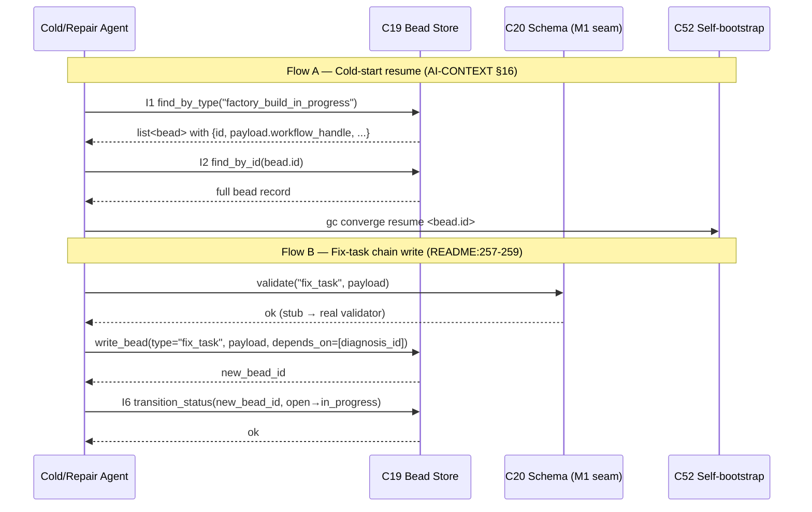

# C19 — Bead store / typed work-graph  (Spec, canonical track)

> Source: AI-CONTEXT §3.2 ("nine concepts" #2 — "Bead Store: Durable typed work-graph (Dolt or file); P1, P5, P9, P10"); AI-CONTEXT §2 ("Persistence — event store (CXDB) + work ledger (Beads)"); AI-CONTEXT §3.1 (coverage map: P10 "Strong (bead store, file or Dolt)"); AI-CONTEXT §13.1 (`[beads] provider = "file"`); AI-CONTEXT §16 cold-start (`gc bd find --type factory_build_in_progress`; `gc converge resume <bead_id>`; `transfused_from`); AI-CONTEXT §15.1 (`github.com/gastownhall/beads`); README Part 4 — P2 persistence row (line 122 "Gas City beads (file or Dolt)"), P8 override-log row (214 "beads with type `override`"), P9 attribution rows (227–229 "native `created_by`", "bead history", "signature on bead provenance"), P10 rows (239–242 "Tasks with dependencies", "`gc bd` commands"), P11 rows (257–259 `fix_task` bead / "bead chain anomaly → diagnosis → fix → resolution"); README Phase 0 (368–372 "beads as persistence", "every bead … carries `created_by`", "bead store handles task graph + cross-session"); component-inventory C19 row (`A20, A19e, A21b, B44`; depends on C01; gap G17; foundational yes).
> Inventory ID: C19   Kind: data-store   Status: sweep-2
> Track: canonical (faithful)

## 1. Purpose & responsibility

C19 is the **bead store**: a durable, typed **work-graph** of units of work ("beads") with
**dependency edges** between them, persisting **across agent sessions**. It is Gas City concept #2
(AI-CONTEXT §3.2) and the "**work ledger**" half of the persistence layer (AI-CONTEXT §2) — the
**memory layer** that lets a restarted or new agent recover *what work exists, what it depends on, who
created it, and what state it is in* without re-deriving anything from a scratchpad. In v4's terms it is
the load-bearing native match for **P10 (memory layer)** and a primary carrier for **P9 (attribution)**.

**Responsibilities**
- Own the **persistent typed work-graph**: beads (nodes) + dependency edges, durable across sessions
  (AI-CONTEXT §3.2 #2; README:235 "Survives across agent sessions … Replaces flat scratchpads").
- Carry **universal attribution**: every bead records `created_by`, natively (README:227, 371; the "P9
  strongest match in the corpus", AI-CONTEXT §3.1).
- Support **typing of beads** via the bead schema registry (C20) — every bead has a *type*
  (`override`, `fix_task`, `factory_build_in_progress`, `factory_build`, …) that the store stores and can
  filter on (README:214, 257; AI-CONTEXT §16).
- Provide a **query interface** — `gc bd` commands (e.g. `gc bd find --type <t>`) for reading the
  work-graph by type/attribution/state, and **bead history** as the queryable audit trail
  (README:228, 242; AI-CONTEXT §16).
- Offer **two storage backends** behind one interface: **file** (Phase 0 default) and **Dolt** (later,
  versioned-SQL), selected by config `[beads] provider = "file"` (AI-CONTEXT §3.2 #2, §13.1, README:122).
- Hold **bead state/lifecycle** sufficient to support `gc converge resume <bead_id>` and the self-healing
  **bead chain** (anomaly → diagnosis → fix → resolution) and bootstrap **resume** of an in-progress build
  (AI-CONTEXT §16; README:259).

**Explicitly NOT**
- NOT the **bead *schema*** (C20). C19 stores and indexes typed beads; the *canonical definition* of each
  bead type and its fields lives in C20. C19 is the graph + persistence engine; C20 is the type catalog.
  (See §2 dependency note and OQ-C19-1 on the C19↔C20 direction.)
- NOT the **CXDB trajectory store** (C21). Beads are the **work ledger** (coarse-grained tasks/dependencies);
  CXDB is the **content-addressed turn-DAG** of fine-grained trajectories (AI-CONTEXT §2, §5; README:241,
  244 "CXDB adds content-addressed trajectory storage when self-healing needs richer trajectory analysis").
  Different granularity, different store. **Bead types are a *separate type space* from CXDB turn types**
  (AI-CONTEXT §5 keeps the two stores distinct); C19 asserts **no shared `{bundle_id,…}` namespace** with
  CXDB. Any bead↔CXDB payload binding is a C20/C22 concern, not C19's, and C19 takes no position on the
  bead `bundle_id` (see OQ-C19-5 and the bundle-id collision flagged to the integrator).
- NOT the **event bus** (C23). The event bus is append-only JSONL of *every action* (AI-CONTEXT §3.2 #3);
  beads are the *durable typed graph of work*. README:228 pairs "event bus + bead history" as two
  audit-trail sources; they are distinct components.
- NOT **dispatch** (C05/Sling), **molecules** (C13), or the **reconciler** (C18). Sling *routes* a
  bead/wisp to an agent; a molecule is a formula *instantiated into a bead-tree*; the reconciler converges
  bead state per tick. Those consume/produce beads but are separate components. C19 owns only the store.
- NOT **identity verification** (C41). C19 records the *self-asserted* `created_by` value natively; the
  *optional, deferred* "signature on bead provenance" that verifies the claimed actor is C41's concern
  (README:229 "optional, deferred"; see G36, §6).

## 2. Context & dependencies

| Direction | Component | Relationship |
|---|---|---|
| Upstream (depends on) | **C01** Gas City substrate | C19 is Gas City native concept #2; the `gc` binary provides the bead store and `gc bd` commands (AI-CONTEXT §3.2, §16; inventory: C19 depends on C01). |
| Upstream (depends on) | **C03** Config/feature-flags | `[beads] provider = "file"` (the backend selector) is a C03 section (AI-CONTEXT §13.1). C19's backend is config-gated. |
| Upstream-of (C20 depends on C19) | **C20** Bead schema registry | C19 stores *typed* beads; C20 defines the types. **Canonical direction (review-log D-4): C20 depends on C19**, co-foundational. The dispatch brief's reversed arrow (C19→C20) was only the `validate` call seam, not a real reversal; the production write-path cycle is broken by the **M1 interface freeze + a no-op `validate` stub** (see OQ-C19-1, resolved). |
| Downstream (consumes) | **C05** Sling, **C13** Molecule, **C18** Reconciler | route / instantiate / converge over beads stored here. |
| Downstream (consumes) | **C35** Override loop, **C39** Fix-task loop-closure, **C52** Self-bootstrap | write/read `override`, `fix_task`, `factory_build_in_progress` beads and the resolution **bead chain** (README:214, 257–259; AI-CONTEXT §16). |
| Downstream (consumes) | **C41** Identity/attribution, **C33** Satisfaction | C41 reads `created_by` off every bead (inventory: C41 depends on C19); C33 reads judge-output beads (README:426 "reading judge outputs from beads"). |

C19 is **foundational** (inventory: yes), in **Batch 1**, authored in parallel with C20/C21/C23 — it is the
work-graph schema/engine everything downstream references for "what work exists and who created it."

## 3. Interfaces / contracts

Sweep 1 — interfaces **named and described**; concrete signatures/schemas deferred to sweep 2.

1. **Bead write/create** — create a bead of a given **type** (C20-defined), with payload fields,
   `created_by`, and zero-or-more **dependency edges** to existing beads. (`fix_task` writing, README:257;
   `override` logging, README:214.)
2. **Bead read / find / query** — the `gc bd` surface: lookup by id, **filter by type**
   (`gc bd find --type factory_build_in_progress`, AI-CONTEXT §16), by `created_by` (attribution query),
   and by state. Returns beads and their dependency edges (the work-graph). (README:242.)
3. **Dependency-edge interface** — declare/inspect "bead A depends on bead B"; this is what makes it a
   *graph* and not a flat list (README:235, 239 "Tasks with dependencies").
4. **Bead state/lifecycle interface** — read/advance a bead's state enough to support **resume**
   (`gc converge resume <bead_id>`, AI-CONTEXT §16) and the self-heal **chain** to a `resolution`
   (README:259). Exact state machine is C18's (reconciler) concern at the convergence layer; C19 owns the
   *durable state field* and its transitions-of-record.
5. **Bead history / audit interface** — queryable per-bead history (README:228 "bead history") as one of
   the two attribution/audit sources (the other being the event bus, C23).
6. **Backend-selection interface** — `[beads] provider = "file" | "dolt"` chooses the storage engine behind
   the *same* bead interface (AI-CONTEXT §3.2 #2, §13.1).

**Invariants**
- **Attribution-native**: *every* bead carries a `created_by` — it is "automatic everywhere", with no
  configuration (AI-CONTEXT §3.1 P9; README:227, 371). v4 states the create path **always stamps** a
  non-empty `created_by`; it does not itself state the store *rejects* an un-attributed write.
  > [FAITHFUL-FILL] To make "total" *testable* without exceeding v4, the minimal faithful mechanism is
  > **stamping**: the C19 create path *always fills in* a non-empty `created_by` from the acting actor, so
  > no bead can exist without one. This is the smallest elaboration consistent with "native/automatic
  > everywhere" (a property of the *write path*, not of input validation). It is distinct from a *rejecting
  > validation gate* that refuses a caller-supplied null/empty `created_by` — that store-side rejection is
  > the explicit Track-B choice (C19-B DELTA-02) and is **not** asserted here as faithful.
- **Typed-total**: every bead has a type drawn from the C20 registry (no untyped beads;
  `gc bd find --type` presupposes every bead is type-tagged).
- **Durable across sessions**: a bead written in one session is readable, with its edges and state, by a
  later/other session (README:235; the defining property of "memory layer").
- **Backend-transparent**: the bead interface (write/find/depends-on/history) is identical whether the
  backend is `file` or `dolt`; backend choice changes durability/concurrency properties, not the contract
  (AI-CONTEXT §3.2 #2 "Dolt **or** file").

### 3.1 C19↔C20 contract block (sweep-2 — the M1 interface freeze, D-4)

> **D-4 (ADOPTED) — C19↔C20 direction (resolves XC-1).** Canonical: **C20 depends on C19** (schema layer
> over the graph store). They are co-foundational; the production write-path cycle is broken by the M1
> interface freeze + a no-op `validate` stub seam (the reversed dispatch arrow was only that call seam).

The **M1 interface freeze** is the load-bearing contract boundary that lets C19 and C20 build in parallel
without circular coupling. Its content:

**C19 → C20 (what C19 exposes for C20 to layer over):**

| Field | Type | Req? | Semantics | Notes |
|---|---|---|---|---|
| `id` | `string` (opaque, stable) | R | bead identifier; target of `gc bd find` / `gc converge resume <id>` | C19 mints; globally unique within the store |
| `type` | `string` | R | registry type tag; C19 stores + indexes; C20 defines the legal set | closed-set check is C19↔C20 contract (see E-C19-1) |
| `created_by` | `string` | R | actor attribution; C19 stamps from acting context if caller omits | self-asserted; see G36 / OQ-C19-4 |
| `depends_on` | `list<id>` | O | directed dependency edges: this bead depends on the listed beads | acyclic; C19 enforces no-cycle (see §4.3) |
| `status` | `enum{open,in_progress,closed}` | R | lifecycle state; written by create, advanced by state-transition call | C20 names the enum values (§4.5.0); C19 stores + transitions |
| `payload` | `map<string,any>` | O | type-specific fields; C20 owns the schema; C19 stores opaquely | C19 passes through; validation is C20's seam |
| `history` | derived | — | per-bead change log; C19 derives from Dolt versioning or file append | [FAITHFUL-FILL] — see §4.2 |

**The no-op `validate` stub seam:** C19's write path calls `C20.validate(type, payload)`. At M1 freeze
time, before C20 is built, the stub returns `ok` unconditionally. Once C20 ships, the real validator
replaces the stub. This breaks the production write-path cycle while preserving the contract: the seam
exists and has the right shape from day 0.

```
write_bead(type, payload, created_by, depends_on):
  # M1 seam: call C20 validator (no-op stub until C20 ships)
  C20.validate(type, payload)   # → ok | error(E-C19-1)
  id = store.mint_id()
  record = {id, type, created_by, depends_on, status="open", payload}
  store.put(record)             # durable write
  return id
```

**Postconditions (M1 — both parties freeze against these):**
- A bead written through this interface is durably stored and retrievable by `id` and by `type`-filtered query in any subsequent session.
- `created_by` is non-empty on every stored bead (stamped by the write path if not supplied).
- The `depends_on` list is acyclic at write time (C19 rejects a cycle — E-C19-3).

### 3.2 Query/traversal interface signatures (sweep-2)

C19's query surface maps to the `gc bd` CLI surface (AI-CONTEXT §16; README:242). Logical signatures
(backend-agnostic; maps to `gc bd` subcommands):

```
# I1 — find by type (the cold-start query; AI-CONTEXT §16)
find_by_type(type: string) → list<bead>

# I2 — find by id (the resume lookup; AI-CONTEXT §16 "gc converge resume <bead_id>")
find_by_id(id: string) → bead | not_found

# I3 — find by actor (attribution query; README:242)
find_by_creator(created_by: string) → list<bead>

# I4 — find by status (lifecycle filter)
find_by_status(status: enum{open,in_progress,closed}) → list<bead>

# I5 — get dependency subgraph (the "Tasks with dependencies" graph; README:239)
get_subgraph(root_id: string, direction: enum{upstream,downstream,both}) → graph{nodes:list<bead>, edges:list<(from_id,to_id)>}

# I6 — advance state (C18 / C39 drive transitions; C19 owns the durable record)
transition_status(id: string, from: enum, to: enum) → ok | error(E-C19-2)

# I7 — bead history (audit; README:228)
get_history(id: string) → list<{timestamp, actor, field, old_val, new_val}>
```

> [FAITHFUL-FILL] **These logical signatures are the minimal faithful elaboration of `gc bd`.** v4 names
> `gc bd find --type <T>` (I1), `gc converge resume <bead_id>` (uses I2), "Tasks with dependencies"
> (I5), "bead history" (I7), and attribution queries (I3) — all five surfaces are v4-cited. I4 (status
> filter) and I6 (transition) are the smallest addition that makes the C20 lifecycle states meaningful
> and the C18 reconciler operable. No additional query surface is invented.

## 4. Data model / state

C19 **owns the work-graph state**: the set of beads, their typed payloads, their dependency edges, their
`created_by` attribution, and their per-bead state/history. This is the only component that *persists* the
work-graph.

**Bead (node) — faithful minimal field set** (fields v4 names or unambiguously implies; full per-type
schema is C20):

| Field | Source | Notes |
|---|---|---|
| `id` (bead id) | AI-CONTEXT §16 (`gc converge resume <bead_id>`) | stable handle used by resume/dispatch. |
| `type` | README:214, 257; AI-CONTEXT §16 | drawn from C20 registry (`override`, `fix_task`, `factory_build_in_progress`, `factory_build`, …). |
| `created_by` | README:227, 371 | universal attribution; native, mandatory. |
| dependency edges | README:235, 239 | "tasks with dependencies"; directed edges to other beads. |
| state | AI-CONTEXT §16; README:259 | enough to drive resume + the resolution chain. |
| payload fields | per-type | type-specific content (e.g. `transfused_from` on factory-build beads, AI-CONTEXT §16; the fix-task linkage on `fix_task`). C20 owns these. |
| history | README:228 | per-bead change history (audit). [FAITHFUL-FILL] README:228 names "bead history" as a *query/audit surface*; whether it is a stored field on the record or a *derived view* over C23/Dolt versioning is unspecified by v4 and deferred to sweep 2. |

> [FAITHFUL-FILL] v4 names `id`, `type`, `created_by`, dependency edges, state, and `transfused_from`
> (on bootstrap beads) but never enumerates a complete bead record. The minimal faithful field set above
> is exactly the union of fields v4 *uses* in commands/examples (§16, README:214/227/235/257/259); no
> field is invented beyond what a cited v4 operation requires. The authoritative per-type field list is
> deferred to **C20** (this is C19's storage view, not the schema catalog).

**Edges.** Dependency edges are directed bead→bead ("A depends on B"). The self-heal **chain**
(anomaly → diagnosis → fix → resolution, README:259) and the `fix_task` re-entry into the build flow are
expressed as edges/links between beads; C19 stores them, C20 names the link semantics per type.

> [AMBIGUITY] v4 names only an **untyped** "dependency" ("Tasks with dependencies", README P10) — it never
> states whether the self-heal chain uses *typed* edges or a single untyped depends-on edge with the
> distinction carried on the *node* type. The two faithful readings are: (a) one untyped `depends-on`
> edge, chain semantics inferred from node types (what §8 AC-4 below presumes); (b) typed chain edges —
> which is the elaboration C20-A §4.3 supplies as `diagnosed_by`/`produces`/`resolved_by`. The C19/C20
> faithful pair must agree on **one** model; today C19-A leans (a) and C20-A states (b). C19 stores
> whatever edges C20 names; the canonical edge-kind ownership and whether edges are typed is routed to the
> C19↔C20 interface freeze (OQ-C19-1) and the optimized siblings' edge-taxonomy OQ. No edge *names* are
> invented here.

**Backends.**
- **`file`** (Phase 0 default, AI-CONTEXT §13.1): single-node, local-file persistence; the smallest viable
  install (no Dolt server — AI-CONTEXT §3.4 "Explicitly off: … Dolt server").
- **`dolt`** (later): versioned-SQL backend (Dolt = git-for-data) for richer history/branching/concurrency.
  v4 names it only as the alternative provider behind the same interface; no migration procedure is given.

> [FAITHFUL-FILL] v4 states the *choice* "Dolt or file" and that Phase 0 uses `file` with the Dolt server
> off, but gives no file-layout, no schema-version, and no file→Dolt migration path. Minimal faithful
> position: C19 persists the work-graph in a Gas-City-owned on-disk representation under `[beads]
> provider`; the concrete file layout and any migration are Gas City internals (G11 — unverified) and are
> deferred to sweep 2 / the upstream `gastownhall/beads` repo, not invented here.

**Consistency.** v4 asserts durability and cross-session readability but specifies no isolation level,
concurrency model, or ordering guarantee for concurrent bead writes from parallel agents. Faithfully:
durable-and-readable across sessions is required; stronger consistency claims are not made by v4 (see §6
and OQ-C19-3).

### 4.1 Node entity table (sweep-2)

The **bead node** is C19's primary entity. All fields below are C19's storage view; per-type payload field
schemas are C20's contract.

| Field | Type | Req? | Semantics | Read-by | Write-by |
|---|---|---|---|---|---|
| `id` | `string` (opaque, stable) | R | store-minted stable handle; the "address" for `gc bd find` and `gc converge resume` (AI-CONTEXT §16) | all consumers (I2); C52 resume; C33 judge-output reader | C19 mints at write |
| `type` | `string` (C20 registry) | R | type tag; drives `gc bd find --type` (I1); validated against C20 registry via the M1 seam (`validate` stub → real validator) | all find-by-type callers; I1 | caller; C19 checks via C20 seam |
| `created_by` | `string` (actor identity, C41 semantics) | R | universal attribution; stamped by C19 write path if not provided; self-asserted until C41 signed provenance lands (G36) | C41; audit reads; I3 | C19 stamps from acting context |
| `depends_on` | `list<string>` (list of `id`) | O | directed dependency edges — this bead depends on the listed beads; forms the work-graph (README:239 "Tasks with dependencies"); acyclic (E-C19-3) | I5 subgraph traversal; C39 chain traversal; C05 Sling routing | caller at write time; not mutable after write (see OQ-C19-3) |
| `status` | `enum{open,in_progress,closed}` | R | bead lifecycle state; C20 defines the enum values (C20 §4.5.0); C18 and C39 drive transitions via I6 | C18 reconciler; C39 loop-closure; I4 filter | C19 sets `open` at create; I6 advances |
| `payload` | `map<string,any>` | O | type-specific fields (C20 schema); C19 stores opaquely; round-trip must preserve values verbatim (E-C19-4) | type-specific consumers (C35, C39, C52, C51, C33) | caller; validated at write via C20 seam |
| `history` | derived | — | per-bead change log; derived from Dolt branch versioning (Dolt backend) or append-log (file backend); surfaced via I7 | audit/C41; README:228 "bead history" | implicit — C19 records every state transition |

### 4.2 Edge entity table (sweep-2)

C19 stores **one kind of directed edge** at the graph-store level: `depends_on` (from node A to nodes B₁…Bₙ that A depends on). The *semantic* interpretation of a specific edge (e.g. `diagnosed_by`, `produces`, `resolved_by` — C20 §4.3) is carried on the **node types**, not on the edge record itself.

> [AMBIGUITY: untyped vs typed edges] As noted above, v4 names only "Tasks with **dependencies**" (one untyped edge kind). C20 §4.3 labels edges by chain step name. The C19/C20 canonical pair resolves this by: **C19 stores a single `depends_on` edge kind; C20 names the chain semantics at the node level.** This is the minimal faithful model — one edge type, chain semantics from node-type pairs. If a later substrate verification (G11) reveals Gas City supports typed edges natively, this can be enriched without breaking the M1 contract.

| Field | Type | Req? | Semantics | Read-by | Write-by |
|---|---|---|---|---|---|
| `from_id` | `string` (bead id) | R | the bead that depends on `to_id` | I5 traversal; chain walks | caller at bead-write time |
| `to_id` | `string` (bead id) | R | the bead that `from_id` depends on; must already exist in the store (E-C19-5) | I5 traversal; C39 chain reconstruction | caller at bead-write time |

Edges are **immutable after write** and are **acyclic** — C19 rejects a write that would create a cycle (E-C19-3). All edges for a bead are written atomically with the bead's creation.

### 4.3 Persistence & consistency contract (sweep-2, Dolt backend)

This section formalizes the durability/consistency contract for the **Dolt SQL backend** (Phase 1+), incorporating F9 from the D-23 substrate harvest.

**Durability model (F9 — D-23 substrate-verified):**

The Dolt backend runs as a **local Dolt SQL server** inside the Gas City container. Writes to this server are immediately consistent within a session (SQL transaction semantics). Durability beyond the container lifetime requires a periodic `dolt push`. The critical operational constraint from F9:

> **`dolt push` MUST use `--ref refs/heads/<branch>`** (e.g. `refs/heads/dolt-data`). The Dolt default push namespace `refs/dolt/data` is rejected by many git proxies and by the Anthropic sandbox proxy. Set `DOLT_REF=refs/heads/dolt-data` in env; pass `--ref $DOLT_REF` to every push/clone.

**Transaction ordering:**

| Guarantee | Faithful claim | Source |
|---|---|---|
| Within-session write ordering | ACID SQL transactions on the local Dolt server; each `write_bead` is one transaction | F9 (D-23 harvest) |
| Cross-session durability | A bead written before the last `dolt push` is readable by a new session after a `dolt clone/pull` from the same `refs/heads/*` branch | F9 + README:235 "Survives across agent sessions" |
| Concurrent multi-agent writes | **Not specified by v4**; Dolt SQL server serializes local writes; network-level conflicts on a shared `refs/heads/*` branch are the ops responsibility | OQ-C19-3 — deferred |
| Acyclicity | C19 enforces no-cycle at write time within a transaction; concurrent writes could in principle produce cycles if two agents write cross-referencing `depends_on` edges simultaneously | OQ-C19-3 flag |

**Push frequency:** v4 does not specify a push interval; the D-23 harvest notes "periodic" push. Faithful position: the push interval is a Gas City operational parameter, not a C19 contract. Ops runbooks MUST use `--ref refs/heads/dolt-data` (F9).

**File backend consistency:** Single-node, Phase 0. No concurrency guarantees; crash mid-write leaves partial files. Faithful position: durability is best-effort for the file backend; Phase 0 is low-concurrency enough that this is acceptable (AI-CONTEXT §3.4 "Explicitly off: … Dolt server"). Crash semantics are a Gas City internal (G11 — unverified).

### 4.4 Mermaid diagram — write / traversal sequence (sweep-2)

The diagram below shows the two canonical flows C19 must support: **(A)** the cold-start resume recipe (AI-CONTEXT §16) and **(B)** the fix-task chain write (README:257–259). Both flows go through the M1 seam (C20 `validate` stub → real).



> [FAITHFUL-FILL] The sequencing above is the minimal faithful reading of the §16 cold-start recipe and
> README P11 fix-task write. The M1 seam (`C20.validate` call in Flow B) is precisely the no-op stub
> described in §3.1 — it exists in the interface at M1 freeze time and becomes a real check once C20
> ships. C52 is named as the consumer of the resume handle, per AI-CONTEXT §16.

## 5. Behavior

C19 has **no control loop of its own** (the loop that *acts on* beads is the reconciler C18; the loop that
*routes* them is Sling C05). C19's behavior is store-level:

- **Create**: an actor (agent/tool/city/rig) writes a typed bead with `created_by` and dependency edges
  (e.g. diagnosis agent writes a `fix_task`, README:257). The bead becomes durable immediately.
- **Query/recover**: a new or restarted agent recovers state by *querying* the graph rather than reading a
  scratchpad — e.g. cold-start recipe (AI-CONTEXT §16): `gc bd find --type factory_build_in_progress` →
  read `transfused_from` → `gc converge resume <bead_id>`. This is the "memory layer surviving sessions"
  in action.
- **State advance / chain**: a bead's state advances and new beads are linked as work proceeds; the
  self-heal **bead chain** records anomaly → diagnosis → fix → resolution as a connected sub-graph that
  *proves the fix worked* (README:259; the loop-closure contract itself is C39).
- **Audit read**: bead history + event bus give the queryable "who did what" record (README:228).

(Sequence/state diagrams for create/resume/chain and the file-vs-Dolt write paths are deferred to sweep 2
per BUILDER-BRIEF altitude.)

## 6. Failure modes & handling

| F-mode / gap | Relevance to C19 | Handling (faithful) |
|---|---|---|
| **G17** — *blocker*: no schema for the core stores; bead types are *used* (`override`, `fix_task`, `factory_build_in_progress`, `factory_build`) but never defined; `gc bd find --type factory_build_in_progress` references an undefined type | C19 is the store that *holds* these typed beads; the missing schema makes the type-filtered queries unbuildable. | **Split + defer to C20.** C19 faithfully owns the *graph engine, attribution, edges, persistence, and query-by-type surface*; the **canonical type catalog and per-type fields** are C20's deliverable (inventory assigns G17 to both C19 and C20). C19's contract is "every bead is typed and attributed and findable by type"; what the legal types *are* is C20. This is the minimal faithful division consistent with the inventory's two-component split. (See OQ-C19-1.) |
| **G36** — *minor*: attribution integrity is optional/deferred; without signed provenance, `created_by` is self-asserted | C19 records `created_by` natively but cannot *verify* it. | Faithful: C19 guarantees attribution is **present and total**; *verification* of the claimed actor is C41's "optional, deferred … signature on bead provenance" (README:229). C19 surfaces that the recorded actor is self-asserted (residual risk, §7/§9); inventing signing here would exceed v4 and duplicate C41. |
| **Backend durability / crash mid-write** | A `file`-backend write could be interrupted (single-node, Phase 0). | v4 claims durability but gives no crash/atomicity spec for the file backend; faithfully noted as a Gas City internal (G11 unverified) and an open question (OQ-C19-3). "Orders survive crashes" is claimed for Orders (C40), *not* for the bead file backend. |
| **Concurrent writes from parallel agents** | L4/L5 runs fan out many agents writing beads. | v4 states no concurrency/isolation model for the `file` backend; Dolt would add it. Faithful: flag as open (OQ-C19-3); do not invent locking semantics v4 does not state. |
| **Unknown / unregistered bead type** | A bead written with a type absent from C20's registry. | Faithful: by the **typed-total** invariant every bead's type must be in C20's registry; enforcement of "reject unknown type" is the C19↔C20 contract, finalized once C20 exists (sweep 2). **Caveat (G11 / OQ-C20-4):** closed-type enforcement presupposes Gas City's native bead store *rejects* unregistered `type` strings — unverified. If the substrate accepts free-form types, this enforcement becomes pack work (C02), not a native guarantee. |

No v4 F-mode is *owned* by C19 beyond the persistence/attribution role; F32 (mail-injection) and the
attribution F-modes are addressed via P9 `created_by` flowing through beads (C41 owns the security framing).

### 6.1 Error taxonomy (sweep-2)

C19-owned errors at the graph-store layer. Each row: E-code, failure, detection point, handling. These
are the errors C19 can detect and surface *without* needing C20's type catalog (those are C20 §6.1
E-codes). The E-codes are referenced by acceptance tests in §8.1.

| # | Failure | Surface | Detection | Handling |
|---|---|---|---|---|
| **E-C19-1** | **Unknown type** — `type` not in C20 registry at write time | write_bead (M1 seam) | `C20.validate(type, payload)` returns error (the no-op stub passes all until C20 ships; real validator enforces closed set) | Reject write; return E-C19-1. Prevent-vs-detect is G11-gated: native enforcement if Gas City rejects unknown types; C02 pack-level detect otherwise (same caveat as C20 E1 / OQ-C20-4). |
| **E-C19-2** | **Invalid status transition** — e.g. advancing `closed → in_progress` (no re-open) | I6 transition_status | Transition table check: C19 enforces the lifecycle DAG `open→in_progress→closed` (C20 §4.5.0 / C20 §5.1) | Reject transition; return E-C19-2. Caller (C18/C39) must not issue backwards transitions. |
| **E-C19-3** | **Dependency cycle** — writing a bead whose `depends_on` list would create a directed cycle | write_bead | Reachability check: does any `to_id` in `depends_on` transitively depend on the new bead's would-be id? (checked before commit) | Reject write; return E-C19-3. The work-graph must be a DAG (acyclicity invariant §3). |
| **E-C19-4** | **Round-trip payload corruption** — a `payload` field written as one type reads back as a different type | read path | Structural comparison: `read(write(bead)).payload == bead.payload` (the AC-C19-RT test) | Fail-loud; indicates a storage backend type-mapping bug. Dolt SQL column types must match payload field types (F9 informs: local SQL server, types are real). |
| **E-C19-5** | **Unknown dependency target** — `depends_on` references an id that does not exist in the store | write_bead | Existence check on each `to_id` before committing | Reject write; return E-C19-5. All dependency targets must exist at write time (referential integrity for the work-graph). |
| **E-C19-6** | **Missing `created_by`** — write_bead called with no actor context and no explicit `created_by` | write_bead | Attribution stamping: C19 stamps `created_by` from the acting context; if neither is available, the write is rejected | Reject write; return E-C19-6. "Native/automatic everywhere" (README:227) means C19 always has an acting context; the error case signals a misconfigured call site, not a user error. |
| **E-C19-7** | **Durability loss** — `dolt push` fails or is skipped; a session ends before the last push; beads written are not visible to the next session | ops/durability layer | Detected at next-session `find_by_type` returning an empty set for a type known to have beads | Fail-loud on `dolt push` error; surface as operational alert. Mitigation: push frequency and `DOLT_REF=refs/heads/dolt-data` constraint (F9 — D-23 substrate-verified). Not a write-time C19 API error; an ops concern. |

## 7. Cross-cutting (security / cost / scale / observability / ops)

- **Security**: C19 is the attribution substrate — "every action carries identity … native `created_by`"
  (README:227) — but attribution is **self-asserted** until C41's optional signing is added (G36). The
  bead store is also a write target for auto-generated `fix_task`/factory-build beads at L4/L5; integrity
  of *that* write path is part of the broader RSI/goal-subversion concern (G35, owned by C57/C56), not
  resolved in C19.
- **Cost**: negligible direct storage cost at Phase 0 (`file` backend, single node). Dolt adds operational
  cost only when adopted. No v4 cost model touches beads (G32 is about model tokens, not bead storage).
- **Scale**: the `file` backend is single-node (Phase 0); v4 offers Dolt as the scale/concurrency path but
  pins no thresholds. The agent-side throughput ceiling (G34) is a Max-seat concern, not a bead-store one.
- **Observability**: bead history + `gc bd` queries are themselves the observability surface for the
  work-graph ("read patterns from memory", README:242). The store *is* queryable by design.
- **Ops**: backend selection is a one-line config change (`[beads] provider`); migration file→Dolt is
  unspecified by v4 (OQ-C19-2). Gas City schema-drift (AI-CONTEXT §3.5, "1–2 breaking pack-schema/
  formula-format changes per quarter") is an ops risk for the bead record shape (sweep 2: pin a schema
  version with C20).

## 8. Acceptance criteria & test strategy

1. **Attribution-native**: every bead created through the C19 interface has a non-empty `created_by` —
   the create path always **stamps** one from the acting actor ("native, automatic everywhere",
   README:227/371). The minimal testable form of this is that no bead is ever persisted without a
   non-empty `created_by` because the write path fills it in (stamping, FAITHFUL-FILL §3). The *store-side
   rejecting validation gate* on an externally-supplied null is the Track-B enforcement (C19-B DELTA-02),
   not a v4-stated fact.
2. **Cross-session durability**: a bead (with type, edges, state) written in session S1 is readable —
   identical — from a separate session S2 after process restart (the "survives across sessions" property,
   README:235).
3. **Type-filtered query**: `gc bd find --type <t>` returns exactly the beads of type `<t>` and no others,
   for every type registered in C20 — specifically including `factory_build_in_progress` (the §16 recipe
   must run end-to-end once C20 lands).
4. **Dependency graph**: declaring "A depends on B" and "B depends on C" yields a queryable directed graph;
   the self-heal chain (anomaly→diagnosis→fix→resolution) is recoverable as a connected sub-graph
   (README:259).
5. **Resume handle**: a `factory_build_in_progress` bead's `id` and state are sufficient for
   `gc converge resume <bead_id>` to pick the work back up (AI-CONTEXT §16).
6. **Backend transparency** *(sweep-2 / Dolt-era; G11-gated)*: the same test suite (1–5) passes against
   both `provider = "file"` and `provider = "dolt"` with identical observable contract. Not exercisable at
   sweep 1 — Phase 0 turns the Dolt server "explicitly off" (AI-CONTEXT §3.4) and the Dolt backend itself
   is unverified Gas City behavior (G11). Stated now so the contract is frozen; tested when Dolt lands.

### 8.1 Concrete acceptance tests (sweep-2)

Each test is an executable check tied to the E-codes in §6.1 and the M1 interface in §3.1.
`assert accept(...)` = write succeeds; `assert reject(...)` = write/call is refused with the named error;
`assert roundtrips(b)` = `read(write(b)) == b`.

**Write-path and M1 seam**

- **AC-C19-W1** — `assert accept(write_bead(type="fix_task", payload={...}, created_by="agent-1", depends_on=[]))` writes cleanly and returns a non-empty `id`. (M1 seam with C20 real validator; requires C20 to be live. With stub, passes unconditionally.) (§3.1)
- **AC-C19-W2** — `assert reject(write_bead(type="not_a_type", ...))` is refused with E-C19-1 once C20's real validator replaces the stub. With the no-op stub, this passes — *marked G11-gated*. (§3.1, E-C19-1)
- **AC-C19-W3** — `assert roundtrips(b)` for a bead with all fields populated: `read(write(b)).payload == b.payload` field-by-field. Specifically, integer fields read back as integers (no silent string coercion). (E-C19-4)
- **AC-C19-W4** — `assert reject(write_bead(depends_on=[X]))` when X does not exist in the store → E-C19-5. (§4.2, E-C19-5)
- **AC-C19-W5** — `assert reject(write_bead(depends_on=[A]))` when A's `depends_on` already points (transitively) to the new bead's would-be id → E-C19-3 (cycle prevention). (§4.2, E-C19-3)

**Attribution**

- **AC-C19-A1** — write_bead called with no `created_by` and a valid acting context → the written bead has `created_by` set to that context's actor id (stamping invariant). (§3 FAITHFUL-FILL, README:227)
- **AC-C19-A2** — write_bead called with no `created_by` and no acting context → `assert reject(...)` with E-C19-6. (§6.1, E-C19-6)

**Query/traversal (I1–I7)**

- **AC-C19-Q1** — `find_by_type("factory_build_in_progress")` returns exactly the beads of that type and no others. Specifically: the literal string `factory_build_in_progress` resolves correctly (G17 prevention; AI-CONTEXT §16). (I1)
- **AC-C19-Q2** — `find_by_id(id)` for a written bead returns the identical record (all fields). `find_by_id(unknown_id)` returns `not_found`. (I2)
- **AC-C19-Q3** — `get_subgraph(root_id="anomaly_bead", direction="downstream")` returns the connected closure-chain sub-graph: anomaly → diagnosis → fix_task → resolution as a set of nodes + edges. (I5; README:259 "bead chain anomaly → diagnosis → fix → resolution")
- **AC-C19-Q4** — `transition_status(id, open→in_progress)` succeeds; `transition_status(id, closed→open)` is rejected with E-C19-2. (I6, §6.1, E-C19-2)
- **AC-C19-Q5** — `get_history(id)` returns a non-empty list of change records after any state transition; timestamps are monotonically increasing. (I7; README:228)

**Cross-session durability**

- **AC-C19-D1** — write bead in session S1 (process exit); start session S2; `find_by_id(bead.id)` returns the identical bead. (§8 AC-2; README:235)
- **AC-C19-D2** *(Dolt backend, G11-gated)* — durability requires a successful `dolt push --ref refs/heads/dolt-data` between S1 and S2. After a push with an incorrect ref (e.g. default `refs/dolt/data`) to a proxy-mediated environment, the push fails → surface E-C19-7. Passing requires `DOLT_REF=refs/heads/dolt-data` (F9 — D-23 substrate-verified). (§4.3, E-C19-7)

**Cold-start resume recipe (AI-CONTEXT §16)**

- **AC-C19-R1** — end-to-end: write a `factory_build_in_progress` bead with `workflow_handle` + `spec_ref` + `scenario_ref` (C20 §4.5.4 fields); call `find_by_type("factory_build_in_progress")`; retrieve the bead by id; pass `bead.id` to `gc converge resume`; the resume succeeds without out-of-band state. (AI-CONTEXT §16 lines 695–699; §8 AC-5)

**Backend transparency**

- **AC-C19-BT1** *(G11-gated, Dolt-era)* — all AC-C19-W*, AC-C19-A*, AC-C19-Q*, AC-C19-D1, AC-C19-R1 pass unchanged with `[beads] provider = "dolt"` as with `provider = "file"`. (§8 AC-6)

## 9. Open questions

- **OQ-C19-1** (→ review-log, **RESOLVED by D-4**): **C19↔C20 dependency direction / G17 split.** The
  inventory lists *C20 depends on C19*; the dispatch brief listed *C19 depends on C20*. The integrator's
  ruling **D-4** confirms the canonical direction: **C20 depends on C19** (the schema layer sits over the
  graph store). They are **co-foundational**; the production write-path cycle (C19's writer calls C20's
  `validate`) is broken by the **M1 interface freeze** plus a **no-op `validate` stub** seam — the reversed
  dispatch arrow was only that call seam, not a real dependency reversal. The C19↔C20 interface (a bead has
  `{id, type, created_by, edges, state}`; C20 supplies the legal `type` set and per-type fields) is frozen
  at M1 *before* either is built, so the cycle is broken at the contract, not the implementation.
- **OQ-C19-2** (→ review-log): **file → Dolt migration is unspecified.** v4 names both backends behind one
  interface but gives no migration path, file layout, or schema versioning. Is a faithful migration spec in
  scope, or is it a Gas City internal deferred upstream (G11 — Gas City behavior unverified)?
- **OQ-C19-3** (→ review-log): **Concurrency / crash semantics of the `file` backend.** v4 asserts
  durability + cross-session readability but states no isolation level, write atomicity, or ordering for
  concurrent multi-agent bead writes at L4/L5 fan-out. Needed before parallel write contracts can be
  asserted; today flagged, not invented.
- **OQ-C19-5** (→ review-log, **RESOLVED by D-2/D-3**): **Bead `bundle_id` / CXDB type-namespace (was XC-4).**
  C19 faithfully treats bead types as a *separate* type space from CXDB turn types. The integrator's rulings
  settle the two coupled questions: **(D-2, namespace)** one factory-owned reverse-DNS root with per-store
  sub-bundles — `softwarefactory.v4.beads` (bead types), `softwarefactory.v4.trajectory` (CXDB turn types),
  `softwarefactory.v4.packs` (pack ids); the divergent candidates (`v4.beads.v1`, `softwarefactory.v4`,
  `softwarefactory.trajectory.v1`) and vendor `strongdm.*` are dropped. **(D-3, ownership)** the fork is
  resolved in favor of "two registries, one mapping" — **C20 authors the per-type bead payload schemas**
  (`fix_task`/`override`/…) and binds each to a CXDB bundle; **C22 hosts the registration mechanism only**
  (and authors the CXDB-turn types). C19 still takes no position on the bead `bundle_id` itself (it stores
  the `type`, not the bundle), but its silence is now backed by a ruling rather than an open fork.
- **OQ-C19-4** (→ review-log): **Attribution integrity (G36).** `created_by` is self-asserted in C19;
  C41's signed provenance is "optional, deferred." For an L5 self-modifying factory, is unsigned
  attribution acceptable as the *only* integrity control, or must the C19↔C41 seam reserve a place for
  signing now? (Faithfully recorded as residual risk; resolution belongs to C41/C57.)

---

**[D-23 substrate-verified — gascity-prototype@b14c278, 2026-05-25]**

**F9 — Bead store = local Dolt SQL server; durability via periodic `dolt push`; `refs/heads/*` required (NEW-INFO operational caveat; does NOT contradict C19):**
Verified against the Gas City prototype (lago-morph/gascity-prototype@b14c278, 2026-05-25):
the Dolt bead store backend runs as a **local Dolt SQL server** inside the container; durability
is achieved by periodic `dolt push` to a GitHub git-remote repository. This is NEW-INFO
portability context: no v4 spec claims the default dolt ref works universally; this caveat is
surfaced here for deployment and ops use.

**Critical operational constraint:** `dolt push` must use `--ref refs/heads/<branch>` (e.g.
`refs/heads/dolt-data`). Dolt's default push namespace `refs/dolt/data` is rejected by many git
proxies and by the Anthropic sandbox proxy; specifying `refs/heads/*` is the portable,
proxy-compatible form. Any deployment guide or ops runbook that uses the default dolt ref will
fail in proxy-mediated environments. Set `DOLT_REF=refs/heads/dolt-data` in env and pass
`--ref $DOLT_REF` to all dolt push/clone operations.
