# C20 — Bead schema registry  (Spec, canonical track)

> Source: AI-CONTEXT §3.2 ("nine concepts" #2 — "Bead Store: Durable typed **work-graph** (Dolt or file)"); AI-CONTEXT §16 cold-start procedure (lines 694–699: "Find its bead with `gc bd find --type factory_build_in_progress` … `transfused_from` attribution … `gc converge resume <bead_id>`"); README Part 4 P8 ("Gas City beads with type `override`"), P9 ("beads … native `created_by`"), P10 ("Persistent task graph — Tasks with **dependencies**"), P11 ("diagnosis agent writes bead of type `fix_task`", "Loop closure tracking — Custom bead chain: anomaly → diagnosis → fix → resolution … Bead schema"); README Phase 3b ("Fix-task bead schema"); component-inventory C20 row (maps `A90, A91, A92, A58b, B37-schema`; depends on C19; gaps G17, G18; foundational: yes); ambiguities-and-gaps G17 (blocker — "no schema for any of the core stores", names `override`/`fix_task`/`factory_build_in_progress`/`factory_build`), G18 (blocker — self-healing loop has no termination / loop-closure contract).
> Inventory ID: C20   Kind: data-store   Status: sweep-2
> Track: A (faithful)
> Binding decisions obeyed: **D-2** (bundle-id namespace `softwarefactory.v4.beads`), **D-3** (C20
> *authors* the bead-type payload schemas + boundable slots; C22 owns the *registration mechanism*),
> **D-4** (C20 depends on C19; co-foundational, M1 interface freeze breaks the write-path cycle), **XC-3**
> (C20 owns the boundable slots `attempt_no`/`max_attempts`/`escalated`/`closes`; C39 owns the numeric
> policy over them). **D-6** (single canonical track).

> [D-23 substrate-verified — gascity-prototype@b14c278, 2026-05-25] Three substrate facts from the Gas
> City prototype harvest underwrite this spec: **(F8)** all inter-agent coordination passes *through the
> bead store* — an agent writes a bead and the recipient *polls for beads addressed to it* — so a bead is
> not just a record but the coordination medium; this confirms the envelope must carry enough to *address*
> and *find* a bead (the `id`/`type`/`status` triple §4.1 relies on) and validates the G17 premise that an
> unresolvable `--type` query is a real coordination failure, not a cosmetic one. **(F9)** the bead store
> is a real **local Dolt SQL server** with durability via periodic `dolt push` — so C20's field schemas
> map onto SQL-typed columns (informs the concrete types in §4.5) and the schema-version pin (§4.4) is a
> real Dolt-schema-migration concern, not hypothetical. **(F10)** bead **prefix** is the scoping
> *mechanism* but enforcement *strength* was never tested — so C20's "closed registry / reject unknown
> `type`" invariant (§3, §6) stays **prevent-or-detect-OPEN** pending the D-23 Test-A spike (G11 /
> OQ-C20-4); C20 declares the closed set, but whether Gas City *rejects* an unregistered `type` at write
> time vs only *records* it is the unresolved substrate question. No annotation here closes G11.

## 1. Purpose & responsibility

C20 is the **canonical schema registry for every bead type** in the factory. A *bead* is one node in
the durable typed work-graph (C19); C20 defines **what the type tag means**, **what fields each type
carries**, and **how typed beads chain to each other** so that the cold-start, override, self-healing,
and bootstrap-resume flows that v4 references by *bead type name* actually resolve to a defined record
shape. Where C19 owns the **graph** (nodes, edges, durability, the `gc bd` store), C20 owns the
**vocabulary of node types** that flow through it.

This component exists because v4 instructs agents to query bead **types that are never defined**:
AI-CONTEXT §16 tells a cold agent to run `gc bd find --type factory_build_in_progress`, README P8/P11
reference `override`, `fix_task`, `factory_build`, and Phase 3b lists "Fix-task bead schema" as a
deliverable — but no schema is given anywhere (gap G17, blocker). C20 is the place those type
definitions live.

**Responsibilities**
- Define the **bead-type registry**: the closed (Phase-relative) set of `type` values v4 names, plus the
  per-type field set. Faithful v4 types: `override`, `fix_task`, `factory_build`,
  `factory_build_in_progress` (G17 §49; README P8/P11; AI-CONTEXT §16).
- Define the **common bead envelope** every type shares — the fields v4 asserts are present on *all*
  beads: `id`, `type`, `created_by` (P9: "every bead … native `created_by`"), and dependency edges
  (P10: "Tasks with dependencies").
- Define the **typed bead-chain shapes** v4 references by name: the override-discipline chain (P8) and
  the self-heal closure chain `anomaly → diagnosis → fix → resolution` (P11 "Loop closure tracking").
- Carry the **loop-closure / termination contract** fields that the self-heal chain needs to be
  *bounded* — attempt counters, terminal states, escalation markers — because G18 (blocker) flags that
  the chain as described has no stated bound. (See §4 + the G18 AMBIGUITY block.)
- Provide the **resume contract**: the fields C52/self-bootstrap and `gc converge resume` read to pick up
  an in-progress build (`factory_build_in_progress`, `transfused_from`, spec/scenario pointers;
  AI-CONTEXT §16 lines 695–698).

**Explicitly NOT**
- NOT the bead **store** (C19). C19 owns persistence, the file/Dolt backend, the graph edges, and the
  `gc bd` query surface. C20 owns *type definitions and field schemas* that ride inside C19's nodes.
- NOT the CXDB type registry (C22). C22 is the `{bundle_id, type, version}` system for **trajectory
  turns** in CXDB (AI-CONTEXT §5.3). C20 is the **bead** type system in Gas City. They are different
  stores with different type systems; C20 ≠ C22 (the inventory lists both as distinct foundational rows).
- NOT the loop **logic** (C35 override loop, C39 fix-task loop-closure). C20 defines the *bead shapes and
  the termination fields* those loops read/write; the control-loop behavior (when to escalate, how to
  detect oscillation) is C39/C35. C20 supplies the schema slots; the loops supply the policy.
- NOT identity/attribution (C41). C41 owns *who can act* and the `created_by` provenance semantics; C20
  merely declares `created_by` as a required envelope field (faithful to P9).
- NOT a new bead **type system** of v4's invention. Canonical-track faithfulness limits C20 to the types v4
  actually names; it does not add speculative types (those would be Track-B deltas).

## 2. Context & dependencies

| Direction | Component | Relationship |
|---|---|---|
| Upstream (depends on) | **C19** Bead store / work-graph | C20 types are stored as C19 nodes; C20 has no persistence of its own. Inventory: C20 `depends on C19`. |
| Upstream (concept) | **C01** Gas City substrate | Beads + `created_by` + the `gc bd` CLI are Gas City native (AI-CONTEXT §3.2 #2; README P9). |
| Downstream (consumes) | **C35** Override→pattern→rule loop | Reads/writes `override` beads (README P8: "Gas City beads with type `override`"). Inventory: C35 `depends on C20`. |
| Downstream (consumes) | **C39** Fix-task generation & loop-closure | Writes `fix_task` beads; reads the anomaly→diagnosis→fix→resolution chain + closure fields (README P11; Phase 3b "Fix-task bead schema"). Inventory: C39 `depends on C20`. |
| Downstream (consumes) | **C51** Gene-transfusion discipline | Reads/writes `transfused_from` on `factory_build*` beads (AI-CONTEXT §16 step 2). Inventory: C51 `depends on C20`. |
| Downstream (consumes) | **C52** Self-bootstrap recursion | Resumes via `factory_build_in_progress` beads (AI-CONTEXT §16 lines 695–699). |
| Sibling (not dependency) | **C41** Identity/attribution | Supplies the meaning of `created_by`; C20 declares the field, C41 owns provenance. |

C20 is **foundational** (inventory: yes), in **Batch 1**, authored in parallel with C19 — it is the
load-bearing schema the override loop, the self-heal loop, and bootstrap-resume all reference by type
name. Per the inventory's critical-path note #2, G17/G18 make C20 a **blocker** for those downstream
tiers until its types are defined.

## 3. Interfaces / contracts

Sweep 1 — interfaces named and described (concrete field signatures / JSON schemas deferred to sweep 2).

1. **Bead-type registry** — the enumerated set of `type` values v4 recognizes, each with a field
   schema. The contract every downstream component queries when it does `gc bd find --type <T>`.
2. **Common envelope contract** — the fields *every* bead carries regardless of type (`id`, `type`,
   `created_by`, dependency edges, status). Downstream code may rely on these on any bead.
3. **Per-type field contract** — for each named type, the additional fields it carries (e.g. `override`
   carries a "why" field; `fix_task` carries the diagnosis pointer; `factory_build_in_progress` carries
   `transfused_from` + spec/scenario pointers).
4. **Chain-shape contract** — the directed type-to-type edges that form the v4-named chains: the override
   chain (P8) and the closure chain `anomaly → diagnosis → fix → resolution` (P11). Defines which type
   may depend-on / resolve which.
5. **Termination/closure contract** — the fields on the self-heal chain that make it *bounded*: an
   attempt count, a terminal-state enum (`resolved` / `escalated` / `abandoned`), and an escalation
   marker. (Faithful elaboration forced by G18 — see §4.)

### 3.1 Schema-registration contract (sweep-2 — the C20→C22 seam, D-3)

D-3 splits ownership: **C20 authors** the bead-type payload schemas (§4.5); **C22 owns the registration
*mechanism***. C20 ships its schemas to C22 as **one bundle document** and C22 installs it via its
existing `register_bundle` interface (C22 §3). The seam is therefore not a new C20 interface — it is C20
*producing the artifact C22's interface consumes*. Shape of the artifact C20 hands to C22:

```
register_bundle({
  bundle_id: "softwarefactory.v4.beads",        # D-2 — the bead namespace (NOT v4.beads.v1, NOT strongdm.*)
  version:   "<semver>",                         # bumped on any field change; immutable once published (C22 I2)
  types: {                                        # the §4.5 schemas, one entry per registered type
    "softwarefactory.v4.beads:override":                   { <field→schema, §4.5.1> },
    "softwarefactory.v4.beads:fix_task":                   { <§4.5.2, incl. attempt_no/max_attempts/escalated> },
    "softwarefactory.v4.beads:factory_build":              { <§4.5.3> },
    "softwarefactory.v4.beads:factory_build_in_progress":  { <§4.5.4> },
    "softwarefactory.v4.beads:anomaly":                    { <§4.5.5, provisional> },
    "softwarefactory.v4.beads:diagnosis":                  { <§4.5.5, provisional> },
    "softwarefactory.v4.beads:resolution":                 { <§4.5.5, incl. closes/verdict> }
  }
  # NOTE: no `viewpoints` key — viewpoint tagging (F50) is a CXDB-trajectory concern (C22's own bundle),
  # NOT a bead concern. C20's bundle registers field schemas only.
})
```

**Seam contract (pre/post):**
- **Precondition.** C22's `register_bundle` is available (C22 is Batch-1 co-foundational). The bundle
  `bundle_id` MUST be exactly `softwarefactory.v4.beads` (D-2) — a different string is the XC-4 collision.
- **Postcondition.** Each `{bundle_id="softwarefactory.v4.beads", type, version}` triple resolves to a
  schema via C22 `resolve_type` (C22 I1). A bead written with an unregistered `type` fails resolution.
- **Direction note (D-4).** This does not reverse C20→C19: C20 still *depends on* C19 for storage. The
  C20→C22 edge is a one-time *definition-time registration*, distinct from the per-bead *write-time
  validation* that runs against C19's store (§5). C22 validates the **CXDB-turn** payloads; C19 (using
  C20's schemas) validates **bead** payloads. The two type systems stay on two stores (§1 "NOT C22").

> [FAITHFUL-FILL] **C22 as the bead-schema registrar is D-3, not stated by v4.** v4 (AI-CONTEXT §5.3)
> describes `{bundle_id, type, version}` + `register_bundle` only for *CXDB turns*; it never says beads
> use the same registry. D-3 (ADOPTED) rules that C22 owns the *registration mechanism* for both, so
> C20 reuses C22's `register_bundle` rather than C20 inventing a parallel registrar — the minimal,
> config-over-machinery choice (HANDOFF §2). C20 keeps **schema authorship**; only the *install
> mechanism* is C22's. If the substrate's bead store turns out to enforce its own native type set (G11 /
> OQ-C20-4), this registration step may collapse into a Gas City config rather than a `register_bundle`
> call — the seam shape is frozen, the implementing mechanism is spike-gated.

**Invariants**
- **Every bead has a type** drawn from the registry; an untyped or unknown-typed bead is invalid
  (otherwise `gc bd find --type <T>` cannot be well-defined, which is exactly the G17 failure).
- **Every bead carries `created_by`** (P9: "every bead and event carries `created_by`" — AI-CONTEXT §3.1
  row 9 "automatic everywhere"; README P9).
- **Chains are acyclic and typed**: a closure chain instance has at most one `resolution` terminal, and
  every `fix_task` traces back to the `diagnosis`/anomaly that produced it (faithful to "Custom bead
  chain: anomaly → diagnosis → fix → resolution", README P11).
- **Resume-completeness**: a `factory_build_in_progress` bead carries enough (`transfused_from`, spec
  pointer, scenario pointer, workflow handle) for `gc converge resume <bead_id>` to continue without
  out-of-band state (AI-CONTEXT §16 lines 695–699).

## 4. Data model / state

C20 owns the **bead-type definitions** (schema), not bead instances (those live in C19). The model has
three parts: the common envelope, the named types, and the named chains.

### 4.1 Common envelope (every bead)

| Field | Meaning | v4 source |
|---|---|---|
| `id` | bead identifier; target of `gc bd find` / `gc converge resume <bead_id>` | AI-CONTEXT §16 line 699 |
| `type` | the registry type tag queried by `gc bd find --type <T>` | AI-CONTEXT §16 line 695; G17 |
| `created_by` | actor attribution, present on every bead | README P9; AI-CONTEXT §3.1 row 9 |
| `dependencies` | edges to other beads (the "dependency-aware" work-graph) | README P10 "Tasks with dependencies"; AI-CONTEXT §3.2 #2 "work-graph" |
| `status` | lifecycle state of the bead | > [FAITHFUL-FILL] below |

> [FAITHFUL-FILL] **`status` field.** v4 never names a status field, yet it refers to a
> `factory_build_in_progress` type *and* a plain `factory_build` type (G17 §49). The minimal consistent
> reading is that "in progress" is a **lifecycle state of a build bead**, so beads carry a `status`. The
> smallest faithful choice is a single `status` field on the envelope rather than encoding lifecycle into
> the `type` string — except where v4 *itself* encodes it in the type (`factory_build` vs
> `factory_build_in_progress`), which is preserved verbatim (see the AMBIGUITY block). Concrete enum
> values deferred to sweep 2.
> **Diffability note (RC20A-04 / review-log XC-2):** keeping `factory_build_in_progress` as a *literal
> type* is precisely what makes the cold-start query `gc bd find --type factory_build_in_progress` (§16)
> resolve verbatim with no shim. The **optimized** track (C20-B DELTA-02) instead folds it into
> `factory_build` + `state=in_progress` and therefore needs a compatibility shim for that literal query
> (XC-2). The two tracks diverge exactly here; this faithful choice is the one that satisfies §16 as
> written.

### 4.2 Named bead types (faithful enumeration)

| `type` | Purpose | Type-specific fields (sweep-1, described) | v4 source |
|---|---|---|---|
| `override` | durable record of an operator override + *why* | a "why"/rationale field; reference to the overridden action | README P8 ("beads with type `override`", "Override log storage") |
| `fix_task` | a diagnosis-generated unit of repair work re-entering the build flow | pointer to the diagnosis/anomaly that produced it; closure-chain fields (§4.3) | README P11 ("diagnosis agent writes bead of type `fix_task`"); Phase 3b "Fix-task bead schema" |
| `factory_build` | a factory-built-component build record | `transfused_from` (gene-transfusion attribution); spec pointer (`packs/*/spec.md`); scenario pointer (`scenarios/<component>/`) | AI-CONTEXT §16 steps 2–4; README P11 transfusion |
| `factory_build_in_progress` | a build that is mid-flight and resumable | the `factory_build` fields **plus** a workflow handle resumable by `gc converge resume <bead_id>` | AI-CONTEXT §16 lines 695–699 |

> [FAITHFUL-FILL] **Beyond these four, what other types exist?** v4 names exactly these four by string.
> The P11 closure chain ("anomaly → diagnosis → fix → resolution", README P11) implies **anomaly**,
> **diagnosis**, and **resolution** as further bead types (the "fix" node = `fix_task`). The minimal
> faithful elaboration is to register `anomaly`, `diagnosis`, and `resolution` as the chain's other
> nodes, because README P11 names it a "Custom **bead** chain" and a chain cannot be a *bead* chain unless
> its links are beads.
> **Provisional, not settled (RC20A-03 / OQ-C20-2):** these three are registered *provisionally*. The live
> alternative is that `anomaly`/`diagnosis`/`resolution` are **CXDB turns** (C21/C22 trajectory content),
> with only `fix_task` as a bead — the §5 corpus puts fine-grained trajectory content in CXDB, not the
> work-graph. The C20↔C21/C22 type-boundary ruling (OQ-C20-2) must confirm these are beads before their
> field schemas are frozen at sweep 2. They are marked *chain-derived* + *provisional*, distinct from the
> four v4 names by literal string. No other types are invented.

### 4.3 Named chains

**Override-discipline chain (P8).** `override` beads accumulate; periodic surfacing reads them; recurring
patterns convert to rules (README P8 "Periodic pattern surfacing", "Rule conversion"). Faithful shape:
`override` is a leaf-record type, not a multi-link chain; its only dependency *link* is a reference to the
overridden action. (`created_by` is the envelope attribution field per §4.1, **not** a dependency edge —
corrected from an earlier draft that called it an "edge".)

**Self-heal closure chain (P11).** The v4-named chain:

```
anomaly  ──diagnosed_by──▶  diagnosis  ──produces──▶  fix_task  ──resolved_by──▶  resolution
```

This is the "Custom bead chain: anomaly → diagnosis → fix → resolution" that README P11 calls "Loop
closure tracking … Did the fix actually fix it?" and that Phase 3b lists as the "Fix-task bead schema"
deliverable. The `resolution` node is what proves the fix worked; its existence + a positive verdict is
loop closure.

> [FAITHFUL-FILL] **Edge names are inferred.** v4 names *no* edge kinds — only "Tasks with dependencies"
> (README P10), untyped and singular. The edge labels `diagnosed_by`/`produces`/`resolved_by` above are a
> minimal faithful elaboration to make the chain expressible; they are not v4 terms. Note the **optimized**
> track (C19-B/C20-B) independently chose a *different, incompatible* taxonomy (`caused_by`/`closes`/
> `child_of`/`blocks`). The two tracks must not be assumed to share edge vocabulary; the canonical
> edge-kind set + its owning component is a cross-track integrator decision (XC-1 freeze / C19-B OQ2).

> [AMBIGUITY: G18] **Where does the termination/escalation bound live — and does it exist at all?**
> Reading A (no bound): v4 describes the chain as a pure data lineage (anomaly→diagnosis→fix→resolution)
> and states the loop runs "without human intervention" (README P11/README:246). On this reading C20 just
> records the chain and *no* bound exists — which is exactly the F52 "more controller patches" trap the
> docs themselves warn about (F-MODE-COVERAGE §8; G18 §51).
> Reading B (bounded): G18 (blocker) and the F52 caution mean a *faithful* schema must at least carry the
> **fields a bound would be expressed in**, even though v4 states no numeric policy. The closure chain
> needs: an **attempt counter** (Nth fix for the same anomaly), a **terminal-state** enum
> (`resolved` | `escalated` | `abandoned`), and an **escalation marker** (who/what to escalate to at L5).
> **Pick: Reading B for the *schema*, Reading A for the *policy*.** Faithful to v4, C20 **adds the slots**
> (attempt count, terminal state, escalation marker) because the chain is named and the docs warn about
> unbounded patching, but C20 **does not set the threshold values** — the actual "N attempts then
> escalate" policy and oscillation detection are C39's contract (inventory: C39 owns loop-closure;
> G18/G35). This is the smallest consistent choice: it makes the loop *boundable* (so C39 has somewhere to
> write the bound) without inventing a policy number v4 never states. The numeric bound is flagged as an
> open question routed to C39 (§9).

### 4.4 Persistence & consistency

C20 stores *schema definitions*, not instances. Bead instances persist in C19 (file or Dolt;
AI-CONTEXT §3.2 #2). C20's only consistency requirement is **registry/store agreement**: every `type`
the C19 store accepts must be a type C20 defines, and the field set C19 enforces must match C20's schema
(otherwise `gc bd find --type <T>` is ill-defined — the G17 failure). Schema-version drift is a real
risk (AI-CONTEXT §3.5: "1-2 breaking pack-schema … changes per quarter"); a faithful schema-version pin
is a sweep-2 deliverable.

### 4.5 Concrete payload schemas (sweep-2)

Each table below is the **authoritative field schema** for one bead type, registered into the bundle
`softwarefactory.v4.beads` (D-2). Types are the concrete spelled-out value used by `gc bd find --type
<T>`. Columns: **Field** (identifier as it appears in the bead record), **Type** (logical type; maps to a
Dolt SQL column per F9), **Req?** (R = required-on-write, O = optional), **Semantics**, **R/W by** (which
component reads/writes — `created_by`-style envelope fields omitted from R/W where universal).

Logical types used: `bead_id` (the `id` of another bead — a typed foreign key / dependency edge), `actor`
(a C41 identity string), `enum{…}`, `string`, `int`, `timestamp`, `path` (a repo-relative pointer),
`handle` (an opaque resume token interpreted by Gas City). Round-trip rule: a value written under a type
must validate against that type and survive a store→read→store cycle unchanged (AC-S2-1, §8).

#### 4.5.0 Common envelope (on every type — concretises §4.1)

| Field | Type | Req? | Semantics | R/W by |
|---|---|---|---|---|
| `id` | `bead_id` | R | stable identifier; target of `gc bd find` / `gc converge resume <id>` (F8: poll-by-address) | C19 mints; all read |
| `type` | `enum{override,fix_task,factory_build,factory_build_in_progress,anomaly,diagnosis,resolution}` | R | registry type tag; closed set (§3 invariant) | C19 stores; all query |
| `created_by` | `actor` | R | actor attribution, present on every bead (P9) | C41 semantics; writers set |
| `dependencies` | `list<bead_id>` | O | directed dependency edges (P10) | C19 stores; chains read |
| `status` | `enum{open,in_progress,closed}` | R | lifecycle state of the bead (FAITHFUL-FILL §4.1) | writers transition (§5 diagram) |

> [FAITHFUL-FILL] **`status` enum = `{open, in_progress, closed}`.** v4 names only the *value* "in
> progress" (via the `factory_build_in_progress` type) and a closed/done notion (P11 "resolution"). The
> minimal three-value enum is the smallest set that (a) lets a freshly-written bead be `open`, (b)
> represents the §16 mid-flight build (`in_progress`), and (c) marks completion (`closed`). It is
> deliberately *coarse* — terminal *outcome* (resolved/escalated/abandoned) lives in the chain-closure
> slot `closes` (§4.5.5), not in `status`, to avoid two competing lifecycle encodings (OQ-C20-3).

#### 4.5.1 `override` — operator-override record (README P8)

| Field | Type | Req? | Semantics | R/W by |
|---|---|---|---|---|
| `overridden` | `bead_id` \| `string` | R | reference to the action/decision the operator overrode | C35 writes; surfacing reads |
| `why` | `string` | R | the captured "why" rationale (P8 "prompt 'why'") | C35 writes (operator-sourced); pattern-surfacing reads |
| `surfaced_in` | `bead_id` | O | back-pointer to a pattern-surfacing report bead if this override was rolled up (C35:OQ3) | C35 |

#### 4.5.2 `fix_task` — diagnosis-generated repair unit (README P11; Phase 3b)

| Field | Type | Req? | Semantics | R/W by |
|---|---|---|---|---|
| `diagnosis_ref` | `bead_id` | R | pointer to the `diagnosis` that produced this fix (chain edge `diagnosis ──produces──▶ fix_task`) | C39 writes; C39 reads for traceability (I1) |
| `anomaly_ref` | `bead_id` | R | pointer to the originating `anomaly` (carried through diagnosis) | C39 writes; C39/closure reads |
| `spec_ref` | `path` | R | the **C08 spec** the fix must satisfy ("fix the spec, not the output", README:102) | C39 writes; build flow reads |
| `attempt_no` | `int` | R | which attempt this `fix_task` is for the same anomaly (XC-3 slot) | C20 defines; **C39 writes/owns value** |
| `max_attempts` | `int` | O | the bound beyond which the chain escalates (XC-3 slot — *slot only*; value is C39 policy) | C20 defines; **C39 sets value**; C18 enforces per-pass |
| `escalated` | `bool` | O | true once the chain was handed to a human (XC-3 slot) | C20 defines; **C39 sets** |

#### 4.5.3 `factory_build` — completed build record (AI-CONTEXT §16)

| Field | Type | Req? | Semantics | R/W by |
|---|---|---|---|---|
| `transfused_from` | `string` \| `list<string>` | R | gene-transfusion attribution: the external exemplar(s) this component transfused (AI-CONTEXT §16 step 2) | C51 writes; C51 audit reads |
| `spec_ref` | `path` | R | spec pointer (`packs/*/spec.md`) | C52/C08 |
| `scenario_ref` | `path` | R | scenario pointer (`scenarios/<component>/`) | C52/C30 |

#### 4.5.4 `factory_build_in_progress` — resumable mid-flight build (AI-CONTEXT §16 lines 695–699)

Carries **all `factory_build` fields** (§4.5.3) **plus**:

| Field | Type | Req? | Semantics | R/W by |
|---|---|---|---|---|
| `workflow_handle` | `handle` | R | the resume token `gc converge resume <id>` reattaches to (resume-completeness invariant §3) | C52 writes; `gc converge resume` reads |

> [FAITHFUL-FILL] `factory_build_in_progress` is kept a **distinct literal type** (not `factory_build` +
> `status=in_progress`) so the cold-start query `gc bd find --type factory_build_in_progress` (§16)
> resolves verbatim with no shim — exactly the faithful/optimized divergence point already noted in §4.1
> (XC-2). On completion the build advances `factory_build_in_progress → factory_build`; whether that is a
> `type`-flip on one record or a new `factory_build` linked to the closed in-progress bead is **C20:OQ-3**
> (= XC-2; C52 co-owner) — deferred, not decided here.

#### 4.5.5 Chain-derived types & the closure slot (provisional — OQ-C20-2)

`anomaly`, `diagnosis`, `resolution` carry the common envelope plus a single chain field; they are
**provisional** pending the C20↔C21/C22 type-boundary ruling (OQ-C20-2 — they may instead be CXDB turns).

| Type | Field | Type | Req? | Semantics |
|---|---|---|---|---|
| `anomaly` | `signal_ref` | `string` | R | pointer to the detection signal (C36/C37) that fired |
| `diagnosis` | `anomaly_ref` | `bead_id` | R | the anomaly this diagnoses (chain edge `anomaly ──diagnosed_by──▶ diagnosis`) |
| `resolution` | `closes` | `bead_id` | R | the `fix_task` (chain head) this resolution closes (XC-3 slot — chain-closure edge `fix_task ──resolved_by──▶ resolution`) |
| `resolution` | `verdict` | `enum{resolved,escalated,abandoned}` | R | the terminal outcome (§4.3 G18 terminal-state enum); set by C39 on proven/escalated/abandoned closure |

> **XC-3 slot freeze (resolves C39 RC39-01 / OQ1).** C39's spec writes against
> `attempt_no`/`max_attempts`/`escalated`/`closes` but flagged the identifiers as "XC-3-illustrative,
> C20 freezes them." C20 **hereby freezes those four identifiers as the canonical slot names** (per the
> XC-3 entry in review-log): `attempt_no` + `max_attempts` + `escalated` on `fix_task` (§4.5.2);
> `closes` + `verdict` on `resolution` (this table). C20 owns the *slots and their types*; **C39 owns
> every value** (the bound N, the escalation predicate, the oscillation rule). A `verdict` of `escalated`
> or `abandoned` is still a *closed* chain (`status=closed`) with a non-`resolved` outcome — there is no
> open-ended chain (C39 I3).

## 5. Behavior

C20 has no control loop of its own; its behavior is **definitional** and **validation-time**:

- **Definition-time**: the registry declares the envelope + named types + chain shapes above.
- **Write-time validation**: when a component writes a bead (C35 writes `override`, C38/C39 write
  `diagnosis`/`fix_task`/`resolution`, C52 writes `factory_build_in_progress`), the write is valid only
  if `type` is registered and the required envelope + type-specific fields are present.
- **Query-time resolution**: `gc bd find --type <T>` (AI-CONTEXT §16) resolves against the registry; an
  unregistered `<T>` is the G17 bug C20 exists to prevent.
- **Chain-progression**: the self-heal loop (C39) advances a closure-chain instance node by node and
  writes the terminal-state field; C20 only guarantees the *slots* exist and the chain stays acyclic with
  ≤1 `resolution`.

### 5.1 Bead lifecycle — state diagram (sweep-2)

The diagram below shows the two lifecycles C20's slots must support: the **`factory_build`** resume arc
(open → in_progress → closed, §4.5.4) and the **`fix_task` / closure-chain** arc whose terminal outcome
is one of `resolved | escalated | abandoned` (the `verdict` slot, §4.5.5). C20 owns only the *slots and
transitions' legality*; **C39 owns the policy that drives the `fix_task` transitions** (when to retry,
when to escalate — XC-3). `status` is the envelope lifecycle field; `verdict` is the chain-closure
outcome on the terminal `resolution`.

```mermaid
stateDiagram-v2
    [*] --> open : bead written (status=open)
    open --> in_progress : dispatched / gc converge (factory_build_in_progress)
    in_progress --> closed_build : build completes (factory_build)
    in_progress --> attempt : fix_task runs (attempt_no++)
    attempt --> resolved : verdict=resolved (anomaly silent AND scenarios pass)
    attempt --> in_progress : retry while attempt_no < max_attempts
    attempt --> escalated : attempt_no == max_attempts OR oscillation (C39 policy)
    attempt --> abandoned : verdict=abandoned (operator/policy)
    resolved --> [*]
    escalated --> [*]
    abandoned --> [*]
    closed_build --> [*]
    note right of escalated : status=closed, verdict=escalated\nC39 sets the bound; C20 owns the slot
```



(`closed_build`, `resolved`, `escalated`, `abandoned` all carry envelope `status=closed`; they differ in
the `verdict` slot. The `attempt → in_progress` back-edge is the only retry edge and is *bounded* by
`max_attempts` — there is no unbounded self-loop, which is the G18 / F52 guard expressed structurally.)

## 6. Failure modes & handling

| F-mode / gap | Relevance | Handling in C20 (faithful) |
|---|---|---|
| **G17** (blocker) — no schema for bead types; cold-start queries `factory_build_in_progress`, a type the docs never define | C20 is the component that *closes* G17 by defining the types. | Resolved at sweep-1 altitude: §4 registers `override`, `fix_task`, `factory_build`, `factory_build_in_progress` (verbatim v4 names) + the chain-derived `anomaly`/`diagnosis`/`resolution`, with the common envelope. Concrete field schemas → sweep 2. |
| **G18** (blocker) — self-heal loop has no termination/loop-closure bound (F52 "more controller patches") | The closure chain `anomaly→diagnosis→fix→resolution` is a C20 schema. | **Partially addressed** (schema slots only): C20 adds attempt-count / terminal-state / escalation-marker fields so the loop is *boundable* (AMBIGUITY block §4.3). The *policy* (threshold N, oscillation detection, L5 ship authorization) is **deferred to C39** (inventory: C39 owns loop-closure; G18/G35) — setting it here would exceed C20's data-store scope. |
| **F52** "more controller patches" (oscillation; F-MODE-COVERAGE §8) | A fix that creates a new anomaly spawns a new chain unboundedly. | Faithful: C20 provides the attempt-counter + escalation slot that make oscillation *detectable*; detection logic is C39. C20 cannot itself stop oscillation (it is schema, not control). Flagged §9. |
| Unknown/missing `type` on write | A typo'd or new type would silently break `gc bd find` | Faithful posture: invalid (invariant §3). v4's registry is closed to the named set; adding a type is a schema change, not a free-form write. |
| Attribution gap (`created_by` absent) | P9 asserts it is "automatic everywhere"; G36 notes verification is optional/deferred | C20 *requires* `created_by` as an envelope field (faithful to P9) but does **not** require signed/verified provenance (G36: "optional, deferred", README:229). Verification is C41's optional pack, not C20. |

### 6.1 Error taxonomy (sweep-2)

Enumerated failure modes across the three C20 surfaces — **validation** (write-time, against C19),
**registration** (definition-time, the C22 seam §3.1), and **round-trip** (store→read→store). Each row:
detection point + handling. Ties to the relevant Fxx/Gxx where one exists.

| # | Failure | Surface | Detection | Handling |
|---|---|---|---|---|
| E1 | **Unknown `type`** — bead written with a `type` not in the registry | validation | write-time check against the registered type set (§3 invariant) | reject the write (closed registry). **Prevent-or-detect is G11-gated** (OQ-C20-4): if Gas City rejects natively → prevent; if it accepts free-form → C02 pack-level detect. (G17 prevention) |
| E2 | **Missing required envelope field** — e.g. `created_by` absent | validation | required-field check (§4.5.0 Req=R) | reject the write. `created_by` is *required* but **self-asserted**, not signature-verified (G36; verification is C41's optional pack). |
| E3 | **Missing required type-specific field** — e.g. `fix_task` without `spec_ref` | validation | per-type required-field check (§4.5.1–4.5.5 Req=R) | reject the write; the writer (C39 etc.) must supply the field or file a C20 change request. |
| E4 | **Wrong field type** — e.g. `attempt_no` written as a string | validation | logical-type check (§4.5 type column → Dolt column type, F9) | reject the write; round-trip would otherwise corrupt the value (E8). |
| E5 | **Resume-incompleteness** — `factory_build_in_progress` missing `workflow_handle`/`spec_ref`/`scenario_ref` | validation | resume-completeness invariant (§3) enforced as required fields on §4.5.4 | reject the write; otherwise `gc converge resume <id>` strands (C52:OQ4 escalation path). |
| E6 | **Bundle-id collision / wrong namespace** — bundle registered under anything but `softwarefactory.v4.beads` | registration | `register_bundle` precondition (§3.1) | reject registration; this is the XC-4 hazard. Must equal the D-2 string exactly. |
| E7 | **Schema-version drift** — store enforces a field set that disagrees with the registered schema version | registration / round-trip | registry↔store conformance check (§4.4) + the schema-version pin (T7) | fail-loud on mismatch; bump `version` (immutable, C22 I2) rather than mutate. AI-CONTEXT §3.5 "1–2 breaking pack-schema changes/quarter" makes this a live ops risk. |
| E8 | **Round-trip corruption** — a written value does not survive store→read→store unchanged | round-trip | the AC-S2-1 round-trip assertion (§8) | fail-loud; indicates a type-mapping bug (E4) or a Dolt-column mismatch (F9). |
| E9 | **Open-ended chain** — a heal chain with no terminal `verdict` | validation (structural) | chain-acyclicity + ≤1-`resolution` + terminal-`verdict` invariant (§3, §4.3) | C20 guarantees the *slots* + legality; the *policy* that drives a chain to terminal is C39 (I3). C20 rejects a second `resolution` on one chain; it cannot itself force termination (that is C39, F52). |

> **F52 boundary note.** C20 cannot itself *stop* oscillation (it is schema, not control) — it provides
> the `attempt_no`/`max_attempts`/`escalated` slots that make oscillation *detectable* and a bound
> *expressible*; detection + the numeric bound are C39 (XC-3). Listing E9 here is the schema-layer half;
> the policy-layer half is C39 §3.2 contract 7.

## 7. Cross-cutting (security / cost / scale / observability / ops)

- **Security**: `created_by` is required but **self-asserted** — C20 faithfully records the field without
  mandating signatures (G36; README:229 "Identity verification … optional, deferred"). Signed provenance
  is C41's optional pack, surfaced as residual risk (§9).
- **Cost**: negligible; C20 is schema, not runtime. Its leverage is correctness — a defined schema is what
  lets the cold-start, override, and self-heal queries resolve at all.
- **Scale**: bounded by C19's store (file or Dolt). C20 adds no scale concern beyond keeping the registry
  small and closed.
- **Observability**: the bead type + `created_by` + chain edges *are* the audit trail (README P9 "Audit
  trail — Gas City event bus + bead history"). C20's typed chains are what make "did the fix work?"
  answerable (P11 loop-closure).
- **Ops**: schema changes ride normal git review (beads/packs are version-controlled). AI-CONTEXT §3.5's
  "1-2 breaking pack-schema changes per quarter" means C20 needs a schema-version pin (sweep 2) so the
  store and registry don't drift.

## 8. Acceptance criteria & test strategy

1. **Cold-start resolves (G17 closed)**: `gc bd find --type factory_build_in_progress` (and `override`,
   `fix_task`, `factory_build`) resolves against the registry — every type AI-CONTEXT §16 / README P8/P11
   names is defined, with no "queries a type that doesn't exist" gap.
2. **Envelope present on every type**: every registered type carries `id`, `type`, `created_by`,
   `dependencies`, `status`; a bead missing `created_by` is rejected (faithful to P9).
3. **Resume-completeness**: a `factory_build_in_progress` bead carries `transfused_from` + spec pointer +
   scenario pointer + workflow handle sufficient for `gc converge resume <bead_id>` (AI-CONTEXT §16
   695–699) with no out-of-band state.
4. **Closure chain is well-formed (G18 slots)**: a self-heal instance forms the typed chain
   `anomaly→diagnosis→fix_task→resolution`, acyclic, ≤1 `resolution`, and carries the attempt-count +
   terminal-state + escalation-marker fields — so C39 *can* express a bound (even though C20 sets none).
   **Note: this is G18 *relocated to C39*, not G18 *closed here*.** C20 guarantees only that the slots
   exist; the actual termination / oscillation-detection / L5-ship policy is C39's deliverable (OQ-C20-1,
   review-log XC-3). AC-4 passing must not be read as G18 being resolved at the schema layer.
5. **Registry closed**: writing a bead whose `type` is not registered is rejected (no silent free-form
   types — the G17 prevention).
### 8.1 Concrete acceptance tests (sweep-2)

Each is an executable check. `assert reject(...)` = the write/registration is refused; `assert
roundtrips(b)` = `read(write(b)) == b`. These are the test vectors §8's sweep-1 criteria deferred.

**Registration & namespace (D-2 / D-3 / XC-4)**
- **AC-S2-R1** — `register_bundle` is called with `bundle_id == "softwarefactory.v4.beads"` exactly; assert
  any other namespace string (`v4.beads.v1`, `strongdm.*`) is `reject`ed (E6). (D-2)
- **AC-S2-R2** — after registration, `resolve_type({"softwarefactory.v4.beads", t, version})` returns a
  schema for every `t` in {`override`,`fix_task`,`factory_build`,`factory_build_in_progress`,`anomaly`,
  `diagnosis`,`resolution`}; an unregistered type fails resolution. (D-3 / G17)

**Cold-start / G17 closure**
- **AC-S2-G17** — `gc bd find --type factory_build_in_progress` resolves against the registry (does NOT
  error "unknown type"); likewise for `override`, `fix_task`, `factory_build`. (G17 closed — the literal
  §16 query string runs with no shim.)

**Envelope & required fields (E1–E3)**
- **AC-S2-1 (round-trip)** — for every type, `assert roundtrips(valid_bead)`; in particular `attempt_no`
  written as `int` reads back as `int` (E4/E8).
- **AC-S2-2** — `assert reject(bead without created_by)` for every type (E2; P9). 
- **AC-S2-3** — `assert reject(bead with type="not_a_type")` (E1; closed registry). *Marked G11-gated:
  passes natively iff Gas City rejects unknown types; else this is C02 pack enforcement (OQ-C20-4).*
- **AC-S2-4** — `assert reject(fix_task without spec_ref)` and `assert reject(fix_task without
  diagnosis_ref)` (E3; I1 traceability).

**Resume-completeness (E5)**
- **AC-S2-5** — a `factory_build_in_progress` with `workflow_handle` + `spec_ref` + `scenario_ref` is
  accepted and is sufficient for `gc converge resume <id>` with no out-of-band state; one missing → reject
  (E5; AI-CONTEXT §16 695–699).

**XC-3 slots & chain (G18 schema-slots — NOT G18 policy)**
- **AC-S2-6** — the slot identifiers are exactly `attempt_no` (int), `max_attempts` (int), `escalated`
  (bool) on `fix_task`, and `closes` (bead_id) + `verdict` (enum{resolved,escalated,abandoned}) on
  `resolution` — frozen names C39 writes against (XC-3; resolves C39 RC39-01).
- **AC-S2-7** — a closure chain forms `anomaly→diagnosis→fix_task→resolution`, is acyclic, and a second
  `resolution` on the same chain is `reject`ed (≤1 resolution, §3 invariant; E9). **Note:** C20 verifies
  the *slots exist and the chain is well-formed*; that a chain actually *reaches* a terminal `verdict`
  within a bound is **C39's** test, not C20's (XC-3 — G18 relocated to C39, not closed here).

**Schema-version conformance (E7)**
- **AC-S2-8** — registry↔store conformance: the field set C19's store enforces equals the registered
  schema for the pinned `version`; a drift fails loud and forces a `version` bump (immutable, C22 I2).

## 9. Open questions

- **OQ-C20-1** (→ review-log) — **RESOLVED by XC-3 / D-3 (confirmed against C39's on-disk spec).** G18
  numeric bound ownership: C20 owns the *slots* (now frozen at §4.5 as `attempt_no`/`max_attempts`/
  `escalated`/`closes`/`verdict`); **C39 owns the policy** (N-attempts→escalate, F52 oscillation, L5 ship
  authorization) and accepts ownership (C39 §1/§3.2 contract 7/OQ1); **C18** owns the loop + bound-reached.
  C39's RC39-01 asked C20 to freeze the slot identifiers — **done this sweep** (§4.5.5 XC-3 slot-freeze;
  AC-S2-6). No new home needed; residual is only whether C39 ever needs a *further* slot (→ C20 change
  request).
- **OQ-C20-2** (→ review-log): **Chain-derived types (`anomaly`/`diagnosis`/`resolution`) are inferred**
  (§4.2 FAITHFUL-FILL). v4 names the *chain* but only `fix_task` by type string. Are the other three real
  bead types, or are anomaly/diagnosis/resolution stored elsewhere (e.g. CXDB turns, C21/C22) with only
  `fix_task` as a bead? Needs the actual C19/C39 read to confirm the type boundary.
- **OQ-C20-3** (→ review-log): **`status` vs type-encoded lifecycle.** v4 encodes lifecycle in the type
  string for builds (`factory_build` vs `factory_build_in_progress`) but C20's faithful elaboration also
  adds an envelope `status`. Is the dual representation intended, or should one be canonical? (AMBIGUITY
  §4.1.) Resolving this affects whether `factory_build_in_progress` is a distinct type or
  `factory_build` + `status=in_progress`.
- **OQ-C20-4** (→ review-log) — **Registry/store authority + registration mechanism (G11).** Two coupled
  unknowns the D-23 Test-A spike must resolve: **(a)** whether Gas City beads enforce a *closed* type set
  (prevent E1/E3 natively) or accept arbitrary `type` strings (forcing C02 pack-level *detect*) — the
  prevent-vs-detect strength left OPEN by the D-23 harvest (F10); and **(b)** whether C22's
  `register_bundle` is the actual install path for bead schemas (D-3) or whether the native bead store
  consumes a Gas City config artifact instead, in which case §3.1's seam *shape* holds but its
  *mechanism* changes. **This is now the top open question** — both halves gate whether §4.5/§3.1 are
  authoritative-as-prevent or authoritative-as-detect. Routed to the Sweep-2 D-23 spike (first action).
