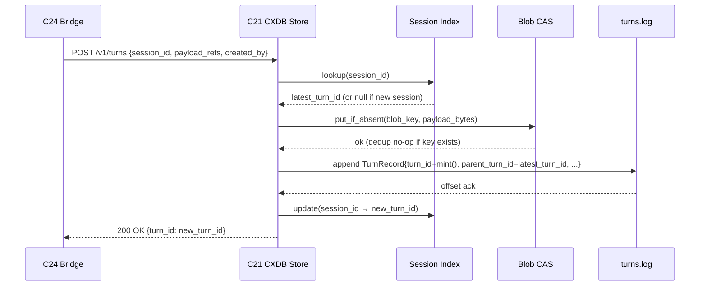

# C21 — CXDB Trajectory Store  (Spec, canonical track)

> Source: README §Part 4 (Persistence line 122 "CXDB for content-addressed trajectories … CXDB via bridge"; memory-layer table line 241 "Content-addressed trajectory store / Replay + branching + dedup / **CXDB** / Apache 2.0 / Bridge pack"; query interface line 242; event substrate line 252; P11 substrate line 261; P12 counterfactual line 274, line 278 "CXDB … the driver is your most significant invention"; license line 290; transfusion line 302; §Part 6 Phase 1 lines 388–397 install + bridge + "CXDB substrate ready for P11 anomaly clustering and P12 counterfactual replay"; §Part 7 line 500 "Foundational components (CXDB …) stay as upstream OSS"; line 541 "Install CXDB … first non-trivial integration; budget a week"), AI-CONTEXT §5 (CXDB — content-addressed trajectory store: §5.1 metadata lines 196–202, §5.2 ingestion API lines 204–210, §5.3 turn model lines 212–220, §5.4 bridges lines 222–232, §5.5 "what CXDB adds" lines 234–240), §10 license table (line 325 "Content-addressed substrate / CXDB / Apache 2.0 / Only player; mature for purpose"; line 359 counterfactual; line 375 layer mapping), §11 decisions (lines 463–466 CXDB integration Phase 1 + bridge path), §13.2 Phase-1 `[[service]]` block (lines 558, 579), §14 risk register (line 618 "CXDB stays small-team"), §15.2 repo (line 635); component-inventory C21 row (line 33) + critical-path notes (lines 107, 123); ambiguities-and-gaps G17, G33 (and G11 content-addressing thread).
> Inventory ID: C21   Kind: data-store   Status: sweep-2
> Track: A (canonical)
> Binding decisions obeyed: **D-2** (bundle namespace `softwarefactory.v4.trajectory`), **D-11** (LangFuse ingests TRACES only; metrics/events NOT asserted into LangFuse and NEVER into CXDB — two-sink anti-edge holds), **D-12** (two-sink rule stays as cross-referenced per-spec notes).

## 1. Purpose & responsibility

C21 is the factory's **content-addressed trajectory store**: an *adopted* (not authored) install of
**CXDB** (`github.com/strongdm/cxdb`, Apache 2.0 — *both the repo URL and the license are unverified
upstream assertions per G11; treat as provisional until the OQ-3/§6 conformance run confirms them*),
configured as the substrate that records agent
**trajectories** — the conversation-shaped, turn-by-turn history of every run — in a form that supports
**deduplication**, **O(1) branching**, and **replay**. It is the second persistence pillar alongside the
bead work-graph (C19): beads are the *typed work-ledger*, CXDB is the *content-addressed trajectory log*
(README line 122; AI-CONTEXT §2 line 52 "event store (CXDB) + work ledger (Beads)").

The store's organizing unit is the **turn** (not a span or an event): each turn carries a parent-turn
pointer forming a **DAG** (not a tree), payloads are content-addressed by **BLAKE3** of their
msgpack-serialized bytes ("Blob CAS"), and forking a trajectory from any point is **O(1)** — a new head
pointer, no history copy (AI-CONTEXT §5.3). This turn-DAG + CAS shape is what makes the two highest-value
loops buildable: **P11 self-healing** (anomaly→diagnosis over recorded trajectories) and **P12
self-optimization** (counterfactual replay = re-run a trajectory from a midpoint via O(1) branching)
(README lines 261, 274, 278; AI-CONTEXT §5.5).

**Responsibilities (what C21 is the spec-of-record for):**
- **Trajectory ingest** via CXDB's two native protocols: **binary msgpack on port 9009** (high-throughput
  writer, Go client library) and **HTTP/JSON REST on port 9010** (browsers, dashboards, ad-hoc queries)
  (AI-CONTEXT §5.2). C21 owns *that these endpoints exist and how the factory points at them*; the
  **bridge** that feeds them from Claude Code raw-API bodies is a *separate* component (C24).
- **Turn-DAG storage** — append a turn with a parent pointer; maintain the DAG of trajectories
  (AI-CONTEXT §5.3).
- **BLAKE3 content-addressing / Blob CAS** — store each payload once, keyed by BLAKE3 of its
  msgpack bytes; identical payloads dedup automatically; the hash is tamper-evidence (AI-CONTEXT §5.3,
  §5.5 line 236).
- **O(1) trajectory branching** — fork from any turn by creating a new head pointer with no history copy;
  the primitive C49 counterfactual-replay and self-healing investigations depend on (AI-CONTEXT §5.3 line
  216, §5.5 line 237).
- **Replay / retrieval** — reconstruct a trajectory by walking the parent chain; sub-ms retrieval over
  TB-scale (AI-CONTEXT §5.5 lines 239–240).
- **Hosting the dynamic type system** `{bundle_id, type, version}` per payload and the **type registry**
  (`registry/`) — CXDB *provides the mechanism*; the v4-specific **type bundle/schemas** registered into
  it are owned by **C22** (AI-CONTEXT §5.3 lines 218–219).
- **Query interface** — HTTP/JSON REST instead of grep over log files (AI-CONTEXT §5.5 line 240; README
  line 242).
- **File-backed storage layout** — `turns.log`, `blobs.pack`, `registry/`; **no Postgres/Redis/Kafka**
  (AI-CONTEXT §5.3 line 220).

**Explicitly NOT (boundaries):**
- **NOT authored by the factory.** Like C01, CXDB is *adopted verbatim* as upstream OSS (README line 500
  "Foundational components (CXDB …) stay as upstream OSS … The factory builds the orchestration glue, not
  the foundations"). Our deliverable is the **install + version-pin + `[[service]]` config + the type-bundle
  registration contract handed to C22 + the ingest/query seam handed to C24/consumers** — not CXDB's Rust
  source.
- **NOT the bridge.** The raw-API-bodies → CXDB **bridge** (a standalone Go tool-node binary in a pack
  that watches `OTEL_LOG_RAW_API_BODIES` and posts to :9010) is **C24** (README line 389; AI-CONTEXT §5.4
  line 232). C21 defines the *server-side ingest seam*; C24 owns delivery/ordering/back-pressure (G26).
- **NOT the v4 type schemas.** The concrete `{bundle_id, type, version}` bundle (e.g. the v4 turn/trajectory
  payload schemas) and viewpoint tagging are **C22** (inventory line 34). C21 hosts the registry mechanism;
  C22 fills it. This split is the faithful reading of inventory's "depends on: C21" for C22.
- **NOT the counterfactual-replay driver.** C21 provides the **O(1) branching primitive**; the *driver*
  that uses it to re-run trajectories from a midpoint for variant tests is **C49** — "your most significant
  invention … largely unsolved" (README line 278; AI-CONTEXT §10 line 359 "Primitive exists; driver yours").
- **NOT the bead store / event bus.** Beads (C19/C20) are the typed work-graph; the Gas City event bus
  (C23) is the append-only JSONL action log. CXDB is a *distinct* Apache-2.0 store added in Phase 1 via a
  bridge, not part of the Gas City substrate (README line 122; spec/C01 §1 boundary).
- **NOT an OTLP receiver.** CXDB has **no native OTLP receiver** and is explicitly positioned *against*
  OTel ("Spans model request trees, not conversations"); the OTLP→CXDB path is rejected (highest impedance)
  (AI-CONTEXT §5.2 line 210, §5.4 line 230; README line 466 "Skip OTLP → CXDB path"). C21 does not accept
  spans.
- **NOT a LangFuse sink, nor a metrics/events receiver for the observability pipeline.** Per D-11: "C26
  exports the trace signal to C27/LangFuse; metrics/events received by C26 are NOT asserted to appear in
  LangFuse (forwarded best-effort or not routed) and **NEVER to CXDB (two-sink anti-edge holds)**."
  Per D-12: "Fork stated at C25 (source), Collector✗→CXDB anti-edge at C26, C24/C27 cross-referencing."
  CXDB receives **only raw-API-body turns** via C24 bridge — never OTLP spans, never Collector-forwarded
  metrics, never LangFuse events. The two-sink boundary is stated here as the C21-side anti-edge; it is
  also cross-referenced at C24 and C26 per D-12.

## 2. Context & dependencies

| Direction | Component | Relationship |
|---|---|---|
| Upstream (depends on) | **C01** Gas City substrate | C21 is registered as a Phase-1 `[[service]]` block in `city.toml` and its lifecycle is operated alongside the substrate (AI-CONTEXT §13.2 lines 558, 579). Inventory C21 "Depends on: C01". |
| External dependency | **CXDB** (`github.com/strongdm/cxdb`, Apache 2.0) | The adopted store itself: Rust server (~16k LOC) + Go client (~9.5k) + React/TS frontend (~6.7k) + type registry + k8s manifests (AI-CONTEXT §5.1). **G33** (partial-failure) and the §14 "CXDB stays small-team" risk live here (§6). |
| Downstream (consumer) | **C22** CXDB type registry & viewpoint tagging | Registers the v4 `{bundle_id, type, version}` bundle (`softwarefactory.v4.trajectory`) into C21's `registry/`; **critical-path dependent** (inventory line 123). |
| Downstream (consumer) | **C24** Telemetry → CXDB bridge | Posts trajectory turns to C21's :9010 HTTP ingest (or :9009 binary); defines the delivery seam (G26/G27). Two-sink anti-edge: C24 feeds CXDB only from raw-API-bodies path, never from OTLP metrics/events (D-11/D-12). |
| Downstream (consumer) | **C49** Counterfactual replay driver | Re-runs trajectories from a midpoint via C21's O(1) branching; **critical-path dependent** "most significant invention" (inventory line 61). |
| Downstream (consumers) | **C36** Anomaly detection, **C37** Trajectory clustering, **C38** Diagnosis agent | The P11 self-healing loop reads/embeds/clusters/diagnoses over trajectories stored in C21 (inventory lines 48–50). |

**Position in the system.** C21 is **Batch-1 foundational** (inventory line 107) and the inventory names
it **the first thing to spec, carefully**: "C21 CXDB trajectory store (+ C22 type registry) — every
observability, clustering, replay, and loop-closure component reads/writes here. Resolves the most
foundational gaps (G17 schemas, G11 content-addressing). No exemplar for the v4-specific type bundle, so
spec this first and carefully" (inventory line 123). It is **on the critical path**: C49 (counterfactual
replay) and C22 (type registry) both depend directly on it. In the delivery plan it is **Phase 1** — the
"first non-trivial integration; budget a week" (README line 541).

## 3. Interfaces / contracts

| # | Interface | Direction | Description | Owning/detailing component |
|---|---|---|---|---|
| I1 | **Binary ingest (msgpack :9009)** | inbound (write) | High-throughput trajectory writer via the Go client library; append a turn + payload (AI-CONTEXT §5.2). The fast path for the bridge / Go writers. | C21 (this); C24 uses it |
| I2 | **HTTP/JSON ingest + query (REST :9010)** | inbound (write + read) | REST surface for browsers, dashboards, ad-hoc queries, and the recommended bridge post path (AI-CONTEXT §5.2, §5.4 line 232; README line 242 "CXDB HTTP API"). | C21 (this); C24 posts here |
| I3 | **Turn append (parent-pointered)** | inbound (write) | Append a turn carrying a parent-turn pointer, forming the DAG (AI-CONTEXT §5.3). Payload content-addressed on write. | C21 (this) |
| I4 | **Blob CAS (BLAKE3) put/get** | internal/inbound | Store/fetch a payload keyed by BLAKE3 of its msgpack bytes; identical payloads dedup (AI-CONTEXT §5.3, §5.5). | C21 (this) |
| I5 | **Branch / fork (O(1))** | inbound (write) | Create a new head pointer from any turn with no history copy (AI-CONTEXT §5.3 line 216). The primitive C49 builds on. | C21 (this); C49 consumes |
| I6 | **Replay / trajectory retrieval** | inbound (read) | Reconstruct a trajectory by walking the parent chain; sub-ms retrieval over TB-scale (AI-CONTEXT §5.5). | C21 (this); C36/C37/C38/C49 consume |
| I7 | **Type registry** (`{bundle_id, type, version}`, `registry/`) | inbound (config) + read | Register/resolve typed payload schemas (JSON bundles). C21 hosts the mechanism; the **v4 bundle is C22**. **D-2:** the v4 CXDB-turn/trajectory bundle is `softwarefactory.v4.trajectory`. | **C22** (the bundle), C21 (host) |
| I8 | **`[[service]]` lifecycle** | inbound (ops) | Registered in `city.toml` as a Phase-1 service the substrate operates (AI-CONTEXT §13.2 lines 558, 579). | C01 (host), C21 (config) |

**Invariants C21 must uphold (store-level):**
- **INV-1 (content-addressing):** every payload is keyed by BLAKE3 of its msgpack-serialized bytes;
  storing the same bytes twice yields one stored blob (dedup) and the same key (AI-CONTEXT §5.3, §5.5).
  > [FAITHFUL-FILL] v4 states "BLAKE3 Blob CAS" and "`{bundle_id,type,version}` per payload" (AI-CONTEXT
  > §5.3) but does not spell out the *serialize-then-hash ordering*. "msgpack-serialize the payload, then
  > BLAKE3 the msgpack bytes" is the minimal faithful reading (msgpack is v4's named turn-payload
  > encoding); the *BLAKE3 CAS + dedup* property is v4-stated, the serialization-ordering detail is filled.
- **INV-2 (turn-DAG, not tree):** every turn except a root has exactly one parent pointer; multiple turns
  may share a parent (branching); the structure is a DAG (AI-CONTEXT §5.3 line 215).
- **INV-3 (O(1) branch):** forking from any turn allocates a new head pointer and copies **no** history
  (AI-CONTEXT §5.3 line 216, §5.5 line 237). Branch cost is independent of trajectory length.
- **INV-4 (tamper-evidence):** because keys are BLAKE3 of content, any payload mutation changes its key;
  the parent chain is therefore content-verifiable (AI-CONTEXT §5.5 line 236).
- **INV-5 (no external datastore):** storage is `turns.log` + `blobs.pack` + `registry/` only — no
  Postgres/Redis/Kafka (AI-CONTEXT §5.3 line 220).
- **INV-6 (no OTLP):** the store ingests turns, not OTel spans; OTLP is not an accepted protocol
  (AI-CONTEXT §5.2 line 210).
- **INV-7 (two-sink anti-edge):** CXDB is never a destination for OTLP metrics, OTLP events, or any
  Collector-forwarded signals. The only write path into CXDB is the raw-API-bodies bridge (C24). This is
  the C21-side statement of the D-11/D-12 invariant; C24 and C26 cross-reference it per D-12.

### 3.1 Turn-append contract (Sweep-2 — I3 concrete)

The **turn-append** is the atomic write unit. C21 accepts it on both I1 (binary :9009) and I2 (HTTP :9010);
the wire encoding differs but the logical message is the same.

**Logical turn-append message:**

```
TurnAppend {
  parent_turn_id:  TurnID | null      // null iff root turn (new trajectory)
  payload_refs:    list<PayloadRef>   // one or more typed payloads carried by this turn
  created_by:      string             // actor attribution (C01 INV-3; README P9)
                                      // wire type = colon-delimited "kind:id" string per D-29 (parsed to C41 ActorRef); resolves OQ-C41-4.
  session_id:      string             // the session.id from Claude Code correlation attrs
                                      // (AI-CONTEXT §5.2 line 178: "session.id" OTEL attr)
                                      // → used to resolve parent_turn_id via §3.2
}

PayloadRef {
  blob_key:   Blake3Key               // BLAKE3 of msgpack(payload_bytes)
  bundle_id:  string                  // D-2: "softwarefactory.v4.trajectory"
  type_name:  string                  // C22-registered type name (e.g. "AgentTurn")
  version:    semver string           // the registered schema version
  bytes:      bytes                   // the msgpack-serialized payload (stored iff not in CAS)
}

TurnID   = string  // opaque, server-minted; stable and globally unique within this store
Blake3Key = [32]byte
```

> [FAITHFUL-FILL] v4 names `{bundle_id, type, version}` per payload and a parent-turn pointer but
> does not give a wire message shape. The struct above is the minimal faithful elaboration: `session_id`
> is included because AI-CONTEXT §5.4 line 229 states "parent-chain via `session.id`" as the mechanism
> the bridge uses — C21 needs `session_id` on the turn-append in order to resolve the parent when C24
> doesn't carry an explicit `parent_turn_id` (§3.2). `created_by` mirrors the corpus-wide attribution
> requirement (C01 INV-3; README P9). `blob_key` + `bytes` together let the CAS implement INV-1: C21
> hashes `bytes` and verifies it equals `blob_key` before storing; re-posting an existing key is a no-op.

**On :9009 (binary/msgpack):** The Go client library serializes `TurnAppend` as a msgpack map with the
keys above; the wire bytes are sent over the TCP connection on port 9009.

**On :9010 (HTTP/JSON REST):** `POST /v1/turns` with a JSON body. Field names match the struct above;
`bytes` is base64-encoded. Idempotency key: `blob_key` hex-string, asserted in `X-Idempotency-Key` header
(so bridge retries are safe — INV-1 idempotency, G33/AC-7).

> [C21:OQ-4] **HTTP :9010 vs binary :9009 for the bridge under load.** AI-CONTEXT §5.4 recommends the
> HTTP path for the bridge (line 232) but :9009 is the high-throughput path. The question is whether
> :9010 can sustain bridge traffic at P11/P12 volume, or whether C24 must use the binary client. This
> is the interacting gap (G26 back-pressure). **Resolution deferred to C24's sweep-2 design** — C21's
> server-side seam is symmetric (both paths accept the same logical `TurnAppend`), so the choice is
> C24's to make against its own back-pressure analysis. This spec states both are accepted; C24 freezes
> which one it uses at its M2 milestone. *(= OQ-4 preserved from Sweep-1.)*

### 3.2 `session.id` → parent-turn chaining rule (the C24 seam / G26)

G26 (major gap) names: "how `session.id` maps to CXDB's parent-turn pointer (AI-CONTEXT §5.4 says
'parent-chain via session.id' but the mapping rule is not given)."

**C21's half of the rule (what the store enforces):**
- C21 maintains an internal index `session_id → latest_turn_id`. On every accepted `TurnAppend`, if
  `session_id` is present and `parent_turn_id` is null, C21 looks up the index to find the latest turn
  for that session and fills `parent_turn_id` from the index entry (creating the parent chain).
- After appending, C21 updates the index: `session_id → new_turn_id`.
- A turn with an explicit non-null `parent_turn_id` bypasses the index lookup (it is already chained).
- A root turn (new trajectory, `parent_turn_id=null`, no prior entry in index) creates a new index
  entry: `session_id → new_turn_id`.

> [FAITHFUL-FILL] The "parent-chain via `session.id`" statement (AI-CONTEXT §5.4 line 229) is the only
> v4 specification of the chaining mechanism. The session-index approach above is the minimal
> consistent implementation: it makes `session.id` the natural session-scoped linearisation key
> (matching how Claude Code attributes all turns in one session under one `session.id`) and requires no
> out-of-band state on the bridge side. C24's obligation is only to include `session_id` on every
> `TurnAppend`; C21's index does the chaining. The G26 "mapping rule not given" is addressed here as
> C21's authoritative statement — C24 cross-references this rule.

**C24's half (what the bridge must do):** forward `session_id` (from `OTEL_LOG_RAW_API_BODIES` raw-body
correlation attr `session.id`) on every `TurnAppend`. C24 MUST NOT manage explicit `parent_turn_id`s
unless overriding (e.g. branching for counterfactual replay, handled by C49 which sends explicit
`parent_turn_id`). The ordering/at-least-once semantics are C24's (G26); C21 is idempotent on
re-delivered turns (INV-1 + the idempotency key on :9010).

### 3.3 Branch contract (I5 concrete — the C49 seam)

```
BranchRequest {
  from_turn_id: TurnID      // the turn to fork from (must exist)
  label:        string?     // optional human label for the branch head
}
BranchResponse {
  branch_head_id: TurnID    // the new head (== from_turn_id; no history copied)
  branch_id:      string    // opaque stable branch identifier for subsequent appends
}
```

To extend the branch, subsequent `TurnAppend` calls set `parent_turn_id = branch_head_id`. The branch
grows forward independently; the forked history (≤ `from_turn_id`) is shared by reference (INV-3,
O(1)). This is the primitive C49's driver calls before re-running the agent from `from_turn_id` forward.

### 3.4 Registration contract for the v4 trajectory bundle (the C22 seam / D-2)

C21 hosts the `register_bundle` mechanism. C22 calls it with:

```
register_bundle({
  bundle_id: "softwarefactory.v4.trajectory",   // D-2: the trajectory namespace
  version:   "<semver>",
  types: {
    "softwarefactory.v4.trajectory:AgentTurn":       { <C22 §4.x schema> },
    "softwarefactory.v4.trajectory:ToolCall":        { <C22 §4.x schema> },
    "softwarefactory.v4.trajectory:ToolResult":      { <C22 §4.x schema> },
    "softwarefactory.v4.trajectory:Anomaly":         { <C22 §4.x schema> },
    // ... full set owned by C22
  }
})
```

C21's precondition: `bundle_id` must match the D-2-ruled string exactly (`softwarefactory.v4.trajectory`);
any other string is rejected (E6). C21's postcondition: `{bundle_id, type_name, version}` resolves to a
schema via the `registry/` dir; typed payloads project structurally in the frontend (§5.5 line 238).

> **Two-sink note (D-11/D-12):** the `softwarefactory.v4.trajectory` bundle contains ONLY turn/trajectory
> payload types (agent conversation content). It NEVER contains OTLP metric schemas, LangFuse event
> schemas, or any cross-sink type. The bundle is the C21-side enforcement of the two-sink boundary.

## 4. Data model / state

### 4.1 The turn record (concrete — Sweep-2)

A **turn record** is the atomic unit stored in `turns.log`. It is C21's internal record shape
(not a wire format — the wire is `TurnAppend`; the stored record is what C21 writes after acceptance).

| Field | Type | Req? | Semantics | Read by / Write by |
|---|---|---|---|---|
| `turn_id` | `TurnID` (string, server-minted) | R (server) | stable globally-unique identifier for this turn; target of `from_turn_id` in branch requests | all readers; C21 mints |
| `parent_turn_id` | `TurnID` \| null | R | pointer to parent turn (null = trajectory root); forms the DAG backbone (INV-2) | all traversal; C21 sets via §3.2 |
| `session_id` | `string` | R | the `session.id` correlation attribute from Claude Code (AI-CONTEXT §5.2 line 178); indexes the session-chain (§3.2) | C21 session-index; C24 carries it |
| `created_by` | `string` | R | actor attribution — mirrors the corpus-wide P9 requirement (C01 INV-3; README line 231); all trajectories are attributable. `created_by` wire type = colon-delimited `"kind:id"` string per **D-29** (parsed to C41 `ActorRef`); resolves OQ-C41-4. | C24 bridge sets (from raw-body attribution); C41 semantics |
| `payload_refs` | `list<PayloadRef>` | R | ordered list of typed, content-addressed payloads on this turn; each entry is a `{turn_id, blob_key, bundle_id, type_name, version}` row (§4.2) | C36/C37/C38/C49 read |
| `appended_at` | `timestamp` | R | wall-clock time at which C21 accepted this turn; used for ordering within a session branch when parent pointers are ambiguous | C21 sets; C37 clustering |
| `branch_id` | `string` \| null | O | set by C21 when the turn was appended to a named branch (§3.3); null on the main trajectory trunk | C49 reads for replay bookkeeping |

> [FAITHFUL-FILL] v4 specifies the turn *model* (parent pointer + content-addressed payloads + type triple,
> AI-CONTEXT §5.3) but not the concrete stored record. The fields above are the minimal faithful
> elaboration: `turn_id` is required for any DAG traversal; `session_id` is the chaining key (§3.2);
> `created_by` is the corpus-wide attribution requirement; `appended_at` is the minimum timestamp for
> unambiguous ordering; `branch_id` is needed to distinguish main-trunk turns from branch turns for C49.
> The *typed payload schemas* remain **C22's property** — C21 stores the triple + blob key, C22 owns
> what the payload bytes mean.

### 4.2 The payload-reference record (per-turn slot in `blobs.pack`)

| Field | Type | Req? | Semantics | Read by / Write by |
|---|---|---|---|---|
| `blob_key` | `[32]byte` (BLAKE3) | R | BLAKE3 of `msgpack(payload_bytes)`; the CAS address (INV-1) | C21 CAS; C21 dedup |
| `bundle_id` | `string` | R | must equal `softwarefactory.v4.trajectory` (D-2; validated at write — E6 otherwise) | C22 registered; all typed readers |
| `type_name` | `string` | R | the C22-registered type name within the bundle (e.g. `AgentTurn`) | C22 resolution; frontend projection |
| `version` | `string` (semver) | R | the bundle version against which `type_name` is resolved (registry/ lookup) | C22 resolution |
| `payload_bytes` | `bytes` (msgpack) | R | the raw msgpack-serialized payload; stored in `blobs.pack` keyed by `blob_key` | C21 stores; all raw readers |

### 4.3 Storage layout (file-backed, no external datastore — INV-5)

| File | Contents | Access pattern |
|---|---|---|
| `turns.log` | Append-only log of turn records (§4.1); each entry length-prefixed (msgpack frame) | Append-only write; sequential scan for replay; random-access via `turn_id` index |
| `blobs.pack` | BLAKE3-keyed CAS of `payload_bytes`; one entry per unique blob_key | Keyed get/put; dedup enforced by key presence check before write |
| `registry/` | Directory of JSON bundle files; one file per registered `{bundle_id, version}` pair | Read at type-resolution time; written by `register_bundle` |
| `session_index` | In-memory (or on-disk) map `session_id → latest_turn_id`; the §3.2 chaining state | Read/write on every `TurnAppend` |
| `turn_id_index` | In-memory (or on-disk) map `turn_id → offset_in_turns_log`; required for O(1) look-up by `from_turn_id` | Written on every append; read on branch + replay |

> [FAITHFUL-FILL] The `session_index` and `turn_id_index` are implied by the operations v4 names
> (parent-chain-via-session.id, O(1) branch, sub-ms retrieval) but are never mentioned explicitly.
> They are the minimal implementation artifacts that make those properties achievable; both are
> internal to C21 and not directly observable from the outside. Whether they are in-memory maps
> (reset on restart, rebuilt from `turns.log`) or on-disk WAL entries is an implementation detail left
> to the conformance run (T2/T3).

### 4.4 Persistence and consistency contract

- **Append-only:** `turns.log` is never mutated after a turn is written; individual turn records are
  immutable once appended. `blobs.pack` entries are similarly immutable (keyed by their own BLAKE3 hash —
  mutation changes the key, so it is a new entry, not a rewrite). This gives write-once-read-many
  semantics and makes BLAKE3 tamper-evidence meaningful (INV-4).
- **Idempotent ingest:** re-posting a `TurnAppend` with an existing `blob_key` is a no-op on `blobs.pack`
  (INV-1 + CAS put-if-absent). A duplicate turn-append (same `session_id`, same payload) MUST NOT create
  a second turn record. C21 detects duplicates via `{session_id, blob_key}` — if both match a recent
  turn, the write is accepted as a no-op (ACK returned, no new record written). This property is what
  allows C24 to retry on delivery failure without corrupting the trajectory (G33/AC-7).
- **Single-node, no built-in HA.** v4 prescribes no replication or HA design for CXDB. C21 is single-node,
  file-backed, with no multi-node clustering. Durability is bounded by single-node file I/O. A CXDB
  outage does not crash the factory (G33 fail-open, §6); the window's trajectories are recoverable only
  if C24 buffered them (G26 back-pressure is C24's obligation). This is a **known limitation**, not a
  gap to close here — P11/P12 volume adequacy is OQ-2.
- **Schema-version consistency:** turn records are validated against the registered `{bundle_id,
  type_name, version}` schema at write time. A schema-version bump (C22 issues a new bundle version)
  makes the new version available but does not invalidate old turns stored under the prior version — old
  turns carry the version they were written with, and projection is version-matched (E7 prevention).
- **Registry/store agreement:** the `registry/` directory is the single authority on valid type triples.
  An unknown `{bundle_id, type_name}` on a `TurnAppend` is rejected (E5). C22's `register_bundle` must
  complete before C24 attempts to ingest turns of the registered types.

## 5. Behavior

**Stand up (Phase 1).** Operator installs the pinned CXDB server, exposes :9009 (binary) and :9010
(HTTP), and registers a `[[service]]` block in `city.toml` (AI-CONTEXT §13.2). The v4 type bundle (C22)
is registered into `registry/`. The bridge (C24) is then pointed at :9010. Result: a content-addressed
trajectory store standing alongside the Gas City substrate, ready for P10 full memory + P11/P12 (README
lines 393, 397).

### 5.1 Turn ingest + parent-chaining sequence (Sweep-2 Mermaid)

The sequence below shows a C24 bridge posting a turn for an **existing session** (the common case after
the first turn), with C21's session-index doing the parent chaining. Participants: C24 Bridge, C21 Store,
Session Index, Blob CAS, Turn Log.



Key invariants exercised: INV-1 (CAS dedup on step 4), INV-2 (parent pointer set from index on step 3),
INV-7 (only raw-API-body turns arrive here, never OTLP metrics/events — the bridge's write path is the
only write path into C21).

**Branch (O(1)).** A consumer (C49 driver, or a self-healing investigation) requests a fork from turn T.
C21 creates a new head pointer rooted at T; **no history is copied** (INV-3). Subsequent appends extend
the new branch independently. This is the primitive that makes counterfactual replay tractable
(AI-CONTEXT §5.5 line 237; README line 274).

**Replay / retrieve.** A consumer requests a trajectory by head turn; C21 walks the parent chain to the
root, resolving each turn's content-addressed payloads from the Blob CAS; **sub-ms retrieval over
TB-scale** (AI-CONTEXT §5.5 line 240). Type-aware projection lets the UI render typed payloads structurally
rather than as raw JSON (AI-CONTEXT §5.5 line 238).

## 6. Failure modes & handling

C21 carries the foundation-level gaps assigned to it (G17, G33) plus the inherited dependency risk (G11
thread / §14 "CXDB stays small-team").

**G17 (blocker) — no schema for the core stores; the v4-specific type bundle is never specified.**
CXDB's turn model is described (AI-CONTEXT §5.3) but "the v4-specific type bundle (`{bundle_id, type,
version}`) that v4 must register is never specified" (G17). For C21 the faithful resolution is a **split**:
C21 specifies *that* CXDB provides the registry mechanism and the turn-record shape (INV-1…INV-7 + the
[FAITHFUL-FILL] turn record in §4.1); the **concrete v4 payload schemas/bundle are owned by C22** (inventory
line 34 "Dynamic `{bundle_id,type,version}` type system"). C21 thus *addresses* G17 for the store mechanism
and **defers the schema content to C22** — the inventory's own decomposition. C21's acceptance (§8) requires
that a v4 bundle *can* be registered and resolved, proving the mechanism even before C22 fills it.

**G33 (major) — no story for partial/cascading failure of the OSS stack; specifically "What happens when
CXDB is down mid-run?"**
> [AMBIGUITY: G33] Two readings of C21's obligation. **(a)** *CXDB is best-effort observability* — if the
> store is down, the run continues and trajectories for that window are simply lost (degraded, fail-open).
> **(b)** *CXDB is load-bearing for P11/P12* — a down store must not silently drop trajectories the
> self-healing/optimization loops depend on, so the **bridge** must buffer/back-pressure (the actual seam).
> **Chosen: (a) for C21, with the durability obligation placed on C24.** This is most consistent with v4:
> the trajectory store is an *additive Phase-1* capability layered on a substrate that already has its own
> durable beads + event bus (the run's source-of-truth survives in Gas City regardless), and v4 explicitly
> locates the delivery/back-pressure question at the **bridge seam** ("back-pressure when CXDB is down" is
> listed under the *bridge* gap G26, not the store). Faithful handling: C21 must **fail-open to the run**
> (a CXDB outage does not crash the factory; the run proceeds on beads+events), MUST be **idempotent on
> replayed writes** (BLAKE3 content-addressing makes re-posting the same turn a no-op — INV-1 + §4.4 —
> which is exactly what a buffering bridge needs), and **defers** the buffer/retry/circuit-breaker design to
> **C24** (G26/G33). v4 prescribes no in-store HA design; inventing replication/clustering would exceed
> faithful scope, so C21 records "single-node, file-backed, no built-in HA" as a known limitation → OQ.

**§14 dependency risk — "CXDB stays small-team" (Medium/Medium).** Mitigation per v4: "Apache 2.0 means a
fork is always available; design integration to minimize lock-in" (AI-CONTEXT §14 line 618). Faithful
handling: keep the integration behind the named seams (I1–I8) so a fork/replacement is a seam-swap, and
**pin a version** (mirrors spec/C01 INV-1) so behaviour is reproducible.

**G11 thread (content-addressing / unverified third-party).** Like Gas City, every claimed CXDB behaviour
(BLAKE3 dedup, O(1) branch, p50<1ms, sub-ms TB-scale retrieval) is an *unverified upstream assumption* until
exercised. C21's acceptance (§8) includes a **conformance check** against the *pinned* CXDB that proves
dedup, O(1) branch (cost independent of length), and the performance contract — the de-risking gate before
C22/C24/C49 build on it.

**Degraded behaviour.** CXDB down ⇒ run continues on beads+events (fail-open, reading (a) above); the
window's trajectories are recoverable iff the bridge (C24) buffered them. Corrupt/partial turn write ⇒
detectable via BLAKE3 mismatch (INV-4).

### 6.1 Error taxonomy (Sweep-2 E-codes)

Each failure code names: detection surface, handling, and the invariant/gap it protects.

| Code | Failure | Detection surface | Handling |
|---|---|---|---|
| E1 | **Unknown type triple** — `{bundle_id, type_name, version}` not registered in `registry/` | Write-time validation (§4.4 registry/store agreement) | Reject the `TurnAppend`; writer (C24) must ensure C22's `register_bundle` completed before ingesting turns of that type. Prevents silent type-blind storage (G17 store-side). |
| E2 | **Wrong bundle_id** — `bundle_id ≠ "softwarefactory.v4.trajectory"` on any payload | Write-time validation (INV-7 + D-2 enforcement) | Reject the `TurnAppend` with a descriptive error. This is the C21-side enforcement of D-2 and the two-sink boundary. An OTLP metric or LangFuse event that somehow reaches C21 would fail here. |
| E3 | **Missing required turn field** — e.g. `session_id` or `created_by` absent | Write-time required-field check (§4.1 Req=R fields) | Reject the `TurnAppend`. `session_id` is required for the chaining rule (§3.2); `created_by` is required by the corpus attribution invariant (C01 INV-3). |
| E4 | **BLAKE3 mismatch** — `blob_key` in the request does not match BLAKE3(`payload_bytes`) | Blob CAS verification on write (INV-1) | Reject the write; indicates bit-corruption in transit or a buggy client. The bridge (C24) must re-serialize and recompute before retry. |
| E5 | **Orphaned parent** — `parent_turn_id` is not null but the referenced turn_id does not exist | Write-time parent-existence check | Reject the `TurnAppend`. A bridge delivering out-of-order turns must retry in order (G26 ordering obligation at C24, not C21). |
| E6 | **Bundle namespace collision** — `register_bundle` called with `bundle_id` other than `softwarefactory.v4.trajectory` | `register_bundle` precondition (§3.4, D-2) | Reject registration. Preserves the D-2 namespace ruling and prevents a rogue bundle from polluting the trajectory registry. |
| E7 | **Schema-version drift** — a turn's `version` field references a bundle version not in `registry/` | Type-resolution at read/projection time | Fail-loud on projection; the stored bytes remain intact (append-only). Resolution: C22 must register the missing version; old turns project against the version they were stored with (§4.4). |
| E8 | **Duplicate turn (non-idempotent client)** — same `{session_id, blob_key}` re-posted | Dedup check on write (§4.4 idempotency) | Accept as no-op (ACK returned, no second record written). This is the C21 side of the G33 idempotent-ingest property C24's buffer relies on. |
| E9 | **OTLP span ingestion attempt** — any write on the OTLP path or carrying `otlp.*` type names | INV-6 + E2 (wrong bundle_id) | Reject immediately. CXDB is not an OTLP receiver (AI-CONTEXT §5.2 line 210; D-11 anti-edge). |
| E10 | **Store unavailable (CXDB down)** — :9009/:9010 unreachable | C24's health check / connection error | Fail-open (G33 §6): the run continues on beads+events; C24 buffers and retries when the store recovers. C21 itself cannot handle its own outage — this is the C24-side obligation. |

> **Two-sink anti-edge (D-11/D-12) as testable invariant:** E2 and E9 together form the AC-10
> acceptance test (§8) — no signal from the OTLP/Collector/LangFuse pipeline can reach C21 storage.
> This is the C21-side enforcement of D-11: "metrics/events received by C26 are NOT asserted to appear
> in LangFuse (forwarded best-effort or not routed) and NEVER to CXDB (two-sink anti-edge holds)."

## 7. Cross-cutting (security / cost / scale / observability / ops)

- **Security.** BLAKE3 content-addressing gives **tamper-evidence** (INV-4) — a payload cannot be silently
  altered without changing its key. The `created_by` carried on turns (§4.1) preserves the P9 attribution
  chain into trajectories. Secret/endpoint handling for the `[[service]]` block inherits the G37
  plaintext-TOML exposure (flagged, deferred to config/secrets owner — out of C21 faithful scope; D-25
  posture: env-injection or SOPS at first real credential). The two-sink boundary (INV-7) is also a
  security property: CXDB does not receive Collector-forwarded signals, which could contain sensitive
  trace data intended only for LangFuse.
- **Cost.** v4 gives no CXDB-specific cost model (G32); storage is file-backed local I/O (no managed DB
  fees). The *consumer* costs (embedding all trajectories for C37, replay token spend for C49) belong to
  those components, not the store.
- **Scale.** Performance *claim* (upstream, unverified — measured at AC-6): **p50 < 1ms append for 10KB
  payloads; sub-ms retrieval over TB-scale** (AI-CONTEXT §5.5). O(1) branching means trajectory-count, not
  depth, drives branch cost. v4 names no multi-node/HA story → single-node ceiling is a known limitation
  (OQ-2). BLAKE3 dedup (INV-1) mitigates repeated-payload storage cost.
- **Observability.** C21 *is* the observability substrate for trajectories; the React/TS frontend
  (AI-CONTEXT §5.1) renders typed payloads. The store's own health (up/down, lag) is what G33/C24 must
  monitor. C21 does not self-observe (its own metrics go through C25→C26, not into itself).
- **Ops.** Install = pinned CXDB server + :9009/:9010 exposure + `[[service]]` registration; "first
  non-trivial integration; budget a week" (README line 541). Version pin + reproducible install are the
  key ops invariants (mirrors C01). Schema bumps require a new bundle version via C22's `register_bundle`
  (immutable once published); old turns project against their stored version (§4.4, E7).

## 8. Acceptance criteria & test strategy

### 8.1 Sweep-1 criteria (preserved)

1. **AC-1 (store stands up):** the pinned CXDB exposes :9009 (binary) and :9010 (HTTP), registered as a
   Phase-1 `[[service]]` in `city.toml`, alongside the Gas City substrate (AI-CONTEXT §13.2; README line
   388).
2. **AC-2 (content-addressing + dedup — INV-1):** posting two turns with byte-identical payloads stores
   the blob **once** and both turns reference the same BLAKE3 key (AI-CONTEXT §5.5 line 236).
3. **AC-3 (turn-DAG + replay — INV-2/I6):** a multi-turn trajectory is reconstructable by walking parent
   pointers from head to root; the result equals what was ingested.
4. **AC-4 (O(1) branch — INV-3):** forking from a turn at depth N is **constant-time / no history copy**
   independent of N; the new branch extends independently of the parent (AI-CONTEXT §5.3 line 216).
5. **AC-5 (registry mechanism — addresses G17):** a v4 `{bundle_id, type, version}` bundle can be
   registered into `registry/` and resolved on read; typed payloads project structurally (AI-CONTEXT §5.3,
   §5.5 line 238).
6. **AC-6 (performance contract — *measure, don't assume*):** **measure and record** p50 append for 10KB
   payloads and point-retrieval latency against the *pinned* binary, comparing them to v4's asserted
   "p50 < 1ms / sub-ms over TB-scale" (AI-CONTEXT §5.5 lines 239–240). A miss is a finding, not a blocker.
7. **AC-7 (fail-open + idempotent ingest — addresses G33):** with CXDB down, a factory run continues on
   beads+events without crashing; re-posting a previously-accepted turn is a **no-op** (BLAKE3 idempotency
   + §4.4 dedup, INV-1).
8. **AC-8 (no OTLP — INV-6):** the store rejects/does-not-accept OTel spans; only turns are ingested
   (AI-CONTEXT §5.2 line 210).

### 8.2 Sweep-2 concrete acceptance tests (AC-codes)

Each is an executable check against the conformance pack. `assert reject(...)` = the write is refused;
`assert roundtrips(t)` = `read(write(t)) == t`; `assert no_op(t)` = second write of t creates no new turn.

**Schema / namespace enforcement (D-2 / E1 / E2 / E6)**
- **AC-S2-N1** — `register_bundle` with `bundle_id = "softwarefactory.v4.trajectory"` succeeds; any
  other bundle_id (e.g. `strongdm.agents.v1`, `softwarefactory.v4.beads`) is rejected with E6. Verbatim
  D-2: "One factory-owned reverse-DNS root with per-store sub-bundles: … `softwarefactory.v4.trajectory`
  (CXDB turn types). Drop vendor `strongdm.*`."
- **AC-S2-N2** — a `TurnAppend` with an unregistered `{bundle_id, type_name, version}` is rejected (E1);
  a registered triple is accepted and the turn is stored.
- **AC-S2-N3** — a `TurnAppend` with `bundle_id ≠ "softwarefactory.v4.trajectory"` is rejected (E2);
  the C21-side enforcement of D-2 and INV-7.

**Turn record / round-trip (§4.1 / §4.2)**
- **AC-S2-T1** — a valid `TurnAppend` round-trips: `{turn_id, parent_turn_id, session_id, created_by, payload_refs, appended_at}` are present and equal on read-back (§4.1 Req=R fields).
- **AC-S2-T2** — a `TurnAppend` without `session_id` is rejected (E3); without `created_by` is rejected
  (E3); these are required fields (§4.1).
- **AC-S2-T3** — a `TurnAppend` with a `blob_key` that does not match BLAKE3(`payload_bytes`) is
  rejected (E4). Verifies the CAS integrity check.
- **AC-S2-T4** — a `TurnAppend` with `parent_turn_id` pointing to a non-existent turn is rejected (E5;
  orphaned parent).

**Session chaining (§3.2 / G26 resolution)**
- **AC-S2-C1** — two sequential `TurnAppend` calls with the same `session_id` and null `parent_turn_id`
  produce two turns where the second's `parent_turn_id` equals the first's `turn_id`; the session index
  chains them automatically (§3.2 rule).
- **AC-S2-C2** — a `TurnAppend` with an explicit `parent_turn_id` bypasses the index and chains to the
  specified turn (§3.2 override case, used by C49 for branch replay).
- **AC-S2-C3** — a root turn (first for a new `session_id`) produces a turn with `parent_turn_id = null`
  and creates a new session-index entry.

**Branch contract (§3.3 / INV-3 / C49 seam)**
- **AC-S2-B1** — a `BranchRequest` from a turn at depth N produces a `branch_head_id` instantly
  (constant-time, no history copy); the branch extends independently with subsequent `TurnAppend` calls.
  This is AC-4 at the wire-contract level.
- **AC-S2-B2** — a replay consumer reading the branch trajectory sees: main-trunk turns up to
  `from_turn_id`, then branch turns after it; shared prefix is not duplicated in storage.

**Idempotency / dedup (§4.4 / E8 / AC-7)**
- **AC-S2-I1** — re-posting an identical `TurnAppend` (same `session_id` + same `blob_key`) is a no-op:
  no second turn record is created, the same `turn_id` is returned, and `blobs.pack` has one copy (E8
  + INV-1 + §4.4).
- **AC-S2-I2** — re-posting two turns with byte-identical payloads (different sessions) stores the blob
  **once** in `blobs.pack` and both turns reference the same `blob_key` (AC-2 at the concrete level).

**Two-sink anti-edge (D-11 / D-12 / INV-7 / E2 / E9)**
- **AC-S2-D1 (the two-sink invariant test)** — an attempt to write an OTLP span payload (any
  `bundle_id` containing an OTLP type, or a raw OTLP POST to :9010) is rejected (E9/E2). **This test
  asserts the D-11/D-12 invariant as a hard store-level rejection** — "NEVER to CXDB (two-sink
  anti-edge holds)" — not merely a routing policy at C26. The test simulates what would happen if a
  misconfigured Collector tried to forward to C21, and verifies that C21 does not silently accept it.
- **AC-S2-D2** — a `TurnAppend` carrying a valid `softwarefactory.v4.trajectory` type and a separate
  payload carrying a non-trajectory `bundle_id` is rejected as a whole (E2 on the offending payload
  ref). Each `PayloadRef` is individually validated.

**Test strategy.** A **CXDB-conformance pack** (mirroring the C01 conformance shape) that boots the
pinned CXDB and asserts AC-1…AC-8 + AC-S2-N1…AC-S2-D2 against a *real* pinned binary. The two-sink
anti-edge test (AC-S2-D1) is run at the conformance layer, not just the bridge layer, so the invariant
is verified at the store — even before C24 is wired up. **AC-4 / AC-S2-B1 (O(1) branch) is the gating
exit criterion** — must pass before C49/C22/C24 are unblocked.

## 9. Open questions

- **OQ-1 (→ review-log, top):** **G17 split** — C21 owns the registry *mechanism*, C22 owns the v4 *bundle*.
  Is the inventory split (C21 store / C22 type-bundle) the intended decomposition, and exactly which
  turn-record fields are C21's (the §4.1 [FAITHFUL-FILL]) vs which payload schemas are C22's? Freeze this seam
  at sweep 2 before C22 builds. *(The §4.1 table and §3.1 message shape above are C21's proposal; C22 must
  confirm or correct the turn-record field list before freezing.)*
- **OQ-2 (→ review-log):** **G33 / store availability** — confirm the fail-open reading (run survives a
  CXDB outage on beads+events) and that the durability obligation (buffer/back-pressure) is C24's, not the
  store's. v4 has no in-store HA design; is single-node file-backed acceptable for P11/P12 volume, or does
  the optimized track need replication?
- **OQ-3:** Which CXDB version/commit to pin, and has anyone exercised the BLAKE3-dedup / O(1)-branch /
  p50<1ms claims against a real binary (the G11 content-addressing thread)? Until a conformance run exists,
  every branching/perf claim is provisional.
- **OQ-4 (C21:OQ-4):** **HTTP :9010 vs binary :9009 ingest under load** — v4 recommends HTTP for the
  bridge (AI-CONTEXT §5.4 line 232) but :9009 is the high-throughput path; can :9010 sustain bridge
  traffic at P11/P12 volume? C21 accepts both (§3.1); C24 freezes which one it uses at its M2 milestone.
  Interacts with G26 back-pressure. **This is the top open question for the C21/C24 integration.**
