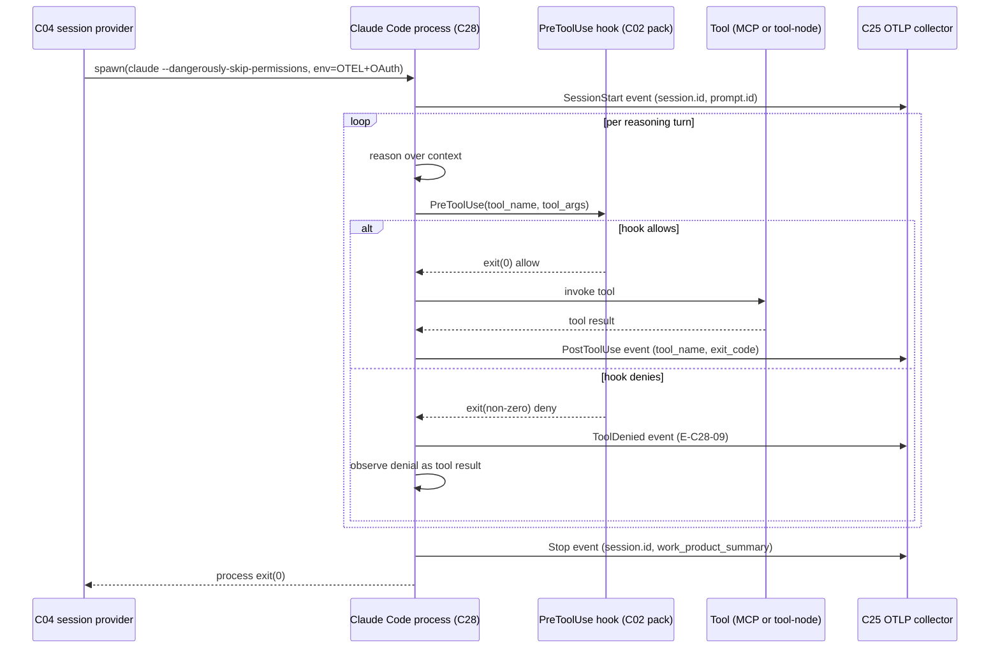
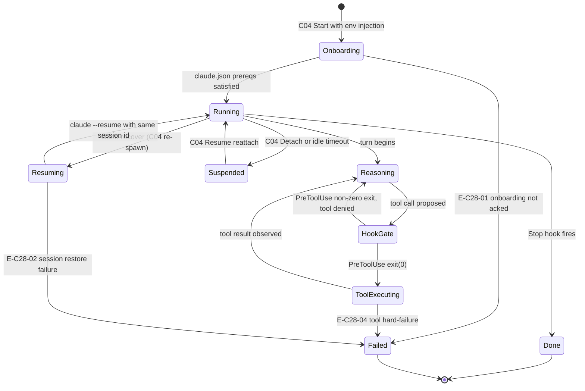

# C28 — Claude Code Agent Loop  (Spec, canonical track)

> Source: README §"Principle 2 — Three-layer architecture" (L113–124, L60–74), §"Concrete first steps" Phase-0 checklist (L533–543), §"Cross-session continuity" (L240), §"Event substrate" (L252); AI-CONTEXT §2 (L46–56), §4 (L139–190), §13.2 (L569–580), §13.3 (L587–596), §14 (L624); one-shot-specs §"Specs library" agent-loop row (L21).
> Inventory ID: C28   Kind: agent-role   Status: sweep-2
> Maps from: A04, A04b, A05, A28d, A28e, A28f, A28g, A28h, B20, B21. Depends on: C04. Key gaps: G12, G13, G34.

> [D-23 substrate-verified — gascity-prototype@b14c278, 2026-05-25]
>
> F7 — Phase-0 Provider-kind = **tmux**. Each agent runs as a separate interactive `claude` process in its own tmux pane. C28 is the loop running inside that pane. Verified against `lago-morph/gascity-prototype@b14c278`.
>
> F12 — `claude --dangerously-skip-permissions` refuses root unless `IS_SANDBOX=1`. Three onboarding dialogs must be pre-acknowledged in `~/.claude.json` (NOT `~/.claude/settings.json`) and per-working-directory trust entries written by the entrypoint before any C28 session can start. Verified against the prototype `entrypoint.sh`.

---

## Binding decisions (verbatim, per SWEEP2-DISPATCH §"Cite binding decisions VERBATIM")

**D-30 (ADOPTED — operator, 2026-06-01):**
> "unattended operation (P2) and self-modification (P3b) require the substrate to BLOCK (prevent at the tool-call/process boundary) — not merely detect — out-of-boundary access on the relevant blast-radius face."
> — review-log.md D-30, 2026-06-01

C28's PreToolUse hooks are one surface of that prevention layer; C34/C43 own the enforcement policy. C28 exposes the hook surface; it does not design the watcher (design deferred pending D-23 spike).

---

## 1. Purpose & responsibility

C28 is the **implementer worker**: the agent that turns a dispatched unit of work (a bead/wisp carrying a spec or sub-task) into running, tested software through **multi-turn reasoning + tool dispatch**. In v4's convergent **three-layer-plus-persistence** shape (AI-CONTEXT §2 L48–52 "Three-layer + persistence"; README §"Principle 2 — Three-layer architecture" L113–115) it occupies **layers 1+2 simultaneously** — it is both the *LLM client* (provider abstraction, list item 1) and the *agent loop* (multi-turn reasoning + tool dispatch, list item 2) — because v4 fixes both to **Claude Code CLI under a Claude Max subscription** (README L119–120: "Use Claude Code directly via Gas City tmux runtime", "Gas City `claude` provider preset").

It is responsible for:
- Running the **Claude Code CLI as a subprocess** under Max-OAuth auth (AI-CONTEXT §4.1 L141–147), driven by the Gas City `claude` provider preset inside a C04 session.
- Executing the agent's inner loop: read context → reason → call a tool → observe result → repeat → emit work product (code, edits, PRs, commits).
- Exposing the four **extension surfaces** Claude Code offers under Max (AI-CONTEXT §4.4 L182–190): **Skills** (`.claude/skills/`), **Subagents** (Explore/Plan/general/custom), **Hooks** (PreToolUse/PostToolUse/SessionStart/Stop), and **MCP servers** (tool layer).
- Emitting native telemetry (the OTLP env-var surface) so its full trajectory is captured (handed to C25).

**What it is explicitly NOT:**
- NOT the **provider/session runtime** — process lifecycle, tmux/k8s/subprocess backing, resume, and cross-session continuity belong to **C04** (component-inventory C04 row; AI-CONTEXT §3.2 concept 1). C28 *runs inside* a C04 session.
- NOT the **pipeline/workflow engine** — DAG orchestration, formulas, molecules, dispatch ordering belong to Gas City (C01) / Sling (C05). C28 executes one dispatched node; it does not own the graph (README L60–74 places AL *below* PE in the layer diagram).
- NOT the **model-routing policy** — which model/family/cost tier handles a given bead is **C29** (model floor & stylesheet). C28 is the floor C29 declares and routes *to*.
- NOT the **telemetry exporter or CXDB bridge** — C28 only *emits* native OTLP/raw-API-bodies; **C25** owns the export config and **C24** owns the bridge to CXDB.
- NOT the **tool-node implementations** — deterministic steps are C02/C17 tool nodes; C28 *dispatches* tools but does not define the tool-node ABI.
- NOT a **judge/scenario** role — that is a different rig (C42 partitioning, C32 judge). C28 is partitioned to `read/write = code` and explicitly excludes `scenarios` (AI-CONTEXT §13.3 L592–596, the `implementer` rig block).

## 2. Context & dependencies

| Direction | Piece | Relationship |
|---|---|---|
| Upstream (hosts it) | **C04 session/provider** | Provides the stable tmux/subprocess runtime, OAuth-credential environment, resume, and continuity. C28 is the process that runs in the C04 session. |
| Upstream (dispatches to it) | **C05 Sling / C01 Gas City** | Routes a bead/wisp to the C28 `[[agent]]` / `[[rig]]`. |
| Upstream (configures it) | **C03 config / C29 model floor** | C29 declares C28 as capability floor and routes work to it; C03 carries the `[[agent]] provider="claude"` block + env (AI-CONTEXT §13.2 L572–580). |
| Downstream (consumes its output) | **C25 OTLP export** | Receives C28's native OTLP metrics/events/traces and the `OTEL_LOG_RAW_API_BODIES` dump (→ C24 → CXDB). |
| Lateral (it invokes) | **C02 pack/tool-node ABI, C17 tool-node abstraction** | The tools C28 dispatches (subprocess tool nodes, MCP servers). |
| Lateral (it registers) | **C35 override loop** | C28's PreToolUse/PostToolUse hooks are the detection surface for the override→why→rule loop. |

## 3. Interfaces / contracts (Sweep-2: concrete signatures and config contracts)

### 3.1 Dispatch entry — inbound interface from C04/C05

C04 launches the `claude` CLI process; C05 provides the initial prompt payload via Gas City's `gc sling` dispatch mechanism (F7, F8 harvest-verified). The entry surface from C28's perspective is the C04-injected environment (§3.3) and the initial stdin/prompt binding, not a direct function call.

**Effective dispatch signature** (gas city runtime — not a Go call):
```
claude --dangerously-skip-permissions [--resume <claude_session_id>]
```
- Called by C04's tmux Provider when spawning or resuming a pane.
- `--dangerously-skip-permissions` is required (F7, F12: pre-acks must be in place or the process hangs).
- `--resume <claude_session_id>` is passed on crash-recover resume when C04 restores the session from its sessionlog record (C04 §5.3 crash-recover mode).
- The initial prompt text is bound by Gas City from the `[[agent]]` prompt template + bead context before the process starts.

### 3.2 Provider/session surface (consumed from C04)

C28 consumes C04's `runtime.Provider` interface — it does not implement it. The relevant surface C28 relies on:

| C04 method | C28 usage |
|---|---|
| `Start(ctx, spec, workdir, env)` | C04 starts the `claude` process; C28 receives the injected `env` |
| `Resume(ctx, id, "crash-recover")` | C04 re-spawns the pane with `--resume`; C28 loop resumes from JSONL session state |
| `Stdout(ctx, id)` | C04 streams stdout (Claude Code JSONL + raw API bodies) to C25 |
| `SendInput(ctx, id, input)` | C05/orchestrator can inject follow-up prompts mid-session |

### 3.3 Config / env contract — concrete Max bring-up table

This table is the **concrete configuration required to bring up a C28 agent**. All fields are required unless marked optional. Env vars are injected by C04 at every `Start`/`Resume` (C04 I3).

**`city.toml` / `pack.toml` config:**

```toml
[workspace]
provider = "claude"     # Gas City LLM-side preset (harvest-verified from city.toml.example)

[[agent]]
# Name matching the implementer rig's worker role (e.g. "polecat", "dog" in gastown)
provider = "claude"     # LLM-side preset (AI-CONTEXT §13.2 L572; harvest-verified)

[daemon]
shutdown_timeout = "10s"   # Grace period for C28 process teardown; bare int rejected by PackV2
```

**Injected env vars (AI-CONTEXT §13.2 L572–580; set in `[[agent]] env = { … }`):**

> **[OPEN SEAM: needs-G11 — RCM-SEAM-01 env-forwarding seam, explicit per cross-cluster seam review]**
>
> `CLAUDE_CODE_OAUTH_TOKEN` is the sole Max auth credential (prototype-verified in `docker-compose.sandbox.yml`; see runbook §1.1). Its delivery mechanism has TWO READINGS whose resolution requires a pinned-`gc` run (G11):
>
> **Reading A — explicit `[[agent]] env` declaration:** C04 I3 says it injects "OAuth-derived auth" via `[[agent]] env = {…}` at every Start/Resume. On this reading `CLAUDE_CODE_OAUTH_TOKEN` should appear in the `[[agent]] env` block — but the table below does NOT list it, because the exact TOML key spelling is `[needs G11 verification]` and the token was not in the AI-CONTEXT §13.2 L572–580 skeleton this table is sourced from.
>
> **Reading B — container-env inheritance:** The prototype passes `CLAUDE_CODE_OAUTH_TOKEN` in the Docker container env; `gc start --foreground` spawns tmux panes whose processes inherit the container env, so the token reaches `claude` without an explicit `[[agent]] env` declaration. Whether `gc`'s `internal/execenv` STRIPS vars matching `TOKEN`/`OAUTH` patterns before spawning operator commands is **unknown** (needs G11).
>
> **Operational risk:** If Reading A is correct but `CLAUDE_CODE_OAUTH_TOKEN` is absent from `[[agent]] env`, all API calls return 401 (E-C28-03); if Reading B is correct but `gc` strips token-bearing vars, the same failure. Until G11 resolves this, operators MUST supply `CLAUDE_CODE_OAUTH_TOKEN` via container env AND should verify it reaches the pane process. This seam is also noted in C04 §8.

| Env var | Value / Example | Required | Semantics | Source / Verification |
|---|---|---|---|---|
| `IS_SANDBOX` | `"1"` | Yes (when root) | Allows `claude --dangerously-skip-permissions` to run as root | F12, harvest-verified |
| `CLAUDE_CODE_ENABLE_TELEMETRY` | `"1"` | Yes | Enables OTLP telemetry emission from the Claude Code process | AI-CONTEXT §4.3 L171 |
| `OTEL_EXPORTER_OTLP_ENDPOINT` | `"http://collector:4318"` | Yes | OTLP endpoint for C25 collector | AI-CONTEXT §13.2 L574 |
| `OTEL_EXPORTER_OTLP_PROTOCOL` | `"http/protobuf"` | Yes | Protocol for OTLP export | AI-CONTEXT §13.2 L575 |
| `OTEL_METRICS_EXPORTER` | `"otlp"` | Yes | Routes metrics to OTLP (60s cadence per AI-CONTEXT §4.3) | AI-CONTEXT §4.3 L174 |
| `OTEL_LOGS_EXPORTER` | `"otlp"` | Yes | Routes logs to OTLP (5s cadence per AI-CONTEXT §4.3) | AI-CONTEXT §4.3 L175 |
| `CLAUDE_CODE_ENHANCED_TELEMETRY_BETA` | `"1"` | Optional | Enables trace emission in addition to metrics/logs | AI-CONTEXT §4.3 L178 |
| `OTEL_LOG_RAW_API_BODIES` | `"1"` | Yes | Emits raw API request/response bodies to watched dir (→ C24 bridge) | AI-CONTEXT §13.2 L578 |
| `ANTHROPIC_CLAUDE_CODE_CA_BUNDLE` | `"/etc/ssl/certs/ca-certificates.crt"` | Conditional | Custom CA bundle for proxy-mediated HTTPS (sandbox/corporate proxy) | [inferred — needs G11] |

> [FAITHFUL-FILL] The exact OTEL key names (e.g. `OTEL_EXPORTER_OTLP_ENDPOINT` vs `OTEL_ENDPOINT`) are sourced from AI-CONTEXT §13.2 L572–580 skeleton. The precise on-disk key names need-pinned-gc-run (G11) for final freeze; what is verified (F7/F12) is the *set* of concepts (OTLP endpoint, protocol, metrics/logs exporters, raw-API-bodies flag, IS_SANDBOX, CA bundle) not the exact spelling of each.

**Onboarding prerequisite record (deployment-time; must pre-exist before any session start):**

Authored by the entrypoint before `gc start --foreground` (verified against prototype `entrypoint.sh`):

| Field | File | Value | Notes |
|---|---|---|---|
| `hasCompletedOnboarding` | `~/.claude.json` | `true` | Pre-ack theme picker dialog |
| `hasSeenWelcome` | `~/.claude.json` | `true` | Pre-ack welcome dialog |
| `theme` | `~/.claude.json` | `"dark"` | Any valid theme |
| `bypassPermissionsModeAccepted` | `~/.claude.json` | `true` | Pre-ack bypass-permissions warning (global) |
| `projects[<workdir>].hasTrustDialogAccepted` | `~/.claude.json` | `true` | Per-workdir trust ack; written per rig path at entrypoint time |
| `projects[<workdir>].bypassPermissionsModeAccepted` | `~/.claude.json` | `true` | Per-workdir bypass ack |
| `IS_SANDBOX` | env | `"1"` | Root-container bypass |

### 3.4 Extension-surface registration (C02 pack contract — C28:OQ-4 resolution)

**RESOLVED (Sweep-2) by consuming C02's pack contract (C02 §3.3):**

C02 owns the canonical pack-level registration shapes. C28 builds on them. The four surfaces:

| Surface | Registration mechanism (per C02 §3.3) | Declared in | Notes |
|---|---|---|---|
| **Skills** | `.claude/skills/<skill-name>.md` file presence = registration | Pack bundle `.claude/skills/` dir | [inferred — needs G11] auto-pick-up by Claude Code CLI |
| **Subagents** | Referenced via prompt templates + sling routing; no separate TOML block | `city.toml [[agent]]` + C05 sling | harvest-verified (agent/rig is native) |
| **Hooks** | `[[hook]]` block in `pack.toml` with `event` + `command` + `args` | `pack.toml [[hook]]` | [inferred — needs G11] exact block name |
| **MCP servers** | `[[service]]` block with `protocol = "mcp"` pointing to MCP server process | `city.toml [[service]]` | [inferred — needs G11] exact field |

**Concrete example pack fragment (C28 implementer pack):**

```toml
# pack.toml — C28 implementer pack declarations

[pack]
name = "softwarefactory.v4.packs.implementer"   # D-2 namespace
schema = 2

# Hook registrations — [inferred field shape, needs G11]
[[hook]]
event   = "PreToolUse"
command = "bin/override-gate"
args    = ["--tool-name", "{tool_name}", "--session-id", "{session_id}"]

[[hook]]
event   = "PostToolUse"
command = "bin/telemetry-observe"
args    = ["--tool-name", "{tool_name}", "--exit-code", "{exit_code}"]

[[hook]]
event   = "SessionStart"
command = "bin/session-init"
args    = ["--session-id", "{session_id}", "--workdir", "{workdir}"]

# MCP server declaration — [inferred field shape, needs G11]
[[service]]
name     = "cxdb-mcp"
protocol = "mcp"
command  = "bin/cxdb-mcp-server"
```

> C28 does NOT invent new registration shapes. The `[[hook]]` and `[[service]]` shapes above are the minimal faithful elaboration of C02 §3.3. If C28 needs a different shape than what C02 specifies (e.g. an additional field), that is a **seam conflict** that must be flagged. No conflict identified at Sweep-2; the C02 contract as specced is sufficient for C28's hook/MCP surface. `[inferred — needs G11]` still applies to the exact field names. Per **D-34** (ADOPTED, 2026-06-01): "Tool-node command-key field name is a source contradiction, G11-gated. Specs MUST carry the spelling note and MUST NOT claim either spelling as verified." The `[[hook]] command` field is subject to the same D-34 uncertainty as `[[tool]] command` — neither `command` nor `cmd` is confirmed canonical until G11.

### 3.5 Outbound telemetry emission contract

Native OTLP + raw-API-bodies (AI-CONTEXT §4.3 L171–180):

| Signal | Cadence | Format | Destination |
|---|---|---|---|
| Metrics | 60s | OTLP metrics | C25 collector → C26 (Prometheus/LangFuse) |
| Logs | 5s | OTLP logs | C25 collector |
| Traces | On-turn (when `CLAUDE_CODE_ENHANCED_TELEMETRY_BETA=1`) | OTLP traces | C25 collector → C26 → C27 (LangFuse) |
| Raw API bodies | Per-API-call | JSON files in watched dir | C24 bridge → CXDB |

**Correlation attributes on every emitted event** (AI-CONTEXT §4.3 L172–180):

| Attribute | Type | Semantics | R/W-by |
|---|---|---|---|
| `session.id` | string | Stable C04 session id; used as CXDB parent-chain key | W: Claude Code (via C04 sessionlog); R: C24, C21, C25, C26 |
| `prompt.id` | string | Per-turn id for the current prompt | W: Claude Code; R: C25, C24 |
| `user.account_uuid` | string | Max account UUID (from Claude Code OAuth context) | W: Claude Code; R: C25 |
| `organization.id` | string | Anthropic organization id | W: Claude Code; R: C25 |
| `terminal.type` | string | Terminal type (e.g. `"tmux"`) | W: Claude Code; R: C25 (diagnostic) |

### 3.6 Work-product contract

On bead completion C28 emits work product and transitions the bead:

| Work product | Mechanism | Attribution |
|---|---|---|
| Code edits / new files | Claude Code built-in file-write tools | `created_by = "rig:<rig_name>:worker"` (D-29 wire format) |
| Git commits | Claude Code git tool | Commit attributed to agent identity via `session.id` |
| PRs / branches | Claude Code git/gh tool | PR description includes `session.id` |
| Bead state transition | C28 writes a bead status update via `gc bd` (agent's native bead write) | `created_by` colon-delimited wire format (D-29) |

## 4. Data model / state (Sweep-2: field tables)

C28 owns **little durable state**; it is a compute role, not a store.

### 4.1 Runtime state (owned by Claude Code process + C04)

| Field | Type | Req | Semantics | R/W-by |
|---|---|---|---|---|
| `claude_session_id` | string | yes | Claude Code session id from `--session-id` / JSONL header; stable across `--resume` restarts | W: Claude Code at session start; R: C28 (loop context), C04 (sessionlog), C24 (CXDB parent chain) |
| `prompt_id` | string | yes | Per-turn id emitted in OTLP correlation attributes | W: Claude Code per turn; R: C25 (OTLP pipeline) |
| `turn_count` | int | no | Running count of reasoning turns in the current session (Claude Code internal) | W: Claude Code; R: C25 (diagnostic) |
| `active_tool_call` | string | no | Name of the currently-executing tool (between PreToolUse and PostToolUse) | W: Claude Code hook system; R: C28 hooks, C35 override-gate |

### 4.2 Declarative config state (owned by C03 + `.claude/` files; not runtime-mutable)

| State | Owner | Notes |
|---|---|---|
| Conversation / turn history | Claude Code (JSONL on disk) + raw-API-bodies dump | Content-addressed into CXDB downstream by C24; C28 just emits. |
| Session id / prompt id | Claude Code, surfaced via C04 | Used for attribution + parent-chaining (AI-CONTEXT §5.4 L229: parent-chain via `session.id`). |
| Skills / hooks / MCP config | `.claude/` + pack (C02) | Declarative, version-controlled; not runtime-mutable by the loop. |
| Work-graph state (beads) | C01/C20 beads, not C28 | C28 transitions beads but does not own the ledger. |

Persistence/continuity is delegated to C04 (resume) and CXDB (trajectory). C28 is restart-safe insofar as C04 + Claude Code session-id resume restore context (README L240 "Cross-session continuity").

**Invariants:**
- I1: C28 authenticates **only** via Max OAuth picked up from Claude Code login; OAuth tokens are **never** used outside Claude Code/claude.ai (AI-CONTEXT §4.1 L147 — a ToS hard constraint).
- I2: C28 runs **inside** a C04 session; it never owns process lifecycle directly.
- I3: Every C28 action is attributed (session-id) and telemetered (raw API bodies) — no silent turns. The no-bypass *totality* of this is not C28's to enforce: it rests on **C04 injecting the full OTEL env at every session start/resume** (C04 I3) and is verified by C04's `runtimetest/conformance.go` gate; C28 only *emits* given that injection.
- I4: C28 partition is `code`; it has **no read access to `scenarios`** (held-out integrity, AI-CONTEXT §13.3).

## 5. Behavior (Sweep-2: sequence diagram)

**Inner loop (one dispatched bead):**
1. C04 starts/resumes the `claude` subprocess with injected env (OAuth, OTEL vars) inside the assigned worktree/partition.
2. Gas City binds the prompt template + bead context as the initial prompt.
3. Claude Code runs its native agent loop: reason → propose tool call → **PreToolUse hook gate** → execute (built-in tool / MCP / subprocess tool node) → **PostToolUse hook** observes result → continue.
4. Subagents may be spawned for parallel Explore/Plan sub-work; Skills encapsulate multi-step routines.
5. Throughout, native OTLP + raw-API-bodies stream out (→ C25 → C24 → CXDB).
6. On completion/`Stop`, C28 emits work product (edits/commits/PR), transitions the bead, and the session may be suspended (C04) for later resume.

**Degraded behavior:** if a tool/MCP node fails, the loop observes the failure as a tool result and may retry/route around it (standard agent-loop semantics); hard failures surface as bead/gate events for the C11 self-healing loop. If Max auth/policy fails, see §6 (G12).

> [FAITHFUL-FILL] v4 does not spell out the per-turn loop in prose; the above is the standard Claude-Code agent loop (the very thing v4 adopts wholesale, README L120). No deviation — purely making the adopted behavior explicit.

### 5.1 Agent-loop sequence diagram



### 5.2 Agent lifecycle state diagram



## 6. Failure modes & handling (Sweep-2: E-code taxonomy)

| F-mode | Applies how | Handling per v4 |
|---|---|---|
| **F19** Model-floor dependency | C28 *is* the floor; v4 declares Claude Code as the explicit floor | Addressed by declaration (F-MODE-COVERAGE L71); C29 owns the routing policy above it. |
| **F31** Substrate safety floor = weakest adapter | C28 is the single adapter (Claude Code only), so the floor is well-defined and stable | Addressed by single-adapter choice (F-MODE-COVERAGE L73, L148). |

**Gap-driven failure modes (must address per brief):**

> [AMBIGUITY: G12] **Does unattended Claude-Code-under-Max stay permitted for L4/L5 operation?**
> Reading A: AI-CONTEXT §4.1 (L146) states subprocess automation is "officially supported" → C28 as specced is valid indefinitely.
> Reading B: §14 (L624) rates "Claude Code Max policy changes" Low/High with mitigation "have API-key fallback ready" — but §4.1 (L144) says "No separate API key issued" under Max, so the fallback contradicts the auth model and is **named but not designed**.
> **Chosen (most consistent with v4):** Reading A is the operating assumption — v4 commits to Max-supported subprocess automation as the floor (it is the basis of P2, F31, and the whole single-adapter argument). The API-key fallback is recorded as a **latent, undesigned contingency** triggered only on a policy change. C28's spec therefore assumes Max-OAuth subprocess auth (I1) and treats provider-swap as out-of-scope until the Agent SDK Max path (June 15 2026, §4.2 L151) or an API-key path is actually designed. *This is a deferral, not a resolution — escalated to review-log.*

> [AMBIGUITY: G13 (cost/throughput vs the $200 subscription) + G34 (agent-side scale ceiling)] **Single-Max-seat throughput & cost ceiling.** (Two distinct gaps with one shared root cause and one shared deferral; split back out into OQ2 (G13/G32) and OQ3 (G34) below.)
> Reading A (P7 optimism): scenarios run "thousands per hour without rate limits" → no agent-side ceiling.
> Reading B (the gap): P7's rate-limit relief is on the *twinned-dependency* side; the **coder/judge agent still hits Max rate limits** (G34), and L5-volume scenario/judge/A-B replay against one $200 Max seat has **no token-budget math anywhere** (G13/G32).
> **Chosen:** Reading B is correct on the facts; v4 simply has not modeled it. Faithful position: C28 inherits a **single-seat throughput/cost ceiling** that v4 leaves unquantified. The minimal consistent mitigation already present in v4 is C29 (model-floor/stylesheet **cost/family-aware routing**) — i.e. v4's own answer to "don't burn the floor model on everything" — plus C04 session suspension to avoid idle burn. No new mechanism may be invented on the canonical track; the quantification is **deferred** (token budgets, seat-count, rate-limit backoff) to review-log. The cost model for L5-volume is explicitly routed to **C46** (per D-24: C46's cost signal comes from the OTLP-metrics path C28 emits).

**Other detection/recovery:** auth failure, MCP-connection failure, and permission-change events are all in Claude Code's native event stream (AI-CONTEXT §4.3 L173) → visible to C11 self-healing.

### 6.1 E-code table

| E-code | Condition | Surfaced-as | Caller recovery |
|---|---|---|---|
| **E-C28-01** | Onboarding-not-acked: Claude Code process hangs on an interactive dialog because `~/.claude.json` prereqs are missing or the per-workdir trust entry was not written by the entrypoint | Session start produces no JSONL output; C04 sessionlog shows no `claude_session_id`; `last_active_at` never advances | C04 returns E-C04-02 (prerequisite failure); operator must re-run entrypoint or repair `~/.claude.json`. Check that `projects[<workdir>].hasTrustDialogAccepted = true` for the exact working directory used. |
| **E-C28-02** | Session-restore failure: `claude --resume <claude_session_id>` cannot find or replay the session (JSONL corrupted, session too old, Claude Code API rejects the session id) | Process exits non-zero after resume attempt; C04 crash-recover surfaces E-C04-04 | C04 re-dispatch (C05 re-queues the bead); session is abandoned; new session starts from bead context only. Partial fidelity (F16). |
| **E-C28-03** | Auth-expiry: Claude Code Max OAuth token has expired or been revoked; API calls return 401 | Claude Code emits an auth-error event in the OTLP stream; loop stalls on the next API call | C04 detects session stall via `last_active_at` (C18 triggers); operator must re-authenticate (`claude /login`) or re-provision the Max OAuth token. Auth-swap seam is in C04 (§5.5 auth-swap-seam). |
| **E-C28-04** | Rate-limit ceiling: Claude Code Max hits a per-minute or per-day rate limit; API returns 429 | Claude Code emits a rate-limit event; loop pauses with exponential backoff (native Claude Code behavior) | C04 session stays alive (suspended); C18 / C29 can route subsequent beads to a different session or a different seat if available. Rate-limit ceiling is unquantified (G34); see OQ-3. |
| **E-C28-05** | Sandbox-flag missing: `IS_SANDBOX=1` is absent when running as root; `claude --dangerously-skip-permissions` refuses to start | Process exits immediately with error; C04 returns E-C04-01 (spawn failure) | Set `IS_SANDBOX=1` in container env (F12). Must be present before any C28 session starts. |
| **E-C28-06** | Hook binary not found: a `[[hook]]` command binary declared in `pack.toml` is absent from the pack `bin/` dir | Hook event fires; Claude Code cannot invoke the hook binary; C02 surfaces E-C02-07 | Ensure the hook binary is present in the pack bundle and the `[[hook]] command` path is correct. The missing hook does NOT crash the loop — Claude Code treats a failed hook as a non-fatal event unless it is a PreToolUse deny gate (in which case the tool is allowed through by default, reducing security posture). |
| **E-C28-07** | MCP-connection failure: an MCP server declared in `[[service]]` is unreachable at tool-dispatch time | Claude Code emits an MCP-connection-error event; the specific tool call fails; loop observes the failure as a tool result | Loop may retry (standard agent-loop semantics); if persistent, C18 self-healing surfaces the MCP failure as a bead event. |
| **E-C28-08** | Partition violation (attempted): the C28 process attempts to access a partition outside its declared `code` scope (attempted `scenarios` read or write) | D-30 prevent-gate fires at the tool-call/process boundary; access is blocked | C34/C43 enforce; C28 receives a denial from the PreToolUse hook gate or the bead-access layer. The enforcement strength (prevent vs detect) is OPEN pending D-23 spike (C34:OQ-C34-1). |
| **E-C28-09** | Hook-deny: a `[[hook]]` binary registered for `PreToolUse` exits non-zero, denying a proposed tool call | Claude Code does NOT execute the tool; a `ToolDenied` event is emitted to C25 OTLP; the loop observes the denial as the tool result | The hook's denial is intentional (D-30 gate). If the denial is unexpected (wrong binary, bug), check the hook binary exit code and logs. The loop continues; the denied tool call is surfaced to the LLM as a blocked-tool result. |

### 6.2 D-30 prevent-gate applicability

C28's PreToolUse hooks are the **first prevention surface** at the tool-call/process boundary that D-30 mandates. For P2 (unattended) and P3b (self-modification) beads:
- The `bin/override-gate` hook (§3.4) receives the `tool_name` and `session_id` before the tool is executed.
- If the tool call is out-of-partition (e.g. reading `scenarios` from the `implementer` rig), the hook returns non-zero → tool is denied (E-C28-08).
- Whether this constitutes a hard **prevent** (Gas City blocks at partition level) or is merely a soft detect-and-deny-at-hook is the **OPEN** enforce-strength question (D-23 spike).
- C28 does NOT design the enforcement watcher; it only exposes the hook surface.

## 7. Cross-cutting

- **Security:** OAuth-only, no key egress (I1); hooks (PreToolUse) are the deterministic permission gate before any tool runs; partition `code` (no `scenarios` read) preserves held-out integrity (I4).
- **Cost:** unmodeled in v4 (G32) — single $200/mo Max seat is the only figure; routing economy delegated to C29. L5-volume cost modeling routed to **C46** (D-24). *Open.*
- **Scale:** single-seat ceiling (G34) — horizontal scale via multiple C04 sessions/seats is **not** specified by v4; do not invent. Ownership split per C04 §7: C04 owns individual sessions, C05 owns pool sizing, C29 owns model/family routing. *Open.*
- **Observability:** first-class — native OTLP (metrics/events/traces) + raw-API-bodies; correlation via `session.id`/`prompt.id`. This is C28's strongest property and the input to the entire C24–C27 observability tier.
- **Ops:** declarative config (C03) + `.claude/` + packs (C02); no Go fork (AI-CONTEXT §3.5 L128). Entrypoint must write `~/.claude.json` prereqs before `gc start --foreground` (F12, harvest-verified).

## 8. Acceptance criteria (Sweep-2: AC-code table)

| AC-code | Given / When / Then | Verifies |
|---|---|---|
| **AC-C28-01** | Given a bead dispatched to the `implementer` rig worker; When C04 starts the `claude` session with the env block from §3.3; Then a Claude Code process starts, runs a multi-turn loop, dispatches at least one tool, and a `session.id`-attributed work product appears in the bead store | E2E loop start (README L537 Phase-0 checkpoint 1). Asserts E-C28-01 and E-C28-05 do NOT fire. |
| **AC-C28-02** | Given a running C28 session; When the `IS_SANDBOX=1` env var is removed and the session is restarted as root; Then the `claude` process exits immediately and C04 returns E-C04-01 | **E-C28-05** — sandbox-flag-missing. |
| **AC-C28-03** | Given a running C28 session with OTLP vars set; When any tool is executed; Then native OTLP metrics (60s), logs (5s), and a raw-API-bodies file appear in the watched dir, all carrying `session.id` and `prompt.id` | Telemetry emission contract (§3.5, README L539 Phase-0 checkpoint 2). |
| **AC-C28-04** | Given the `bin/override-gate` PreToolUse hook registered via `[[hook]]` in `pack.toml`; When the loop proposes a tool call; Then the hook receives `{tool_name}` and `{session_id}`; When the hook exits non-zero; Then the tool is NOT executed and C25 records a ToolDenied event | **E-C28-09** hook-deny path; D-30 prevent-gate surface (C35 integration). |
| **AC-C28-05** | Given a PostToolUse hook registered; When a tool call completes; Then the hook receives `{exit_code}` and a telemetry-observe record is written | PostToolUse observe surface (C35 integration). |
| **AC-C28-06** | Given a Skill defined in `.claude/skills/my-skill.md` and an MCP server declared in `[[service]]`; When the loop runs; Then the Skill is callable and the MCP server's tools are reachable; No Go fork is required | AC4 (no-fork, Skill + MCP surface). Asserts E-C28-07 does NOT fire on a healthy MCP server. |
| **AC-C28-07** | Given a C28 session in the `implementer` rig (`read/write = code`); When the loop attempts to read a file from the `scenarios` partition; Then the access is blocked (via PreToolUse hook or partition layer) and a PartitionViolation event is emitted | **E-C28-08** — partition-violation gate (holdout integrity I4, D-30). The exact enforcement mechanism (prevent vs detect) is OPEN pending D-23 spike. |
| **AC-C28-08** | Given a running C28 session whose tmux pane has been force-killed (simulating crash); When C04 invokes `Resume(crash-recover)` with `--resume <claude_session_id>`; Then the loop resumes from the prior session id and subsequent turns carry the same `session.id` | **E-C28-02** asserted NOT returned when session JSONL is intact; Partial fidelity (F16). |
| **AC-C28-09** | Given a C28 session whose Max OAuth token has expired (simulated by revoking the token); When the next API call is attempted; Then Claude Code emits an auth-error OTLP event and the session stalls; C18 detects stall via `last_active_at` | **E-C28-03** auth-expiry path. |
| **AC-C28-10** | Given any started C28 session; When C04 injects the env block; Then no OAuth token is present in any env var accessible outside the `claude` process (audit: no `ANTHROPIC_API_KEY` or raw token in env) | I1 — OAuth-only, no key egress. |

## 9. Open questions (→ review-log)

- **OQ-1 (G12 — OPEN, shared with C04:OQ-1):** The Max→API-key fallback is named but undesigned and contradicts the no-API-key auth model. What is the concrete provider-swap path if Max policy shifts, and does it land before or after the June-15-2026 Agent SDK Max path? The **auth-swap seam is in C04** (C04 §5.5 — the `Start` method's process-spawn + env injection); C28 names this as a shared open risk and does not design the fallback. *Blocks the floor's durability claim.*

  > **RESOLVED (Sweep-2) — seam location:** The auth-swap seam is located in C04's `Start`/`Resume` methods. C28's spec is auth-seam-aware but does not design the fallback. The fallback auth path itself remains **undesigned** (G12, canonical track constraint).

- **OQ-2 (G13/G32 — OPEN):** No token-budget/cost model exists for L5-volume implementer runs on one Max seat. The cost signal C28 emits via OTLP (§3.5) is the input; the cost model is routed to **C46** (D-24). C28's responsibility ends at emitting the OTLP cost metrics. *C46 owns the gap closure.*

- **OQ-3 (G34 — OPEN, shared with C04:OQ-3):** Agent-side rate-limit ceiling under a single Max subscription (E-C28-04) is unquantified. Multi-seat horizontal scale ownership split: C04 (individual sessions), C05 (pool sizing), C29 (model routing). No new mechanism invented; quantification deferred.

  > **RESOLVED (Sweep-2) — ownership boundary:** Scale ownership split named (C04/C05/C29). G34 throughput ceiling deferred — not specified by v4.

- **OQ-4 (C28:OQ-4 — PARTIALLY RESOLVED Sweep-2):** Registration schemas for Skills/Subagents/Hooks/MCP are now resolved by consuming C02's pack contract (§3.4). The `[[hook]]` block shape and MCP `[[service]] protocol` field remain `[inferred — needs G11]` for exact field verification.

  > **RESOLVED (Sweep-2): PARTIAL.** C28 consumes C02 §3.3's pack ABI contract — no new shapes invented. Full schema freeze awaits G11 pinned-`gc` run.
