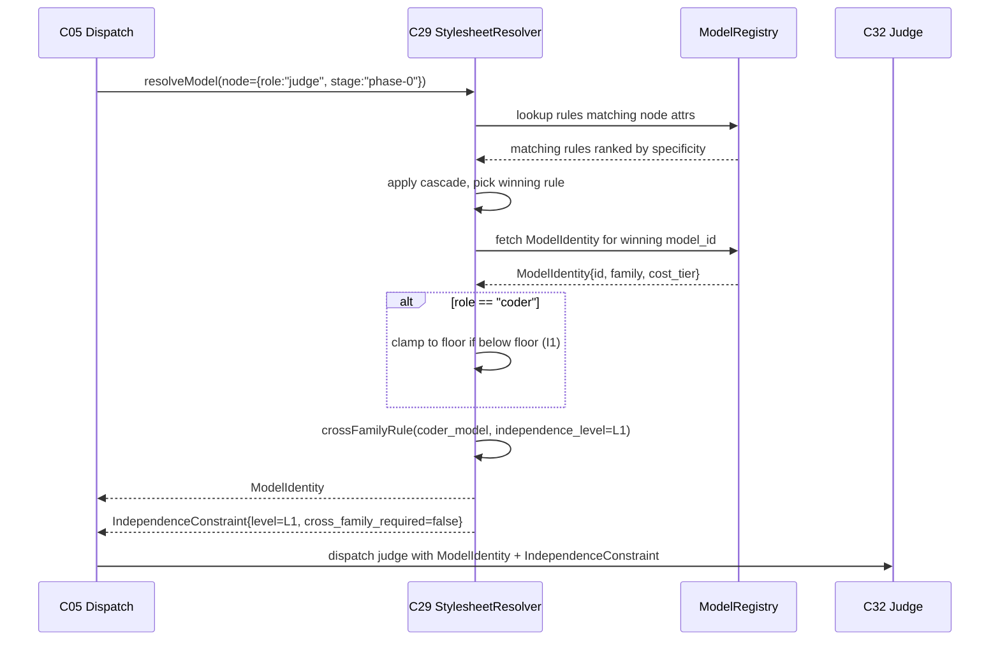

# C29 — Model floor & stylesheet routing  (Spec, canonical track)

> Source: README.md Part 4 P6 (lines 183–191), Part 4 OSS-table Fabro row (304), Phase-1 build (420–442); AI-CONTEXT.md §4.1 (Max auth), §6.2 (Fabro / CSS model stylesheet), §6.3 (Kilroy `--force-model` / `modeldb`), §7 Layer-2 table (304 "Cross-family enforcement: None / DIY / Custom model stylesheet rule"), §12 open questions (514 "specific Gas City model stylesheet syntax for judge != coder"); F-MODE-COVERAGE.md §6 F19 (71) + F31 (73), §1 F1/F27/F46/F48 (17/21/24/25); component-inventory.md C29 (maps A11b, A106, B84).
> Inventory ID: C29   Kind: component   Status: sweep-2
> Track: A (faithful). Two readings recorded under [AMBIGUITY] where v4 is contradictory; minimal elaborations flagged [FAITHFUL-FILL].

## 1. Purpose & responsibility

C29 is the **policy artifact + resolution rule** that decides *which concrete model* each workflow node runs on. It fuses two v4 ideas that the inventory binds to one ID:

1. **Model floor declaration (A106 / B84 / F19 / F31).** v4 *declares Claude Code under Max as the explicit capability floor* — the single sanctioned coder adapter. F-MODE-COVERAGE §6 marks F19 ("Model-floor dependency") and F31 ("Substrate safety floor = weakest adapter") **Addressed (by declaration / single-adapter choice)** precisely because there is exactly one adapter, so "the weakest adapter" and "the floor" are the same well-defined thing (FM:71,73,148).
2. **Stylesheet routing (A11b).** A **CSS-like, cost-aware model stylesheet** (transfusion target: Fabro's CSS model stylesheet, AI-CONTEXT §6.2 line 262) holds *routing rules* — selectors over node attributes → a chosen model, with cost-awareness. Onto this same stylesheet v4 hangs the **cross-family enforcement rule**: "judge node must use a different model family than coder node" (README:189,427; AI-CONTEXT:304,514).

**Responsibility:** given a workflow node (its role/attributes) and the stylesheet, **resolve the model to use**, while (a) never resolving below the declared floor for a coder node, and (b) enforcing the cross-family constraint between coder and judge nodes.

**It is explicitly NOT:**
- NOT the agent loop itself (that is C28 Claude Code agent loop) — C29 *selects the model*, C28 *runs the turn*.
- NOT the judge (C32) — C29 only supplies/constrains the judge's model identity; scoring is C32's job.
- NOT the cost *meter* (C46 meta-metrics owns cost-per-satisfaction measurement). C29 is *cost-aware at routing time* but does not compute the satisfaction cost model.
- NOT a model *provider/credential* manager — see §6/§9; the second-family judge provider is an unresolved upstream dependency (G20).

## 2. Context & dependencies

| Direction | Component | Relationship |
|---|---|---|
| Depends on | **C28** Claude Code agent loop | The floor adapter; the coder node's model. C29 declares C28 as floor and routes coder nodes to it. |
| Depends on (effective) | **C03** Config/feature-flags | The stylesheet is layered TOML; section presence drives whether routing rules are active. `> [FAITHFUL-FILL]` — inventory lists only C28; C03 is the substrate config model all v4 artifacts ride on (README Part 4; inventory C03). Minimal because the stylesheet is "configuration on the Gas City model stylesheet" (README:191) and Gas City config is C03. |
| Consumed by | **C32** Judge harness | Inventory: C32 depends on C29. The judge node reads its constrained (cross-family) model identity from C29. |
| Consumed by | **C05** Sling/dispatch, **C12/C13** formula/molecule nodes | Every node that runs a model resolves it through C29 at dispatch. `> [FAITHFUL-FILL]` (placement) — README:191 says routing is "configuration on the Gas City model stylesheet"; the natural consumer is the dispatch path. |
| Tension with | **C32 / C34** (cross-family) | The load-bearing tension: cross-family requires a non-Claude family (G08/G20) while the floor is a *single* Claude-only adapter (F31, AI-CONTEXT §4.1 "No separate API key"). See §6 and §9. |

## 3. Interfaces / contracts

### 3.1 Sweep-1 named interfaces (preserved)

- **`stylesheet` (data, inbound).** The CSS-like rule set: ordered (selector → declaration) rules. A *selector* matches node attributes (role=coder|judge|…, stage, model-family, cost-tier). A *declaration* names a target model (or a `--force-model`-style pin) and may carry a cost-tier preference. Fabro CSS-stylesheet shape (AI-CONTEXT §6.2) is the transfusion source; Kilroy contributes `--force-model` + `modeldb` (per-model registry) shape (§6.3). `> [FAITHFUL-FILL]` — v4 gives the *concept* and source patterns, not concrete syntax; concrete grammar is sweep-2.
- **`resolveModel(node) → modelIdentity` (rule, outbound).** Cascade/specificity resolution (CSS semantics) selecting the winning declaration for a node. Postcondition for a coder node: result ⩾ floor (never a model weaker than the declared Claude Code floor). `> [FAITHFUL-FILL]` — v4 says "floor" but not the comparison operator; "not weaker than floor" is the minimal reading of *floor*.
- **`crossFamilyRule(coderModel) → constraint` (rule, outbound).** Emits the independence constraint used by C32/C34 (README:189,427), carrying the **active judge-independence level**. The policy is *gradable*; the **Phase-0 default is `L1`** (same-provider judge, prompt/role/rig-isolated from the coder). The literal `family(judge) ≠ family(coder)` form (cross-family/cross-provider) is **advisory/relaxed at Phase-0 — active enforcement is FE-1** (see I2); the emitter is the clean FE-1 seam, not a Phase-0 fail-closed gate.
- **`floorDeclaration` (invariant, outbound).** Asserts Claude Code (Max) is the floor; this is what makes F19/F31 "Addressed by declaration" (FM:71,73).

**Key invariants:** (I1) coder nodes never resolve below floor; (I2) `family(judge) ≠ family(coder)` — **relaxed at Phase 0 per D-1/FE-1** (the same-provider judge is the Phase-0 baseline, isolated by rig partitioning + role/prompt rather than family diversity; the literal cross-provider form is FE-1 — see §6/§9); (I3) resolution is deterministic (same node + same stylesheet → same model) so it is lintable/auditable like other v4 deterministic rules (cf. F51 deterministic-first posture).

### 3.2 Concrete signatures (sweep-2)

```
# NodeAttrs — attributes a workflow node presents for routing
NodeAttrs = {
  role:       "coder" | "judge" | "tool" | string,   # primary role label
  stage:      string,                                  # e.g. "phase-0", "phase-1"
  cost_tier:  "standard" | "economy" | "premium",     # preferred cost tier (optional)
  family:     string | None,                           # explicit family override (optional)
}

# ModelIdentity — the resolved model to run
ModelIdentity = {
  id:       string,          # model identifier, e.g. "claude-code@max"
  family:   string,          # family label from modeldb, e.g. "claude"
  cost_tier: string,         # resolved cost tier
}

# IndependenceConstraint — emitted by crossFamilyRule
IndependenceConstraint = {
  level:             "L0" | "L1" | "L2" | "L3",
  coder_family:      string,                            # the coder's resolved family
  judge_family:      string | None,                     # None if L1 same-family
  cross_family_required: bool,                          # false at Phase-0 (D-1/FE-1)
  isolation_mode:    "rig+role+prompt" | "cross-provider",  # active isolation mechanism
}

# Core resolution functions
resolveModel(node: NodeAttrs, stylesheet: Stylesheet, registry: ModelRegistry) -> ModelIdentity
  # postcondition (I1): if node.role == "coder" then result.id >= floor.id
  # postcondition (I3): deterministic — same inputs → same result

crossFamilyRule(coder_model: ModelIdentity, independence_level: "L0"|"L1"|"L2"|"L3")
  -> IndependenceConstraint
  # Phase-0: always emits level=L1, cross_family_required=false, isolation_mode="rig+role+prompt"
  # FE-1: emits level=L2/L3, cross_family_required=true, isolation_mode="cross-provider"

floorDeclaration() -> ModelIdentity
  # returns the pinned floor: {id: "claude-code@max", family: "claude", cost_tier: "standard"}
```

### 3.3 Stylesheet grammar (sweep-2 deliverable — resolves C29:OQ on concrete grammar)

> **RESOLVED (Sweep-2):** AI-CONTEXT §12 (line 514) flags "specific Gas City model stylesheet syntax for judge != coder" as an open question. The concrete selector grammar is defined here.

The stylesheet is a TOML file (layered under C03 config) containing an ordered list of rules. Each rule has:
- A **selector**: a table matching on node attributes (`role`, `stage`, `cost_tier`).
- A **declaration**: the target model and optional cost-tier preference.

**Selector syntax (TOML, one rule per `[[model_rule]]` entry):**

```toml
# Floor declaration — hardcoded constant, not a user rule
[model_floor]
id        = "claude-code@max"
family    = "claude"
cost_tier = "standard"

# Judge independence level (Phase-0 baseline per D-1/FE-1)
[judge_policy]
independence_level   = "L1"          # L0|L1|L2|L3
cross_family_enforce = false         # false at Phase-0; true = FE-1

# Ordered routing rules — evaluated top-to-bottom, first match wins (CSS cascade)
[[model_rule]]
# Selector fields (all optional; omitted = wildcard)
role      = "coder"                  # matches node.role exactly
# stage   = "phase-0"               # optional stage filter
# Declaration
model_id  = "claude-code@max"        # the resolved ModelIdentity.id
cost_tier = "standard"

[[model_rule]]
role      = "judge"
model_id  = "claude-code@max"        # Phase-0: same-provider judge (D-1)
cost_tier = "economy"                # prefer cheaper tier for judge runs

[[model_rule]]
role      = "tool"
cost_tier = "economy"
model_id  = "claude-code@max"

# Catch-all fallback (lowest specificity — omit all selector fields)
[[model_rule]]
model_id  = "claude-code@max"
cost_tier = "standard"
```

**Cascade/specificity algorithm:**
1. Collect all rules whose selector fields are a subset of the node's attributes (wildcard = always matches).
2. Among matching rules, rank by **selector specificity**: count of non-wildcard selector fields (more specific = higher rank).
3. On ties, the **first declared rule wins** (document order, CSS first-match tiebreak).
4. Apply the winning rule's `model_id` and `cost_tier` to look up the `ModelIdentity` in the registry.
5. If `node.role == "coder"`: clamp to floor (I1) — if resolved cost_tier is weaker, substitute floor.
6. Return the `ModelIdentity`.

**The `judge != coder` rule (resolves AI-CONTEXT:514 OQ):**

The named rule is **`judge_family_advisory`** (Phase-0) / **`judge_family_enforce`** (FE-1). At Phase-0, after cascade resolution, `crossFamilyRule` is called with the coder's resolved model and the current `independence_level` from `[judge_policy]`. It emits an `IndependenceConstraint` that C32/C34 read. The constraint at Phase-0 is: `level=L1, cross_family_required=false, isolation_mode="rig+role+prompt"`. No resolution is rejected solely on family grounds at Phase-0; the constraint is advisory (FE-1 wires the enforcement gate).

## 4. Data model / state

C29 owns the **stylesheet artifact** (version-controlled config, not runtime state) and a **model registry** (`modeldb`-shaped: known model identities, their *family* label, and cost tier). It owns no per-run mutable state; resolution is a pure function of (node, stylesheet, registry).

### 4.1 Stylesheet data (sweep-1 table, preserved)

| Datum | Shape (sweep-1) | Owner | Notes |
|---|---|---|---|
| Stylesheet | ordered list of (selector, declaration) | C29 | layered TOML under C03; section presence = active |
| Model registry (`modeldb`) | `{id, family, cost_tier}` per model (**D-10** — binding; **no `independence_class` field**) | C29 | family label is what cross-family compares (G08 — "family" undefined in v4; see §9). Judge independence is expressed by the L0–L3 policy (L1 same-family default, D-1), **not** a registry field (D-10). |
| Floor pin | `claude-code@max` identity | C29 | the declaration backing F19/F31 |

### 4.2 `modeldb` schema (sweep-2, per D-10)

> **D-10 (verbatim):** "`modeldb` fields = {id, family, cost_tier}. Per the SURVIVOR-PASS apply outcome (binding). No separate `independence_class` field; judge independence is expressed by the L0–L3 policy (L1 same-family default, D-1), not a registry field."

| Field | Type | Req? | Semantics | R/W by |
|---|---|---|---|---|
| `id` | `string` | R | Model identifier, e.g. `"claude-code@max"`, `"claude-haiku-3"` | C29 defines; routing reads; C32 reads for judge identity |
| `family` | `string` | R | Training-lineage label, e.g. `"claude"`. Phase-0 reading (b) per D-1: family = same-provider grouping, NOT necessarily cross-provider. The `crossFamilyRule` compares this field. FE-1 widens it to cross-provider scope. **No `independence_class` per D-10.** | C29 defines; C29 reads (crossFamilyRule); C34 reads (holdout audit) |
| `cost_tier` | `"standard" \| "economy" \| "premium"` | R | Cost ranking for tier-preference routing (A5). Routing selects cheapest available above-floor tier when `cost_tier` preference expressed in selector. | C29 defines; C29 reads (cascade resolution); C46 reads (cost-awareness signal) |

**Registry invariants:**
- The floor model (`claude-code@max`) MUST always be present with `family="claude"` and `cost_tier="standard"`.
- `id` values are unique.
- `family` is a free-form label (not an enum); FE-1 may introduce provider-granularity.
- The registry is version-controlled config, not runtime-mutable.

### 4.3 Stylesheet schema (sweep-2)

| Field | Type | Req? | Semantics | R/W by |
|---|---|---|---|---|
| `model_floor.id` | `string` | R | Floor model identity string | C29 defines; all coder-routing reads |
| `model_floor.family` | `string` | R | Floor family label | C29 defines; crossFamilyRule reads |
| `model_floor.cost_tier` | `string` | R | Floor cost tier | C29 defines |
| `judge_policy.independence_level` | `"L0"\|"L1"\|"L2"\|"L3"` | R | Active independence level. Phase-0 = `"L1"` per D-1 | C29 defines; crossFamilyRule reads; C32/C34 read (constraint consumer) |
| `judge_policy.cross_family_enforce` | `bool` | R | Whether cross-family constraint is fail-closed. Phase-0 = `false`. FE-1 = `true` | C29 defines; crossFamilyRule emits |
| `model_rule[].role` | `string \| null` | O | Selector: matches `node.role`. Null = wildcard | C29 defines; resolveModel reads |
| `model_rule[].stage` | `string \| null` | O | Selector: matches `node.stage`. Null = wildcard | C29 defines; resolveModel reads |
| `model_rule[].cost_tier` | `string \| null` | O | Selector: preferred cost tier. Null = no preference | C29 defines; resolveModel reads |
| `model_rule[].model_id` | `string` | R | Declaration: target model id (must be in registry) | C29 defines; resolveModel reads; C32/C05 consume resolved identity |

## 5. Behavior

### 5.1 Resolution flow (sweep-1 description, preserved)

Resolution flow at node dispatch:
1. Node arrives with attributes (role, stage, …).
2. Match selectors → collect declarations → CSS-cascade by specificity → winning model.
3. If `role=coder`: clamp to floor (I1).
4. If `role=judge`: **(Phase-0, D-1/FE-1)** route to a same-provider judge that is rig/role/prompt-isolated from the coder, emitting the active independence constraint; the literal `family(judge) ≠ family(coder)` cross-provider check is deferred to FE-1 and applies only when a second-provider family is registered (I2, relaxed).
5. Return model identity to dispatch (C05) / agent loop (C28) / judge (C32).

### 5.2 Sequence diagram — "resolve a model for a role" (sweep-2)



### 5.3 Worked routing example (sweep-2)

**Registry (Phase-0):**

| id | family | cost_tier |
|---|---|---|
| `claude-code@max` | `claude` | `standard` |
| `claude-haiku-3` | `claude` | `economy` |

**Stylesheet rules (in order):**

| # | role | stage | cost_tier | model_id | specificity |
|---|---|---|---|---|---|
| R1 | `coder` | (wildcard) | (wildcard) | `claude-code@max` | 1 |
| R2 | `judge` | (wildcard) | (wildcard) | `claude-haiku-3` | 1 |
| R3 | (wildcard) | (wildcard) | (wildcard) | `claude-code@max` | 0 |

**Case A — coder node:**
- Input: `{role: "coder", stage: "phase-0"}`
- R1 matches (role=coder), specificity=1; R3 matches (wildcard), specificity=0
- Winner: R1 → `claude-code@max`
- Floor clamp: `claude-code@max` IS the floor → no change
- Result: `ModelIdentity{id:"claude-code@max", family:"claude", cost_tier:"standard"}`
- `crossFamilyRule` not called (role != judge)

**Case B — judge node (Phase-0, D-1):**
- Input: `{role: "judge", stage: "phase-0"}`
- R2 matches (role=judge), specificity=1; R3 matches (wildcard), specificity=0
- Winner: R2 → `claude-haiku-3` (economy tier, same-provider judge)
- Floor clamp: role=judge, not coder → no clamp
- `crossFamilyRule("claude", L1)` → `IndependenceConstraint{level:L1, coder_family:"claude", judge_family:None, cross_family_required:false, isolation_mode:"rig+role+prompt"}`
- Result: `ModelIdentity{id:"claude-haiku-3", family:"claude", cost_tier:"economy"}` + constraint

**Case C — sub-floor declaration attempt (error path):**
- Input: `{role: "coder", stage: "phase-0"}`
- Suppose a rule declares `model_id = "claude-haiku-3"` (economy, weaker than floor)
- Cascade selects `claude-haiku-3`
- Floor clamp: `claude-haiku-3` is weaker than floor → **raise E-C29-02** (floor-violation)
- Recovery: substitute floor model, emit warning, continue

## 6. Failure modes & handling

### 6.1 F-mode table (sweep-1, preserved)

| F-mode | Source | C29's role | Status per v4 |
|---|---|---|---|
| **F19** Model-floor dependency | FM §6:71 | The floor *declaration* is C29's deliverable | Addressed (by declaration) |
| **F31** Substrate floor = weakest adapter | FM §6:73,148 | Single-adapter floor is well-defined *because* C29 declares one floor | Addressed (single-adapter) |
| **F1** Hallucination loop | FM §1:17 | At Phase-0 the active guard is the judge-independence policy at `L1` (prompt/role/rig-isolated same-provider judge); the cross-family strengthening is FE-1 | Addressed (at the v4 level per FM §1; Phase-0 mechanism = L1 isolation) |
| **F27** Circularity / same-model build+validate | FM §1:21 | Phase-0 guard (D-1) is **rig/role/prompt isolation** of the same-provider judge; the cross-provider `crossFamilyRule` is FE-1 | Addressed at Phase-0 isolation level (cross-provider strengthening = FE-1) |
| **F46** Single-model review blindspot | FM §1:24 | Cross-family ensembles enable the strongest form; deferred to FE-1. Phase-0 relies on prompt/role isolation | Partial at Phase-0 (full cross-family addressing = FE-1) |
| **F48** Tacit collusion via shared context | FM §1:25 | Cross-family rule contributes; v4 marks **Partial** (shared training-distribution residual) | Partial |

**Degraded behavior / the load-bearing tension (G08 + G20):** v4's cross-family rule presumes a *second model family* exists, but AI-CONTEXT §4.1 says Max issues *no separate API key* and the only sanctioned coder is Claude Code. So at the floor install there may be **no non-Claude family available to route a judge to**. Faithful handling: C29 *emits the constraint and the family registry*; **sourcing the second family is an upstream dependency (G20), not resolvable inside C29.**

> [AMBIGUITY resolution — D-1 / FE-1] The integrator's ruling **D-1** resolves this tension so the
> cross-family rule is **no longer an unsatisfiable Phase-0 blocker**: the **Phase-0 baseline is the
> same-provider judge** (holdout integrity comes from rig partitioning + role/prompt isolation, not family
> diversity). **The judge-independence policy is *gradable*, and its Phase-0 default is `L1` — a
> same-provider judge that is prompt/role/rig-isolated from the coder; cross-family and cross-provider are
> the stronger (deferred) levels.** D-1 confirms L1 is the correct Phase-0 default. (The frozen optimized
> sibling spells the same gradable ladder out as L0–L3, cf. `spec-optimized/C29-…` §3c — reference only;
> the canonical level set here is "L1 default, cross-family/cross-provider = FE-1".) The literal
> provider-level "judge.family ≠ coder.family" requirement (the README:189 reading) is reclassified as
> **future enhancement FE-1** (`_meta/FUTURE-ENHANCEMENTS.md`), revisited when a second-provider credential
> path exists. **Consequently `crossFamilyRule` (I2/A2) is advisory/relaxed at Phase 0, not fail-closed:**
> a same-provider judge that is *prompt/role/rig-isolated* from the coder is the sanctioned Phase-0 path; it
> does **not** silently un-address F27/F46 because the isolation is structural (separate rig + disjoint
> context), only the *family-diversity* leg is deferred to FE-1. C29 keeps the `family` registry field and
> the constraint emitter as the clean seam FE-1 switches on later.

### 6.2 Error taxonomy (sweep-2)

> Binding decisions cited verbatim:
>
> **D-1:** "implement the judge with the SAME provider/family as the coder for now; a different-provider judge moves to the future-enhancements bucket. Impact: C29 cross-family rule becomes advisory/relaxed; C32/C34 build against same-provider judging with holdout-integrity provided by rig partitioning + prompt/role isolation rather than family diversity."
>
> **D-10:** "`modeldb` fields = {id, family, cost_tier}. No separate `independence_class` field; judge independence is expressed by the L0–L3 policy (L1 same-family default, D-1), not a registry field."

| E-code | Condition | Surfaced as | Caller recovery |
|---|---|---|---|
| **E-C29-01** | No rule in stylesheet matches node attrs (including catch-all) | `resolveModel` returns error: "no-matching-rule for node {attrs}" | Caller falls back to floor model for coder; for judge, falls back to floor model with a forced `L1` isolation constraint; logs the gap for stylesheet author |
| **E-C29-02** | Cascade winner is weaker than the declared floor for a coder node | `resolveModel` emits warning + substitutes floor model (I1 enforcement); does NOT error-out | Caller receives floor model with a warning annotation on the `ModelIdentity`; lint hook (T7) flags the sub-floor rule for stylesheet correction |
| **E-C29-03** | `model_id` in a rule references an id not in the registry | `resolveModel` returns error: "model-not-in-registry: {id}" at rule-validation time | Caller receives error; stylesheet author must add the model to registry or correct the rule id |
| **E-C29-04** | Cross-family enforcement triggered (FE-1, Phase-0 does NOT raise this) | When `judge_policy.cross_family_enforce=true` and `judge.family == coder.family` → `crossFamilyRule` returns error: "family-conflict-under-cross-family-enforce: judge={j} coder={c}" | FE-1 only: dispatch must route judge to a different-family model; at Phase-0 this code path is unreachable (constraint is advisory) |
| **E-C29-05** | `[model_floor]` section absent from stylesheet | Validation at stylesheet load time: "missing-floor-declaration" | Abort stylesheet load; C29 cannot operate without the floor anchor (I1 unenforceable). Stylesheet author must add `[model_floor]` block. |
| **E-C29-06** | `[judge_policy]` section absent or `independence_level` not a valid value | Validation at stylesheet load time: "invalid-judge-policy" | Abort stylesheet load; emit error naming the invalid field. Default to `L1` safe-fallback only if the section is missing but not if the value is malformed. |

## 7. Cross-cutting

- **Cost (G32).** v4's only cost anchor is "$200/month Max" (AI-CONTEXT §4.1); the stylesheet is "cost-aware" (Fabro, §6.2) but v4 gives **no cost model** for second-family judge tokens, multi-judge ensembles, etc. C29 carries a *cost-tier* on each registry entry so routing can prefer cheaper tiers, but the cost-per-satisfaction model is **C46's** and is **deferred** here (G32 noted, not resolved — see §9).
- **Security.** Second-family judge needs its own credential path; v4 has no secrets story (G37). Flagged, deferred to upstream/C-secrets.
- **Observability.** Resolution is deterministic → auditable; the chosen model should be recorded per node (ties to C41 attribution / C23 event bus). `> [FAITHFUL-FILL]`.

## 8. Acceptance criteria & test strategy

### 8.1 Sweep-1 acceptance criteria (preserved)

- A1: A coder node always resolves to a model ⩾ the declared floor (I1). *Test:* stylesheet with a sub-floor declaration on a coder node → resolution clamps to floor.
- A2: **(Phase-0, per D-1/FE-1)** A satisfaction-measuring judge runs same-provider but **rig/role/prompt-isolated** from the coder; the `family` constraint emitter is exercised but the cross-provider form is **not** required (FE-1). *Test:* a same-provider judge with a disjoint rig + distinct rubric resolves successfully; the emitted `IndependenceConstraint` records the active (Phase-0) level. *(The literal `family(judge) ≠ family(coder)` fail-closed test moves to the FE-1 cross-provider tier.)*
- A3: Resolution is deterministic and reproducible (I3). *Test:* same (node, stylesheet, registry) twice → identical model.
- A4: The floor declaration exists and is the single sanctioned coder adapter (F19/F31). *Test:* registry/declaration names exactly one floor adapter (Claude Code @ Max).
- A5: Cost-awareness is expressible: a node can prefer a cheaper tier among floor-or-above options. *Test:* two above-floor models, cheaper one selected when cost-tier preferred.

### 8.2 Concrete acceptance tests (sweep-2)

| AC-code | Given / When / Then | Verifies |
|---|---|---|
| **AC-C29-01** | Given a stylesheet with `[model_floor]` + two rules (coder → model_A, catch-all → model_B); when `resolveModel({role:"coder"})` is called; then result.id == model_A.id AND result.id != model_B.id (specificity wins over catch-all). | Cascade specificity, A1/A3 |
| **AC-C29-02** | Given a stylesheet where the winning rule for `role="coder"` declares a model weaker than floor; when `resolveModel` is called; then result.id == floor.id (I1 clamp) AND warning is emitted. | E-C29-02, floor-clamp (I1), A1 |
| **AC-C29-03** | Given `resolveModel({role:"coder"})` called twice with identical stylesheet + registry; then results are equal (identical id, family, cost_tier). | Determinism (I3), A3 |
| **AC-C29-04** | Given a stylesheet with `judge_policy.independence_level="L1"` and `cross_family_enforce=false`; when `crossFamilyRule` is called for a judge node; then `IndependenceConstraint.cross_family_required == false` AND `level == "L1"`. | Phase-0 advisory constraint (D-1/FE-1), A2 |
| **AC-C29-05** | Given two models in registry at different cost tiers, both above floor; when `resolveModel({role:"judge", cost_tier:"economy"})` is called; then result has the `economy` tier model. | Cost-tier preference, A5 |
| **AC-C29-06** | Given a stylesheet with no catch-all rule and a node whose attrs match no rule; when `resolveModel` is called; then error E-C29-01 is raised. | No-match error path (E-C29-01) |
| **AC-C29-07** | Given a stylesheet with a rule referencing `model_id = "nonexistent"` (not in registry); when the stylesheet is loaded; then E-C29-03 is raised at validation time (not deferred to resolution). | Registry-miss error path (E-C29-03) |
| **AC-C29-08** | Given a stylesheet missing the `[model_floor]` section; when the stylesheet is loaded; then E-C29-05 is raised and the resolver refuses to operate. | Floor-absent guard (E-C29-05) |
| **AC-C29-09** | Given a stylesheet with `judge_policy.cross_family_enforce=true` (FE-1 mode) and judge resolves to family == coder family; when `crossFamilyRule` is called; then E-C29-04 is raised. | Family-conflict under FE-1 (E-C29-04) — FE-1 path only |
| **AC-C29-10** | Given the `floorDeclaration()` is called; then it returns `{id:"claude-code@max", family:"claude", cost_tier:"standard"}` — the single floor anchor backing F19/F31. | F19/F31 "Addressed by declaration" (A4) |

**E↔AC cross-references:**

| E-code | AC that asserts it |
|---|---|
| E-C29-01 (no-matching-rule) | AC-C29-06 |
| E-C29-02 (floor-violation) | AC-C29-02 |
| E-C29-03 (model-not-in-registry) | AC-C29-07 |
| E-C29-04 (family-conflict-under-enforce) | AC-C29-09 |
| E-C29-05 (missing-floor-declaration) | AC-C29-08 |
| E-C29-06 (invalid-judge-policy) | [> [FAITHFUL-FILL] no dedicated AC; E-C29-06 is verified implicitly by AC-C29-08 which exercises the stylesheet-load validation path. A dedicated AC for malformed `independence_level` is a sweep-3 item.] |

## 9. Open questions (→ review-log)

- **[AMBIGUITY: G08 — RESOLVED by D-1/FE-1] "Model family" is undefined.** Reading (a): *family = provider* (Anthropic vs OpenAI vs Google) — implies a second provider, which AI-CONTEXT §4.1 forbids under Max. Reading (b): *family = training-lineage within a provider* (Claude-judge vs Claude-coder allowed). The two readings were left open because F27/F46/F48 want validator-from-builder independence while the Max floor forbids a second provider. **The integrator's ruling D-1 resolves it:** the **Phase-0 baseline is the same-provider judge** — effectively reading (b) for Phase 0, with independence supplied by **rig partitioning + role/prompt isolation** rather than family diversity. The provider-level reading (a) — the literal README:189 cross-provider requirement — is reclassified as **future enhancement FE-1**, not a Phase-0 requirement. C29 still stores `family` as a label so FE-1 can switch on cross-family/cross-provider judging later without re-architecture.

  **RESOLVED (Sweep-2):** `family` stays a free-form string label (no enum). Phase-0 interpretation = same-provider label (all Claude models share `family="claude"`). FE-1 interpretation = cross-provider label (e.g. `"openai"`, `"google"`). No change to the field type; the interpretation is policy, not schema.

- **[G20 — RESOLVED by D-1/FE-1] The judge model is unsourced.** No named non-Claude provider, budget, or auth path exists in v4 (G20). Per **D-1**, this is **no longer a Phase-0 blocker**: Phase 0 runs the same-provider judge, so no second-provider credential is required to stand up the evaluation tier. Sourcing a second family/provider is **FE-1** (future), revisited when a second-provider credential path exists or same-family judge bias is measured as material.

- **[G32] Cost model deferred to C46.** C29 is cost-*aware* (tiers) but does not own the cost-per-satisfaction model; v4 provides none. Deferred with reason: cost measurement is C46's responsibility per inventory.

- **[C29:OQ — RESOLVED (Sweep-2)] Concrete stylesheet "judge != coder" grammar.** AI-CONTEXT §12 (line 514) flags "specific Gas City model stylesheet syntax for judge != coder". **RESOLVED (Sweep-2): the rule is `judge_family_advisory` at Phase-0** — implemented via `[judge_policy]` TOML section with `independence_level="L1"` and `cross_family_enforce=false`. The constraint is emitted by `crossFamilyRule` as an `IndependenceConstraint` record (§3.2). The fail-closed cross-family form (`cross_family_enforce=true`) is the FE-1 upgrade path. See §3.3 and §5.3 for the full worked example.

- **[C34:OQ-C34-4 — open, inherited]** When FE-1 lands, does the family-difference check move into C34 (holdout enforcement) or stay advisory in C29? Today relaxed per D-1. The `cross_family_enforce` boolean in `[judge_policy]` is the clean FE-1 seam; the enforcement *owner* at FE-1 is a cross-component question (C29 emits the constraint; C34 enforces it — the split is already implied by D-13, but the FE-1 wiring is deferred).
