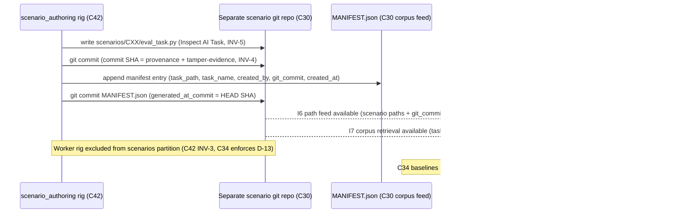

# C30 — Scenario Authoring & Store (read-isolation)  (Spec, canonical track)

> Source: README §"Principle 5 — Scenarios as held-out test set" (L164–177: L166 "Scenarios are external
> to the codebase. The agent **cannot see** them during work."; the 4-row table — "Scenario **authoring
> format**" = "Defines a scenario's structure" / "**Inspect AI Task DSL (Python)**" / MIT / "Gas City pack
> wraps Inspect AI"; "Scenario **storage** with read-isolation" = "Prevents agent from reading scenarios
> during work" / "**Separate git repo + file permissions + Gas City rig partition**"; "Holdout integrity
> audit" = "Detects if isolation has been violated" — *that row is C34, not C30*; L175 "Inspect AI has the
> strongest **agent-trajectory model**"; L177 placement "Install Inspect AI, write a small pack that
> exposes it as a tool node"); README §Phase 2 (L417–442: L423 "Install Inspect AI (MIT)"; L424 "Gas City
> pack wrapping Inspect AI as a scenario provider (the `[[service]] type = "inspect_ai"` block)"; L425
> "Set up **scenario storage: separate git repo + filesystem permissions** enforcing
> read-only-from-implementer; OPA policy for finer control later"; L442 "the harder parts are the Inspect
> AI wrap and the scenario isolation policy"); README §Part 7 (L500 foundational OSS adopted verbatim; L526
> "No specific scenario suite at the start … the broader scenario library grows over time"); README §"the
> bets" (L499 "Factory-built components have their own scenarios … the Healer agent's scenarios are
> adversarial … the twins' scenarios verify behavioral fidelity"); AI-CONTEXT §1.3 (L35 "Scenarios as
> held-out test set — External, unread-by-agent, independently judged"); AI-CONTEXT §6.2 "Layer 2"
> (L294–305: L298 "Scenario authoring | **Inspect AI** | MIT | Mature; recommended"; L303 "Holdout
> isolation | **None purpose-built** | DIY | OPA + file permissions composition"); AI-CONTEXT §7 layer
> map (L373 "Inspect AI | L2: authoring + runner + judge + aggregation | MIT"); AI-CONTEXT §11 decisions
> (L467 "Inspect AI for Layer 2 | Yes | Most mature general-purpose; agent-trajectory model fits"); AI-CONTEXT
> §13.3 (L582–608: the `[[rig]]` blocks `scenario_authoring`/`implementer` with `read_partition`/
> `write_partition`; the comment "explicitly does NOT include scenarios in read_partition"; the
> `inspect_eval` `[[tool]]` subprocess with `work_partition = "scenarios"`); AI-CONTEXT §12 open questions
> (L512 "Inspect AI's session-id model vs Gas City's … likely needs adapter layer"; L513 "OPA policy for
> scenario isolation"); AI-CONTEXT §15.2 repo (L638 "Inspect AI: `github.com/UKGovernmentBEIS/inspect_ai`");
> AI-CONTEXT §16.4 (L698 "Find the scenarios at `scenarios/<component>/`"); F-MODE-COVERAGE §1 (F1 "held-out
> scenarios (P5)"; F9 "**Cryptographically signed scenarios at day-0**"; **F28** "Holdout leakage" →
> "Scenario storage with read-isolation … file permissions + OPA + rig partition" — Addressed), §6 (F55
> "held-out scenarios from human-authored corpus" — Partial); component-inventory C30 row (subsystem
> Evaluation & Judge; kind data-store; "Inspect AI scenario DSL authored in an isolated rig; separate repo +
> perms + partition keep scenarios unread by implementer"; maps A45/A46/A22i-rig/B22/B40; **depends on C17,
> C42**; gaps **G10, G21, G28**; foundational: **yes**; Batch 3); review-log **D-1** (judge SAME provider as
> coder ⇒ holdout rests on rig partition + role isolation, not model family), **D-2** (bundle-id namespace —
> if scenarios are CXDB-typed, the root is `softwarefactory.v4.*`), **D-6** (canonical track), **D-13**
> (holdout **enforcement + audit is C34**; **C42 provides** the partition; **C30 stores/authors** inside the
> isolated rig but does **not** itself enforce read-isolation); the C42 spec (`spec/C42-rig-partitioning.md`
> §1/§2 — the partition/role policy C30 sits inside) and C17 spec (`spec/C17-tool-node-abstraction.md` §1 —
> the tool-node abstraction the Inspect AI wrap is realized over).
> Inventory ID: C30   Kind: data-store   Status: sweep-1
> Track: canonical (faithful posture — elaborate v4 exactly; mark inferred fills)

## 1. Purpose & responsibility

C30 is the factory's **scenario authoring + storage layer**: it owns *where scenarios live and how they
are authored*, in a form that is **held out** from the implementer. Scenarios are authored in the
**Inspect AI Task DSL** — an *adopted, off-the-shelf* Python eval framework
(`github.com/UKGovernmentBEIS/inspect_ai`, MIT; "Inspect AI has the strongest agent-trajectory model",
README:175; "Most mature general-purpose; agent-trajectory model fits", AI-CONTEXT:467) — and **stored in a
separate git repo** that the implementer rig cannot read (README:171/425). C30 is the *spec-of-record for
the scenario corpus as a held-out artifact*: the DSL it is written in, the repo it lives in, and the
**`scenarios` partition** and **`scenario_authoring` rig** it is bound to. Phase-0/2 **tamper-evidence +
provenance** for the corpus come from the **separate git repo's content-addressed commit history** (git's
object store is content-addressed — AI-CONTEXT:404 — and v4 treats content-addressing as tamper-evidence,
AI-CONTEXT:236), *not* from custom cryptographic signing: per **D-14**, cryptographic scenario signing is
**deferred to FE-3, blocked on the open secrets gap G37** (a plaintext key collapses the assurance —
XC-6/D-14). See §1 bullet 4 + §6 + §7.

C30 delivers the *storage half* of **Principle 5 (scenarios as a held-out test set)**: "Scenarios are
external to the codebase. The agent cannot see them during work." (README:166; AI-CONTEXT §1.3 L35
"External, unread-by-agent, independently judged"). It is the upstream of the whole evaluation tier — the
scenario **runner** (C31) executes what C30 stores, the **judge** (C32) scores trajectories against it, and
**holdout-integrity enforcement/audit** (C34) polices the read-isolation C30's storage layout makes
auditable.

**Critical boundary (D-13).** C30 **stores and authors** scenarios *inside* the isolated rig; it does **NOT
enforce read-isolation**. Per review-log D-13: **C42 PROVIDES** the role/partition (the `scenario_authoring`
rig + the `scenarios` partition, and the invariant `scenarios ∉ read_partition(worker)`), and **C34 OWNS**
the holdout-integrity *enforcement + after-the-fact audit*. C30's job is to *put the scenarios in the place
C42 partitioned and C34 audits* — author them in the `scenario_authoring` rig, persist them in the separate
repo / `scenarios` partition — not to police access. Per D-1 the judge is the *same provider/family* as the
coder, so the holdout guarantee rests on **rig partitioning (C42) + role isolation**, not model-family
diversity; C30's contribution to that guarantee is *correct placement of the corpus*, nothing more.

**Responsibilities (what C30 is the spec-of-record for):**
- **Scenario authoring in the Inspect AI Task DSL** — scenarios are Inspect AI `Task` objects (Python),
  *adopted as-is*; C30 owns *that this is the authoring format* and the small Gas City pack that exposes
  Inspect AI as a scenario provider (the `[[service]] type = "inspect_ai"` block, README:424; AI-CONTEXT
  §6.2 L298). C30 does **not** author a DSL — Inspect AI provides it (the bar: off-the-shelf ⇒ adopt).
- **Held-out storage layout** — scenarios live in a **separate git repo** + the **`scenarios` partition**
  (README:171/425; AI-CONTEXT §13.3), organized as `scenarios/<component>/` (AI-CONTEXT §16.4 L698) so the
  runner/judge/audit can resolve a component's scenarios by path. C30 owns *the repo + the on-disk layout*;
  the *partition policy* over it is C42's, the *audit of reads against those paths* is C34's.
- **Authoring confined to the `scenario_authoring` rig** — scenarios are written by the `scenario_authoring`
  rig (`read_partition`/`write_partition = "scenarios"`, AI-CONTEXT §13.3), never by the implementer rig.
  C30 owns *that authoring happens in that rig*; C42 owns *the rig/partition definition* and C34 *enforces
  the implementer's exclusion* (D-13).
- **Corpus tamper-evidence + provenance via the git repo (custom signing DEFERRED → FE-3/G37)** — silent
  scenario edits are detectable because the corpus lives in the **separate, content-addressed git repo**
  (INV-1): git's commit history is immutable + content-addressed (AI-CONTEXT:404) and attributable to the
  committing `scenario_authoring` rig, and v4 treats content-addressing as tamper-evidence (AI-CONTEXT:236).
  This is the Phase-0/2 mechanism. **Custom cryptographic "day-0 signing" is DEFERRED, not a KEEP** — it
  fails the capability-for-principle bar (it adds no tamper-evidence the content-addressed git repo +
  `scenarios`-partition isolation do not already provide at Phase-0; the *only* delta it could add —
  non-repudiation against an attacker who can rewrite git history — needs a key, and there is **no secrets
  store**: G37 is open, owned by C03, plaintext today, which collapses the assurance, XC-6). Per **D-14**
  this is the materially-identical signing question already settled **optional/deferred → FE-3 (blocked on
  G37)**; C30 does not re-open it. *(v4's only signing source — F9 "Cryptographically signed scenarios at
  day-0 **(gene transfusion from GF-C pattern)**" — scopes signing as a **Phase-3+ transfused** artifact, not
  a Phase-2 storage primitive; the README Principle-5 section names signing nowhere. See §6/§7/OQ-3.)*
- **Scenario-corpus versioning & growth** — the corpus is version-controlled and *grows over time*
  ("No specific scenario suite at the start … the broader scenario library grows over time", README:526);
  factory-built components, the Healer, and the twins each get their own scenarios (README:499). C30 owns
  the corpus as a versioned, append-growing artifact.

**Explicitly NOT (boundaries):**
- **NOT the holdout-integrity ENFORCEMENT or audit (C34).** This is the load-bearing boundary (D-13). C34
  owns the read-isolation *enforcement* (perms + OPA + rig partition) and the *after-the-fact audit*
  ("Holdout integrity audit — Detects if isolation has been violated", README:173; inventory C34
  "enforcement … after-the-fact audit"). C30 stores the corpus so it *is* held-out-able and auditable; it
  writes no enforcement and runs no audit. **C30 does not itself enforce read-isolation** — it relies on
  C42's partition + C34's enforcement (D-13).
- **NOT the rig / partition policy (C42).** C42 *provides* the `scenario_authoring`/`implementer` rigs, the
  `read_partition`/`write_partition` model, and the holdout invariant `scenarios ∉ read_partition(worker)`
  (AI-CONTEXT §13.3; C42 §1). C30 *places its corpus inside* the `scenarios` partition C42 defines; it does
  not define partitions or roles. (Inventory: C30 depends on C42.)
- **NOT the scenario runner (C31).** Executing scenarios against the system — the Inspect AI runner wrapped
  as a pack, plus the session-id adapter (G25) — is **C31** (README:172; inventory C31). C30 owns *authoring
  + storage*; C31 owns *execution*. (Inventory: C31 depends on C30.)
- **NOT the judge harness (C32) or satisfaction metric (C33).** Scoring trajectories against scenarios is
  the LLM-as-judge **C32** (README:185); aggregating scores into a satisfaction distribution is **C33**
  (README:188). C30 supplies the scenarios they consume; it does not score or aggregate. (C32 is a
  model-calling step, *not* a C17 tool node — C17 §2.)
- **NOT a custom scenario DSL.** The authoring DSL is **Inspect AI's** Task DSL, adopted verbatim (README:170;
  AI-CONTEXT:467). v4 lists promptfoo / OpenAI Evals / DeepEval / AgentDojo as *alternatives* (README:175;
  AI-CONTEXT §6.2 L299) — the choice is Inspect AI, not an in-house format. Authoring no DSL of our own.
- **NOT the OPA policy engine.** OPA is named "for finer control **later**" (README:425; AI-CONTEXT §12 L513
  "OPA policy for scenario isolation … needs concrete enforcement design") — it is a *deferred enforcement*
  mechanism owned by C34, not a C30 storage concern.
- **NOT the trajectory store (C21/CXDB).** Scenarios are an authored, held-out *input corpus* in a git repo;
  trajectories (the runs scored against scenarios) are the CXDB content-addressed log (C21). C30 stores
  scenarios, not trajectories. (If scenario *records* are ever CXDB-typed, the bundle root is
  `softwarefactory.v4.*` per D-2 — but the corpus's home is the separate git repo, not CXDB.)
- **NOT secrets/key management.** Cryptographic signing (DEFERRED → FE-3) would *use* a key; *where that key
  lives* is the open secrets gap **G37** (plaintext `city.toml`/env today), owned by C03 — not C30. The
  Phase-0/2 corpus integrity story (content-addressed git history) needs no key, which is exactly why signing
  is deferred until G37 lands (D-14; §7).

## 2. Context & dependencies

| Direction | Component | Relationship |
|---|---|---|
| Upstream (depends on) | **C17** Tool-node abstraction | The Inspect AI scenario-provider pack is wrapped as a **tool node** over C17's abstraction (the `inspect_eval` `[[tool]] type="subprocess"`, AI-CONTEXT §13.3 L599–608; README:177 "expose it as a tool node"). C17 §2 routes C30 explicitly through it. Inventory: C30 `depends on C17`. |
| Upstream (depends on) | **C42** Rig / agent-role partitioning | **C42 PROVIDES** the `scenario_authoring` rig + the `scenarios` partition + the holdout invariant `scenarios ∉ read_partition(worker)` (C42 §1; AI-CONTEXT §13.3). C30 authors/stores *inside* that partition. Inventory: C30 `depends on C42`. **C30 does not enforce; C42 provides, C34 enforces (D-13).** |
| Upstream (DSL — external OSS) | **Inspect AI** (`github.com/UKGovernmentBEIS/inspect_ai`, MIT) | The adopted authoring DSL + Task model (README:170; AI-CONTEXT §15.2 L638). Adopted verbatim as upstream OSS (README:500). The session-id-vs-Gas-City impedance (AI-CONTEXT §12 L512) lands on C31 (runner), not C30. |
| Upstream (secrets — deferred) | **C03** Config / secrets | Custody of a signing key is G37 (plaintext `city.toml`/env today); deferred to C03's SecretResolver. C30's Phase-0/2 corpus integrity uses content-addressed git history (no key); **cryptographic signing is deferred to FE-3, blocked on G37 (D-14)** — C30 neither signs nor stores a key at sweep 1. |
| Downstream (executes) | **C31** Scenario runner | Runs C30's stored scenarios via the Inspect AI runner; needs the session-id adapter (G25). Inventory: C31 `depends on C30`. |
| Downstream (scores) | **C32** Judge harness | Scores work trajectories against C30's scenarios (same provider as coder, D-1). Inventory: C32 `depends on C30`. |
| Downstream (enforces + audits) | **C34** Holdout integrity & isolation enforcement | **Enforces** read-isolation (perms + OPA + rig partition) and **audits** actual reads vs C30's scenario paths (README:173; inventory C34). C30's repo/path layout + git-revision identity are *what C34 audits against*. **Enforcement is C34's, not C30's (D-13).** Inventory: C34 `depends on C30`. |
| Downstream (consumes corpus) | **C35** Override→rule loop, **C53/C55** bootstrap-validation / methodology loop | Override rules become new Inspect AI rubrics (README:216); bootstrap validation needs a scenario set for the factory-built component (G23); methodology experiments run "the same scenarios" (README:31). All read the corpus C30 owns. |

**Position in the system.** C30 is **foundational** (inventory: yes) within the Evaluation & Judge
subsystem and is the **head of the evaluation tier** — C31 (runner), C32 (judge), C33 (satisfaction), C34
(holdout enforcement) all sit downstream of "scenarios exist, authored in isolation." It **builds in inventory
Batch 3** and delivers part of the README **Phase-2** "Layer 2 (scenarios + judge)" tier (README:417) — two
distinct decompositions (inventory "Batch N" ≠ README "Phase N") that coincide for this tier, not one
milestone — whose "harder parts are the Inspect AI wrap and the scenario isolation policy" (README:442). Because D-1 removes the model-family fallback, the
*correctness of C30's placement* (scenarios in the right repo/partition/rig) is load-bearing for the whole
holdout claim — but the *enforcement* of that placement is C34's, and the *partition* is C42's (D-13).

## 3. Interfaces / contracts

Sweep-1: interfaces are **named and described**; concrete Inspect AI `Task` type signatures, the repo/path
grammar, and the pack manifest defer to sweep 2 (and the *runner* contract to C31, the *enforcement/audit*
contract to C34, the *partition* contract to C42; the cryptographic-**signature** format is not sweep-2 work
at all — it is DEFERRED → FE-3/G37 per D-14).

**OQ-1 RESOLVED (Sweep-2):** Scenario-record schema frozen (field table §4.5). `created_by = "rig:scenario_authoring"` is an explicit field (D-29 wire form). Corpus manifest contract frozen in §3.3.
**OQ-2 RESOLVED (Sweep-2):** D-13 seam confirmed: C30 publishes the I6 path/label feed; no enforcement obligation touches C30. See §3.1 verbatim D-13 citation.
**OQ-3 RESOLVED (Sweep-2):** Signing DEFERRED → FE-3 confirmed (D-14). Phase-0/2 integrity = git content-addressing + rig isolation (INV-1/INV-4). C30 carries no signing obligation.
**OQ-4 RESOLVED (Sweep-2):** Metadata home = separate git repo, NOT CXDB (D-36 verbatim below). The corpus is the held-out input to the Inspect AI log flow; it is never read from CXDB.

**RESOLVED (Sweep-2):** I1–I7 are now concretised below with wire-level signatures, the scenario-record schema (§4.5, OQ-1 RESOLVED), the corpus manifest contract (§3.3), and the C17 tool-node registration (§3.2). The D-38, D-36, D-13 binding decisions are cited verbatim where they anchor contracts.

| # | Interface | Direction | Description | Owning/detailing component |
|---|---|---|---|---|
| I1 | **Inspect AI Task DSL (authoring format)** | inbound (author) | Scenarios are Inspect AI `Task` objects (Python), authored as-is (README:170; AI-CONTEXT:467). C30 *adopts* the DSL; it does not define it. | Inspect AI (DSL); C30 (adoption) |
| I2 | **Scenario repo + layout** (`scenarios/<component>/`) | storage | The separate git repo and on-disk path layout scenarios live in (README:171/425; AI-CONTEXT §16.4 L698). The unit C31/C32/C34 resolve by path. | C30 (this) |
| I3 | **`[[service]] type="inspect_ai"` provider pack** | inbound (config) | The small Gas City pack that exposes Inspect AI as a scenario provider (README:424). Wrapped as a C17 tool node (`inspect_eval`, AI-CONTEXT §13.3). | C30 (this); C17 (abstraction) |
| I4 | **`scenarios` partition / `scenario_authoring` rig binding** | placement | C30 stores into the `scenarios` partition and authors in the `scenario_authoring` rig (AI-CONTEXT §13.3). C30 *binds to* these; **C42 defines them**, **C34 enforces** the implementer's exclusion (D-13). | **C42** (defines), **C34** (enforces), C30 (binds) |
| I5 | **Corpus integrity = git revision (signing DEFERRED → FE-3)** | storage + verify | Phase-0/2 tamper-evidence/provenance is the **content-addressed git commit identity** of each scenario in the separate repo (AI-CONTEXT:236/404); C34/baselining (F7) verify the corpus against its git revision. **Cryptographic per-scenario signing is DEFERRED to FE-3 (blocked on G37/D-14)** — not a sweep-1 interface. | C30 (git revision); C34 (verify); *FE-3/C03 (signing+key, deferred)* |
| I6 | **Scenario-path feed (to enforcement/audit)** | outbound (read) | The set of scenario paths/labels C34's audit compares actual implementer reads against ("agent reads vs scenario paths", README:173). C30 *publishes the corpus layout*; C34 *audits against it*. | C30 (publishes); **C34** (audits) |
| I7 | **Corpus retrieval (to runner/judge)** | outbound (read) | The runner (C31) and judge (C32) resolve a component's scenarios by path/`Task` from the corpus. C30 owns *the corpus*; C31 owns *execution*. | C30 (corpus); C31/C32 (consume) |

### 3.1 Binding decisions cited verbatim (D-36, D-38, D-13)

**D-36** (verbatim, review-log):
> "Eval-tier trajectory flow is the Inspect AI log, NOT CXDB. C31 (runner) produces an **Inspect AI trajectory log**; C32 (judge) scores that log; C33 reduces. The spine eval tier does **NOT** read trajectories from CXDB (C21) — CXDB (C21/C22) + the bridge (C24) stay **non-spine** … C33 writes the satisfaction record to **C19 (beads)**, not CXDB."

Consequence for C30: scenario **metadata home is the separate git repo, not CXDB** (OQ-4 RESOLVED below). The corpus is the held-out *input* to the Inspect AI log flow; it is never read from CXDB.

**D-38** (verbatim, review-log):
> "Judge read-surface SHAPE = a separate judge rig (the D-17 joint C42/C34/C32 freeze). Per D-31 (multiple rigs per city) + D-17: the judge runs in a **separate rig** from the worker (worker rig + judge rig, co-resident in the city). The judge MAY read the worker's trajectory log + the held-out scenario partition; the worker MUST NOT read the judge rig or the scenarios (the holdout — C34 enforces+audits, C42 provides the partition); **no shared context window**."

Consequence for C30: the **judge rig has read-access to the `scenarios` partition**; the **worker rig does NOT** (holdout). C30 places the corpus in the `scenarios` partition precisely so D-38's judge-read-surface has a well-defined target and C34 has a well-defined boundary to enforce. The partition boundary is C42's; C30 places; C34 enforces (D-13).

**D-13** (verbatim, review-log):
> "Holdout enforcement ownership. C34 owns holdout-integrity ENFORCEMENT + after-the-fact AUDIT (read-isolation policy, independence checks under D-1, `scenarios ∉ read_partition(worker)`). C43 owns the distinct lethal-trifecta blast-radius bound (Bash/net/fs typing, twin isolation; G31). C42 PROVIDES the role partition C34 enforces; C42 does not enforce. Pre-constrains unbuilt C34 (Batch 3) + C43 (Batch 4)."

Consequence for C30: **C30 stores/authors** in the isolated rig. **No enforcement obligation leaks onto C30.** OQ-2 RESOLVED below.

### 3.2 `inspect_eval` tool-node registration (C17 binding — sweep-2)

The Inspect AI scenario provider is exposed as a **C17 tool node** per the `[[tool]] type="subprocess"` sketch (AI-CONTEXT §13.3; C17 §3.3). The TOML block below is the **pack authoring config** — part of the `[[service]] type="inspect_ai"` Gas City provider pack (README:424). Field `command`/`cmd` spelling is G11-gated per **D-34** ("tool-node command-key field name is a source contradiction, G11-gated; specs MUST carry the spelling note and MUST NOT claim either spelling as verified").

```toml
# pack.toml — C30's inspect_ai provider pack (the Gas City service + tool node)
# [[service]] block: exposes Inspect AI as a named provider
[[service]]
name    = "inspect_ai"
type    = "inspect_ai"     # recognized by the Gas City pack loader

# [[tool]] block: the C17 deterministic node C31 invokes to run a scenario
[[tool]]
name           = "inspect_eval"
type           = "subprocess"
# command/cmd: G11-gated (AI-CONTEXT §13.3 uses "command"; prototype uses "cmd" — D-34)
command        = "inspect"   # [needs G11 verification — may be "cmd"]
args           = ["eval", "{scenario_path}", "--task", "{task}"]
work_partition = "scenarios"  # C42 partition this tool node operates within
```

**C17 `ToolNodeRef`** for the `inspect_eval` node (against C17 §3.4):

```go
ToolNodeRef{
    Name:           "inspect_eval",
    InputKeys:      []string{"scenario_path", "task"},
    WorkPartition:  "scenarios",
    DeterminismTag: "deterministic",
}
```

The `scenario_path` input key is resolved from the scenario record's `task_path` field (§4.5 below); `task` is the Inspect AI `Task` name within that file. C31 (runner) constructs the `ToolNodeRef` invocation; C30 provides the corpus from which `scenario_path` and `task` are drawn.

**Authoring rig config** (from AI-CONTEXT §13.3 — the `[[rig]]` block C30 binds to; spelled per D-32):
```toml
# .gc/site.toml (path bindings — harvest-verified F1)
[[rig]]
name = "scenario_authoring"
path = "<scenario-repo-root>"    # the separate git repo root (INV-1)

# city.toml (partition semantics — spelling needs G11 per D-32)
[[rig]]                          # or [[rigs]] — G11-gated per D-32
name            = "scenario_authoring"
read_partition  = "scenarios"
write_partition = "scenarios"
# The implementer [[rig]] explicitly does NOT include scenarios in read_partition
# (AI-CONTEXT §13.3 comment — C42 owns this block; C30 references it)
```

### 3.3 Corpus manifest contract (sweep-2)

C30 publishes a **corpus manifest** — a machine-readable index of all held-out scenarios in the separate repo. The manifest is the I6 scenario-path feed C34 audits against and the I7 corpus-retrieval surface C31/C32 consume. It is a git-tracked file committed by the `scenario_authoring` rig.

**Manifest file:** `scenarios/MANIFEST.json` (root of the separate scenario repo; co-located with the `scenarios/<component>/` subtrees).

```json
{
  "schema_version": "1",
  "generated_at_commit": "<git-sha>",
  "entries": [
    {
      "component":    "C31",
      "task_path":    "scenarios/C31/eval_task.py",
      "task_name":    "scenario_runner_basic",
      "created_by":   "rig:scenario_authoring",
      "git_commit":   "<sha-of-commit-that-added-this-scenario>",
      "created_at":   "2026-06-01T00:00:00Z",
      "description":  "Tests that the scenario runner executes a held-out scenario and produces an Inspect AI log"
    }
  ]
}
```

**Fields** (see §4.5 for the authoritative scenario-record schema; this table covers the manifest entry only):

| Field | Type | Req | Semantics | R/W by |
|---|---|---|---|---|
| `component` | `string` | R | the C-ID the scenario exercises (maps to `scenarios/<component>/` path) | C30 writes; C31/C32/C34 read |
| `task_path` | `path` | R | repo-relative path to the Inspect AI `Task` file (`scenarios/<component>/<file>.py`) | C30 writes; C31/C32 read |
| `task_name` | `string` | R | the Python `Task` object name inside `task_path` (the Inspect AI `--task` arg) | C30 writes; C31/C32 read |
| `created_by` | `string` | R | `"rig:scenario_authoring"` — the `"kind:id"` wire form per D-29 (consistent with C20/C41 `created_by` wire type) | C30 writes; C34/C41 read |
| `git_commit` | `string` | R | SHA of the commit that introduced this scenario entry (INV-4 provenance + tamper-evidence) | C30 writes (git identity); C34 verifies |
| `created_at` | `timestamp` | R | ISO-8601 authoring timestamp | C30 writes; C34 audit reads |
| `description` | `string` | O | human-readable scenario description | C30 writes; human readers |
| `schema_version` | `string` | R (manifest root) | version of this manifest schema (bump on structural change) | C30 writes |
| `generated_at_commit` | `string` | R (manifest root) | HEAD SHA of the scenario repo at manifest generation time | C30 writes; C34 baseline verifies |

**Invariants C30 must uphold (store-level):**
- **INV-1 (separate-repo holdout):** scenarios live in a **separate git repo** from the code the implementer
  works in (README:171/425). The corpus is never co-located in the implementer's `code` partition.
- **INV-2 (authoring-rig confinement):** scenarios are authored **only** by the `scenario_authoring` rig
  (`*_partition = "scenarios"`), never by the implementer rig (AI-CONTEXT §13.3). C30 writes only via the
  scenario rig.
- **INV-3 (partition placement):** every stored scenario is in the **`scenarios` partition** C42 defines, so
  the holdout invariant `scenarios ∉ read_partition(worker)` (C42) and C34's audit have a well-defined
  target. C30 places; it does not enforce (D-13).
- **INV-4 (git-revision integrity):** every scenario has an immutable, content-addressed **git commit
  identity** in the separate repo, so a tampered/edited scenario is detectable as a history change and is
  attributable to the committing rig (AI-CONTEXT:236/404; INV-1/INV-6). *(Cryptographic per-scenario signing
  is DEFERRED → FE-3, blocked on G37/D-14; it is **not** an INV-4 obligation at sweep 1. The git-revision
  identity is the Phase-0/2 mechanism F7 baselining verifies against.)*
- **INV-5 (DSL-faithful):** scenarios validate against the **pinned** Inspect AI `Task` schema; C30
  introduces no bespoke scenario format (README:170). *(Task validity is an **adopted-upstream property**
  verified by the conformance pack / version pin, G11 — not a format C30 itself defines; the corpus is
  Inspect-AI-native.)*
- **INV-6 (versioned, append-growing):** the corpus is version-controlled and grows additively over time
  (README:526); scenario history is preserved (git), not overwritten.

> **C30 explicitly does NOT carry an enforcement invariant.** "The implementer cannot read scenarios" is an
> invariant of **C42 (partition) + C34 (enforcement/audit)**, not C30 (D-13). C30's invariants are about
> *correct placement and provenance of the corpus*, which is what makes that enforcement possible.

## 4. Data model / state

C30 *owns the scenario corpus + its layout + its git-revision integrity*; the *partition policy* over it is
C42's, the *enforcement/audit* is C34's. State C30 is the spec-of-record for at sweep 1:

| State | Description | Persistence | Detailed by |
|---|---|---|---|
| **Scenario repo** | The separate git repo holding all scenarios (README:171/425). | Git repository (separate from code). | C30 |
| **`scenarios/<component>/` layout** | Per-component scenario directories (AI-CONTEXT §16.4 L698); the path the runner/judge/audit resolve. | Files in the scenario repo. | C30 |
| **Inspect AI `Task` scenarios** | The scenario bodies, authored in the Inspect AI Task DSL (README:170). | Python files under the layout. | Inspect AI (format); C30 (corpus) |
| **Git-revision integrity** | Content-addressed commit identity per scenario = Phase-0/2 tamper-evidence/provenance (AI-CONTEXT:236/404). *(Cryptographic signing DEFERRED → FE-3/G37, D-14.)* | Git commit history of the separate repo. | C30 (git); *FE-3/C03 (signing+key, deferred)* |
| **`[[service]] type="inspect_ai"` pack** | The Gas City pack exposing Inspect AI as a provider + the `inspect_eval` tool node (README:424; AI-CONTEXT §13.3). | Version-controlled pack (TOML + glue). | C30 (this); C02/C17 (ABI/abstraction) |
| **`[[rig]] scenario_authoring` binding** | *Reference only* — the rig C30 authors in. The block itself is **C42-owned** (`city.toml`, AI-CONTEXT §13.3). | C42 config. | **C42** (owns); C30 (binds) |

**The scenario unit (faithful from README:170, AI-CONTEXT §13.3).** A *scenario* is an **Inspect AI `Task`**
stored at `scenarios/<component>/…` in the separate repo, authored + committed by the `scenario_authoring`
rig (the git commit being its provenance + tamper-evidence record; custom signing DEFERRED → FE-3/G37, D-14).
A *scenario suite* is the set of scenarios for a component (or the Healer/twins — README:499).

### 4.5 Scenario-record schema (FROZEN — Sweep-2, OQ-1 RESOLVED)

The **authoritative record** for a stored scenario is defined by two co-located artifacts in the separate
scenario repo: (a) the Inspect AI `Task` Python file at `scenarios/<component>/<name>.py`, and (b) the
corresponding entry in `scenarios/MANIFEST.json`. Together they constitute the scenario record C31/C32/C34
build against.

**Scenario-record field table** (the MANIFEST entry; the `task_path` points to the `.py` file that is the Inspect AI record):

| Field | Type | Req | Semantics | R/W-by |
|---|---|---|---|---|
| `component` | `string` | R | C-ID the scenario exercises (e.g. `"C31"`); maps to the `scenarios/<component>/` path prefix (AI-CONTEXT §16.4 L698) | C30 writes; C31/C32/C34 read |
| `task_path` | `string` (repo-relative path) | R | Repo-relative path to the Inspect AI `Task` Python file (`scenarios/<component>/<name>.py`); the I7 corpus-retrieval key for C31/C32 | C30 writes; C31/C32 read |
| `task_name` | `string` | R | Python `Task` object name inside `task_path` (the `--task` arg to `inspect eval`; C31 §3 contract) | C30 writes; C31 read |
| `created_by` | `string` (`"kind:id"`) | R | `"rig:scenario_authoring"` — the D-29 canonical wire form (a colon-delimited `"kind:id"` string, consistent with C20/C41/C19 `created_by`); confirms authoring-rig confinement (INV-2) | C30 writes; C34/C41 read |
| `git_commit` | `string` (SHA-1) | R | SHA of the git commit that introduced this entry in the separate repo; the I5 Phase-0/2 tamper-evidence / provenance anchor (INV-4; AI-CONTEXT:236/404); what C34 baselining verifies (F7) | C30 writes (via git commit identity); C34 verifies |
| `created_at` | `string` (ISO-8601) | R | Authoring timestamp (UTC); the human-readable companion to `git_commit` for audit and ordering | C30 writes; C34 audit reads |
| `description` | `string` | O | Human-readable scenario description for corpus navigation | C30 writes; human readers |
| `schema_version` | `string` | R (manifest root) | Version of the MANIFEST schema; bump on structural field changes | C30 writes; all readers |
| `generated_at_commit` | `string` (SHA-1) | R (manifest root) | HEAD SHA of the scenario repo at manifest generation time; the I6 corpus-feed baseline C34 audits against | C30 writes; C34 baseline verifies |

**Signing fields: NONE at Phase-0/2.** Per D-14/OQ-3 RESOLVED: no `signature`, `public_key`, or `attestation` field is added to the record. The content-addressed git commit (INV-4) provides tamper-evidence without a key. Signing fields are a FE-3 addition, blocked on G37.

**Inspect AI `Task` Python file.** The Python file is the Inspect AI-native record — it must be a valid `inspect_ai.Task` object importable as `{task_name}` from `{task_path}`. C30 owns the corpus; Inspect AI (MIT) defines the `Task` schema (INV-5). No bespoke scenario-format fields are added to the Python file — it is adopted verbatim as the authoring format (README:170; AI-CONTEXT:467).

> [FAITHFUL-FILL] v4 names the *format* (Inspect AI Task DSL, README:170) and the *location* (separate repo +
> `scenarios/<component>/`, README:171/425, AI-CONTEXT §16.4) but not the concrete on-disk scenario record
> (e.g. scenario id, component binding, corpus manifest). The minimal faithful elaboration is: **a stored
> scenario = {an Inspect AI `Task` file under `scenarios/<component>/`} committed to the separate repo**,
> whose **provenance + tamper-evidence are the git commit identity** (immutable, content-addressed,
> attributable to the committing `scenario_authoring` rig — AI-CONTEXT:236/404), so no separate signature or
> `created_by` field is required at Phase-0 (the git commit *author* already records the rig; P9 attribution
> is satisfied natively, README:226–231 — an *inference*, not a v4 mandate that scenario files carry
> `created_by`). The exact `Task` record shape and whether an explicit `created_by` field is added are
> sweep-2 (OQ-1); the *runner-facing* execution contract is C31's. *(Cryptographic signing is DEFERRED →
> FE-3/G37, D-14 — see §1 bullet 4.)*

> [FAITHFUL-FILL] **Scenarios are stored in the git repo, not in CXDB.** v4 locates scenarios in a "separate
> git repo" (README:171/425) and CXDB stores *trajectories* (C21), not scenario inputs. The minimal faithful
> reading is that the corpus's authoritative home is the git repo; if any scenario *metadata* is ever
> mirrored into a typed store, the bundle root is `softwarefactory.v4.*` (D-2). No CXDB dependency is added
> for C30 at sweep 1.

**Consistency / lifecycle.** The corpus is **version-controlled and append-growing** (README:526): scenarios
are authored in the `scenario_authoring` rig and committed to the separate repo (the commit *is* the
provenance + tamper-evidence record); the corpus is read (never written) by the runner/judge/audit. The store
is added in **Phase 2** (additive to the Phase-0/1 substrate; README:417). Because scenarios "grow over time"
(README:526) and "factory-built components have their own scenarios" (README:499), the corpus has no fixed
size — only the *layout* is fixed (cryptographic signing is a deferred FE-3 addition, not a sweep-1 fixture).

## 5. Behavior

**Stand up (Phase 2).** Operator installs Inspect AI (MIT), builds the small Gas City pack exposing it as a
scenario provider (the `[[service]] type="inspect_ai"` block + the `inspect_eval` tool node), and sets up
the **separate scenario git repo** with filesystem permissions read-only-from-implementer (README:423–425).
C42's `scenario_authoring`/`implementer` `[[rig]]` blocks are in place (the partition C30 binds to). Result:
a held-out scenario corpus standing alongside the runner/judge tier, ready for P5/P6 (README:438–440).

**Author a scenario.**
1. The **`scenario_authoring` rig** (never the implementer) writes an Inspect AI `Task` under
   `scenarios/<component>/…` (AI-CONTEXT §13.3, §16.4).
2. The scenario is **committed to the separate repo** by the `scenario_authoring` rig (INV-1/INV-6). The
   **git commit identity** is the scenario's Phase-0/2 provenance + tamper-evidence record (immutable,
   content-addressed, attributing the commit to the rig — AI-CONTEXT:236/404); no separate signing step
   runs at sweep 1 *(cryptographic signing DEFERRED → FE-3/G37, D-14)*.
3. The scenario is now resolvable by path by the runner/judge/audit at its committed git revision.

**Hold out from the implementer (relied-upon, not owned).** The implementer rig's `read_partition` excludes
`scenarios` (C42 invariant); the implementer cannot read the corpus. **C30 does not enforce this** — it
relies on C42's partition + C34's enforcement/audit (D-13). C30's only obligation is that the corpus *is in*
the `scenarios` partition / separate repo so that exclusion is well-defined (INV-3).

**Serve to runner/judge/audit.** C31 resolves a component's scenarios by path and executes them; C32 scores
trajectories against them; **C34** compares actual implementer reads against the scenario paths to *detect*
a holdout violation after the fact, and may *verify the corpus against its git revision* during baselining
(F7). C30 *publishes the corpus + its git-revision identity*; it does not run the runner, the judge, or the
audit. *(Cryptographic signature verification is an FE-3 addition, not a sweep-1 path.)*

### 5.1 Sequence diagram — scenario authoring + corpus-feed publish (Sweep-2)

The diagram covers the two C30-owned flows: (a) authoring a scenario via the `scenario_authoring` rig, and
(b) publishing the corpus-path feed (I6) so C34 and C31/C32 can consume it. The *execution* flow (C31 invoking
`inspect_eval`) and the *enforcement* flow (C34 policing the worker rig) are out of scope here — they are
owned by C31 §3 and C34 §3 respectively.



## 6. Failure modes & handling

C30 carries the holdout/isolation gaps assigned to it (G10, G21, G28) **at the storage/authoring altitude**,
routing the *enforcement* obligations to C34 per D-13.

### 6.1 Error taxonomy (E-codes — Sweep-2)

C30's error surface is at the **store/authoring boundary**: validation failures when a scenario is authored or
committed, and integrity failures detected when the corpus is consumed. Enforcement failures (worker reads the
`scenarios` partition) are C34's errors, not C30's (D-13). E-codes below are raised by C30's conformance pack
(§8 test strategy) or by the corpus-consumer interface (I6/I7).

| E-code | Condition | Surfaced-as | Caller recovery |
|---|---|---|---|
| **E-C30-01** | Malformed scenario: `task_path` file is not a valid Inspect AI `Task` Python module (import fails or no `Task` object named `task_name`) | Conformance-pack assertion failure at authoring time; E-C30-01 in the pack result log | Author corrects the `Task` definition in the `.py` file; re-commit; AC-C30-01 verifies |
| **E-C30-02** | Missing provenance: a MANIFEST entry is present but `git_commit` is empty, `"unknown"`, or does not resolve to a real commit in the separate repo | C34 baselining (F7) raises a corpus-integrity alert; E-C30-02 in the audit log | Re-commit the scenario from the `scenario_authoring` rig so the git commit identity is populated; regenerate MANIFEST |
| **E-C30-03** | Holdout-leak path: a scenario file exists at a path that is NOT inside the `scenarios` partition (e.g. inadvertently co-located in the `code` partition) | Conformance-pack INV-1/INV-3 check raises E-C30-03; C34 audit should also detect the out-of-partition path | Move the file to `scenarios/<component>/`; re-commit; re-run conformance pack |
| **E-C30-04** | Wrong authoring identity: a MANIFEST entry has `created_by` ≠ `"rig:scenario_authoring"` (e.g. authored by an implementer or worker rig) | Conformance-pack INV-2 check raises E-C30-04; C34 audit reads `created_by` and may flag as a holdout-integrity violation | Revoke the entry; re-author from the `scenario_authoring` rig; C34 must assess whether the holdout was compromised (E-C30-04 is a C34 trigger) |
| **E-C30-05** | Manifest schema mismatch: `schema_version` in MANIFEST.json does not match the version the consumer (C31/C32/C34) expects | Consumer (C31/C32/C34) raises a parse error citing E-C30-05; scenario retrieval (I7) or path-feed consumption (I6) is blocked | Regenerate MANIFEST under the current schema version; bump `schema_version` if a structural change was made |
| **E-C30-06** | MANIFEST missing or corrupt: `scenarios/MANIFEST.json` is absent or unparseable in the separate repo | C31/C32 cannot retrieve scenarios (I7 outage); C34 cannot baseline (I6 outage); E-C30-06 raised by all consumers | Re-generate and commit a valid MANIFEST from the `scenario_authoring` rig; consumers retry once manifest is committed |
| **E-C30-07** | Tampered scenario: the content of `scenarios/<component>/<name>.py` does not match the git-object hash for the `git_commit` recorded in MANIFEST (i.e. git history was rewritten after authoring) | C34 baselining detects hash mismatch; E-C30-07 in the audit log (INV-4 violation) | Human operator investigation required; the tampered file must be restored from git history or re-authored; this is a security event (F28/F9) |

**G10 (minor) — "held-out" implies a guarantee the mechanism doesn't provide.** "P5 says the agent 'cannot
see' scenarios, but the enforcement is file permissions + agent-prompt discipline + audit logging;
'discipline' is not enforcement" (G10). For C30 the faithful resolution is to **state the boundary
honestly**: C30 *stores* the corpus so it *can* be held out (separate repo + `scenarios` partition placement,
INV-1/INV-3), but "held-out" is a **policy intent realized by C42's partition and verified after the fact by
C34's audit**, not a hard guarantee C30 provides. Storing the corpus in the **content-addressed git repo**
(INV-1) means a scenario that *was* leaked-and-edited is at least tamper-evident via its git history
(AI-CONTEXT:236/404). C30 thus **makes G10 resolvable** for the storage layer (correct, auditable placement +
git provenance) and **defers the enforcement-strength question to C42/C34** (D-13). *(Cryptographic signing,
which would add non-repudiation, is DEFERRED → FE-3/G37 per D-14 — see §1 bullet 4; it is not needed to make
G10 resolvable.)*

**G21 (major) — holdout-integrity enforcement has no real mechanism.** "The implementer agent runs as a
Claude Code subprocess with broad tool access (Bash, Read); nothing prevents it reading outside its declared
partition. The audit is detection after the fact, not prevention" (G21). **This is not C30's to solve
(D-13).** C30's faithful posture: store the corpus *only* in the `scenarios` partition / separate repo
(INV-1/INV-3) so the read-escape has a well-defined boundary, and route **enforcement + after-the-fact audit
to C34** and the **broad-tool-access blast-radius bound to C43** (D-13; C42 §6). C30 records that, against a
broad-tool-access implementer, its stored corpus is protected by **config + filesystem perms + C42 partition
+ C34 detect-after-the-fact audit**, *not* by anything C30 itself enforces. C30 **does not "address" G21** —
it supplies the well-defined, correctly-placed boundary that **G21's C34 (enforcement) + C43 (blast-radius)
resolution needs**; the gap itself is theirs. *(RESOLVED-ownership by D-13: C34 enforces+audits, C43 bounds
blast radius, C42 provides the partition, C30 stores/authors. C30 does not over-claim prevention.)*

**G28 (major) — three/four mechanisms named for one boundary, no authority statement.** "Separate git repo +
filesystem permissions + rig `read_partition` + OPA-later — no statement of which is authoritative or how
they compose" (G28). For C30 the faithful resolution is to **own the two storage-side mechanisms and name
their relation, deferring the policy authority to C42**: C30 owns **(a) the separate git repo** (the corpus
home) and **(b) the on-disk layout** that filesystem permissions are applied to; the **authoritative
*partition* declaration** (rig `read_partition` excludes `scenarios`) is **C42's** (C42 §4.3 names it the
authoritative declarative unit), and **OPA is deferred to C34** ("for finer control later", README:425).
C30's one-line authority note: *the corpus lives in a separate repo (C30) realized on disk with read-only
perms; the authoritative access policy over it is C42's rig `read_partition`; enforcement+audit is C34's;
OPA is deferred.* This is the storage-side half of the G28 resolution C42 §4.3 owns for the policy side.

**F-modes (storage/authoring slice; canonical mapping owned by C57).**

| F-mode | Relevance | Handling in C30 (faithful) |
|---|---|---|
| **F28** Holdout leakage (F-MODE §1, "Addressed") | The core mode: the implementer reading the scenarios it is judged on. | C30's contribution is **correct held-out placement** (separate repo + `scenarios` partition, INV-1/INV-3) so the boundary is well-defined + auditable; **enforcement + audit is C34, partition is C42 (D-13)**. *Caveat (G21):* against a broad-tool-access implementer the realized boundary is config + perms + partition + detect-after-the-fact audit, not tool-call-time prevention until C43. C30 surfaces this rather than absorbing the "Addressed" silently. |
| **F9** Spec overfitting (F-MODE §1: "signed scenarios at day-0 *(gene transfusion from GF-C pattern)*") | The implementer overfitting to scenarios it shouldn't have seen, or scenarios silently edited. | **Addressed (storage-side) via git, signing DEFERRED:** the content-addressed git repo (I5/INV-1) makes a silently-edited scenario tamper-evident through its commit history; periodic baselining (F7) verifies the corpus against its git revision. *Fidelity note:* the F9 cell scopes "day-0 signing" as a **Phase-3+ gene-transfusion** artifact (GF-C pattern), and the README Principle-5 section names signing nowhere; **cryptographic signing is DEFERRED → FE-3/G37 (D-14)**, not a Phase-2 KEEP — git content-addressing covers the storage-side tamper-evidence without a key (XC-6). |
| **F1** Hallucination loop ("held-out scenarios") | Held-out scenarios are part of the guard. | C30 provides the held-out corpus; the judge (C32) closes the loop. |
| **F55** Behavioural drift (F-MODE §6, "Partial") | "drift in synthetic scenarios still possible" — held-out human-authored corpus is the external grounding. | C30 keeps the corpus **human-authored + version-controlled** (README:526); residual synthetic-drift risk is acknowledged, not closed (Partial, per F-MODE). |

**Degraded behaviour.** Scenario repo unavailable ⇒ the runner/judge cannot fetch scenarios (an evaluation
outage, not a factory-run crash — evaluation is downstream of the build). Corrupt/edited scenario ⇒
detectable via git history / content-address mismatch (INV-4). C30 holds no in-store HA design; the corpus is
a git repo with git's own durability/replication story — which is *also* the source of its tamper-evidence
(AI-CONTEXT:236/404), the reason custom signing is not needed at Phase-0/2.

> F-mode applicability is owned by C57 (coverage map); C30 surfaces the storage-level classes (holdout
> leakage F28, spec-overfitting F9, scenario tamper) and defers the canonical mapping there.

## 7. Cross-cutting (security / cost / scale / observability / ops)

- **Security (the central concern).** C30 is the **storage substrate** of the holdout boundary, but **not its
  enforcer** (D-13). Per D-1 there is no model-family fallback, so the *placement* C30 owns (separate repo +
  `scenarios` partition, INV-1/INV-3) is load-bearing input to the holdout guarantee — but the **enforcement +
  audit is C34's** and the **partition is C42's**. C30's genuine, Phase-0-available security contribution is
  **corpus tamper-evidence + provenance via the content-addressed git repo** (INV-1; AI-CONTEXT:236/404):
  immutable commit history, attributable to the committing `scenario_authoring` rig, needing **no key**.
  **Custom cryptographic "day-0 signing" is DEFERRED → FE-3 (blocked on G37, D-14)** — it adds no
  tamper-evidence git + isolation do not already give at Phase-0, and the one delta it could add
  (non-repudiation against a history-rewriting attacker) needs a key that does not exist (plaintext
  `city.toml`/env today; XC-6 — "signing is a mechanism, not yet a control, until C03's SecretResolver
  lands"). This is the same question D-14 already settled optional/deferred for C41; C30 does not re-open it.
  P9 attribution is preserved by the git commit author (the rig), natively (README:226–231).
- **Cost.** No cost model in v4 for the corpus itself (G32); storage is a git repo (no managed-DB fees).
  Inspect AI is MIT (free to adopt). The *scenario-run* token spend (running suites at L5 volume on one Max
  seat — G13/G34) belongs to C31/C32/C29, not the store.
- **Scale.** The corpus "grows over time" (README:526) with no fixed bound; scale is git-repo scale (many
  small Python files). No multi-node store; the per-component layout keeps retrieval path-scoped.
- **Observability.** C30's repo + path layout + git-revision identity are exactly **what makes the
  holdout-integrity audit (C34) possible** — C34 compares actual implementer reads against C30's scenario
  paths (README:173) and verifies the corpus against its git revision during baselining (F7). C30's published
  corpus *is* the observability surface for holdout violations.
- **Ops.** Install = Inspect AI (MIT) + the small `[[service]] type="inspect_ai"` pack + the separate
  scenario repo with read-only-from-implementer perms (README:423–425). "The harder parts are the Inspect AI
  wrap and the scenario isolation policy" (README:442) — the *wrap* is C30's, the *isolation policy* is
  C42's/C34's. The **Inspect-AI session-id ↔ Gas City session-id adapter** (AI-CONTEXT §12 L512) is a
  *runner* (C31) concern, not C30's storage concern. *Spelling caveat (XC-9):* C30 binds to the `[[rig]]`
  form (AI-CONTEXT §13.3); canonical `[rigs]`/`[[rig]]` spelling is C07/integrator's call.

## 8. Acceptance criteria & test strategy

**Sweep-2 AC-code table** (cross-referenced to E-codes in §6.1; each failure-path AC names the E-code it asserts):

| AC-code | Given / When / Then | Verifies | E↔AC ref |
|---|---|---|---|
| **AC-C30-01** | Given a valid Inspect AI `Task` Python file authored by `scenario_authoring` rig / When committed to `scenarios/<component>/` in the separate repo and MANIFEST updated / Then the file imports without error and MANIFEST entry is resolvable with all required fields (INV-5, I1) | DSL adopted; no bespoke format (README:170; AI-CONTEXT:467) | Asserts absence of **E-C30-01** (malformed Task) |
| **AC-C30-02** | Given the scenario repo / When the `scenarios/<component>/` path is checked / Then no scenario file exists outside the separate repo (i.e. in the `code` partition or implementer working tree) (INV-1) | Separate-repo holdout (README:171/425) | Asserts absence of **E-C30-03** (wrong partition path) |
| **AC-C30-03** | Given a MANIFEST entry for a committed scenario / When `created_by` is inspected / Then `created_by == "rig:scenario_authoring"` (D-29 wire form; INV-2) | Authoring-rig confinement (AI-CONTEXT §13.3) | Asserts absence of **E-C30-04** (wrong authoring identity) |
| **AC-C30-04** | Given a MANIFEST entry / When `task_path` is resolved under the `scenarios` partition / Then the file path starts with `scenarios/` (i.e. inside C42's `scenarios` partition, never in `code`) (INV-3) | Partition placement (AI-CONTEXT §13.3; C42 §3) | Asserts absence of **E-C30-03** (holdout-leak path) |
| **AC-C30-05** | Given a committed scenario at `git_commit = SHA` / When the SHA is resolved in the separate repo and the object hash compared to the live file / Then the hashes match (INV-4); ALSO: when the file is artificially mutated and the check re-run / Then a mismatch is detected (tamper-detection round-trip) | Git-revision integrity; tamper-evidence (AI-CONTEXT:236/404; F7) | Asserts detection of **E-C30-07** (tampered scenario) on the negative path |
| **AC-C30-06** | Given `scenarios/MANIFEST.json` in the separate repo / When a consumer (C31/C32/C34) reads the manifest / Then every `task_path` resolves to an existing file and every `task_name` is importable from that file (I2/I7) | Corpus layout resolvable by path (AI-CONTEXT §16.4 L698) | Asserts absence of **E-C30-05** (schema mismatch) + **E-C30-06** (manifest missing) |
| **AC-C30-07** | Given `scenarios/MANIFEST.json` / When C34 reads `generated_at_commit` and compares to repo HEAD / Then the field equals the current HEAD SHA (or is the last committed HEAD, if the manifest is stale by at most one commit) (I6) | Scenario-path feed to enforcement/audit (README:173); C34 audit baseline | Asserts absence of **E-C30-02** (missing provenance) + **E-C30-06** (manifest corrupt) |
| **AC-C30-08** | Given the scenario corpus at time T / When a new scenario is added and committed at time T+1 / Then the prior scenario's git-commit SHA is unchanged and the prior scenario file is unmodified (append-only check) (INV-6) | Versioned, append-growing corpus (README:526) | No E-code (positive path; confirms no destructive rewrite) |

**Test strategy (Sweep-2).** A **scenario-store conformance pack** that: (1) authors a sample Inspect AI `Task`
from the `scenario_authoring` rig, commits it to the separate repo at `scenarios/<component>/`, and regenerates
MANIFEST; (2) asserts AC-C30-01 through AC-C30-08 in order; (3) exercises the negative path for each E-code
(E-C30-01…E-C30-07) and asserts the correct error condition is raised. The suite proves *correct held-out
placement + provenance + MANIFEST integrity*; it does **not** test enforcement (C34) or execution (C31). It is
the storage-side de-risking gate before C31/C32/C34 build on C30.

**Gating exit criteria (from plan §6):** AC-C30-04 (partition placement) + AC-C30-07 (path feed to C34) are
the gates — they make the holdout boundary well-defined and auditable. The conformance pack MUST be green on
these two before C31/C32/C34 consume C30's corpus interfaces (M2–M4 in the build plan).

## 9. Open questions

- **OQ-1 RESOLVED (Sweep-2):** **Scenario record + corpus manifest.** Schema frozen in §4.5: `Task` file at
  `scenarios/<component>/<name>.py` + MANIFEST entry with fields `component`, `task_path`, `task_name`,
  `created_by` (`"rig:scenario_authoring"`, D-29 wire form), `git_commit`, `created_at`, `description` (O),
  `schema_version`, `generated_at_commit`. No signing fields at Phase-0/2 (D-14/G37). C31/C32/C34 build
  against this frozen schema.
- **OQ-2 RESOLVED (Sweep-2):** **D-13 storage/enforcement seam.** Confirmed (D-13 verbatim §3.1): C30
  *stores/authors*; C42 *provides* the partition; C34 *enforces + audits*. C30 publishes the I6 path feed
  (MANIFEST `task_path` entries + `generated_at_commit`) and no enforcement obligation leaks onto C30.
  E-C30-04 (wrong authoring identity) is flagged by C30's conformance pack AND is a trigger for C34 — the
  seam is: C30 detects the authoring violation; C34 assesses holdout-integrity impact.
- **OQ-3 RESOLVED (Sweep-2):** **Signing deferral confirmed (FE-3/G37, D-14).** Phase-0/2 integrity =
  git content-addressing (INV-4) + rig isolation (INV-2); no key required; no signing obligation on C30.
  FE-3 (blocked on G37) is the correct home when G37 (C03 SecretResolver) lands.
- **OQ-4 RESOLVED (Sweep-2):** **Metadata home = separate git repo, NOT CXDB.** Per D-36 (verbatim §3.1):
  the eval-tier flow is the Inspect AI log, not CXDB; scenario metadata home is the git repo. If scenario
  metadata is ever mirrored to a typed store (C33/C55), it uses `softwarefactory.v4.*` (D-2) and the git
  repo remains authoritative (INV-1). No CXDB dependency is added to C30.

**New seam (→ orchestrator ledger):** E-C30-04 (wrong authoring identity) creates a C30↔C34 trigger seam.
C30's conformance pack detects the violation at authoring time and raises E-C30-04; C34 must consume this
signal (or re-detect via the I6 path feed's `created_by` field) to assess holdout-integrity impact. The
*handoff mechanism* (does C34 poll the I6 feed, or does C30 emit a signal) is a **C30↔C34 seam left open**
for the C34 Sweep-2 author to close. C30 publishes; C34 decides how to consume.
