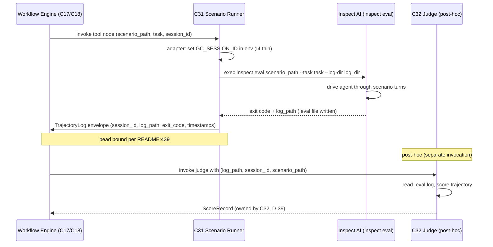

# C31 — Scenario Runner  (Spec, canonical track)

> Source: README §"Principle 5 — Scenarios as held-out test set" (line 172 "Scenario runner | Executes
> scenarios against the system | Inspect AI runner | MIT | Gas City pack"; line 177 "Install Inspect AI,
> write a small pack that exposes it as a tool node"), §Part 6 Phase 2 (line 423 "Install Inspect AI (MIT)";
> line 424 "Build Gas City pack wrapping Inspect AI as a scenario provider (the `[[service]] type =
> "inspect_ai"` block)"; line 439 "**P5** … Inspect AI handles storage + execution; scenario-to-bead binding
> via pack"; line 442 "The harder parts are the Inspect AI wrap and the scenario isolation policy"); AI-CONTEXT
> §7 "Layer 2" (line 300 "Scenario runner | Inspect AI runner | MIT | Recommended"), §4.3 (line 176 raw-API-bodies
> escape hatch, line 178 correlation attributes incl. `session.id`), §11.1 (line 467 "Inspect AI for Layer 2 —
> Yes — Most mature general-purpose; agent-trajectory model fits"), §12 (line 512 "**Inspect AI's session-id
> model vs Gas City's**: likely needs adapter layer; impedance unknown" — **G25**), §13.3 (lines 599–608 Inspect
> AI invocation as a Gas City `[[tool]] type="subprocess"` running `inspect eval {scenario_path} --task {task}`
> with `work_partition = "scenarios"`; lines 587–596 the `scenario_authoring` vs `implementer` rig partitions);
> component-inventory C31 row (line 43 "Executes scenarios against the system (Inspect AI runner wrapped as
> pack); needs session-id adapter", maps A47/A28i/A28j/B42/B49, depends C30+C17, gap G25, foundational no) +
> Batch-3 note (line 111); component-inventory-A A47 (line 151 "Inspect AI runner; Gas City pack"), A28i (line
> 229 "Inspect AI subprocess tool node — Gas City `[[tool]] type="subprocess"` invoking `inspect eval`"), A28j
> (line 230 "Inspect AI `[[service]]` provider block — `type = "inspect_ai"`"); component-inventory-B B42 (line
> 54), B49 (line 61 "Inspect AI … multi-slot (authoring+runner+judge+aggregation)"); spec/C17 §3 (tool-node
> abstraction; C17 lists C31 as an instance, line 64), spec/C02 (subprocess ABI); ambiguities-and-gaps G25;
> review-log D-6 (canonical track), D-13 (C34 owns read-isolation enforcement; C42 provides the partition).
> Inventory ID: C31   Kind: component   Status: sweep-2
> Track: canonical (per D-6)
>
> Binding decisions obeyed (Sweep-2):
> **D-36** — Eval-tier trajectory flow is the Inspect AI log, NOT CXDB.
> **D-37** — C31↔C32 contract = post-hoc scoring (C31 produces TrajectoryLog; C32 scores post-hoc off that log; C31 does NOT invoke C32 inline).
> **D-13** — C34 owns holdout enforcement; C31 only runs inside the `scenarios` partition.
> **D-6** — Single canonical track.

## 1. Purpose & responsibility

C31 is the factory's **scenario runner**: the **Inspect AI runner wrapped as a Gas City pack** that
**executes held-out scenarios against the system** and emits each run's **agent trajectory** for the judge
(C32) to score. v4 is explicit that the runner itself is **off-the-shelf** — "Scenario runner | Executes
scenarios against the system | **Inspect AI runner** | MIT | Gas City pack" (README:172), "Inspect AI handles
storage + execution" (README:439). C31 therefore does **not** build a runner, a scheduler, or an eval loop;
those are Inspect AI's `inspect eval`. C31 is the **two pieces of glue v4 actually asks the factory to
build**:

1. **The wrap** — expose Inspect AI to the workflow engine as a Gas City **`[[service]] type="inspect_ai"`
   provider block** (A28j; README:424) invoked through a **`[[tool]] type="subprocess"`** tool node that runs
   `inspect eval {scenario_path} --task {task}` in the scenario rig (A28i; AI-CONTEXT §13.3 lines 599–608),
   bound to the engine via the **C17 tool-node abstraction** over the **C02 subprocess ABI**.
2. **The session-id adapter** (G25) — the genuine custom code that **threads Claude Code's `session.id` into
   scenario execution so trajectories thread**: it reconciles Inspect AI's own session/sample identity model
   with the Gas City + Claude Code `session.id` (AI-CONTEXT §4.3 line 178) so that the turns a scenario run
   provokes are attributable to *that run* and chain into one coherent trajectory downstream (CXDB via C24,
   judge via C32).

C31 is **half of the P5 mechanism** (the *execution* half). P5's other halves are owned elsewhere: scenario
**authoring + storage with read-isolation** is **C30**, and **holdout-integrity enforcement/audit** is **C34**
(D-13). C31 only **runs** the scenarios C30 stores; it is a leaf component built in inventory **Batch 3**
(component-inventory line 111), which delivers the README **Phase-2** Layer-2 tier (README:417) — distinct schemes that coincide here, not one milestone.

**The single hand-off artifact.** Per D-37:

> "C31 runs the held-out scenario against the freshly built component → a **trajectory log** (the single
> hand-off artifact); C32 scores **post-hoc off that log** (Inspect AI's scorer phase), NOT C31 invoking
> C32 inline." — review-log D-37

Per D-36:

> "C31 (runner) produces an **Inspect AI trajectory log**; C32 (judge) scores that log; C33 reduces. The
> spine eval tier does **NOT** read trajectories from CXDB (C21) — CXDB (C21/C22) + the bridge (C24) stay
> **non-spine**… C33 writes the satisfaction record to **C19 (beads)**, not CXDB." — review-log D-36

These two decisions fully settle C31's output contract: C31 produces one `TrajectoryLog` per run; C32
consumes it post-hoc; C31 never invokes C32; C31 never writes to CXDB.

**Responsibilities (what C31 is the spec-of-record for):**
- **Wrap Inspect AI as a scenario provider** — the `[[service]] type="inspect_ai"` block (A28j) and the
  `[[tool]] type="subprocess"` node that shells `inspect eval` (A28i), packaged as a Gas City pack (A47;
  README:172/424).
- **Execute a scenario against the system on demand** — given a scenario reference (from C30) and a task,
  invoke `inspect eval {scenario_path} --task {task}` and run it to completion, in the **scenario rig**
  (`work_partition = "scenarios"`, AI-CONTEXT §13.3 line 607).
- **Own the session-id adapter (G25)** — map/inject `session.id` across the Inspect-AI ↔ Gas-City/Claude-Code
  boundary so the run's emitted turns thread into one trajectory; surface the run's `session.id` so C24
  (telemetry→CXDB) and C32 (judge) can find the right trajectory.
- **Produce the `TrajectoryLog` (the single hand-off artifact)** — the frozen schema C32 scores post-hoc;
  see §4 for the field table. C31 does NOT invoke C32; C32 reads the log after C31 completes (D-37).
- **Be a C17 tool node over the C02 ABI** — packaged + invoked per the tool-node/pack contract, not a Python
  or Go import of the engine (C17 §1; README:177).

**Explicitly NOT (boundaries):**
- **NOT the runner engine.** Inspect AI's `inspect eval` *is* the runner/scheduler/eval-loop (README:172;
  AI-CONTEXT §7 line 300; §11.1 line 467). C31 **wraps and invokes** it; it does **not** implement a custom
  runner, scheduler, retry loop, or parallel-eval engine. *(Building one would be the over-build the bar
  forbids — see §6.)*
- **NOT scenario authoring or storage.** The Inspect AI **Task DSL** and the **read-isolated scenario store**
  (separate git repo + rig partition) are **C30** (README:170–171; A45). C31 receives a scenario *reference*
  and a task; it does not define the scenario format or own the store.
- **NOT holdout-integrity enforcement or audit.** Whether the implementer agent could read scenarios, the
  `scenarios ∉ read_partition(worker)` policy, and the after-the-fact leakage audit are **C34** (D-13;
  F-MODE F28); the rig partition C34 enforces is **provided by C42** (D-13). C31 simply *runs inside* the
  scenario rig; it does not police access. *(C31's read-isolation contribution is purely positional — it
  executes in `work_partition="scenarios"`, the partition C34/C42 govern.)*
- **NOT the judge / scorer.** Scoring a trajectory against a scenario (LLM-as-judge) is **C32**; satisfaction
  aggregation (Inspect AI score reduction) is **C33** (README:185/188). Inspect AI is *multi-slot*
  (authoring+runner+judge+aggregation, B49) but C31 occupies **only the runner slot** — it executes and emits
  the trajectory; C32 consumes it post-hoc (D-37). C31 does not compute satisfaction or a pass/fail verdict.
- **NOT the telemetry→CXDB bridge.** Per D-36, the eval-tier does NOT read from CXDB; C24 (bridge) stays
  non-spine. C31 *tags the run with `session.id`*; C24 handles the raw-API-body path separately. C31 does
  not post to CXDB and does not read from it.
- **NOT the digital twins.** Scenarios run against **twins** rather than production for critical external deps
  (F-MODE F12/F54; README:195); the twins are **C44**. C31 executes whatever target the scenario/task
  configures; it does not provide or select the twin. (OQ-5 RESOLVED: see §9.)
- **NOT cross-family enforcement.** "Judge ≠ coder model family" is a C29/model-stylesheet rule (README:189);
  irrelevant to the runner. (And per review-log D-1, the cross-family rule is relaxed to same-provider for now.)

## 2. Context & dependencies

| Direction | Component | Relationship |
|---|---|---|
| Upstream (depends on) | **C30** Scenario store w/ isolation | Authors + stores scenarios (Inspect AI Task DSL) in the **read-isolated** `scenario_authoring` rig; hands C31 a **scenario reference** (`{scenario_path}`) + task to execute. Inventory C31 "Depends on: C30". C31 *executes* what C30 *stores* (keeps the author/execute split; D-13 read-isolation). |
| Upstream (depends on) | **C17** Tool-node abstraction | C31 is placed in a formula/molecule as a **deterministic-shaped tool node** (`inspect eval` subprocess) referenced by name; C17 gives the uniform by-name placement over the C02 ABI (C17 §3, lists C31 as an instance, line 64). Inventory C31 "Depends on: C17". |
| Underlying ABI | **C02** Pack/tool-node ABI | The `[[tool]] type="subprocess"` wire contract (command/args/work_partition/exit-status) C31's `inspect eval` node is realized over (AI-CONTEXT §13.3; C17 §3 Reading A). |
| The wrapped OSS | **Inspect AI** (B49; `github.com/UKGovernmentBEIS/inspect_ai`) | The MIT runner C31 wraps — provides `inspect eval`, the trajectory/sample model, and the session/sample identity C31's adapter reconciles. C31 supplies *no* runner of its own. |
| Identity source | **Claude Code `session.id`** (AI-CONTEXT §4.3 line 178) | The correlation attribute the adapter threads into the run so emitted turns chain into one trajectory; also "Gas City session resume + Claude Code session-id" for cross-session continuity (README:240). |
| Downstream (consumer) | **C32** Judge harness | Scores the `TrajectoryLog` C31 emits **post-hoc** against the scenario (D-37). C31 does NOT invoke C32 inline; C32 reads the log after C31 completes. |
| Downstream (consumer) | **C24** Telemetry→CXDB bridge | Delivers the run's emitted turns into CXDB, parent-chained via `session.id` (AI-CONTEXT §5.4); the adapter's correct `session.id` is what makes that landing coherent. Non-spine per D-36. |
| Governed-by (positional) | **C34** Holdout enforcement, **C42** Role/rig partition | C34 enforces `scenarios ∉ read_partition(worker)` + audits leakage (D-13); C42 provides the partition. C31 *runs inside* the `scenarios` work-partition they govern; it does not enforce. |
| Packaging host | **C02/C17** pack + tool-node ABI | C31 ships as a Gas City pack (the `[[service]] type="inspect_ai"` + `[[tool]]` blocks), not a Go/Python import (README:177; C17 §1). |

**Position in the system.** C31 **builds in inventory Batch 3** (component-inventory line 111) and delivers part of the **README Phase-2** Layer-2 scenario/judge tier (README:417) — two distinct decompositions (inventory "Batch N" ≠ README "Phase N") that coincide for this tier, not one milestone: it stands
up once Inspect AI is installed and C30's scenario store + C17/C02 tool-node ABI exist. It is **not
foundational** (inventory C31): it is a leaf of the evaluation tier that the bootstrap-validation milestone
exercises (README:429 "Run the factory on the spec"). v4 flags that "the harder parts are the **Inspect AI
wrap** and the scenario isolation policy" (README:442) — the wrap is C31's; the isolation policy is C30/C34's.
C31 builds in parallel with its Evaluation-&-Judge siblings (C30/C32/C33/C34; inventory line 111).

## 3. Interfaces / contracts

### 3.1 Runner function signature

The canonical runner entry point. This is the contract C31 exposes to the workflow engine (C17) via the
`[[tool]] type="subprocess"` ABI; the signature below is the in-process view that the adapter + invocation
glue implement:

```python
def run(scenario: ScenarioRef, built_component: ComponentRef) -> TrajectoryLog:
    """
    Execute the scenario against the built component.

    Parameters
    ----------
    scenario : ScenarioRef
        Reference to a C30-stored scenario (scenario_path + task name).
        The target (twin vs production) is encoded in the scenario by C30; C31 is target-agnostic (OQ-5 RESOLVED).
    built_component : ComponentRef
        Identity of the component under test (its session context / Gas City session.id).
        C31 uses this to establish the run's session.id via the adapter (I4).

    Returns
    -------
    TrajectoryLog
        The frozen hand-off artifact (§4 field table). C32 scores this post-hoc; C31 does NOT invoke C32.
        D-37: post-hoc contract; D-36: not CXDB.

    Raises
    ------
    ScenarioLoadError   (E-C31-01) — scenario_path not found or not readable
    RunTimeoutError     (E-C31-03) — inspect eval exceeded max_runtime_s
    SessionIdUnsetError (E-C31-04) — adapter could not establish/verify session.id
    RunFailedError      (E-C31-02) — inspect eval exited nonzero (scenario ran but eval failed)
    """
```

> [FAITHFUL-FILL] The `run(scenario, built_component) → TrajectoryLog` signature is the minimal consistent
> callable the D-37 post-hoc contract (C31 → TrajectoryLog → C32 scores separately) implies. The Python
> function shape matches the subprocess-adapter pattern (Inspect AI is Python; the glue wrapper is Python
> or shell); the exact call surface (Go subprocess vs Python module entry point) is G11-gated.

### 3.2 Interface table (updated for Sweep-2)

| # | Interface | Direction | Signature / Contract | Owning/detailing component |
|---|---|---|---|---|
| I1 | **`[[service]] type="inspect_ai"` provider block** | declarative (config) | `type = "inspect_ai"` in `city.toml`/`pack.toml`; `version = "<pinned>"` (pin required — see §7 Ops). | C31 (this); C02/C03 (service-block model) |
| I2 | **`inspect eval` subprocess tool node** | inbound (invoke) | `[[tool]] type="subprocess"`, `name = "scenario_runner"`, `cmd`/`command = "inspect"` (field spelling G11-gated per D-34), `args = ["eval", "{scenario_path}", "--task", "{task}", "--log-dir", "{log_dir}", "--model", "{model_name}"]`, `work_partition = "scenarios"` (AI-CONTEXT §13.3). Exit 0 = success, nonzero = E-C31-02. | C31 (this); C17 (placement), C02 (ABI) |
| I3 | **Scenario-reference + task input** | inbound (data) | `ScenarioRef = { scenario_path: str, task: str }`. `scenario_path` maps to C30 MANIFEST field `task_path` (repo-relative path to the Inspect AI Task Python file); `task` maps to C30 MANIFEST field `task_name` (Python Task object name). C31 does not define the scenario format (C30 does). **[REV-SEAM-06: explicit MANIFEST field cross-reference added]** | C30 (format/store), C31 (consumes) |
| I4 | **Session-id adapter (G25)** | internal/glue | See §3.3. Injects `GC_SESSION_ID=<session.id>` env var into the `inspect eval` subprocess. Thin baseline: carry the existing `session.id` 1:1. Thick fallback: maintain Inspect-AI-run-id ⇄ `session.id` map. Depth = OQ-1 spike. | C31 (this) |
| I5 | **`TrajectoryLog` output** | outbound (data) | See §4 field table — the **frozen** hand-off artifact. Written to `log_dir` by Inspect AI; C31 surfaces the path + `session_id` + `exit_code` as the tool-node output fields (bound to a bead per README:439). C32 reads the log **post-hoc** (D-37); C31 does NOT invoke C32. | C31 (this); C32 (consumer), C17 (surfacing) |
| I6 | **Pack/tool-node lifecycle** | inbound (ops) | C31 packaged + configured as a Gas City pack (Inspect AI install + the I1/I2 blocks); operated in Phase 2 alongside C30/C32 (README:423–424). Version pin in `pack.toml`. | C02/C17 (ABI), C31 (config) |

### 3.3 Session-id adapter (I4) — concrete mechanism

**OQ-1 RESOLVED (Sweep-2, minimal reading):** The thin 1:1 translation is the Phase-0 chosen baseline.
Rationale: Inspect AI `inspect eval` accepts `--metadata key=value` flags for run-level metadata and
exposes the running environment to the eval task; the minimal surface for injecting a caller-set id is an
environment variable (`GC_SESSION_ID`) consumed by the task wrapper or a `--metadata session_id=<id>` flag.
C31 uses the **env-var path as the canonical injection** (`GC_SESSION_ID=<session.id>` set on the
subprocess env before exec), which Inspect AI exposes inside the task via `os.environ` without needing
Inspect AI to "own" the session identity.

> [AMBIGUITY: G25] v4 states only that Inspect AI's session-id model **vs** Gas City's "likely needs adapter
> layer; impedance unknown" (AI-CONTEXT §12 line 512) and does not give the mapping. Two readings of the
> adapter's depth: **(a) thin** — a 1:1 id translation (carry/rename the existing `session.id` into the
> Inspect-AI run's metadata and back out) when the two identity models are reconcilable; **(b) thick** — a
> stateful correlation layer that *generates/assigns* a run id and maintains a map (Inspect AI sample/eval id
> ⇄ Claude Code `session.id`) when Inspect AI owns its own session identity that cannot be overridden.
> **Chosen: (a) as the faithful baseline — thinnest adapter that threads the existing `session.id`** — with
> (b) named as the fallback. Rationale: v4 calls this a single "**adapter layer**" (singular, lightweight),
> consistently treats `session.id` as *the* correlation key the whole telemetry/CXDB chain already uses
> (AI-CONTEXT §4.3/§5.4), and the "impedance unknown" caveat is explicitly a *spike*, not a directive to
> build a heavy broker. The actual depth is **OQ-1**: it is empirically determined by whether Inspect AI
> lets the caller set/propagate the session identity (thin) or mints its own (thick map). C31 owns whichever
> the spike resolves to; both are "the adapter layer" v4 scopes.

**OQ-3 RESOLVED (Sweep-2):** One `inspect eval` invocation = one `session.id` (eval-level granularity, not
per-sample). Rationale: D-37's post-hoc contract pairs *one run* with *one TrajectoryLog* — the hand-off
artifact is per-run. Per-sample `session.id` would produce N logs per `inspect eval`, requiring C32 to
re-aggregate what Inspect AI already aggregates. The eval-level granularity matches "one scenario → one
trajectory log → C32 scores it" most simply. C32 sees a single `session_id` per TrajectoryLog and scores
the run as a unit.

**OQ-5 RESOLVED (Sweep-2):** The run target (twin vs real system) is **selected by the scenario (C30) and
the task configuration**, NOT by C31. C31 executes whatever endpoint the scenario/task configures. C31 is
target-agnostic (boundary confirmed, boundary check closed).

**Thin adapter pseudo-code:**
```python
import os, subprocess

def _inject_session_id(env: dict, session_id: str) -> dict:
    """Thin adapter: set GC_SESSION_ID in the subprocess environment."""
    env = env.copy()
    env["GC_SESSION_ID"] = session_id  # task wrapper reads this
    return env

def _run_inspect_eval(scenario_path: str, task: str, log_dir: str,
                      model_name: str, session_id: str,
                      max_runtime_s: int) -> subprocess.CompletedProcess:
    env = _inject_session_id(os.environ.copy(), session_id)
    return subprocess.run(
        ["inspect", "eval", scenario_path,
         "--task", task,
         "--log-dir", log_dir,
         "--model", model_name],
        env=env,
        timeout=max_runtime_s,
        capture_output=True,
    )
```

If the thin path fails (Inspect AI overrides `GC_SESSION_ID` or the task wrapper cannot read it), the
spike (OQ-1 empirical) triggers the **thick fallback**: maintain an in-process map `{inspect_run_id →
session_id}`, set after `inspect eval` starts (via its log output), and surface `session_id` on the
`TrajectoryLog` from this map.

**Invariants C31 must uphold:**
- **INV-1 (runner is Inspect AI, not custom):** scenario execution is performed by `inspect eval`; C31 adds
  **no** runner/scheduler/eval-loop of its own. The only custom code is the **wrap (I1/I2)** and the
  **session-id adapter (I4)**. (Bar discipline — README:172/439; see §6.)
- **INV-2 (trajectory threads by `session.id`):** every scenario run is associated with exactly one
  `session.id`, and all turns the run provokes carry that id so they chain into one trajectory (so C24's
  parent-chain lands them coherently and C32 scores the right trajectory). This is the property the adapter
  (I4) exists to guarantee (AI-CONTEXT §4.3 line 178, §5.4; G25). *C31's guarantee is the **coherent
  `session.id`**; the **parent-chain landing itself** is C24's mechanism over the raw-bodies→CXDB seam, whose
  `session.id`→CXDB-parent-pointer mapping rule is the **G26** seam C24 owns — C31 supplies the correct id, it
  does not perform the parent-chaining.*
- **INV-3 (runs in the scenario rig, does not police it):** the `inspect eval` node executes with
  `work_partition = "scenarios"` (AI-CONTEXT §13.3 line 607). C31 **inherits** the read-isolation that C34
  enforces / C42 provides (D-13); it does **not** itself check holdout integrity. C31's only obligation is to
  *run in the right partition*, not to enforce it.
- **INV-4 (no scoring / no verdict):** C31 emits the trajectory + status; it computes **no** satisfaction
  score and renders **no** pass/fail verdict — that is C32/C33 (README:185/188). The runner is verdict-blind.
- **INV-5 (wrap is a pack, not an import):** C31 is delivered as a Gas City pack invoking the `inspect` CLI
  via the C02 subprocess ABI; it does **not** import Inspect AI's Python (or the engine's Go) in-process
  (README:177; C17 §1). The Python lives behind the subprocess boundary (F-MODE F45 bounding, §7).

## 4. Data model / state — `TrajectoryLog` schema (FROZEN, Sweep-2)

This is the **single hand-off artifact** from C31 to C32 (D-37). C32 scores this post-hoc; this field
table is frozen at Sweep-2 and must not drift between C31 (writer) and C32 (reader). The schema reflects
the Inspect AI log format (a JSON log file per eval, standard Inspect AI output) augmented with the Gas
City `session_id` threaded by the adapter (I4).

> Per D-36: "C31 produces an **Inspect AI trajectory log**; C32 scores that log." The schema below
> represents what C31 **surfaces** as the tool-node output (the path + session_id + exit_code envelope)
> plus the on-disk Inspect AI log file schema that C32 reads.

### 4.1 Tool-node output (the bead-binding envelope)

C31 surfaces these fields as the `[[tool]] type="subprocess"` node's declared output, bound to a bead per
README:439 ("scenario-to-bead binding via pack"). C32 reads the `log_path` to score the run.

| Field | Type | Req | Semantics | R/W-by |
|---|---|---|---|---|
| `session_id` | `string` | Y | The Gas City / Claude Code `session.id` threaded by the adapter (I4/INV-2). One per `inspect eval` run (OQ-3 RESOLVED). C32 uses this to correlate the score with the run; C24 uses it to parent-chain turns in CXDB. | W: C31 (adapter); R: C32, C24 |
| `log_path` | `string` | Y | Absolute path to the Inspect AI `.eval` log file (see §4.2). C32 reads this file post-hoc to score the run (D-37). | W: C31 (Inspect AI writes; C31 surfaces path); R: C32 |
| `scenario_path` | `string` | Y | The C30 scenario reference passed in (I3), echoed for traceability. | W: C31; R: C32, audit |
| `task` | `string` | Y | The Inspect AI task name executed, echoed from I3. | W: C31; R: C32 |
| `exit_code` | `int` | Y | `inspect eval` process exit code. 0 = success; nonzero = E-C31-02. C18/C40 re-drive on nonzero (INV-1 — C31 adds no retry). | W: C31; R: C17 (tool-node status), C18/C40 (retry decision) |
| `run_started_at` | `string (ISO 8601)` | Y | Wall-clock timestamp when `inspect eval` was invoked. | W: C31; R: C32, observability |
| `run_completed_at` | `string (ISO 8601)` | Y | Wall-clock timestamp when `inspect eval` exited (success or fail). | W: C31; R: C32, observability |
| `inspect_version` | `string` | Y | Pinned Inspect AI version string (e.g. `"0.3.x"`). C32 must be pinned to the same version to parse the log. | W: C31 (from installed version); R: C32 |

### 4.2 On-disk Inspect AI log schema (the file C32 reads)

The `log_path` points to Inspect AI's native `.eval` log file (JSON). This is **Inspect AI's own output
format** (not a C31 invention). The fields below are the subset that C32 MUST be able to read to score the
trajectory; C31 is responsible for ensuring these fields are present (by passing `--log-dir` and letting
Inspect AI write them) and for confirming the version pin ensures schema stability.

| Field | Type | Req | Semantics | R/W-by |
|---|---|---|---|---|
| `eval.run_id` | `string` | Y | Inspect AI's internal run identifier. Distinct from `session_id` (which is the Gas City correlation key). The thick adapter (if needed) maintains the `run_id → session_id` map. | W: Inspect AI; R: C31 (adapter, thick path), C32 |
| `eval.task` | `string` | Y | Inspect AI task name executed (matches I3 `task` input). | W: Inspect AI; R: C32 |
| `eval.model` | `string` | Y | Model identifier used for the eval (e.g. `claude-sonnet-4-6`). | W: Inspect AI; R: C32 |
| `eval.status` | `string` | Y | Eval-level status: `"success"` or `"error"`. | W: Inspect AI; R: C32, C31 (for exit_code mapping) |
| `samples[*].id` | `string` | Y | Per-sample identifier within the eval. | W: Inspect AI; R: C32 |
| `samples[*].messages[*].role` | `string` | Y | Message role (`"user"` or `"assistant"`) — trajectory turn role. | W: Inspect AI; R: C32 |
| `samples[*].messages[*].content` | `string or list` | Y | Turn content — the actual trajectory text. | W: Inspect AI; R: C32 |
| `samples[*].messages[*].tool_calls` | `list` | N | Tool calls made by the agent during the turn. | W: Inspect AI; R: C32 |
| `samples[*].messages[*].tool_results` | `list` | N | Tool call results observed. | W: Inspect AI; R: C32 |
| `samples[*].score` | `object or null` | N | Inspect AI scorer output (if a scorer was attached). C32 may use or override this via its own judge logic. | W: Inspect AI; R: C32 |
| `samples[*].metadata` | `object` | N | Sample-level metadata — C31's thin adapter MAY write `session_id` here as a redundant cross-ref. | W: Inspect AI / C31 adapter; R: C32 |
| `logging.git` | `object` | N | Git commit of the scenario repo at run time (tamper-evidence reference, corroborates C30's content-addressed store). | W: Inspect AI; R: audit, C34 |

> [FAITHFUL-FILL] The Inspect AI `.eval` log format is well-documented in the Inspect AI source repo.
> The field names above follow the Inspect AI v0.3.x log schema (JSON). The actual field names MUST be
> pinned to the same Inspect AI version C31 packages (OQ-4 operationalized here). If the pinned version
> differs, the field table must be re-verified. The `samples[*]` structure is the canonical Inspect AI
> sample-log shape; the exact field paths are confirmed against the pinned version at build time.

### 4.3 State C31 is spec-of-record for

C31 is **largely stateless** — it shells out to `inspect eval` per run and surfaces the result. The only
state directly forced by a v4 requirement is the **adapter's `session.id` association**.

| State | Description | Persistence | Detailed by |
|---|---|---|---|
| **Pack / service + tool config** | The `[[service]] type="inspect_ai"` block + the `[[tool]]` subprocess node (command/args/`work_partition="scenarios"`), plus Inspect AI version pin. | Pack TOML (C02/C03 model). | C02/C03 (model), C31 (binding) |
| **Per-run `session.id` association** *(adapter, I4/INV-2)* | The `session.id` threaded into a given scenario run. Thin: transient per-invocation (env var). Thick: a small per-run correlation map `{inspect_run_id → session_id}`. **The one piece of state forced by G25.** | Thin: transient. Thick: per-run in-process (freed on run complete). | C31 (adapter) |
| **`TrajectoryLog` envelope** | The tool-node output fields (§4.1) surfaced to the workflow engine and bound to a bead. | Bead (C19/C20) — C31 emits the fields; the bead store persists them. | C31 (emitter); C19/C20 (bead persistence) |
| **Inspect AI log file** | The on-disk `.eval` log (§4.2) Inspect AI writes to `log_dir`. C31 surfaces the path. | Inspect AI log dir (filesystem) — durable within the run; C32 reads it post-hoc. Not in CXDB (D-36). | Inspect AI (writer); C31 (path surfacer); C32 (reader) |
| **Scenario reference + task** | The `{scenario_path}` (C30 store reference) + `{task}` the run consumes. | Owned by **C30** (the scenario store); C31 holds only the reference for the duration of a run. | **C30** |

> [FAITHFUL-FILL] v4 specifies the runner's *behavior* (invoke `inspect eval` on a scenario) and *names* the
> needed adapter, but not C31's persisted state. The minimal faithful set is **the adapter's per-run
> `session.id` association** — the *only* state a v4-named requirement forces ("needs session-id adapter",
> inventory C31; "Inspect AI's session-id model vs Gas City's … adapter layer", §12 G25). Everything else is
> owned upstream/downstream: the scenario is **C30**'s, the trajectory's durable store is the **Inspect AI
> log dir + the bead**'s, the score is **C32**'s, the config is the **pack TOML**'s. Whether the adapter state
> is transient (thin) or a small map (thick) is OQ-1; either way C31 introduces **no** general-purpose store
> — consistent with "write a *small* pack that exposes it as a tool node" (README:177).

## 5. Behavior

**Stand up (Phase 2).** Install Inspect AI (pinned version, README:423). The pack declares the `[[service]] type="inspect_ai"`
provider (I1) and the `[[tool]] type="subprocess"` `inspect eval` node (I2) with `work_partition="scenarios"`
(AI-CONTEXT §13.3). The session-id adapter (I4) is wired into the invocation.

**Execute a scenario (steady state).**
1. **Receive** (I3): the engine reaches the scenario-run node in a formula/molecule with a `{scenario_path}`
   (C30 reference) + `{task}` from bead context.
2. **Thread session-id** (I4): the adapter establishes the run's `session.id` — setting `GC_SESSION_ID=<id>`
   in the subprocess env (thin baseline; §3.3). The `session_id` is taken from the Gas City/Claude Code
   session context of the built component under test (INV-2; G25).
3. **Invoke** (I2): run `inspect eval {scenario_path} --task {task} --log-dir {log_dir} --model {model_name}`
   as a C02 subprocess in the `scenarios` partition (INV-3). Inspect AI *is* the runner — it drives the
   system through the scenario and produces the `.eval` log file (INV-1).
4. **Surface** (I5): on completion, surface the `TrajectoryLog` envelope (§4.1) as the node's declared
   output, bound to a bead (README:439). Fields: `session_id`, `log_path`, `scenario_path`, `task`,
   `exit_code`, `run_started_at`, `run_completed_at`, `inspect_version`. C32 reads `log_path` **post-hoc**
   to score the trajectory (D-37). C31 does NOT invoke C32.
5. **On failure**: a nonzero `inspect eval` exit surfaces as `exit_code` in the `TrajectoryLog` envelope
   (C02 tool-node status); the workflow engine / Orders (C18/C40) own retry/escalation — C31 adds no custom
   retry loop (INV-1). See E-codes in §8.

## 5.1 Sequence diagram — scenario load → run → trajectory log → C32 post-hoc



## 6. Failure modes & handling

C31 owns the one gap assigned at this seam (G25).

**G25 (minor) — Inspect AI session-id model vs Gas City's; adapter layer; impedance unknown. ADDRESSED HERE
(C31's core custom deliverable).** v4 flags the need for an adapter but leaves the mapping + depth open
(AI-CONTEXT §12 line 512). Faithful resolution: **C31 owns a session-id adapter (I4) that threads the
existing Claude Code/Gas City `session.id` into each scenario run** so the run's turns chain into one
trajectory (INV-2), surfacing that id for C24 (CXDB parent-chain) and C32 (judge). The **thin** 1:1 id
translation is the faithful baseline; a **thick** stateful id-map is the fallback if Inspect AI mints its own
unalterable session identity (the [AMBIGUITY: G25] reading; depth = OQ-1, a sweep-1/2 spike). This is exactly
the "low-effort custom code where a principle could not be met without it" the bar **KEEPS**: P5's trajectory
attribution (and therefore P6 scoring, P10/P11's trajectory memory) **cannot** be met if scenario-run turns
do not thread under a coherent id, and the OSS stack does not provide that reconciliation off-the-shelf
("impedance unknown").

**Over-build the bar makes C31 DROP (flagged per the brief):**
- **A custom runner / scheduler / eval-loop** — DROPPED. Inspect AI's `inspect eval` is the runner
  (README:172/439; INV-1). Building one is the canonical over-build; C31 wraps, it does not re-implement.
- **A custom parallel-run / fan-out engine, retry policy, or rate-limiter** — DROPPED. Parallelism + retry
  are Inspect AI's (eval-set) and the workflow engine's (C18/C40 own re-drive); C31 adds neither.
- **Holdout-enforcement / leakage-audit logic** — DROPPED here (it is **C34**'s, D-13). C31 only runs in the
  `scenarios` partition (INV-3); it does not police reads.
- **Scoring / satisfaction / verdict** — DROPPED here (**C32/C33**, INV-4). The runner is verdict-blind.
- **A scenario format/store** — DROPPED here (**C30**). C31 consumes a reference.
- **CXDB trajectory delivery** — DROPPED here (**C24**). Per D-36, C31 does not interact with CXDB at all.
- **Invoking C32 inline** — DROPPED here (D-37). C31 produces the TrajectoryLog; C32 reads it post-hoc.

**Other failure cases.**
- **`inspect eval` nonzero exit / Inspect AI internal error** → surfaces as `exit_code` in the `TrajectoryLog`
  and as the C02 tool-node status; C18/C40 own retry/escalation. *[FAITHFUL-FILL]: v4 gives no C31-level
  retry contract; minimal-consistent placement is "surface status, engine decides" — same posture as C17 §6.]*
- **Adapter cannot thread `session.id`** (Inspect AI rejects/overrides the injected id) → the trajectory may
  not chain coherently; this is the **G25 impedance risk** the spike (OQ-1) retires before C32/C24 rely on it.
  Mitigation: detect at the bridge (C24 sees an unparented/mis-parented turn) — but the *fix* is the adapter
  depth (thin→thick). Until the spike resolves, this is the component's top risk (OQ-1).
- **Scenario runs against production instead of a twin** → out of C31's scope; the run target is configured by
  the scenario/task (C30) and the twin is C44; C31 executes what it is given (OQ-5 RESOLVED — C30 selects).
- **Python-harness fault** (F45) → bounded by the subprocess boundary (INV-5): a fault in Inspect AI's Python
  is a nonzero exit at the C02 ABI, not an in-process crash of the (Go) engine.

> F-mode applicability is owned by C57 (coverage map). C31 underwrites the **execution** side of the P5
> F-modes: **F39** (point-spec / region-mismatch — Inspect AI region scoring over multiple acceptable
> trajectories, F-MODE:90) and **F9** (spec overfitting — signed scenarios run as held-out, F-MODE:19) operate
> on the *runs C31 produces*; **F28** (holdout leakage, F-MODE:22) is **C30/C34**'s, with C31 contributing only
> the `scenarios`-partition execution. C31 inherits the **F45** (language-as-harness, Python) residual
> (F-MODE:92), whose blast radius is **bounded** to the subprocess (INV-5) — note F45 is **"Partial — Python
> sections inherit risk"** in F-MODE-COVERAGE, i.e. the subprocess boundary *bounds* the residual, it does
> not *close* it. C31 defers the canonical F-mode mapping to C57.

## 7. Cross-cutting (security / cost / scale / observability / ops)

- **Security.** C31 executes scenarios in the **`scenarios` work-partition** (AI-CONTEXT §13.3) under the
  read-isolation **C34 enforces / C42 provides** (D-13) — C31 *honors* the partition, it does not own the
  policy. The Inspect AI Python runs **behind the C02 subprocess boundary** (INV-5), bounding the Python
  blast radius (F45). The adapter carries `session.id` (a correlation attribute, not a secret) into the run.
  Scenarios that target external deps should use **twins** (C44), not production, to bound exposure (F-MODE
  F12/F54) — selected by the scenario (OQ-5 RESOLVED), not C31.
- **Cost.** A run is an `inspect eval` subprocess; the **token cost is the scenario's** (it drives the system
  through real model calls), not C31's wrapper. C31's own overhead is process-startup + the adapter (cheap).
  v4 gives no separate runner cost model.
- **Scale.** Throughput = how fast scenarios can be run; **parallelism/fan-out is Inspect AI's** (eval-set) +
  the workflow engine's (formula/molecule concurrency), **not** a C31-owned scheduler (INV-1). The P7 twins
  exist precisely so scenarios can "run thousands per hour without rate limits" (README:195) — a property of
  the *target*, not the runner wrapper.
- **Observability.** The run's **`TrajectoryLog`** is the primary artifact (D-37). C31's own health (eval
  exit status, run latency, adapter id-threading success rate) is the operational signal that tells ops
  whether scenarios are executing + threading correctly. Emitting these on the event bus (C23) keeps runs
  auditable.
- **Ops.** Pack-delivered tool node operated alongside C30/C32 in Phase 2 (README:423–424). **Pin the Inspect
  AI version** so the `inspect eval` CLI surface + `TrajectoryLog` schema the adapter and C32 depend on are
  reproducible. v4 flags "the **Inspect AI wrap** … harder part" (README:442) — that wrap + the adapter spike
  *are* C31's work.

## 8. Error taxonomy

| E-code | Condition | Surfaced-as | Caller recovery |
|---|---|---|---|
| **E-C31-01** | `scenario_path` not found or not accessible from the `scenarios` partition | Tool-node nonzero exit + error message in stderr; `exit_code` ≠ 0 in TrajectoryLog | C18/C40 re-drive or escalate; C30 store integrity check |
| **E-C31-02** | `inspect eval` exited nonzero (eval ran but failed — Python exception, task error, model API error) | `exit_code` = Inspect AI exit code in TrajectoryLog; C02 tool-node error status | C18/C40 retry (with back-off if model API error); no C31-level retry (INV-1) |
| **E-C31-03** | `inspect eval` exceeded `max_runtime_s` (run timeout) | `RunTimeoutError` raised; tool-node nonzero exit; `exit_code` = timeout sentinel (e.g. 124) | C18/C40 escalate (do not retry immediately — scenario may be pathological); alert ops |
| **E-C31-04** | Adapter could not establish or verify `session.id` (e.g. `GC_SESSION_ID` env var not readable by task; thick map fails) | `SessionIdUnsetError` raised; tool-node nonzero exit; `session_id` field EMPTY in TrajectoryLog | **BLOCK C32 scoring** — a TrajectoryLog with no `session_id` MUST NOT be handed to C32 (scoring would be unattributable); escalate to ops for adapter spike resolution (OQ-1) |
| **E-C31-05** | Inspect AI log file (`log_path`) not produced (disk error, log-dir not writable) | Tool-node nonzero exit; `log_path` EMPTY in TrajectoryLog | C18/C40 retry; check `log_dir` mount + permissions; alert ops |

## 9. Acceptance criteria (Sweep-2, concrete)

| AC-code | Given / When / Then | Verifies |
|---|---|---|
| **AC-C31-01** | Given a pinned Inspect AI install + a C30 scenario reference + task; when the tool node is invoked; then `inspect eval` runs and the `TrajectoryLog` (§4.1) is emitted with all required fields populated | INV-1 (runner is Inspect AI), I1/I2 wrap |
| **AC-C31-02** | Given a valid C30 scenario + task; when `inspect eval` completes (exit 0); then `log_path` points to a readable `.eval` log file containing `samples[*].messages` (§4.2) | I5, TrajectoryLog schema |
| **AC-C31-03** | Given a multi-turn scenario run; when C31 completes; then exactly ONE `session_id` appears in the `TrajectoryLog` envelope and it matches the Gas City `session.id` of the built component | INV-2, I4, OQ-3 RESOLVED |
| **AC-C31-04** | Given the thin adapter; when `GC_SESSION_ID` is set on the subprocess env; then the running Inspect AI task can read it (verified by task wrapper log); if not readable, the thick fallback is activated | I4 thin/thick, E-C31-04 prevention |
| **AC-C31-05** | Given `inspect eval` exit 0 and a `log_path` present; when C32 is invoked (separately, post-hoc); then C32 can read `log_path` and score the run without any C31 involvement | D-37 post-hoc contract |
| **AC-C31-06** | Given `inspect eval` exit nonzero; when C31 surfaces the `TrajectoryLog`; then `exit_code` ≠ 0 and C18/C40 receive the tool-node error status — C31 adds NO retry logic | E-C31-02, INV-1 |
| **AC-C31-07** | Given the `[[tool]]` node config; then `work_partition = "scenarios"` is set and C31 contains NO holdout-enforcement or leakage-audit code | INV-3, D-13 boundary |
| **AC-C31-08** | Given any run; then C31 computes NO satisfaction score and renders NO pass/fail verdict | INV-4 |
| **AC-C31-09** | Given a fault in Inspect AI's Python; then it surfaces as a nonzero exit at the C02 ABI boundary, NOT as an in-process engine crash | INV-5, F45 bound |
| **AC-C31-10** | Given `scenario_path` not found; when the tool node is invoked; then E-C31-01 is raised and `exit_code` ≠ 0 in the TrajectoryLog | **E-C31-01** |
| **AC-C31-11** | Given `inspect eval` times out; when `max_runtime_s` is exceeded; then E-C31-03 is raised with exit_code = timeout sentinel; C18/C40 receive the escalation signal | **E-C31-03** |
| **AC-C31-12** | Given the adapter fails to establish `session_id`; then E-C31-04 is raised, `session_id` is EMPTY in the TrajectoryLog, and the TrajectoryLog is NOT forwarded to C32 | **E-C31-04** |
| **AC-C31-13** | Code review confirms C31 contains no custom runner/scheduler/eval-loop, no parallel-run engine, no retry policy, no scoring, no scenario store, no CXDB interaction (D-36), no inline C32 invocation (D-37) | INV-1 thru INV-5, D-36, D-37 |

**E↔AC cross-references:**
- E-C31-01 → AC-C31-10
- E-C31-02 → AC-C31-06
- E-C31-03 → AC-C31-11
- E-C31-04 → AC-C31-12
- E-C31-05 → AC-C31-06 (log_path empty variant)

**Test strategy.** A **scenario-runner integration pack** that: installs the pinned Inspect AI, points the
`inspect eval` node at a synthetic C30 scenario in the `scenarios` partition, and drives AC-C31-01…AC-C31-13
— in particular the **session-id threading (AC-C31-03/AC-C31-04)**: run a multi-turn scenario and assert its
`TrajectoryLog` carries one `session_id`, and that C32 (invoked post-hoc per AC-C31-05) scores it. The
**adapter spike** (thin vs thick, OQ-1) is the first de-risker and gates AC-C31-03/04. This suite must pass
before **C32 (judge)** and **C33 (satisfaction)** rely on C31's trajectories.

## 9. Open questions

- **OQ-1 (→ review-log, top): session-id adapter depth (G25).** Does Inspect AI let the caller set/propagate
  the run's session identity (→ **thin** 1:1 translation of the existing `session.id`), or does it mint its
  own unalterable session/sample id (→ **thick** maintained `session.id` ⇄ Inspect-AI-id map)? This is the
  "impedance unknown" v4 flags (AI-CONTEXT §12 line 512); resolve by a **direct Inspect AI spike** before
  implementation, since C32's scoring depends on the threaded id. The thin baseline (env-var path) is assumed
  for Phase-0; spike confirms or triggers the thick fallback. (The single load-bearing uncertainty for C31.)

- **OQ-2 (→ review-log): exact `session.id` injection mechanism.**
  Thin baseline chosen (§3.3): `GC_SESSION_ID` env var. However the exact Inspect AI task wrapper hook
  (how the task reads `GC_SESSION_ID` and embeds it in `samples[*].metadata`) must be frozen with C30
  (the task DSL owner) before both C31 and C30 ship.

- **OQ-3 (→ review-log): one scenario → one `session.id` granularity.**
  RESOLVED (Sweep-2): one `inspect eval` invocation = one `session.id` (eval-level granularity, not
  per-sample). C32 scores the run as a unit. See §3.3.

- **OQ-4 (→ review-log): `inspect eval` CLI surface + trajectory-log schema.**
  PARTIALLY RESOLVED (Sweep-2): §4.2 freezes the field table C32 reads. Remaining open: the exact Inspect
  AI version pin and the precise `--model` flag syntax must be confirmed against the pinned version before
  C31 ships. The `cmd`/`command` field spelling remains G11-gated (D-34).

- **OQ-5 (→ review-log): run target / twin selection.**
  RESOLVED (Sweep-2): the scenario/task (C30) selects the run target; C31 is target-agnostic. See §1
  "Explicitly NOT" + §3.3.
