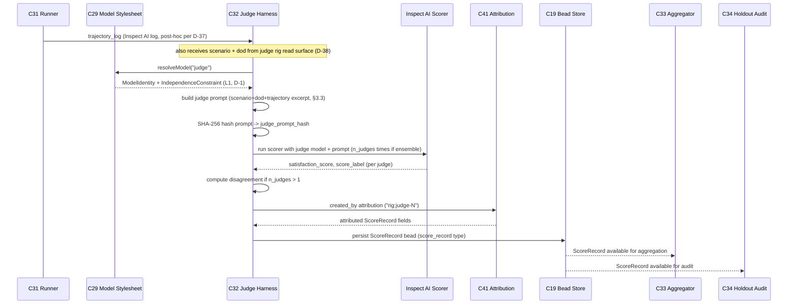

# C32 — LLM-as-judge Harness  (Spec, canonical track)

> Source: README §"Principle 6 — Satisfaction not test-pass" (L179–191: L181 "Probabilistic metric over
> scenario trajectories. LLM-as-judge. Boolean assertions don't survive at scale."; the 5-row table —
> "**LLM-as-judge harness** | Scores trajectories against scenarios | **Inspect AI scorer (best fit)**,
> Ragas, DeepEval | MIT/Apache 2.0 | Gas City pack"; "**Judge rubric management** | Versioned criteria |
> Inspect AI Python objects, promptfoo YAML"; "**Multi-judge ensemble** | Disagreement detection across
> judges | Inspect AI supports multiple scorers"; "**Cross-family enforcement** | Judge must be a different
> model family than coder | Custom policy on the model stylesheet"; L191 placement "Inspect AI provides the
> bulk; cross-family enforcement is configuration on the Gas City model stylesheet"); README §"Principle 5"
> (L175 "Inspect AI has the strongest **agent-trajectory model**"); README §Phase 2 (L417–442: L427 "Build
> cross-family enforcement: rule in Gas City model stylesheet — judge node must use different model family
> than coder node"; L440 "**P6** (satisfaction not test-pass): Inspect AI scorer + Gas City aggregator +
> cross-family enforcement"; L442 "the harder parts are the Inspect AI wrap and the scenario isolation
> policy"); AI-CONTEXT §1.3 (L35 "Scenarios as held-out test set — External, unread-by-agent,
> **independently judged**"); AI-CONTEXT §6.2 "Layer 2" (L294–305: L301 "LLM-as-judge | **Inspect AI
> scorer**, Ragas, DeepEval | MIT/Apache 2.0/Apache 2.0 | Mature"; L304 "Cross-family enforcement | None |
> DIY | Custom model stylesheet rule"); AI-CONTEXT §7 layer map (L373 "Inspect AI | L2: authoring + runner +
> **judge** + aggregation | MIT"); AI-CONTEXT §11 decisions (L467 "Inspect AI for Layer 2 | Yes | Most
> mature general-purpose; agent-trajectory model fits"); AI-CONTEXT §12 open questions (L514 "specific Gas
> City model stylesheet syntax for judge != coder"); AI-CONTEXT §13.3 (L582–608: the `[[rig]]` role blocks +
> the `inspect_eval` `[[tool]]` subprocess with `work_partition = "scenarios"`); F-MODE-COVERAGE §1 (F1
> "Cross-family judge enforcement (P6 component); held-out scenarios (P5)" — Addressed; F2 "Probabilistic
> satisfaction over scenario population (P6); not gate-pass" — Addressed; **F27** "Cross-family enforcement
> at judge nodes" — Addressed; **F46** "Cross-family judge ensemble (P6 component)" — Addressed; **F48**
> "Cross-family judge + independence auditor" — Partial; F39 "Inspect AI region scoring (multiple acceptable
> trajectories)" — Addressed), §6 (F33 "LLM-judge as secondary"; F51 "LLM-judge is secondary" — both gate the
> judge *behind* P4 deterministic-first); component-inventory C32 row (subsystem Evaluation & Judge; kind
> agent-role; "Scores work trajectories against scenarios; must be a different model family than coder"
> *(RELAXED to advisory per D-1; cross-family = FE-1)*;
> maps A50/A51/A52/B23; **depends on C30, C29**; gaps **G08, G20**; foundational: **yes**; Batch 3);
> review-log **D-1** (judge SAME provider/family as coder for now; cross-family → FE-1), **D-6** (canonical
> track), **D-10** (`modeldb = {id, family, cost_tier}`), **D-13** (holdout **enforcement + audit is C34**;
> **C42 provides** the partition; C32 is the **scorer, not the isolation enforcer**); the C29 spec
> (`spec/C29-model-floor-stylesheet.md` §3 — `resolveModel`/`crossFamilyRule`/`IndependenceConstraint`, the
> L0–L3 ladder, L1 Phase-0 default) and C30 spec (`spec/C30-scenario-store.md` §1 — the held-out
> Inspect-AI-`Task` corpus at `scenarios/<component>/` C32 scores against).
> Inventory ID: C32   Kind: agent-role   Status: sweep-2
> Track: canonical (faithful posture — elaborate v4 exactly; mark inferred fills `[FAITHFUL-FILL]`,
> v4 ambiguities `[AMBIGUITY: Gxx]`).

## 1. Purpose & responsibility

C32 is the factory's **LLM-as-judge harness**: the *scorer* that, given a completed (or in-progress) **work
trajectory** and the **held-out scenario** that work was meant to satisfy, produces a **satisfaction score**
— "did this trajectory satisfy the scenario?" — using an **LLM as the grader**, not boolean test assertions.
It is v4's mechanism for **Principle 6 — satisfaction not test-pass**: "Probabilistic metric over scenario
trajectories. LLM-as-judge. Boolean assertions don't survive at scale." (README:181). It serves **P5
(Ashby — requisite variety of evaluation)**: an LLM grader scoring against *regions* of acceptable behavior
gives the factory far more evaluative variety than a fixed assertion suite could, matching the variety of
the work it judges (F39 "region scoring | multiple acceptable trajectories | satisfaction distribution over
region", FM:90).

The harness is built **on the existing stack, not from scratch**: the scoring machinery is the **Inspect AI
scorer** ("LLM-as-judge harness … Inspect AI scorer (best fit)", README:185; AI-CONTEXT:301 "Mature"),
adopted as-is and exposed as a Gas City pack; the **judge model is Claude Code itself** — the *same
provider/family as the coder* for Phase 0 (review-log **D-1**), routed and constrained by **C29**. C32's own
deliverable is the thin, genuine glue the stack does not provide: **binding a trajectory + a scenario rubric
into an Inspect AI scoring run, invoking it as the judge role, and emitting a typed per-trajectory score**
for the aggregator (C33) and the holdout audit (C34).

**Responsibilities (what C32 is the spec-of-record for):**
- **Scoring one trajectory against one scenario.** Take a (trajectory, scenario) pair and produce a
  satisfaction score (the score's *shape* — scalar, label, or per-criterion vector — is fixed by the Inspect
  AI scorer's output model; C32 adopts it). The trajectory is the agent's recorded turn-DAG (CXDB, C21) /
  bead work-product; the scenario is a held-out Inspect AI `Task` (C30). C32 is "Scores trajectories against
  scenarios" verbatim (README:185, inventory C32).
- **Driving the LLM grader as the `judge` role.** C32 runs the scorer with a *judge-role* model identity it
  obtains from **C29** (`resolveModel(judge node)`), under the **independence constraint** C29 emits
  (`crossFamilyRule` / `IndependenceConstraint`). At Phase 0 that identity is **Claude Code, same provider as
  the coder** (D-1), so the judge is the *same agent family* exercised in a **separate rig with a disjoint
  rubric/role/prompt** (independence by isolation, not by family — §6, §7).
- **Rubric binding (versioned criteria).** Bind the scenario's grading criteria ("Judge rubric management |
  Versioned criteria | Inspect AI Python objects", README:186) into the scoring run. The *rubric content*
  lives with the scenario in C30's corpus; C32 owns *loading and applying it* at score time, not authoring
  it.
- **Multi-judge ensemble (disagreement signal).** Support running >1 scorer over the same trajectory and
  surfacing **disagreement** ("Multi-judge ensemble | Disagreement detection across judges | Inspect AI
  supports multiple scorers", README:187) — Inspect AI provides the multi-scorer mechanism; C32 owns the
  thin policy of *requesting N judges and emitting their disagreement* as part of the score record. This is
  the P5-Ashby variety lever and the F46 (single-model review blindspot) mitigation.
- **Emitting a typed, attributed score record.** Write each score as a structured result (per-trajectory,
  carrying the scenario id, the judge model identity + active independence level, and any ensemble
  disagreement) onto a bead / CXDB turn so **C33** can aggregate it and **C34** can audit it. v4 routes
  "judge outputs from beads" (README:426). `> [FAITHFUL-FILL]` — v4 says the aggregator reads "judge outputs
  from beads" but does not fix the per-score schema; the minimal consistent choice is *one structured score
  record per (trajectory, scenario, judge) written to a bead/CXDB turn*, attributed by C41. Concrete schema
  is sweep-2.

**Explicitly NOT (boundaries):**
- **NOT the holdout-integrity ENFORCEMENT or audit (C34) — the load-bearing boundary (D-13).** C32 is the
  *scorer, not the isolation enforcer*. It does **not** enforce that the implementer never read the
  scenarios, and it does **not** run the after-the-fact "did isolation hold?" audit ("Holdout integrity
  audit — Detects if isolation has been violated", README:173). Per **D-13**: **C34 owns** holdout-integrity
  enforcement + audit (incl. judge-independence checks under D-1); **C42 provides** the partition; C32 merely
  *consumes* its constrained judge identity and *emits* a score C34 can audit. C32 runs in the **judge rig**
  (role-isolated from the implementer; its exact partition is OQ5/OQ-C42-3); it is not the boundary policeman.
- **NOT the model router / independence policy (C29).** *Which* model the judge runs on, the floor, and the
  `family(judge) ≠ family(coder)` constraint (and its Phase-0 relaxation) are **C29's**. C32 *asks C29 for*
  the judge model + constraint and *honors* them; it does not decide them. (Inventory: C32 depends on C29.)
- **NOT the scenario store / authoring (C30).** *Where scenarios live, the DSL, the held-out repo/partition,
  day-0 signing* are **C30's**. C32 *reads* a scenario to score against; it neither authors nor stores them.
  (Inventory: C32 depends on C30.)
- **NOT the scenario runner (C31).** *Executing a scenario against the system to drive a fresh trajectory*
  (the Inspect AI runner + session-id adapter, G25) is **C31**. C32 *scores a trajectory* — it does not run
  the system under test. (C31 may invoke C32 as the scorer for a run; C32 also scores already-recorded
  trajectories from CXDB.) `> [FAITHFUL-FILL]` — Inspect AI bundles runner+scorer; v4's inventory splits
  them (C31 runner, C32 judge). Minimal consistent reading: the **scorer** half of Inspect AI is C32, the
  **runner** half is C31; they share the pack but own distinct responsibilities.
- **NOT the satisfaction-metric aggregator (C33).** Computing the *distribution* over the trajectory
  population from many judge outputs ("Satisfaction metric aggregation | Distribution over trajectory
  population", README:188) is **C33**. C32 produces the **per-trajectory** scores; C33 reduces a population
  of them. (Inventory: C33 depends on C32.)
- **NOT a deterministic boundary / primary safety guard.** v4 gates the LLM-judge *behind* P4
  deterministic-first: "Deterministic boundary typing as primary guard (P4); **LLM-judge as secondary**"
  (F33, FM:55; F51, FM:76). C32 is the **secondary, probabilistic** evaluator; it is explicitly *not* the
  last line of safety. This is a v4 invariant, not C32's choice.

## 2. Context & dependencies

| Direction | Component | Relationship |
|---|---|---|
| Depends on | **C30** Scenario store | Supplies the held-out scenario (Inspect AI `Task` + rubric) at `scenarios/<component>/` that C32 scores a trajectory against. C32 reads scenarios through the judge's role-isolated read surface (exact partition = OQ5). |
| Depends on | **C29** Model floor & stylesheet | Supplies the **judge model identity** (`resolveModel(judge node)`) and the **independence constraint** (`crossFamilyRule`/`IndependenceConstraint`, Phase-0 default `L1`, D-1). C32 honors both; it does not pick the model. |
| Reads (trajectory source) | **C21** CXDB / **C19** beads | The trajectory C32 scores is the recorded turn-DAG (CXDB) / bead work-product. `> [FAITHFUL-FILL]` — inventory names only C30/C29 as deps, but "Scores **trajectories**" requires a trajectory source; CXDB is the canonical trajectory store (inventory C21). Read-only; minimal. |
| Consumed by | **C33** Satisfaction metric aggregator | Reads C32's per-trajectory score records ("judge outputs from beads", README:426) and computes the satisfaction distribution. |
| Consumed by / audited by | **C34** Holdout integrity & audit | Audits judge-independence (D-1) and isolation after the fact (D-13). C32 emits the judge identity + active independence level into each score so C34 *can* audit; C34 owns the audit, not C32. |
| Runs inside | **C42** Rig partitioning + **C28** agent loop | The judge runs as the **judge rig** — a distinct *role* from the implementer (the `judge` role is grounded in the **inventory C42 row** "Worker/scenario/judge roles" + **spec/C42** which fixes the role set `{worker/implementer, scenario-author, judge}`; AI-CONTEXT §13.3 supplies the `scenario_authoring`/`implementer` rigs + the `inspect_eval` tool node, **not** a judge rig). The LLM grader is a Claude Code agent loop (C28) under D-1. `> [FAITHFUL-FILL]` — **per D-17** the Sweep-1 default is: the judge MAY read the worker's trajectories + held-out scenarios (to score), the worker MUST NOT read the judge rig or scenarios (holdout); the judge's exact *partition shape* (own `judge` partition vs role-isolated read of `code`+scenario-outputs) is the joint **OQ-C42-3/OQ-C34-3/OQ5** freeze (C42+C34+C32, Sweep-2); see §6. |
| Realized over | **C17/C02** Tool-node / pack ABI | The Inspect AI scorer is exposed as a Gas City pack/tool node ("Inspect AI provides the bulk … Gas City pack", README:185,191; the `inspect_eval` `[[tool]]`, AI-CONTEXT §13.3). |
| Feeds (meta) | **C46** Meta-metrics | "judge false-positive rate" is a P12 meta-metric (README:269); C32's scores + disagreement are an input. (Downstream; not a build dep.) |

## 3. Interfaces / contracts (sweep-2: concrete signatures + frozen schema)

> **OQ4 RESOLVED (Sweep-2) — D-37:** C31↔C32 contract = post-hoc scoring. C31 produces an Inspect AI
> trajectory log; C32 scores post-hoc off that log. C31 does NOT invoke C32 inline. Resolves
> C32:OQ4. The trajectory-read interface below reflects this: C32 reads C31's log directly.

> **OQ5 RESOLVED (Sweep-2) — D-38:** Judge read-surface SHAPE = a separate judge rig (the D-17 joint
> C42/C34/C32 freeze). Per D-31 (multiple rigs per city): judge runs in a separate rig from the worker;
> judge MAY read the worker trajectory log + held-out scenarios; worker MUST NOT read the judge rig or
> scenarios; no shared context window. Resolves the unified OQ-C42-3 + OQ-C34-3 + C32-OQ5.

### 3.1 Primary interface signature

```python
def score(
    trajectory_log: TrajectoryLog,   # C31-produced Inspect AI trajectory log (post-hoc, D-37)
    scenario: InspectAITask,          # held-out scenario Task from C30 (judge rig read, D-38)
    dod: DefinitionOfDone,            # C08's free-form DoD text (holistic grading per D-15)
    judge_model: ModelIdentity,       # from C29 resolveModel("judge") — Phase-0: same-provider (D-1)
    independence: IndependenceConstraint,  # from C29 — Phase-0: L1
    n_judges: int = 1,               # >1 → ensemble path; Inspect AI multi-scorer (README:187)
) -> ScoreRecord:
    ...
```

- **`TrajectoryLog`** — the Inspect AI log artifact written by C31 after running the scenario against the
  built component. C32 reads this read-only from the judge rig's read surface (D-38; C31 writes it into
  the worker rig; the judge rig has read access to it per D-38).
- **`InspectAITask`** — the held-out scenario object from `scenarios/<component>/` (C30's store). C32 reads
  it through the judge rig partition (D-38); it never returns its contents to the worker rig (I3).
- **`DefinitionOfDone`** — C08's free-form DoD text (README:§C08). Used as the holistic grading rubric per
  **D-15** ("graded judge over C08's existing free-form Definition-of-Done — NOT against enumerated
  per-criterion DoD"). C32 does NOT enumerate per-criterion sub-scores (FE-5, deferred).
- **`ModelIdentity`** / **`IndependenceConstraint`** — consumed from C29's `resolveModel` + `crossFamilyRule`
  output; Phase-0 identity = Claude Code same-provider, level `L1` (D-1). C32 honors, does not enforce.
- **Return** — a single `ScoreRecord` (frozen schema §3.2); exactly one per `score()` call regardless of `n_judges`
  (ensemble judges are reduced inside the call; I5).

**Preconditions:** (a) `trajectory_log` exists and is parseable Inspect AI log format; (b) `scenario` is
resolvable from the judge rig's read surface (D-38); (c) `judge_model` is not None (C29 resolved it);
(d) `dod` is non-empty (C08 produced it); **(e) `trajectory_log.inspect_version` matches C32's installed
Inspect AI version — mismatch raises E-C32-02 (REV-SEAM-02: version-pin guard).**

**Postconditions:** exactly one attributed `ScoreRecord` is persisted as a C19 bead (`score_record` type)
and is consumable by C33 and auditable by C34.

### 3.2 Frozen `ScoreRecord` schema (D-39 — OWNED AND FROZEN BY C32)

> **OQ2 RESOLVED (Sweep-2) — D-39:**
> "**C32 OWNS + FREEZES the `ScoreRecord` schema** — C33/C34/C46 consume it; freeze it here."
> (review-log D-39, verbatim.) The table below is the contract C33/C34/C46 build against.

Bead type: `softwarefactory.v4.beads:score_record`

| Field | Type | Req | Semantics | R/W-by |
|---|---|---|---|---|
| `scenario_id` | `string` | R | Unique ID of the held-out scenario (C30 `Task.name`/`Task.id`) | C32 writes; C33/C34/C46 read |
| `scenario_version` | `string` | R | Version/commit of the scenario corpus at score time (C30 corpus pin) | C32 writes; C34 audits for staleness |
| `trajectory_ref` | `string` | R | Reference to the C31-produced trajectory log (path or content-hash); links score to the run | C32 writes; C33/C34 read |
| `dod_version` | `string` | R | Version/hash of the C08 DoD text used as rubric (so grading conditions are reproducible) | C32 writes; C33/C34/C46 read |
| `satisfaction_score` | `float` (0.0–1.0) | R | Holistic satisfaction score from the Inspect AI graded scorer (D-15: single graded value over free-form DoD, not per-criterion) | C32 writes (Inspect AI produces); C33 aggregates; C46 calibrates |
| `score_label` | `enum{satisfied,partial,unsatisfied}` | R | Categorical label derived from `satisfaction_score` thresholds; coarse signal for C34 enforcement gates | C32 writes; C34/C33 read |
| `judge_model_id` | `string` | R | The model identity used as judge, from C29 `ModelIdentity.id` (D-10: `{id, family, cost_tier}`) | C32 writes; C34 audits (independence check per D-13) |
| `independence_level` | `enum{L0,L1,L2,L3}` | R | Active independence level stamped at score time (Phase-0 = `L1`, D-1); C34 audits against declared policy | C32 writes; C34 audits |
| `n_judges` | `int` | R | Number of judge runs in this scoring call (1 = single; >1 = ensemble; Inspect AI multi-scorer) | C32 writes; C46 reads |
| `per_judge_scores` | `list<float>` | O | Raw satisfaction scores per judge run when `n_judges > 1`; absent for single-judge runs | C32 writes (ensemble path); C46 reads for FP-rate |
| `disagreement` | `float` | O | Ensemble disagreement signal (std-dev of `per_judge_scores`); absent when `n_judges = 1` (README:187; F46) | C32 writes (ensemble path); C33/C46 read |
| `judge_prompt_hash` | `string` | R | SHA-256 of the judge prompt sent to the LLM (scenario rubric + DoD text + trajectory excerpt); enables audit reproducibility | C32 writes; C34 audits |
| `created_by` | `actor` | R | C41 attribution — the judge rig identity (wire format: `"rig:judge-1"`, D-29) | C32 writes via C41; C34 audits |
| `scored_at` | `timestamp` | R | UTC timestamp of the scoring run | C32 writes; C33/C46 read |
| `error_code` | `string` | O | E-code if scoring was partial/degraded (e.g. `E-C32-01`, `E-C32-02`); absent on clean run | C32 writes on error; C33/C34 read |

> **Freeze guarantee (D-39):** C33, C34, and C46 MAY build against this field set immediately. C32 will
> not remove or rename any required (`Req = R`) field without a new binding decision. Optional fields
> (`Req = O`) may be added non-breakingly; any removal requires a schema version bump and downstream
> notification.

> [FAITHFUL-FILL] **Score bead type name `score_record`.** v4 says "judge outputs from beads"
> (README:426) but names no type string. `softwarefactory.v4.beads:score_record` is the minimal
> consistent choice: it uses the D-2 namespace, is unambiguous, and is the natural peer of `factory_build`.
> If the canonical bead type name must change, only C32 (owner per D-39) can make that change.

> [FAITHFUL-FILL] **`score_label` thresholds.** v4 gives no numeric thresholds. Placeholder:
> `satisfaction_score ≥ 0.75 → satisfied`; `0.4–0.75 → partial`; `< 0.4 → unsatisfied`. Exact thresholds
> are a C32 config parameter, tunable by C46 calibration; they are not a v4 invariant.

### 3.3 Judge-prompt structure

Per **D-15** ("graded judge over C08's **free-form** DoD, not enumerated per-criterion"):

```
SYSTEM: You are an independent evaluator in a separate judge rig.
        Your task is to grade whether the following agent trajectory
        satisfies the Definition of Done for the scenario.
        Do not use enumerated per-criterion scoring.
        Produce a single holistic satisfaction score 0.0–1.0.

SCENARIO: <InspectAITask.description>
          <InspectAITask.input>

DEFINITION OF DONE:
  <dod.text>          # C08's free-form DoD — verbatim (D-15)

TRAJECTORY:
  <trajectory_log excerpt — the agent's turn sequence>

INSTRUCTIONS:
  1. Read the DoD holistically.
  2. Assess whether the trajectory's final state satisfies it.
  3. Output ONLY a JSON object:
     {"score": <float 0.0–1.0>, "label": "<satisfied|partial|unsatisfied>",
      "rationale": "<one paragraph>"}
```

- The prompt is **SHA-256 hashed** before sending and the hash stored in `judge_prompt_hash` (audit trail, D-38).
- The rubric text is the DoD verbatim — C32 does **not** enumerate sub-criteria (D-15; FE-5 deferred).
- The trajectory excerpt length is bounded (C32 config param, default = last 4096 tokens of the log) to
  stay within the judge model's context window (same Max seat as coder, D-1).

**Invariants:**
- **I1 (secondary-guard).** C32 is the *probabilistic, secondary* evaluator; it never substitutes for the
  P4 deterministic boundary as a safety gate (F33/F51, FM:55/76). A green judge score is satisfaction
  evidence, not a safety authorization.
- **I2 (honor-don't-enforce independence).** C32 runs the judge under exactly the identity + independence
  level C29 supplies and **records** that level on every `ScoreRecord`; it performs **no** independence
  *enforcement* or *audit* (D-13 → C34). At Phase 0 the level is `L1` (same-provider, isolated by rig/role/
  prompt, D-1).
- **I3 (held-out at score time).** C32 reads the scenario only through its **role-isolated** read surface
  (the `judge` rig, separate from the worker rig per D-38); it does not hand scenario contents back to the
  implementer rig. C32's *own* read is legitimate (it must see the scenario to grade); the guarantee that
  the *implementer* never saw it is C34/C42's, not C32's.
- **I4 (attributed, no silent score).** Every `ScoreRecord` is attributed (C41 `created_by` = the judge
  rig/model) and recorded — there is no unlogged judgement; this is what makes "judge false-positive rate"
  (C46) and the independence audit (C34) computable.
- **I5 (one record per pair).** `score()` is deterministic in its *bookkeeping* (exactly one
  `ScoreRecord` per `(trajectory_log, scenario, dod)` call, regardless of `n_judges`); the *LLM score
  itself* is probabilistic — the population statistics (C33), not per-call determinism, are the contract
  (this is the point of P6).
- **I6 (separate-rig isolation — D-38).** C32 runs in a **separate judge rig** from the worker. The judge
  MAY read the worker trajectory log + held-out scenarios; the worker MUST NOT read the judge rig or
  scenarios; there is **no shared context window** between worker rig and judge rig. Prevent-vs-detect of
  the worker→scenario read remains the D-23 spike's open question (D-30).

## 4. Data model / state

C32 owns **little durable state** — it is an *agent-role/scorer*, not a store. Scenarios live in C30,
trajectories produced by C31 in the trajectory log, the aggregated distribution in C33, the model registry
in C29.

> **D-36 annotation (eval-tier trajectory source):** Per D-36, the spine eval tier reads trajectories
> from C31's **Inspect AI trajectory log**, NOT from CXDB. C32 reads the log post-hoc (D-37); CXDB/C21
> is NOT a C32 read dependency for the spine eval path.

| Datum | Shape (sweep-2) | Owner | R/W-by |
|---|---|---|---|
| `ScoreRecord` bead | Frozen field table §3.2 | **C32 (emits, owns schema per D-39)** → persisted as `score_record` bead in C19 | C32 writes; C33 aggregates; C34 audits; C46 reads FP-rate |
| Scorer pack config | `inspect_eval` tool node in Gas City pack (C02/C17); declares judge model binding from C29 | C02/C17 + C32 config | C32 declares; C02/C17 host |
| Rubric binding (transient) | Loaded `InspectAITask` + DoD text — held only for duration of one `score()` call | C30 (content source) / C32 (load+apply) | C32 reads C30; discarded after emit |
| Judge model identity + level (transient) | `ModelIdentity` + `IndependenceConstraint` from C29 per run | C29 (authoritative) | C32 consumes; stamped into `ScoreRecord.judge_model_id` + `ScoreRecord.independence_level` |
| Judge prompt (transient) | Constructed per §3.3; SHA-256 hashed → `judge_prompt_hash` in `ScoreRecord` | C32 constructs | C32 creates; hash persisted in `ScoreRecord` for C34 audit |

C32 is **restart-safe**: scoring is re-runnable (idempotent at the bookkeeping level, I5) because inputs
(trajectory log, scenario, DoD) are durable elsewhere; a lost in-flight score is simply re-scored.

## 5. Behavior

**Scoring one trajectory (the core flow):**
1. C31 finishes a scenario run and writes the **Inspect AI trajectory log** (the hand-off artifact, D-37).
2. The (trajectory_log, scenario, dod) triple is the scoring unit. C32's `score()` is invoked — either by
   C31 signalling completion (bead/event) or by a batch/replay caller.
3. C32 obtains the **judge model identity + independence constraint** from C29 (`resolveModel("judge")`;
   Phase-0 `L1`, D-1) and reads the held-out **scenario** + DoD from the judge rig's read surface (D-38:
   separate judge rig, judge MAY read trajectory log + scenarios, worker MUST NOT read judge rig/scenarios,
   no shared context window).
4. C32 constructs the **judge prompt** (§3.3): scenario description + DoD text + trajectory excerpt;
   SHA-256 hashes it → `judge_prompt_hash`.
5. C32 runs the **Inspect AI scorer** with the LLM grader (Claude Code, judge rig, D-1) bound to the
   constructed prompt → raw `satisfaction_score` (float 0.0–1.0) + `score_label`.
6. *(Ensemble, optional — n_judges > 1)* C32 requests N Inspect AI scorers over the same prompt (multi-scorer,
   README:187); reduces to `per_judge_scores` list + `disagreement` (std-dev). Inspect AI executes the
   multi-scorer; C32 owns only the request and the reduction.
7. C32 emits a **`ScoreRecord`** (§3.2, all required fields populated), attributed via C41 (`created_by =
   "rig:judge-N"`), and persists it as a `score_record` bead in C19 → consumed by **C33** (aggregate) and
   auditable by **C34**.

**Sequence diagram — trajectory log + scenario + DoD → judge prompt → ScoreRecord:**



**Degraded behavior:** if the judge model is unavailable (C29 cannot resolve / auth fails) the pair is left
*unscored* and surfaced as a `E-C32-01` bead/gate event (visible to the self-healing loop) — C32 never
silently substitutes a fabricated score (I4). If a single judge in an ensemble fails, C32 emits the partial
ensemble with reduced N, sets `error_code = "E-C32-03"`, and flags the disagreement field as `null`
(partial ensemble). If the trajectory log is unparseable, C32 emits `E-C32-02` and leaves the pair
unscored. If the scenario is unresolvable from the judge rig's read surface, C32 emits `E-C32-04` and
fails closed (no score, no fabricated result; I3/I6).

## 5a. Error taxonomy (sweep-2)

| E-code | Condition | Surfaced-as | Caller recovery |
|---|---|---|---|
| `E-C32-01` | Judge model unavailable — C29 cannot resolve a model identity or auth fails | Unscored pair; `score_record` bead NOT emitted; bead/gate event written to C19 with `error_code = "E-C32-01"` | C33/C34 see no score for the (trajectory, scenario); the self-heal loop (C36–C39) can retry or escalate; no fabricated score (I4) |
| `E-C32-02` | Trajectory log unparseable — C31's log is missing, corrupt, or not Inspect AI format | Unscored pair; gate event with `error_code = "E-C32-02"` | Caller (C31 or batch replay) re-runs the scenario to regenerate the log; C32 is not the re-runner |
| `E-C32-03` | Partial ensemble — one or more judges in an n_judges>1 run fail; others succeed | `ScoreRecord` emitted with reduced `n_judges`, `error_code = "E-C32-03"`, `disagreement = null`; `per_judge_scores` contains only successful runs | C33 accepts the partial record with reduced N; C46 notes the reduced sample in FP-rate accounting |
| `E-C32-04` | Holdout-leak-detected / scenario unresolvable — scenario not accessible from judge rig read surface (D-38), or judge rig detects a possible cross-partition read attempt | Scoring fails closed; gate event with `error_code = "E-C32-04"` and metadata for C34 audit | C34 is notified immediately; no score emitted; operator review required — this is the highest-severity error as it may indicate isolation failure |
| `E-C32-05` | Score parse failure — the Inspect AI scorer returned output but it is not parseable as `{score, label, rationale}` JSON | Unscored pair; gate event with `error_code = "E-C32-05"` | Retry (LLM non-determinism); if persistent, escalate to C36–C39 self-heal with the prompt hash for diagnosis |
| `E-C32-06` | Judge timeout — the Inspect AI scorer did not return within the configured deadline | Unscored pair; gate event with `error_code = "E-C32-06"` | Retry after back-off; repeated timeout escalates as throughput issue (shared Max seat, D-1 / OQ3) |

> [FAITHFUL-FILL] Error codes are C32-scoped per the SWEEP2-DISPATCH rubric. The self-healing loop
> (C36–C39) is the consumer of gate events; C32 emits the gate event but does not drive recovery.

## 6. Failure modes & handling

| F-mode | Source | C32's role | Status per v4 |
|---|---|---|---|
| **F2** Reward hacking | FM:18 | C32 produces a *probabilistic satisfaction* score over the scenario population (P6), not a gate-pass — the thing that makes reward-hacking harder | Addressed |
| **F1** Hallucination loop | FM:17 | At Phase 0 the guard is the **judge-independence policy at `L1`** (prompt/role/rig-isolated same-provider judge, D-1) scoring against held-out scenarios; cross-family strengthening is FE-1 | Addressed at v4 level; Phase-0 mechanism = L1 isolation |
| **F27** Circularity / same-model build+validate | FM:21 | Phase-0 guard (D-1) is **rig/role/prompt isolation** of the same-provider judge; the cross-provider strengthening is **FE-1** | Addressed at Phase-0 isolation level (isolation bounds *context* sharing, not *distribution* sharing; the distribution-sharing residual → F48/FE-1; cross-provider = FE-1) |
| **F46** Single-model review blindspot | FM:24 | The **multi-judge ensemble** (disagreement detection) is C32's variety lever (P5-Ashby); the *cross-family* ensemble is FE-1 | Partial at Phase-0 (full cross-family = FE-1); ensemble surfaces disagreement now |
| **F48** Tacit collusion via shared context | FM:25 | Cross-family judge + independence auditor; v4 marks **Partial** (shared training-distribution residual). Under D-1 the same-provider judge *shares* that distribution — residual is larger pre-FE-1, mitigated only by rig/role/prompt isolation | Partial (residual acknowledged; see §9) |
| **F39** Point-spec / region-mismatch | FM:90 | Inspect AI **region scoring** (multiple acceptable trajectories) → satisfaction *distribution over a region*, not a single point | Addressed |
| **F33** Adversarial-prompt defeat of LLM-judge | FM:55 | C32 is the **secondary** guard *behind* P4 deterministic boundary typing; twins remove the deploy-to-prod vector | Addressed (C32 is secondary by design, I1) |
| **F51** Ashby-deficient probabilistic guard | FM:76 | P4 deterministic-first is primary; **LLM-judge is secondary** — C32 must not be the sole guard | Addressed (I1) |

**Gap handling (G08 + G20) — RESOLVED by D-1, deferred to FE-1:**

> [AMBIGUITY: G08 — RESOLVED by D-1/FE-1] **"Model family" is undefined / "judge must be a different family
> than coder".** Reading (a): *family = provider* (Anthropic vs OpenAI vs Google) — the literal README:189
> reading, which implies a **second provider/API key** that AI-CONTEXT §4.1 says Max does not issue. Reading
> (b): *family = training-lineage within a provider*, so a Claude-judge scoring Claude-coder work is allowed.
> The two readings sit in tension because F27/F46/F48 want validator-from-builder independence while the Max
> floor forbids a second provider. **The integrator's ruling D-1 resolves it (the canonical track does not
> relitigate):** the **Phase-0 baseline is the same-provider judge** — effectively reading (b) — with
> independence supplied by **rig partitioning (C42) + role/prompt isolation**, not model-family diversity.
> The inventory's "**must be a different model family**" line is therefore **RELAXED to advisory** for the
> canonical track; cross-family judging is **future enhancement FE-1**. **C32's Phase-0 path:** run the
> Inspect AI scorer with a **Claude Code judge in the `judge` rig** (a distinct *role* from the coder —
> grounded in the inventory C42 row + spec/C42, **not** AI-CONTEXT §13.3, which names only
> `scenario_authoring`/`implementer`), scoring against held-out
> scenarios, under a **disjoint rubric/role/prompt** from the coder, recording the active independence level
> (`L1`) on each `ScoreRecord`. *(The judge's exact **partition** read-surface — a dedicated `judge`
> partition vs a role-isolated read of `code`+scenario-outputs — is the joint open question OQ-C42-3/OQ-C34-3,
> deferred at OQ5; C32 asserts the role/prompt isolation, not the partition shape.)* C32 builds **no
> cross-family/independent-judge machinery** and assumes **no second-provider credential** — both are FE-1.

> [G20 — RESOLVED by D-1/FE-1] **The judge model is unsourced.** v4 names no non-Claude provider, budget, or
> auth path (G20). Per **D-1** this is **no longer a Phase-0 blocker**: Phase 0 runs the **same-provider
> judge** (Claude Code), so **no second-provider credential is required** to stand up C32 and the evaluation
> tier. C29 already supplies the (Phase-0) judge identity via `resolveModel`; C32 consumes it. Sourcing a
> second family/provider, its budget, and its auth path are **FE-1**, revisited when a second-provider
> credential exists or same-family judge bias is measured as material (the residual flagged under F48/§9).

**The independence story (per D-1/D-13), explicitly:** at Phase 0 the judge's independence from the coder is
**structural, not family-based** — (i) the **`judge` rig** — a distinct *role* C42 provides and C34
enforces/audits (D-13); whether the judge gets *its own* partition or a role-isolated read of
`code`+scenario-outputs is OQ-C42-3/OQ-C34-3 (deferred, OQ5) — and (ii) a **disjoint role/prompt/rubric** so
the judge is not the coder's own context re-scoring itself. C32's contribution is to *run inside that isolation and stamp the active level
onto every score*; the *enforcement and after-the-fact audit* of the isolation (and of judge-independence
under D-1) are **C34's** (D-13), not C32's.

**Other detection/recovery:** judge-unavailable / auth failure / partition-miss are surfaced as bead/gate
events (visible to the C36–C39 self-healing loop), never as silent or fabricated scores (I4).

## 7. Cross-cutting

- **Security / isolation.** C32 runs in the **judge rig** — a distinct *role* from the implementer (the
  `judge` role is grounded in the inventory C42 row + spec/C42; AI-CONTEXT §13.3 supplies the
  `scenario_authoring`/`implementer` rigs + the `inspect_eval` tool node, not a judge rig — and the judge's
  exact *partition* read-surface is OQ-C42-3/OQ-C34-3, deferred, OQ5). It
  reads scenarios (it must, to grade) but never returns scenario contents to the implementer rig (I3). The
  isolation *enforcement + audit* is C34's (D-13). The judge's Claude Code auth is the same Max-OAuth path
  as C28 (no separate credential at Phase 0, D-1); a second-family judge credential is FE-1 + G37 (secrets,
  deferred to C03).
- **Cost (G32).** v4's only anchor is "$200/month Max" (AI-CONTEXT §4.1) and there is **no cost model** for
  scenario-suite scoring, multi-judge ensembles, or (future) second-family judge tokens. "judge
  false-positive rate" is a P12 meta-metric (README:269) C32 feeds, but **cost-per-satisfaction is C46's**;
  deferred here (G32, noted not resolved — §9). At Phase 0, judge calls consume the *same* single Max seat as
  the coder, so judge volume competes with build volume for the shared seat ceiling (cf. C28 G13/G34) —
  flagged.
- **Scale.** Same single-seat throughput ceiling as the coder (the judge is the same provider, D-1); ensemble
  judging multiplies judge calls per trajectory. Quantification is unmodeled in v4 (shared root with C28
  G13/G34); deferred.
- **Observability.** Every `ScoreRecord` is attributed (C41) and recorded (bead/CXDB) — the judge's own
  trajectory is itself captured by the C25→C27 telemetry tier (the judge is a Claude Code loop). This is what
  makes the independence audit (C34) and judge-FP-rate meta-metric (C46) computable.
- **Ops.** The scorer is adopted off-the-shelf (Inspect AI) and exposed declaratively as a Gas City pack
  (C02/C17), no Go fork; rubrics are versioned with the scenario corpus (C30).
  **[REV-SEAM-02 — version-pin requirement added:]** C32's `[[service]] type="inspect_ai"` provider block MUST carry the **same pinned Inspect AI version** as C31's pack (e.g. `version = "0.3.x"`). C32 MUST validate the `inspect_version` field on the incoming `TrajectoryLog` envelope (C31 §4.1) against its own installed version at score time; a version mismatch MUST be treated as a log-parse failure and surface as E-C32-02. Version drift between C31 and C32 silently breaks post-hoc scoring (C31 flagged this risk at OQ-4 / §7 Ops).
  **[REV-SEAM-03 — C22 registration seam added:]** The `score_record` bead type (`softwarefactory.v4.beads:score_record`) MUST be registered in C22 (D-3 mechanism) at C32's pack installation step, before any scoring run. C33, C34, and C46 consumers depend on the registration to locate the bead-type schema. This mirrors C33's `satisfaction_metric` registration seam (C33 §3.5/§7 Ops).

## 8. Acceptance criteria & test strategy (sweep-2: concrete AC-code table)

| AC-code | Given / When / Then | Verifies |
|---|---|---|
| `AC-C32-01` | **Given** a C31 trajectory log + a held-out scenario + DoD text; **When** `score()` is called; **Then** exactly one attributed `ScoreRecord` bead is persisted in C19 with all required fields (`satisfaction_score`, `score_label`, `judge_model_id`, `independence_level`, `judge_prompt_hash`, `created_by`, `scored_at` non-null); C33 can read it | I4, I5, D-39; AC1 |
| `AC-C32-02` | **Given** C29 returns `ModelIdentity` with `family="claude"` + `IndependenceConstraint(level=L1)`; **When** `score()` is called; **Then** the emitted `ScoreRecord.independence_level = "L1"` and no second-provider credential is required or attempted | I2, D-1; AC2 |
| `AC-C32-03` | **Given** the judge runs in a separate judge rig (D-38) with no shared context window with the worker rig; **When** `score()` is called; **Then** the trajectory log and scenario are readable by the judge but the worker rig cannot observe the judge prompt, scenario text, or any ScoreRecord field (independently verified by C34 audit) | I3, I6, D-38; AC2 |
| `AC-C32-04` | **Given** 10 distinct trajectory logs for the same scenario; **When** `score()` is called for each; **Then** the 10 `satisfaction_score` values are a float distribution (not all identical and not a boolean); C33 can aggregate them into a distribution | I5, P6, D-15; AC3 |
| `AC-C32-05` | **Given** `n_judges = 3`; **When** `score()` is called; **Then** `ScoreRecord.per_judge_scores` is a list of 3 floats and `ScoreRecord.disagreement` is the std-dev of those values | F46, README:187; AC4 |
| `AC-C32-06` | **Given** a green `ScoreRecord` (`score_label = "satisfied"`); **When** a C43 deterministic boundary gate would BLOCK a deploy; **Then** the `ScoreRecord` alone does NOT authorize the deploy (C32 is not consulted as the gate, I1) | I1, F33, F51; AC5 |
| `AC-C32-07` | **Given** C29 returns None (model unavailable); **When** `score()` is called; **Then** NO `ScoreRecord` bead is emitted; a gate event bead with `error_code = "E-C32-01"` is written to C19; C33 sees zero scores for the pair | E-C32-01, I4; AC7 |
| `AC-C32-08` | **Given** a malformed trajectory log (corrupt / not Inspect AI format); **When** `score()` is called; **Then** NO `ScoreRecord` bead is emitted; a gate event with `error_code = "E-C32-02"` is written | E-C32-02, I4; AC7 |
| `AC-C32-09` | **Given** the scenario is not accessible from the judge rig's read surface (D-38 isolation); **When** `score()` is called; **Then** scoring fails closed: NO `ScoreRecord` bead, gate event with `error_code = "E-C32-04"`, and C34 receives notification | E-C32-04, I3, I6; AC7 |
| `AC-C32-10` | **Given** n_judges=2 and one scorer times out; **When** `score()` is called; **Then** `ScoreRecord` is emitted with `n_judges = 1` (actual), `error_code = "E-C32-03"`, `disagreement = null`; C33 accepts it with a reduced-N flag | E-C32-03; AC4 partial |
| `AC-C32-11` | **Given** the Inspect AI scorer returns non-JSON output; **When** `score()` is called; **Then** gate event with `error_code = "E-C32-05"`; NO `ScoreRecord` emitted; retry is the caller's option | E-C32-05, I4 |
| `AC-C32-12` | **Given** the scorer times out (configurable deadline exceeded); **When** `score()` is called; **Then** gate event with `error_code = "E-C32-06"`; NO `ScoreRecord` emitted | E-C32-06, I4 |
| `AC-C32-13` | **Given** any emitted `ScoreRecord`; **When** read by C34; **Then** `judge_prompt_hash` is a valid SHA-256 hex string, and `created_by` is a valid `"rig:judge-N"` actor string (D-29), enabling C34's independence audit | I4, D-38, D-39; C34 audit |
| `AC-C32-14` | **Given** a DoD text (C08 free-form); **When** the judge prompt is constructed (§3.3); **Then** the DoD text appears verbatim (unmodified, unenumerated) in the prompt and `judge_prompt_hash` matches the constructed prompt | D-15, §3.3 |

## 9. Open questions (→ review-log)

- **OQ1 (G08/G20 → FE-1, top — PARTIALLY RESOLVED by D-1; bias-measurement deferred).**
  RESOLVED (Sweep-2): Under D-1 the Phase-0 same-family judge bias stays **Partial** (F48 residual). The
  FE-1 trigger condition is: **when C46's judge-FP-rate measurement shows persistent calibration error
  (e.g. >15% FP rate on a calibration scenario set), that is the evidence to activate FE-1 (cross-family
  judging)**. The judge-FP measurement harness is C46, not C32 — C32 produces the `ScoreRecord`s C46 reads.
  C32 builds **no** cross-family machinery and assumes **no** second-provider credential; those are FE-1.
  The bias residual is acknowledged; D-1 advisory stands; the FP-rate gate (via C46) is the named trigger.

- **OQ2 (score schema seam) — RESOLVED (Sweep-2) by D-39.** `ScoreRecord` schema is **frozen at §3.2**.
  C33, C34, and C46 build against the frozen field table. C32 owns the schema; any change requires a new
  binding decision.

- **OQ3 (cost/throughput, shared with C28 G13/G34, G32 — still open).** No token-budget/cost model exists
  for judge-suite + ensemble scoring on the **single Phase-0 Max seat** the judge shares with the coder.
  Ensemble judging multiplies judge calls (`n_judges × trajectory count`); v4 gives no numbers. Needs
  quantification (→ C46) before throughput claims hold. **Still open — not C32's to resolve; flagged for
  C46/OQ3 + C28:OQ-3.**

- **OQ4 (runner↔scorer split) — RESOLVED (Sweep-2) by D-37.** C31↔C32 contract = post-hoc scoring: C31
  runs the held-out scenario against the built component and writes the Inspect AI trajectory log; C32 scores
  post-hoc off that log. C31 does NOT invoke C32 inline. The hand-off artifact is the trajectory log. The
  `score()` signature (§3.1) reflects this; `TrajectoryLog` is the C31-produced artifact.

- **OQ5 (judge partition read-surface) — RESOLVED (Sweep-2) by D-38.** Judge read-surface SHAPE = a
  **separate judge rig** (per D-31 multiple-rigs-per-city + D-17 joint freeze). The judge runs in its own
  rig (e.g. `rig:judge-1`) co-resident in the city with the worker rig (e.g. `rig:worker-1`). The judge
  MAY read the worker trajectory log + the held-out scenario partition; the worker MUST NOT read the judge
  rig or the scenarios; **no shared context window**. C42 provides the partition; C34 enforces + audits;
  C32 runs inside it. The prevent-vs-detect strength of the worker→scenario boundary is the D-23 spike
  (D-30) — still open, not a C32 question. I3 and I6 reflect the resolved shape; AC-C32-03 tests it.
