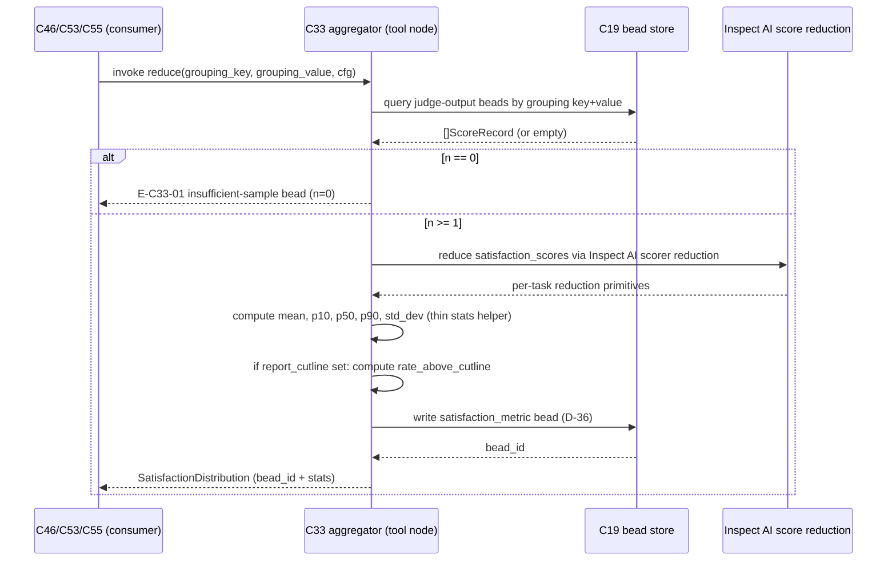

# C33 — Satisfaction Metric Aggregator  (Spec, canonical track)

> Source: README §"Principle 6 — Satisfaction not test-pass" (line 181 "Probabilistic metric over scenario
> trajectories. LLM-as-judge. Boolean assertions don't survive at scale"; line 188 table row "Satisfaction
> metric aggregation | **Distribution over trajectory population** | Inspect AI score reduction | MIT | Gas
> City pack"; Phase 2 line 426 "Build satisfaction aggregator: **small Go tool node reading judge outputs from
> beads, computing distributions**"; line 440 "**P6** … Inspect AI scorer + **Gas City aggregator** +
> cross-family enforcement"; line 269 meta-metric row "cost-per-satisfaction, **time-to-threshold**, judge
> false-positive rate"); AI-CONTEXT §"12 principles" (line 36 "Satisfaction not test-pass | **Probabilistic
> over trajectory population**"), §"Layer 2" decisions (line 302 "Satisfaction aggregation | **Inspect AI
> score reduction** | MIT | Mature within framework"; line 373 "Inspect AI | L2: authoring + runner + judge +
> **aggregation**"; line 393 "Aggregation: **Inspect AI score reduction**, MLflow tracking"); component-inventory
> C33 row (line 45 "Computes the satisfaction distribution over the trajectory population from judge outputs";
> maps A53/A19/B41; depends C32, C19; gap G09; foundational yes) + Batch-3 note (line 111); spec/C32 (judge
> output = the input C33 reduces); spec/C30 §1 (line 110 "aggregating scores into a satisfaction distribution
> is **C33**"); spec/C31 §3 (INV-4 "verdict-blind … C32/C33 do"); spec/C19 (bead store the judge outputs land
> on); spec/C08 §8 (the spec's acceptance/DoD surface C33 scores *against* — Reading A collapsed spec);
> F-MODE-COVERAGE F2/F39/F47/F60 (satisfaction-over-population as the reward-hacking / region-mismatch /
> Goodhart / compounding-error guard); ambiguities-and-gaps G09; review-log D-1 (judge same-provider),
> D-6 (canonical track); **D-15 (RESOLVED — satisfaction is holistic at Sweep-1 against C08's free-form DoD; FE-5 enumerated per-criterion DoD stays DEFERRED to Sweep-2)**; FUTURE-ENHANCEMENTS FE-5 (enumerated per-criterion DoD — decision below).
> Inventory ID: C33   Kind: component   Status: sweep-2
>
> **Sweep-2 additions (2026-06-01):** Concrete `reduce()` signature; `SatisfactionDistribution` schema (OQ-2
> resolved); `satisfaction_metric` bead-write contract (D-36); E-code table; AC-code table (E↔AC cross-refs);
> sequence diagram; OQ-1/OQ-2/OQ-4 resolved inline. Binding decisions cited verbatim: D-15, D-36, D-39.
>
> **D-36 (verbatim):** "C33 writes the satisfaction record to **C19 (beads)**, not CXDB."
>
> **D-39 (verbatim):** "`ScoreRecord` schema is owned + frozen by C32. C33 (aggregate) … consume it. Frozen
> at Sweep-2."
>
> **D-15 (verbatim):** "Satisfaction is HOLISTIC at Sweep-1 (FE-5 resolution). C33 computes the satisfaction
> distribution by a graded judge (C32) over C08's existing free-form Definition-of-Done — NOT against
> enumerated per-criterion DoD."

## 1. Purpose & responsibility

C33 is the factory's **satisfaction-metric aggregator**: the **Gas City pack / tool node** that **reads judge
outputs (C32) for a population of scored trajectories and reduces them into the satisfaction *distribution*
over that population** (README:188, 426; AI-CONTEXT:36). It is the component that operationalises **Principle 6
— "satisfaction not test-pass"**: where a test suite yields one boolean, C33 yields a **distribution of
per-trajectory satisfaction scores** (and summary statistics over it) so the factory reasons about *the
variety of outcomes a spec produces*, not a single green/red. This is the **P5 Ashby's-law** posture made
measurable — measuring the variety of outcomes (the spread of satisfaction), not collapsing it to a point.

C33 is the **spec-of-record for the satisfaction-metric definition (G09)**: what one trajectory's satisfaction
*is* (the judge's score), how a population of them is *reduced* (the distribution + its summary statistics),
and — explicitly bounded below — what is **deferred** (the pass/fail *threshold* / "satisfied" cutline, which
v4 never defines). It is **deliberately thin**: v4 names the engine as **Inspect AI score reduction** (a mature
MIT capability, AI-CONTEXT:302; v4's named companion is **MLflow tracking**, AI-CONTEXT:393) wrapped as a Gas
City pack; C33's *custom* surface is only the **distribution shape + the bead-population read/aggregate glue**
that Inspect AI's per-task reduction does not by itself span (README:426 "small Go tool node … computing
distributions").

**Responsibilities (what C33 is the spec-of-record for):**
- **Read judge outputs for a trajectory population (I1).** Pull the per-trajectory judge results — scores +
  the run/scenario identity they carry — from where C32 lands them: **judge-output beads on C19** (README:426
  "reading judge outputs **from beads**"; inventory C33 `depends on C19`).
- **Define the per-trajectory satisfaction *score* (G09, partial).** One trajectory's satisfaction = its
  **judge score** (C32's output) — a graded value, *not* a boolean test-pass (README:181; P6). C33 owns the
  **normalisation contract** (what scale judge scores are reduced on); the score *value* is C32's.
- **Reduce the population into a *distribution* + summary statistics (I2).** Compute, over the population of
  per-trajectory scores, the **satisfaction distribution** and its summary statistics (count, mean/median,
  spread, quantiles; and — *only if* an optional reporting cutline is configured — rate-above-cutline) — the
  "distribution over trajectory population" of README:188. The engine is v4's named **Inspect AI score
  reduction** (README:188; AI-CONTEXT:302/393), plus a **thin stats helper** for the distribution summaries
  Inspect AI's per-task reduction does not itself emit — **not** a custom statistics engine.
  > [FAITHFUL-FILL] v4 names **only** "Inspect AI score reduction" (companion: MLflow tracking, AI-CONTEXT:393)
  > for C33's aggregation; `numpy`/`pandas` appear nowhere in v4 and `scipy` is named in v4 specifically as
  > **C48**'s A/B significance engine (README:275; AI-CONTEXT:360/421). So any stats library behind Inspect
  > AI's reduction is a minimal *helper* inference for quantiles/spread, NOT a v4-stated C33 engine and
  > explicitly NOT the scipy significance machinery (that is C48). Concrete library choice is sweep-2.
- **Define the population/grouping key (I3).** What set of trajectories one distribution is computed over —
  **per spec-revision** (the unit C08 §7 obs names: "A spec revision is the unit a satisfaction metric (C33)
  … are computed *against*", C08:112), optionally sliced per scenario / per run-cohort.
- **Emit the satisfaction metric as a typed result (I4).** Surface the distribution + statistics as the tool
  node's declared output, consumable by **C46** (meta-metrics: cost-per-satisfaction, time-to-threshold —
  README:269), **C53** (bootstrap-validation gate — inventory C53 `depends on C33`), and **C55** (methodology
  experiment loop — inventory C55 `depends on C33`).

**Explicitly NOT (boundaries):**
- **NOT the judge.** Scoring *one* trajectory against *one* scenario (the LLM-as-judge) is **C32** (README:185;
  spec/C30:110). C33 never invokes a model and never scores a trajectory; it only **reduces scores C32 already
  produced**. C33 is model-free and deterministic.
- **NOT the threshold / promotion gate / "is this good enough" decision.** C33 *computes* the distribution; it
  does **not** own a pass/fail cutline, a "satisfied" verdict, or a ship/no-ship decision. The
  satisfaction-vs-threshold *gate* is **C50** (promotion gate) / **C53** (bootstrap validation) / **C39**
  (loop-closure); the **threshold itself is undefined in v4 and is deferred (G09, §6)**. C33 may *report* a
  rate-above-a-supplied-cutline as one statistic, but it does not *decide* the cutline or act on it.
- **NOT the meta-metric stream.** cost-per-satisfaction, time-to-threshold, and judge-false-positive-rate over
  *time* are **C46** (README:269; inventory C46 `depends on C33`). C33 produces the *satisfaction* term C46
  divides cost by; it does not model cost, time, or trend.
- **NOT a custom statistics engine.** The reduction is v4's named **Inspect AI score reduction**
  (AI-CONTEXT:302/393) plus a thin distribution-summary helper ([FAITHFUL-FILL]; v4 names no stats library for
  C33 — see I2). C33 introduces **no bespoke estimator, bootstrap, or significance machinery** — A/B
  significance testing lives in **C48** (the v4-named scipy/Evidently engine, README:275). If a future need
  arises for confidence intervals on the satisfaction rate, that is C48/C46 territory, not a C33-owned stats
  engine (§6, the-bar note).
- **NOT the trajectory store or the judge-output schema.** Trajectories live in **C21** (CXDB); the
  judge-output *bead* shape is **C20**'s schema over **C19** (C33 *reads* it, does not define it). C33 owns the
  *aggregation* contract, not the storage or the input record format.
- **NOT the spec's Definition-of-Done.** What a trajectory is scored *against* is the **C08 spec** (its
  acceptance/DoD surface) interpreted by the **C32 judge** — C33 never reads the spec. The FE-5 question (does
  satisfaction require *enumerated per-criterion* DoD in C08?) is **RESOLVED by D-15** (§6): Sweep-1 scores
  **holistically** against C08's free-form DoD; enumerated per-criterion DoD stays DEFERRED to Sweep-2; C33
  does not unilaterally change C08.

## 2. Context & dependencies

| Direction | Component | Relationship |
|---|---|---|
| Upstream (judge output) | **C32** Judge harness | Produces the per-trajectory **judge score** C33 reduces. Same provider/family as coder (D-1) — does not change C33, which is provider-agnostic (it consumes scores, not models). Inventory C33 `depends on C32`. |
| Upstream (population source) | **C19** Bead work-graph | The durable store where C32's judge outputs land as beads; C33 **reads the judge-output beads** for a population ("reading judge outputs from beads", README:426). Inventory C33 `depends on C19`. |
| Input-record schema | **C20** Bead schema registry | Owns the judge-output bead *type/payload* (score + run/scenario identity) C33 reads. C33 uses the registered type; it does not define it. |
| Reduction engine | **Inspect AI score reduction** (pack-wrapped) | The MIT, "mature within framework" reducer (AI-CONTEXT:302; v4's named companion is MLflow tracking, AI-CONTEXT:393) C33 wraps as a Gas City pack; plus a thin stats helper for distribution summaries (`[FAITHFUL-FILL]` — v4 names no stats library for C33; scipy is C48's). Pattern/engine reuse, not custom stats. |
| Packaging host | **C02** Pack/tool-node ABI, **C17** Tool-node abstraction | C33 is a **small Go tool node in a Gas City pack** (README:426/440), invoked via the tool-node protocol. *(Related interface, not a dependency edge; mirrors how C24 names C02/C17.)* |
| Downstream (meta-metrics) | **C46** Meta-metric stream | Consumes the satisfaction term to compute cost-per-satisfaction / time-to-threshold (README:269). Inventory C46 `depends on C33`. |
| Downstream (bootstrap gate) | **C53** Bootstrap-validation milestone | The go/no-go gate that needs a satisfaction rubric, not "looks good" (G23); reads C33's distribution. Inventory C53 `depends on C33`. |
| Downstream (methodology loop) | **C55** Methodology-experiment loop | Selects methodology per work-type by **empirical** satisfaction; reads C33. Inventory C55 `depends on C33`. |

**Position in the system.** C33 is **Batch-3** (component-inventory line 111), built in **Phase 2** with the
rest of the evaluation tier (Inspect AI wrap, scenario isolation, judge, satisfaction aggregator —
README:421–427). It is **foundational** (inventory C33: Foundational? = yes) — not because it is large, but
because it is the **satisfaction-metric definition** that **C46, C53, C55** (and through C46, the whole
self-optimization tier) contract against: "what satisfaction *is* as a number" is fixed here. It is on the
P5/P6-delivery path (README:440) and is **feature-flag-gated** with the evaluation pack (it exists only when
the scenario/judge capability is enabled, C03).

## 3. Interfaces / contracts

### 3.1 Sweep-1 interface summary (preserved)

| # | Interface | Direction | Description | Owning/detailing component |
|---|---|---|---|---|
| I1 | **Judge-output population read** | inbound (read) | Query C19 for the judge-output beads constituting a population (by grouping key, I3); each carries a per-trajectory **score** + run/scenario identity (README:426). | C33 (this); **C19/C20** (store + record) |
| I2 | **Score reduction → distribution + statistics** | internal | Reduce the population of scores into the **satisfaction distribution** and summary statistics (count, mean/median, spread, quantiles; rate-above-cutline only if a cutline is configured). Engine = v4-named **Inspect AI score reduction** + a thin distribution-summary helper (`[FAITHFUL-FILL]`; v4 names no stats library for C33, scipy is C48's) — no custom estimator. | C33 (this); Inspect AI (engine) |
| I3 | **Population / grouping key** | input (config) | Defines the trajectory set one distribution spans — default **per spec-revision** (C08 §7 obs, C08:112), optionally sliced per scenario / cohort. Sweep-1 names the key; the canonical slice taxonomy is sweep-2. | C33 (this) |
| I4 | **Satisfaction-metric result output** | outbound (data) | The tool node's declared output: the distribution + statistics + population identity (which spec-revision/scenario set, sample count), surfaced via the tool-node ABI and consumable by C46/C53/C55. | C33 (this); C02/C17 (surfacing) |
| I5 | **Tool-node lifecycle (pack)** | inbound (ops) | Packaged + invoked as a Gas City tool node (C02/C17 ABI); configured via pack TOML (population default, the optional reporting cutline, the score-normalisation rule). | C02/C17 (ABI); C33 (config) |

### 3.2 Sweep-2 concrete signature

> **OQ-4 RESOLVED (Sweep-2):** C32's `ScoreRecord` is frozen (D-39). The fields C33 reads are
> `satisfaction_score: float64` (normalised 0.0–1.0 by C32, Inspect AI scorer shape — the D-39-canonical
> field name; **not** `score_value`), `scenario_id: string`, `trajectory_ref: string`, and
> `independence_level: string`. Ensemble collapse (multiple judges → one `satisfaction_score`) is
> **C32's** contract (boundary; §1 NOT); C33 consumes the already-collapsed `satisfaction_score`. If C32
> surfaces a future `score_per_judge: []float64` field, that remains C32's — C33 reduces only the
> `satisfaction_score` field. **C33's normalisation rule: accept `satisfaction_score` ∈ [0.0, 1.0];
> reject (flag E-C33-02) any record where the field is absent or outside [0.0, 1.0].**
> **[REV-SEAM-01 fix: field name corrected from `score_value` → `satisfaction_score` to match C32's D-39 frozen schema]**

```
// Primary entry — the only public surface of the tool node.
// Inputs are read from the C19 bead store; output is written back as a bead (D-36).
func reduce(
    population []ScoreRecord,   // C32-emitted, D-39 frozen fields; see §3.3
    cfg         ReduceConfig,   // pack TOML-sourced; see §3.4
) (SatisfactionDistribution, error)

// ScoreRecord — consumed fields (D-39; C32 owns full schema, C33 reads subset)
// [REV-SEAM-01 fix: SatisfactionScore matches C32's D-39 frozen field name `satisfaction_score`]
type ScoreRecord struct {
    SatisfactionScore float64  // normalised [0.0, 1.0]; required (E-C33-02 if absent/OOB)
    ScenarioID        string   // for grouping / population key
    TrajectoryRef     string   // for population-honest logging (INV-4)
    IndependenceLevel string   // carried through to output for C34 auditability
}

// ReduceConfig — from pack TOML keys (config surface I5)
type ReduceConfig struct {
    GroupingKey     string   // "spec_revision" (default) | "scenario" | "cohort"
    GroupingValue   string   // the value to filter by (e.g. spec-revision ID)
    ReportCutline   *float64 // optional; if set, rate-above-cutline is added as a statistic
    // No "pass/fail" field — INV-3; threshold-free by design (OQ-1 RESOLVED below)
}
```

**Config keys (pack TOML — I5):**

| Key | Type | Required | Default | Semantics |
|---|---|---|---|---|
| `grouping_key` | string | no | `"spec_revision"` | Population slice dimension |
| `grouping_value` | string | yes | — | Value to filter beads by (e.g. a spec-revision ID) |
| `report_cutline` | float | no | absent | If set, adds `rate_above_cutline` stat; never a verdict |

### 3.3 ScoreRecord fields consumed from C32 (D-39)

> **D-39 (verbatim):** "`ScoreRecord` schema is owned + frozen by C32. C33 (aggregate) … consume it.
> Frozen at Sweep-2."

C33 reads **only the following fields**; any field not listed here is ignored (forward-compatibility rule).
If a future version of C32 adds fields C33 needs, this table is the **FLAG trigger** per the dispatch brief.

| Field (C32-owned) | Type | Req | Semantics | R/W-by |
|---|---|---|---|---|
| `satisfaction_score` | float64 | yes | Normalised satisfaction score, [0.0, 1.0] — the D-39 canonical name (C32 §3.2). **[REV-SEAM-01 fix: was `score_value` — corrected to match C32 frozen schema]** | R: C33; W: C32 |
| `scenario_id` | string | yes | Scenario identity for grouping (I3) | R: C33; W: C32 |
| `trajectory_ref` | string | yes | Trajectory reference for audit log (INV-4) | R: C33; W: C32 |
| `independence_level` | string | no | Carried into output record for C34 auditability | R: C33; W: C32 |

**FLAG — no new C32 field needed:** C33's reduction requires only `satisfaction_score`. All other fields are carried
through for auditability/grouping. No field absent from C32's Sweep-2 frozen schema is required.

### 3.4 SatisfactionDistribution schema (OQ-2 RESOLVED — see §9)

> **OQ-2 RESOLVED (Sweep-2):** Representation = **continuous scores, not binned** (rationale: the holistic
> judge score from Inspect AI is a continuous float; binning loses information at no benefit since C46/C53
> consume the summary statistics, not a histogram display). Statistic set: **count, mean, p10, p50 (median),
> p90, std_dev**, plus **rate_above_cutline** only if `report_cutline` is configured. This is a pure
> engineering choice (see §9, OQ-2 note) — the only values/policy dimension (which quantiles to report) is
> resolved by the C46 consumer contract: C46 needs a central-tendency term (mean/median), a spread term
> (std_dev), and a tail term (p10 for detecting consistently poor outcomes). Batch mode (full population
> materialised before reduction); streaming deferred — at Phase-2 population sizes (tens to low hundreds of
> trajectories per spec-revision), full materialisation is safe and simplifies reproducibility (INV-5).

**SatisfactionDistribution — owned by C33, written to C19 bead (D-36):**

| Field | Type | Req | Semantics | R/W-by |
|---|---|---|---|---|
| `bead_id` | string | yes | Unique bead identifier (C19 envelope) | W: C33; R: C46/C53/C55 |
| `bead_type` | string | yes | `"softwarefactory.v4.beads:satisfaction_metric"` (D-2 namespace) | W: C33; R: C46/C53/C55 |
| `created_by` | string | yes | `"kind:id"` wire format (D-29); e.g. `"tool:c33-aggregator"` | W: C33; R: C41/C34 |
| `grouping_key` | string | yes | Dimension used (e.g. `"spec_revision"`) | W: C33; R: C46/C53/C55 |
| `grouping_value` | string | yes | The spec-revision ID (or scenario/cohort value) | W: C33; R: C46/C53/C55 |
| `n` | int | yes | Sample count (population size; INV-4) | W: C33; R: C46/C53/C55 |
| `mean` | float64 | yes | Arithmetic mean of `satisfaction_score` across population | W: C33; R: C46/C53/C55 |
| `p10` | float64 | yes | 10th percentile (tail — detects consistently poor runs) | W: C33; R: C46/C53/C55 |
| `p50` | float64 | yes | Median (50th percentile) | W: C33; R: C46/C53/C55 |
| `p90` | float64 | yes | 90th percentile (tail — detects ceiling of good runs) | W: C33; R: C46/C53/C55 |
| `std_dev` | float64 | yes | Standard deviation (spread; Ashby variety measure) | W: C33; R: C46/C53/C55 |
| `rate_above_cutline` | float64 | no | Fraction of population scoring > `report_cutline`; absent if no cutline configured (INV-3) | W: C33; R: C46/C53/C55 |
| `report_cutline` | float64 | no | Echo of `ReduceConfig.ReportCutline` if set; never a pass/fail verdict (INV-3) | W: C33; R: C46/C53 |
| `excluded_count` | int | yes | Count of records excluded for malformed/OOB score (always surfaced; 0 if none) | W: C33; R: C46 (audit) |
| `independence_levels` | []string | no | Distinct independence-level values seen in the population (for C34 auditability) | W: C33; R: C34 |
| `computed_at` | timestamp | yes | ISO-8601 UTC timestamp of reduction run | W: C33; R: C46 |

**No `verdict`, `pass`, or `satisfied` field.** INV-3 is structural — the schema has no place for a verdict.
Consumers (C50/C53/C39) apply their own cutlines to `p10`/`mean`/`p50`/`rate_above_cutline` as operator
policy (G09, OQ-1 RESOLVED).

### 3.5 Bead-write contract (D-36)

> **D-36 (verbatim):** "C33 writes the satisfaction record to **C19 (beads)**, not CXDB."

C33 writes one `satisfaction_metric` bead to C19 per `reduce()` invocation (per grouping key + value pair).
The bead type `"softwarefactory.v4.beads:satisfaction_metric"` must be registered in C22 (D-3 mechanism) by
C33's pack installation step. The bead envelope follows C20's common envelope (§4.1): `id`, `type`,
`created_by` (D-29 wire format), `depends_on` (empty — this is a leaf result bead, not a chain node),
`status` = `"complete"`.

**Invariants C33 must uphold:**
- **INV-1 (distribution, not boolean — P6).** C33's output is a **distribution + statistics over a population**,
  never a single pass/fail. Even a one-trajectory population is reported as a (degenerate) distribution, not a
  boolean. This is the load-bearing P6/Ashby's-law property (README:181; AI-CONTEXT:36).
- **INV-2 (no scoring — verdict comes pre-computed).** Every input score is **C32's**; C33 performs **no model
  call and no per-trajectory judgement**. C33 is a pure reduction over given scores (deterministic given its
  inputs + config). (C33 *reduces* scores but, like the C31 runner's INV-4, renders **no pass/fail verdict** —
  INV-3; the cutline/decision is C50/C53/C39's. C31:159 hands the scoring layer to C32/C33; C33 then defers
  the pass/fail cutline onward.)
- **INV-3 (threshold-free computation — G09).** C33 **computes** the distribution **without** depending on a
  "satisfied" cutline. A reporting cutline, if supplied, only produces an *additional statistic*
  (rate-above-cutline); it is **never** required for the metric to be well-defined and C33 renders **no**
  pass/fail verdict from it (the cutline/decision is C50/C53/C39 — §6).
- **INV-4 (population-honest — sample size surfaced).** Every result carries its **sample count** (n) and the
  grouping key; a distribution over n=3 is not silently presented as comparable to one over n=300. (Guards the
  F60 "aggregate-rate, not single-cycle" property — small-n satisfaction must be legible as small-n.)
- **INV-5 (reduction is reproducible).** Given the same population of judge-output beads + the same config, C33
  produces the **same** distribution/statistics — it is a deterministic re-derivable view over C19, owning no
  source-of-truth state of its own (the scores live on beads; the trajectories in CXDB).

## 4. Data model / state

C33 **owns the aggregation contract**, not durable source-of-truth data. The **judge-output bead** is C20/C19's;
the **trajectory** is C21's. State C33 is the spec-of-record for at sweep 1 (preserved) + sweep 2:

| State | Description | Persistence | Detailed by |
|---|---|---|---|
| **`satisfaction_metric` bead** | The computed `SatisfactionDistribution` record (§3.4) written to C19 per invocation (D-36). The authoritative result; re-computable from C19 judge-output beads (INV-5). | C19 (bead store) | C33 (schema §3.4); C19 (store); C20 (envelope) |
| **Reduction config** | `grouping_key`, `grouping_value`, optional `report_cutline`. | Pack TOML (C02/C03 model). | C02/C03 (model); C33 (binding §3.2) |
| **Judge-output beads (read-only input)** | Per-trajectory `ScoreRecord` beads — C32-written, C33-read. Owned by C20/C19. | C19 (bead store). | **C20** (schema), **C19** (store) |
| **Trajectory (referenced, not read)** | Lives in CXDB (C21); C33 does not read trajectory bodies, only scores. | CXDB (C21). | **C21** |

> [FAITHFUL-FILL] The sweep-2 decision to persist the `satisfaction_metric` as a **C19 bead** (D-36) rather
> than as an optional optimization is the minimal faithful write that makes C46/C53/C55 consumption durable.
> D-36 settles this — "C33 writes the satisfaction record to C19 (beads), not CXDB." The bead is re-derivable
> (INV-5) so writing it is a durable cache of a reproducible computation, not a source-of-truth.

**Consistency / lifecycle.** C33 stands up in **Phase 2** with the evaluation pack (README:421). It owns no
durable truth beyond the bead it writes: the **scores** survive on C32-written beads (C19), the
**trajectories** in CXDB (C21), so a re-run of C33 reproduces the metric (INV-5). C33 is therefore a
**stateless, re-derivable aggregator** — exactly what "reduction" implies — which is why the bar keeps it thin
(no estimator engine; §6).

## 5. Behavior

**Stand up (Phase 2).** The pack is installed; the tool node is configured with the default population key
(per spec-revision), the score-normalisation rule, the statistic set, and any optional reporting cutline. It is
wired downstream of C32 (judge outputs land on C19) and upstream of C46/C53/C55.

**Aggregate path (steady state):**



**Reduction detail (I2, steady state — n ≥ 1):**
1. **Select population (I3):** resolve the grouping key (e.g. all judge outputs for a given spec-revision,
   optionally a scenario/cohort slice).
2. **Read judge outputs (I1):** query C19 for that population's judge-output beads; collect per-trajectory
   `ScoreRecord.satisfaction_score` fields (D-39 canonical name; **[REV-SEAM-01 fix]**). Exclude records where `satisfaction_score` is absent or outside [0.0, 1.0];
   record the exclusion count (field `excluded_count` in the bead; logged as an event).
3. **Reduce (I2):** apply v4's named Inspect AI score reduction + thin stats helper to the collected
   `satisfaction_score` slice → `mean`, `p10`, `p50`, `p90`, `std_dev`. No model call (INV-2); no pass/fail verdict (INV-3).
4. **Optional cutline stat:** if `report_cutline` is configured, compute `rate_above_cutline =
   count(satisfaction_score > cutline) / n`. This is a reporting statistic only — C33 emits no verdict (INV-3).
5. **Write bead (D-36):** persist the `SatisfactionDistribution` record to C19 as a `satisfaction_metric` bead.
6. **Emit (I4):** return the `SatisfactionDistribution` (including `bead_id`) to the caller (C46/C53/C55).

**Re-computation.** Because C33 owns no source-of-truth (INV-5), any consumer can request a fresh metric over a
(possibly enlarged) population at any time; the result is a pure function of the current judge-output beads +
config. A stale bead is overwritten; there is no checkpoint to recover and nothing to lose on restart.

## 6. Failure modes & handling

C33 owns the satisfaction-metric-definition gap (G09) and the deferred FE-5 decision at this component.

**G09 (minor) — satisfaction metric / threshold definition. ADDRESSED HERE (split: definition resolved,
threshold deferred).** G09 flags that v4 describes satisfaction as "a distribution over trajectory population"
but gives **no threshold semantics, no pass/fail cutline, no definition of 'satisfied'** (and F40/F47 reference
thresholds never defined). Faithful resolution, in two parts:
- **The metric *definition* — RESOLVED.** Satisfaction is operationalised exactly as v4 states: **one
  trajectory's satisfaction = its judge score (C32); the population metric = the distribution of those scores +
  summary statistics** (README:188; AI-CONTEXT:36). This is the smallest faithful reading and is fully
  buildable with the v4-named **Inspect AI score reduction** (AI-CONTEXT:302) plus a thin distribution-summary
  helper (`[FAITHFUL-FILL]`; v4 names no stats library for C33 — §1/I2). **C33 is the spec-of-record for this
  definition.**
- **The *threshold* / "satisfied" cutline — DEFERRED (not C33's to own).**
  > [AMBIGUITY: G09] v4 references a satisfaction *threshold* (README:269 "time-to-threshold"; F40/F47) but
  > **never defines the cutline or what "satisfied" means**. Two readings: **(a)** C33 owns a pass/fail
  > cutline and emits a boolean "satisfied"; **(b)** C33 owns only the *distribution*, and any cutline /
  > "satisfied" decision belongs to the **consumer that acts on it** (C50 promotion gate, C53 bootstrap gate,
  > C39 loop-closure). **Chosen: (b)** — it is the reading most consistent with the rest of v4: P6 is explicitly
  > "satisfaction **not** test-pass" (README:181), so collapsing the distribution back to a boolean *inside the
  > metric* would re-introduce the test-pass framing P6 rejects; and the "threshold" always appears in v4 at a
  > **decision** site (promotion, bootstrap go/no-go, meta-metric "time-to-threshold"), never as a property of
  > the metric itself. So **C33 computes a threshold-free distribution (INV-3)**; the cutline is **named but
  > deferred to the gate/decision owners**, and the *value* of any cutline is an operator/integrator policy v4
  > does not fix (OQ-1).
  >
  > **OQ-1 RESOLVED (Sweep-2):** C33 is **threshold-FREE**. The `SatisfactionDistribution` schema (§3.4) has no
  > `verdict`, `pass`, or `satisfied` field by design. The cutline lives at C50 (promotion gate) / C53 (bootstrap
  > gate) / C39 (loop-closure) as operator policy — confirmed by the schema's structural absence of any verdict
  > field. This resolves the review-log OQ-C33-1 row.

**FE-5 (per-criterion DoD) — RESOLVED by D-15 (Sweep-1 = holistic; enumerated DoD stays DEFERRED).**
> **RESOLVED by D-15:** satisfaction is computed **holistically** at Sweep-1 — a graded judge (C32) over C08's
> existing **free-form** Definition-of-Done — exactly the baseline C33 is written to (recommendation below).
> **FE-5 (enumerated per-criterion DoD inside the spec artifact) stays DEFERRED to Sweep-2**: it is a
> coordinated C08+C32+C33 change whose primary beneficiary (C46 per-criterion diagnosis) is built last;
> revisit when C46 needs per-criterion granularity. The decision record below is retained for traceability.

FE-5 (enumerated per-criterion Definition-of-Done living *inside* the spec artifact, with stable per-criterion
IDs that P5/P6 scoring reads) was deferred "to decide when C32/C33 are authored" (FUTURE-ENHANCEMENTS FE-5) —
that is now. C33 scores **against** the C08 spec's DoD. The question: can satisfaction be computed against the
DoD **that already exists in the C08 bundle**, or does it **require** enumerated per-criterion DoD (a real P5
capability, but a **C08 change**)?
- **Finding (load-bearing):** the **C08 spec adopted Reading A** (the prompt-template file *is* the spec; spec/C08
  §1 OQ-1) and ships **no Definition-of-Done at all** in its acceptance contract — C08 AC-1…AC-5 cover
  format/renderability/versioning/lint/loop-closure, **not** a target-system DoD — and its body is **free-form
  Markdown prose** (C08 §7 F18 "the format is free-form Markdown prose"). The `DoD.md`-style per-criterion DoD
  the brief assumes "already exists (holistic/per-section)" only exists under **Reading B** (the standalone
  `spec.md`+`DoD.md` shape from the one-shot corpus), which **C08 did not adopt**.
- **Recommendation (minimal path):** **Compute satisfaction *holistically* against the existing free-form C08
  spec — do NOT require enumerated per-criterion DoD for Sweep-1.** The judge (C32) scores a trajectory against
  the prose spec as-a-whole (a holistic judge rubric), and C33 reduces those holistic scores into the
  distribution. This needs **zero C08 change** and is fully consistent with P6 (a graded judge over a prose
  spec is exactly "satisfaction not test-pass"). **What it costs:** holistic scoring gives a *single* graded
  satisfaction per trajectory but **cannot attribute *which* part of the spec was unmet** — so per-criterion
  diagnosis (and per-criterion meta-metrics in C46) are not available; the satisfaction signal is coarse-grained.
- **The alternative (enumerated per-criterion DoD)** is the genuine P5 capability (per-criterion satisfaction →
  finer Ashby-variety + targeted fix-tasks), but it **requires a C08 change** (add a stable-ID DoD section to
  the spec artifact) **plus** a C32 judge contract that scores per-criterion **plus** a C33 reduction that
  aggregates per-criterion as well as per-trajectory. That is a multi-component change (C08 + C32 + C33) and
  per the brief **C33 must not unilaterally add enumerated-DoD to C08**.
- **`FE-5 → RESOLVED by D-15`.** The Batch-3 integrator ruled (**D-15**): Sweep-1 ships **holistic-only**
  (the recommended path — no C08 change), and the **enumerated-per-criterion** path (the coordinated C08 + C32
  + C33 change) **stays DEFERRED to Sweep-2** (primary beneficiary = C46 per-criterion diagnosis, built last).
  C33's spec is written to the **holistic** baseline; per-criterion aggregation is the clean sweep-2 extension
  to I2/I3, revisited when C46's per-criterion diagnosis needs it. (OQ-3.)

### 6.1 Error taxonomy

| E-code | Condition | Surfaced-as | Caller recovery |
|---|---|---|---|
| **E-C33-01** | Population is empty (n=0 judge-output beads for the grouping key) | Returns a bead with `n=0`, `excluded_count=0`, and all stat fields absent; no error return — the insufficient-sample case is a valid (degenerate) result, not a crash | C46/C53: check `n` before interpreting stats; C53 should gate on minimum-n (OQ at C53, not C33) |
| **E-C33-02** | `ScoreRecord` has `satisfaction_score` absent or outside [0.0, 1.0] (D-39 canonical field; **[REV-SEAM-01 fix]**) | Record excluded; `excluded_count` incremented in output bead; event logged to observability stream | Caller: inspect `excluded_count`; if high, investigate C32 output integrity; C34 audit |
| **E-C33-03** | `grouping_value` supplied in config matches no beads on C19 (key exists but value is unknown) | Same as E-C33-01 (n=0 result); the empty-population path subsumes this case | Caller: verify grouping_value against known spec-revision IDs before invoking |
| **E-C33-04** | Score-scale mismatch — `satisfaction_score` consistently at or near 0.0 or 1.0 across entire population (boundary-saturation signal) | `std_dev` near 0.0 in output bead; an informational event is logged | C46: flag to operator as a potential judge calibration issue (PF-2 from review-log); not a C33 error |
| **E-C33-05** | C19 query failure (bead store unreachable or returns error) | Error returned to caller; no bead written | Caller (C46/C53): retry with backoff; if C19 is persistently unavailable, escalate to operator (the evaluation pack health channel) |
| **E-C33-06** | `report_cutline` out of [0.0, 1.0] in config | Config validation error at pack start; tool node refuses to start | Operator: correct `report_cutline` in pack TOML; redeploy |

**Other detection/recovery (preserved from sweep-1):**
- **Malformed / missing judge-output bead** (score absent or off-scale) → E-C33-02 above: exclude from the
  population + record the exclusion count. Do not let one bad bead poison the distribution.
- **Judge disagreement / multi-scorer inputs** (C32 multi-judge ensemble, README:187) → C33 reduces whatever
  `satisfaction_score` C32 emits; how ensemble disagreement collapses to one `satisfaction_score` is **C32's** contract, not
  C33's (boundary; OQ-4 RESOLVED below).

> F-mode applicability is owned by **C57** (coverage map). C33 underwrites the satisfaction-over-population
> property that several modes lean on — **F2** (reward hacking: probabilistic satisfaction, not gate-pass),
> **F39** (region-mismatch: distribution over a region of acceptable trajectories), **F47** (Goodhart:
> distribution + multi-metric, not a single visible target), **F60** (compounding error: aggregate-rate, not
> single-cycle) — and surfaces, but does **not** resolve, the **threshold-definition** classes **F40**
> (last-mile drift "need explicit shipping definition") and **F47** (visible-metric drift), which depend on the
> deferred cutline (G09). C33 defers the canonical F-mode mapping to C57.

**The bar — what got DROPPED.** Per the ruthless bar, C33 is held to *only* the P5/P6-tied capability (compute
the satisfaction **distribution** — the variety-of-outcomes measure) plus the low-effort bead-read/aggregate
glue v4 explicitly names as custom ("small Go tool node", README:426). **Dropped / refused as non-principle or
not-C33's:** (1) any **custom statistics engine** — bootstrap/CI/significance machinery is the v4-named
**scipy/Evidently** stack assigned to **C48** (README:275; AI-CONTEXT:360/421), not a new C33 estimator (C33
adds only a thin summary helper behind Inspect AI's reduction — `[FAITHFUL-FILL]`, §1/I2); (2) a built-in **pass/fail
"satisfied" verdict / threshold** — that re-introduces test-pass (anti-P6) and belongs to the C50/C53/C39
decision sites (G09 reading (b)); (3) **trend/cost modelling** (cost-per-satisfaction, time-to-threshold over
time) — that is **C46**; (4) **unilateral enumerated-DoD in C08** — deferred to the integrator (FE-5). What is
**kept**: the distribution definition itself (the P5 variety measure, genuinely load-bearing) and the thin
bead-population read/reduce glue Inspect AI's per-task reduction does not by itself span.

## 7. Cross-cutting (security / cost / scale / observability / ops)

- **Security.** C33 reads **scores about** trajectories (judge-output beads), not raw prompts/outputs — far less
  sensitive than the C24 raw-body path; it inherits C19's access posture and adds no new exposure. It performs
  no model call (no judge-provider credential needed — unlike C32; D-1 is irrelevant to C33).
- **Cost.** A local Go tool node doing a stats reduction over beads — **negligible compute, no model tokens, no
  managed store** (consistent with the no-managed-DB stance). The *judge* tokens are C32's cost; C33 adds none.
  C33 produces the **satisfaction term** C46 later divides cost by (README:269) but models **no** cost itself.
- **Scale.** Reduction cost is linear in population size and trivially handled by the thin stats helper. At
  Phase-2 population sizes (tens to low hundreds of trajectories per spec-revision), full materialisation before
  reduction is safe and preserves reproducibility (INV-5). Incremental/streamed reduction is deferred — if
  population sizes grow substantially (L5 volume, many trajectories per spec-revision), C33's `reduce()` can be
  wrapped in a streaming pass without changing the output schema. No bespoke scaling machinery is warranted at
  this sweep (the bar).
- **Observability.** C33 *is* an observability component — the satisfaction distribution is the headline P6
  signal. Its own health (population sizes reduced, exclusion counts for malformed beads, last-computed
  per key) is worth emitting as events for auditability, but C33 is the thing *being read*, not a heavy emitter.
- **Ops.** Pack-delivered tool node operated with the evaluation pack in Phase 2 (README:421/426). Pin Inspect
  AI's version so the score-reduction contract is reproducible (inherits the eval-tier version-pin discipline).
  The `satisfaction_metric` bead type must be registered with C22 at pack install time (D-3 seam).

## 8. Acceptance criteria & test strategy

### 8.1 Sweep-1 high-level criteria (preserved)

1. **AC-C33-01 (distribution, not boolean — INV-1, P6):** given a population of judge outputs, C33 emits a
   **distribution + summary statistics**, never a single pass/fail (README:188; AI-CONTEXT:36).
2. **AC-C33-02 (read judge outputs from beads — I1):** C33 reads the per-trajectory judge scores for a population
   from C19 judge-output beads (README:426) and reduces exactly that population.
3. **AC-C33-03 (no scoring / pre-computed verdict — INV-2):** C33 makes **no** model call and computes **no**
   per-trajectory judgement; every input score is C32's. (Verifiable: C33 runs with no judge provider
   configured.)
4. **AC-C33-04 (threshold-free — INV-3, addresses G09):** the distribution is well-defined with **no** cutline
   configured; supplying a reporting cutline adds a rate-above-cutline statistic but yields **no** pass/fail
   verdict from C33.
5. **AC-C33-05 (population-honest — INV-4):** every result carries its **sample count** + grouping key; an n=0
   population yields an explicit insufficient-sample result (E-C33-01), not a fabricated estimate.
6. **AC-C33-06 (reproducible reduction — INV-5):** the same population + config re-computes the **same** distribution
   (C33 owns no source-of-truth; it is a re-derivable view over C19).
7. **AC-C33-07 (consumable downstream — I4):** the emitted metric (distribution + statistics + population identity)
   is consumable by **C46** (meta-metrics), **C53** (bootstrap gate), **C55** (methodology selection) per their
   inventory dependencies.
8. **AC-C33-08 (engine-reuse, no custom stats — the bar):** the reduction is v4's named **Inspect AI score
   reduction** (AI-CONTEXT:302/393) + a thin distribution-summary helper (`[FAITHFUL-FILL]` — v4 names no
   stats library for C33; scipy is C48's); no bespoke estimator/significance engine is present (significance
   is C48).
9. **AC-C33-09 (FE-5 holistic baseline — RESOLVED by D-15):** satisfaction is computed against the **existing C08
   spec** (holistic judge rubric) with **no C08 change** — the Sweep-1 baseline D-15 ratifies; per-criterion
   aggregation is *absent* at Sweep-1 and DEFERRED to Sweep-2 (enumerated DoD = FE-5, still deferred; OQ-3).

### 8.2 Sweep-2 concrete acceptance tests

| AC-code | Given / When / Then | Verifies |
|---|---|---|
| **AC-C33-10** | Given: 10 C32-written judge-output beads with `satisfaction_score` in [0.2, 0.9] for spec-revision "R1" (**[REV-SEAM-01 fix]**). When: `reduce(groupingKey="spec_revision", groupingValue="R1")` is called. Then: output bead has `n=10`, `mean` ≈ arithmetic mean of the 10 values, `p50` ≈ median, `std_dev` > 0, no `verdict` field. | INV-1 (distribution not boolean), §3.4 schema |
| **AC-C33-11** | Given: 2 of 10 beads have `satisfaction_score=NaN` (malformed; **[REV-SEAM-01 fix]**). When: reduce is called. Then: `n=8`, `excluded_count=2`, stats computed over 8 valid records; no crash. | E-C33-02 exclusion path |
| **AC-C33-12** | Given: 0 judge-output beads for grouping key "R99". When: reduce is called. Then: output bead has `n=0`, stat fields absent, `excluded_count=0`; no error return; caller receives the degenerate result. Verifies E-C33-01. | E-C33-01 insufficient-sample |
| **AC-C33-13** | Given: a population of 5 beads + `report_cutline=0.7`. When: reduce is called. Then: output bead includes `rate_above_cutline = count(satisfaction_score > 0.7) / 5`; bead still has no `verdict` or `pass` field. | INV-3 (threshold-free; cutline is reporting-only) |
| **AC-C33-14** | Given: the same 10 beads reduced twice (no bead added or modified). When: `reduce()` is called a second time. Then: second output bead has identical `mean`, `p10`, `p50`, `p90`, `std_dev` as the first. | INV-5 (reproducible) |
| **AC-C33-15** | Given: `report_cutline=1.5` in pack TOML. When: the tool node starts. Then: it refuses to start and returns E-C33-06 config error; no bead is written. | E-C33-06 config validation |
| **AC-C33-16** | Given: C19 bead store is unreachable. When: reduce is called. Then: E-C33-05 is returned; no partial bead is written; the caller can retry. | E-C33-05 store failure |
| **AC-C33-17** | Given: the output bead is written to C19 (D-36). When: C46 queries C19 for `type="softwarefactory.v4.beads:satisfaction_metric"`. Then: the bead is found and its `mean`/`p10`/`n` fields match the reduce output. | D-36 bead-write contract; C46 consumption |
| **AC-C33-18** | Given: `satisfaction_score` fields are all 1.0 (boundary-saturation; **[REV-SEAM-01 fix]**). When: reduce is called. Then: `std_dev` ≈ 0.0, E-C33-04 informational event is logged; no crash; result bead is valid. | E-C33-04 saturation signal |

**E↔AC cross-references:**

| E-code | AC that asserts it |
|---|---|
| E-C33-01 | AC-C33-05 (high-level), AC-C33-12 (concrete) |
| E-C33-02 | AC-C33-11 |
| E-C33-04 | AC-C33-18 |
| E-C33-05 | AC-C33-16 |
| E-C33-06 | AC-C33-15 |

**Test strategy.** A **satisfaction-aggregation pack** that seeds a synthetic population of judge-output beads
on C19 (varied scores, including malformed/missing and small-n cases) and drives AC-C33-01…AC-C33-18 — in
particular that the output is a **distribution** (AC-C33-01/AC-C33-10), that it is **threshold-free** yet can
*report* a supplied cutline (AC-C33-04/AC-C33-13), that **n is always surfaced** (AC-C33-05/AC-C33-12), and
that the reduction is **reproducible** and uses the **off-the-shelf reducer** (AC-C33-06/AC-C33-14,
AC-C33-08). **This suite must pass before C46/C53/C55 consume the satisfaction metric**, since they assume
C33's distribution is the canonical satisfaction number.

## 9. Open questions

- **OQ-1 — RESOLVED (Sweep-2): G09 threshold value + ownership.** C33 is **threshold-FREE** (INV-3). The
  `SatisfactionDistribution` schema (§3.4) has no `verdict`, `pass`, or `satisfied` field. The cutline lives
  at C50 (promotion gate) / C53 (bootstrap gate) / C39 (loop-closure) as operator/integrator policy — confirmed
  by structural absence in the schema. *(Was: "Confirm the cutline lives there (not in C33), and that the value
  of any threshold is an operator/integrator policy v4 does not fix.")*

- **OQ-2 — RESOLVED (Sweep-2): distribution representation + statistic set.**
  **Chosen: continuous scores (not binned), statistic set = {n, mean, p10, p50, p90, std_dev, rate_above_cutline
  (optional)}, batch mode (not streamed at Phase-2 sizes).** Rationale: (a) continuous preserves Inspect AI's
  float output without lossy binning; (b) {mean, p50} = central tendency, {p10} = tail-failure signal for C53,
  {p90} = ceiling signal for C46, {std_dev} = the Ashby variety measure; (c) batch mode is safe at Phase-2
  population sizes and preserves INV-5 reproducibility. Streaming deferred to a later sweep if L5-volume
  populations make materialisation costly.
  **Is OQ-2 an engineering choice or a values fork?** Primarily **engineering** — the statistic set is
  constrained by what C46/C53/C55 need (central tendency + spread + tail), which is a consumer-driven
  engineering contract. The one values-adjacent sub-question (which tail: p10 vs p5 vs p25?) is resolved by
  the C53/C46 consumer: p10 is standard for "detect consistently poor" without being hyper-sensitive to
  outliers. No values fork requiring morning review.
  *(Was: "Continuous distribution vs binned histogram vs both; the canonical summary-statistic set (which
  quantiles, which spread measure); and whether large populations are reduced incrementally/streamed.")*

- **OQ-3 — RESOLVED by D-15: FE-5 — enumerated per-criterion DoD.** **D-15** rules Sweep-1 = **holistic-only**
  (no C08 change), which is C33's baseline; the **enumerated-per-criterion** path (a coordinated C08 + C32 + C33
  change) **stays DEFERRED to Sweep-2** (primary beneficiary = C46 per-criterion diagnosis, built last).
  Per-criterion aggregation is the clean I2/I3 sweep-2 extension when revisited. (Same FE-5 ruling C32 surfaces.)

- **OQ-4 — RESOLVED (Sweep-2): score scale + ensemble collapse (C32 boundary).** Per D-39: C32 owns and freezes
  the `ScoreRecord` schema. C33 reads `satisfaction_score: float64 ∈ [0.0, 1.0]` (D-39 canonical field name; already normalised by C32/Inspect AI;
  **[REV-SEAM-01 fix: was `score_value` — corrected to match C32 frozen schema]**).
  Ensemble collapse (multiple judges → one `satisfaction_score`) is C32's contract; C33 consumes the post-collapse value.
  C33's normalisation rule: accept [0.0, 1.0], reject outside (E-C33-02). No new field needed from C32 for C33's
  reduction. *(Was: "Score scale + ensemble-collapse-to-one-score is C32's contract; C33 normalisation (I2) frozen
  against C32 output shape sweep-2.")*
