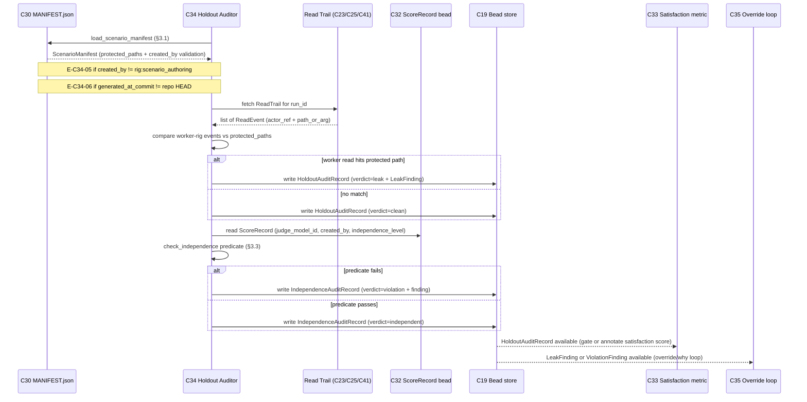

# C34 — Holdout integrity & isolation enforcement  (Spec, canonical track)

> Source: README §"Principle 5 — Scenarios as held-out test set" (L164–177: L166 "The agent **cannot see**
> them during work. An independent process evaluates whether work satisfies them"; the 4-row table —
> "Scenario storage with read-isolation" = "Prevents agent from reading scenarios during work" / "Separate
> git repo + file permissions + Gas City rig partition" (L171); **"Holdout integrity audit" = "Detects if
> isolation has been violated" / "Custom: log audit checking agent reads vs scenario paths" / "n/a (your
> work, small)"** (L173); placement summary L177 "Holdout enforcement is filesystem permissions +
> agent-prompt **discipline** + audit logging"); README §"Principle 6" (L189 "Cross-family enforcement —
> Judge must be a different model family than coder — Custom policy on the model stylesheet"); README §Phase 2
> (L425 "scenario storage: separate git repo + filesystem permissions enforcing read-only-from-implementer;
> **OPA policy for finer control later**"; L427 cross-family rule; L442 "the harder parts are … the
> **scenario isolation policy**"); AI-CONTEXT §3.3 (L100 "rig | agent worker role"); AI-CONTEXT §6.2 Layer-2
> capability table (L303 "Holdout isolation | None purpose-built | **DIY** | OPA + file permissions
> composition"; L304 "Cross-family enforcement | None | DIY | Custom model stylesheet rule"); AI-CONTEXT §7/§9.1
> (L394 "Holdout enforcement: ML training pipelines (sklearn train_test_split, MLflow experiment isolation)");
> AI-CONTEXT §13.3 (L582–608: the `[[rig]]` blocks `scenario_authoring`/`implementer` with
> `read_partition`/`write_partition`; the comment "explicitly does NOT include scenarios in read_partition";
> the `inspect_eval` tool node with `work_partition`); F-MODE-COVERAGE §1 (**F28 "Holdout leakage" →
> "Scenario storage with read-isolation (P5 component: file permissions + OPA + rig partition)" — "Addressed"**;
> F1 "held-out scenarios (P5)"; F27 "Circularity / same-model build+validate"; F46 "Single-model review
> blindspot"; **F48 "Tacit collusion via shared context → Cross-family judge + independence auditor" —
> "Partial — shared training distribution residual"**); F-MODE-COVERAGE §3 (F17 "Gas City worktree isolation
> per session (native); OPA policy on shared partitions" — "Addressed"); component-inventory C34 row (subsystem
> Evaluation & Judge; kind component; "Read-isolation policy (perms + OPA + rig partition) + after-the-fact
> audit; cross-family + independence **enforcement**"; maps A48/A48b/A48c/A54/A105/B53/B54; depends on **C30,
> C32**; gaps G10, G21, G08, G28; foundational: no; Batch 3); ambiguities-and-gaps **G10** (minor —
> "held-out" implies a guarantee the discipline-based mechanism doesn't provide), **G21** (major —
> holdout-integrity enforcement has no real mechanism; read-isolation is config + "discipline", audit is
> detect-after-the-fact), **G08** (major — "model family" undefined; cross-family enforcement vs single-Max
> floor in tension), **G28** (major — separate-repo / perms / rig-partition / OPA-later named for one boundary
> with no authority/composition statement); review-log **D-13** (CRITICAL — **C34 OWNS holdout-integrity
> ENFORCEMENT + after-the-fact AUDIT**: read-isolation policy, independence checks under D-1,
> `scenarios ∉ read_partition(worker)`; **C42 PROVIDES** the role partition C34 enforces; **C43** owns the
> distinct lethal-trifecta blast-radius bound, G31; **C30 STORES** scenarios in the isolated rig), **D-1**
> (judge = SAME provider/family as coder ⇒ holdout integrity + independence provided by **rig partitioning +
> prompt/role isolation, NOT model-family diversity**; cross-family relaxed → **FE-1**), **D-10** (judge
> independence expressed by the L0–L3 policy, not a registry field), **D-6** (canonical track), and the
> SURVIVOR-PASS ruling **OPA DROPPED** (C42-06 "no OPA in scope").
> Inventory ID: C34   Kind: component   Status: sweep-2
> Track: canonical
>
> **Binding decisions cited verbatim in this spec:**
> **D-13** — "C34 owns holdout-integrity ENFORCEMENT + after-the-fact AUDIT (read-isolation policy, independence checks under D-1, `scenarios ∉ read_partition(worker)`). C43 owns the distinct lethal-trifecta blast-radius bound (Bash/net/fs typing, twin isolation; G31). C42 PROVIDES the role partition C34 enforces; C42 does not enforce. Pre-constrains unbuilt C34 (Batch 3) + C43 (Batch 4)."
> **D-30** — "The operator re-adopts D-20 as conditional on prevention and adopts the auto-001 rubric: unattended operation (P2) and self-modification (P3b) require the substrate to BLOCK (prevent at the tool-call/process boundary) — not merely detect — out-of-boundary access on the relevant blast-radius face. Discharge: if Gas City does not prevent natively (per the D-23 spike), an enforcement watcher that blocks WILL be added — sanctioned in principle; its design is DEFERRED until the spike confirms the substrate does not already prevent. Until prevention is established (native or watcher), unattended operation is blocked (human-in-the-loop)."
> **D-38** — "Judge read-surface SHAPE = a separate judge rig (the D-17 joint C42/C34/C32 freeze). Per D-31 (multiple rigs per city) + D-17: the judge runs in a separate rig from the worker (worker rig + judge rig, co-resident in the city). The judge MAY read the worker's trajectory log + the held-out scenario partition; the worker MUST NOT read the judge rig or the scenarios (the holdout — C34 enforces+audits, C42 provides the partition); no shared context window."
> **D-1** — "implement the judge with the SAME provider/family as the coder for now; a different-provider judge moves to the future-enhancements bucket (FE-1). Impact: C29 cross-family rule becomes advisory/relaxed; C32/C34 build against same-provider judging with holdout-integrity provided by rig partitioning + prompt/role isolation rather than family diversity."

## 1. Purpose & responsibility

C34 is the **holdout-integrity enforcement + audit** component: it is the piece that makes Principle 5's
"the agent **cannot see** [the scenarios] during work" (README:166) and Principle 6's *independent*
evaluation real, by (a) **enforcing** the read-isolation policy that **C42 declares** — the holdout invariant
`scenarios ∉ read_partition(worker)` — and (b) running the **after-the-fact audit** that **detects if
isolation has been violated** (README:173, "log audit checking agent reads vs scenario paths") plus the
**independence check** that confirms the judge that scored a trajectory was role/prompt-isolated from the
worker that produced it. Per review-log **D-13** this is C34's explicit charter; C42 *provides* the
partition labels, C30 *stores* the scenario bytes in the isolated rig, and C34 is where the **enforcement
and the audit live**.

C34 is **load-bearing for the entire evaluation tier's integrity claim**. Per **D-1**, the judge runs on
the *same provider/family* as the coder (cross-family judging is deferred to **FE-1**), so the guarantee
"the implementer never read the scenarios it is judged on, and the judge that scored it is independent of
the coder" **cannot** rest on model-family diversity. It rests on exactly two things, and C34 enforces and
audits both: (1) **read-isolation** — the worker rig is policy-denied read of the `scenarios` partition
(C42's invariant, realized by file perms + repo separation), and C34 audits actual reads against the
scenario paths to catch any leak; and (2) **role/prompt isolation** — the worker, judge, and
scenario-author run as distinct rigs with distinct prompts and distinct partitions, and C34's
**independence check** verifies that the judge↔worker pairing for each scored trajectory honored that
separation. This is why C34 *enforces and audits* what C42 *declares* and C30 *stores*.

> [FAITHFUL-FILL] **C34's enforcement is "policy + perms + audit", not a new runtime control-plane.** Per
> the capability-for-principle bar, **OPA was DROPPED** (SURVIVOR-PASS C42-06 "no OPA in scope"), and v4
> states holdout enforcement is "filesystem permissions + agent-prompt **discipline** + audit logging"
> (README:177). The minimal faithful reading of C34's "enforcement" (inventory) is therefore: C34 **owns the
> read-isolation *policy*** (the invariant + the on-disk perms/repo realization that backs C42's partition
> labels) and **owns the after-the-fact *audit* + independence check** (the genuine custom KEEP — README:173
> calls it "custom, your work, small"). C34 does **not** introduce an OPA policy engine, a custom
> mandatory-access-control kernel, or a tool-call-time interceptor; preventing an out-of-partition read at
> *tool-call time* against a broad-tool-access worker is the residual that **C43's** lethal-trifecta
> blast-radius bound closes (G31, D-13), not C34's to build. C34's enforcement is "the policy is declared,
> realized on disk by perms+repo, and **verified after the fact**", which is exactly what v4 sanctions.

**Responsibilities**
- **Own the read-isolation policy (enforcement half, D-13).** C34 holds the holdout invariant
  `scenarios ∉ read_partition(worker)` as the enforced policy and its **on-disk realization** — filesystem
  permissions (read-only-from-implementer) + separate scenario git repo (README:171/425) backing C42's
  partition labels. C42 *declares* the partition; C34 is responsible that the declared policy is *realized
  and upheld* (perms set correctly, repo separated), and routes the residual tool-call-time prevention to
  C43 (G21/G31).
- **Own the holdout-integrity audit (audit half, D-13).** The genuine custom KEEP: a periodic / per-run
  **after-the-fact audit** that compares **actual agent reads vs scenario paths** (README:173) and raises a
  **holdout-leak finding** (a bead) when a worker-rig actor read inside the `scenarios` partition. This is
  *detection*, by v4's own design ("Detects if isolation has been violated", README:173).
- **Own the independence check (independence enforcement under D-1, D-13).** For each scored trajectory,
  verify that the **judge was role/prompt-isolated from the worker** — distinct rig, distinct prompt,
  distinct partition — so that "independently judged" (AI-CONTEXT:35) holds *by isolation* now that
  model-family diversity is deferred (D-1). Independence is asserted via the **rig/role separation**, not a
  registry field (D-10) and not model family (D-1).
- **Publish holdout-integrity status + findings.** Expose, per run / per scenario evaluation, a
  pass/violation status and the leak/independence findings as **beads** so the evaluation tier (C32/C33),
  the override loop, and the residual-risk register can consume them. C34's output is the observability
  surface for F28 ("Holdout leakage") and F48 ("Tacit collusion").
- **Consume C42's partition declaration and C30's scenario layout.** C34 reads C42's per-rig partition
  labels (the policy it enforces) and C30's scenario store layout / paths (what the audit compares reads
  against). It does not define partitions (C42) or store scenarios (C30).

**Explicitly NOT**
- **NOT the lethal-trifecta / isolation boundary (C43).** C43 owns the Bash/network/filesystem security
  posture and twin isolation that **bounds blast radius** when an agent has *broad tool access* (G31). That
  is a **distinct boundary** from holdout read-isolation: C43 closes the residual *tool-call-time*
  read-escape that broad tool access opens — the part neither C42's declaration nor C34's after-the-fact
  audit can themselves *prevent* (D-13). C34 **detects** a holdout leak after the fact; C43 **bounds** the
  broad-tool-access escape that makes such a leak physically possible. C34 does **not** absorb C43's
  lethal-trifecta job, and does **not** claim its audit prevents the read.
- **NOT the partition / role declaration (C42).** C42 declares the closed role set
  (worker/scenario-author/judge), the read/write partition model, and the holdout invariant labels; C34
  *enforces and audits against* those labels. The declaration is C42's; the **enforcement + audit is C34's**
  (D-13). C34 depends on C42 transitively (via C30); it consumes C42's partition labels.
- **NOT the scenario store (C30).** C30 owns the Inspect AI scenario DSL, the separate repo, and the
  scenario bytes authored in the isolated rig. C34 consumes C30's scenario *paths/layout* to know what the
  audit must protect; it does not author or store scenarios. (Inventory: C34 depends on C30.)
- **NOT the judge harness (C32) or the satisfaction metric (C33).** C32 *runs* the judge (scores
  trajectories); C33 aggregates the satisfaction distribution. C34 does not score or aggregate; it
  **verifies the judge↔worker independence** of the pairing C32 used. (Inventory: C34 depends on C32.)
- **NOT cross-family / cross-provider enforcement (relaxed by D-1 → FE-1).** v4 names "Cross-family
  enforcement — judge must be a different model family than coder" (README:189) as a model-stylesheet rule.
  Per **D-1** the judge is **same-provider/family** for now and cross-family/cross-provider enforcement is a
  **documented future enhancement (FE-1)**; the C29 model-stylesheet `family` rule is advisory/relaxed
  (G08). C34 therefore delivers independence by **isolation** (rig/role/prompt), not by enforcing a
  model-family difference. The cross-family hook is FE-1's seam, not C34's Phase-2 build. (See §6/G08.)
- **NOT a policy engine (OPA DROPPED).** The inventory one-liner and AI-CONTEXT §6.2 name "OPA + file
  permissions composition", but **OPA is out of scope** (SURVIVOR-PASS C42-06; README:425 defers OPA "for
  finer control **later**"). C34 enforces with **file perms + C42 partitions + after-the-fact audit**, not
  an OPA / Rego policy engine or a custom MAC layer. (See §4.3/§6/G28.)

## 2. Context & dependencies

| Direction | Component | Relationship |
|---|---|---|
| Upstream (declared dep) | **C30** Scenario authoring & store (read-isolation) | C30 stores the scenario bytes in the `scenarios` partition / `scenario_authoring` rig (separate repo + perms). C34 consumes C30's **scenario paths/layout** so the audit knows what reads to flag as leaks. Inventory: C34 `depends on C30`. |
| Upstream (declared dep) | **C32** LLM-as-judge harness | C32 runs the judge that scores a worker's trajectory. C34 consumes the **judge↔worker pairing** (which rig judged which run) to run the **independence check**. Inventory: C34 `depends on C32`. |
| Upstream (partition provider) | **C42** Rig / agent-role partitioning | > [FAITHFUL-FILL] — **transitive, not a directly declared inventory edge** (C34 `depends on` = C30, C32; C30 `depends on C42`). Per **D-13** C42 **provides** the role partition + holdout invariant labels (`scenarios ∉ read_partition(worker)`); C34 **enforces + audits** against them. C34 reads C42's published partition policy as the policy it upholds and audits. |
| Upstream (actor attribution + read trail) | **C41** Identity / actor model (+ event/telemetry trail) | > [FAITHFUL-FILL] — **not a declared inventory edge**; faithful fill. The after-the-fact audit needs, per actor, **which rig acted** — **C41** supplies the *actor attribution* (`created_by`) — joined to **what it read**: the *read/tool-call events themselves* (README:173 "agent reads") come from the **event/telemetry trail** (Gas City event bus C23 / OTLP raw bodies C25 / CXDB), **not** from C41. C34 consumes C41's attribution + the read trail; it defines neither. (Which source supplies the read trail, and whether it captures filesystem reads, is OQ-C34-2.) |
| Downstream (consumes findings) | **C33** Satisfaction metric · evaluation tier | A satisfaction score computed from a **leaked** or **non-independent** evaluation is suspect; C34's pass/violation status + findings gate or annotate the evaluation so a tainted score is not trusted. C34 publishes; C33 (and the operator) consume. |
| Downstream (residual-risk + blast-radius) | **C43** Isolation & lethal-trifecta boundary | **Distinct boundary (D-13).** C34 *detects* a holdout leak after the fact; the *tool-call-time prevention* of the broad-tool-access read-escape that makes the leak possible is **C43's** lethal-trifecta blast-radius bound (G31). C34 records the residual (G21) and routes it to C43; it does **not** build C43's isolation. |
| Downstream (override / why loop) | **C35** Override → pattern → rule loop | A holdout-leak or independence-violation finding is a candidate for the **override/why discipline** (operator override → "why" → recurring-pattern → new validation rule). C34's findings feed C35 as override/why candidates. |
| Downstream (residual-risk register) | **C57** Failure-mode coverage map & residual-risk register | C57 owns the honest **residual/caution register**; C34's status + the G10/G21 "verified-after-the-fact, not a hard guarantee" caveat are routed here so "held-out" is not over-trusted (G10). (C57 — not C35 — is the register owner per inventory.) |

C34 is **not foundational** (inventory: no) and is in **Batch 3** (the full scenario→judge→satisfaction
tier with isolation enforcement, built in parallel with C30/C31/C32/C33). It is **load-bearing for the
evaluation tier's integrity** even though it is not on the Batch-1 critical path: per **D-1**, there is *no*
model-family fallback, so the entire weight of "the implementer did not see the scenarios, and the judge is
independent" sits on the read-isolation C34 enforces+audits plus the role/prompt isolation C34's
independence check verifies.

## 3. Interfaces / contracts

**Sweep-2 — concrete signatures, schemas, and contracts added below. All Sweep-1 named interfaces are
preserved; each is now concretised with a function/method/type signature plus the OQ resolution status.**

**OQ-C34-3 RESOLVED (Sweep-2) — D-38:** Independence predicate is now fully specified (see §3.3 below).
The `judge` runs in a **separate rig** from the worker; the predicate asserts distinct rig + distinct
`created_by` actor identity + no overlapping read partition with the worker + no shared context window.
"No shared context window" is verified structurally: rig separation (distinct Gas City rig = distinct
agent instance) is the sole mechanism (D-38 "no shared context window"). Resolves the unified
OQ-C42-3 + OQ-C34-3 + C32-OQ5 (D-17/D-38 freeze).

**OQ-C34-2 — partial resolution (Sweep-2):** The audit sources are named (see §3.2 below). The complete
source set is: **C30 MANIFEST.json** (scenario paths/labels — the I6 feed), **C41 actor attribution**
(`created_by` wire form), and **Gas City event bus / OTLP trace (C23/C25)** for the tool-call/read
trail. Whether the trail captures *filesystem reads* beyond tool calls (needed to catch `cat
scenarios/…` via Bash) is still OQ-C34-2's open sub-question, gated on the D-23 spike (C43 closes the
broad-tool-access surface; until then the trail may miss raw Bash reads). OQ-C34-2 stays **OPEN** on
the completeness sub-question; the source is **named**.

1. **Read-isolation policy contract (enforcement half).** C34 holds the enforced holdout policy: the
   invariant `scenarios ∉ read_partition(worker)` (from C42) **plus** its on-disk realization — the
   filesystem permissions (read-only-from-implementer) and separate scenario repo (README:171/425) that
   back C42's partition labels. Named here: the **policy object** C34 owns and is responsible for keeping
   *realized* (perms correct, repo separated) and *auditable*. (Not an OPA policy — perms + partitions only;
   §4.3/G28.)
2. **Holdout-audit contract (audit half — the custom KEEP).** The named after-the-fact audit surface:
   given (a) the scenario paths (from C30 MANIFEST — §3.1 below) and (b) the per-actor read/tool-call trail
   (from Gas City event bus C23 / OTLP C25 / C41 attribution — §3.2 below), produce a **per-run / per-scenario
   holdout verdict** (`clean` | `leak`) and, on `leak`, the offending actor + rig + read path. v4 defines
   this as "log audit checking agent reads vs scenario paths" (README:173). This is **detection after the
   fact** by design (G10/G21). Concrete signature: §3.2.
3. **Independence-check contract (independence enforcement under D-1).** Given the judge↔worker pairing for
   a scored trajectory (from C32 `ScoreRecord` — §3.3 below), verify the **role/prompt isolation predicate**:
   (a) judge `created_by` ≠ worker `created_by`, (b) judge rig ≠ worker rig, (c) judge read-partition does
   not overlap `worker` read-partition, and (d) no shared context window (verified structurally via rig
   separation, D-38). **OQ-C34-3 RESOLVED** — see preamble above. Output: `independent` | `violation`.
   Per **D-1/D-10** independence is by **isolation**, not model family and not a registry field.
4. **Holdout-integrity status / findings feed.** The named surface C34 publishes downstream: per run /
   per scenario evaluation, a **status** (holdout `clean|leak`, independence `independent|violation`) and the
   **findings as beads** (leak finding, independence-violation finding) for C33 (gate/annotate the score),
   C35 (override/why loop), and the **C57** residual-risk register (G10 — so "held-out" is not over-trusted).
   Concrete finding schemas: §4.2 below.
5. **Residual-risk routing note (G21/G31 — not a frozen contract).** A one-line statement, mirrored to the
   register and to C43: against a **broad-tool-access** worker the holdout boundary is config + perms +
   **after-the-fact audit** (C34) — *not tool-call-time prevention*; the residual read-escape is closed by
   **C43's** lethal-trifecta blast-radius bound (G31), a **distinct** boundary from C34's audit (D-13). This
   is routing, not a partition-composition primitive.

**Invariants**
- **Holdout invariant (enforced + audited).** `scenarios ∉ read_partition(worker)` (C42's declaration).
  C34 is responsible that this is *realized on disk* (perms/repo) and *verified after the fact*; any audited
  worker-rig read inside the `scenarios` partition is a **leak** and must raise a finding. (This is the
  clause F28 "Holdout leakage" rests on.)
- **Independence-by-isolation invariant (D-1, D-38).** Every scored trajectory's judge must be role/prompt-
  isolated from its worker (distinct rig, created_by actor, partition, no shared context window). A judge
  sharing the worker's rig/prompt/context is an **independence violation**. Model-family difference is **not**
  required (D-1) and **not** asserted (FE-1).
- **Detect-after-the-fact-by-default (residual, faithful).** C34's audit + independence check are
  **detection**, not tool-call-time prevention (README:173 "Detects if isolation has been violated"; G21).
  Against a broad-tool-access worker, prevention of the out-of-partition read awaits C43 (G31). C34 records
  this so no downstream component over-trusts "held-out" (G10).
- **No-policy-engine invariant (bar).** C34 enforces with file perms + C42 partitions + audit only; an OPA
  / Rego engine or custom MAC layer is **out of scope** (SURVIVOR-PASS C42-06; README:425 OPA "later").

### 3.1 C30→C34 MANIFEST consumption seam (DEFERRED seam — now CLOSED)

> **CLOSED (Sweep-2):** The dispatch directed C34 to close the C30→C34 seam deferred from Sweep-1: how
> does C34 consume C30's scenario paths/labels for the audit?

**Mechanism chosen: C34 polls the C30 MANIFEST `created_by` field (manifest polling, not an out-of-band
event).** Rationale: C30's corpus manifest (`scenarios/MANIFEST.json`, frozen by C30 §3.3/§4.5) is the
authoritative, git-committed, machine-readable index of scenario paths. The manifest carries per-entry
`created_by = "rig:scenario_authoring"` (D-29 wire form) — C34 uses this field to verify authoring
identity (a scenario entry NOT authored by `"rig:scenario_authoring"` is a **wrong-authoring-identity
signal**, the E-C30-04 signal described in C30's OQ-1 note). An out-of-band event bus signal would add a
new dependency and require reliable event delivery; the manifest is already git-committed, immutable per
commit, and available to any reader with access to the scenario repo — the minimal faithful mechanism
(capability-for-principle bar: adopt what exists).

**Poll contract:**

```python
def load_scenario_manifest(
    manifest_path: str,             # repo-relative: "scenarios/MANIFEST.json"
    scenario_repo_root: str,        # absolute path to the separate scenario git repo
) -> ScenarioManifest:
    """Load C30's MANIFEST.json and validate it for audit use.

    Preconditions:
    - scenario_repo_root is the root of the SEPARATE scenario git repo (INV-1)
    - manifest_path file exists and parses as valid ScenarioManifest JSON

    Postconditions:
    - Returns ScenarioManifest with verified created_by = "rig:scenario_authoring" per entry
    - Raises E-C34-05 (wrong-authoring-identity) if any entry has an unexpected created_by
    - Raises E-C34-06 (manifest-stale) if generated_at_commit does not match repo HEAD SHA

    OQ-C34-2 note: the manifest provides the SCENARIO PATHS; the READ TRAIL that
    C34 compares against those paths comes from C23/C25/C41 (§3.2), not from the manifest.
    """
    ...
```

**E-C30-04 wrong-authoring-identity signal consumption:** C30's manifest entry `created_by` field is the
signal surface. C34 validates, on every manifest load, that every entry has `created_by ==
"rig:scenario_authoring"` (the D-29 wire form). If any entry deviates — indicating a scenario was
authored by an unexpected rig — C34 raises **E-C34-05** (wrong-authoring-identity; see §error-taxonomy
below) and treats the corpus as suspect until the entry is corrected by the `scenario_authoring` rig.
This is the *consumption mechanism* for C30's E-C30-04 signal: C34 polls the manifest, not a pushed
event. The signal is a manifest-level invariant, not a real-time bus message.

**Seam specification (C30→C34 path feed):**

| Seam element | Owner | Consumer | Wire form |
|---|---|---|---|
| Manifest file path | C30 (`scenarios/MANIFEST.json`) | C34 | git-tracked JSON file in separate repo |
| `task_path` field | C30 writes | C34 reads (audit protected paths) | repo-relative string |
| `created_by` field | C30 writes (`"rig:scenario_authoring"`) | C34 validates (E-C34-05) | D-29 `"kind:id"` string |
| `git_commit` field | C30 writes (per scenario commit SHA) | C34 verifies (baseline check) | SHA-1 string |
| `generated_at_commit` field | C30 writes (manifest HEAD SHA) | C34 verifies (staleness check, E-C34-06) | SHA-1 string |

**New seam named (→ orchestrator ledger):** This seam is now frozen. C34 reads C30's MANIFEST.json directly
from the separate scenario repo. No new event-bus dependency is introduced. The seam contract is:
`load_scenario_manifest(manifest_path, scenario_repo_root) → ScenarioManifest`.

### 3.2 Holdout-audit interface (Sweep-2 concrete signature)

```python
def run_holdout_audit(
    manifest: ScenarioManifest,         # loaded from C30 MANIFEST.json (§3.1)
    read_trail: ReadTrail,              # per-actor tool-call/read events (C23/C25/C41 — see below)
    run_id: str,                        # the factory run being audited
) -> HoldoutAuditResult:
    """After-the-fact audit: compare actual worker-rig reads against scenario paths.

    Sources of read_trail (OQ-C34-2 — partially resolved):
    - Gas City event bus (C23): tool-call events carrying actor + path/arg
    - OTLP trace data (C25): span attributes for tool invocations
    - C41 actor attribution: resolves "rig:worker-N" actor identity per event
    Completeness caveat (OQ-C34-2 OPEN): trail may miss raw filesystem reads (Bash `cat`
    etc.) until C43 constrains the broad-tool-access surface.

    Postconditions:
    - Returns HoldoutAuditResult with verdict=clean iff NO worker-rig read events
      touch any path in manifest.protected_paths()
    - On any worker-rig read matching a protected path: verdict=leak + LeakFinding bead
    - Any ambiguous event (actor unknown) → verdict=audit_trail_incomplete (E-C34-03)
    """
    ...

def protected_paths(manifest: ScenarioManifest) -> frozenset[str]:
    """Return the set of paths the audit must protect.
    = {entry.task_path for entry in manifest.entries}
    plus the scenarios/ subtree root for each component.
    """
    ...
```

**`ReadTrail` type:**

```python
@dataclass
class ReadEvent:
    actor_ref: str        # D-29 wire form "kind:id" (e.g. "rig:worker-1")
    tool_name: str        # tool/event name (e.g. "Read", "Bash", "inspect_eval")
    path_or_arg: str      # file path or command arg observed
    run_id: str
    timestamp: str        # ISO-8601 UTC

ReadTrail = list[ReadEvent]
```

**`HoldoutAuditResult` type:**

```python
@dataclass
class HoldoutAuditResult:
    run_id: str
    verdict: Literal["clean", "leak", "audit_trail_incomplete"]
    findings: list["LeakFinding"]    # empty if verdict==clean
    audited_at: str                  # ISO-8601 UTC
    trail_source: str                # which C23/C25 source was consulted
```

### 3.3 Independence-check interface (Sweep-2 concrete signature — OQ-C34-3 RESOLVED)

```python
def check_independence(
    score_record: ScoreRecord,   # C32's frozen schema (D-39): carries judge_model_id,
                                 #   independence_level, created_by, trajectory_ref
    worker_actor: str,           # actor_ref of the worker rig that produced the trajectory
                                 #   (D-29 wire form, e.g. "rig:worker-1")
    worker_partition: str,       # the worker's read_partition (from C42 config)
    judge_partition: str,        # the judge rig's read_partition (from C42 config, per D-38)
) -> IndependenceCheckResult:
    """Verify judge↔worker role/prompt isolation for a scored trajectory.

    Independence predicate (D-38, OQ-C34-3 RESOLVED):
    (a) score_record.created_by != worker_actor        — distinct actor identity
    (b) rig(score_record.created_by) != rig(worker_actor) — distinct rig
    (c) judge_partition does not contain worker_partition  — disjoint read surfaces
    (d) rig separation is structural (D-38: separate Gas City rig = separate agent
        instance = no shared context window)

    Per D-1: independence_level check validates against Phase-0 floor L1 (same-provider
    judging; L0 = no constraint; L1 = rig/role isolation; L2+ = cross-family, deferred FE-1).
    score_record.independence_level must be >= L1 or E-C34-02 is raised.

    Postconditions:
    - Returns IndependenceCheckResult with verdict=independent iff predicate (a)-(d) hold
    - On any predicate failure: verdict=violation + IndependenceViolationFinding bead
    """
    ...
```

**`IndependenceCheckResult` type:**

```python
@dataclass
class IndependenceCheckResult:
    score_record_id: str           # links back to the C32 ScoreRecord bead id
    verdict: Literal["independent", "violation"]
    violated_predicates: list[str] # e.g. ["same_rig", "overlapping_partition"]
    finding: Optional["IndependenceViolationFinding"]
    checked_at: str                # ISO-8601 UTC
```

**OQ-C34-4 forward seam (C29 cross-family signal — named, not resolved):** When FE-1 lands, C29 emits a
`cross_family_required` signal on the `IndependenceConstraint` it supplies to C32. The seam is:
**C34 will consume `score_record.independence_level` and, when `cross_family_required=True` (FE-1),
will additionally verify `judge_model_family != worker_model_family`** as a fifth predicate. Until FE-1
this predicate is skipped (D-1 — same provider). The seam name for this forward hook is
**`FE1_cross_family_gate`**; it is not built now. C29 emits the signal; C34 consumes it.
**OQ-C34-4 stays OPEN** (where enforcement lives — C34 vs C29 advisory — is FE-1's decision).

## 4. Data model / state

C34 owns **the read-isolation policy object, the audit/independence verdicts, and the findings** it raises.
It does **not** own the scenario bytes (C30), the partition labels (C42), the actor model or read-event
trail (C41/event source), or the satisfaction scores (C33).

### 4.1 Read-isolation policy object (the enforced policy)

| Field | Type | Req | Semantics | R/W-by |
|---|---|---|---|---|
| `holdout_invariant` | `string` (const) | R | `"scenarios ∉ read_partition(worker)"` — the enforced clause verbatim (AI-CONTEXT §13.3; D-13) | C34 declares; C42 provides backing |
| `protected_paths` | `frozenset[str]` | R | Set of repo-relative scenario paths loaded from C30 MANIFEST.json `task_path` entries; the audit guards these paths | C30 writes (manifest); C34 reads + enforces |
| `scenario_repo_root` | `string` | R | Absolute path to the separate scenario git repo (INV-1); where `scenarios/MANIFEST.json` lives | C34 config; backed by C42 rig `path` in `.gc/site.toml` |
| `scenarios_partition` | `string` | R | C42 partition label being protected (typically `"scenarios"`); from C42 rig config | C42 declares; C34 reads |
| `worker_rig_names` | `list[string]` | R | C42-declared implementer/worker rig names (e.g. `["worker-1"]`); actors from these rigs are the audit subjects | C42 declares; C34 reads |
| `manifest_head_commit` | `string` | R | The `generated_at_commit` SHA from last-loaded MANIFEST.json; baseline for staleness detection (E-C34-06) | C34 reads from manifest; compared to repo HEAD |
| `(deferred) OPA` | — | — | **out of scope** — DROPPED (SURVIVOR-PASS C42-06; README:425 "later") | — |

### 4.2 Audit / independence verdict + findings (the owned instance state)

> [FAITHFUL-FILL] **Findings are beads; verdicts are derived, not a new store.** v4 names the audit as
> "custom, your work, small" (README:173) and the inventory kind is `component`, not `data-store`. The
> minimal faithful choice is that C34 **derives** verdicts from existing sources (C30 paths, C41/event read
> trail, C32 pairing) and **raises findings as beads** in the existing bead work-graph (C19/C20) — it does
> **not** stand up a new persistence store. The concrete bead types are registered in the C20 schema
> registry under the `softwarefactory.v4.beads` bundle (D-2).

**`HoldoutAuditRecord` bead schema** (bead type: `softwarefactory.v4.beads:holdout_audit_record`):

| Field | Type | Req | Semantics | R/W-by |
|---|---|---|---|---|
| `run_id` | `string` | R | Factory run being audited; links to the `factory_build` bead | C34 writes; C33/C35/C57 read |
| `manifest_commit` | `string` (SHA-1) | R | `generated_at_commit` of the MANIFEST.json used for this audit; the corpus version | C34 writes; C57 audits |
| `verdict` | `enum{clean, leak, audit_trail_incomplete}` | R | `clean` = no worker-rig read inside `scenarios` partition; `leak` = at least one such read detected; `audit_trail_incomplete` = trail had unknown-actor events (E-C34-03) | C34 writes; C33 gates; C35/C57 read |
| `findings` | `list[LeakFinding]` | R | Empty list if `verdict=clean`; one `LeakFinding` per detected leak event | C34 writes; C35 override-loop; C57 register |
| `trail_source` | `string` | R | Which C23/C25 event source was consulted (e.g. `"c23_event_bus"`, `"c25_otlp"`) | C34 writes; C57 reads (completeness note) |
| `trail_completeness_caveat` | `string` | R | Fixed text: `"audit_trail_may_miss_raw_filesystem_reads_pending_C43"` (OQ-C34-2 detect-only caveat) | C34 writes always; C57 registers as residual |
| `audited_at` | `timestamp` | R | UTC timestamp of the audit run | C34 writes; C33/C57 read |
| `created_by` | `string` | R | `"rig:c34-auditor"` D-29 wire form | C34 writes via C41; all read |

**`LeakFinding` sub-schema** (embedded in `holdout_audit_record.findings`):

| Field | Type | Req | Semantics | R/W-by |
|---|---|---|---|---|
| `actor_ref` | `string` | R | D-29 `"kind:id"` string of the offending actor (e.g. `"rig:worker-1"`) | C34 writes; C35/C57 read |
| `rig_name` | `string` | R | The worker rig name extracted from `actor_ref` | C34 writes; C35/C57 read |
| `read_path` | `string` | R | The scenario path (repo-relative) that was read (matches a manifest `task_path` entry) | C34 writes; C35/C57 read |
| `event_id` | `string` | O | The C23 `EventId` (`{stream, seq}` — D-26 wire form) of the offending read event, if available | C34 writes; C57 trace-back |
| `tool_name` | `string` | R | The tool/event name that triggered the read (e.g. `"Read"`, `"Bash"`) | C34 writes; C57 read |
| `timestamp` | `timestamp` | R | UTC timestamp of the offending read event | C34 writes; C35/C57 read |

**`IndependenceAuditRecord` bead schema** (bead type: `softwarefactory.v4.beads:independence_audit_record`):

| Field | Type | Req | Semantics | R/W-by |
|---|---|---|---|---|
| `score_record_id` | `string` (bead_id) | R | Reference to the C32 `ScoreRecord` bead being audited (D-39 schema) | C34 writes; C33/C35 read |
| `worker_actor` | `string` | R | D-29 `"rig:worker-N"` wire form of the worker that produced the trajectory | C34 writes; C35 reads |
| `judge_actor` | `string` | R | D-29 `"rig:judge-N"` wire form from `score_record.created_by` | C34 writes; C35 reads |
| `verdict` | `enum{independent, violation}` | R | `independent` = all four predicate clauses satisfied; `violation` = at least one failed | C34 writes; C33 gates score; C35/C57 read |
| `violated_predicates` | `list[string]` | R | Empty if `independent`; list of failed predicate names e.g. `["same_rig", "overlapping_partition"]` | C34 writes; C35/C57 diagnose |
| `independence_level_used` | `enum{L0,L1,L2,L3}` | R | The `independence_level` from the `ScoreRecord` (Phase-0 = `L1`; D-1) | C34 reads from C32; writes to audit record |
| `cross_family_gate` | `enum{skipped_FE1, passed, failed}` | R | `skipped_FE1` until FE-1 lands (D-1); FE-1 forward seam `FE1_cross_family_gate` (§3.3) | C34 writes; C29/FE-1 seam |
| `finding` | `IndependenceViolationFinding` | O | Present only on `verdict=violation` | C34 writes; C35 override-loop |
| `audited_at` | `timestamp` | R | UTC timestamp of the check | C34 writes |
| `created_by` | `string` | R | `"rig:c34-auditor"` D-29 wire form | C34 writes via C41 |

**`IndependenceViolationFinding` sub-schema** (embedded in `independence_audit_record.finding`):

| Field | Type | Req | Semantics | R/W-by |
|---|---|---|---|---|
| `judge_actor` | `string` | R | The judge actor that failed the predicate | C34 writes; C35/C57 read |
| `worker_actor` | `string` | R | The worker actor it was matched against | C34 writes; C35/C57 read |
| `violation_type` | `string` | R | One of: `"same_rig"`, `"same_actor"`, `"overlapping_partition"`, `"independence_level_below_floor"` | C34 writes; C35 diagnose |
| `score_record_id` | `string` | R | The C32 ScoreRecord whose score is suspect | C34 writes; C33 gates |

### 4.3 Which mechanism is authoritative (G28) — sweep-1 note, not a composition primitive

> **Scope note (capability-for-principle bar).** This answers G28 with a *one-line authority statement* from
> C34's enforcement vantage; it is deliberately **not** a formal partition-composition stack (the
> "composition order" delta was dropped for C42, and **OPA is out of scope**). The table is *explanatory*,
> not a binding composition contract.

v4 names mechanisms for the one holdout boundary: **(a)** separate scenario git repo (README:171/425),
**(b)** filesystem permissions / read-only-from-implementer (README:171/425), **(c)** Gas City rig
`read_partition` excluding `scenarios` (AI-CONTEXT §13.3), **(d)** OPA "for finer control **later**"
(README:425 — **DROPPED**, SURVIVOR-PASS C42-06). From C34's vantage:

| Layer | Mechanism | Role today | Owner |
|---|---|---|---|
| declaration | rig `read_partition` excludes `scenarios` | the authoritative **policy declaration** (the partition is the unit) | **C42** (provides) |
| realization | filesystem perms (read-only-from-implementer) + separate repo | the **on-disk realization** C34 keeps correct | **C34** (enforces) |
| verification | after-the-fact **audit** (reads vs scenario paths) + **independence check** | **detection** that the policy held | **C34** (audits) |
| blast-radius | lethal-trifecta / broad-tool-access bound | bounds the residual tool-call-time read-escape (G31) | **C43** (distinct) |
| (deferred) | OPA policy engine | **out of scope** (DROPPED; "later") | — |

Authority note (one line, G28): the **rig `read_partition` (C42) is the authoritative declarative policy**;
**C34 realizes it on disk (perms+repo) and verifies it after the fact (audit + independence)**; the residual
broad-tool-access blast-radius bound is **C43's** (G31); **OPA is dropped**. This is the smallest faithful
resolution of G28 from C34's side — an authority statement, not a composition stack (see §6).

### 4.4 Persistence & consistency

C34 holds **no new store**. The policy object is config/derived (from C42 labels + C30 paths + on-disk
perms); verdicts are derived per run; findings are **beads** in the existing work-graph (C19/C20). C34's
only consistency requirement is that **every worker-rig read inside `scenarios` produces a leak finding**
and **every scored trajectory gets an independence verdict** — i.e., the audit is *complete over the read
trail* and *complete over the scored set* (faithful: whether the read trail is complete enough to make the
audit sound is OQ-C34-2 / G21, since a broad-tool-access worker may read by a path the trail does not
capture until C43 lands).

## 5. Behavior

C34's behavior is **enforcement-setup** (definitional/config) + an **after-the-fact audit loop**:

- **Policy-realization time (enforcement).** C34 takes C42's declared partition labels + C30's scenario
  layout and is responsible that the **on-disk realization is correct** — scenario repo separated, perms
  read-only-from-implementer (README:171/425). A misconfigured realization (worker can read scenario paths
  on disk despite the declared partition) is itself a holdout-integrity defect C34 surfaces.
- **Manifest-load time (C30→C34 seam, §3.1).** C34 polls `scenarios/MANIFEST.json` from the separate
  scenario repo (C30's I6 feed). It validates `created_by = "rig:scenario_authoring"` per entry (E-C34-05
  on deviation), verifies `generated_at_commit == repo HEAD SHA` (E-C34-06 on staleness), and builds the
  `protected_paths` set for the audit.
- **Audit time (the custom KEEP — detection).** Periodically and/or per run, C34 reads the per-actor
  read/tool-call trail (C23/C25/C41) and compares it against the `protected_paths` (from the manifest):
  any worker-rig read matching a protected path → **leak finding** + `verdict=leak` (README:173). Unknown-
  actor events → `verdict=audit_trail_incomplete` (E-C34-03). This is detection after the fact.
- **Independence-check time (per scored trajectory).** When C32 produces a `ScoreRecord` bead, C34 checks
  the four-predicate independence check (§3.3): distinct actor, distinct rig, disjoint partition, no shared
  context (structural rig separation, D-38). On violation: `IndependenceViolationFinding` bead.
- **Publish time.** C34 writes `HoldoutAuditRecord` + `IndependenceAuditRecord` beads to C19 (the work-
  graph), consumable by C33 (gate/annotate the score), C35 (override/why), and the C57 residual register.

### 5.1 Sequence diagram — holdout audit + independence check (Sweep-2)



## 6. Failure modes & handling

### 6.1 Error taxonomy (E-codes, Sweep-2)

| E-code | Condition | Surfaced-as | Caller recovery |
|---|---|---|---|
| **E-C34-01** | **Holdout-leak-detected** — a worker-rig read event matched a protected scenario path in the manifest | `HoldoutAuditRecord.verdict = "leak"` + `LeakFinding` bead written to C19; downstream C33 MUST NOT trust the satisfaction score for this run | C35 override/why loop picks up the LeakFinding bead; operator reviews; C57 register records residual |
| **E-C34-02** | **Independence-violation** — judge↔worker independence predicate failed (same rig, same actor, overlapping partition, or independence_level below floor L1) | `IndependenceAuditRecord.verdict = "violation"` + `IndependenceViolationFinding` bead written to C19; C33 gates the suspect `ScoreRecord` | C35 override/why loop; operator reviews the pairing; the tainted `ScoreRecord` is flagged but not deleted |
| **E-C34-03** | **Audit-trail-incomplete** — one or more read-trail events have an unknown actor (cannot confirm worker vs non-worker rig) | `HoldoutAuditRecord.verdict = "audit_trail_incomplete"`; audit is inconclusive for this run | C57 register: record as caveat (G21 residual); wait for C43 broad-tool-access bound before trusting clean verdicts on these runs |
| **E-C34-04** | **Independence-predicate-unconfigured** — judge_partition or worker_partition is unknown/missing from C42 config at check time | `IndependenceAuditRecord.verdict = "violation"` (fail-loud on unknown partition) + `violation_type = "independence_level_below_floor"` | Operator must supply C42 partition config; C34 cannot run the check without it |
| **E-C34-05** | **Wrong-authoring-identity** — a MANIFEST.json entry has `created_by != "rig:scenario_authoring"` (E-C30-04 consumption seam, §3.1) | Manifest load raises `E-C34-05`; corpus is treated as suspect; no audit proceeds against the suspect manifest version | Scenario-authoring rig must recommit the entry with the correct `created_by`; operator reviews the commit history |
| **E-C34-06** | **Manifest-stale** — `generated_at_commit` in MANIFEST.json does not match the scenario repo HEAD SHA (corpus has been updated without regenerating the manifest) | Manifest load raises `E-C34-06`; `protected_paths` from a stale manifest may be incomplete | `scenario_authoring` rig must regenerate and commit an updated MANIFEST.json |

### 6.2 Failure-mode table (F-modes / gaps)

| F-mode / gap | Relevance | Handling in C34 (faithful) |
|---|---|---|
| **F28** Holdout leakage (F-MODE §1, "Addressed") | The implementer reading the scenarios it is judged on. | **Addressed-on-paper / detect-after-the-fact** (lead with the caveat): C34 enforces the read-isolation policy (perms/repo realizing C42's `scenarios ∉ read_partition(worker)`) and runs the **after-the-fact audit** (reads vs scenario paths, README:173) that raises a **leak finding**. *Caveat (G21):* the audit **detects**, it does not **prevent**; against a broad-tool-access worker the tool-call-time read-escape is open until **C43** (G31). Per **D-1** there is no model-family fallback, so this caveat is load-bearing — downstream (C33, C35, residual register) must lift the *status* (clean/leak + the detect-only caveat), not the bare "Addressed". |
| **F48** Tacit collusion via shared context (F-MODE §1, **"Partial — shared training distribution residual"**) | A same-provider judge colluding with / sharing context with the coder. | **Partial (faithful — matches F-MODE).** C34's **independence check** verifies judge↔worker **role/prompt isolation** (distinct rig/prompt/partition today) so collusion via a shared *rig/prompt/partition* is caught (D-1: independence by isolation); detection of a shared *context window* specifically is pending the predicate definition (OQ-C34-3). The **shared-training-distribution** residual is *inherent* to same-provider judging (D-1) and is **explicitly deferred to FE-1** (cross-family) — C34 cannot close it without a different family. Surfaced as residual, not silently absorbed. |
| **F1 / F27 / F46** Hallucination loop / same-model build+validate circularity / single-model review blindspot (F-MODE §1, "Addressed") | All rest partly on judge **independence**. | **Independence-by-isolation (faithful, D-1).** v4's named mechanism for the independence these rest on is partly *cross-family* enforcement (F48 pairs it with an independence auditor); per **D-1** cross-family is relaxed (FE-1), so C34 delivers the independence these rely on via **rig/role/prompt isolation** (the independence check), not model family. The residual model-family dimension is **FE-1** (recorded, G08). |
| **G21** Holdout enforcement has no real mechanism (major) | Read-isolation is perms + config + "discipline"; the audit detects, not prevents. | **Resolved-per-D-13 (ownership) + recorded residual.** C34 **owns** the enforcement (policy realization) + **audit** (D-13); the audit is **detection** (README:173). The residual *tool-call-time prevention* against a broad-tool-access worker is **C43's** lethal-trifecta blast-radius bound (G31) — a **distinct** boundary, not C34's to build. C34 records the residual and routes it to C43 + the register. *(The substrate sub-question — does Gas City prevent the out-of-partition read at tool-call time, or only permit-with-review so C34 detects — is OQ-C34-1, the **G21** enforcement-strength gap, gated on **G11**-class `gc` availability to answer.)* |
| **G08** "Model family" undefined; cross-family vs single-Max floor in tension (major) | C34's inventory names "cross-family + independence enforcement"; the family rule is unbuildable under same-Max. | **Relaxed by D-1 → FE-1 (faithful).** C34 delivers **independence by isolation** (rig/role/prompt), not by enforcing a model-family difference. The C29 model-stylesheet `family` rule is advisory/relaxed; cross-family/cross-provider enforcement = **FE-1** (judge sourcing + family difference). C34 does **not** block on a second-provider credential v4 says Max does not issue (AI-CONTEXT §4.1). Recorded, not silently dropped. |
| **G10** "held-out" overstates a discipline-based guarantee (minor) | The term implies a hard guarantee the mechanism lacks. | **Acknowledged + surfaced.** C34 states the boundary is config + perms + **after-the-fact audit** (detect, not prevent) until C43 — so "held-out" is *policy intent verified after the fact*, not a hard guarantee. C34's **status feed** carries this caveat to the **C57** residual-risk register so downstream does not over-trust it. |
| **G28** Several mechanisms, no authority statement (major) | Separate repo / perms / rig `read_partition` / OPA-later named for one boundary. | **Resolved (faithful)** by the §4.3 one-line authority note (not a composition stack; OPA dropped): rig `read_partition` (C42) is the authoritative declaration; **C34 realizes it on disk + verifies after the fact**; the blast-radius bound is C43's. |
| **F17** Parallel agents on shared dirs lose data (F-MODE §3, "Addressed") | Adjacent isolation mode. | **Not C34 (owner: C42/C04 worktree isolation, native).** Listed only to retire the F-MODE §3 "OPA policy on shared partitions" pairing: **OPA is dropped** (SURVIVOR-PASS C42-06), so no C34 (or C42) OPA policy backs F17 — the only live F17 mechanism is the native worktree-per-run isolation owned by C42/C04. |
| **F31 (lethal-trifecta) / blast radius (G31, C43)** | The broad-tool-access escape that makes a leak physically possible. | **Deferred to C43 (faithful — not C34's to build, D-13).** C43 owns the lethal-trifecta blast-radius bound — a **distinct** boundary from C34's holdout audit. C34 *detects* the leak; C43 *bounds* the escape. C34 does not absorb C43's job. |

> [AMBIGUITY: G21] **Is C34's holdout enforcement a tool-call-time control, or a config + perms +
> detect-after-the-fact arrangement?**
> Reading A (faithful-literal — config + perms + detect): README:177 says holdout enforcement is "filesystem
> permissions + agent-prompt **discipline** + audit logging"; README:173 makes the holdout-integrity audit a
> *detector* ("Detects if isolation has been violated"); README:425 defers OPA "for finer control later"
> (and OPA is **dropped**, SURVIVOR-PASS C42-06). On this reading C34 realizes the policy on disk
> (perms+repo) and **catches a violation after the fact** via the audit + independence check; the
> broad-tool-access worker subprocess (Bash/Read) is not *prevented* from an out-of-partition read at
> tool-call time before C43.
> Reading B (security-consistent — should be a hard control): a detect-only boundary is not real holdout
> *enforcement*; F28 is "Addressed" on a mechanism that only detects, and with **D-1** removing the
> model-family fallback this single detect-only layer is the *sole* thing standing between the implementer
> and the scenarios.
> **Pick: Reading A for the mechanism C34 builds, with Reading B surfaced as named residual risk.** Canonical
> faithfulness is binding: v4 says "discipline + audit logging" and "OPA … later" in plain words
> (README:177/425), and **OPA is dropped** — so C34 **cannot** make the boundary a hard tool-call-time
> control. Per **D-13** C34 *owns the enforcement (policy realization) + the audit*, and *bounding the
> residual broad-tool-access escape is C43's* lethal-trifecta blast-radius bound (a distinct boundary). The
> smallest faithful build is therefore: (1) realize + own the read-isolation policy (perms/repo backing
> C42's invariant), (2) run the after-the-fact audit + independence check (the custom KEEP), (3) publish
> findings + the detect-only caveat, (4) route the tool-call-time prevention residual to **C43** (G31). The
> remaining "does Gas City actively prevent vs. permit-with-detect" substrate question is **OQ-C34-1**
> (needs the real `gc` binary, G11).

> [AMBIGUITY: G08] **What does C34's "cross-family + independence enforcement" mean once the judge is
> same-provider (D-1)?**
> Reading A (literal cross-family): the inventory and README:189 say the judge "must be a different model
> family than coder", enforced by a model-stylesheet rule — so C34 enforces a *family difference*.
> Reading B (independence-by-isolation, D-1): "model family" is undefined (G08) and a different-*family*
> judge implies a second provider/API key Max does not issue (AI-CONTEXT §4.1); **D-1** settles that the
> judge is same-provider for now and cross-family is **FE-1**, with holdout integrity + independence
> delivered by **rig partitioning + prompt/role isolation**.
> **Pick: Reading B (binding per D-1/D-10).** C34 delivers **independence by isolation** — the independence
> check over judge↔worker rig/role/prompt separation — not by enforcing a model-family difference, and does
> not assert an `independence_class` registry field (D-10). The cross-family/cross-provider rule is relaxed
> to advisory (C29) and the family-difference enforcement is **FE-1**. The residual shared-training-
> distribution risk (F48 "Partial") is inherent to same-provider judging and explicitly deferred — C34
> records it, it does not close it.

## 7. Cross-cutting (security / cost / scale / observability / ops)

- **Security (the central concern).** C34 is the **enforcement + audit** half of the holdout-integrity
  model and, per **D-1**, the load-bearing verifier now that model-family diversity is deferred (FE-1). It
  owns the read-isolation policy realization (perms/repo backing C42's `scenarios ∉ read_partition(worker)`)
  and the after-the-fact audit + independence check. It guarantees the policy is **realized and verified**;
  it does **not** prevent an out-of-partition read at tool-call time — that residual is **C43's**
  lethal-trifecta blast-radius bound (G21, G31). This detect-only posture is the load-bearing caveat on
  F28's "Addressed" and is surfaced to C33, C35, C43, and the residual-risk register. **No OPA / policy
  engine / custom MAC** (SURVIVOR-PASS C42-06).
- **Cost.** The audit is cheap — "custom, your work, **small**" (README:173): a log/read-trail scan vs
  scenario paths + a per-trajectory isolation predicate. No policy-engine runtime cost (OPA dropped). Cost
  scales with the read-trail volume and the scored-trajectory count (C33's population), not with a new
  service.
- **Scale.** No new store; findings are beads (C19/C20), verdicts are derived. The audit is a periodic /
  per-run batch over the read trail; at L5 scenario volume (G13) the audit's input is the event/read trail,
  whose scale story is C23/C25/C41's, not C34's. C34 adds no new scale concern beyond keeping the audit
  complete over that trail.
- **Observability.** C34's **status + findings feed *is* the observability surface for F28 (holdout
  leakage) and F48 (collusion)** — it is what makes "held-out" auditable (README:173). It also depends on
  observability: the audit's soundness rests on the read-trail completeness (OQ-C34-2 / G21).
- **Ops.** The read-isolation policy (perms + repo separation) is set at scenario-store provisioning
  (C30/Phase-2) and kept under git review; enabling cross-family (FE-1) later is an additive
  model-stylesheet rule at C29, not a C34 migration. Enabling OPA is **not** planned (dropped). The audit
  runs as a pack tool node (README:177 "Gas City pack").

## 8. Acceptance criteria & test strategy

1. **Read-isolation policy realized + invariant enforced (F28)**: for a configured factory, the scenario
   store is separated (repo + perms read-only-from-implementer) realizing C42's
   `scenarios ∉ read_partition(worker)`; a realization in which the worker rig *can* read scenario paths on
   disk despite the declared partition is a **holdout-integrity defect** C34 surfaces. *(Whether Gas City
   prevents the read at tool-call time or only permits-with-detect is OQ-C34-1, the **G21** gap gated on
   **G11**-class `gc` availability; the prevention of the broad-tool-access escape is C43's, D-13.)*
2. **Holdout audit detects a leak (the custom KEEP, README:173)**: given a read trail in which a worker-rig
   actor read inside the `scenarios` partition, C34's after-the-fact audit produces a **`leak` verdict** and
   a leak finding (actor + rig + read path); given a clean trail, a `clean` verdict. The audit is
   **detection**, not prevention (the test records this, G21).
3. **Independence check verifies isolation (D-1)**: for a scored trajectory whose judge ran as a distinct
   `judge` rig with a distinct prompt/partition, C34 yields `independent`; for one where the judge shared the
   worker's rig/prompt/context, `violation` + an independence finding. Independence is asserted by
   **isolation**, not model family (D-1) and not a registry field (D-10).
4. **Cross-family relaxed, recorded (G08)**: C34 does **not** block on a second-provider judge credential
   and does **not** enforce a model-family difference; the family-difference rule is advisory (C29) and the
   cross-family enforcement is documented as **FE-1**. The F48 shared-training-distribution residual is
   surfaced as "Partial", not silently absorbed.
5. **Status + findings feed present (downstream seam)**: C34 publishes, per run / per scenario evaluation,
   a holdout `clean|leak` + independence `independent|violation` status and the findings as beads, consumable
   by C33 (gate/annotate the score), C35 (override/why), and the residual-risk register.
6. **G28 authority note + G10 caveat explicit (one line, not a composition stack)**: the v4-named mechanisms
   are documented with rig `read_partition` (C42) named the authoritative declaration, C34's perms/repo
   realization + after-the-fact audit named the verification, OPA documented as **dropped**, and the
   blast-radius bound identified as C43's — so downstream (C30, C42, C43, C57) know what is authoritative and
   what is deferred, and that "held-out" is verified-after-the-fact (G10).
7. **Residual-risk routing discoverable (G21/G31)**: downstream consumers of the holdout guarantee (C33,
   C35, C42, C57) can discover that, against a broad-tool-access worker, the boundary is config + perms +
   **detect-after-the-fact audit** until C43's lethal-trifecta bound lands, so they do not over-trust
   "held-out".
8. **No policy-engine / OPA over-build (bar)**: C34 contains **no OPA / Rego engine, no custom MAC kernel,
   no tool-call-time interceptor**; enforcement is file perms + C42 partitions + the after-the-fact audit
   only (SURVIVOR-PASS C42-06; README:425).

(Concrete audit-record schema, leak-finding / independence-finding bead types, the read-event source
contract, and the isolation-predicate definition are sweep-2 deliverables — and for the *prevention* path,
are deliverables of C43, not C34's default build.)

## 9. Open questions

- **OQ-C34-1** (→ review-log): **Does Gas City *prevent* the worker's out-of-partition read at tool-call
  time, or only permit-with-detect so C34's audit catches it after the fact? (the **G21** enforcement-
  strength gap, gated on **G11**-class `gc` availability; top open question).**
  This is the load-bearing security fact for C34: v4 says "filesystem permissions + agent-prompt
  **discipline** + audit logging" (README:177) and the audit is a *detector* (README:173). Per **D-13**
  *ownership* is settled — C34 owns enforcement + audit, the broad-tool-access blast-radius bound is C43's,
  C42 provides the partition — but the substrate fact (prevent vs permit-with-detect) is the **G21** gap and
  cannot be settled without verifying the real `gc` binary (**G11**). Per **D-1** there is no model-family
  fallback, so this single boundary carries the whole holdout guarantee.
  **OPEN — D-23 spike (see below):** The D-23 harvest confirmed prefix is the bead-scoping MECHANISM but
  explicitly did NOT resolve whether `gc` PREVENTS out-of-prefix access or merely scopes-by-convention.
  This OQ remains the D-23 spike target.
- **OQ-C34-2** (→ review-log): **Is the read/tool-call trail complete enough to make the audit sound?** The
  after-the-fact audit (README:173) compares "agent reads vs scenario paths"; its soundness depends on the
  read trail capturing *every* way a broad-tool-access worker (Bash, Read) could touch scenario bytes. Which
  source supplies the trail (Gas City event bus / OTLP raw bodies / CXDB / C41 attribution) and whether it
  captures filesystem reads (not just tool invocations) is open — a worker could read by a path the trail
  misses until C43 isolation constrains the surface (G21). Confirm the read-event source + completeness.
- **OQ-C34-3** (→ review-log; **judge read-surface scoped by D-17**): **What is the independence predicate,
  exactly, for a same-provider judge (D-1)?** Independence is by isolation (rig/role/prompt), but the precise
  predicate — distinct rig + distinct prompt + partition distinct from the worker + no shared context window —
  needs definition, including the judge's partition (this is also C42's OQ-C42-3: is the judge a third
  partition, or does it read `code` + scenario *outputs* role-isolated from the worker?). **Per D-17:** the
  Sweep-1 read-default is fixed (judge MAY read trajectories + scenarios; worker MUST NOT read the judge rig or
  scenarios), and the exact **partition SHAPE** is the **unified OQ-C42-3 + OQ-C34-3 + C32-OQ5**, frozen
  **jointly by C42 (provides) + C34 (enforces+audits) + C32 (judge) at Sweep-2**. Confirm with C42/C32.
- **OQ-C34-4** (→ review-log / FE-1): **When cross-family (FE-1) lands, does the family-difference check
  move into C34 or stay advisory in C29?** Today (D-1) it is relaxed to C29's advisory model-stylesheet
  rule. If FE-1 makes a different-family judge real, confirm whether the *enforcement* of the family
  difference becomes a C34 independence-check dimension or remains a C29 routing rule.

**[D-30 ADOPTED 2026-06-01 — prevent/block required for unattended]**

C34's holdout enforcement is bound by this decision: under a detect-only substrate, holdout integrity is guarded by detection + a human gate until prevention (native or watcher) is established.

> The operator has adopted the auto-001 rubric and re-adopted D-20 as **conditional on prevention**: unattended operation (P2) and self-modification (P3b) require the substrate to **BLOCK (prevent at the tool-call/process boundary)** — not merely detect — out-of-boundary access on the relevant blast-radius face. **Discharge:** if Gas City does not prevent natively (per the [D-23 spike](../_meta/D-23-gas-city-spike-protocol.md)), an **enforcement watcher that blocks WILL be added** (sanctioned in principle); its **design is DEFERRED until the spike confirms the substrate does not already prevent** — do not design what we may not need, and the watcher's design must still pass the bar when built. Until prevention is established (native or watcher), unattended operation is **blocked** (human-in-the-loop). The per-rig-class "structurally-safe parts may run unattended" optimization remains available but secondary. See the [auto-001 decision brief](../_meta/decisions/auto-001-detect-only-binding-gate.md) and review-log D-30.

---

**[D-23 substrate-verified — gascity-prototype@b14c278, 2026-05-25]**

**F10 — Bead prefix IS the scoping mechanism; explicit `prefix=` required to avoid collision; prevent-vs-detect OPEN (NEW-INFO operational caveat):**
Verified against the Gas City prototype (lago-morph/gascity-prototype@b14c278, 2026-05-25):
**Bead scope is implemented as bead prefix.** Prefixes `gp-` (city HQ), `r1-` (rig1), `r2-`
(rig2) are the real scoping mechanism — agents scoped to rig1 see/write only `r1-` prefixed
beads. **Operational constraint:** rig names `rig1` and `rig2` both auto-derive prefix `"ri"` and
collide at startup; explicit `prefix = "r1"` and `prefix = "r2"` in `city.toml` are required.

**OPEN — prevent-vs-detect (C34:OQ-C34-1 / D-23 spike):** The prototype proved that prefix is
the MECHANISM for scoping. It did NOT verify whether `gc` PREVENTS an out-of-prefix bead access
at the tool-call level or merely scopes-by-convention with detect-after-the-fact. The end-to-end
smoke test (which would test this path) was deferred. This boundary remains the D-23 spike target
and must NOT be treated as resolved by this harvest.
