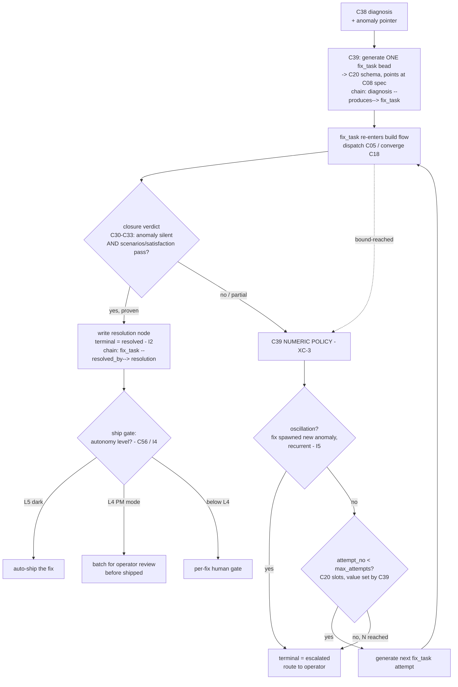

# C39 — Fix-task generation & loop-closure (`fix-task-loop-closure`)  (Spec, canonical track)

> Source: README §"Principle 11 — Self-healing loop" (lines 246–261 — the 8-row component table: *Fix-task generation* → "Diagnosis → bead | Custom: diagnosis agent writes bead of type `fix_task` | n/a (your work) | Native bead writing"; *Loop closure tracking* → "Did the fix actually fix it? | Custom bead chain: anomaly → diagnosis → fix → resolution | n/a (your work, small) | Bead schema"; line 248 "Observability → anomaly → diagnosis → fix → ship, without human intervention"); README §"Phase 3b — P11 components" (lines 459–466 — "Fix-task bead schema", "Loop closure tracking pack", "Each piece is a separate factory build, separately reviewed, separately deployed"); README §autonomy ladder (lines 77–90: L0 manual → L5 dark; line 90 "the self-healing loop catches and fixes what breaks"; line 527 "No commitment to L5 autonomy on day one … can run at L4 (PM mode … batched review) for as long as needed. L5 is the natural endpoint, not a precondition"); AI-CONTEXT §3.2 concept #9 ("Health Patrol (Controller + Convergence) | Per-tick reconciler; bounded convergence with gates | P4, P11 (partial)"), §Layer-4 table (lines 321–335 — "Fix-task generation | None | DIY | Small custom"; "Loop closure tracking | None | DIY | Small custom — bead schema"; "Healer governance | OPA | Apache 2.0 | Mature"); F-MODE-COVERAGE §3 (Layer-4 F-modes F4/F7/F22/F23/F24/F40/F57), §8 (F52 "more controller patches" caution, line 100), §11/§12 (line 178 "Plan an F54 audit pack … escalation on detected drift"). Companion specs: [`spec/C20-bead-schema.md`](./C20-bead-schema.md) (owns the boundable schema slots — D-3/XC-3), [`spec/C18-reconciler-convergence.md`](./C18-reconciler-convergence.md) (owns the bounded loop + emits **bound-reached** — XC-3), [`spec/C08-spec-artifact.md`](./C08-spec-artifact.md) (the spec a fix must satisfy — "fix the spec, not the output"), [`spec/C35-override-why-loop.md`](./C35-override-why-loop.md) (the sibling control-loop; same bead-chain idiom, different trigger).
> Inventory ID: C39   Kind: control-loop   Status: sweep-1
> Maps from: A58, A58b, B36, B37. Depends on: C38 (diagnosis agent), C20 (bead schema), C08 (spec artifact). Key gaps: G18, G35.
> Binding decisions obeyed: **D-6** (single canonical track; no dual-track framing). **D-3** (C20 *authors* the `fix_task` / closure-chain bead schema + the boundable slots; C39 *writes* those beads and owns the *numeric policy* over the slots, not the schema). **CRITICAL — XC-3 / D-3:** **C39 OWNS the G18 numeric termination policy** that C16 and C18 explicitly routed here (N-attempts → escalate, F52 oscillation detection, L5 ship-authorization), realized on **C20's** descriptive bounded-bead slots (attempt-count / max-attempts / escalated / chain-closure). C18 supplies the bounded loop + the bound-reached signal; **C08 supplies the spec the fix must satisfy.**

## 1. Purpose & responsibility

C39 is the **fix-task generation + loop-closure control-loop** (P11): the mechanism that takes a **diagnosis** (from C38, the Healer) and (1) **generates a `fix_task` bead that re-enters the build flow**, (2) **tracks the bead chain `anomaly → diagnosis → fix → resolution` so the system can answer "did the fix actually fix it?"**, and (3) **enforces a termination/escalation contract** so the heal loop is *bounded* — it stops after N attempts, detects oscillation (a fix that spawns a new anomaly), and never silently auto-ships a fix beyond the autonomy level the operator has authorized.

This is the genuine custom P11 capability v4 calls out twice as "your work" — *Fix-task generation* ("Diagnosis → bead … Custom", README:257) and *Loop closure tracking* ("Did the fix actually fix it? … Custom bead chain … your work, small", README:259) — and which AI-CONTEXT rates "None / DIY / Small custom" for both (AI-CONTEXT:332, :334). It is the **closing arc** of the self-heal loop: C36 detects an anomaly, C37 clusters it, C38 diagnoses it, and **C39 turns that diagnosis into a unit of repair work and proves (or disproves) that the repair worked, with a bound on how long it tries.**

The reason C39 is more than "write a bead" is **G18** (blocker): README:248 states the loop runs "Observability → anomaly → diagnosis → fix → **ship, without human intervention**" but gives *no* bound — no attempt limit, no oscillation guard, no statement of who authorizes a Healer-generated fix to ship at L5. That is precisely the F52 "more controller patches" trap the docs themselves warn about (F-MODE-COVERAGE §8). C39 is the component that closes G18 by **defining the numeric termination/escalation policy** over the boundable slots C20 provides (D-3/XC-3).

**Responsibilities**
- **Fix-task generation.** Translate a C38 diagnosis into one `fix_task` bead (C20's schema, D-3), carrying a pointer back to the diagnosis/anomaly that produced it and a pointer to the **C08 spec the fix must satisfy** (Principle 1: the fix is a *spec* change, not an output patch — README:102; C08 §5 / AC-5). The `fix_task` re-enters the build flow (it is dispatched and converged like any other work bead).
- **Loop-closure tracking.** Advance the v4-named closure chain `anomaly → diagnosis → fix_task → resolution` (README:259; C20 §4.3) node by node, and **write the `resolution` node only when the fix is proven** — proof = the originating anomaly no longer fires and the relevant scenarios/satisfaction (C30–C33) pass on the rebuilt artifact. The existence of a `resolution` with a positive verdict *is* loop closure ("did the fix actually fix it?").
- **Termination / escalation contract (the G18 policy — C39's owned numeric duty).** Define and enforce: (a) **N-attempts-then-escalate** — after a bounded number of fix attempts for the same anomaly without a positive `resolution`, mark the chain `escalated` and hand off to a human (operator) rather than spawning attempt N+1; (b) **oscillation / F52 detection** — recognize when a fix *closes* one anomaly but *opens* a new one in a way that recurs (a heal cycle that feeds itself), and escalate rather than patch further; (c) **L5 ship-authorization** — gate whether a fix may ship *without human review* on the operator's declared autonomy level (C56 L0–L5): at L4 (PM mode) a fix's promotion to "shipped" is **batched for human review**; only at L5 (dark) may closure auto-ship — and even then the escalation/oscillation bounds still hold.
- **Bound-reached consumer.** Receive C18's **bound-reached** signal (C18 §3.2; XC-3) when a single convergence pass for a `fix_task` exhausts its injected bound, and apply the numeric policy (count it toward N, test for oscillation, escalate or authorize) — i.e. C39 is the **policy owner that consumes C18's loop-level signal**.

**Explicitly NOT**
- NOT the **bead schema author.** The `fix_task` payload, the closure-chain edges, and the *slots* the bound is expressed in (attempt-count / max-attempts / escalated / chain-closure) are **C20's** (D-3; C20 §4.2–4.3, §3 contract 5). C39 **writes** those fields and **sets the policy values**; it does not define the schema. A needed new field is a change request to C20, not a local extension.
- NOT the **diagnosis.** Root-cause analysis over clustered failures is **C38** (the Healer; README:256). C39 *consumes* a diagnosis and *generates* the fix task from it; it does not diagnose.
- NOT the **anomaly detector / clusterer.** C36 (PyOD numeric anomaly) and C37 (embedding + HDBSCAN clustering) produce the `anomaly` that heads the chain; C39 reads the anomaly pointer, it does not detect or cluster.
- NOT the **convergence loop / scheduler.** The per-tick bounded reconciler that *runs* a `fix_task` toward desired state is **C18** (Gas City Health Patrol, Native; C18 §1). C18 owns *that a bound exists per pass* and emits **bound-reached**; **C39 owns the numeric policy** (N, oscillation, authorization) over that signal (XC-3). C39 does not reimplement the loop or the tick.
- NOT the **dispatcher.** Routing the `fix_task` to an agent/pool is **C05** sling; C39 creates the bead, the existing dispatch machinery runs it.
- NOT the **durable-workflow engine.** Crash/retry-surviving orchestration of the heal flow is **C40** Orders (D-8). An Order may *drive* a C39 chain (C40 §OQ-4 launch seam), but C39 owns the *policy and the chain semantics*, not durability.
- NOT the **scenario/judge/satisfaction tier.** Whether the rebuilt artifact actually satisfies is computed by C30–C33 (scenarios → judge → satisfaction). C39 *reads their verdict* to decide whether to write `resolution`; it does not run scenarios or judge.
- NOT the **autonomy ladder itself.** The L0–L5 maturity scale and *which* level the factory is operating at is **C56** (G15/G35). C39 *reads the current authorized level* and gates ship-authorization on it; it does not define or set the ladder.
- NOT a **self-authorizing shipper.** C39 cannot grant itself authority to ship a fix beyond the operator's declared autonomy level — the L5-ship gate is the whole point of the G35 disposition (§6, §9).

## 2. Context & dependencies

| Direction | Component | Relationship (v4 source) |
|---|---|---|
| Upstream (depends on) | **C38** Diagnosis agent (Healer) | Produces the `diagnosis` (root cause over clustered failures, README:256) that C39 turns into a `fix_task`. Hard inventory dependency (`Depends on: C38`). C39 reads the diagnosis + its anomaly pointer; it does not diagnose. |
| Upstream (depends on) | **C20** Bead schema registry | **Authors** (D-3) the `fix_task` type, the closure-chain edges, and the boundable slots (attempt-count / max-attempts / escalated / chain-closure — C20 §3 contract 5, §4.3). C39 writes those beads and **owns the numeric policy over the slots**. Hard inventory dependency (`Depends on: C20`). |
| Upstream (depends on) | **C08** Spec artifact | The `fix_task` targets a **spec** change (Principle 1: "fix the spec, not the output", README:102; C08 §5 / AC-5 names C39 as the loop-closure driver). C39 points the fix at the C08 spec it must satisfy. Hard inventory dependency (`Depends on: C08`). |
| Lateral (owns the loop) | **C18** Reconciler / Health Patrol | C18 runs the bounded convergence pass for a `fix_task` and emits **bound-reached** (C18 §3.2, OQ-1); **C39 owns the numeric policy** (N / oscillation / authorization) and *consumes* that signal (XC-3). C18 §2 lists C39 as "Policy boundary (owns the numbers)". The bound C18 enforces per pass is *injected by C39*. |
| Upstream (anomaly source) | **C36 / C37** anomaly detection / clustering | Produce the `anomaly` that heads the chain (PyOD numeric, C36; embedding+HDBSCAN clusters, C37 — README:253–255). C39 reads the anomaly pointer carried through the diagnosis. |
| Lateral (closure verdict) | **C30–C33** scenarios / runner / judge / satisfaction | Supply the **pass/fail verdict** on the rebuilt artifact that lets C39 decide whether to write `resolution` ("did the fix actually fix it?", README:259). C39 reads their verdict; it does not run them. |
| Downstream (autonomy bound) | **C56** Autonomy ladder (L0–L5) | Declares the current authorized autonomy level; C39 gates **L5 ship-authorization** on it (L4 = batched review, L5 = dark/auto-ship; README:90/527). G35 ties the fix-authorization bound to C56's ladder. C56 is **not** a hard inventory dependency of C39 (the inventory lists C38/C20/C08); the C39↔C56 tie is the G35 disposition seam (§6, OQ-3). |
| Lateral (durable driver) | **C40** Durable Orders | An Order may *launch/retry* a C39 heal chain across crashes (C40 §OQ-4 launch seam — C40's faithful inference). C39 owns the chain semantics + policy; C40 owns durability. |
| Sibling (idiom, not dependency) | **C35** Override→pattern→rule loop | Shares the bead-chain idiom and the "no auto-promote without a human gate" posture (C35 I4 / F52), but C35 reacts to *operator overrides* while C39 reacts to *anomalies/failures*. Distinct triggers; not a dependency. |

C39 sits in the **Self-Healing Loop** subsystem and is **not foundational** (inventory: Foundational? = no). It is a **Batch-4** component (the "self-healing + bootstrap mechanics" wave; component-inventory L113), depending on Batch-1 C20 + C08 and the earlier-batch C38. The inventory critical-path note #2 frames G18 as a blocker at the **C20 schema** layer ("`override`/`fix_task`/… types … G17/G18 make this a blocker until defined"); C39 is the component that closes G18's *policy* layer over those slots (XC-3), so the self-heal tier's termination bound is not complete until C39 defines the policy.

## 3. Interfaces / contracts

Sweep-1: interfaces **named + described**. Concrete bead-field signatures, the diagnosis→fix_task mapping schema, the resolution-verdict payload, and the numeric-policy parameter shapes are deferred to sweep 2.

### 3.1 Inbound

1. **Diagnosis-intake contract (C38 → C39).** A completed `diagnosis` (root cause + the anomaly/cluster it explains, README:256). Precondition: a diagnosis bead exists with a pointer to its originating `anomaly` (C36/C37). Postcondition: C39 has enough to generate exactly one `fix_task` (the diagnosis identifies *what to fix*; C39 decides *the repair work bead*).
2. **Closure-verdict contract (C30–C33 → C39).** The pass/fail verdict on the rebuilt artifact after a `fix_task` ran — the scenarios/satisfaction result that answers "did the fix actually fix it?" (README:259). Precondition: the `fix_task` ran and a rebuild produced an artifact the judge/satisfaction tier scored. Postcondition: C39 can decide whether to write a positive `resolution`, count another attempt, or escalate.
3. **Bound-reached signal (C18 → C39).** When a single convergence pass for a `fix_task` exhausts its injected bound without converging, C18 emits **bound-reached** (C18 §3.2). C39 applies the numeric policy to it (count toward N, test oscillation, escalate/authorize). C39 *injects* the per-pass bound C18 enforces (XC-3).
4. **Current-autonomy-level read (C56 → C39).** The operator's declared autonomy level (L0–L5; C56). C39 reads it to gate ship-authorization (§3.2 contract 7). Sweep-1: named; the read mechanism (config in C03 vs a C56 query) is sweep-2.

### 3.2 Outbound

5. **Fix-task-generation contract (C39 → C20 store / C05 dispatch).** C39 writes **one `fix_task` bead** per actionable diagnosis using **C20's** schema (D-3): a pointer to the diagnosis/anomaly that produced it, a pointer to the **C08 spec** the fix must satisfy, the `created_by` attribution (C41), and the chain link `diagnosis ──produces──▶ fix_task` (C20 §4.3). The bead re-enters the build flow via the normal dispatch path (C05) and converges under C18. **Invariant: every actionable diagnosis yields exactly one open `fix_task` chained to its diagnosis — no fix is generated that is not traceable to a diagnosis (I1).**
6. **Loop-closure / resolution contract (C39 → C20 store).** When the closure verdict (contract 2) is positive, C39 writes the `resolution` node closing the chain `fix_task ──resolved_by──▶ resolution` (C20 §4.3) and sets the terminal-state slot to `resolved`. **Invariant: a `resolution` is written only on a proven fix (the originating anomaly no longer fires AND the relevant scenarios/satisfaction pass); an unproven or partial fix does not silently close the chain (I2).**
7. **Termination / escalation policy enforcement (C39 — the G18 numeric duty).** C39 sets the bound C18 enforces and applies the policy on each bound-reached / failed verdict:
   - **N-attempts-then-escalate.** Maintain the attempt count (C20's attempt-count slot — illustrated as `attempt_no` in XC-3) against the max-attempts slot (`max_attempts` in XC-3; value set by C39 policy); on the Nth failed attempt for the same anomaly, set the terminal state to `escalated` (C20's escalation slot) and route to the operator instead of generating attempt N+1. **(Field identifiers `attempt_no`/`max_attempts` are XC-3-illustrative; C20's spec defines these descriptively and defers the concrete identifiers to its sweep-2 — see RC39-01 / OQ1. C39 writes whatever C20 freezes.)**
   - **Oscillation / F52 detection.** Detect when a `resolution` for one anomaly is followed (recurrently) by a *new* anomaly attributable to that fix — a self-feeding heal cycle — and escalate rather than continue patching (the "more controller patches" guard, F-MODE-COVERAGE §8).
   - **L5 ship-authorization.** Gate whether a proven fix ships *without human review* on the current autonomy level (contract 4): at **L4** the closed chain is **batched for operator review** before "shipped"; at **L5** closure may auto-ship; below L4 each ship is per-fix-gated. **Invariant: C39 never ships a fix above the operator's declared autonomy level (I4).**
   - **Output:** the terminal state on every chain is exactly one of `resolved` | `escalated` | `abandoned` (C20's terminal-state enum) — **no heal chain is left open-ended (I3).**
8. **Per-pass bound injection (C39 → C18).** C39 supplies the numeric bound C18 enforces per convergence pass (`max_attempts` / per-pass limit; XC-3). C18 enforces the value; C39 owns it.

> [FAITHFUL-FILL] **The G18 numeric policy is C39's required invention; v4 states the loop but not the bound.** README:248 ("ship, without human intervention") and README:259 ("Custom bead chain … did the fix actually fix it?") describe the loop and the closure *question* but give **no** attempt limit, **no** oscillation rule, and **no** ship-authorization predicate. G18 (blocker) names exactly this absence ("how many fix attempts before escalation, what happens when the Healer's fix *creates* a new anomaly (oscillation), or who authorizes a Healer-generated fix to ship at L5"). The minimal faithful elaboration is therefore that C39 **defines the policy's *shape*** — N-attempts→escalate, oscillation→escalate, ship-gated-on-autonomy-level — over C20's existing boundable slots (D-3/XC-3), while leaving the **concrete numeric values** (what N is; the oscillation recurrence window; the exact L4-vs-L5 batching cadence) as **operator/integrator policy parameters set at sweep-2**, because v4 states no numbers and the F52 guard is "explicit discipline … reviewed monthly" (F-MODE-COVERAGE:100), i.e. a tunable policy, not a hard-coded constant. This invents no new *mechanism* beyond what G18 demands and routes the values to config; it is the smallest closure of a blocker that XC-3 explicitly assigns here. See the §6 G18 disposition.

### 3.3 Invariants

- **I1 (traceable generation).** Every `fix_task` C39 writes is chained to the `diagnosis` (and through it the `anomaly`) that produced it — no untraceable fix (faithful to "Custom bead chain: anomaly → diagnosis → fix → resolution", README:259).
- **I2 (proof-gated closure).** A `resolution` is written **only** when the fix is proven (originating anomaly silent AND scenarios/satisfaction pass, C30–C33); an unproven fix never closes the chain. This is the operational meaning of "did the fix actually fix it?" (README:259).
- **I3 (bounded termination).** Every heal chain reaches exactly one terminal state `resolved | escalated | abandoned` within the policy bound — no chain runs unboundedly. This is the G18 closure at the policy level (the loop level is C18 INV-2).
- **I4 (autonomy-bounded ship).** C39 ships a fix without human review **only** at the autonomy level the operator authorizes (L5 dark); at L4 ship is batched-for-review; it never self-escalates its own authority (G35; README:527).
- **I5 (no oscillation runaway).** A fix that recurrently spawns a new anomaly is escalated, not patched further — C39 cannot feed itself indefinitely (F52; F-MODE-COVERAGE §8).
- **I6 (schema deference, D-3).** C39 writes only the fields C20's schema declares and sets policy *values* into C20's boundable slots; it never defines or extends the schema (a new field is a C20 change request).

## 4. Data model / state

C39 owns **almost no durable state of its own**; like C35 and C18 it is a control-loop over state owned elsewhere (C20 schema in the C19 store). Its genuine owned artifact is **the policy** (the numeric parameters + the decision logic), which is configuration + code, not a persistent store.

| State | Owner | C39's relationship |
|---|---|---|
| `fix_task` / `diagnosis` / `anomaly` / `resolution` beads + closure-chain edges | **C20** schema / **C19** store | C39 **writes and advances** them; owns neither the schema (D-3) nor the ledger. |
| Boundable slots: attempt-count / max-attempts / escalated / chain-closure (terminal state) | **C20** schema | C39 **reads and writes the values** and **owns the policy** that decides them (XC-3); C20 owns the *slots*. |
| `created_by` attribution on every fix/resolution bead | **C41** | Stamped by the identity layer; C39 supplies the actor context. |
| Per-pass convergence bound (the injected limit) | **C39 policy** (enforced by **C18**) | C39 **sets** it; C18 enforces it per pass (XC-3). |
| Numeric policy parameters (N / oscillation window / L4-vs-L5 cadence) | **C39 policy** (carried in **C03** config) | C39's **two genuine pieces of owned policy** — the termination/escalation numbers and the ship-authorization predicate — are config + decision code, not a persistent store. |
| Current autonomy level (L0–L5) | **C56** | Read-only input to the ship gate; C39 does not own the ladder. |
| Closure verdict (scenarios/satisfaction pass-fail) | **C30–C33** | Read-only input to the resolution decision; transient to a closure cycle. |

The loop is otherwise **stateless between runs** — its durable memory *is* the C20 closure chain in C19 (attempt counts, terminal states, and the resolution node persist on the beads, not in a C39-local store). This mirrors C18 INV-4 and C35 §4: the policy is the only thing C39 adds, and it is config + code over native state.

## 5. Behavior

**The loop (one anomaly → resolution-or-escalation cycle):**

Key flow notes:
- **Generate (synchronous with diagnosis).** On a completed C38 diagnosis, C39 writes **one** `fix_task` chained to the diagnosis, pointing at the **C08 spec** to change (fix-the-spec, not the output — README:102). *(I1.)*
- **Re-enter the build flow.** The `fix_task` is dispatched (C05) and converged (C18) like any work bead — C39 does not run the loop; it injects the bound C18 enforces (XC-3).
- **Decide closure (proof-gated).** When the rebuilt artifact has a verdict (C30–C33), C39 writes `resolution` **only** if the fix is proven (anomaly silent AND scenarios/satisfaction pass). *(I2.)*
- **Apply the numeric policy (C39's owned G18 duty).** On a failed/partial verdict or a C18 bound-reached signal, C39: tests **oscillation** (a recurrent fix→new-anomaly cycle → escalate, I5); else checks **N-attempts** (`attempt_no` vs `max_attempts` — escalate on the Nth failure rather than spawn N+1, I3); else generates the next attempt. Every chain ends in exactly one of `resolved | escalated | abandoned`. *(I3, I5; XC-3.)*
- **Gate the ship (autonomy-bounded).** A proven `resolution` ships **without human review only at L5**; at **L4** it is batched for operator review; below L4 each ship is per-fix-gated. C39 reads the level from C56; it never self-escalates authority. *(I4; G35; README:527.)*

**Cadence:** generation (step 1) is **synchronous** with a diagnosis; closure/policy (steps 3–4) are **driven by the convergence verdict + C18's bound-reached signal** (event-driven, not per-tick — C18 owns the tick). The ship gate (step 5) fires once per *proven* resolution. C39 is therefore the **policy layer riding C18's loop**: it acts on verdicts and bounds, not on every tick.

> [FAITHFUL-FILL] v4 gives C39 as two README table rows (fix-task generation; loop-closure tracking) + a Phase-3b deliverable list ("Fix-task bead schema", "Loop closure tracking pack") and the one-line loop "anomaly → diagnosis → fix → ship" (README:248). The numbered sequence above is the minimal faithful assembly of exactly those rows plus the G18-required bound (XC-3), in the order README:248/259 states them. No step is invented beyond the termination/escalation/ship-gate that G18 *requires* and XC-3 *assigns here*; the closure-proof condition (anomaly-silent + scenarios-pass) is the operational reading of README:259's literal question "did the fix actually fix it?".

## 6. Failure modes & handling

| F-mode / gap | Applies how | v4 handling (faithful) |
|---|---|---|
| **F52** Tempting-Wrong-Hybrid ("more controller patches" / oscillation) | A Healer fix that creates a new anomaly spawns another fix, unboundedly — the self-modifying-control trap the docs name for exactly this loop. | **Directly addressed by C39's policy** — I5 oscillation detection escalates a recurrent fix→new-anomaly cycle rather than patching further; I3 caps total attempts at N then escalates. The F52 explicit discipline ("no guard without a falsifying scenario … reviewed monthly", F-MODE-COVERAGE:100) is honored by routing the policy *values* to operator-reviewed config (§3.2 [FAITHFUL-FILL]). C39 is the component that turns the F52 *caution* into an enforced bound. |
| **F4** Code-quality teardown / **F7** normalization of deviance | A fix could degrade quality, or repeated "successful" closures could drift the acceptance bar. | **C39's contribution is partial** (source status: F4 "Partial", F7 "Addressed" — F-MODE-COVERAGE §3) — closure is proof-gated on scenarios/satisfaction (C30–C33, I2), so a fix that lowers quality should fail the verdict and not close; baselining against scenarios is the C30–C34 duty. C39's own contribution is refusing to write `resolution` without a positive verdict; it does not itself baseline the acceptance bar. |
| **F22** Zombie agents / **F23** stalled-vs-thinking | A `fix_task`'s convergence pass stalls. | **Addressed (F-MODE-COVERAGE §3)** at the loop level — C18's bounded pass emits **bound-reached**, and C39 counts it toward N / escalates rather than hanging. C39 turns a stalled pass into a bounded, escalatable event. |
| **F40** Last-mile drift | A fix never quite ships; the chain lingers. | **Partial (F-MODE-COVERAGE:47, "need explicit shipping definition")** — C39's terminal-state invariant (I3) forces every chain to `resolved`/`escalated`/`abandoned`, so a lingering fix is escalated rather than left open. "Shipping" definition itself is the C30–C33/C56 boundary. |
| **F54** Goal subversion over cycles (RSI / objective drift) | A self-modifying factory that auto-ships its own fixes (P11 at L5) could drift objectives — F-MODE-COVERAGE §11/§12 names this the *weakest* v4 mechanism, guard = a Phase-3+ "audit pack" with "escalation on detected drift" (F-MODE-COVERAGE:178). | **G35 disposition (§9):** C39 **bounds the autonomy of auto-ship** (I4 — ship-without-review only at L5; batched review at L4) and **escalates on oscillation/N** (I3/I5), which are the C39-local guards. The broader multi-cycle goal-drift audit pack is **C56/C57's** scope (autonomy ladder + residual-risk register), **noted and deferred** here as the architecture-level owner, not redesigned in C39. |

> [AMBIGUITY: G18] **Does the self-heal loop have a termination bound at all — and where does it live?**
> Reading A (no bound): README:248 states the loop runs "Observability → anomaly → diagnosis → fix → **ship, without human intervention**" and describes the closure chain (README:259) purely as a *data lineage* with no attempt limit, no oscillation rule, no ship gate. On this reading the loop is unbounded — exactly the F52 "more controller patches" trap the docs themselves warn about (F-MODE-COVERAGE §8; G18 §51).
> Reading B (bounded): G18 (blocker) and the F52 caution require a *bound*. C20 (D-3/XC-3) already provides the **slots** a bound is expressed in (attempt-count / max-attempts / escalated / chain-closure); C18 already provides the **bounded loop + bound-reached signal**; what is missing is the **numeric policy over those slots**.
> **Pick: Reading B, and C39 OWNS the policy (XC-3 assigns it here).** C39 closes G18 by defining the termination/escalation contract — **N-attempts→escalate, oscillation→escalate, ship-gated-on-autonomy-level** — over C20's slots, consuming C18's bound-reached signal. C39 sets the policy's *shape* (the three rules + the terminal-state invariant I3) at sweep-1; the concrete *values* (the N, the oscillation recurrence window, the L4/L5 batching cadence) are **operator/integrator policy parameters** set at sweep-2 (config, per F-MODE-COVERAGE:100's "reviewed monthly" discipline — a tunable policy, not a constant). This is the smallest consistent closure of the blocker: it makes the loop bounded and escalatable without inventing a mechanism beyond what G18 demands, and it is the ownership XC-3 (and C16:OQ-G18, C18:OQ-1, C20:OQ-C20-1) explicitly route to C39. **G18 is closed here at the policy layer** (C20 closed the schema-slot layer; C18 closed the loop-bound layer).

**Loop-specific failure handling:**
- **Diagnosis with no actionable fix.** If a C38 diagnosis identifies a root cause that is not auto-fixable (e.g. an external dependency, or a values decision), C39 does **not** fabricate a `fix_task`; it escalates (terminal `escalated`) — I1 holds (no untraceable/spurious fix) and the chain still terminates (I3).
- **Closure verdict unavailable / flaky.** If the scenarios/satisfaction tier cannot return a verdict (e.g. judge unavailable), C39 treats the attempt as *unproven* (does not write `resolution`, I2) and applies the bound (count toward N / escalate) rather than optimistically closing — fail-closed on closure.
- **Oscillation vs legitimate iterative fix.** A single fix→new-anomaly transition is *not* oscillation (legitimate iterative repair); C39 escalates only on a **recurrent** self-feeding cycle (I5). The exact recurrence window is a sweep-2 policy value.
- **Autonomy-level downgrade mid-flight.** If the operator lowers the autonomy level while a chain is open, the ship gate re-reads the current level at ship time (contract 4) — a fix that *would* auto-ship at L5 is batched at L4, never shipped above the now-current level (I4).

## 7. Cross-cutting (security / cost / scale / observability / ops)

- **Security (the load-bearing concern for C39).** C39 is the component that can **cause production change without a human** (auto-ship at L5). Its security posture is I4 (autonomy-bounded ship) + the L5 gate: a fix never ships above the operator's declared autonomy level, and the ladder (C56) — not C39 — sets that level. Every fix/resolution bead carries `created_by` (C41) so an auto-shipped fix is attributable and non-repudiable (modulo the optional-signing gap G36/FE-3, owned elsewhere). The **F54 RSI/goal-drift** residual (the weakest v4 mechanism, F-MODE-COVERAGE §11) is bounded locally by I3/I5 and deferred at the architecture level to C56/C57's audit-pack scope (G35, §6). `Healer governance | OPA` (AI-CONTEXT:335) is the v4-named place a policy *gate* would be enforced; C39's authorization predicate is the policy OPA (or equivalent) would carry — **policy named, enforcement engine deferred to sweep-2** (G11: OPA wiring unverified).
- **Cost.** The policy itself is cheap (a decision over bead counters + a verdict read — no extra model call). The cost driver is *attempt volume*: each fix attempt re-runs the build + scenarios/judge (C28/C30–C33 token cost), so the N-attempts bound (I3) is *also* a cost control — capping attempts caps the heal loop's spend. No second model seat. (The judge/scenario token cost is C32/C33's, accounted there; G13/G32 cost-model is C46's.)
- **Scale.** Heal chains are produced at *anomaly* frequency (failure events), not trajectory volume — low relative to CXDB. The store/query scale trivially; the scale concern is bounding *concurrent open chains* and *attempt fan-out*, which I3 (N-cap) directly limits.
- **Observability.** C39's actions (fix generated, attempt counted, resolution written, chain escalated) are beads + native event-bus appends (C23) → visible in the same stores it feeds. The typed closure chain *is* the audit trail for "did the fix work?" (P11 loop-closure; C20 §7). An escalation is a first-class, queryable terminal state, not a log line.
- **Ops.** C39 is **pack-shaped + policy-config** — the loop-closure pack (README:464 "Loop closure tracking pack") + the numeric policy in C03 config (N / oscillation window / L4-L5 cadence). Tuning the bound is a **config change**, not a redeploy; the per-pass bound it injects into C18 is the same parameter. No Go fork (the closure pack is a tool-node/agent pack, AI-CONTEXT:332/334 "Small custom").

**What the capability-bar dropped (non-principle polish / what the stack already does):**
- The **bounded convergence loop + tick scheduler** → that is **C18 / Gas City Health Patrol, Native** (C18 §1); C39 owns the *policy over the loop*, not the loop. Re-implementing the loop would be flagged and dropped.
- The **bead schema / chain-edge definitions / boundable slots** → **C20's** (D-3); C39 owns the *values + policy*, not the schema.
- A **bespoke durable-workflow engine** for crash-surviving heal orchestration → **C40 Orders** (D-8); C39 owns the chain semantics, not durability.
- A **custom anomaly detector / clusterer / diagnoser** → C36/C37/C38; C39 consumes their output.
- A **standalone resolution-verdict / scoring engine** → C30–C33; C39 reads the verdict.
- A **bespoke OPA-equivalent governance engine** → AI-CONTEXT:335 names OPA (mature); C39 supplies the *authorization predicate*, not a new policy engine.

What is **kept** as genuine custom code v4 owes (the real KEEP, per THE BAR): the **termination/escalation contract** (the G18 numeric policy — N→escalate, F52 oscillation detection, L5 ship-authorization — serving P11 loop-closure), the **diagnosis→fix_task→re-entry wiring** (the "your work" fix-task generation), and the **closure-chain advancement that proves the fix** (writing `resolution` only on a proven fix). These three are exactly the "None / DIY / Small custom" rows v4 marks as the factory's own (AI-CONTEXT:332/334; README:257/259).

## 8. Acceptance criteria & test strategy

Sweep-1 acceptance (high-level):
- **AC1 (fix-task generation, traceable).** A completed C38 diagnosis results in exactly **one** `fix_task` bead (C20 schema) chained to its diagnosis/anomaly and pointing at the **C08 spec** to change, with `created_by` set; no diagnosis produces an untraceable or spurious fix. (README:257; I1.)
- **AC2 (proof-gated closure).** A `resolution` is written **only** when the fix is proven — the originating anomaly no longer fires AND the relevant scenarios/satisfaction (C30–C33) pass; an unproven/partial/flaky-verdict fix does **not** close the chain. (README:259; I2.)
- **AC3 (N-attempts → escalate).** After N failed fix attempts for the same anomaly (N = C39 policy value over C20's `max_attempts` slot), the chain's terminal state is set to `escalated` and routed to the operator — attempt N+1 is **not** generated. (G18; XC-3; I3.)
- **AC4 (oscillation detection).** A fix that recurrently spawns a new anomaly attributable to it (a self-feeding cycle) is **escalated**, not patched further; a single legitimate fix→new-anomaly iteration is **not** misclassified as oscillation. (F52; F-MODE-COVERAGE §8; I5.)
- **AC5 (autonomy-bounded ship — G35).** A proven fix ships *without human review* **only** at L5; at L4 the closed chain is **batched for operator review** before "shipped"; below L4 each ship is per-fix-gated; C39 never ships above the operator's current C56 level. (README:527; I4.)
- **AC6 (terminal-state totality).** Every heal chain reaches exactly one of `resolved | escalated | abandoned` within the policy bound — no chain is left open-ended. (I3.)
- **AC7 (bound-reached consumption).** When C18 emits **bound-reached** for a `fix_task` pass, C39 applies its policy (count toward N / test oscillation / escalate) rather than ignoring it or re-looping unboundedly — verifying the C18→C39 policy seam (XC-3). (C18 §3.2.)
- **AC8 (schema deference).** C39 writes only C20-declared fields and sets policy values into C20's boundable slots; introducing a new field is a change request to C20, verified by C20's schema rejecting unknown fields. (D-3; I6.)

Test strategy (sweep-1): unit-test the diagnosis→fix_task mapping against diagnosis fixtures (actionable vs non-actionable → escalate); integration-test the chain advancement against a C20 schema stub + a seeded closure chain (proven → resolution; unproven → no resolution; Nth failure → escalated); test oscillation detection against a synthetic recurrent fix→new-anomaly sequence vs a single legitimate iteration; contract-test the ship gate against L4 vs L5 autonomy-level fixtures (L5 auto-ship, L4 batched, downgrade-mid-flight re-reads level); assert C18's bound-reached signal drives the policy. Concrete numeric values (N, oscillation window, L4/L5 cadence), the bead-field schemas, and the OPA-policy wiring are sweep-2 — verified against the **pinned `gc` binary** and C20's frozen schema rather than invented internals (G11).

## 9. Open questions (→ review-log)

- **OQ1 (G18, top — ownership confirmation).** **Confirm C39 owns the numeric termination policy** (N→escalate, F52 oscillation detection, L5 ship-authorization) over C20's boundable slots, consuming C18's bound-reached signal — as XC-3 routes it and as C16:OQ-G18, C18:OQ-1, and C20:OQ-C20-1 all defer here. C39 closes G18 at the **policy layer** (C20 = schema slots; C18 = loop bound). Needs review-log confirmation that the slot set C20 provides (attempt-count / max-attempts / escalated / chain-closure) is **sufficient** for C39's policy — else C39 raises a C20 change request. **The non-reverting fail-safe (C16:OQ-G18): if C39 were to disclaim G18, it would have no home and the loop would be unbounded — C39 explicitly accepts ownership here.**
- **OQ2 (G18 values).** The concrete policy **values** — what N is, the oscillation recurrence window, the exact L4-vs-L5 batching cadence — are unquantified by v4 (it states no numbers; F-MODE-COVERAGE:100 makes the guard a "reviewed monthly" discipline). Sweep-1 fixes the policy *shape*; the *values* are operator/integrator config set at sweep-2. Confirm they live in C03 config (not hard-coded).
- **OQ3 (G35 — fix-authorization / autonomy bound).** *Who/what authorizes an autonomous fix to ship?* C39's disposition: **ship-without-review is gated on the C56 autonomy level** (L5 dark only; L4 batched), and the broader multi-cycle goal-drift guard (F54, the *weakest* v4 mechanism, F-MODE-COVERAGE §11/§12) is the **C56/C57 audit-pack** scope, noted-and-deferred here. **Confirm:** (a) C39 reads the current level from C56 (the C39↔C56 tie is a G35 seam, not a hard inventory dependency — inventory lists C38/C20/C08); (b) the `Healer governance | OPA` row (AI-CONTEXT:335) is where the ship predicate is *enforced* at sweep-2; (c) C56/C57 own the multi-cycle drift audit, not C39.
- **OQ4 (C40 launch seam).** C40 (durable Orders) models an Order *driving* a C39 heal chain across crashes as **C40's faithful inference** (C40:OQ-4); C39's deps do not list C40. Confirm the C40↔C39 coupling direction (does an Order launch/retry the chain, or does C39 run standalone and Orders only persist it?) at sweep-2.
- **OQ5 (closure-verdict source).** The proof-of-fix verdict (anomaly-silent AND scenarios/satisfaction pass) is read from C30–C33; the exact contract (does C39 query the satisfaction metric C33, the judge C32, the anomaly detector C36, or all three?) and the "anomaly no longer fires" detection mechanism are sweep-2. Confirm the C39↔(C33/C36) read seam.

---

**[D-23 substrate-verified — gascity-prototype@b14c278, 2026-05-25]**

**F2 — `convergence.max_iterations` is NOT a real `gc` field (NEW-INFO operational caveat, does NOT contradict C39):**
Verified against the Gas City prototype (lago-morph/gascity-prototype@b14c278, 2026-05-25):
`convergence.max_iterations` is **not** a real `gc` config field — PackV2 strict-mode rejects it.
This does NOT contradict C39: C39 correctly defers the numeric termination policy to G18 and
sweep-2 pinned-`gc` verification — C39 never asserts a `convergence.*` config field name. The
implication for C39 is that OQ1 and OQ2 (the values of N, the exact field shape) cannot assume
`convergence.max_attempts` or `convergence.max_iterations`; the actual field by which `gc` expresses
a per-pass bound remains **unverified** (G11/G18). Sweep-2 must identify the real config field shape
from a pinned `gc` install before C39 can write any numeric termination config. This usefully
eliminates one candidate field name.
