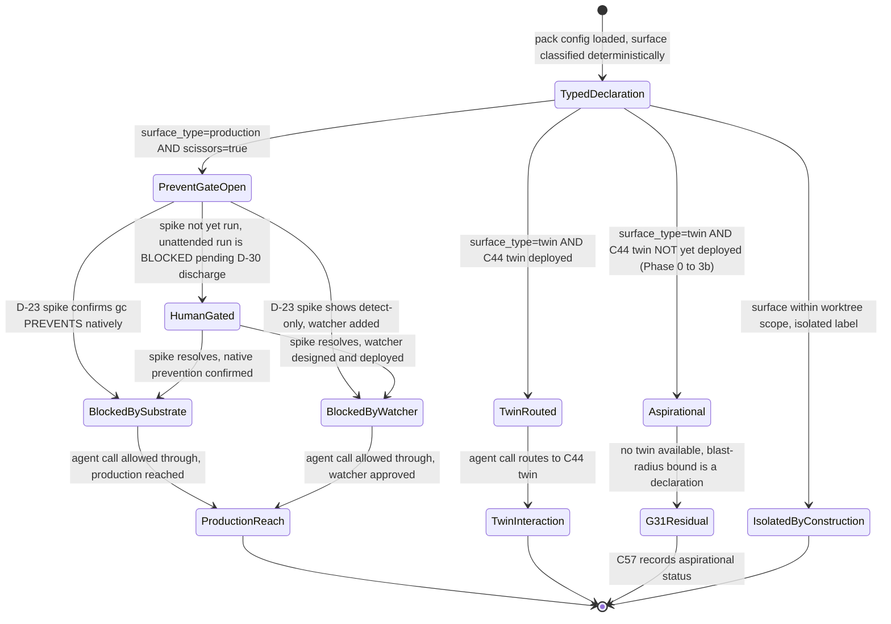
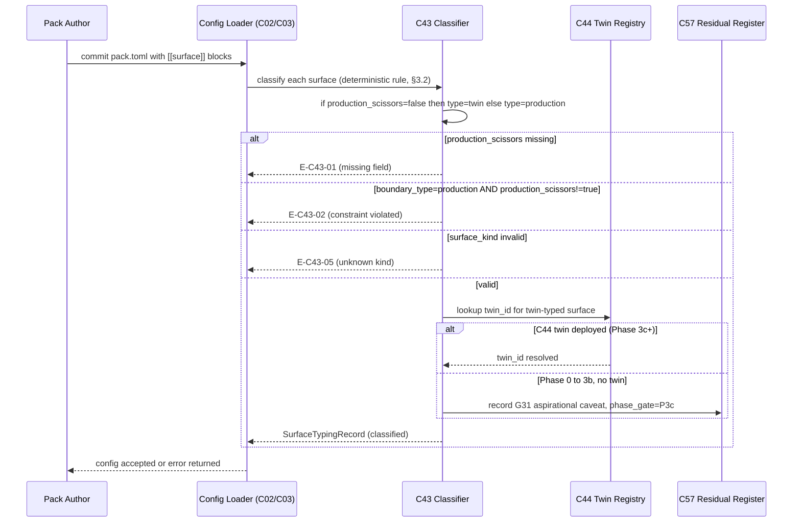

# C43 — Isolation & lethal-trifecta boundary  (Spec, canonical track)

> Source: README §"Principle 4 — Deterministic-first" (L152–162: "Tool nodes are cheap and reproducible.
> Most steps don't need a model. Use models only where reasoning is required"; the P4 component table —
> "Tool node abstraction"/"Reconciler"/"Discipline tooling" all native/small-add; L162 "P4 is native. The
> discipline-enforcement linter is a small add"); README §"Principle 7 — Digital twins" (L193–204:
> "Behavioral clones of critical external dependencies. Lets scenarios run thousands per hour without rate
> limits"; the `[[service]]` per-twin block, L200; L202 "Twin scaffolding from SDK — No OSS — bespoke per
> service"; L204 "P7 is the most labor-intensive principle … Build per-dependency twins"); README §autonomy
> ladder (L77–90 "L4-L5 operation — most steps run without per-step human review"; L527 "No commitment to L5
> on day one … L4 (PM mode) … batched review"); F-MODE-COVERAGE §4 "Layer 5 (P7 — digital twins)"
> (**F12 "Lethal trifecta" → "Twins reduce production exposure; boundary typing (CaMeL pattern); scenarios
> use twins not production" — "Addressed"**; **F44 "Lethal-Trifecta Production-Scissors Default" →
> "Substrate default: twins for everything; production scissors require explicit declaration per pack" —
> "Addressed"**; **F56 "Guardrail-bypass under stress (Replit-class)" → "Twins isolate the agent from
> production entirely; stress-induced compliance failure has bounded blast radius" — "Addressed"**;
> **F33 "Adversarial-prompt defeat of LLM-judge" → "Deterministic boundary typing as primary guard (P4);
> LLM-judge as secondary; twins remove the deploy-to-production vector" — "Addressed"**); F-MODE-COVERAGE §6
> (**F51 "Ashby-deficient probabilistic guard" → "P4 (deterministic-first) — deterministic boundary typing is
> the primary guard; LLM-judge is secondary" — "Addressed"**; F31 "Substrate safety floor = weakest adapter"
> → "single-adapter choice (Claude Code only)" — "Addressed"); component-inventory C43 row (subsystem
> Security & Governance; kind cross-cutting; "Deterministic boundary typing + twin isolation to bound blast
> radius; the security posture for Bash/network/fs access"; maps A100-sec/F44-host/B-sec; **depends on C42,
> C44**; gaps **G31, G35, G37**; foundational: no; Batch 4); ambiguities-and-gaps **G31** (blocker —
> lethal-trifecta is "Addressed" but the addressing mechanism (twins) is unbuilt and last; Phase 0→3b the
> factory runs Claude Code with Bash/network/filesystem access and no twin isolation), **G35** (major — RSI /
> goal-subversion blast-radius on a self-modifying L5 factory), **G37** (minor — secrets/credential handling
> absent; plaintext `city.toml`/env); review-log **D-13** (CRITICAL — **C43 OWNS the distinct lethal-trifecta
> blast-radius bound** (Bash/net/fs typing, twin isolation; G31); **C34 ENFORCES+AUDITS** holdout
> read-isolation; **C42 PROVIDES** the role partition), **D-14** (G37 secrets = C03's open gap, deferred;
> distinct from FE-3 signing — specs deferring secrets cite **G37**, not FE-3), **XC-8** (Phase-0 capability
> enforcement is detection-only until C43 isolation lands; "prevention" claims are really detection at Phase
> 0), and the SURVIVOR-PASS rulings **C02-04 DROP** ("Capability declaration → C43 grant — C43 *enforcement
> layer* dropped per 'no enforcement on top'"), **C04-05 DROP** ("Isolation-at-spawn (C42/C43 binding) —
> OS-level enforcement = hardening; we trust process boundaries Gas City gives"), **C41-07 DROP**
> (`boundary_class` tag — "Defensive labeling; we don't have twins yet"), and **C42-06 DROP** ("No OPA in
> scope").
> Inventory ID: C43   Kind: cross-cutting   Status: sweep-2
> Track: canonical

## 1. Purpose & responsibility

C43 is the **isolation & lethal-trifecta boundary**: the **security posture** that bounds the *blast radius*
of an agent that holds **broad Bash / network / filesystem tool access** (the implementer worker, C28). Its
load-bearing deliverable is **deterministic boundary typing** — every external-interaction surface (a Bash
invocation, a network egress, a filesystem path) carries a **deterministic boundary type** that
classifies it as *twin / isolated / production*, **decided by a deterministic rule, not an LLM judgment**
(README:152–162 P4 "deterministic-first"; F-MODE-COVERAGE F12 "boundary typing (CaMeL pattern)", corroborated
by F33/F51 "deterministic boundary typing is the primary guard"). Paired with that typing is the **default-twin routing
rule** (F44 "Production-Scissors Default"): external dependencies resolve to a **C44 digital twin by
default**, and reaching real production requires an **explicit per-pack declaration**. Together these two
deterministic declarations are what let v4 mark the lethal-trifecta modes (F12/F44/F56) "Addressed" —
they remove the *deploy-to-production* vector and give a *bounded* blast radius (F56) for an agent that
could, under prompt injection or stress, otherwise touch anything its tools can reach.

C43 closes the **G31 blocker**: the lethal-trifecta is marked "Addressed" on the strength of twins +
boundary typing (P4/P7), but through Phase 0→3b the factory runs Claude Code with Bash/network/filesystem
access and **no twin isolation** — so for the whole period it is actually exposed, the mode is "Addressed on
paper." C43 is the component where that paper guarantee gets a **deterministic boundary-typing design**.
Per review-log **D-13**, C43's charter is the **distinct lethal-trifecta blast-radius bound** — it is *not*
the holdout read-isolation enforcement (that is **C34**'s) and *not* the role partition (that is **C42**'s).
The three are one security model in three layers: **C42 PROVIDES** the role partition, **C34
ENFORCES+AUDITS** the holdout read-isolation (after-the-fact detection of a scenario leak), and **C43 BOUNDS**
the broad-tool-access blast radius at the external surface (twin-by-default + deterministic boundary type) —
the residual that neither C42's declaration nor C34's audit can themselves *prevent* (D-13, XC-8).

> **Wrap-up decision (D-20, ADOPTED 2026-05-31; confirms D-18, flips PROVISIONAL→ADOPTED).** C43's split-sequencing is now **binding, not provisional**: the **boundary-typing / blast-radius half** (depends only on C42 + the P4 primitives, NOT twins) is a **Phase-2 entry precondition** — a gate the factory MUST pass before running unattended (P2) or self-modifying (P3b); the **twin-isolation half** (blocked on C44) stays at **Phase 3c**. The "accept detection-only Phase 0" alternative is REJECTED. See [the decision ledger](../_meta/review-log.md#wrap-up-operator-decisions-2026-05-31--d-20d-25).

> [FAITHFUL-FILL] **C43 = the boundary *typing declaration* + the default-twin *routing rule*; NOT a custom
> isolation kernel, capability-grant engine, or OS-enforcement layer.** Per the capability-for-principle bar,
> three would-be C43 mechanisms were explicitly **DROPPED**: a C43 *capability-grant* layer over pack
> capability declarations (SURVIVOR-PASS **C02-04** "C43 enforcement layer dropped per 'no enforcement on
> top'"), *isolation-at-spawn* OS-binding (**C04-05** "OS-level enforcement = hardening; we trust process
> boundaries Gas City gives"), and a defensive `boundary_class` *tag* machinery (**C41-07**). OPA is also out
> of scope (**C42-06**). The genuine KEEP — and it *is* a genuine keep, because no part of the stack provides
> it — is the **deterministic typing of the external surface (P4) + the twin-by-default / production-scissors
> routing (P7)**: a *named, deterministic declaration* of which interactions are twinned/isolated vs
> production, plus the rule that production requires an explicit per-pack opt-in. The **mechanical isolation
> itself** is the stack's: OS process / network / filesystem boundaries Gas City already gives (C04-05), and
> **C44 twins** for external dependencies. C43 *types and routes*; it does **not** re-build OS sandboxing or
> stand up a policy engine. This is the smallest form that still closes G31 — the typing/routing is the
> capability v4 names (CaMeL-pattern boundary typing + scissors default) and the stack does not.

**Responsibilities**
- **Own deterministic boundary typing (the P4 keep, G31).** Define the closed set of **boundary types** an
  external-interaction surface can carry — **`twin`** (routed to a C44 clone), **`isolated`** (sandboxed,
  no production reach), **`production`** (real external system) — and the rule that the type is assigned
  **deterministically** (a static classification of the target, not an LLM decision) so the guard is
  Ashby-sufficient (F51: "deterministic boundary typing is the primary guard; LLM-judge is secondary").
  This is the "boundary typing (CaMeL pattern)" v4 names at F12 (and the "deterministic boundary typing"
  primary guard at F33/F51; README:152–162 P4).
- **Own the default-twin / production-scissors routing rule (the P7 keep, F44).** Assert the **substrate
  default: external dependencies resolve to a C44 twin**; reaching real production is a **non-default,
  explicit per-pack declaration** ("production scissors require explicit declaration per pack",
  F-MODE-COVERAGE F44). The default-deny-to-production posture is what bounds blast radius (F56).
- **Bound the broad-tool-access blast radius (the D-13 charter).** State the **blast-radius invariant**: an
  agent with broad Bash/network/fs tool access can, by default, only reach **twinned or isolated** surfaces;
  a production-typed surface is reachable **only** where a pack has explicitly declared production scissors.
  This is the *distinct* boundary from C34's holdout audit — C43 caps *what the agent can touch*, C34
  *detects* a scenario leak after the fact.
- **Name the security posture for Bash / network / filesystem access (inventory one-liner).** State, per the
  three tool surfaces, the default posture: **Bash** runs against twinned/isolated state by default;
  **network** egress is twin-routed by default (no default reach to arbitrary production endpoints);
  **filesystem** access is scoped to the run's worktree/partition (C42/C04) — the production filesystem of
  an external system is a `production`-typed surface behind scissors. C43 *declares* this posture; the
  enforcement substrate is C04/C42 (process/worktree boundaries) + C44 (twins).
- **Publish the boundary-typing + scissors declaration to its consumers.** Expose the boundary-type
  assignment and the per-pack production-scissors declarations as the surface that **C57** (residual-risk
  register) records as the F12/F44/F56 mechanism, that **C44** twins are bound to (the `twin`-typed
  surfaces route to twins), and that **C45** (twin fidelity) verifies usage against. C43 declares; others
  consume/verify/record.

**Explicitly NOT**
- **NOT the holdout read-isolation enforcement + audit (C34).** Per **D-13**, C34 owns **enforcing** the
  read-isolation policy (`scenarios ∉ read_partition(worker)`, realized by file perms + repo separation) and
  the **after-the-fact audit** that detects a scenario leak (README:173). That is a **distinct boundary**:
  C34 detects a holdout leak; C43 bounds the broad-tool-access escape that makes such a leak *physically
  possible*. C43 does **not** absorb C34's holdout-audit charter, and C43's typing is **not** the holdout
  policy. (C34 §1 states the reverse: "C43 owns the Bash/network/filesystem security posture … a distinct
  boundary from holdout read-isolation".)
- **NOT the role / partition declaration (C42).** Per **D-13**, C42 **provides** the closed role set
  (worker/scenario-author/judge) and the read/write partition model; C43 **consumes** that partition as the
  baseline scope and adds the external-surface boundary typing on top. C43 does not define partitions or
  roles. (C42 §1: "C42 declares the partitions; C43 bounds the trifecta blast radius.")
- **NOT a capability-grant / enforcement engine (DROPPED, C02-04).** The pack ABI's capability *declaration*
  (C02) is **not** wired to a C43 *grant/enforcement* layer — that layer was dropped ("no enforcement on
  top", SURVIVOR-PASS C02-04). C43 types the surface and routes to twins; it does not police pack
  capabilities at grant time, and it does not turn capability breaches into kills (that Phase-0 control is
  detection-only until isolation lands — XC-8).
- **NOT OS-level isolation-at-spawn (DROPPED, C04-05).** Binding the worker subprocess into an OS sandbox at
  spawn is **C04's** session substrate concern and was dropped as hardening ("we trust process boundaries
  Gas City gives"). C43 relies on the process/worktree boundaries C04/C42 give; it does **not** build a
  custom spawn-time sandbox, seccomp profile, or namespace jail.
- **NOT the digital twins themselves (C44) or twin fidelity (C45).** C44 **builds** the per-service
  behavioral clone (record/replay + stateful + OpenAPI mock, LocalStack-shaped); C45 **verifies** the twin
  matches the real service. C43 **routes** `twin`-typed surfaces *to* C44 twins and declares the default; it
  does not implement a twin or judge its fidelity. (Inventory: C43 depends on C44.)
- **NOT a secrets / credential store (G37, C03 — deferred).** Per **D-14**, secrets/credential handling is
  the open gap **G37**, owned by **C03** (plaintext `city.toml`/env today), and is **deferred** — distinct
  from FE-3 (graduated signing). C43 references boundary types and twin routes by label/name; it does **not**
  store keys or tokens, and a `production` scissors declaration does not imply a C43-built secrets layer.
  (See §6/G37.)
- **NOT the RSI / goal-subversion control or the autonomy ladder (C39 / C56 / C35).** C43 bounds the
  *blast radius* dimension of G35 (what an autonomous agent can *touch*); the *objective-drift / fix-ship
  authorization* dimension of G35 — "who authorizes a Healer-generated fix to ship at L5" — is **C39**'s
  loop-closure contract + **C56**'s autonomy ladder + **C35**'s override loop. C43 caps the damage; it does
  not decide autonomy level or authorize self-modification. (See §6/G35.)
- **NOT the failure-mode coverage register (C57).** C57 owns the canonical 61-mode map + the honest
  residual/caution register. C43 *supplies* the F12/F44/F56/F33/F51 mechanism + the G31 residual-exposure
  caveat to C57; it does not own the register. (Inventory: C57 depends on C43.)

## 2. Context & dependencies

| Direction | Component | Relationship |
|---|---|---|
| Upstream (declared dep) | **C42** Rig / agent-role partitioning | Per **D-13** C42 **provides** the role partition + read/write partition model. C43 consumes the partition as the *baseline* scope and layers external-surface boundary typing on top of it. C43 `depends on C42`. |
| Upstream (declared dep) | **C44** Digital twin (per service) | C44 **builds** the per-service behavioral clone. C43's `twin`-typed surfaces **route to** C44 twins, and the default-twin rule (F44) is what makes twins the substrate default. The `twin` boundary type **is the signal** that a surface must be served by a C44 twin; C44 is the implementation the route resolves to — C43 owns the *type and default*, C44 owns the *twin*. C43 declares the typing/routing; C44 supplies the clone. C43 `depends on C44`. |
| Upstream (substrate boundaries) | **C04** Session & provider runtime · **C01** Gas City substrate | > [FAITHFUL-FILL] — **not declared inventory edges** (inventory C43 `depends on` = C42, C44); faithful fill. The **mechanical** process / network / filesystem isolation C43's typing *relies on* is the OS/process boundary Gas City/C04 give natively (SURVIVOR-PASS C04-05 "we trust process boundaries Gas City gives"). C43 does not build these; it types/routes the surface they bound. |
| Upstream (typed tool surface) | **C28** Claude Code agent loop · **C02** Pack / tool-node ABI | > [FAITHFUL-FILL] — faithful fill (not a declared edge). The **broad Bash/network/fs tool access** C43 bounds is C28's (the implementer worker's hooks/Bash/Read surface); the per-pack production-scissors declaration attaches at the **pack** level (C02). C43 types *their* external surface; it does not redefine the tool ABI or the agent loop, and the capability-grant wiring is **dropped** (C02-04). |
| Downstream (verifies usage) | **C45** Twin contract & fidelity verification | C45 verifies "twin usage matches service promises and twin behavior matches the real service". C43's boundary-typing/scissors declaration is *what* a surface's intended (twin vs production) usage is; C45 checks reality against it. C45 `depends on C44` (and reads C43's declared typing). |
| Downstream (records the mechanism + residual) | **C57** Failure-mode coverage & residual-risk register | C57 records C43's boundary-typing + default-twin routing as the F12/F44/F56/F33/F51 mechanism, **and** the G31 residual-exposure caveat (the Phase 0→3b window before twins land). C57 `depends on C43`. |
| Downstream (blast-radius half of autonomy) | **C56** Autonomy ladder · **C39** Fix-task loop-closure | C43's blast-radius bound is what makes higher autonomy rungs (L4/L5, README:90) survivable: more autonomy ⇒ more potential blast radius, capped by C43's twin-by-default posture. The *objective-drift / fix-ship-authorization* half of G35 is C39/C56/C35's, not C43's. |

C43 is **not foundational** (inventory: no) and is in **Batch 4** (built in parallel with C36–C39 self-heal,
C44/C45 twins, C51–C56 bootstrap). Per the inventory's critical-path note it is a "cross-cutting
load-bearer … the security posture that is 'Addressed on paper' but unbuilt through Phase 3b (G31)." It is
**load-bearing for the whole-system security claim**: F12/F33/F44/F51/F56 are all marked "Addressed" on the
strength of C43's typing + C44's twins, so until C43 (and C44) land, those statuses are *paper* (XC-8, G31).

## 3. Interfaces / contracts

Sweep 1 — interfaces named and described. Sweep 2 — concrete boundary-type schema, scissors declaration grammar, E-codes, AC-codes, and state/sequence diagrams added in §3.1–§3.5 below.

1. **Boundary-typing contract (the P4 keep).** The closed set of **boundary types** —
   **`twin` | `isolated` | `production`** — that an external-interaction surface (Bash target / network
   endpoint / filesystem path of an *external system*) carries, and the rule that the type is assigned by a
   **deterministic classification** of the target (not an LLM judgment), so the guard is Ashby-sufficient
   (F51). Any component resolving an external interaction can ask C43 "what boundary type is this surface?"
   and get a deterministic answer.
2. **Production-scissors declaration contract (the P7 keep).** The named per-pack surface by which a pack
   **explicitly opts a specific surface into `production`** ("production scissors require explicit
   declaration per pack", F44). Absent such a declaration, the surface is **`twin`** by default. This is the
   *non-default, explicit, auditable* path to real production.
3. **Twin-route binding contract.** The named binding from a `twin`-typed surface to its **C44 twin** — i.e.
   "this external dependency's interactions are served by twin X." C43 owns the *type and the default*; C44
   owns the *twin*; this contract is the seam between them (and what C45 verifies usage against).
4. **Security-posture statement (Bash / network / filesystem).** A named, per-surface posture: Bash →
   twinned/isolated state by default; network → twin-routed egress by default (no default arbitrary
   production reach); filesystem → run-worktree/partition-scoped (C42/C04), external-system production
   filesystem behind scissors. Named here; the **enforcement** is C04/C42 process/worktree boundaries + C44
   twins (C43 does not re-build them).
5. **Boundary-typing + residual feed (to C57 / C45 — not a frozen enforcement contract).** The surface C43
   publishes: the boundary-type assignments + per-pack scissors declarations (so **C45** verifies usage and
   **C57** records the F12/F44/F56 mechanism), **plus** the one-line **G31 residual-exposure caveat** — that
   before twins land (Phase 0→3b) the typing is a declaration without a twin to route to, so the
   blast-radius bound is *aspirational until C44 ships* (XC-8). This is routing/observability, not a custom
   enforcement engine.

### 3.1 Blast-radius typing schema — field table (Sweep-2)

The **SurfaceTypingRecord** is the unit C45 verifies usage against and C57 records as the F12/F44/F56 mechanism. One record per declared external-interaction surface. Columns follow the C20 convention: **Field | Type | Req? | Semantics | R/W by**.

| Field | Type | Req? | Semantics | R/W by |
|---|---|---|---|---|
| `surface_id` | `string` | R | Stable identifier for the surface (e.g. `"github-api"`, `"s3-prod"`, `"db-replica"`). Scoped to the pack that declares it; globally unique within a city config as `"<pack_id>/<surface_id>"`. | Pack author writes in `pack.toml`; C45/C57 read |
| `surface_kind` | `enum{bash, network, filesystem}` | R | Which tool surface this entry types. `bash` = a Bash invocation targeting an external system; `network` = an HTTP/TCP egress endpoint; `filesystem` = a path on an *external* system's filesystem (distinct from the run-worktree, which is `isolated` by definition). | Pack author writes; C28 (agent loop) resolves at interaction time |
| `boundary_type` | `enum{twin, isolated, production}` | R | The deterministic boundary type for this surface (§4.1). Assigned by a deterministic classification rule (§3.2), never by LLM judgment (F51). `production` requires `production_scissors = true`; absence of scissors → `twin` by default (F44). | C43 classification rule assigns; C45 verifies; C57 records |
| `twin_id` | `string` | O | When `boundary_type = twin`: the C44 twin identifier this surface routes to (the twin-route binding, §3.3). Required iff `boundary_type = twin` AND C44 twins are deployed (Phase 3c+); omittable during Phase 0→3b aspirational window (G31 caveat). | C44 author writes; C43 routing reads; C45 verifies |
| `production_scissors` | `bool` | R | `true` iff the pack has explicitly opted this surface into `production` reach (the F44 per-pack opt-in, §3.2). Default `false`. A surface with `production_scissors = false` and `boundary_type = production` is a config error (E-C43-02). | Pack author writes (explicit opt-in); C43 validation reads |
| `target_ref` | `string` | O | Human-readable description of the target (URL pattern, path glob, command pattern). Not used for enforcement — for observability and C57 audit only. [needs G11 verification] | Pack author writes; C57 reads |
| `phase_gate` | `string` | O | The earliest phase at which this surface typing is active (e.g. `"P2"`, `"P3c"`). Lets C57 distinguish realized-now from aspirational-until-phase. | C43 writes (inferred from C44 status); C57 reads |

> [FAITHFUL-FILL] **`surface_kind` = `{bash, network, filesystem}` is the minimal faithful set** matching v4's "Bash/network/filesystem access" naming (F12/F44/F56; README §security posture per surface, §3.4 above). A `filesystem` entry types an *external system's* filesystem path; the run-worktree path (the `isolated` scope C42/C04 provides) is not a `SurfaceTypingRecord` entry — it is the background default (see §4.1 `isolated` note).

### 3.2 Deterministic classification rule (Sweep-2)

The boundary type is assigned by the following deterministic rule at config-load time. **No LLM judgment may participate in this path** (F51 primary-guard invariant):

```
classify(surface) -> BoundaryType:
  if surface.production_scissors == true:
    return production
  # No scissors declaration → twin by default (F44)
  # (If no C44 twin is deployed yet, the result is still "twin" — the G31
  #  aspirational-until-C44 caveat; the type is the intent, not the realized route.)
  return twin

# Special case: surfaces that are structurally within C42/C04 worktree scope
# (e.g. run-worktree paths that do not cross to an external system's filesystem)
# are not SurfaceTypingRecord entries at all — they are isolated by construction.
# A SurfaceTypingRecord is only authored for surfaces that CAN reach external state.
```

This rule has **two invariants** the config validator MUST enforce:
1. `production_scissors = true` → `boundary_type = production` (and only then).
2. `boundary_type = production` AND `production_scissors != true` → config error **E-C43-02**.

**OQ-C43-1 posture (prevent-required, watcher DEFERRED):**

> "The operator re-adopts D-20 as **conditional on prevention**: unattended operation (P2) and self-modification (P3b) require the substrate to **BLOCK (prevent at the tool-call/process boundary)** — not merely detect — out-of-boundary access on the relevant blast-radius face. **Discharge:** if Gas City does not prevent natively (per the D-23 spike), an **enforcement watcher that blocks WILL be added** — sanctioned in principle; its **design is DEFERRED until the spike confirms the substrate does not already prevent**."
> — review-log **D-30** (ADOPTED 2026-06-01)

Therefore: the classification rule above specifies the *required* outcome (what must be blocked). **Whether the pack/`gc` loader achieves this by native rejection or a blocking watcher is the D-23 spike question (OQ-C43-1).** The spec states the required behavior; the enforcement mechanism is spike-gated. Until the spike resolves it, C43's typing is a *declaration* — and unattended operation (P2/P3b) is **blocked at human-in-the-loop** (D-30). **DO NOT design the watcher here** (D-30 deferred; AGENTS-MD-bf4431be57).

### 3.3 `isolated` type — label over C42/C04 scope (Sweep-2)

**OQ-C43-3 RESOLVED (Sweep-2):** `isolated` is a **label C43 puts on the C42/C04 worktree/process boundary** — it is **not** a distinct C43 sandbox or OS jail. This resolves the OQ by accepting the minimal faithful reading (no new mechanism; the bar would drop a new sandbox, C04-05).

The `isolated` type applies when:
- The surface is within the **run-scoped worktree** C04/C42 provides (a filesystem path under the session's worktree — Gas City worktree isolation, F17).
- **No external system** is reachable from that path (the path does not cross a `production`-typed or `twin`-typed boundary).

Because `isolated` surfaces are *definitionally within the C42/C04 boundary*, they **do not appear as `SurfaceTypingRecord` entries** in `pack.toml`. They are the *background default* for intra-worktree/intra-partition access — any Bash/fs interaction that stays within the run-worktree is `isolated` without declaration. The `SurfaceTypingRecord` is only authored for interactions that *can* reach beyond the worktree to an external system.

**Mechanically:** `isolated` = the process/network/fs boundary C04 establishes at session spawn + C42's partition confinement. C43 names the type; C04/C42 provide the boundary; **no new C43 mechanism** (C04-05 dropped).

> [FAITHFUL-FILL] **`isolated` as a label is the smallest faithful form of the third boundary type.** v4 names only `twin`/`production` explicitly via F44, but F56 ("twins isolate the agent from production entirely") implies a third posture — what happens when there is no twin and no production reach, just the agent's own working environment. The minimal consistent choice is that this is the C42/C04 worktree scope, given the label `isolated` for the type system's completeness. Confirmed: `isolated` is NOT a distinct sandbox (that would be the C04-05 drop and an over-build).

### 3.4 Production-scissors declaration grammar (Sweep-2)

**OQ-C43-4 RESOLVED (Sweep-2):** The scissors declaration lives in **`pack.toml`** (per-pack config, C02/C03) under a `[[surface]]` array-of-tables, **not** in a dropped capability-grant engine (C02-04 dropped) and **not** in a new C43 store.

```toml
# pack.toml — production-scissors declaration grammar (per-pack, C02/C03 attach point)

[[surface]]
surface_id         = "github-api"          # unique within this pack
surface_kind       = "network"             # bash | network | filesystem
production_scissors = false                # false → twin by default (F44 default)
target_ref         = "https://api.github.com/*"   # observability only

[[surface]]
surface_id         = "s3-prod-bucket"
surface_kind       = "network"
production_scissors = true                 # explicit opt-in to production reach
target_ref         = "s3://my-prod-bucket/*"
```

The scissors opt-in is valid **only when `production_scissors = true` is authored explicitly** by a human in the pack config and passes through git review (C02/C03). An LLM-written or runtime-generated `production_scissors = true` is an **E-C43-04** violation (the deterministic-typing invariant: the type is assigned by a static rule over a human-authored config, not by an agent at runtime).

**City-level override (not per-pack scissors):** A `city.toml` may define a `[surface_policy]` block that sets city-wide defaults (e.g. force all surfaces `twin` regardless of pack declarations — useful as a blanket city-level safe mode). City-level policy **always overrides** pack-level scissors. [needs G11 verification — `city.toml` surface policy key is `needs-pinned-gc-run`]

**Invariants enforced at config-load:**
- `production_scissors` field MUST be present and boolean in every `[[surface]]` block (E-C43-01 if absent).
- `production_scissors = true` without a human-committed config entry is a runtime config injection → E-C43-04.
- A `[[surface]]` block with `surface_kind` outside `{bash, network, filesystem}` → E-C43-05.

### 3.5 Twin-route binding contract (Sweep-2)

`twin`-typed surfaces bind to a C44 twin via the `twin_id` field in `SurfaceTypingRecord` (§3.1). The binding is:

```
TwinRouteBinding {
  surface_id:    string          // from SurfaceTypingRecord
  twin_id:       string          // C44 twin identifier (e.g. "twin:github-api:v1")
  phase_active:  string          // earliest phase this binding is live (e.g. "P3c")
}
```

C45 reads `TwinRouteBinding` to verify that an agent interaction claiming to target `surface_id` actually routes to `twin_id` and not to the real endpoint. Until C44 twins exist (Phase 0→3b, G31 caveat), `twin_id` is a *declared intent* — the `phase_active` field records when the route becomes realized. C57 reads `phase_active` to distinguish the realized bound from the aspirational bound.

### 3.6 E-code table (Sweep-2)

E-codes are component-scoped. `surfaced-as` is the error signal a config validator or runtime check emits; `caller recovery` states what the pack author or orchestrator must do.

| Code | Condition | Surfaced-as | Caller recovery |
|---|---|---|---|
| **E-C43-01** | `[[surface]]` block missing the required `production_scissors` field | Config-load error: `"surface '<id>': production_scissors field is required (bool)"` | Pack author: add `production_scissors = false` (or `true` with justification) to the block; re-submit config |
| **E-C43-02** | `boundary_type = production` AND `production_scissors != true` — constraint violated (§3.2 invariant 2) | Config-load error: `"surface '<id>': boundary_type production requires production_scissors = true"` | Pack author: either add `production_scissors = true` (explicit opt-in) or correct the boundary intent to `twin`; re-submit |
| **E-C43-03** | `production_scissors = true` present but no `surface_id` — anonymous scissors declaration | Config-load error: `"surface block: surface_id is required"` | Pack author: assign a stable `surface_id` and re-submit |
| **E-C43-04** | `production_scissors = true` injected at runtime (not present in a human-committed pack config — detected by config provenance check) | Runtime error: `"surface '<id>': production_scissors = true may only be set in a human-committed pack config; runtime injection is forbidden"` | Orchestrator: reject the config update; flag as deterministic-typing violation (F51 breach); human review required before any production-typed surface is activated |
| **E-C43-05** | `surface_kind` outside `{bash, network, filesystem}` | Config-load error: `"surface '<id>': surface_kind '<value>' is not in {bash, network, filesystem}"` | Pack author: correct `surface_kind` to a valid enum value and re-submit |
| **E-C43-06** | `boundary_type = twin` AND `twin_id` absent in Phase 3c+ (twins deployed — the binding is required) | Config-load warning (Phase 0→3b) / error (Phase 3c+): `"surface '<id>': boundary_type twin requires twin_id once C44 twins are deployed"` | Pack author (Phase 3c+): add the C44-assigned `twin_id`; C44 provides the identifier when the twin is registered |
| **E-C43-07** | City-level `[surface_policy]` override sets an invalid policy value [needs G11 verification] | Config-load error: `"city surface_policy: unknown policy value '<v>'"` | City operator: correct the `[surface_policy]` block to a supported value; [needs G11 verification on supported values] |

> [FAITHFUL-FILL] **E-C43-04 (runtime config injection) is a critical invariant guard.** The deterministic-typing invariant (F51 "boundary typing as primary guard") is *only* Ashby-sufficient if the boundary type is assigned by a rule over a human-authored config — not by an agent at runtime. Detecting a `production_scissors = true` that was not in the human-committed config (e.g. injected via a tool call writing pack.toml mid-run) is the faithful minimal guard for this invariant. The detection mechanism (file provenance / git-committed check) is substrate-dependent [needs G11 verification].

### 3.7 AC-code table (Sweep-2)

AC-codes are component-scoped. Each AC that exercises a failure path cross-references the E-code it asserts (E↔AC cross-ref).

| Code | Given / When / Then | Verifies |
|---|---|---|
| **AC-C43-01** | GIVEN a `pack.toml` with a `[[surface]]` block where `production_scissors = false` (or field absent) / WHEN the config is loaded / THEN the surface's `boundary_type` is `twin` (not `production`); no error for the no-scissors case | Twin-by-default invariant (F44); **asserts E-C43-01** for the missing-field sub-case |
| **AC-C43-02** | GIVEN a `pack.toml` with `production_scissors = true` on surface "S" / WHEN the config is loaded / THEN surface "S" has `boundary_type = production`; all other surfaces without scissors remain `twin` | Production-scissors explicit opt-in (F44); rule correctness |
| **AC-C43-03** | GIVEN a `[[surface]]` block with `boundary_type = production` and `production_scissors = false` / WHEN the config is loaded / THEN a config-load error is raised **E-C43-02**; the factory refuses to proceed | Invariant 2 (§3.2); **asserts E-C43-02** |
| **AC-C43-04** | GIVEN a `[[surface]]` block with `surface_kind = "rpc"` (outside the closed set) / WHEN the config is loaded / THEN a config-load error **E-C43-05** is raised | Closed surface-kind enum (§3.1); **asserts E-C43-05** |
| **AC-C43-05** | GIVEN a `[[surface]]` block missing `production_scissors` entirely / WHEN the config is loaded / THEN a config-load error **E-C43-01** is raised | Required-field invariant (§3.4); **asserts E-C43-01** |
| **AC-C43-06** | GIVEN an agent tool call targeting a surface with `boundary_type = twin` / WHEN Phase 3c+ and a `twin_id` is registered / THEN the interaction routes to the C44 twin, not the real endpoint | Twin-route binding (§3.5); blast-radius bound (D-13) |
| **AC-C43-07** | GIVEN an agent tool call targeting a surface with `boundary_type = production` / WHEN no `production_scissors = true` is in the committed config / THEN the call is blocked (prevent) or flagged (detect) depending on enforcement-strength (OQ-C43-1); NOT silently routed to production | Blast-radius bound (D-13); prevent/detect posture (D-30) |
| **AC-C43-08** | GIVEN a runtime write of `production_scissors = true` to pack.toml (not in a human-committed config) / WHEN the config provenance check runs / THEN error **E-C43-04** is raised; the change is rejected | Deterministic-typing invariant (F51); **asserts E-C43-04** |
| **AC-C43-09** | GIVEN a `[[surface]]` block with `boundary_type = twin` and no `twin_id` during Phase 0→3b / WHEN the config is loaded / THEN a warning is emitted (not a hard error) and `phase_gate` is recorded as aspirational | G31 residual-exposure caveat (XC-8); **asserts E-C43-06** (warning variant) |
| **AC-C43-10** | GIVEN a complete city config with `[surface_policy]` overriding all surfaces to `twin` / WHEN any pack's `production_scissors = true` declaration is also present / THEN the city-level override wins; no surface is `production`-typed | City-level override precedence (§3.4) |
| **AC-C43-11** | GIVEN the C57 residual register / WHEN the G31 exposure window is active (Phase 0→3b, C44 twins not yet deployed) / THEN the register contains the G31 caveat with `phase_gate = "P3c"` and the "Addressed on paper" annotation | G31 residual feed to C57; XC-8 discoverability (§8 AC 6) |
| **AC-C43-12** | GIVEN an intra-worktree filesystem access (path within the session worktree, per C04/C42) / WHEN a tool call is made / THEN no `SurfaceTypingRecord` is required; the surface is `isolated` by construction | `isolated` = C42/C04 label (§3.3); OQ-C43-3 RESOLVED |

**E↔AC cross-reference summary:** E-C43-01 → AC-C43-01, AC-C43-05 | E-C43-02 → AC-C43-03 | E-C43-04 → AC-C43-08 | E-C43-05 → AC-C43-04 | E-C43-06 → AC-C43-09 | (E-C43-03, E-C43-07 exercised by integration-level config tests, not unit AC-codes).

**Invariants**
- **Twin-by-default (load-bearing).** An external-dependency surface with **no explicit production-scissors
  declaration** is **`twin`**-typed and routes to a C44 twin. Reaching real production requires an explicit
  per-pack declaration (F44). A configuration that defaults a surface to `production` is invalid. (This is
  the clause F44/F56 "bounded blast radius" rests on.)
- **Deterministic typing.** A surface's boundary type is decided by a **deterministic rule** over the
  target, never by an LLM/agent decision (F51 "deterministic boundary typing is the primary guard; LLM-judge
  is secondary"). An LLM-assigned boundary type is an invalid (Ashby-deficient) configuration. *(The closed
  type set treats `twin`/`production` as v4-named (F44) and **`isolated` as a FAITHFUL-FILL third type** whose
  status — a *label* on the C42/C04 worktree boundary vs a distinct C43 sandbox — is **OQ-C43-3**, §4.1; the
  closed set is needed for this invariant to be well-defined, but its third element rests on the fill.)*
- **Blast-radius bound (D-13).** An agent with broad Bash/network/fs tool access can by default reach only
  `twin`/`isolated` surfaces; `production` is reachable **only** through declared scissors. This bounds the
  blast radius of prompt-injection / stress-compliance failure (F12/F56).
- **Distinct-from-holdout (D-13).** C43's blast-radius bound is a **separate** boundary from C34's holdout
  read-isolation enforcement+audit and C42's partition. C43 bounds the external blast radius; it does not
  enforce or audit the `scenarios` partition (that is C34) or declare it (C42).
- **No-enforcement-engine / no-OS-jail (bar).** C43 contains **no capability-grant engine** (C02-04
  dropped), **no spawn-time OS sandbox/seccomp/namespace jail** (C04-05 dropped — relies on Gas City's
  process boundaries), **no OPA/Rego** (C42-06 dropped), and **no `boundary_class` defensive tag machinery**
  (C41-07 dropped). It declares typing + default-twin routing; the stack isolates.
- **Aspirational-until-twins (residual, faithful).** Until C44 twins exist (Batch 4) and are wired, a
  `twin`-typed surface has no twin to route to, so the blast-radius bound is a *declared intent* not a
  realized control for the Phase 0→3b window (G31, XC-8). C43 records this so no downstream over-trusts the
  "Addressed" status.

## 4. Data model / state

C43 owns **policy/declaration definitions**, not instance state. The boundary types are a closed enum; the
per-pack production-scissors opt-ins live in pack config (C02/C03 `city.toml`); the twins are C44 filesystem
state; the process/worktree boundaries are C04/C42/Gas-City state. C43 defines the *meaning and invariants*
of the typing + routing.

### 4.1 Boundary type (the unit of typing)

| Type | Meaning | Default reachable by broad-tool agent? | v4 source |
|---|---|---|---|
| `twin` | external interaction served by a C44 behavioral clone | **yes (default)** | F12/F44 "twins for everything"; README P7 |
| `isolated` | sandboxed surface with no production reach (e.g. run-scoped fs/worktree) | yes | F56 "twins isolate the agent"; C42/C04 worktree |
| `production` | real external system | **no — only via explicit per-pack scissors** | F44 "production scissors require explicit declaration per pack" |

> [FAITHFUL-FILL] **Boundary-type set = {`twin`, `isolated`, `production`}, anchored by F44/F56.** v4 names
> "twins" and "production" explicitly (F12/F44/F56) and the "production scissors" default-twin rule fixes the
> two-way `twin` vs `production` split. The minimal faithful reading adds **`isolated`** as the third type
> because v4 also names a sandboxed-with-no-production-reach posture (F56 "twins isolate the agent from
> production entirely"; the run-worktree scope of C42/C04 is isolation without a twin). The set is treated as
> **closed** for sweep-1 because the deterministic-typing invariant ("a surface's type is one of these")
> needs a closed set to be well-defined. Concrete enum encoding + the on-disk field is sweep-2.

### 4.2 Production-scissors declaration (the non-default opt-in)

A **production-scissors declaration** is the **explicit per-pack** statement that a named surface is
`production` rather than the `twin` default (F44). It is the auditable record that "this pack reaches real
production at surface X." Absent it, the surface is `twin`.

> [FAITHFUL-FILL] **Scissors declaration lives in pack config, not a new C43 store.** v4 says "explicit
> declaration **per pack**" (F44) and the pack/`city.toml` config is where capability-shaped declarations
> live (C02/C03). The minimal faithful choice is that the scissors opt-in is a **pack-config declaration**
> C43 *interprets* (assigns `production` type to the named surface), **not** a new persistence store or a
> grant-engine record (the grant engine is dropped, C02-04). Concrete declaration grammar is sweep-2.

### 4.3 Boundary typing vs the dropped enforcement layer (G31) — sweep-1 note, not a control plane

> **Scope note (capability-for-principle bar).** This subsection states *what C43 owns vs what the stack
> owns*; it is deliberately **not** a control-plane / enforcement-engine design (the C43 grant layer is
> dropped, C02-04; spawn-time OS isolation is dropped, C04-05; OPA is dropped, C42-06). The table is
> *explanatory*, not a binding enforcement contract.

| Layer | Mechanism | Owner today | v4 source / ruling |
|---|---|---|---|
| typing | deterministic boundary type (`twin`/`isolated`/`production`) over the external surface | **C43** (the keep) | F12 "boundary typing (CaMeL pattern)"; F33/F51 "deterministic boundary typing"; P4 |
| routing | twin-by-default; production-scissors explicit per pack | **C43** (the keep) | F44 |
| twin impl | the per-service behavioral clone the `twin` type routes to | **C44** | README P7; inventory C44 |
| mechanical isolation | OS process / network / filesystem boundaries; run-worktree scope | **C04 / C42 / Gas City** (not C43) | SURVIVOR-PASS C04-05 |
| (dropped) | C43 capability-grant engine / spawn-time OS jail / OPA / `boundary_class` tags | **— (dropped)** | C02-04, C04-05, C42-06, C41-07 |

Authority note (one line, G31): the **deterministic boundary type + the twin-by-default routing are C43's
genuine keep** (the P4/P7 capability the stack does not provide); the **mechanical isolation is the stack's**
(C04/C42 process/worktree boundaries + C44 twins); the **C43 enforcement/grant layer, spawn-time OS jail,
OPA, and `boundary_class` tags are dropped**. The residual — that the typing is aspirational until C44 twins
land — is the G31 caveat C43 carries to C57.

### 4.4 Persistence & consistency

C43 holds **no instance state of its own**. The boundary-type enum is a definition; the per-pack scissors
opt-ins are pack/`city.toml` config under git review (C02/C03); twins are C44 state; process/worktree
boundaries are C04/C42 state. C43's only consistency requirements are the **twin-by-default** and
**deterministic-typing** invariants (§3): a config that defaults a surface to `production`, or assigns a
boundary type by LLM decision, is invalid (faithful: whether Gas City/the pack loader *rejects* such a
config or merely *permits* it is the enforcement-strength question — OQ-C43-1, the same G11/G31 substrate
uncertainty that gates C34's OQ-C34-1).

## 5. Behavior

C43 has no control loop; its behavior is **definitional** and **config-load / interaction-routing**-time:

- **Definition-time**: declares the boundary-type set, the twin-by-default / production-scissors rule, the
  blast-radius invariant, and the Bash/network/fs security posture (§3/§4).
- **Config-load time**: when a pack/`city.toml` is loaded, each external surface is assigned a boundary type
  (deterministically): a surface with no scissors declaration is `twin`; a scissors-declared surface is
  `production`. A surface defaulted to `production`, or typed by an LLM, is an invalid config (whether the
  loader *rejects* vs *permits-with-review* is OQ-C43-1 / G31).
- **Interaction-routing time**: when the broad-tool-access agent makes an external interaction (Bash /
  network / fs against an external system), the surface's boundary type selects the route — `twin` →
  the C44 twin (C44), `isolated` → the sandboxed/worktree surface (C42/C04), `production` → real production
  (only if scissors-declared). The **routing/isolation mechanism** is C44/C04/C42; C43 supplies the *type
  that selects it*.
- **Publish-time (to C57 / C45)**: C43 exposes the boundary-type assignments + scissors declarations + the
  G31 residual caveat to C45 (usage verification) and C57 (residual-risk register).

### 5.1 State diagram — prevent-required/detect-until-spike posture (Sweep-2)

The diagram below models the lifecycle of the boundary-typing fence from the D-30 requirement through the D-23 spike resolution. It is the load-bearing Sweep-2 artifact for the "prevent-required, enforcement-mechanism DEFERRED" posture.

> **Mermaid note:** no `;`, `--`, `()`, `=`, or `#` in transition labels (SWEEP2-DISPATCH hazard rule). Labels use commas and plain words.



**State notes:**
- `HumanGated` is the operative state for unattended (P2) and self-modification (P3b) runs **until** the D-23 spike resolves enforcement strength (D-30: "until prevention is established, unattended operation is blocked").
- `BlockedBySubstrate` and `BlockedByWatcher` are the two possible discharge paths — native Gas City prevention OR the sanctioned blocking watcher. **DO NOT design the watcher here** (D-30 deferred).
- `Aspirational` covers the G31 exposure window (Phase 0→3b, C44 twins unbuilt); the bound is a *declaration*, not a realized control.
- The `isolated` label (IsolatedByConstruction) applies without any SurfaceTypingRecord — it is the background default for intra-worktree interactions.

### 5.2 Sequence diagram — config-load surface classification (Sweep-2)



## 6. Failure modes & handling

| F-mode / gap | Relevance | Handling in C43 (faithful) |
|---|---|---|
| **F12** Lethal trifecta (F-MODE §4, "Addressed") | The core mode C43 targets: an agent with data + tools + external reach exfiltrating / acting on production. | **Addressed-on-paper until twins land** (lead with the caveat, G31): C43's mechanism is "boundary typing (CaMeL pattern); scenarios use twins not production" (F12) — deterministic typing of the external surface (§3.1) + twin-by-default routing (§3.2). *Caveat (G31/XC-8):* the bound is realized only once **C44 twins** exist and are wired; Phase 0→3b the agent runs with Bash/network/fs and no twin, so the mode is "Addressed" on a mechanism that is **unbuilt and last**. C43 records this residual to C57 — downstream must lift the *status with the caveat*, not the bare "Addressed". |
| **F44** Lethal-Trifecta Production-Scissors Default (F-MODE §4, "Addressed") | The default posture toward production. | **Addressed** by the **twin-by-default invariant** (§3.2): "Substrate default: twins for everything; production scissors require explicit declaration per pack" (F44). C43 owns the default-twin rule + the explicit per-pack opt-in; the twins are C44. (Same G31 aspirational-until-twins caveat.) |
| **F56** Guardrail-bypass under stress / Replit-class (F-MODE §4, "Addressed") | An agent under stress/injection bypassing soft guardrails and acting on production. | **Addressed (bounded blast radius)** by twin isolation + the deterministic typing: "Twins isolate the agent from production entirely; stress-induced compliance failure has **bounded blast radius**" (F56). The bound is *deterministic* (not a soft guard), which is the point. (Same G31 caveat until C44.) |
| **F33** Adversarial-prompt defeat of LLM-judge (F-MODE §4, "Addressed") | An attacker defeating a probabilistic guard. | **Addressed (primary guard is deterministic)** — C43's boundary typing is the **deterministic primary guard**; "Deterministic boundary typing as primary guard (P4); LLM-judge as secondary; twins remove the deploy-to-production vector" (F33). C43 supplies the deterministic typing; the LLM-judge (C32) is the secondary, defeatable layer C43 backstops. |
| **F51** Ashby-deficient probabilistic guard (F-MODE §6, "Addressed") | A probabilistic guard lacking requisite variety for a deterministic threat. | **Addressed** by P4 deterministic-first: "deterministic boundary typing is the primary guard; LLM-judge is secondary" (F51). C43's **deterministic-typing invariant** (§3) is exactly this — the boundary type is decided by rule, not by a model, so the guard has requisite variety against a deterministic exfiltration path. |
| **F31** Substrate safety floor = weakest adapter (F-MODE §6, "Addressed") | The safety floor of the agent substrate. | **Adjacent — *not* C43's mechanism.** F-MODE addresses F31 by "single-adapter choice (Claude Code only)" and names no component; the owner is the **single-adapter / adapter-floor declaration (faithfully C29/C28)**, not C43. Listed only to disambiguate: C43 is the *blast-radius* boundary, not the *adapter-floor* declaration. |
| **G31** Lethal-trifecta "Addressed" but mechanism (twins) unbuilt and last (**blocker — C43's core gap**) | Phase 0→3b the factory runs Claude Code with Bash/network/fs and no twin isolation. | **This is C43's reason to exist + its honest residual.** *Resolved-on-design:* C43 gives the lethal-trifecta a **deterministic boundary-typing design** (§3.1) + twin-by-default routing (§3.2) — the design the "Addressed" status was always asserting. *Residual (faithful, loud):* the design is **realized only when C44 twins ship** (Batch 4); for the Phase 0→3b window the typing is a *declaration without a twin to route to*, so the blast-radius bound is aspirational (XC-8). The faithful resolution is to **own the typing/routing design now** and **route the exposure-window residual to C57** — C43 cannot make the bound real before C44, and the real fix being "unbuilt and last" is the blocker's substance. See the §6 AMBIGUITY block. |
| **G35** RSI / goal-subversion blast-radius on a self-modifying L5 factory (major) | A factory that ships its own components at L5 with the weakest control on objective drift. | **Blast-radius half handled; objective-drift half deferred to C39/C56/C35 (faithful).** C43 owns the **blast-radius** dimension of G35: the twin-by-default bound caps *what* an autonomous (L4/L5) agent can touch, so a goal-subverted agent's reach is bounded to twins/isolated surfaces (not production) absent declared scissors. C43 does **not** own the *objective-drift / fix-ship-authorization* dimension — "how many fix attempts before escalation; who authorizes a Healer fix to ship at L5" is **C39** (loop-closure) + **C56** (autonomy ladder) + **C35** (override loop) + the audit-pack the docs recommend. C43 caps the damage; it does not decide autonomy or authorize self-modification. Recorded, routed, not absorbed. |
| **G37** Secrets/credential handling absent (minor) | `production` scissors + twin routes touch endpoints/credentials in plaintext `city.toml`/env. | **Deferred to C03 / G37 (faithful — not C43's, D-14).** Per **D-14**, secrets/credential storage is the open gap **G37**, owned by **C03**, deferred (distinct from FE-3 signing). C43 references boundary types + twin routes + production endpoints **by label/name**; it does **not** store keys or tokens, and a `production` scissors declaration does **not** imply a C43-built secrets layer. A production-reaching surface inherits the plaintext-secrets residual until G37 is resolved (recorded here; specs deferring secrets cite **G37**, not FE-3). |

> [AMBIGUITY: G31] **Is the lethal-trifecta bound a realized control, or a deterministic-typing
> *declaration* whose realization waits on C44 twins (unbuilt and last)?**
> Reading A (faithful — typing/routing design now, realization on C44): F-MODE-COVERAGE marks F12/F44/F56
> "Addressed" via "twins … boundary typing (CaMeL pattern)" (F12) + the twin-by-default/production-scissors
> default (F44), but the twins are **Phase 3c**
> (README:468) and "the most labor-intensive principle … No turnkey OSS" (README:204); the ambiguities doc
> states plainly the mechanism "is unbuilt and last" and the factory runs with Bash/network/fs and "no twin
> isolation" Phase 0→3b (G31). On this reading C43 **owns the deterministic boundary-typing + default-twin
> *design***, and the bound is *realized* only as C44 twins land; for the exposure window the typing is a
> declaration without a twin to route to.
> Reading B (the "Addressed" status implies a present control): F12/F44/F56 read "Addressed" with no phase
> qualifier, suggesting the blast-radius bound is in force now.
> **Pick: Reading A, with the exposure-window residual surfaced loud to C57.** Canonical faithfulness is
> binding: v4 itself sequences twins to Phase 3c (README:468) and the ambiguities review (the binding gap
> register) calls F12/F44/F56 "Addressed on paper for the entire period it is actually exposed" (G31). So
> C43 **cannot** assert a realized control before C44 — the smallest faithful move is to (1) own the
> deterministic boundary-typing + twin-by-default *design* (the P4/P7 capability v4 names, §3.1/§3.2), (2)
> rely on C44 for the twin the `twin` type routes to and on C04/C42 for the mechanical isolation, (3) **not**
> build the dropped C43 enforcement/grant layer or OS jail (C02-04/C04-05), and (4) route the
> aspirational-until-C44 exposure-window residual (XC-8) to **C57**. The substrate sub-question — does the
> pack/`gc` loader *reject* a production-defaulted or LLM-typed surface, or merely permit-with-review — is
> OQ-C43-1 (the same G11/G31 enforcement-strength uncertainty as C34's OQ-C34-1).

## 7. Cross-cutting (security / cost / scale / observability / ops)

- **Security (the entire concern).** C43 **is** the lethal-trifecta security posture: deterministic boundary
  typing (the P4 primary guard, F33/F51) + twin-by-default routing (F44) bounding the broad-tool-access
  blast radius (F12/F56). Per **D-13** this is the **distinct** boundary from C34 (holdout
  enforcement+audit) and C42 (partition). The load-bearing caveat (G31, loud to C57): the bound is
  **realized only when C44 twins ship** — Phase 0→3b the lethal-trifecta is "Addressed on paper" while
  actually exposed (XC-8). C43 owns the *typing/routing design*; it does **not** build the dropped
  enforcement/grant engine, spawn-time OS jail, OPA, or `boundary_class` tags (C02-04/C04-05/C42-06/C41-07)
  — the mechanical isolation is the stack's (C04/C42 process/worktree boundaries + C44 twins).
- **Cost.** Declaring a boundary-type enum + a per-pack scissors opt-in is cheap (config + a deterministic
  classification). The real cost of the posture is **building the C44 twins** ("the most labor-intensive
  principle", README:204) — that cost is C44's, not C43's. C43 adds no policy-engine runtime cost (OPA
  dropped).
- **Scale.** No new store; boundary types are a closed enum and scissors opt-ins are pack config. C43 adds no
  scale concern of its own; the twin-routing scale story is C44's (and twins are precisely what lets
  scenarios "run thousands per hour without rate limits", README:195 — the P7 scale benefit C43's
  default-twin rule unlocks).
- **Observability.** C43's boundary-type assignments + scissors declarations *are* the observability surface
  for the lethal-trifecta posture — they make "which surfaces are twinned vs production" auditable, which is
  what **C45** (twin fidelity) verifies usage against and **C57** records as the F12/F44/F56 mechanism + G31
  residual.
- **Ops.** Boundary types + scissors opt-ins are sourced from pack / `city.toml` config under normal git
  review (C02/C03). Enabling a production scissors is an explicit, auditable per-pack change (F44). The
  exposure window closes operationally as C44 twins are built and wired per dependency (Phase 3c, README:468)
  — C43's residual caveat to C57 shrinks as each twin lands. *Secrets caveat (G37, D-14):* production
  endpoints/credentials live in plaintext `city.toml`/env until C03 resolves G37; C43 does not store them.

## 8. Acceptance criteria & test strategy

**Sweep-2 note:** formal AC-codes live in **§3.7** (AC-C43-01 through AC-C43-12) with E↔AC cross-refs. The high-level acceptance criteria below map to those codes.

1. **Twin-by-default invariant holds (F44/F56)** → **AC-C43-01, AC-C43-02**: an external-dependency surface with **no** explicit per-pack production-scissors declaration is **`twin`**-typed and routes to a C44 twin; a surface defaulted to `production` is an **invalid configuration** (AC-C43-03 / **E-C43-02**). *(Whether the pack/`gc` loader actively rejects or merely permits-with-review is OQ-C43-1 / G31, gated on G11-class `gc` availability; the test asserts the *policy*.)*
2. **Deterministic typing (F51/F33)** → **AC-C43-08** (**E-C43-04**): a surface's boundary type is assigned by a **deterministic rule** over the target; a boundary type injected by an LLM/agent at runtime is an **invalid (Ashby-deficient)** configuration. The deterministic typing is the primary guard; the LLM-judge (C32) is explicitly the secondary layer.
3. **Blast-radius bound (D-13)** → **AC-C43-07**: an agent with broad Bash/network/fs tool access reaches, by default, only `twin`/`isolated` surfaces; a `production` surface is reachable **only** through a declared scissors. The bound is the *distinct* boundary from C34's holdout audit and C42's partition (the test records the D-13 split). Prevent-required posture per D-30.
4. **Security posture stated per surface (Bash/network/fs)** → **AC-C43-12** (`isolated`): the default posture is documented per tool surface — Bash → twinned/isolated; network → twin-routed egress (no default production reach); filesystem → run-worktree/partition-scoped (C42/C04), external production fs behind scissors — with the **enforcement substrate** identified as C04/C42 + C44 (not a C43-built mechanism).
5. **Twin-route + scissors feed present (C44/C45/C57 seam)** → **AC-C43-06**: C43 publishes the boundary-type assignments + per-pack scissors declarations so **C44** twins bind to `twin`-typed surfaces, **C45** verifies usage against the declared typing, and **C57** records the F12/F44/F56 mechanism. The feed exists; the realized bound is gated on C44 (the test records this, G31).
6. **G31 residual-exposure caveat is discoverable (XC-8)** → **AC-C43-09, AC-C43-11** (**E-C43-06** warning): downstream consumers (C57, C56, C39) can discover that the lethal-trifecta bound is **aspirational until C44 twins land** (Phase 0→3b exposure window), so the "Addressed" status is never lifted without the caveat.
7. **No enforcement-engine / OS-jail / OPA / tag over-build (bar)**: C43 contains **no capability-grant engine** (C02-04), **no spawn-time OS sandbox/seccomp/namespace jail** (C04-05 — relies on Gas City process boundaries), **no OPA/Rego** (C42-06), and **no `boundary_class` defensive tag machinery** (C41-07). Enforcement is the stack's (C04/C42 + C44); C43 types + routes.
8. **G35 blast-radius half handled, drift half routed (faithful)**: C43's bound caps the blast radius of an L4/L5 autonomous agent; the objective-drift / fix-ship-authorization half of G35 is documented as **C39 + C56 + C35**'s, not C43's. **G37 secrets** is documented as **C03/G37** (deferred, D-14), not a C43-built layer.
9. **D-30 prevent-gate posture held** → **AC-C43-07**: the state diagram (§5.1) correctly shows the `HumanGated` state as the operative pre-spike posture for P2/P3b runs; the factory is BLOCKED from unattended operation until D-23 spike resolves enforcement strength. The watcher is NOT designed here.

## 9. Open questions

- **OQ-C43-1** (→ review-log; **top open question**): **Does the pack / Gas City config loader *reject* a
  production-defaulted or LLM-typed surface at config-load (prevention), or only permit-with-review so the
  violation is caught later (detection)? (G31 enforcement-strength, gated on G11.)** This is the load-bearing
  question for whether C43's typing is a *control* or a *declaration*: v4's twins are "unbuilt and last"
  (G31) and the dropped C43 enforcement layer (C02-04) means C43 itself does not police at tool-call time.
  Per **D-13** *ownership* is settled (C43 owns the blast-radius bound; C34 the holdout enforcement+audit;
  C42 the partition), but the substrate fact — does the realized bound *prevent* production reach at
  interaction time, or rely on C44 twins being present + C04/C42 boundaries — cannot be settled without the
  real `gc`/twin stack (**G11**). Same enforcement-strength uncertainty as C34's OQ-C34-1.
  **OPEN — D-23 spike (see below):** The D-23 harvest confirmed prefix is the bead-scoping MECHANISM but
  explicitly did NOT resolve whether `gc` PREVENTS out-of-prefix access or merely scopes-by-convention.
  This OQ remains the D-23 spike target.
- **OQ-C43-2** (→ review-log): **Does C43's exposure window (Phase 0→3b) need an interim bound before C44
  twins land, or is detection-only (C34 audit + capability-breach detection, XC-8) the accepted Phase-0
  posture?** **RESOLVED by D-20 (ADOPTED 2026-05-31):** the window gets an interim bound — the
  boundary-typing / blast-radius fence is pulled forward to a **Phase-2 entry precondition**; detection-only
  Phase 0 is REJECTED (XC-8 closed). The twin-isolation half stays Phase 3c. See [the decision ledger](../_meta/review-log.md#wrap-up-operator-decisions-2026-05-31--d-20d-25).
  G31's substance is that the real fix is unbuilt for the whole early period. Confirm whether the
  orchestrator accepts detection-only-until-C44 (the faithful reading) or wants C43 sequenced earlier / an
  interim isolation (an architectural change the canonical track may not take unilaterally). *(This is the
  XC-8 "sequence C43 earlier or accept detection-only Phase 0" decision applied to the broad-tool-access
  external surface.)*
- **OQ-C43-3** (→ review-log): **Exact boundary between C43's `isolated` type and C42/C04's worktree/process
  scope.** `isolated` (a sandboxed surface with no production reach) overlaps the run-worktree/partition
  scope C42/C04 already give. Confirm whether `isolated` is just a *label* C43 puts on the C42/C04 boundary
  (the faithful reading — no new mechanism) or implies a distinct C43 sandbox (an over-build the bar would
  drop). Sweep-2, jointly with C42/C04.
- **OQ-C43-4** (→ review-log): **Production-scissors declaration grammar + where it attaches.** F44 says
  "explicit declaration **per pack**" — confirm the declaration lives in pack/`city.toml` config (C02/C03)
  and the exact grammar (which surface, what scope), and that it is **not** wired to the dropped
  capability-grant engine (C02-04). Sweep-2, jointly with C02/C03.

**[D-30 ADOPTED 2026-06-01 — prevent/block required for unattended]**

C43 is the fence this decision is about: its boundary-typing half is the P2 precondition, and it is a real *control* only when the substrate (or a sanctioned watcher) blocks.

> The operator has adopted the auto-001 rubric and re-adopted D-20 as **conditional on prevention**: unattended operation (P2) and self-modification (P3b) require the substrate to **BLOCK (prevent at the tool-call/process boundary)** — not merely detect — out-of-boundary access on the relevant blast-radius face. **Discharge:** if Gas City does not prevent natively (per the [D-23 spike](../_meta/D-23-gas-city-spike-protocol.md)), an **enforcement watcher that blocks WILL be added** (sanctioned in principle); its **design is DEFERRED until the spike confirms the substrate does not already prevent** — do not design what we may not need, and the watcher's design must still pass the bar when built. Until prevention is established (native or watcher), unattended operation is **blocked** (human-in-the-loop). The per-rig-class "structurally-safe parts may run unattended" optimization remains available but secondary. See the [auto-001 decision brief](../_meta/decisions/auto-001-detect-only-binding-gate.md) and review-log D-30.

---

**[D-23 substrate-verified — gascity-prototype@b14c278, 2026-05-25]**

**F10 — Bead prefix IS the scoping mechanism; explicit `prefix=` required to avoid collision; prevent-vs-detect OPEN (NEW-INFO operational caveat):**
Verified against the Gas City prototype (lago-morph/gascity-prototype@b14c278, 2026-05-25):
**Bead scope is implemented as bead prefix.** Prefixes `gp-` (city HQ), `r1-` (rig1), `r2-`
(rig2) are the real scoping mechanism — agents scoped to rig1 see/write only `r1-` prefixed
beads. **Operational constraint:** rig names `rig1` and `rig2` both auto-derive prefix `"ri"` and
collide at startup; explicit `prefix = "r1"` and `prefix = "r2"` in `city.toml` are required.

**OPEN — prevent-vs-detect (C43:OQ-C43-1 / D-23 spike):** The prototype proved that prefix is
the MECHANISM for scoping. It did NOT verify whether `gc` PREVENTS an out-of-prefix bead access
at the tool-call level or merely scopes-by-convention with detect-after-the-fact. The end-to-end
smoke test (which would test this path) was deferred. This boundary remains the D-23 spike target
and must NOT be treated as resolved by this harvest.
