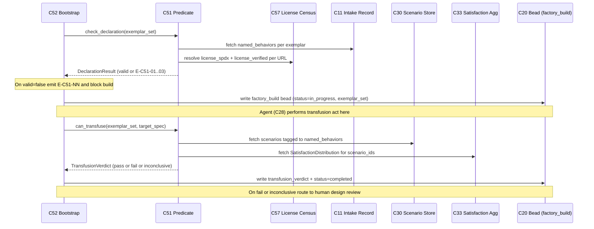

# C51 — Gene-transfusion discipline (`gene-transfusion`)  (Spec, canonical track)

> Source: AI-CONTEXT §9 ("Gene transfusion technique" — definition by analogy from v3 vocabulary: "applying a working pattern from one codebase to another by pointing the agent at a concrete exemplar and asking it to reproduce the behavior"; §9.1 transfusion-source map per layer; §9.2 "Discipline patterns" — `transfused_from: <url>`, "License hygiene: track transfusion source license per component", "Permissively-licensed transfusions can be donated back upstream; restrictively-licensed ones stay private"); AI-CONTEXT §16 cold-start step 2 ("Check `transfused_from` attribution"); README Part 7 "Discipline that keeps the bootstrap honest" (lines 496–500: "Gene transfusion always … No invention from scratch … evaluation grounded ('does this behave like the exemplar?')"; line 497 "Attribution of transfusion sources … records its `transfused_from: <url>` … P9 applied to the factory's own work"; line 499 "Scenarios drive evaluation … ensure its clusters match"; line 500 "External grounding for substrate"); README Part 8 bet #4 (line 511: "Gene transfusion is reliable for bounded components"); README Part 5 license census (lines 285–306 — per-source SPDX + "Verify before adopting" gating); component-inventory C51 row (maps `A86, A93, A107, A180-189, B52, B55`; depends on C08, C20; gaps G07, G14, G30; foundational: yes; critical-path note #4 — "without a correctness predicate the whole factory-builds-factory plan (C52–C54) has no acceptance contract"); ambiguities-and-gaps G07 (major — transfusion has "no acceptance criterion for *when a transfusion is correct/complete*, no contract for what 'behaves like the exemplar' means operationally, and no handling for exemplars under incompatible licenses"), G14 (major — reliability is "a bet"; Phases 3b/3c/3d all gated on it; "no fallback for 'factory cannot reliably transfuse'"), G30 (minor — Tracker license unverified; "the boundary between 'transfuse the code' and 'reimplement the pattern' is left to chance").
> Inventory ID: C51   Kind: cross-cutting   Status: sweep-2
> Track: canonical
> Binding decisions obeyed: **D-14** (G37 secrets ≠ FE-3 signing — transfusion-record signing is FE-3, blocked on G37, NOT Phase-0), **D-15** (holistic free-form DoD; FE-5 enumerated-per-criterion deferred), **D-39** (`ScoreRecord` schema owned by C32; C33 aggregates), **D-40** (`factory_build` lifecycle is a status transition, not a type-flip).

## 1. Purpose & responsibility

C51 is the **gene-transfusion discipline**: the cross-cutting contract that every component the
**factory builds for itself** (Phase 3+) is grounded in at least one concrete external exemplar rather
than invented from scratch, records *which* exemplar(s) at the component grain (`transfused_from`),
proves it actually **behaves like** that exemplar before it can ship (the correctness/completeness
**predicate**), and stays inside the exemplar's **license** terms. v4 names this technique as the thing
"that makes the factory-builds-factory plan tractable" (AI-CONTEXT §9) and lists it first among the four
disciplines that "keep the bootstrap honest" (README:496) — but defines it only **by analogy**, with no
operational success contract (G07), no fallback if the bet fails (G14), and no rule for incompatibly
licensed exemplars (G30). C51 is the component that turns the analogy into an **acceptance contract**.

C51 is **foundational** and load-bearing for bootstrap: the inventory's critical-path note #4 states that
"without a correctness predicate the whole factory-builds-factory plan (C52–C54) has no acceptance
contract." C52 (self-bootstrap), C53 (validation milestone), and C54 (phase plan) all consume the
predicate C51 defines. The genuine custom engineering here is **the predicate** (the "bet" made
falsifiable), `transfused_from` at the component grain, and license hygiene — not new evaluation
machinery (that already exists in C30–C33).

**Responsibilities**
- Define the **transfusion record** — the component-grain metadata asserting `transfused_from: <url>`
  (≥1 exemplar) plus the per-source license fact, attached to the factory-built component's
  `factory_build` bead (AI-CONTEXT §9.2; §16 step 2; C20 owns the field schema). *(B52, A93.)*
- Define the **≥1-exemplar invariant**: a factory-built component with **zero** declared exemplars is
  out of discipline — "No invention from scratch" (README:496; B55). *(B55.)*
- Define the **transfusion-correctness / completeness predicate** (G07): the operational meaning of
  "does this behave like the exemplar?" — expressed as **exemplar-grounded scenarios** scored by the
  existing judge tier against the component's Definition-of-Done, with a **completeness** clause that the
  exemplar's *named* behaviors are each covered by ≥1 scenario. This is C51's load-bearing deliverable.
  (At sweep-1 the *correctness* half is fully closed; the *completeness* half is shape-defined but its
  anchor — how an exemplar's named behaviors are enumerated — is the residual edge of G07, deferred to
  OQ-C51-1 and spiked first in the plan.)
- Define the **transfusion-mode boundary** (G30): per exemplar, whether the build may **transfuse the
  code** (verified-permissive license) or must **reimplement the pattern** (unverified/restrictive
  license) — and the **donate-back-vs-stay-private** disposition that follows (AI-CONTEXT:430).
- Define the **bet-failure fallback** at the discipline layer (G14): what a build does when the predicate
  **cannot be met** for a given component — the "factory cannot reliably transfuse *this*" exit — so the
  bet is falsifiable per-component instead of being an all-or-nothing wager.

**Explicitly NOT**
- **NOT a new evaluation engine.** The predicate is *expressed in terms of* the existing scenario store
  (C30), scenario runner (C31), judge harness (C32), and satisfaction aggregator (C33). C51 supplies the
  **acceptance contract** ("exemplar behavior → scenario → satisfaction ≥ bar"); it does not re-implement
  scoring. Building a second judge would be the over-build the bar forbids.
- **NOT the bead field schema.** `transfused_from`, the license fact, and the predicate-verdict slot are
  **fields on the `factory_build` bead, owned by C20** (D-3: C20 authors bead payload schemas). C51
  defines *what the values mean and when they are valid*; C20 defines the on-disk shape. C51 ≠ C20.
- **NOT the self-bootstrap loop.** C52 runs the recursion (author spec → build → human review → deploy)
  and *calls* C51's predicate as its acceptance gate; C53 is the go/no-go milestone that *consumes* a
  passing predicate. C51 is the **gate's contract**, not the loop or the milestone.
- **NOT the spec/DoD itself.** The component's Definition-of-Done lives in C08 (free-form, per D-15). C51
  adds the **exemplar-grounding** dimension on top of C08's DoD; it does not redefine the spec format.
- **NOT a license scanner / SPDX engine.** v4 already carries a hand-maintained license census
  (README:285–306) with explicit "Verify before adopting" gates. C51 makes that census a **build-blocking
  fact**, not an automated SBOM tool (that would exceed Phase-0 scope; flagged §9).
- **NOT a transfusion *executor*.** "Pointing the agent at the exemplar and asking it to reproduce the
  behavior" is the agent loop (C28) doing the work under a prompt (C09). C51 governs the **discipline
  around** that act (declare source, prove behavior, respect license), not the act of porting code.
- **NOT applicable to substrate.** The "External grounding" discipline (README:500, A107) keeps
  foundations (CXDB, Temporal, scikit-learn) as upstream OSS — those are **adopted, not transfused**, and
  carry no `transfused_from`. C51 governs only **factory-built** components (the orchestration glue).

## 2. Context & dependencies

| Direction | Component | Relationship |
|---|---|---|
| Upstream (depends on) | **C08** Spec artifact & format | The transfusion-correctness predicate is graded against the component's Definition-of-Done, which C08 owns (free-form DoD; D-15 holistic satisfaction). Inventory: C51 `depends on C08`. |
| Upstream (depends on) | **C20** Bead schema registry | `transfused_from`, per-source license fact, and the predicate-verdict slot are fields on the `factory_build` bead (C20 §4.2; D-3). Inventory: C51 `depends on C20`. C20 §2 lists C51 as a downstream consumer of `transfused_from`. |
| Upstream (concept) | **C30–C33** Scenario store / runner / judge / satisfaction | The predicate is *defined in terms of* exemplar-grounded scenarios (C30) run (C31), judged (C32), and aggregated into a satisfaction distribution (C33). C51 reuses this tier; it does not own it. |
| Sibling (concept) | **C29** Model floor & stylesheet | The transfusion *act* runs on the Claude Code floor (C28/C29). C51 governs discipline, not the model. |
| Downstream (consumes) | **C52** Self-bootstrap recursion | Calls C51's predicate as the acceptance gate before human design review / deploy (README:498). Inventory: C52 `depends on C51`. |
| Downstream (consumes) | **C53** Bootstrap-validation milestone | The go/no-go gate (G23) consumes a *passing* C51 predicate as the objective half of "if it works." Inventory: C53 `depends on C52` (→ C51 transitively). |
| Downstream (consumes) | **C54** Phase delivery plan | Phases 3a–3d each build factory components under C51 discipline (README:457–470). |
| Downstream (consumes) | **C57** Failure-mode coverage & residual-risk register | C57 "owns license hygiene + the honest residual/caution register" (inventory); C51 supplies the per-component license disposition C57 aggregates. Inventory: C57 `depends on C51`. |

C51 is **Batch-4** (inventory: "factory builds factory") but is **foundational** because every
Batch-4/Batch-5 factory-built component (C36–C39 Healer tier, C44–C45 twins, C46–C50 self-opt) is
acceptance-gated by C51's predicate. Per critical-path note #4 it gates C52–C54.

## 3. Interfaces / contracts

### 3.0 Transfusion-predicate interface (sweep-2 — the load-bearing signature)

The concrete function C52 calls at acceptance-time is:

```
can_transfuse(exemplar_set: List[ExemplarRef], target_spec: SpecRef) -> TransfusionVerdict
```

**Parameters:**

| Parameter | Type | Semantics |
|---|---|---|
| `exemplar_set` | `List[ExemplarRef]` | Non-empty set of declared exemplars (each an `ExemplarRef`; see §4 schema). ≥1 invariant is a precondition — caller (C52) must enforce before calling. |
| `target_spec` | `SpecRef` | The C08 spec artifact (`pack_root/agents/<name>/prompt.template.md` at a pinned git revision) whose DoD the predicate scores against. |

**Return type `TransfusionVerdict`:**

```
TransfusionVerdict = {
  outcome:        enum{pass, fail, inconclusive}
  completeness:   CompletenessResult         -- see §3.0.1
  correctness:    CorrectnessResult          -- see §3.0.2
  scenario_ids:   List[ScenarioId]           -- the scenarios evaluated (C30 IDs)
  score_records:  List[ScoreRecord]          -- per-scenario judge output (C32 §4 schema, D-39)
  verdict_time:   timestamp
}
```

The verdict is written by C52 to the `factory_build` bead's `transfusion_verdict` field (C20 §4.5.3-extended; the slot is a C51 slot-request into C20 — §4 table below).

**Declaration-time interface (pre-build, invoked by C52 before agent work begins):**

```
check_declaration(exemplar_set: List[ExemplarRef]) -> DeclarationResult
```

```
DeclarationResult = {
  valid:         bool
  violations:    List[E-C51-code]    -- empty on valid=true
  license_modes: Map[url, LicenseMode]   -- per-exemplar resolved mode
}
```

`LicenseMode = enum{code_port, pattern_reimplement}`. The mode is resolved from the README:285–306 license census via C57 (which owns the census — OQ-C51-4 RESOLVED below). If any exemplar is unverified/restrictive, its mode = `pattern_reimplement` and the result is still `valid=true` (mode restriction, not rejection), UNLESS the build's declared intent is `code_port` from that exemplar (in which case `valid=false`, `E-C51-02`).

### 3.0.1 Completeness check

**RESOLVED (Sweep-2): OQ-C51-1 — "Named exemplar behaviors" extraction (the completeness anchor).**

> [FAITHFUL-FILL] The completeness anchor is **operator-supplied at C11 intake**, not auto-extracted from the exemplar's tests or docs. Rationale: (a) v4 defines transfusion "by analogy" (AI-CONTEXT §9) and names no behavior-extraction method; (b) C11 (intent intake) already captures the 9-field crucible including "what behaviors this component must reproduce" from the operator's framing at intake time; (c) auto-extraction from exemplar tests/docs would require new tooling v4 never scopes — over-build per the bar. The minimal consistent choice: at C11 intake the operator names the exemplar(s) AND provides a **named-behavior list** for each (a short, operator-authored enumeration of the exemplar behaviors this component must reproduce). That list is the completeness anchor. "Complete" means: for every named behavior in the operator-authored list, ≥1 scenario in C30 carries an `exemplar_behavior` tag matching that behavior name. This anchor is objective and checkable — it closes the residual edge of G07.

**Completeness check (predicate clause):**

```
CompletenessResult = {
  anchor_behaviors:   List[str]       -- operator-named behaviors from C11 intake
  covered_behaviors:  List[str]       -- behaviors with ≥1 tagged scenario in C30
  uncovered:          List[str]       -- behaviors lacking coverage (must be empty for pass)
  complete:           bool            -- true iff uncovered is empty
}
```

A `complete=false` result causes `TransfusionVerdict.outcome = fail` regardless of satisfaction scores.

### 3.0.2 Correctness check

The correctness half reuses the existing eval tier without adding a new judge:

```
CorrectnessResult = {
  satisfaction_dist:  SatisfactionDistribution  -- C33 output (per D-39, D-15)
  bar_met:            bool                        -- whether operator bar (C53/C50 policy) is met
  bar_value:          float | null               -- the threshold (null = not yet set by C50/C53)
}
```

**RESOLVED (Sweep-2): OQ-C51-3 — numeric satisfaction bar.** The satisfaction bar is owned by C53 (bootstrap milestone) and C50 (promotion gate) as operator/integrator policy. C51's predicate reads the C33 satisfaction distribution — the same statistic C33 emits via `SatisfactionDistribution` — and compares it against the bar C53 injects at call-time. C51 does NOT set the threshold. If no bar is supplied by C53 (Phase-0 bootstrapping before C53 is live), `bar_value=null` and `bar_met` defaults to `true` (conservative: defer to completeness as the binding constraint in early phases).

### 3.0.3 Bet-failure signal (outbound)

When `outcome = fail | inconclusive`, C51 emits a **`TransfusionInsufficient` signal** consumed by C52's loop and C53's milestone:

```
TransfusionInsufficient = {
  component_id:  str
  outcome:       enum{fail, inconclusive}
  reason_codes:  List[E-C51-code]
  verdict:       TransfusionVerdict    -- full detail for human design review
}
```

C52 routes this to human design review (README:498); C53 records it as a non-passing milestone event. This is the per-component falsification of bet #4 (G14 made falsifiable, not eliminated — OQ-C51-2 note: the class-level fallback for a whole category failing remains C54's responsibility).

Sweep 1 — interfaces named and described (concrete signatures / scenario schemas deferred to sweep 2).

1. **Transfusion record (inbound declaration).** What a factory-build *declares*: one or more
   `transfused_from` exemplar URLs and, per exemplar, the license fact + chosen transfusion **mode**
   (code-port | pattern-reimplement). Recorded at the **component grain** on the `factory_build` bead
   (C20). The contract C52 writes and C57 reads.
2. **≥1-exemplar invariant (validation).** The predicate that the declared exemplar set is non-empty —
   "No invention from scratch" (README:496). A build asserting zero exemplars is rejected at the
   discipline gate.
3. **Transfusion-correctness predicate (the acceptance contract — G07).** Given (component, exemplar
   set), a **decision** {pass | fail | inconclusive} computed as: *the exemplar's named behaviors are each
   covered by ≥1 scenario (completeness), and the component's satisfaction distribution over those
   scenarios meets the bar (correctness)*. Expressed via C30 (scenarios), C31 (run), C32 (judge), C33
   (distribution). C51 owns the **predicate shape and the "exemplar-grounded" requirement**; the numeric
   satisfaction bar is operator/integrator policy routed to C50/C53 (consistent with C33 being
   threshold-free — C33:OQ-1).
4. **License-mode contract (G30).** Given an exemplar URL + its license fact (from the README:285–306
   census), a decision on the permitted **mode**: verified-permissive ⇒ code-port allowed and the result
   *may* be donated back upstream; unverified/restrictive ⇒ **pattern-reimplement only**, result stays
   private (AI-CONTEXT:430). Blocks a build that code-ports from an unverified-license exemplar.
5. **Bet-failure fallback (outbound signal — G14).** When the predicate returns fail/inconclusive for a
   component, C51 emits a **"transfusion-insufficient" outcome** that C52's loop and C53's milestone
   consume — the per-component falsification of bet #4, so the failure routes to human design review
   rather than silently shipping (README:498 keeps review mandatory until P12 is trusted).

**Invariants**
- **Every factory-built component carries ≥1 `transfused_from`** at the component grain (B52, B55,
  README:497). A factory-built component with an empty exemplar set is out of discipline.
- **`transfused_from` is component-level provenance, not per-record** (review-log RC11-01 NOTE): it is
  recorded once per factory-built component on its `factory_build` bead — not stamped on every bead or
  trajectory the build produces. This is "P9 applied to the factory's own work" at the **build** grain.
- **No code-port from an unverified or restrictive license** (G30; README:292,335; AI-CONTEXT:625): such
  an exemplar may only be *pattern-reimplemented*. License mode is fixed **before** the transfusion act,
  not discovered after.
- **The predicate is exemplar-grounded** (G07; README:496): a component's scenarios must trace to the
  declared exemplar's behavior — "does this behave like the exemplar?" — not merely to a generic spec.
  Completeness = every *named* exemplar behavior has ≥1 covering scenario.
- **External-grounding exclusion** (A107; README:500): substrate/foundational dependencies adopted as
  upstream OSS are **not** factory-built and carry no transfusion record; C51 governs only the glue the
  factory writes.

## 4. Data model / state

C51 owns **discipline semantics**, not storage. The three values it gives meaning to live as fields on
the `factory_build` bead (C20 §4.2; D-3) at the **component grain**:

| Value | Meaning | Grain | v4 source / owner |
|---|---|---|---|
| `transfused_from` | ≥1 external exemplar URL the component was grounded in | per factory-built component | README:497; AI-CONTEXT §9.2; field owned by C20 |
| `transfusion_license` | per-exemplar license fact + verified? flag (from README:285–306 census) | per (component, exemplar) | AI-CONTEXT:429 "track transfusion source license per component"; G30 |
| `transfusion_mode` | per-exemplar {code-port \| pattern-reimplement}, derived from license | per (component, exemplar) | AI-CONTEXT:625; G30; **> [FAITHFUL-FILL]** below |
| `transfusion_verdict` | predicate outcome {pass \| fail \| inconclusive} + the scenario set it was computed over | per factory-built component | README:496,499; G07; **> [FAITHFUL-FILL]** below |

### 4.1 Transfusion-record schema (sweep-2 — concrete field table)

These are C51's **slot requests into C20** (`factory_build` bead extensions; C20 §4.5.3-extended per D-3). Column format matches C20 §4.5: **Field | Type | Req? | Semantics | R/W by**.

#### 4.1.1 `ExemplarRef` — per-exemplar record (one per element of `transfused_from` list)

| Field | Type | Req? | Semantics | R/W by |
|---|---|---|---|---|
| `url` | `string` | R | External exemplar URL (verbatim source; README:497 `transfused_from: <url>`). Must be resolvable at the time of first transfusion. | C52 writes at declaration-time; C51 reads at predicate-time; C57 aggregates |
| `license_spdx` | `string` | R | SPDX license identifier from the README:285–306 census (e.g. `Apache-2.0`, `MIT`, `UNKNOWN`). `UNKNOWN` = unverified. | C57 census authority (OQ-C51-4 RESOLVED below); C52 writes after C57 lookup; C51 reads |
| `license_verified` | `bool` | R | `true` = the license was confirmed against the census; `false` = unverified/restrictive. | C57 (census); C52 writes; C51 reads |
| `transfusion_mode` | `enum{code_port, pattern_reimplement}` | R | Permitted mode: `code_port` only if `license_verified=true` AND `license_spdx` in the permissive-allow-list; `pattern_reimplement` otherwise (G30). Fixed **pre-build** by `check_declaration`. | C51 computes (§3.0); C52 records; C28 must respect |
| `donate_back` | `bool` | O | `true` if `transfusion_mode=code_port` and the license permits upstream donation (AI-CONTEXT:430). Informational; not enforced by C51. | C52 writes; C57 aggregates |
| `named_behaviors` | `List[str]` | R | Operator-named list of behaviors this exemplar must contribute (the completeness anchor; OQ-C51-1 RESOLVED §3.0.1). Written at C11 intake, carried here by C52. | C11 intake supplies; C52 records; C51 completeness-check reads |

#### 4.1.2 `transfusion_verdict` — per-component predicate outcome

| Field | Type | Req? | Semantics | R/W by |
|---|---|---|---|---|
| `outcome` | `enum{pass, fail, inconclusive}` | R | The predicate result from `can_transfuse(...)` (§3.0). | C51 computes; C52 writes to `factory_build` bead; C53 reads |
| `completeness_result` | `CompletenessResult` (§3.0.1) | R | Behavior-coverage detail (anchor_behaviors, covered_behaviors, uncovered). | C51 computes; C52 writes |
| `correctness_result` | `CorrectnessResult` (§3.0.2) | R | Satisfaction distribution + bar-met flag. | C51 computes (reads C33 output); C52 writes |
| `scenario_ids` | `List[ScenarioId]` | R | C30 scenario IDs evaluated in this predicate invocation. | C51 reads from C30; C52 writes |
| `verdict_time` | `timestamp` | R | When the predicate was evaluated. | C51 sets; C52 writes |
| `signed` | `bool` | O | Always `false` at Phase-0 (self-asserted; FE-3/D-14 deferred). See §7 / OQ-C51-5 RESOLVED below. | C52 writes `false` |

#### 4.1.3 Extended `factory_build` bead (C20 slot-request — Sweep-2)

The `factory_build` bead (C20 §4.5.3) is extended with the following C51-owned fields (requested as C20 schema slots per D-3):

| Field | Type | Req? | Semantics | R/W by |
|---|---|---|---|---|
| `exemplar_set` | `List[ExemplarRef]` | R | The declared exemplars at component grain (§4.1.1). ≥1 required (≥1-exemplar invariant). | C52 writes at declaration-time; C51 reads; C57 license-census aggregates |
| `transfusion_verdict` | `TransfusionVerdictRecord` | O | The predicate outcome (§4.1.2). Present iff acceptance-time evaluation has run. Absent = pre-evaluation (build in progress). | C51 computes result; C52 writes; C53 reads to gate milestone |

> [FAITHFUL-FILL] **`transfusion_mode` and `transfusion_verdict` are inferred field names.** v4 names
> `transfused_from` verbatim (README:497) and names license tracking and the code-vs-pattern boundary in
> prose (AI-CONTEXT:429–430,625; G30) but gives **no field** for the mode decision or the predicate
> outcome. The minimal consistent choice is to record both as component-grain facts alongside
> `transfused_from`, because (a) G30 requires the code/pattern decision to be **made and auditable**
> before the build, and (b) G07 requires the "behaves like the exemplar?" check to have a **recorded
> verdict** that C52's gate and C53's milestone can read. These are C20 schema-slot requests (like
> C20's own G18 slots); concrete field shape is C20's sweep-2 deliverable. No richer provenance model is
> invented — the grain stays **component-level** per RC11-01.
>
> **Slot-request status (do not mistake for existing C20 fields).** C20 today carries **only
> `transfused_from`** on the `factory_build` bead (`spec/C20-bead-schema.md` §4); `transfusion_license`
> (grounded in AI-CONTEXT:429 prose), `transfusion_mode`, and `transfusion_verdict` do **not** yet exist
> as C20 fields. This table lists values C51 **gives meaning to and requests as C20 slots**, not fields
> C20 already provides; C20 §4.2 authors the on-disk shape at sweep-2 (D-3). C52 §3 corroborates ("the
> verdict … Recorded on the `factory_build` bead (C20 slot per C51 §4)").

> [FAITHFUL-FILL] **`transfused_from` cardinality = "≥1", set-valued.** README:497 writes the field
> singular (`transfused_from: <url>`) but README:496 / AI-CONTEXT §9.1 routinely name **multiple**
> exemplars per component (e.g. the Diagnosis agent transfuses Tracker's APIs *and* Anthropic
> investigation patterns *and* Sentry/Honeycomb — AI-CONTEXT:407). The minimal faithful reading is a
> **set** with a ≥1 floor, so the multi-exemplar components the corpus actually describes are
> expressible. (A86/B55 say "at least one external exemplar".)

C51 holds **no persistent state of its own**: it is a predicate + invariants over C20-stored values and
C30–C33-produced scenario verdicts. Its only consistency requirement is **grain agreement**: the
transfusion record is written **once per factory-built component** (RC11-01), and the verdict is computed
**over the scenarios attributed to that component's exemplars** — not over the whole trajectory population.

## 5. Behavior

C51 has no control loop of its own; its behavior is **gate-time** and **definitional**, invoked by C52's
bootstrap recursion at two points:

- **Declaration-time (pre-build).** A factory-build declares its exemplar set. C51 checks the
  **≥1-exemplar invariant** (else out of discipline) and resolves each exemplar's **license mode** against
  the census (README:285–306): unverified/restrictive ⇒ pin `transfusion_mode = pattern-reimplement`
  (G30). This fixes the legal envelope *before* the agent (C28) does the porting work.
- **Acceptance-time (post-build, pre-deploy).** C51 evaluates the **correctness/completeness predicate**:
  the component's exemplar-grounded scenarios (C30) are run (C31) and judged (C32) into a satisfaction
  distribution (C33); C51 returns `pass` iff every *named* exemplar behavior is covered (completeness)
  **and** the distribution meets the bar (correctness). The verdict is recorded on the `factory_build`
  bead and handed to C52's design-review gate (README:498) and C53's milestone (G23).
- **On fail/inconclusive (G14 fallback).** C51 emits **transfusion-insufficient**; C52 routes the
  component to human design review rather than auto-deploy. This is the per-component falsification of
  bet #4 — the bet is tested one bounded component at a time, with a defined non-shipping exit, instead of
  being an unguarded global wager.

The transfusion *act* itself (point the agent at the exemplar; reproduce the behavior — AI-CONTEXT §9)
happens **between** declaration-time and acceptance-time and is C28/C09's job, not C51's.

(Sequence diagram for the declare→build→accept→review flow, and the exact scenario-coverage check, are
sweep-2 deliverables per BUILDER-BRIEF altitude.)

## 6. Failure modes & handling

| F-mode / gap | Relevance | Handling in C51 (canonical) |
|---|---|---|
| **G07** (major) — transfusion has no correctness/completeness acceptance criterion; "behaves like the exemplar" undefined | C51 is the component that *closes* G07 by defining the predicate. | **Correctness half closed at sweep-1; completeness half predicate-shape-defined but anchor-deferred.** §3.3 defines the predicate as exemplar-grounded scenarios (C30) → judged satisfaction (C32/C33) ≥ bar (the *correctness* half — fully operational at sweep-1, grounded in AI-CONTEXT §9.2 "Scenarios cite original exemplar behavior"), **plus** a completeness clause (every *named* exemplar behavior ⇒ ≥1 scenario). The completeness clause's input — *how the exemplar's named behaviors are enumerated* — has no v4-defined extraction method and is the residual edge of G07 (**OQ-C51-1**, top): "complete" is checkable only once that anchor is fixed (spiked first, plan §5 risk #1; may weaken to a coverage heuristic at sweep-2). The *numeric* bar is operator/integrator policy (C50/C53; C33 is threshold-free). C51 owns the **predicate shape + exemplar-grounding requirement**, not a new scorer. |
| **G14** (major) — transfusion reliability is an unhedged "bet"; ~half the principles (P7/P8/P11/P12) gated on it; no fallback | The predicate makes the bet **falsifiable per component**. | **Per-component fallback addressed (discipline-layer); class-level hedge routed but not yet homed.** §3.5 defines the *transfusion-insufficient* outcome — fail/inconclusive routes to human design review (README:498) instead of shipping. C51 cannot make transfusion *succeed*; it makes failure **detectable, bounded, and non-shipping** one component at a time. The strategic fallback for a *whole class* failing (re-sequence phases / hand-build) is **proposed to** the C54 phase-plan but **C54 does not yet carry it** — confirm ownership (**OQ-C51-2**, §9) before treating it as homed. |
| **G30** (minor) — code-vs-pattern transfusion boundary "left to chance"; Tracker license unverified | The license-mode contract removes the chance. | **Addressed**: §3.4 — unverified/restrictive license ⇒ `transfusion_mode = pattern-reimplement` (no code-port); verified-permissive ⇒ code-port allowed + donate-back permitted (AI-CONTEXT:430). Built on the existing README:285–306 census (a build-blocking fact), **not** an automated SBOM scanner (over-build; §9). Tracker is the canonical instance: unverified ⇒ pattern-only until verified (README:335; AI-CONTEXT:625). |
| **F54** (RSI / goal-subversion — F-MODE §11; G35) | A self-modifying factory could drift its own acceptance bar over cycles. | C51 reduces blast radius by keeping the predicate **exemplar-anchored** (an external, human-chosen ground truth) and the verdict **recorded + design-reviewed** (README:498). C51 does not *enforce* against RSI (that is C43/audit-pack; G35) — flagged as residual §9. |
| **F9** Spec overfitting (F-MODE §1) | Exemplar-grounded scenarios could be gamed/overfit. | The predicate inherits C30's holdout discipline (C34) — the implementer does not author/read its own grading scenarios; transfusion scenarios are held out like any other. C51 adds no new isolation; it relies on C34. |
| Empty / missing `transfused_from` | Silent "invention from scratch" violating B55 | Invariant §3: rejected at declaration-time. A factory-built component **must** declare ≥1 exemplar. |
| License declared but unverified, yet code-ported | Legal exposure (README:292 "Verify before adopting") | License mode is fixed **pre-build** (§5 declaration-time); a code-port from an unverified license is blocked before the agent runs, not caught after. |

### 6.1 Error taxonomy (sweep-2)

These E-codes cover the two C51 gate surfaces — **declaration-time** (pre-build, `check_declaration`) and **acceptance-time** (post-build, `can_transfuse`). Each row: condition | surfaced-as | caller recovery.

| Code | Condition | Surfaced-as | Caller recovery |
|---|---|---|---|
| **E-C51-01** | `exemplar_set` is empty — zero exemplars declared (≥1-exemplar invariant violated; B55) | `DeclarationResult{valid=false, violations=[E-C51-01]}` returned by `check_declaration` | C52 MUST reject the build before agent work begins; operator must supply ≥1 `transfused_from` URL at C11 intake |
| **E-C51-02** | Exemplar URL present but `license_verified=false` AND declared `transfusion_mode=code_port` — illegal code-port from unverified/restrictive license (G30; README:292) | `DeclarationResult{valid=false, violations=[E-C51-02]}` | C52 MUST reject; operator must either (a) verify the license via C57 + mark `license_verified=true` or (b) switch to `pattern_reimplement` mode |
| **E-C51-03** | Named-behavior list (`named_behaviors`) is empty for an exemplar — completeness anchor absent (OQ-C51-1 resolved; §3.0.1) | `DeclarationResult{valid=false, violations=[E-C51-03]}` | C52 MUST reject; operator must provide the behavior list at C11 intake before the factory build starts |
| **E-C51-04** | Completeness check failed: one or more named behaviors have zero covering scenarios in C30 (`uncovered` is non-empty; §3.0.1) | `TransfusionVerdict{outcome=fail, completeness={complete=false}}` + `TransfusionInsufficient{reason_codes=[E-C51-04]}` | C52 routes to human design review (README:498); operator must author additional scenarios in C30 tagged to the uncovered behaviors, then re-invoke acceptance-time evaluation |
| **E-C51-05** | Satisfaction bar not met: `CorrectnessResult.bar_met=false` — scenarios covered but scores below threshold (§3.0.2) | `TransfusionVerdict{outcome=fail, correctness={bar_met=false}}` + `TransfusionInsufficient{reason_codes=[E-C51-05]}` | C52 routes to human design review; may require component rebuild or bar re-negotiation with C53/C50 (the bar is their policy, not C51's) |
| **E-C51-06** | Evaluation inconclusive: C31 runner error or C32 judge returned no usable score (not enough data to decide) | `TransfusionVerdict{outcome=inconclusive}` + `TransfusionInsufficient{reason_codes=[E-C51-06]}` | C52 routes to human design review; operator may retry evaluation after diagnosing the runner/judge failure (C31/C32 fault, not a C51 predicate fault) |
| **E-C51-07** | Exemplar URL unresolvable at declaration-time — the `url` in `ExemplarRef` cannot be fetched/verified | `DeclarationResult{valid=false, violations=[E-C51-07]}` | C52 MUST reject; operator must correct the URL or add a local mirror before declaring the exemplar |

### 6.2 Declaration-to-acceptance sequence diagram (sweep-2)

The protocol C52 runs when self-building a new factory component, showing the two C51 call-points and the downstream record on the `factory_build` bead (C20):



## 7. Cross-cutting (security / cost / scale / observability / ops)

- **Security / license.** The license-mode contract (§3.4) is the factory's **legal-hygiene control**:
  no code enters a factory-built component from an exemplar whose license is unverified or restrictive
  (README:292,335; AI-CONTEXT:625). This is the load-bearing half of G30. Signed provenance of the
  transfusion record is **not** required (attribution is self-asserted per G36/D-14; signing is FE-3,
  blocked on G37) — surfaced as residual risk §9.
- **Cost.** Negligible incremental cost — C51 reuses the C30–C33 evaluation tier (the transfusion
  scenarios are *part of* the component's own scenario suite, README:499). It adds no second judge, so it
  does not multiply the per-component judge token cost (the C32/C28 cost concern, G13/G32) — this is
  exactly the over-build the bar rejects.
- **Scale.** One predicate evaluation per factory-built component at acceptance-time — build-cadence, not
  request-cadence. No scale concern.
- **Observability.** The transfusion record (`transfused_from` + license + verdict) **is** the audit
  trail for "where did this component's behavior come from and did we prove it?" — it is what the §16
  cold-start step 2 ("Check `transfused_from`") reads, and what C57's residual-risk register aggregates.
- **Ops.** The license census (README:285–306) is hand-maintained and rides normal git review; C51 makes
  its facts **build-blocking** but does not replace it with tooling. Census staleness is an ops risk (a
  new exemplar must be added before its first use) — flagged §9.

## 8. Acceptance criteria & test strategy

1. **≥1-exemplar enforced (B55 closed)**: a factory-built component declaring zero exemplars is rejected
   at the discipline gate; one declaring ≥1 `transfused_from` URL passes the declaration check
   (README:496).
2. **Component-grain provenance (RC11-01)**: `transfused_from` is recorded **once per factory-built
   component** on its `factory_build` bead — verified by §16 cold-start step 2 resolving it from the
   component's build bead, **not** from arbitrary downstream beads/turns.
3. **Predicate is exemplar-grounded + complete (G07)**: for a factory-built component, every *named*
   behavior of the declared exemplar is covered by ≥1 scenario (completeness), and a `pass` verdict
   requires the satisfaction distribution over those scenarios to meet the bar (correctness). A component
   that satisfies a generic spec but covers **no** exemplar behavior does **not** pass. **Note: the numeric
   bar is C50/C53 policy, not set here** — C51 guarantees the *predicate shape*, not the cutline (parity
   with C20 providing G18 slots but not the threshold).
4. **License mode blocks code-port on unverified/restrictive (G30)**: a build attempting to **code-port**
   from an exemplar whose license is unverified or restrictive is rejected; the same exemplar is permitted
   under `pattern-reimplement`. Tracker (unverified) is the test instance (README:335).
5. **Bet-failure routes to review, never silent-ships (G14)**: a component whose predicate returns
   fail/inconclusive emits *transfusion-insufficient* and is routed to human design review (README:498),
   not deployed. **Note: this is G14 *made falsifiable*, not G14 *eliminated*** — the residual "what if a
   whole class can't be transfused" is a C54 phase-plan decision (OQ-C51-2), not closed here.
6. **External-grounding exclusion holds (A107)**: an *adopted* upstream substrate dependency (CXDB,
   Temporal) is **not** flagged for a missing `transfused_from` — only factory-built glue is in scope
   (README:500).

### 8.1 Concrete acceptance tests (sweep-2)

Each test is a concrete conformance check against the §3 / §6.1 contracts. Cross-references to E-codes where a failure path is exercised.

| Code | Given / When / Then | Verifies |
|---|---|---|
| **AC-C51-01** | **Given** a factory build with `exemplar_set=[]` (empty) / **When** `check_declaration([])` is called / **Then** `DeclarationResult.valid=false` and `violations=[E-C51-01]`; the build is blocked before agent work starts | ≥1-exemplar invariant (B55); **E-C51-01** |
| **AC-C51-02** | **Given** an exemplar with `license_verified=false` and `transfusion_mode=code_port` / **When** `check_declaration(...)` is called / **Then** `valid=false` and `violations=[E-C51-02]`; Tracker (README:335) is the canonical test instance | License-mode code-port block (G30); **E-C51-02** |
| **AC-C51-03** | **Given** an exemplar with `named_behaviors=[]` (empty behavior list) / **When** `check_declaration(...)` is called / **Then** `valid=false` and `violations=[E-C51-03]` | Completeness-anchor required (OQ-C51-1 resolved); **E-C51-03** |
| **AC-C51-04** | **Given** a build that passes declaration / AND C30 has zero scenarios tagged to one of the named behaviors / **When** `can_transfuse(...)` is called / **Then** `outcome=fail`, `completeness.complete=false`, `uncovered` contains the untagged behavior, and `TransfusionInsufficient{reason_codes=[E-C51-04]}` is emitted | Completeness clause (G07); **E-C51-04** |
| **AC-C51-05** | **Given** all named behaviors covered by ≥1 scenario / AND C33 returns a satisfaction distribution below the bar injected by C53 / **When** `can_transfuse(...)` is called / **Then** `outcome=fail`, `correctness.bar_met=false`, and `TransfusionInsufficient{reason_codes=[E-C51-05]}` is emitted | Correctness clause (G07); bar deferred to C53/C50; **E-C51-05** |
| **AC-C51-06** | **Given** a build that passes declaration / AND the C31 runner errors out returning no usable score / **When** `can_transfuse(...)` is called / **Then** `outcome=inconclusive` and `TransfusionInsufficient{reason_codes=[E-C51-06]}` is emitted; the build is NOT deployed | Bet-failure non-ship rule (G14); **E-C51-06** |
| **AC-C51-07** | **Given** a passing predicate (`outcome=pass`) / **When** C52 records the verdict / **Then** the `factory_build` bead's `transfusion_verdict.outcome=pass` and `transfusion_verdict.signed=false` (self-asserted; FE-3/D-14 deferred) | Self-asserted verdict (D-14; OQ-C51-5 resolved) |
| **AC-C51-08** | **Given** an exemplar with `license_verified=true` and `license_spdx` in the permissive-allow-list / **When** `check_declaration(...)` is called / **Then** `license_modes[url]=code_port` and `donate_back` may be set true | Permissive license allows code-port and donate-back (AI-CONTEXT:430; G30) |
| **AC-C51-09** | **Given** an adopted upstream substrate dependency (CXDB, Temporal) / **When** the factory checks that component for `transfused_from` / **Then** no E-C51-01 is raised — the external-grounding exclusion applies | A107 exclusion (README:500) |
| **AC-C51-10** | **Given** a `factory_build` bead with all required `exemplar_set` fields written by C52 / **When** the §16 cold-start step 2 reads `transfused_from` / **Then** the value resolves at the component grain (once per component, not per-trajectory bead) | Component-grain provenance (RC11-01; AI-CONTEXT §16 step 2) |

## 9. Open questions

- **OQ-C51-1** (→ review-log): **RESOLVED (Sweep-2) — "Named exemplar behaviors" extraction (the completeness anchor).** The
  completeness clause requires enumerating the exemplar's behaviors so each can be covered by a scenario —
  but v4 defines transfusion *by analogy* and names no behavior-extraction method (AI-CONTEXT §9). Is the
  behavior list authored by the operator at intent-intake (C11), derived from the exemplar's own
  tests/docs, or a [FAITHFUL-FILL] left to sweep-2? Without a defined anchor, "complete" is subjective —
  the residual edge of G07. **RESOLVED (Sweep-2): The completeness anchor is operator-supplied at C11 intake** — the operator names the exemplar(s) AND provides a `named_behaviors` list for each at intake time. "Complete" = every named behavior has ≥1 scenario in C30 tagged to it. Closed by `ExemplarRef.named_behaviors` field (§4.1.1) + `CompletenessResult` (§3.0.1) + E-C51-03/E-C51-04/AC-C51-03/AC-C51-04. This closes the residual edge of G07. (See §3.0.1 for the [FAITHFUL-FILL] rationale.)
- **OQ-C51-2** (→ review-log): **STILL OPEN — G14 class-level fallback ownership.** C51 makes the bet falsifiable
  *per component* and routes a single failure to review, but the strategic fallback for "a whole
  high-value class (Healer/twins/self-opt) cannot be reliably transfused" (re-sequence phases? hand-build?
  abandon a principle?) is a **C54 phase-plan** decision, not C51's. Confirm C54 owns the class-level
  hedge so G14 is fully homed.
- **OQ-C51-3** (→ review-log): **RESOLVED (Sweep-2) — Numeric satisfaction bar + threshold owner (shared G09).** C51's
  predicate is bar-relative but threshold-free (parity with C33:OQ-1). **RESOLVED (Sweep-2): The transfusion-acceptance cutline is owned by C53 (bootstrap milestone) and C50 (promotion gate) as operator/integrator policy.** C51's `CorrectnessResult.bar_value` is injected by C53 at call-time; C51 reads the same `SatisfactionDistribution` C33 emits (D-39). If no bar is supplied (`bar_value=null`), `bar_met` defaults to `true` — completeness is the binding constraint in early phases. Closed by §3.0.2.
- **OQ-C51-4** (→ review-log): **RESOLVED (Sweep-2) — License census authority + staleness (G30 / shared with C57).** C51
  treats README:285–306 as the build-blocking license source of truth, but it is hand-maintained and lists
  several sources "verify (convention)". **RESOLVED (Sweep-2): C57 is the authoritative home of the license census and the verification workflow.** Adding a new exemplar's license to C57's census is a prerequisite step before the first transfusion of that exemplar (no automated SBOM scanner at Phase 0; over-build per the bar). C51's `check_declaration` reads the C57 census via `ExemplarRef.license_spdx` + `license_verified` fields. Closed by §3.0 `check_declaration` interface and §4.1.1 `ExemplarRef` schema.
- **OQ-C51-5** (→ review-log): **RESOLVED (Sweep-2) — Transfusion-record signing (G36/G37/FE-3).** `transfused_from` and the
  verdict are **self-asserted** (no signature; D-14). **RESOLVED (Sweep-2): Self-asserted is acceptable for Phase 0.** Per binding decision D-14 (verbatim):

  > "G37 = open secrets/credential-storage gap (owned by C03; plaintext `city.toml`/env today). FE-3 = graduated-mandatory signing, BLOCKED ON G37 but a distinct deferred enhancement. Specs deferring secrets cite **G37**, not FE-3. Signing stays deferred (Bet 2 → FE-3); resolves the old 'signing mandatory vs optional' → optional/deferred (README:229), revisit at FE-3's trigger."

  `TransfusionVerdictRecord.signed=false` at Phase-0 (§4.1.2). Consistent with C20's self-asserted `created_by`. Signed transfusion provenance is FE-3, blocked on G37. Closed by §4.1.2 `signed` field + AC-C51-07.
