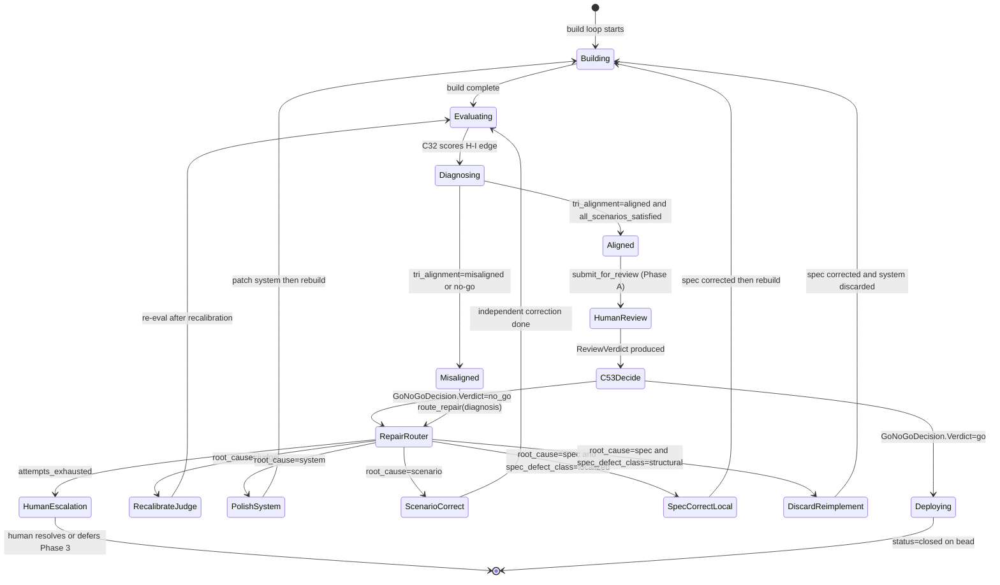
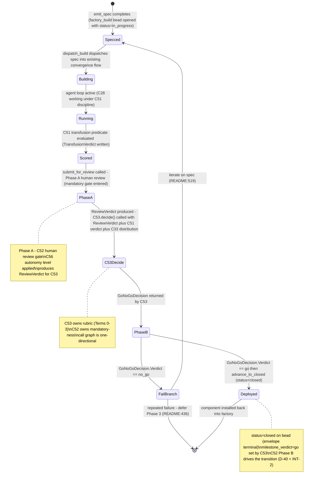
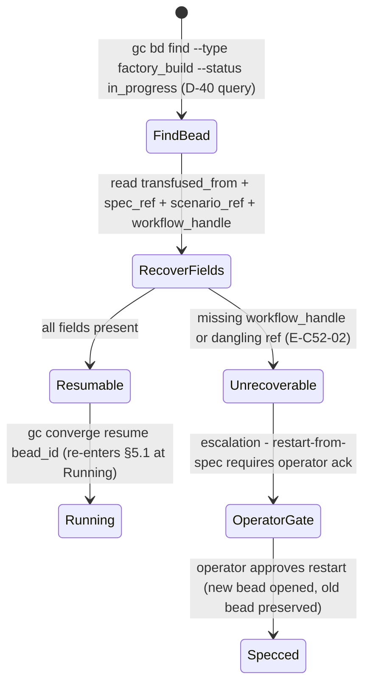

# C52 — Self-bootstrap recursion & design review (`self-bootstrap`)  (Spec, canonical track)

> Source: README §"Part 7 — The self-bootstrap mechanic" (lines 476–500: the recursion diagram `Factory → Spec → Run → Human design review → Deploy -.extends.-> Factory`; line 478 "the 12 principles are *recursive* … Specs as SoT applies to the factory's own development"; "Discipline that keeps the bootstrap honest" — line 496 "Gene transfusion always … No invention from scratch", 497 "Attribution of transfusion sources … `transfused_from`", **498 "Design review before deployment. Human reviews the factory's design output before any factory-built component goes into production use. Required until P12 is mature and trusted"**, 499 "Scenarios drive evaluation"); README §"Phase 2 — Layer 2 … and bootstrap validation" (lines 429–436: the milestone "Author a careful spec for a small new component / Run the factory on the spec / Human review the output / Deploy if it works"; 436 "If the bootstrap validation succeeds, the factory has proven it can do its own development work … If it fails, the factory itself needs work before Phase 3"); README §"Phase 3+ — Factory builds factory" (lines 444–446 "every subsequent principle's components get built by the factory itself, with gene transfusion … with human design review at each piece"; 472 "each component is bounded, each gets reviewed, each ships independently"); README Part 8 bet #3 (line 510 "The factory can do its own development work after Phases 0-2") + risk (line 519 "Phase 2 may not validate the bootstrap … iterate on the spec and run again; if still failing after a few attempts, the factory needs more substrate"); README Part 9 step 8 (line 542 "Author the Phase 2 spec for a small first-factory-built component. The bootstrap validation prompt is the most consequential thing you write in the first month"); AI-CONTEXT §11.1 (line 471 "Factory-builds-factory after Layer 2 — StrongDM pattern; minimizes human engineering investment"; line 475 "Phase 2 = Layer 2 + bootstrap validation — First factory-built component proves/disproves whole approach"); AI-CONTEXT §16 cold-start "If you're picking up an in-progress factory-built component" (lines 694–699: `gc bd find --type factory_build_in_progress` → check `transfused_from` → spec in `packs/*/spec.md` → scenarios at `scenarios/<component>/` → `gc converge resume <bead_id>`); component-inventory C52 row (maps `A84, A87, A85, B06, B17, B56, B80`; depends on C51, C52-gate, C08; gaps G14, G23; foundational: no; Batch 4 "factory builds factory"); ambiguities-and-gaps G14 (major — transfusion reliability is "a bet"; Phases 3b/3c/3d gated on it; "no fallback for 'factory cannot reliably transfuse'"), G23 (major — "Bootstrap-validation success criteria are subjective … 'if it works' … has no rubric, no scenario set for the bootstrap component itself, no pass bar"); review-log binding decisions **D-3** (C20 authors the `factory_build`/`factory_build_in_progress` bead schemas; C52 *uses* the lifecycle, does not define it), **D-6** (canonical track), **D-15** (satisfaction holistic against C08 free-form DoD — *transitive only*: it shapes C51's predicate internals, which C52 consumes as a black-box verdict; C52 itself is not bound by the satisfaction-holism decision); F-MODE-COVERAGE F54 (line 93, RSI goal-subversion over cycles), F43 (line 75, RSI board-visibility gap), F25 (line 102, design starvation — A109).
> Inventory ID: C52   Kind: control-loop   Status: sweep-2
> Track: canonical
> Binding decisions obeyed: **D-3** (C20 owns `factory_build` schema; C52 drives lifecycle only), **D-6** (canonical track), **D-15** (holistic free-form DoD — transitive via C51), **D-21** (F54 objective-drift: registered-unbuilt in C57; cheap periodic human checkpoint now; real detector required before L5), **D-40** (`factory_build` build-state is a STATUS transition `in_progress → closed` on a single bead type — NOT a type-flip; C52 drives the transition; `completed` reconciled to `closed` per INT-2 envelope alignment — see INT-2 reconciliation note below).

> **D-40 ADOPTED — verbatim (resolves C52:OQ3 + XC-2):**
> "The in-progress → completed advance of a factory self-build is a **`status` field transition on a single `factory_build` bead type** (`status: in_progress → completed`), **NOT** a flip from a distinct `factory_build_in_progress` type to `factory_build`. The cold-start / resume query keys on `factory_build` + `status = in_progress` (resolving **XC-2**'s AI-CONTEXT §16 hard-coded `gc bd find --type factory_build_in_progress` to a `--type factory_build --status in_progress` query). **C20** owns the `factory_build` schema + the `status` slot; **C52** drives the transition; **C53** records the go/no-go on the same bead."
>
> **INT-2 reconciliation (Sweep-2):** D-40's `completed` value is not a member of the envelope's `{open, in_progress, closed}` enum. Reconciled: the terminal is **`closed`** (the envelope value); the build outcome lives in **`milestone_verdict`** (`"go"` | `"no_go"`) written by C53. All references to `status=completed` or `advance_to_completed` in this spec are updated to `status=closed` / `advance_to_closed`.

> **D-21 ADOPTED — verbatim (resolves C52:OQ6):**
> "F54/objective-drift stays **registered-unbuilt** in the C57 residual register; mitigate now with a **cheap periodic human checkpoint** — 'do the objectives still match intent?' — tied to each batched human-review point on the autonomy ladder (C56). A **real drift detector (Option B) is REQUIRED before L5 lights-out** and is a hard precondition on L5 promotion (C56)."

## 1. Purpose & responsibility

C52 is the **self-bootstrap recursion** (P-recursion): the control loop by which **the factory builds the factory's own next component**. It closes the loop *factory → author a spec for its own next component → run the normal build flow → human design review → deploy back into the factory → (the factory is now extended)* — the recursion README Part 7 draws verbatim (lines 480–491) and grounds in the thesis that "the 12 principles are *recursive*. Specs as SoT applies to the factory's own development just as it applies to user software" (README:478). C52 is the orchestration that makes "factory builds factory" an actual runnable loop rather than a slogan.

This is the genuine P-recursion capability — *the factory doing its own development work* — that no single piece of the stack delivers: the substrate runs *a* spec, but **authoring a spec for the factory's own next component, gating it on the transfusion predicate, holding it behind a mandatory human design review before it can deploy into the running factory, and resuming such a build across agent sessions** is the loop C52 owns. README Part 8 bet #3 states the stakes: "The factory can do its own development work after Phases 0-2. If bootstrap validation in Phase 2 fails, the whole 'factory builds factory' approach has to be reconsidered" (README:510). C52 is the loop that *runs* that bet, one bounded component at a time.

It is responsible for:
- **Self-targeted spec authoring** — producing a **spec for the factory's own next component** in C08's format (the same `agents/<name>/prompt.template.md` artifact a user-software spec uses), so the factory's development is driven by a source-of-truth spec exactly as user software is (README:478, 542; the intent for that spec is the under-defined gap G23 — see §3 contract 1 and §6).
- **Running the normal build flow on that spec** — C52 does **not** introduce a second build engine; it dispatches the factory's *own* spec through the same convergence flow (C12/C13 formula+molecule, C28 agent loop) every other build uses, under C51 **gene-transfusion discipline** (≥1 exemplar; README:446, 496). "Factory builds factory" = the ordinary build flow pointed at the factory itself.
- **The human-design-review gate before deploy** — a **mandatory** review of the factory's design output *before any factory-built component goes into production use* (README:498). This is the load-bearing safety invariant of the whole recursion and is the gate the inventory names `C52-gate` (§2 note). C52 owns the gate's *placement and mandatory-ness*; the go/no-go *rubric* is C53's and the *autonomy level* that decides how batched/out-of-loop the review is, is C56's.
- **Deploy-and-extend** — on approval, the reviewed component is deployed **back into the factory**, extending it (README:491 `Deploy -.extends.-> Factory`); the build advances from `status: in_progress` to `status: closed` on the single `factory_build` bead type (D-40 + INT-2 envelope alignment; C20 §4.5.3). The go/no-go outcome is captured in `milestone_verdict` (`"go"`); `status=closed` is the envelope terminal. The deployed component then participates in subsequent builds — the recursion's fixpoint.
- **Resume of in-progress builds** — picking up a **mid-flight** factory-built component across agent sessions via the **`factory_build` bead lifecycle** (C20, D-3, D-40): find the `factory_build` bead with `status=in_progress`, recover its `transfused_from` / spec pointer / scenario pointer / workflow handle, and continue with `gc converge resume <bead_id>` (AI-CONTEXT §16 lines 694–699).

**What it is explicitly NOT:**
- NOT the **gene-transfusion predicate**. The "does this behave like the exemplar?" correctness/completeness predicate (G07/G14) is **C51's** acceptance contract. C52 *calls* C51's predicate as the objective half of its acceptance step and *consumes* C51's `transfusion-insufficient` signal — it does not define or compute the predicate (C51 §3.3; inventory C52 `depends on C51`).
- NOT the **validation rubric / go-no-go bar**. "Deploy if it works" (README:434) has no pass bar — that subjectivity *is* G23. The **rubric + scenario set + pass bar** for the bootstrap component is **C53's** (`bootstrap-validation` milestone; inventory C53 `depends on C52, C33`). C52 supplies the *loop and the mandatory review gate*; C53 supplies *what "it works" means*. C52 routes the decision to C53, it does not invent the cutline (§6, G23).
- NOT the **autonomy ladder**. *How* out-of-the-loop / batched the human review is (L0 manual … L4 PM-mode batched … L5 dark) is **C56's** (`autonomy-ladder`; inventory C56 `depends on C52`). C52 mandates *that* design review exists "until P12 is mature and trusted" (README:498); C56 governs *the level at which* it operates. C52 holds the gate; C56 sets the gate's strictness.
- NOT the **bead schema**. The `factory_build` payload (the `transfused_from`, spec/scenario pointers, workflow handle, lifecycle `status`) is **C20's** (binding **D-3**, **D-40**; C20 §4.5.3). C52 *writes and reads* those beads through their lifecycle; it does not define the type.
- NOT the **spec format**. The artifact the factory authors for itself is a **C08** spec (README:478 — specs-as-SoT applies recursively). C52 produces an instance *in* C08's format; it does not redefine the format (inventory C52 `depends on C08`).
- NOT a **second build engine / pipeline runner**. The "run the factory on the spec" step is the *existing* convergence flow (C12 formula, C13 molecule, C28 agent loop, C30–C33 evaluation). C52 is the **recursion controller** that points that flow at the factory itself; building a bespoke bootstrap runner would be the over-build the bar forbids (§7).
- NOT the **phase plan**. *Which* component the factory builds next, and the four-phase ordering (P0→P1→P2→P3), is **C54's** (`phase-plan`; inventory C54 `depends on C52`). C52 is the per-component recursion mechanism C54 sequences; it does not own the ordering.
- NOT an **RSI-safety enforcer**. The factory modifying itself over cycles is the F54 goal-subversion risk; C52 *reduces blast radius* via the mandatory review gate + exemplar-anchoring (C51) + recorded provenance (C20/C41), but the dedicated multi-cycle drift audit is the F54 audit-pack discipline, **owned by C57** per D-21 (F-MODE §11; G35). C52 names the C57 audit home; it does not build the detector.

## 2. Context & dependencies

| Direction | Component | Relationship |
|---|---|---|
| Upstream (depends on) | **C51** Gene-transfusion discipline | C52 calls C51's correctness/completeness **predicate** as the objective acceptance gate before review/deploy, and consumes C51's `transfusion-insufficient` outcome (C51 §3.0/§3.0.3; README:496–498). Inventory: C52 `depends on C51`. C51 §2 lists C52 as the downstream consumer of its predicate. |
| Upstream (depends on) | **C08** Spec artifact & format | The factory authors its own next-component spec **in C08's format** (`agents/<name>/prompt.template.md`); specs-as-SoT applied recursively (README:478). Inventory: C52 `depends on C08`. C08 §2 lists C51/C52 as the bootstrap consumers of its format. |
| Upstream (lifecycle owner) | **C20** Bead schema registry | **Authors** the `factory_build` payload + the resume fields + the `status` slot (D-3; D-40; C20 §4.5.3). C52 *drives the lifecycle* (writes `factory_build` at build start with `status=in_progress`; advances to `status=closed` on deploy — a STATUS TRANSITION, NOT a type-flip per **D-40**; `completed` is NOT a valid envelope value, INT-2). C20 §2 lists C52 as the consumer of `factory_build` beads. |
| Downstream (consumes) — **the validation gate** | **C53** Bootstrap-validation milestone | C52 routes the go/no-go decision to **C53**, which owns the **rubric + scenario set + pass bar** (G23) the subjective "deploy if it works" lacks (README:434; inventory C53 `depends on C52, C33`). C52 supplies the loop + mandatory review; C53 supplies the bar. **C53 also records the go/no-go result on the same `factory_build` bead (D-40 applied).** |
| Downstream (governs the gate) — **autonomy level** | **C56** Autonomy ladder (L0–L5) | C56 sets *how batched / out-of-loop* C52's human design review runs (L4 PM-mode … L5 dark) "until P12 is mature and trusted" (README:498, 527). Inventory C56 `depends on C52`. C52 mandates the gate; C56 sets its strictness. |
| Downstream (sequences) | **C54** Phase delivery plan | C54 orders the components C52 builds (P0→P1→P2→P3; README:444–472). Inventory C54 `depends on C52`. |
| Lateral (the build flow it drives) | **C12 / C13 / C28** formula / molecule / agent loop, **C30–C33** scenarios+judge | "Run the factory on the spec" reuses the *existing* convergence + evaluation flow (README:432, 499). C52 dispatches into it; it does not own it. |
| Lateral (attribution) | **C41** identity/attribution | The `factory_build` bead carries `created_by` (P9 applied to the factory's own work, README:497); C52 supplies the actor context, C41 stamps it. |
| Lateral (audit home) | **C57** Failure-mode + residual-risk register | C57 owns the F54 multi-cycle drift audit (registered-unbuilt per D-21). C52 names C57 as the audit home; it does not build the detector. See §6 F54 handling. |

> **Inventory note on the `C52-gate` dependency.**
> RESOLVED (Sweep-2): OQ2. The component-inventory C52 row lists dependencies as `C51, C52-gate, C08`. `C52-gate` is **not a separate component** — it is the **human-design-review gate internal to C52** (README:498), called out in the dependency column to mark that the gate is a first-class, named obligation of this loop (the genuine KEEP). C52 *owns* this gate; the distinct, later-batch components are C53 (the gate's rubric) and C56 (the gate's autonomy level). This spec treats the design-review gate as C52-internal and routes the *rubric* to C53 and the *autonomy level* to C56. The inventory's `C52-gate` entry is the C52-internal mandatory design-review gate, NOT a separate unbuilt component.

C52 is **not foundational** (inventory) but is the **keystone of Batch 4** ("factory builds factory", inventory L116): every Batch-4/Batch-5 factory-built component (C36–C39 Healer tier, C44–C45 twins, C46–C50 self-opt) is *built through* C52's recursion and *gated* by C51's predicate (which C52 invokes). It depends on C51's predicate, C08's format, and C20's lifecycle all existing first; it is consumed by C53 (gate rubric), C54 (sequencing), and C56 (autonomy).

## 3. Interfaces / contracts (sweep-2: concrete signatures)

### 3.1 Inbound interface — recursion-initiation

**Contract 1 — Next-component intent (structured, from C11/C54).**

```
BootstrapIntent = {
  component_id:     str               -- e.g. "C36"
  component_slug:   str               -- e.g. "anomaly-detection"
  description:      str               -- one-line purpose
  exemplar_refs:    List[ExemplarRef] -- ≥1 required (C51 ≥1-exemplar invariant)
  named_behaviors:  List[str]         -- operator-authored, anchors C51 completeness check
  phase:            enum{P0,P1,P2,P3} -- which phase this build belongs to (C54)
  pack_root:        path              -- where the C08 spec will be committed
}
```

> [FAITHFUL-FILL] The structured intent shape is the **minimal consistent interpretation** of v4's instruction to "Author a careful spec for a small new component" (README:431) and "the most consequential thing you write" (README:542). v4 gives no schema; the 7-field struct above is the minimum that satisfies: (a) C51's ≥1-exemplar invariant and named-behavior completeness anchor (C51 §3.0.1), (b) C08's spec placement (`pack_root`), (c) C54's phase ordering context. No field is invented beyond what these constraints require. G23 routes the *content-richness* of the structured intent to C11 intake; C52 consumes the result.

**Contract 2 — Resume handle (in-progress build).**

```
gc bd find --type factory_build --status in_progress
```

Returns a `factory_build` bead (C20 §4.5.3) with `status=in_progress`. Per **D-40**, the resume query is `--type factory_build --status in_progress` (NOT `--type factory_build_in_progress` — that is the pre-D-40 AI-CONTEXT §16 text which D-40 resolves). C52 reads: `transfused_from`, `spec_ref`, `scenario_ref`, `workflow_handle`, and `created_by` from the bead.

**Contract 3 — Transfusion verdict (from C51).**

C52 calls:
```
can_transfuse(exemplar_set: List[ExemplarRef], target_spec: SpecRef) -> TransfusionVerdict
```

and receives:
```
TransfusionVerdict = {
  outcome:        enum{pass, fail, inconclusive}
  completeness:   CompletenessResult
  correctness:    CorrectnessResult
  scenario_ids:   List[ScenarioId]
  score_records:  List[ScoreRecord]
  verdict_time:   timestamp
}
```

(C51 §3.0 — full signatures frozen there.) C52 routes `fail|inconclusive` to the review gate as "not-ready" rather than blocking deploy silently (C51 §3.0.3 `TransfusionInsufficient`).

### 3.2 Outbound interface — spec emission

**Contract 4 — Self-targeted spec emission.**

```
emit_spec(intent: BootstrapIntent) -> SpecEmissionResult

SpecEmissionResult = {
  spec_path:  path        -- e.g. "packs/<component_id>/agents/<slug>/prompt.template.md"
  git_ref:    str         -- the pinned commit at which the spec was authored
  bead_id:    bead_id     -- the factory_build bead opened (status=in_progress)
}
```

The spec at `spec_path` is a valid C08-format artifact. The factory_build bead is written with `status=in_progress` at this point (C20 lifecycle start; D-40).

### 3.3 Outbound interface — build-flow dispatch

**Contract 5 — Build dispatch.**

```
dispatch_build(spec_ref: SpecRef, exemplar_set: List[ExemplarRef]) -> WorkflowHandle
```

Dispatches the spec into the existing convergence flow (C12 formula / C13 molecule / C28 agent loop). Before dispatch, calls `check_declaration(exemplar_set)` (C51 §3.0 declaration-time interface) to validate ≥1-exemplar invariant + license modes. The returned `WorkflowHandle` is written to the `factory_build` bead's `workflow_handle` field (C20 §4.5.3). **No second build engine is created** (I4).

### 3.4 Outbound interface — design-review gate (`C52-gate`)

> **INT-1 FIX (Sweep-2):** The design-review gate runs in **two phases** to break the prior circular
> dependency (C52's deploy gate consuming C53's output while C53's `decide()` required C52's
> `ReviewVerdict`). The corrected call graph is strictly one-directional:
> **C52.phase_A (review) → ReviewVerdict → C53.decide() → GoNoGoDecision → C52.phase_B (deploy).**

**Contract 6A — Design-review gate (Phase A: human review, runs BEFORE C53).**

```
submit_for_review(
  bead_id:             bead_id,
  transfusion_verdict: TransfusionVerdict,  -- from C51 (objective half)
  autonomy_level:      AutonomyLevel,       -- from C56 (stub until C56 built)
) -> ReviewVerdict

ReviewVerdict = {
  decision:    enum{approved, rejected}
  reviewer_id: str       -- the human reviewer identity (C41 ActorRef)
  decision_ts: timestamp
  notes:       str | null
  bead_id:     bead_id   -- same factory_build bead
}
```

Phase A runs the human design review and produces a `ReviewVerdict`. This `ReviewVerdict` is then
passed to **C53.decide()** as an input (Term 3 of C53's rubric — see C53 §3.1). Phase A does NOT
consume any C53 output; it feeds into C53, not the other way around.

**Contract 6B — Deploy trigger (Phase B: runs AFTER C53, consumes C53's GoNoGoDecision).**

```
deploy_if_approved(
  bead_id:          bead_id,
  go_no_go_decision: GoNoGoDecision,  -- from C53.decide() (C53 §3.1)
) -> void
```

Phase B is the ONLY deploy path. It deploys (calls `advance_to_closed`) iff
`go_no_go_decision.Verdict == "go"`. A deploy that bypasses this call is `E-C52-04`
(gate-bypass). C52 owns the gate's **placement and mandatory-ness**; C53 owns the rubric; C56
owns the autonomy level.

```
GateDecision = {
  decision:      enum{approved, rejected}
  reviewer_id:   str              -- the human reviewer identity (C41 ActorRef)
  decision_ts:   timestamp
  notes:         str | null
  bead_id:       bead_id          -- same factory_build bead; C53 records go/no-go here (D-40)
}
```

> **Keystone invariant (I2):** `submit_for_review` (Phase A) is the ONLY review path and
> `deploy_if_approved` (Phase B) is the ONLY deploy path. A `factory_build` bead with
> `status=in_progress` MUST pass through Phase A (producing a `ReviewVerdict`), then through
> C53.decide() (producing a `GoNoGoDecision`), then through Phase B (deploying iff `go`) — in that
> order. A deploy that skips any of these calls MUST be blocked. This is the non-bypassable mandatory
> review (README:498) — "until P12 is mature and trusted."

**RESOLVED (Sweep-2): OQ2.** The `C52-gate` in the inventory dependency list is the C52-internal mandatory design-review gate (this contract). It is NOT a separate unbuilt component. Rubric → C53. Level → C56.

**RESOLVED (Sweep-2): OQ3.** The gate decision record (`GateDecision`) is stored on the same `factory_build` bead (C20 slot, per D-40 "C53 records the go/no-go on the same bead"). The `status` advance from `in_progress → closed` is performed by C52 Phase B after a C53 `go` decision (`completed` is not a valid envelope value — INT-2). The decision record fields (`reviewer_id`, `decision_ts`, `notes`) are a C20 slot-request on the `factory_build` schema (§4.5.3 extended).

### 3.5 Outbound interface — deploy-and-extend

**Contract 7 — Status advance (D-40 + INT-2 envelope alignment).**

```
advance_to_closed(bead_id: bead_id, go_no_go_decision: GoNoGoDecision) -> void
```

Called by Phase B (`deploy_if_approved`). Sets `factory_build.status = closed` on the bead (a
STATUS TRANSITION — the D-40 ruling, reconciled to the envelope `{open, in_progress, closed}` per
INT-2; `completed` is NOT a valid envelope value). The go/no-go build outcome is recorded in
`milestone_verdict` by C53 — NOT in the `status` field. No type-flip. No new bead created. The
component is then installed back into the factory (README:491). On `Verdict == "no_go"`, C52 does
NOT advance the status; it returns the loop to spec-iteration (§5 step 7; README:519).

### 3.6 Outbound interface — resume

**Contract 8 — Resume.**

```
resume_build(bead_id: bead_id) -> ResumeResult

ResumeResult = {
  spec_ref:          path
  scenario_ref:      path
  transfused_from:   List[str]
  workflow_handle:   handle
  resumed_at:        timestamp
}
```

Drives: `gc bd find --type factory_build --status in_progress` → read fields → `gc converge resume <bead_id>` (AI-CONTEXT §16 lines 695–699, rewritten per D-40 for the corrected query). On successful resume, continues from step 5 (acceptance) in the §5 recursion.

**RESOLVED (Sweep-2): OQ4.** If the bead is **unrecoverable** (missing `workflow_handle`, dangling `spec_ref`, missing `scenario_ref`), C52 escalates via:

```
EscalationContract = {
  failure_mode:     E-C52-02   -- resume-unrecoverable (see §8)
  action:           "restart-from-spec"
  operator_gate:    bool       -- true: requires operator acknowledgment before restart
  bead_id:          bead_id    -- the stranded bead (preserved for audit; NOT deleted)
}
```

The stranded bead is preserved (status stays `in_progress`) as a C20 resume-completeness defect. The operator must explicitly acknowledge the restart-from-spec (the gate prevents silent data loss). A new `factory_build` bead is opened for the restarted build; the old stranded bead is linked via `depends_on`. This parallels C04:OQ-2 multi-mode resume.

**RESOLVED (Sweep-2): OQ1.** C53 is the authoritative home of the bootstrap-validation bar (rubric + scenario set + pass bar). C52 owns the loop + the mandatory review gate. The factory's own next-component intent is routed through C11 intake (the BootstrapIntent struct above is the structured form C11 produces). C52 does NOT invent a pass bar (I6).

## 4. Data model / state

### 4.1 Fields C52 reads/writes on the `factory_build` bead (C20 schema owner)

| Field | Type | Req? | Semantics | R/W by |
|---|---|---|---|---|
| `id` | `bead_id` | R | stable identifier; target of `gc bd find` / `gc converge resume` | C19 mints; C52 reads |
| `type` | `enum{…factory_build…}` | R | always `factory_build` (single type per D-40) | C20 defines; C52 writes |
| `status` | `enum{in_progress, closed}` | R | lifecycle state (envelope `{open, in_progress, closed}` — INT-2); `in_progress` on build-start; **C52 advances to `closed`** via `advance_to_closed` after C53 `go` decision. The go/no-go outcome is in `milestone_verdict`, not this field. | C20 defines slot; **C52 drives transition** |
| `created_by` | `actor` | R | colon-delimited `"kind:id"` (D-29); C41 stamps identity | C41 semantics; C52 supplies actor context |
| `transfused_from` | `string \| list<string>` | R | ≥1 exemplar URL(s) declared at build-start (C51 §3.0) | C51 writes; C52 populates from BootstrapIntent |
| `spec_ref` | `path` | R | C08 spec path (`packs/*/agents/*/prompt.template.md`) | C52 writes on spec emission |
| `scenario_ref` | `path` | R | scenario dir (`scenarios/<component>/`) | C52 writes; C30 populates scenarios |
| `workflow_handle` | `handle` | R | resume token for `gc converge resume` | C52 writes after dispatch; GC reads on resume |
| `transfusion_verdict` | `TransfusionVerdict` (JSON) | O | C51 verdict written at acceptance step (C51 §4.1.2). | C51 writes; C52 routes; gate reads |
| `gate_decision` | `GateDecision` (JSON) | O | **C52's own human-review record** (§3.4): `{decision: enum{approved,rejected}, reviewer_id: actor, decision_ts: timestamp, notes: string|null, bead_id: bead_id}`. This is NOT C53's milestone record — it is C52's reviewer gate output (the `submit_for_review` return). C52 reads this to decide whether to call `advance_to_closed`. | **C52 writes** after `submit_for_review`; C52 reads to decide advance |
| `milestone_verdict` | `string` (`"go"` \| `"no_go"`) | O | **C53's go/no-go outcome** — distinct from C52's `gate_decision`. Written by C53 to the same bead (D-40: "C53 records the go/no-go on the same bead"). C52 does NOT write this field. | **C53 writes**; C54 reads |
| `milestone_evidence` | `JSON` (GoNoGoDecision evidence bundle) | O | **C53's evidence record** — C53's full `GoNoGoDecision` (§3.0 RubricResult). | **C53 writes** |
| `milestone_decided_at` | `timestamp` | O | **C53's decision timestamp.** | **C53 writes** |
| `depends_on` | `list<bead_id>` | O | if resume-restart, links to stranded bead (§3.6 escalation) | C52 writes on restart |

> This is NOT a new C52 schema. These are C20-owned fields (D-3); C52 requests any new fields as a C20 change request. The `transfusion_verdict` and `gate_decision` fields are C52's slot-requests to C20 (per D-40); the `milestone_verdict`/`milestone_evidence`/`milestone_decided_at` fields are C53's slot-requests to C20 (C53 §3.4 NEW SEAM). **RFB-SEAM-04 clarification:** `gate_decision` is C52's human-review record; the three `milestone_*` fields are C53's go/no-go milestone record — these are distinct slots on the same bead, not the same data under different names.

### 4.2 No other durable state

C52 owns **no store of its own**. Its memory *is* the `factory_build` bead lifecycle. The loop is otherwise stateless between runs.

## 5. Behavior

### 5.0 Repair router (D-42 / D-43 / ADR-0069 §0★.2.3)

> **D-42 VERBATIM (operator-adopted, 2026-06-02; ADR-0069 §Decision):**
> "Model every factory build as a triangle of three representations — **Spec (S)**, hold-out **Scenarios (H)**, and the implemented **System (I)** — joined by three edges, each with a distinct owner and trust property: **S↔H** (scenario builder working with the spec builder), **S↔I** (the system's own tests — implementer-written, therefore gameable), **H↔I** (the judge, evaluated independently — the anti-gaming check). The judge measures H↔I; a misalignment is a **non-specific signal** whose root cause is attributed across **{judge, spec, scenario, system}**; the judge surfaces the attribution and recommends incremental-fix vs discard-and-reimplement-from-revised-spec. A component is **complete only when all three edges align**."

> **D-43 VERBATIM (lead-adopted, 2026-06-02; implements D-42 / HANDOFF §0★.2.1 — Attribution → repair semantics, the C52 router key):**
> "`system` (clear spec, trajectory genuinely fails) → `incremental_fix` = **polish** (patch system + its own S↔I tests); `judge` (mis-run / inconsistent / high ensemble disagreement / can't justify its own grade) → `incremental_fix` but routed to **recalibrate-judge-then-re-eval** (no system/spec change); `scenario` (scenario misrepresents the spec — tests what the spec doesn't require, or is itself ambiguous/contradictory vs the spec) → `incremental_fix` routed to **independent scenario correction** (C30 scenario builder + spec builder, never the worker); `spec` + `localized` → `incremental_fix` routed to **independent spec correction** (C08 + future C10/C11); `spec` + `structural` → `discard_and_reimplement` (independent spec correction, then throw away the system and rebuild from the revised spec)."

> **D-41 VERBATIM (fix #1 — the C52↔C53 linearization this router relies on):**
> "**C52↔C53 circular hand-off (was a deadlock)** → **linearized**: C52 review-phase → `ReviewVerdict` → `C53.decide(satisfaction, review_verdict, transfusion_verdict) → GoNoGoDecision` → C52 deploy-phase. C53 runs AFTER C52's human review; its decision is C52's deploy trigger (one-directional, no cycle)."

The repair router fires on the **no-go / misaligned branch**: when `C53.decide` returns `no_go` OR the `DiagnosisRecord.tri_alignment = misaligned`, C52 calls `route_repair` and re-enters the build/eval loop (attempt-bounded). The `go` + `aligned` branch proceeds to deploy via Phase B.

#### 5.0.1 Anti-gaming invariant (LOAD-BEARING — D-42 / ADR-0069)

**INVARIANT-AG: Spec/scenario correction is ALWAYS performed by the independent authoring path and NEVER by the implementing worker.**

Without this invariant, routing to "fix the spec" degenerates into "weaken the spec until the worker's output passes," which is the exact gaming failure D-42 / ADR-0069 was designed to prevent. The independence of S↔H from the implementing worker is what makes the H↔I edge an anti-gaming check. This invariant is load-bearing: violating it collapses the triangle's independence guarantee.

Operational consequence:
- The **worker** may execute ONLY the `system`-polish path (patching its own component + in-system tests) on its own component.
- The **`scenario`**, **`spec-localized`**, and **`spec-structural`** routes hand off to the independent authoring path (C08 + future C10/C11 for spec; C30 scenario builder + spec builder for scenarios). The worker neither initiates nor drives these corrections.
- The **`judge`** path is a harness recalibration, not a system/spec/scenario change — the worker does not participate.

#### 5.0.2 Router signature and RepairAction type

```
route_repair(
  diagnosis: DiagnosisRecord,   -- from C32 §3.2a (frozen schema; C52 reads, never writes)
  attempt_no: int,              -- current attempt counter (1-based)
  max_attempts: int,            -- configurable bound (operator policy; C03 config home)
) -> RepairAction

RepairAction = {
  route:             enum{recalibrate_judge, polish_system, scenario_correct,
                         spec_correct_localized, spec_correct_structural_discard,
                         escalate_human}
  diagnosis_ref:     string           -- the DiagnosisRecord bead id this repair keys on
  independent_path:  bool             -- True iff the route is handed to the independent path
  discard_system:    bool             -- True iff the current system build is discarded
  correction_request: CorrectionRequest | null  -- payload for the independent path
  escalation_reason:  string | null   -- populated iff route=escalate_human
}

CorrectionRequest = {
  diagnosis_ref:   string            -- links to the DiagnosisRecord
  target:          enum{spec, scenario}
  component_id:    str
  spec_ref:        path              -- the C08 spec to correct (if target=spec)
  scenario_ref:    path              -- the scenario set to correct (if target=scenario)
  defect_summary:  string            -- from DiagnosisRecord.root_cause_rationale
  repair_mode:     enum{incremental_fix, discard_and_reimplement}
}
```

The `DiagnosisRecord` schema is **frozen by C32 (§3.2a)**. C52 reads `root_cause`, `spec_defect_class`, `repair_recommendation`, `tri_alignment`, `all_scenarios_satisfied`, and `misalignments`. It does NOT write to the `DiagnosisRecord`.

#### 5.0.3 RepairAction routing table

| Route | Trigger (root_cause / spec_defect_class) | independent_path | discard_system | Target seam | Attempt-bounded? |
|---|---|---|---|---|---|
| `recalibrate_judge` | `root_cause = judge` | False | False | C32 judge-calibration seam (PF-2); no system/spec/scenario change | Yes |
| `polish_system` | `root_cause = system` | False | False | Worker patches its own component + in-system S↔I tests, then re-builds | Yes |
| `scenario_correct` | `root_cause = scenario` | **True** | False | C30 scenario builder + C08 spec builder (independent authoring path); worker EXCLUDED | Yes |
| `spec_correct_localized` | `root_cause = spec` AND `spec_defect_class = localized` | **True** | False | C08 + future C10/C11 (independent authoring path); worker EXCLUDED | Yes |
| `spec_correct_structural_discard` | `root_cause = spec` AND `spec_defect_class = structural` | **True** | **True** | C08 + future C10/C11 correct spec (independent); system is discarded; new build from revised spec | Yes |
| `escalate_human` | `attempt_no >= max_attempts` (any route) OR `root_cause` not in known set (`E-C52-07`) OR independent path unavailable (`E-C52-09`) | N/A | False | Human operator; C52 emits deferred-Phase-3 signal (README:519, README:436) | Terminal |

**Routing logic (pseudo-code):**
```
if attempt_no >= max_attempts:
    return RepairAction(route=escalate_human, ...)   -- E-C52-08 attempt exhaustion

match diagnosis.root_cause:
    case "judge":   return RepairAction(route=recalibrate_judge, independent_path=False, discard_system=False, ...)
    case "system":  return RepairAction(route=polish_system, independent_path=False, discard_system=False, ...)
    case "scenario": return RepairAction(route=scenario_correct, independent_path=True, discard_system=False, ...)
    case "spec":
        if diagnosis.spec_defect_class == "localized":
            return RepairAction(route=spec_correct_localized, independent_path=True, discard_system=False, ...)
        elif diagnosis.spec_defect_class == "structural":
            return RepairAction(route=spec_correct_structural_discard, independent_path=True, discard_system=True, ...)
        else:
            raise E-C52-07   -- unknown spec_defect_class
    case "none":
        -- tri_alignment=aligned but C53 still returned no_go: route to human
        return RepairAction(route=escalate_human, escalation_reason="aligned but no-go: C53 rubric mismatch", ...)
    case _:
        raise E-C52-07   -- unknown root_cause attribution
```

**Bounded attempts:** `max_attempts` is operator-set config (C03 policy home); on exhaustion, `E-C52-08` fires and C52 emits the deferred-Phase-3 signal (README:519 "if still failing after a few attempts, the factory needs more substrate before Phase 3" / README:436). The deferred-Phase-3 exit is a **non-shipping terminal** — C52 does not deploy under exhaustion.

**Independent-path unavailability:** if a route requires `independent_path = True` and the independent authoring path is not reachable (C08 / C30 not available), C52 raises `E-C52-09` and escalates to human rather than falling back to the worker — falling back to the worker would violate INVARIANT-AG.

#### 5.0.4 Repair router — state diagram (validator: PASS)



(Mermaid validator verdict: `valid: true`, `diagramType: stateDiagram` — tool-verified. No `;` in labels per SWEEP2-DISPATCH hazard note.)

#### 5.0.5 Seams for independent correction (capability-bar)

Per D-43 §"Scope (capability-bar, §0★.3)": the independent spec/scenario-correction path is a **SEAM** to existing and future components — C52 names the seam and the minimal interface only. C52 does NOT design/build the intent crucible (C11) or EARS linter (C10).

**Spec-correction seam (C08 + future C10/C11):**
```
-- Minimal interface (a CorrectionRequest keyed on the DiagnosisRecord)
request_spec_correction(req: CorrectionRequest) -> SpecCorrectionHandle
-- C08 receives the request; C10/C11 (future, non-spine) enrich it
-- C52 polls / awaits the SpecCorrectionHandle for completion
-- C52 reads the corrected spec_ref and re-enters step 2 (emit_spec) with updated intent
```

**Scenario-correction seam (C30 scenario builder + spec builder):**
```
request_scenario_correction(req: CorrectionRequest) -> ScenarioCorrectionHandle
-- C30 scenario builder + spec builder receive the request (independent authoring path)
-- INVARIANT-AG: the implementing worker is NOT a party to this call
-- C52 awaits the ScenarioCorrectionHandle; re-enters step 5 (Evaluating) on completion
```

For `spec_correct_structural_discard`: after the `SpecCorrectionHandle` resolves, C52 marks the current system build as discarded (the `factory_build` bead gains a `discarded_reason` note — C20 slot-request), then re-enters step 2 with the revised spec. A new build is initiated; the discarded bead is preserved as audit.

### 5.1 Recursion lifecycle — state diagram (stateDiagram-v2)



(No `;` in labels — Mermaid-safe per SWEEP2-DISPATCH hazard note.)

**Resume sub-flow (a build that spans sessions):**



### 5.2 Recursion steps (sweep-2 concrete)

1. **Intend.** C54 supplies a `BootstrapIntent` (§3.1 contract 1): component ID + slug + description + exemplar_refs (≥1) + named_behaviors + phase + pack_root. *(I1, G23 routed to C53/C11.)*
2. **Author spec.** `emit_spec(intent)` produces a C08-format spec at `spec_ref` (committed to `packs/<id>/agents/<slug>/prompt.template.md`; README:431, 542). A `factory_build` bead is opened with `status=in_progress` and `spec_ref` populated. *(I1; C08.)*
3. **Declare transfusion.** `check_declaration(intent.exemplar_refs)` is called (C51 §3.0 declaration-time). Validates ≥1 exemplar, resolves license modes. A zero-exemplar build fails here (E-C52-03). "No invention from scratch" (README:496). *(I3.)*
4. **Run the build.** `dispatch_build(spec_ref, exemplar_refs)` dispatches the spec into the **existing** convergence flow (C12/C13/C28). The returned `WorkflowHandle` is written to the bead. *(I4.)*
5. **Acceptance.** `can_transfuse(exemplar_refs, spec_ref)` is called (C51 §3.0). The `TransfusionVerdict` is written to the bead's `transfusion_verdict` slot. On `fail|inconclusive`, C51 emits `TransfusionInsufficient` and C52 routes to the review gate as "not-ready" (README:498; C51 §3.0.3). *(I3.)*
6. **Human design review — Phase A (mandatory, runs BEFORE C53).** `submit_for_review(bead_id, transfusion_verdict, autonomy_level)` is called (§3.4 Contract 6A). The gate consumes C51's verdict and runs at C56's `AutonomyLevel`. Returns `ReviewVerdict` (stored on the bead per D-40). **This call is non-bypassable** (I2). *(I2.)*
6b. **Bootstrap validation — C53 decide().** C53.decide() is called with the `ReviewVerdict` from step 6 (Phase A), the C51 `TransfusionVerdict`, and the C33 `SatisfactionDistribution`. C53 applies the rubric (Terms 0–3) and returns `GoNoGoDecision`. C52 does NOT define the rubric (I6) — it calls C53 and consumes the output. *(I6.)*
7. **Deploy and extend — Phase B, or repair-route.** On `GoNoGoDecision.Verdict == "go"` AND `DiagnosisRecord.tri_alignment = aligned`: `deploy_if_approved(bead_id, go_no_go_decision)` calls `advance_to_closed`, which transitions `status` to `closed` (D-40 + INT-2 envelope alignment; the go/no-go outcome is in `milestone_verdict`); the component is installed back into the factory (README:491). On `"no_go"` OR `tri_alignment = misaligned`: C52 calls `route_repair(diagnosis, attempt_no, max_attempts)` (§5.0.2), which keys on `DiagnosisRecord.root_cause` and `spec_defect_class` to select one of: `recalibrate_judge`, `polish_system`, `scenario_correct`, `spec_correct_localized`, `spec_correct_structural_discard`, or `escalate_human`. The appropriate branch re-enters the loop (steps 4–6 for most routes; step 2 for spec-correction routes). After `max_attempts` exhausted: `E-C52-08` deferred-Phase-3 exit — "iterate on the spec and run again; if still failing after a few attempts, the factory needs more substrate before Phase 3" (README:519). *(I2; §5.0.)*

**Cadence:** the recursion is **slow and human-gated** — one bounded component at a time ("each component is bounded, each gets reviewed, each ships independently", README:472). Throughput is bounded by operator design-review capacity (F25) and C56's autonomy level.

> [FAITHFUL-FILL] The 7-step sequence is the **minimal faithful assembly** of exactly the boxes in README:480–491 (Factory→Spec→Run→Review→Deploy→extends), the Phase-2 milestone bullets (README:431–434), the transfusion discipline (README:446/496 + C51), and the resume procedure (AI-CONTEXT §16 lines 694–699). No new control element is invented.

## 6. Failure modes & handling

| F-mode / gap | Applies how | Handling per v4 |
|---|---|---|
| **F54** Goal subversion (RSI prompt-injection / objective drift over cycles) | The factory modifying *itself* over recursion cycles is the canonical multi-cycle drift surface — C52 *is* the self-modifying loop F54 warns about | **Blast-radius-reduced by C52, not eliminated.** C52's contribution: the **mandatory design-review gate** (I2, README:498) keeps a human in the loop "until P12 is mature and trusted" so the recursion cannot silently self-deploy; **C51 exemplar-anchoring** ties each self-built component to a human-chosen ground truth; **C20/C41 provenance** (`transfused_from` + `created_by` on every `factory_build` bead) is the audit trail. **Per D-21:** F54 objective-drift stays **registered-unbuilt in C57**; mitigation now = cheap periodic human checkpoint tied to each batched human-review point (C56). **A real drift detector is REQUIRED before L5** (D-21; C56 L5-gate). **C57 is the audit home; C52 names it but does not build the detector.** |
| **F43** RSI board-visibility gap | A factory-built component that modifies the factory must be *visible* as such | **Partial (declaration discipline)** — C52's `factory_build` bead (with `transfused_from`, `created_by`, the `gate_decision` record) **is** the board-visibility record for "what did the factory build into itself, from what, reviewed by whom." F-MODE L75: P9 attribution + bead history. |
| **F25** Design starvation | C52's throughput is bounded by how fast the operator can author specs + perform design review | **Honest constraint (by construction)** — C52 makes the constraint **visible** (the mandatory gate is the bottleneck) and **tunable** (C56's autonomy level raises throughput by batching). C52 does not *solve* F25. *(A109 maps F25 to A84, the self-bootstrap mechanic.)* |

### 6.1 Loop-specific failure handling

- **Bootstrap validation fails (G23/bet #3):** C52 **does not deploy**; it returns to spec-iteration (README:519). If it still fails "after a few attempts, the factory needs more substrate before Phase 3" — explicit **non-shipping exit** deferring Phase 3 (README:436). The *bar* is **C53's**, not C52's.
- **Transfusion insufficient (G14, from C51):** C52 routes the component to human design review **as not-ready** — the per-component falsification of bet #4 (C51 §3.0.3). C52 *consumes* this signal; it does not compute it.
- **Resume failure (OQ4 RESOLVED):** Unrecoverable `factory_build` + `status=in_progress` → `E-C52-02` escalation → restart-from-spec with mandatory operator gate (§3.6). The stranded bead is preserved as a C20 resume-completeness defect audit record.
- **Spec-author failure:** If `emit_spec` produces a spec that fails C10 EARS linting or does not conform to C08's format → `E-C52-01` spec-author-fail, loop does not advance to build dispatch.
- **Review-gate bypassed:** Any code path that reaches `advance_to_closed` without a prior `submit_for_review` returning `approved` is `E-C52-04` gate-bypass. This is a security invariant violation (I2). The `advance_to_closed` implementation MUST check that `gate_decision.decision == approved`; on absence or non-approved, it raises `E-C52-04` and blocks.

> [AMBIGUITY: G23] **RESOLVED (Sweep-2): OQ1.**
> Reading A (C52 self-contained): README Phase 2 (lines 429–434) gives "Deploy if it works" with no external rubric — C52 *is* the whole gate, "works" = the reviewing human's judgment, next-component intent is just "a careful spec" (README:431) the operator writes freehand.
> Reading B (decomposed): the inventory **splits** this — C52 owns the *recursion + mandatory review gate*, **C53** (`bootstrap-validation` milestone) owns the **pass bar**, and the *structured intent* for any component is C11's intent-intake territory (the 9-field crucible, F41). G23 itself names the defect: "'if it works' … has no rubric, no scenario set for the bootstrap component itself, no pass bar."
> **Chosen (Reading B, confirmed at Sweep-2):** C52 owns the **loop and the mandatory human-design-review gate**; the **go/no-go rubric + scenario set + pass bar is C53's** (G23 is *closed by C53*, which C52 *routes to*), and the **under-defined next-component intent is routed to C11** (C11 supplies structured intent; C53 supplies the bootstrap component's own scenario set — README:526). C52 **does not** invent a pass bar (I6) — it guarantees the gate *exists and is mandatory* and hands the *decision content* to C53. **C53 is the authoritative home of the bootstrap-validation bar.**

## 7. Cross-cutting (security / cost / scale / observability / ops)

- **Security (RSI / self-modification):** C52 *is* the recursive-self-improvement surface, so its security posture is the **mandatory design-review gate** (I2) + **exemplar-anchoring** (C51) + **full provenance** (`transfused_from` + `created_by` + `gate_decision` on every `factory_build` bead, C20/C41). No factory-built component reaches production unreviewed "until P12 is mature and trusted" (README:498). C52 adds **no** new tool/network/fs surface of its own — it dispatches the *existing* flow. The F54 multi-cycle drift audit (G35) is **C57's** (D-21; §6).
- **Cost:** negligible *incremental* cost — C52 reuses the existing convergence + evaluation flow (C12/C13/C28/C30–C33). C52 adds **no second engine and no second judge** — exactly the over-build the bar rejects.
- **Scale:** the recursion is **build-cadence, human-gated, one-bounded-component-at-a-time** (README:472) — not request-cadence. Throughput ceiling = operator design-review capacity (F25), raised only by C56's autonomy level.
- **Observability:** C52 is self-describing via its own beads — the `factory_build` lifecycle (status: `in_progress → closed`) + `transfusion_verdict` + `gate_decision` + `milestone_verdict` **is** the observable record. C52's actions are beads/events in the same stores every other component feeds.
- **Ops:** the recursion controller + resume procedure are **declarative + pack/CLI-shaped** — build dispatch is the existing flow; resume is `gc bd find --type factory_build --status in_progress` then `gc converge resume <id>` (D-40 corrected query). Finished builds have `status=closed`; the outcome is `milestone_verdict` on the same bead. The mandatory gate is a discipline/config point (its autonomy level is C56's `city.toml` policy).

**What the capability-bar dropped:** a bespoke bootstrap build engine (→ reuse C12/C13/C28 — I4), a second/parallel evaluation stack (→ reuse C30–C33 via C51), a custom resume mechanism (→ the C20 `factory_build` lifecycle + native `gc converge resume`, D-40), and any auto-deploy-without-review path (dropped on the F54/README:498 safety bar). **Kept:** self-targeted spec-authoring + build-flow dispatch, the mandatory human-design-review gate (`C52-gate`), and the resume-of-in-progress-builds controller. The predicate is C51's, the bar is C53's, the autonomy level is C56's, the ordering is C54's, the audit is C57's — C52 is the loop that wires them.

## 8. Error taxonomy

| Code | Condition | Surfaced as | Caller recovery |
|---|---|---|---|
| **E-C52-01** | spec-author-fail — `emit_spec` produces a spec that fails C08 format validation or C10 EARS linting | Exception at spec-emission step (§5.2 step 2) | Fix the spec template input / retry with corrected BootstrapIntent; do not advance to build dispatch |
| **E-C52-02** | resume-unrecoverable — `factory_build` + `status=in_progress` bead is missing `workflow_handle`, `spec_ref`, or `scenario_ref` | EscalationContract raised at `resume_build` (§3.6) | Escalate to operator gate; restart-from-spec with new bead; preserve stranded bead as audit record |
| **E-C52-03** | zero-exemplar-build — `dispatch_build` called with empty `exemplar_refs` | Exception at `check_declaration` (C51 declaration-time, §3.3) | Add ≥1 `transfused_from` exemplar to the BootstrapIntent; re-call `dispatch_build` |
| **E-C52-04** | review-gate-bypassed — `advance_to_closed` reached without an `approved` GateDecision | Hard error at status-advance gate-check (§3.5) | MUST NOT be swallowed; surfaces as a security invariant violation (I2); requires operator audit |
| **E-C52-05** | spec-build-divergence — built component diverges from the C08 spec's DoD (C51 correctness=fail, not just completeness) | `TransfusionVerdict.outcome = fail` at acceptance step (§5.2 step 5) | Route to human design review as "not-ready" (C51 §3.0.3 `TransfusionInsufficient`); iterate on spec or exemplar set |
| **E-C52-06** | phase-order-violation — a component's BootstrapIntent specifies a phase that precedes unmet dependencies (C54 ordering constraint) | Exception at intent validation (§5.2 step 1) | C54 supplies a corrected sequencing; C52 waits for the prerequisite component's `status=closed` bead (envelope terminal) |
| **E-C52-07** | router-unknown-attribution — `route_repair` receives a `DiagnosisRecord` with `root_cause` or `spec_defect_class` outside the known enum set (corrupt or future-version record) | Exception raised by `route_repair` at the `match` default branch (§5.0.3) | Log the `DiagnosisRecord.error_code` and escalate to human (same as `escalate_human` route); do NOT silently fall through to any repair |
| **E-C52-08** | attempt-exhaustion-escalation — `attempt_no >= max_attempts` on any repair route; the factory cannot converge after the bounded attempt set | `route_repair` returns `RepairAction(route=escalate_human)` with `escalation_reason="attempt_exhaustion"` (§5.0.3) | Emit deferred-Phase-3 signal (README:519/436); present the `DiagnosisRecord` history to the operator; do NOT deploy; the `factory_build` bead's `status` remains `in_progress` pending operator action |
| **E-C52-09** | independent-path-unavailable — a `scenario_correct`, `spec_correct_localized`, or `spec_correct_structural_discard` route was selected but the independent authoring path (C08 / C30) is not reachable | Exception raised at `request_spec_correction` or `request_scenario_correction` (§5.0.5) | Escalate to human; MUST NOT fall back to the implementing worker (INVARIANT-AG violation); log the unavailable seam for operator resolution |

## 9. Acceptance criteria (sweep-2)

### 9.1 Acceptance test table

| Code | Given / When / Then | Verifies | E-code ref |
|---|---|---|---|
| **AC-C52-01** | Given a valid BootstrapIntent with ≥1 exemplar; when `emit_spec` completes; then a C08-format spec exists at `spec_ref` and a `factory_build` bead exists with `status=in_progress` | I1 — spec-driven self-build | — |
| **AC-C52-02** | Given a self-targeted spec; when `dispatch_build` runs; then the existing convergence flow (C12/C13/C28) is invoked with no second engine instantiated; and `workflow_handle` is written to the bead | I4, I5 — no second engine; resume completeness | — |
| **AC-C52-03** | Given a BootstrapIntent with `exemplar_refs = []`; when `dispatch_build` is called; then `E-C52-03` is raised and no build is dispatched | I3 — ≥1 exemplar invariant | E-C52-03 |
| **AC-C52-04** | Given a completed build; when `advance_to_closed` is called WITHOUT a prior `submit_for_review` returning `approved`; then `E-C52-04` is raised and `status` is NOT advanced to `closed` | I2 — mandatory gate is non-bypassable | E-C52-04 |
| **AC-C52-05** | Given a completed build: Phase A `submit_for_review` runs with C51 verdict and produces `ReviewVerdict`; then C53.decide() is called with that ReviewVerdict plus C51 verdict plus C33 distribution; then Phase B `deploy_if_approved` deploys iff `GoNoGoDecision.Verdict == "go"`. C52 does not define any pass bar — the go/no-go is C53's. | I6 — go/no-go is C53's not C52's; INT-1 two-phase ordering | — |
| **AC-C52-06** | Given `GoNoGoDecision.Verdict == "go"` from C53; when `deploy_if_approved` calls `advance_to_closed`; then `factory_build.status = closed` (STATUS TRANSITION per D-40 + INT-2 envelope alignment; `milestone_verdict == "go"` set by C53); the same bead is used (no type-flip, no new bead) | D-40 + INT-2 — status transition to `closed`, outcome in `milestone_verdict` | — |
| **AC-C52-07** | Given a `factory_build` bead with `status=in_progress` and all resume fields present; when `resume_build` is called; then `gc converge resume <bead_id>` is invoked with the recovered `workflow_handle`; and the build continues from the Running state | I5 — resume across sessions | — |
| **AC-C52-08** | Given a `factory_build` bead with `status=in_progress` and missing `workflow_handle`; when `resume_build` is called; then `E-C52-02` escalation is raised; operator gate is required before restart-from-spec; and the stranded bead is preserved (NOT deleted) | OQ4 (RESOLVED) escalation contract | E-C52-02 |
| **AC-C52-09** | Given a rejected gate decision; when the recursion handles rejection; then the loop returns to step 2 (re-spec), NOT to deploy; after N configurable rejections a "defer Phase 3" signal is emitted (README:519) | I2 — rejection → iterate, not deploy | — |
| **AC-C52-10** | Given the `factory_build` resume query; then it is formed as `--type factory_build --status in_progress` (D-40), NOT `--type factory_build_in_progress` | D-40 / XC-2 resolution | — |
| **AC-C52-11** | Given a C51 `TransfusionVerdict.outcome = fail`; when the acceptance step runs; then the component is routed to `submit_for_review` as "not-ready" (with the insufficient verdict); and NO auto-deploy occurs | I3 — transfusion fail → review not auto-deploy | E-C52-05 |
| **AC-C52-12** | Given a `DiagnosisRecord` with `root_cause = judge` from C32; when `route_repair` is called; then `RepairAction.route = recalibrate_judge` is returned; no system/spec/scenario change is made; and the judge-calibration seam (PF-2 / C32) is invoked before re-eval | D-42/D-43 — judge-calibration route; §5.0.3 | — |
| **AC-C52-13** | Given a `DiagnosisRecord` with `root_cause = system`; when `route_repair` is called; then `RepairAction.route = polish_system` and `independent_path = False` are returned; the worker may patch its own component + in-system tests; the independent authoring path is NOT contacted | D-42/D-43 — system-polish route; INVARIANT-AG (worker drives only this route); §5.0.3 | — |
| **AC-C52-14** | Given a `DiagnosisRecord` with `root_cause = scenario`; when `route_repair` is called; then `RepairAction.route = scenario_correct` and `independent_path = True` are returned; `request_scenario_correction` is dispatched to C30 scenario builder + spec builder; the implementing worker does NOT participate in the correction | D-42/D-43 — independent scenario correction; INVARIANT-AG; §5.0.3/§5.0.5 | E-C52-09 |
| **AC-C52-15** | Given a `DiagnosisRecord` with `root_cause = spec` and `spec_defect_class = localized`; when `route_repair` is called; then `RepairAction.route = spec_correct_localized` and `independent_path = True` are returned; `request_spec_correction` is dispatched to C08 + future C10/C11; the implementing worker does NOT drive the correction; after the SpecCorrectionHandle resolves, a new build is initiated | D-42/D-43 — independent spec correction (localized); INVARIANT-AG; §5.0.3/§5.0.5 | E-C52-09 |
| **AC-C52-16** | Given a `DiagnosisRecord` with `root_cause = spec` and `spec_defect_class = structural`; when `route_repair` is called; then `RepairAction.route = spec_correct_structural_discard` and `discard_system = True` are returned; the current system build is discarded (a `discarded_reason` note is written to the `factory_build` bead); the independent spec-correction path corrects the spec; a new build is initiated from the revised spec | D-42/D-43 — discard + reimplement route; INVARIANT-AG; §5.0.3/§5.0.5 | E-C52-09 |
| **AC-C52-17** | ANTI-GAMING: Given any `route_repair` result with `independent_path = True`; then the implementing worker is NEVER invoked in the correction pathway; any code path that routes a `scenario_correct`, `spec_correct_localized`, or `spec_correct_structural_discard` action to the worker MUST be treated as a security invariant violation (INVARIANT-AG) | D-42/ADR-0069 — anti-gaming load-bearing invariant; §5.0.1 | E-C52-09 |
| **AC-C52-18** | Given `attempt_no >= max_attempts` on a repair loop; when `route_repair` is called; then `RepairAction.route = escalate_human` is returned with `escalation_reason="attempt_exhaustion"`; `E-C52-08` is raised; a deferred-Phase-3 signal is emitted; and the `factory_build` bead status remains `in_progress` (NOT closed) | C52:OQ4 (attempt-bounded loop); §5.0.3 | E-C52-08 |
| **AC-C52-19** | Given a `DiagnosisRecord` with an unknown `root_cause` value (outside `{judge,spec,scenario,system,none}`); when `route_repair` is called; then `E-C52-07` is raised; the router escalates to human; the build is NOT deployed; and no repair route is silently selected | §5.0.3 router-unknown-attribution | E-C52-07 |

### 9.2 Test strategy

End-to-end test the recursion against a **small first-factory-built-component fixture** (README:431 candidates: a Linear-webhook `[[provider]]` extension or a daily-bead reporter pack):
- Assert spec→build→`factory_build` bead (`status=in_progress`)→C51-predicate→**mandatory gate**→`status=closed` (+ `milestone_verdict="go"` written by C53).
- Assert the **mandatory gate** by attempting `advance_to_closed` with the review unset → verify `E-C52-04` is raised (AC-C52-04 negative test, the keystone).
- Test resume by interrupting a build mid-flight, then driving: `gc bd find --type factory_build --status in_progress` → recover → `gc converge resume` → assert continuation from Running (AC-C52-07/08).
- Contract-test C51 verdict consumption and C53 rubric-result hand-off against stubs (C53 unbuilt — Batch 4).
- Assert the D-40 status-transition: after approval, the SAME bead has `status=closed` (envelope terminal) and `milestone_verdict="go"` (outcome field); no new `factory_build` record was created (AC-C52-06).

## 10. Open questions (→ review-log)

- **OQ1 (G23, top) — RESOLVED (Sweep-2):** C53 is the authoritative home of the bootstrap-validation bar (rubric + scenario set + pass bar). C52 owns the loop + mandatory review gate. C11 supplies structured next-component intent. C53 ships the bootstrap component's own scenario set (README:526). The BootstrapIntent struct (§3.1) is C52's consumption shape; its richness is C11/C53's authoring responsibility.
- **OQ2 (`C52-gate` decomposition) — RESOLVED (Sweep-2):** `C52-gate` in the inventory dependency list = C52-internal mandatory design-review gate (§3.4). NOT a separate unbuilt component. Rubric → C53. Level → C56. This is the authoritative ruling.
- **OQ3 (gate decision-record home + build-state advance) — RESOLVED (Sweep-2) via D-40 + INT-2:** The `factory_build` build-state advance is a STATUS TRANSITION (`in_progress → closed`, aligned to the envelope `{open, in_progress, closed}` — INT-2 reconciliation; `completed` is not a valid envelope value) on a single bead type — NOT a type-flip. C52 drives the transition (§3.5 `advance_to_closed`). The gate decision record (`GateDecision`) lives on the same `factory_build` bead (D-40: "C53 records the go/no-go on the same bead"). The go/no-go outcome is `milestone_verdict` (`"go"` | `"no_go"`), not the `status` field. XC-2 is resolved: the resume query is `--type factory_build --status in_progress`.
- **OQ4 (resume-failure escalation) — RESOLVED (Sweep-2):** Unrecoverable `factory_build` + `status=in_progress` → `E-C52-02` → restart-from-spec with mandatory operator gate. Stranded bead preserved as audit record. New bead opened for restart, linked via `depends_on`. See §3.6 and AC-C52-08.
- **OQ5 (G14 class-level fallback, shared with C51) — still open:** C52 routes a *single* transfusion-insufficient component to review. The strategic fallback for "a whole high-value class (Healer/twins/self-opt) cannot be reliably transfused" is **C54's** phase-plan decision (C51:OQ-C51-2). Confirm C54 owns the class-level hedge.
- **OQ6 (F54 audit-pack ownership) — RESOLVED (Sweep-2) via D-21:** C57 is the audit home. F54 objective-drift stays registered-unbuilt in C57. Cheap periodic human checkpoint mitigates now. Real drift detector required before L5 (D-21; C56 L5 precondition). C52 names C57; does not build the detector.
- **OQ7 (repair-router attempt-count home) — open:** The `max_attempts` config value for the repair router's bounded loop is operator policy (C52:OQ4 lineage); the *home* (C03 `city.toml` key? a C52-specific config block?) is unresolved. Shared with C53:OQ-2 ("a few attempts" per README:519). Confirm config home = C03 at Sweep-3.
- **OQ8 (discard bead lifecycle — C20 slot-request) — open:** The `spec_correct_structural_discard` route adds a `discarded_reason` note to the `factory_build` bead (§5.0.5). This requires a C20 schema slot-request (D-3: C20 owns the schema). The slot shape, the discard-bead linkage (the discarded bead vs the new replacement bead), and whether the replacement bead carries a `supersedes` pointer are a joint C20/C52 Sweep-3 freeze.
