# C53 — Bootstrap-validation milestone (`bootstrap-validation`)  (Spec, canonical track)

> Source: README Part 6 §"Phase 2 — Layer 2 … and bootstrap validation" (L429–436 — the **critical
> milestone**: "Author a careful spec for a small new component … Run the factory on the spec … Human
> review the output … **Deploy if it works**"; L436 "If the bootstrap validation succeeds, the factory has
> proven it can do its own development work. Phase 3 builds on this. If it fails, the factory itself needs
> work before Phase 3."); README Part 7 "The self-bootstrap mechanic" (L480–500 — the loop diagram
> `Factory → Spec → Run → Review → Deploy`; L498 "**Design review before deployment** … Required until P12
> is mature and trusted"; L499 "**Scenarios drive evaluation** … Factory-built components have their own
> scenarios"); README Part 8 bet #3 (L510 "The factory can do its own development work after Phases 0-2.
> If **bootstrap validation in Phase 2 fails**, the whole 'factory builds factory' approach has to be
> reconsidered") + risk (L519 "**Phase 2 may not validate the bootstrap.** First factory-built component
> may fail human review. Plan: iterate on the spec and run again; if still failing after a few attempts,
> the factory needs more substrate before Phase 3") + L526 "Phase 2 ships **scenarios for the bootstrap
> validation**"; README Part 9 step 8 (L542 "**Author the Phase 2 spec** … The bootstrap validation prompt
> is the most consequential thing you write in the first month"); AI-CONTEXT §11.2 risk row (L619 "Phase 2
> bootstrap validation fails | Medium | High | Iterate on spec; if persistent, add more substrate before
> Phase 3"), §11.2 phase row (L475 "Phase 2 = Layer 2 + bootstrap validation | First factory-built
> component **proves/disproves whole approach**"); component-inventory C53 row (Bootstrap subsystem; kind
> = **artifact**; "The go/no-go gate: first factory-built component passes review and deploys; needs a
> **rubric/scenario set, not 'looks good'**"; maps `A85, B17`; depends **C52, C33**; gap **G23**;
> foundational = no); ambiguities-and-gaps **G23** (major — "**Bootstrap-validation success criteria are
> subjective** … 'If it works' … has no rubric, no scenario set for the bootstrap component itself, no pass
> bar … 'looks good to a human'"); review-log **D-6** (canonical track), **D-15** (satisfaction holistic;
> C33's distribution over C08's free-form DoD is the metric C53 reads); spec/C33 §1/§6 (the satisfaction
> distribution + its threshold-free posture, G09 reading (b) — the cutline lives at C50/**C53**/C39);
> spec/C51 §1/§3.3/§9 (the per-component **transfusion-correctness predicate** "exemplar behavior →
> scenario → satisfaction ≥ bar" + completeness clause; "**C53 is the go/no-go milestone that consumes a
> passing predicate**", C51:55/78; the numeric bar is C50/**C53** policy, C51:102/239); spec/C30 §1 (the
> held-out scenario corpus organized `scenarios/<component>/` that C53's scenario-set requirement lands in);
> F-MODE-COVERAGE F9 (spec overfitting), F47 (Goodhart / visible-metric), F54 (RSI goal-subversion over
> cycles — the milestone is the first human-reviewed checkpoint on the self-modifying factory).
> Inventory ID: C53   Kind: artifact   Status: sweep-2
>
> **Sweep-2 additions (2026-06-01):** `decide()` signature + `GoNoGoInput`/`GoNoGoDecision` schemas; decision-rule shape (OQ-1 RESOLVED); state diagram; `factory_build` bead slot assignment per D-40 (OQ-4 RESOLVED); fail-branch bound structure (OQ-2 RESOLVED shape, values = operator knobs); scenario-set minimum-evidence guideline (OQ-3 RESOLVED); E-code table; AC-code table with E↔AC cross-refs. Binding decisions cited verbatim: **D-15** (holistic satisfaction), **D-40** (status transition on `factory_build`). OQ-1 rule shape is an operator-judgment / morning-review fork — see §3.1 and §9.
>
> **D-15 (verbatim):** "Satisfaction is HOLISTIC at Sweep-1 (FE-5 resolution). C33 computes the satisfaction distribution by a graded judge (C32) over C08's existing free-form Definition-of-Done — NOT against enumerated per-criterion DoD."
>
> **D-40 (verbatim):** "`factory_build` build-state is a STATUS transition, not a type-flip. … C53 records the go/no-go on the same bead (C53:OQ-4). … C20 owns the `factory_build` schema + the `status` slot; C52 drives the transition; C53 records the go/no-go on the same bead."
> Track: canonical

## 1. Purpose & responsibility

C53 is the **bootstrap-validation milestone**: the **one-time go/no-go gate** that decides whether *the
first factory-built component* is good enough to deploy — and, through it, whether the whole
"factory-builds-factory" thesis has been validated (README:436/510; AI-CONTEXT:475). Today v4 states this
checkpoint as **"Human review the output / Deploy if it works"** (README:433–434) — and the adversarial
review (**G23**) flags exactly that: "if it works" is **subjective**, with *no rubric, no scenario set for
the bootstrap component itself, no pass bar*. C53 is the **artifact** that converts that vibe into a
**falsifiable gate**: a **go/no-go rubric + a bootstrap-component scenario set + a recorded decision** built
**on the existing evaluation tier** (C30 scenarios, C32 judge, C33 satisfaction, C51 transfusion predicate).

C53 is the **spec-of-record for the bootstrap go/no-go (G23)**: *what evidence the milestone reads*, *what
bar it applies*, *what the recorded decision is*, and *what happens on each branch* — pass (the factory has
proven it can do its own work → Phase 3, README:436) vs fail (**iterate the spec and re-run**; if still
failing after a few attempts, **add more substrate before Phase 3**, README:519; AI-CONTEXT:619). It is
deliberately **thin and milestone-shaped**: it introduces **no new evaluation engine** — the genuine custom
surface is only the **rubric + scenario set + decision/escalation record** that makes the milestone a
**bar**, not a feeling.

**The bar's genuine KEEP (why C53 exists at all).** The 12-principle capability C53 adds, that nothing else
in the stack supplies, is the **falsifiable bootstrap bar**: the named go/no-go rubric and the
**bootstrap-component scenario set** (README:526 "scenarios for the bootstrap validation") that turn the
make-or-break checkpoint of the entire factory-builds-factory plan from "looks good to a human" (G23) into
a *recorded, reproducible decision over evidence*. Everything else C53 needs already exists and is **reused,
not rebuilt** (the-bar, §6).

**Responsibilities (what C53 is the spec-of-record for):**
- **Define the go/no-go rubric (I1, G23).** The **decision criteria** the milestone applies to the first
  factory-built component, composed from the existing eval tier: (a) the **C51 transfusion-correctness
  predicate** passes — every named exemplar behavior is covered (completeness) and (b) the component's
  **bootstrap scenario set** (C30) run (C31) + judged (C32) yields a **C33 satisfaction distribution** that
  **meets the milestone bar** (correctness), and (c) the **C52 human design review** records an approve.
  C53 owns the *rubric that names these as the gate*; it owns **no scorer** (§6, the-bar).
- **Require a bootstrap-component scenario set (I2, G23's "scenario set" half).** The first factory-built
  component **must ship its own held-out scenarios** (README:499/526) authored in C30's corpus
  (`scenarios/<component>/`, C30 §1) — so the bar is evaluated against *named scenarios*, not a one-off
  human read. C53 owns *that this scenario set is a precondition of the milestone*; **C30 owns the corpus**
  and **C32/C33 own the scoring**.
- **Apply the milestone satisfaction bar (I3 — the cutline C33 defers, G09).** C33 is **threshold-free** and
  defers the "satisfied" cutline to the **decision sites C50/C53/C39** (C33 §6 reading (b)); C51 likewise
  routes the *numeric* satisfaction bar to **C50/C53** policy (C51:102/239). **C53 is that decision site for
  the bootstrap milestone**: it **applies** a satisfaction cutline to C33's distribution. The cutline
  **value** is operator/integrator policy v4 does not fix (G09; OQ-1) — C53 owns *that a bar is applied
  here and what the decision rule over the distribution is*, not a hard-coded number.
- **Emit the go/no-go decision as a recorded artifact (I4).** Surface a **`go` / `no-go`** verdict for the
  first factory-built component, **with the evidence it was computed over** (the C51 predicate verdict, the
  C33 distribution + the scenario set + sample count, the C52 design-review record). Because the verdict is
  the pivot of bet #3 (README:510), it is **recorded** (on the component's `factory_build` bead — C20),
  auditable, and traceable — not a transient human nod.
- **Define the fail-branch escalation (I5, README:519).** On **no-go**, name the response v4 states:
  **iterate the spec and re-run** the factory; after a bounded number of attempts still failing, escalate
  to **"the factory needs more substrate before Phase 3"** (README:519; AI-CONTEXT:619). C53 owns *that the
  milestone has a defined fail branch with an attempt bound*; the exact attempt count + who authorizes the
  "add substrate" decision is operator policy (OQ-2).

**Explicitly NOT (boundaries):**
- **NOT a new evaluation engine / second judge.** C53 **scores nothing**. The satisfaction it reads is
  **C33's** distribution; the per-scenario judgement is **C32's**; the scenarios are **C30's**. Building a
  bootstrap-specific scorer would be the exact over-build the bar forbids (C51 makes the same refusal,
  C51:47). C53 is a **gate over existing signals**, model-free and deterministic given its inputs.
- **NOT the per-component transfusion-correctness predicate.** The general, *every-factory-built-component*
  acceptance contract ("exemplar behavior → scenario → satisfaction ≥ bar" + completeness) is **C51's**
  (C51 §3.3, closes G07). C53 **consumes a passing C51 predicate** for the *first* component (C51:78) and
  adds the *milestone* framing (the one-time go/no-go that decides the bet) — it does not redefine the
  predicate. *C51 is the recurring gate's contract; C53 is the **one-time bootstrap milestone** that reads
  it.*
- **NOT the self-bootstrap recursion / loop.** The loop *author spec → factory runs → human review →
  deploy → extends factory* (README:480–491) is **C52's** control loop; the **human design-review gate** is
  C52's (and C56 autonomy-ladder governs when review is required). C53 is the **artifact/milestone**
  (inventory kind = artifact) that C52's loop hits **once, for the first component** — the go/no-go that
  ratifies (or refutes) the bet. C53 does not run the factory and does not own the review step; it **reads
  the review's outcome** as one rubric input.
- **NOT the promotion gate / loop-closure gate.** The *steady-state* "does this variant become default"
  gate is **C50** (Goodhart-guarded, multi-metric); the *self-heal* "did the fix close" gate is **C39**.
  C53 is the **one-time bootstrap** gate, not a recurring promotion/closure loop. The three share the
  pattern of "apply a bar to C33's distribution" (each is a C33-deferred cutline owner) but differ in
  *what they gate* and *when* — C53 fires once, at the Phase-2→Phase-3 boundary.
- **NOT the spec author / the component under test.** What the first factory-built component *is* (the
  candidate — README:431 suggests a Gas City `[[provider]]` Linear-webhook extension or a day's-bead
  reporter pack) and its spec are authored by the operator and built by the factory (C52). C53 is the
  **bar applied to the result**, not the spec or the build.
- **NOT the threshold-free metric.** C33 owns the *distribution* and is deliberately cutline-free
  (C33:INV-3). C53 is where a cutline is *applied* — it does not push the cutline back into C33. (This is
  the consuming side of C33's G09 reading (b): the metric stays honest; the decision lives at the gate.)
- **NOT the canonical F-mode owner.** F-mode applicability is **C57**'s map. C53 *underwrites* the property
  that the first self-built component is judged by a **bar over held-out scenarios** rather than self-review
  (relevant to F9 spec-overfitting, F47 Goodhart, and F54 RSI goal-subversion — it is the first
  human-reviewed checkpoint on the self-modifying factory) — but defers the canonical mapping to C57.

## 2. Context & dependencies

| Direction | Component | Relationship |
|---|---|---|
| Upstream (loop + review) | **C52** Self-bootstrap recursion | Runs the factory on the first component's spec and owns the **human design-review** gate (README:498). C53 is the **milestone** C52's loop reaches once; it reads the build's `factory_build` outcome + the design-review record. Inventory C53 `depends on C52`. |
| Upstream (satisfaction signal) | **C33** Satisfaction metric aggregator | Produces the **satisfaction distribution** over the bootstrap component's scenario trajectories that C53 applies its bar to. C33 is **threshold-free** and defers the cutline to C50/**C53**/C39 (C33 §6). Inventory C53 `depends on C33`. |
| Upstream (acceptance predicate) | **C51** Gene-transfusion discipline | Supplies the **transfusion-correctness/completeness predicate** ("exemplar behavior → scenario → satisfaction ≥ bar"); "C53 is the go/no-go milestone that **consumes a passing predicate**" (C51:78). C53 reads the predicate verdict as a rubric input. *(Transitive via C52 → C51 in the inventory; named here because the predicate is the objective half of "if it works".)* |
| Upstream (scenario corpus) | **C30** Scenario authoring & store | Holds the **bootstrap-component scenario set** (`scenarios/<component>/`, held-out) C53 requires (README:499/526). C53 owns *that the scenarios exist*; C30 owns *the corpus*. *(Concept dependency via the eval tier; not a new inventory edge.)* |
| Upstream (scoring tier) | **C31** runner, **C32** judge | Run the bootstrap scenarios and judge the trajectories into the scores C33 reduces. C53 reuses this tier end-to-end; it owns none of it. *(Concept dependency.)* |
| Record host | **C20** Bead schema / **C19** Bead store | The **go/no-go verdict + evidence** is recorded on the first component's **`factory_build` bead** (the same bead C51's predicate verdict and C52's review attach to). C53 requests a schema slot; **C20 owns the schema** (D-3). *(Reference, mirroring how C51 names its verdict slot as a C20 request.)* |
| Downstream (gates Phase 3) | **C54** Phase delivery plan | The four-phase plan's **Phase 2 → Phase 3 transition is gated on C53**: pass → Phase 3 builds on it (README:436); fail → "factory needs more substrate before Phase 3" (README:519). Inventory C54 `depends on C52`; C53 is the gate that arms the transition. |
| Policy (cutline owner peers) | **C50** Promotion gate, **C39** Loop-closure | The other two **decision sites** that own a satisfaction cutline C33 defers (C33 §6). C53 shares the *apply-a-bar* pattern but is the **one-time bootstrap** instance, not a recurring loop. |

**Position in the system.** C53 is **Batch-4** (component-inventory L113 — "factory builds factory"), built
in **Phase 2** as the closing milestone of Layer 2 (README:417/429) and the **arming condition for Phase
3** (README:436/444). It is **not foundational** (inventory C53: Foundational? = no) and not on a wide
dependency fan-out — it is a **leaf milestone artifact** that *composes* foundational signals (C30/C32/C33
eval tier + C51 predicate + C52 loop) into one decision. Its consequence is outsized relative to its size:
it is where **bet #3** (README:510) is empirically tested — "the most consequential checkpoint in the plan"
(G23). It exists only when the evaluation pack + bootstrap mechanic are enabled (feature-gated with that
capability, C03).

## 3. Interfaces / contracts

Sweep-1: interfaces **named and described**; the concrete rubric schema, the decision-record fields, the
exact attempt bound, and the canonical scenario-set manifest defer to sweep-2 (frozen jointly with C51 on
the predicate, C30 on the scenario manifest, and C52 on the design-review record).

| # | Interface | Direction | Description | Owning/detailing component |
|---|---|---|---|---|
| I1 | **Go/no-go rubric** | internal (definition) | The named decision criteria the milestone applies: **C51 predicate pass (completeness)** ∧ **C33 satisfaction ≥ milestone bar (correctness)** ∧ **C52 design-review approve**. The rubric is the *composition*, owned here; each *term* is owned by its tier. | C53 (this); C51/C32/C33/C52 (terms) |
| I2 | **Bootstrap-component scenario-set precondition** | inbound (read) | The first factory-built component's **held-out scenarios** (`scenarios/<component>/`, C30), required to exist before the milestone can be evaluated (README:499/526). C53 checks presence + binds the rubric to them. | C53 (precondition); **C30** (corpus), C31/C32 (run/judge) |
| I3 | **Milestone satisfaction bar** | input (policy) | The **cutline / decision rule** applied to C33's distribution (the cutline C33/C51 defer to the decision site). C53 owns *that a bar is applied + the decision rule shape*; the **value** is operator/integrator policy v4 does not fix (G09; OQ-1). | C53 (decision rule); operator (value) |
| I4 | **Go/no-go decision record** | outbound (data) | The recorded **`go` \| `no-go`** verdict + the **evidence** (C51 predicate verdict, C33 distribution + scenario set + sample count, C52 review record). Written to the `factory_build` bead (C20/C19); read by C54 to arm/withhold Phase 3. | C53 (shape); **C20** (slot), C54 (consumer) |
| I5 | **Fail-branch escalation contract** | internal (policy) | On **no-go**: **iterate the spec + re-run** (README:519); after a bounded attempt count still failing → **"add more substrate before Phase 3"** (AI-CONTEXT:619). C53 names the branch + the attempt-bound *requirement*; the exact bound + authorizer is operator policy (OQ-2). | C53 (this); C52 (re-run), operator (bound) |

### 3.1 Sweep-2 concrete signature — `decide()` (OQ-1 RESOLVED here)

> **OQ-1 RESOLVED (Sweep-2) — decision-rule SHAPE:** The go/no-go is a **multi-term predicate over C33's `SatisfactionDistribution` statistics**: `p10 ≥ T_tail AND mean ≥ T_central`, evaluated over an N-scenario run. The **SHAPE** — which distributional statistics gate the first self-build go/no-go — is a **genuine operator-judgment / safety fork that MUST be a morning-review item** (see §9 OQ-1). The **threshold VALUES `T_tail`, `T_central`, and the minimum run size `N`** are **operator-policy knobs** in the milestone config (see §3.4 below); C53 does NOT fix any numeric value. Rationale for the shape: a `mean`-only gate can pass while a consistent tail of scenarios systematically fails (Goodhart risk, F47); a `p10`-only gate ignores central tendency; the two-term shape (tail + central) is the smallest multi-term predicate that guards both failure modes with C33's available statistics. Adding `p90` or `std_dev` gates is optional operator policy, not required by the shape.
>
> **OPERATOR-JUDGMENT FLAG (OQ-1):** The choice of which statistics gate the FIRST SELF-MODIFICATION go/no-go — the apex point of bet #3 — is an architectural/safety value judgment, not a mechanical engineering choice. A mean-only rule, a p50-only rule, a p10+mean rule, a p10+mean+std_dev rule, and a rate_above_cutline rule all have defensible arguments. The SHAPE selected here (p10+mean) is the recommended engineering default; **the operator MUST review and sign off on this rule shape** as a morning-review item before the milestone is armed. This is the only decision in C53 that crosses from engineering policy into safety/governance territory.

```
// Primary public surface of C53 — the go/no-go function.
// All inputs are pre-computed signals; C53 makes no model call (INV-2).
func decide(
    input GoNoGoInput,        // the collected evidence bundle (see GoNoGoInput below)
    cfg   MilestoneConfig,    // operator-policy config — bar values, attempt bound (see §3.4)
) (GoNoGoDecision, error)

// GoNoGoInput — the evidence bundle C53 reads from upstream signals.
// All fields are required; missing any → E-C53-02 (insufficient-evidence).
type GoNoGoInput struct {
    // From C51 (transfusion-correctness predicate verdict)
    TransfusionVerdict    string    // "pass" | "fail" | "inconclusive" — C51's predicate outcome
    TransfusionRef        string    // bead_id of the C51 predicate-verdict record (for evidence bundle)

    // From C33 (satisfaction distribution over bootstrap scenario run)
    Distribution          SatisfactionDistribution // C33's struct: {n, mean, p10, p50, p90, std_dev, rate_above_cutline?}
    DistributionBead      string    // bead_id of the C33 satisfaction_metric bead (for evidence bundle)
    ScenarioSetID         string    // identifier of the bootstrap scenario set (I2/INV-3)
    ScenarioSetPath       string    // path in C30 corpus: scenarios/<component>/ — must be non-empty (INV-3)

    // From C52 (human design-review record)
    ReviewVerdict         string    // "approve" | "reject" — C52 design-review outcome
    ReviewRef             string    // bead_id of the C52 review record (for evidence bundle)

    // Context
    AttemptNo             int       // which attempt this evaluation is for the same component (1-based)
    ComponentID           string    // the factory-built component being evaluated
}

// GoNoGoDecision — the output recorded on the factory_build bead (D-40).
type GoNoGoDecision struct {
    Verdict               string    // "go" | "no_go"
    Reason                string    // human-readable reason (which rubric term failed, or "all terms met")
    FailedTerms           []string  // e.g. ["c33_distribution", "scenario_set_absent"]; empty on go

    // Evidence bundle (INV-4 — must be present on every recorded verdict)
    EvidenceTransfusionRef  string  // echoes GoNoGoInput.TransfusionRef
    EvidenceDistributionBead string // echoes GoNoGoInput.DistributionBead
    EvidenceN               int     // echoes Distribution.n (sample-honesty)
    EvidenceScenarioSetID   string  // echoes GoNoGoInput.ScenarioSetID
    EvidenceReviewRef       string  // echoes GoNoGoInput.ReviewRef

    // Fail-branch context (populated on no_go)
    AttemptNo               int     // echoes GoNoGoInput.AttemptNo
    AttemptBoundReached     bool    // true if AttemptNo >= cfg.MaxAttempts — triggers add-substrate escalation
    EscalationRequired      bool    // true if AttemptBoundReached → operator must authorize next step

    // Timestamps
    DecidedAt               string  // ISO-8601 UTC
}

// SatisfactionDistribution — C33's schema (C33 §3.4 — canonical; C53 reads, does not own)
// Field names match C33 §3.4 exactly.  R/W-by: W: C33; R: C53 (and C46, C55, C50)
type SatisfactionDistribution struct {
    N                    int      // sample count (required; INV-3 size check)
    Mean                 float64  // arithmetic mean of satisfaction_score ∈ [0.0, 1.0]
    P10                  float64  // 10th percentile (tail — the T_tail gate term)
    P50                  float64  // median
    P90                  float64  // 90th percentile
    StdDev               float64  // standard deviation
    RateAboveCutline     *float64 // optional — present only if C33 was given a report_cutline
}
```

### 3.2 Milestone decision-rule predicate (I3 — bar applied here)

The rubric (I1) is a **conjunction** of three terms evaluated in order; the first false term short-circuits to `no_go`:

```
go  iff  ScenarioSetPresent(input)                              // Term 0: precondition (INV-3)
     AND TransfusionVerdict == "pass"                           // Term 1: C51 completeness
     AND C33SatisfactionMeetsBar(input.Distribution, cfg)       // Term 2: C33 correctness (I3)
     AND ReviewVerdict == "approve"                             // Term 3: C52 human gate
```

**Term 2 expanded — the milestone satisfaction bar (operator-policy knobs, not fixed values):**

```
C33SatisfactionMeetsBar(d SatisfactionDistribution, cfg MilestoneConfig) bool {
    if d.N < cfg.MinScenarios { return false }          // OQ-3 guideline: N < MinScenarios → insufficient evidence
    return d.P10  >= cfg.TailThreshold                  // T_tail: tail gate — no consistent low tail
        && d.Mean >= cfg.CentralThreshold               // T_central: central-tendency gate
}
```

**MilestoneConfig — operator-policy knobs (all values configurable; none fixed by C53):**

### 3.3 Config surface (pack TOML — I5 / C03 model)

| Key | Type | Req | Default | Semantics | R/W-by |
|---|---|---|---|---|---|
| `tail_threshold` | float | yes | — | Operator-set value for `T_tail` (p10 gate). Value is operator policy. | W: operator/C03; R: C53 |
| `central_threshold` | float | yes | — | Operator-set value for `T_central` (mean gate). Value is operator policy. | W: operator/C03; R: C53 |
| `min_scenarios` | int | yes | — | Minimum N below which the distribution is rejected as insufficient evidence (OQ-3). Value is operator policy. | W: operator/C03; R: C53 |
| `max_attempts` | int | yes | — | Attempt bound for the fail branch before "add substrate" escalation (OQ-2). Value is operator policy. | W: operator/C03; R: C53 |
| `require_review_approve` | bool | no | `true` | Whether the C52 review-approve term is required (always true at Phase-2; relaxable post-P12). | W: operator/C03; R: C53 |

### 3.4 Go/no-go decision slot on `factory_build` bead (D-40 / OQ-4 RESOLVED)

> **D-40 (verbatim):** "`factory_build` build-state is a STATUS transition, not a type-flip. … C53 records the go/no-go on the same bead. Applied: C20 (factory_build lifecycle + status slot), C52 (build-state advance), C53 (go/no-go record). Resolves XC-2 + C20:OQ-3 + C52:OQ3."

**OQ-4 RESOLVED (Sweep-2):** Who records what on the `factory_build` bead — one bead, three writers, one per build:

| Slot owner | Field on `factory_build` bead | Written when | Written by |
|---|---|---|---|
| **C51** | `transfusion_verdict` + `transfusion_ref` | transfusion-predicate evaluated | C51 |
| **C52** | `review_verdict` + `review_ref` + `status` transition (`in_progress → completed`) | human design review completes | C52 |
| **C53** | `milestone_verdict` (`"go"` or `"no_go"`) + `milestone_evidence` (GoNoGoDecision evidence bundle) + `milestone_decided_at` | milestone `decide()` called | C53 |

This is one bead, three sequential append-writes (C51, then C52, then C53). Grain = one decision per first-component build. The `factory_build` bead schema is **C20's** (C20 §4.5.3 + the new C53 fields, registered as a C20 schema-slot request — see §9 NEW SEAM).

**NEW SEAM (→ orchestrator ledger):** C53 requests three new fields on C20's `factory_build` bead: `milestone_verdict`, `milestone_evidence` (JSON-blob of GoNoGoDecision), and `milestone_decided_at`. C20 must accept this schema-slot request and bump the bead-type version (C22 I2).

**Invariants C53 must uphold:**
- **INV-1 (falsifiable, not "looks good" — G23).** The milestone verdict is computed from **named evidence**
  (C51 predicate + C33 distribution over a **named scenario set** + C52 review), never from an unanchored
  human impression. A `go` that cannot point to the scenario set + distribution it passed is invalid. *This
  is the load-bearing property — it is the whole reason C53 exists (G23).*
- **INV-2 (no scoring — reads pre-computed signals).** C53 makes **no model call** and computes **no
  satisfaction**; every score is C32/C33's, every predicate verdict is C51's. C53 is a **decision over given
  signals** (deterministic given its inputs + the configured bar). *(Mirrors C33:INV-2 and C51's reuse
  posture — the bar forbids a second engine.)*
- **INV-3 (scenario-set required — the "set, not vibe" half of G23).** The milestone **cannot** be passed
  for a component that ships **no held-out scenario set** (README:499/526). Absence of scenarios is an
  automatic **no-go (insufficient-evidence)**, not a fallback to human-only review. *(Underwrites that "the
  first factory-built component is good enough" is decided against a **set**, per the inventory's "needs a
  rubric/scenario set, not 'looks good'".)*
- **INV-4 (decision recorded + auditable).** Every verdict is **persisted with its evidence** on the
  `factory_build` bead (C20/C19) and attributable (C41) — because it is the pivot of bet #3 (README:510),
  it must be reconstructable after the fact, not a transient nod. *(This is also the first audit checkpoint
  on the self-modifying factory — F54 relevance, §6.)*
- **INV-5 (bar is decision-site policy, not a metric property — G09).** The satisfaction cutline lives **in
  C53** (applied to C33's distribution), **not** pushed back into C33 (which stays threshold-free,
  C33:INV-3). C53 *applies* a bar; it does not redefine the metric. The bar **value** is operator policy
  (OQ-1), so a wrong value is a *policy* error, not a metric error. *(Consuming side of C33/C51's G09
  reading (b).)*
- **INV-6 (one-time, milestone-shaped).** C53 is a **single** Phase-2-closing gate for **the first**
  factory-built component, not a recurring loop. Subsequent components are gated by C51's predicate +
  C52's review (and steady-state by C50/C39), **not** by re-firing C53. *(Distinguishes the milestone
  artifact from the recurring gates; keeps C53 thin.)*

## 4. Data model / state

C53 **owns the go/no-go decision contract**, not durable source-of-truth signal data. The **satisfaction
distribution** is C33's (re-derivable from C19 beads, C33:INV-5); the **predicate verdict** is C51's; the
**scenarios** are C30's; the **design-review record** is C52's. State C53 is the spec-of-record for at
sweep-1:

| State | Description | Persistence | Detailed by |
|---|---|---|---|
| **Go/no-go decision record** | The **`go` \| `no-go`** verdict for the first factory-built component + the **evidence bundle** it was computed over (C51 predicate verdict ref, C33 distribution snapshot + scenario-set id + sample count, C52 review ref) + decision timestamp/actor. The component's *output artifact*. | Recorded on the **`factory_build` bead** (C20/C19) — the same bead C51's verdict + C52's review attach to. Auditable (INV-4). | C53 (shape); **C20** (slot), C41 (attribution) |
| **Milestone rubric config** | The composed rubric (I1): which terms gate, **the satisfaction bar value + decision rule** (I3), the **attempt bound** for the fail branch (I5). | Pack/config TOML (C03 model). The **bar value is operator policy** (OQ-1), not a v4-fixed constant. | C03 (model); C53 (binding) |
| **Bootstrap scenario set (referenced, not owned)** | The first component's held-out scenarios the bar is evaluated against (INV-3). **Owned by C30**; read-only to C53. | C30 corpus (separate git repo / `scenarios` partition). | **C30** (corpus), C31/C32 (run/judge) |
| **Satisfaction distribution (referenced, not owned)** | C33's distribution over the bootstrap scenario trajectories. **Owned by C33**, re-derivable from C19 (C33:INV-5); read-only to C53. | Emitted by C33 (re-computable). | **C33** |

> [FAITHFUL-FILL] v4 specifies the *milestone behavior* ("human review the output / deploy if it works",
> README:433–434; "scenarios for the bootstrap validation", README:526) but not C53's persisted state. The
> minimal faithful set is **the decision record itself** (so bet #3's pivot is auditable, INV-4) plus the
> rubric config — **no source-of-truth signal data**, because the distribution (C33), predicate (C51),
> scenarios (C30), and review (C52) are owned upstream and re-readable. Recording the verdict on the
> existing `factory_build` bead (rather than a new store) mirrors C51's verdict-slot-on-the-bead choice and
> is a **C20 schema-slot request**, not a new C53 store. The exact decision-record schema + rubric grammar
> + scenario-set manifest are **sweep-2**, frozen with C51 (predicate), C30 (scenario manifest), and C52
> (review record).

**Consistency / lifecycle.** C53 stands up in **Phase 2** as the closing milestone (README:429); it owns no
durable truth beyond the decision record (which is itself a derived assertion over upstream signals). The
verdict's only consistency requirement is **evidence-coherence**: a recorded `go` must reference a real
C33 distribution + scenario set + C51 pass + C52 approve that *existed at decision time* — so the decision
is reconstructable (INV-4) even as the factory evolves past it.

## 5. Behavior

C53 has **no control loop of its own** (that is C52's recursion); its behavior is **milestone-time** —
invoked **once**, when C52's loop has produced the first factory-built component and its scenarios.

**Stand up (Phase 2).** The milestone rubric is configured: the composed gate terms (I1), the **satisfaction
bar value + decision rule** (I3, operator policy), and the **fail-branch attempt bound** (I5). It is wired
to read C51's predicate verdict, C33's distribution, C30's scenario set, and C52's review record.

**Milestone evaluation (the go/no-go).**
1. **Check scenario-set precondition (I2/INV-3):** confirm the first component ships a **held-out scenario
   set** in C30's corpus (`scenarios/<component>/`). If **absent → no-go (insufficient-evidence)**; the
   milestone is not passable on a human read alone (README:499/526).
2. **Read the evidence (I1, no scoring — INV-2):** pull the **C51 transfusion-predicate verdict**
   (completeness: every named exemplar behavior ⇒ ≥1 scenario), the **C33 satisfaction distribution** over
   the bootstrap scenarios (run by C31, judged by C32) + its **sample count**, and the **C52 design-review
   record**.
3. **Apply the rubric (I1/I3):** evaluate **C51 pass ∧ C33 satisfaction ≥ milestone bar ∧ C52 approve**.
   The satisfaction bar is the **cutline C33/C51 defer to this decision site** (INV-5); its value is
   operator policy (OQ-1). Honour **sample-honesty** — a `go` over a tiny scenario set must surface n
   (inheriting C33:INV-4); a too-small set is itself weak evidence (OQ-3).
4. **Emit + record the decision (I4/INV-4):** write **`go` \| `no-go`** + the **evidence bundle** to the
   `factory_build` bead (C20/C19), attributed (C41) and auditable.
5. **Branch:**
   - **`go`** → the factory has **proven it can do its own development work** (README:436); the decision
     **arms the Phase-2 → Phase-3 transition** for C54.
   - **`no-go`** → enter the **fail branch (I5):** **iterate the spec and re-run** the factory (C52); after
     a **bounded** number of attempts still failing, escalate to **"the factory needs more substrate before
     Phase 3"** (README:519; AI-CONTEXT:619). C54 **withholds** Phase 3.

**Re-evaluation.** On a `no-go` → spec-iterate → re-run cycle, C53 is re-evaluated against the **new**
build's evidence; each evaluation records its own decision (INV-4), so the attempt history (and the
attempt-bound check, I5) is reconstructable. C53 itself owns no source-of-truth — re-reading current
signals reproduces the verdict.

### 5.1 Lifecycle state diagram (Sweep-2)

The state machine below covers the go/no-go decision flow for the bootstrap-validation milestone.
C53 drives transitions; C52 drives the build loop on the left; C54 consumes on the right.

```mermaid
stateDiagram-v2
    [*] --> Evaluating : decide() called with evidence bundle

    Evaluating --> Go : all rubric terms met (p10 >= T_tail AND mean >= T_central AND C51 pass AND C52 approve)
    Evaluating --> NoGo : any rubric term fails

    Go --> Deployed : Phase-3 transition armed via C54
    Deployed --> [*]

    NoGo --> FailBranch : attempt_no < max_attempts
    NoGo --> AddSubstrate : attempt_no >= max_attempts

    FailBranch --> Evaluating : spec iterated and factory re-run by C52
    AddSubstrate --> [*] : operator authorizes; Phase 3 withheld until substrate work complete
```



Note: `Go` and `NoGo` are decision outcomes of a single `decide()` invocation. `FailBranch` initiates
the C52 re-run loop. `AddSubstrate` is the escalation terminal when the attempt bound is exhausted.
All transitions record a `GoNoGoDecision` on the `factory_build` bead (D-40). The diagram has no `;`
characters inside transition labels — validated per SWEEP2-DISPATCH Mermaid hazard note.

> The exact rubric grammar, the decision-record schema, the canonical scenario-set manifest, the **bar
> value + decision rule** (point estimate vs distribution-shape condition), and the **attempt bound** are
> **sweep-2+** (frozen with C51 + C30 + C52). Whether the milestone bar is a single satisfaction quantile,
> a distribution-shape condition, or a multi-term predicate over C33's statistics is a sweep-2 decision
> rule choice (OQ-3). C53 invokes **no** model and runs **no** statistical-significance test (significance
> is C48; the bootstrap milestone is a single-component go/no-go, not an A/B comparison).

## 6. Failure modes & handling

C53 owns the **bootstrap-validation-criteria gap (G23)** at this component.

**G23 (major) — bootstrap-validation success criteria are subjective. ADDRESSED HERE (this is C53's reason
to exist).** G23 flags that Phase 2's pivotal milestone is **"Human review the output / Deploy if it
works"** (README:434) — "the make-or-break gate for the entire factory-builds-factory thesis and it has
**no rubric, no scenario set for the bootstrap component itself, no pass bar**." C53 closes G23 at sweep-1
altitude by making the milestone a **composition of the existing eval tier into a recorded bar**:
- **The rubric (I1) — the "not looks good" half.** "If it works" is replaced by a **named decision rule**:
  **C51 transfusion-predicate pass** (completeness — every named exemplar behavior covered) **∧ C33
  satisfaction ≥ milestone bar** (correctness, over held-out scenarios) **∧ C52 design-review approve**.
  Each term is owned by its tier; C53 owns the **composition** and the verdict. *No new scorer* — this is
  the smallest faithful reading and is fully buildable on C30/C31/C32/C33 + C51 (§1, the-bar).
- **The scenario set (I2/INV-3) — the "scenario set, not vibe" half.** The first factory-built component
  **must ship its own held-out scenarios** (README:499/526), authored in C30's corpus; their **absence is
  an automatic no-go**. This is exactly the inventory's "needs a **rubric/scenario set**, not 'looks good'".
- **The pass bar (I3/INV-5) — where the cutline lives.**
  > [AMBIGUITY: G23/G09] v4 says **"deploy if it works"** (README:434) but **never defines the bar**, and
  > the satisfaction *threshold* it references elsewhere (README:269 "time-to-threshold"; F40/F47) is
  > likewise undefined (the shared G09 ambiguity). Two readings: **(a)** the bar is a property *of the
  > satisfaction metric* (C33 emits "satisfied"); **(b)** the metric is threshold-free (C33) and the
  > **bar is applied at the decision site** that acts on it — here, **C53**. **Chosen: (b)** — it is the
  > reading the rest of v4 already commits to: C33 is explicitly threshold-free and routes the cutline to
  > "C50/**C53**/C39" (C33 §6 reading (b)), and C51 routes the *numeric* satisfaction bar to "C50/C53
  > policy" (C51:102/239). So **C53 is the bootstrap milestone's cutline owner**: it **applies** a bar to
  > C33's distribution (INV-5), but the **value** of that bar is **operator/integrator policy v4 does not
  > fix** (OQ-1). Reading (a) is rejected because it re-introduces the test-pass framing P6 explicitly
  > rejects (C33:G09) and contradicts both C33's and C51's resolved posture.
- **The decision + fail branch (I4/I5) — making it falsifiable, both ways.** A **recorded** `go`/`no-go`
  (INV-4) makes a *pass* auditable and a *fail* actionable: on no-go, **iterate + re-run**, then **add
  substrate before Phase 3** (README:519; AI-CONTEXT:619). This is **bet #3 made falsifiable** (README:510)
  — not eliminated: C53 does not *guarantee* the factory can self-build, it makes "did it?" a **recorded,
  re-runnable decision** rather than an opinion.

**What C53 does NOT resolve (honest residual).** C53 makes the *bar* falsifiable but inherits the open
questions of its terms: the **satisfaction cutline value** is operator policy (G09/OQ-1, shared with
C33/C51/C50); the **attempt bound + "add substrate" authorizer** on the fail branch is operator policy
(OQ-2); and a **too-small bootstrap scenario set** is weak evidence even when the bar is met (OQ-3 — n is
surfaced, INV-3 requires *a* set, but "how many scenarios make the bet credible" is not fixed at sweep-1).

**Other failure cases.**
- **C33 distribution absent / scenario run failed (I2 returns nothing).** → **no-go
  (insufficient-evidence)** with the reason recorded; never a `go` on missing evidence (INV-1). *[FAITHFUL-FILL:
  v4 silent; refusing to pass on absent evidence is the minimal honest reading of "if it works".]*
- **C51 predicate `inconclusive` (C51 §3.3 fallback).** → treated as **not-pass** for the milestone →
  no-go / route to human design review (C52), mirroring C51's transfusion-insufficient fallback
  (C51:184). C53 does not override C51's verdict; it consumes it.
- **C52 review approves but the bar fails (or vice versa).** → **no-go** (the rubric is a **conjunction**,
  INV-1): a human approve does **not** override a failed satisfaction bar, and a passed bar does **not**
  skip design review (README:498 "required until P12 is mature"). *[FAITHFUL-FILL: conjunction is the
  minimal reading that keeps both the human gate (README:498) and the falsifiable bar (G23) load-bearing.]*

> F-mode applicability is owned by **C57**. C53 underwrites the property that the **first self-built
> component is gated by a bar over held-out scenarios + an external human review**, not by self-assessment
> — relevant to **F9** (spec overfitting: held-out scenarios, not self-graded), **F47** (Goodhart: a
> multi-term rubric + human review, not a single gamed number), and **F54** (RSI / goal-subversion over
> cycles — C53 is the **first human-reviewed, recorded checkpoint** on the self-modifying factory; it
> *reduces blast radius* by anchoring the go/no-go in held-out evidence + recorded review, but does **not**
> *enforce* against objective drift — that is C43 / the audit-pack, G35; flagged residual §9). C53 defers
> the canonical F-mode mapping to C57.

**The bar — what got DROPPED.** Per the ruthless bar, C53 is held to *only* the 12-principle capability it
uniquely adds — the **falsifiable bootstrap go/no-go (rubric + scenario-set requirement + recorded
decision/escalation)** that closes G23 — and **nothing the existing stack already does**. **Dropped /
refused as non-principle or not-C53's:** (1) any **second evaluation engine / bootstrap-specific scorer** —
satisfaction is **C33's**, judging is **C32's**, scenarios are **C30's**; a new scorer is the exact
over-build C51 also refuses (C51:47); (2) the **general per-component transfusion-correctness predicate** —
that is **C51's** acceptance contract (C53 *consumes* it for the first component); (3) the **self-bootstrap
recursion loop + the human-review step itself** — that is **C52's** control loop (C53 reads its outcome);
(4) a **recurring promotion/closure gate** — that is **C50/C39** (C53 is one-time, INV-6); (5) **inventing
the satisfaction cutline value** — that is operator/integrator policy v4 does not fix (G09/OQ-1; C53 owns
*that a bar is applied*, not the number). What is **kept**: the **go/no-go rubric**, the **scenario-set
precondition**, the **recorded decision + fail-branch escalation**, and the **placement of the cutline at
this decision site** — the genuinely load-bearing, currently-missing falsifiable bar (G23).

## 7. Cross-cutting (security / cost / scale / observability / ops)

- **Security.** C53 reads **verdicts/distributions/review records about** the first component (not raw
  prompts/outputs); it inherits C19's access posture and adds no new exposure. It performs **no model call**
  (no judge credential; D-1 is irrelevant to C53). Its security *relevance* is that it is the **first
  recorded checkpoint** on a self-modifying factory (F54/G35) — the recorded, evidence-anchored decision is
  itself a governance control (INV-4), though not an RSI *enforcement* mechanism (that is C43/audit-pack).
- **Cost.** Negligible — C53 reads already-computed signals (C33 distribution, C51 verdict, C52 review) and
  records one decision; **no model tokens, no managed store**. The *scenario-run + judge* tokens are
  C31/C32's cost (and are bounded — the bootstrap component is "small", README:431); C53 adds none. (The
  no-token-budget gap G13/G32 lives at C28/C46, not here.)
- **Scale.** Trivially single-shot: one component, one decision (INV-6). There is no scale dimension at
  sweep-1 beyond the bootstrap scenario set's size, which is C30/C31's concern. No bespoke scaling machinery
  is warranted (the bar).
- **Observability.** C53 **is** an observability/governance artifact — the go/no-go decision + its evidence
  bundle is the headline record of whether bet #3 held. The decision (and on no-go, the attempt history) is
  the thing being **audited** (INV-4); C53 emits the verdict as a recorded bead, not a heavy stream.
- **Ops.** Milestone artifact configured + evaluated with the evaluation/bootstrap pack in Phase 2
  (README:429). The **bar value + attempt bound** are operator-set config (C03; OQ-1/OQ-2). Pin the eval
  tier's versions (inherits C30–C33's version-pin discipline) so the recorded decision is reproducible.

## 8. Acceptance criteria & test strategy

Sweep-1 = high-level criteria (concrete tests at sweep-2).

1. **AC-1 (falsifiable rubric, not "looks good" — INV-1/G23):** the milestone emits a `go`/`no-go` computed
   from a **named rubric** (C51 pass ∧ C33 ≥ bar ∧ C52 approve), never from an unanchored human impression;
   a `go` references the scenario set + distribution + predicate + review it passed.
2. **AC-2 (scenario-set required — INV-3/G23):** a first component shipping **no held-out scenario set**
   (C30) yields an automatic **no-go (insufficient-evidence)** — the milestone is not passable on human
   review alone (README:499/526).
3. **AC-3 (no scoring / reads pre-computed signals — INV-2):** C53 makes **no** model call and computes
   **no** satisfaction or per-scenario judgement; every score is C32/C33's, every predicate verdict C51's.
   (Verifiable: C53 runs with no judge provider configured.)
4. **AC-4 (cutline at the decision site — INV-5/G09):** the **satisfaction bar is applied in C53** to C33's
   distribution (C33 stays threshold-free); the bar **value** is configurable operator policy, not a
   hard-coded constant (addresses G09 reading (b)).
5. **AC-5 (decision recorded + auditable — INV-4):** every verdict is persisted with its **evidence bundle**
   on the `factory_build` bead (C20/C19), attributable (C41), reconstructable after the fact.
6. **AC-6 (conjunction rubric — INV-1):** a human **approve does not override** a failed satisfaction bar,
   and a passed bar does **not skip** design review (README:498); both terms are load-bearing.
7. **AC-7 (fail branch defined — I5, README:519):** on **no-go**, the milestone names **iterate-spec +
   re-run**, and on bounded repeated failure escalates to **"add more substrate before Phase 3"**
   (AI-CONTEXT:619); a fresh build is re-evaluated and each decision is recorded.
8. **AC-8 (arms/withholds Phase 3 — I4 → C54):** a `go` **arms** the Phase-2 → Phase-3 transition
   (README:436); a `no-go` **withholds** it (README:519) — C54 reads C53's decision as the gate.
9. **AC-9 (engine-reuse, no second scorer — the bar):** the milestone composes **C30/C31/C32/C33 + C51**;
   **no** bootstrap-specific evaluation engine, scorer, or significance test is present (significance is
   C48; the general predicate is C51).
10. **AC-10 (one-time milestone — INV-6):** C53 fires **once** for the first factory-built component;
    subsequent components are gated by C51 + C52 (and steady-state by C50/C39), not by re-firing C53.

**Test strategy.** A **bootstrap-validation harness** that drives a synthetic first-component decision over
seeded inputs — a C33 distribution (varied: above/below a configured bar, including small-n), a C51
predicate verdict (pass / fail / inconclusive), a held-out scenario set (present / absent), and a C52 review
record (approve / reject) — and asserts AC-1…AC-10: in particular that the verdict is a **falsifiable
conjunction** over **named evidence** (AC-1/AC-6), that **absent scenarios force no-go** (AC-2), that the
**bar is applied here and configurable** (AC-4), that the decision is **recorded + auditable** (AC-5), that
the **fail branch** iterates/escalates (AC-7), and that **no second scorer** exists (AC-9). This suite
**must pass before Phase 3 is armed**, since C54's transition reads C53's decision as the go/no-go.

## 9. Open questions

- **OQ-1 (→ review-log, top): G09/G23 milestone bar value + decision rule.** §6 binds C53 to **apply** the
  satisfaction cutline (reading (b)) at this decision site, but the **value** + the **decision rule** (a
  single quantile? a distribution-shape condition? a multi-term predicate over C33's statistics?) are
  operator/integrator policy v4 does not fix. Confirm the cutline lives at C53 (not C33), that its value is
  policy (shared with C33:OQ-1, C51:OQ-C51-3, C50), and freeze the decision rule at sweep-2 with C33/C51.
- **OQ-2 (→ review-log): fail-branch attempt bound + "add substrate" authorizer.** README:519 names
  "iterate … and if still failing **after a few attempts** … add more substrate" but fixes **no** attempt
  count and **no** authorizer for the "factory needs more substrate before Phase 3" call. C53 requires *a*
  bound (I5); the **value** + who decides escalation is operator policy — freeze at sweep-2 (relates to the
  C56 autonomy ladder for who authorizes).
- **OQ-3 (→ review-log): bootstrap scenario-set sufficiency.** INV-3 requires *a* held-out scenario set and
  n is surfaced (inheriting C33:INV-4), but **how many scenarios / what coverage** make the go/no-go
  *credible* for bet #3 is unfixed at sweep-1 (a too-small set can meet the bar yet be weak evidence —
  README:526 "the broader scenario library grows over time"). Freeze a minimum-evidence guideline at
  sweep-2 with C30/C51.
- **OQ-4 (→ review-log): C52/C51/C53 seam — who records what on the `factory_build` bead.** C51's predicate
  verdict, C52's design-review record, and C53's go/no-go decision all attach to the same `factory_build`
  bead (C20). Confirm the **slot ownership + grain agreement** (one decision per first-component build) and
  the C20 schema-slot requests at sweep-2, jointly with C20/C51/C52 (parity with C51's verdict-slot
  request).
