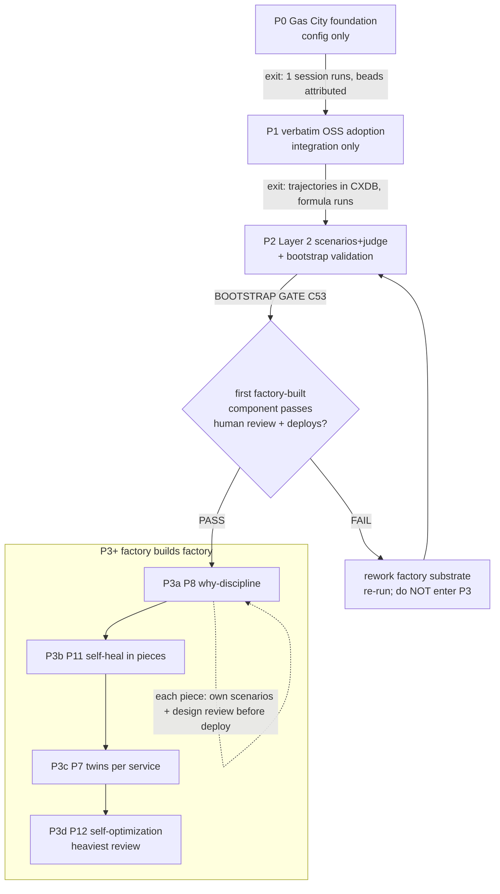

# C54 — Phase delivery plan (`phase-plan`)  (Spec, canonical track)

> Source: README §"Part 6 — Implementation phases" (lines 340–472, the four-phase plan P0→P1→P2→P3+ and the per-phase install/deliver lists) + §"Part 7 — The self-bootstrap mechanic" (lines 476–500) + §"Part 8 — the bets" (lines 504–526); AI-CONTEXT §3.1 (coverage map, lines 64–77), §3.4 (smallest viable install = "Phase 0 exactly", lines 114–122), §6 ("Layer 2-6 coverage", line 244), §8 (decision table, lines 463–500). F-MODE-COVERAGE §"Phase-3 overlap row".
> Inventory ID: C54   Kind: pipeline-stage   Status: sweep-1
> Maps from: A80, A81, A82, A83, A83a-d, B11, B13-16. Depends on: C52 (self-bootstrap recursion). Key gaps: G01, G02, G03, G31.

> **Scheme-collision guard (binding, per RC40-01 / D-6).** This document is the home of v4's **delivery Phases P0–P3**. Those are a DIFFERENT, ORTHOGONAL scheme from (a) the build **Batches 1–5** in `_meta/component-inventory.md` (an authoring fan-out order) and (b) the **Layers 0–6** in AI-CONTEXT §6 (a capability-tier taxonomy). "Phase N" in this spec NEVER means "Batch N" or "Layer N". The three schemes are reconciled in §4.4. C54 owns the PHASE scheme and nothing else.

## 1. Purpose & responsibility

C54 is the **four-phase ordered delivery plan**: the canonical statement of *what gets stood up in what order*, and *what gate must pass before the next phase may begin*. It is a **sequencing artifact**, not running code. Per README:342 the plan is "Four-phase plan. Each phase is independently valuable — you ship something working at every checkpoint."

The four phases (README:344–350, the only ordering v4 states):

| Phase | Name (v4 wording) | Delivers (principles) | Build mode |
|---|---|---|---|
| **P0** | Gas City foundation | P1, P2, P4, P9, P10 native (P3 basic) | config only, no custom code (README:355) |
| **P1** | Verbatim OSS adoption | P3 full, P10 full (CXDB); observability substrate for P8/P11 | integration only, "no custom inventions" (README:378) |
| **P2** | Layer 2 (scenarios + judge) **+ bootstrap validation** | P5, P6 | compose OSS + **first factory-built component** (README:419) |
| **P3+** | Factory builds factory | P8, P11, P7, P12 (in that sub-order) | factory authors specs; human design-review each piece (README:446) |

C54 **owns** exactly two things:

1. **The phase dependency order** P0 → P1 → P2 → P3+ and the internal P3 sub-order P3a(P8) → P3b(P11) → P3c(P7) → P3d(P12) (README:350, 454). This is a *strict prerequisite chain*: each phase consumes what earlier phases stood up.
2. **The entry/exit gate between phases** — the predicate that must hold for a phase to be declared done and the next to start. The load-bearing gate is the **P2→P3 bootstrap gate** ("if bootstrap validation succeeds … Phase 3 builds on this. If it fails, the factory itself needs work before Phase 3", README:436), whose go/no-go rubric is delegated to **C53** (bootstrap-validation milestone).

**What C54 is NOT:**

- It is **not** a project-management engine, scheduler, burndown tracker, or work-assignment system. v4 states an *order* and *effort scopes* ("single-engineer day to a few days", "small-team week to two weeks", README:374/399/442), not a managed timeline. Building a PM/Gantt/critical-path-tracking system would be over-build with no principle behind it (see §7, THE BAR).
- It is **not** the bootstrap-recursion mechanism itself — that is **C52** (self-bootstrap recursion & design review). C54 *depends on* C52; it sequences when the recursion turns on (P2 onward), it does not implement it.
- It is **not** the go/no-go *rubric* for the bootstrap gate — that is **C53**. C54 names the gate's existence and position; C53 defines its pass bar.
- It is **not** the gene-transfusion discipline (**C51**) that every P3 build obeys; C54 sequences *when* transfusion-built components land, not *how* a transfusion is judged correct.
- It is **not** the autonomy ladder (**C56**); the L0–L5 maturity scale is a separate cross-cutting axis. C54 references autonomy only where v4 ties a phase to a review posture ("heaviest human review" at P3d, README:470).
- It is **not** the Batch scheme of the component inventory, nor the Layer 0–6 capability taxonomy (see scheme-collision guard + §4.4).

> [FAITHFUL-FILL] C54 is described in the inventory as a `pipeline-stage` kind, but v4's Part 6 is prose + two Mermaid order-diagrams, not a runnable artifact. The minimal consistent reading is that C54's *deliverable* is **the ordered phase list + the gate predicates as a versioned planning document** (the same status README Part 6 already has), plus the one machine-checkable thing v4 actually asserts: a **phase-entry precondition check** ("phase N may not start until phase N−1's exit gate passed"). No phase-execution runtime, no scheduler. Treating C54 as a heavy orchestration component would contradict README:342's framing of it as a staged *plan*.

## 2. Context & dependencies

| Direction | Component | Relationship (v4 source) |
|---|---|---|
| Upstream (depends on) | **C52** self-bootstrap recursion | Inventory: C54 `Depends on: C52`. The "factory builds factory" mode (P2 bootstrap onward, all of P3) is C52's recursion; C54 sequences when it activates. |
| Gate delegate | **C53** bootstrap-validation milestone | The P2→P3 exit gate *is* the C53 go/no-go milestone (README:429–436). C54 names the gate + its position; C53 owns its rubric/scenario set (resolves G23 there, not here). |
| Discipline applied per P3 build | **C51** gene-transfusion | Every P3-phase component transfuses ≥1 exemplar (README:496). C54 sequences the transfusion-built components; C51 defines transfusion correctness. |
| Cross-cutting axis | **C56** autonomy ladder | Phase posture references the L0–L5 review level (e.g. P3d "heaviest human review"). Separate axis; soft reference only. |
| Sequenced *into* the phases (G31) | **C43** isolation & lethal-trifecta boundary | C54 must state *which phase C43 lands in*; v4 leaves it implicit (→ G31, §6). |
| Sequenced components (the payload) | Effectively **all of C01–C57** | Each component has a natural phase home derived from its principle (§4.3). C54 references the inventory but does not re-spec any component. |

C54 sits at the head of the **Bootstrap** subsystem's *planning* concern. It is **not foundational** (inventory: Foundational? = no) — nothing's *interface* depends on C54; it is consumed by humans/orchestrators deciding build order. In the inventory's own Batch scheme it is authored in Batch 4 (a late wave), precisely because it describes the whole arc and can only be finalized once the component set is known.

## 3. Interfaces / contracts

Sweep-1: interfaces named + described (signatures deferred to sweep 2). C54's "interfaces" are the **phase-boundary contracts** — what each phase promises to deliver, and the gate predicate that admits the next phase.

### 3.1 Inbound
- **Component→phase assignment (inventory → C54).** Each component declares (or C54 derives from its principle, §4.3) which phase it lands in. Input surface: the `_meta/component-inventory.md` rows + each component's principle mapping.
- **Gate verdict (C53 → C54).** The P2→P3 boundary consumes C53's go/no-go verdict on the first factory-built component (README:434 "Deploy if it works").

### 3.2 Outbound
- **Phase-entry precondition (C54 → orchestrator/human).** For a phase N, the predicate "all of phase N−1's exit deliverables exist and N−1's exit gate passed" — the thing an orchestrator checks before fanning out phase-N work.
- **Phase manifest (C54 → readers).** The authoritative `{phase → {install/build list, delivered principles, exit gate}}` table (§4). This is the artifact downstream readers cite for "what is in scope now".

### 3.3 Invariants
- **INV-1 (strict order).** P0 ⟶ P1 ⟶ P2 ⟶ P3+ is a strict prerequisite chain; a later phase MUST NOT begin until the earlier phase's exit gate passes (README:350, 436). Within P3: P3a ⟶ P3b ⟶ P3c ⟶ P3d (README:454).
- **INV-2 (independently valuable).** Each phase's exit state is a *shippable, working* system, not a half-built intermediate ("you ship something working at every checkpoint", README:342). The plan has no phase whose only value is "enables the next phase".
- **INV-3 (bootstrap gate is load-bearing).** The P2→P3 boundary is the single make-or-break gate of the whole "factory builds factory" thesis: if it fails the factory does not proceed to P3 but is itself reworked (README:436; AI-CONTEXT:475 "First factory-built component proves/disproves whole approach"). This gate's verdict is C53's.

> [FAITHFUL-FILL] INV-1's "strict, gated" reading (vs. "phases may overlap") is the minimal consistent inference: README draws the phases as a linear arrow chain `P0 --> P1 --> P2 --> P3` (README:350) and predicates P3 on P2's gate (README:436). v4 nowhere sanctions running a later phase before an earlier one's gate; the strict reading is what keeps "ship working at every checkpoint" (INV-2) coherent. (One real-world relaxation — pipelining *authoring* of a later phase while an earlier phase's *gate* is pending — is an operability optimization, not a v4 statement; flagged as OQ-2, deferred.)

## 4. Data model / state

C54 owns **the phase manifest** (a table), not a live store. There is no per-run state machine in scope at sweep 1.

### 4.1 The phase manifest (authoritative, from README Part 6)

| Phase | Entry precondition | Install / build (v4 verbatim scope) | Exit deliverable (principles) | Exit gate |
|---|---|---|---|---|
| **P0** | none (greenfield) | `gc` binary; `pack.toml` `[imports.core]`; `city.toml` `[workspace]`+one `[[agent]]` (claude/tmux)+`[beads] provider="file"`; one `prompt.template.md`. **Off:** daemon, mail, formulas, rigs, Dolt, services, orders (AI-CONTEXT:122). | P1, P2, P4, P9, P10 native; **P3 basic** (implicit single-step) (README:367–372). | One Claude Code session runs against a spec, beads carry `created_by`. (Effort: ≤ a few days, README:374.) |
| **P1** | P0 running | Turn on `[formulas]`; ≥1 formula (3-step min); formula↔DOT translator (C14); OTel Collector (C26); LangFuse (C27); CXDB (C21); raw-bodies→CXDB bridge (C24) (README:382–389). | **P3 full** (visualize + optional linter); **P10 full** (CXDB content-addressed trajectories) (README:392–393). | Trajectories land in CXDB; a formula DAG runs + renders. (Effort: ~1–2 weeks, README:399.) |
| **P2** | P1 running **+ C43 boundary-typing / blast-radius fence (entry precondition, per D-20 — see §6.1)** | Inspect AI (C31); scenario store w/ read-isolation (C30/C34); satisfaction aggregator (C33); cross-family/judge stylesheet rule (C29/C32) (README:423–427). **+ bootstrap validation:** author a careful spec for a small component, run the factory, human-review, deploy if it works (README:429–434). | **P5, P6** (held-out scenarios + satisfaction-not-test-pass) (README:439–440). | **THE BOOTSTRAP GATE (C53):** first factory-built component passes human review + deploys. Pass ⇒ P3 may start; fail ⇒ rework factory, do NOT enter P3 (README:436). |
| **P3+** | **P2 bootstrap gate PASSED** | factory authors+builds, transfusion per piece (C51), design-review per piece (C52/C53-style review). Sub-order below. | **P8, P11, P7, P12** (README:457–470). | per-piece: each factory-built component passes its own scenarios + design review before deploy (README:498–499). |

### 4.2 P3 internal sub-order (README:448–470)

| Sub-phase | Delivers | Transfusion exemplar(s) | Note |
|---|---|---|---|
| **P3a** | P8 "why" discipline (override→pattern→rule, C35) | AWS CloudTrail shape, git reflog | "Small scope" (README:457). |
| **P3b** | P11 self-healing in pieces (C36→C37→C38→C39, fix-task schema) | PyOD; sentence-transformers+HDBSCAN; Tracker Diagnose/Audit/Doctor | "Build the simplest first (anomaly detection); save the diagnosis agent for after the substrate is proven" (README:466). |
| **P3c** | P7 digital twins per service (C44/C45) | LocalStack (README:468) | "Repeat per dependency." C43 boundary-typing/blast-radius half → P2 entry precondition per **D-20 (ADOPTED 2026-05-31; confirms D-18, now binding)**; twin-isolation half stays P3c. See [the decision ledger](../_meta/review-log.md#wrap-up-operator-decisions-2026-05-31--d-20d-25). |
| **P3d** | P12 self-optimization (C46–C50) | DSPy; Unleash; counterfactual driver (the unsolved invention, G19) | "highest-risk layer; heaviest human review" (README:470). |

### 4.3 Component→phase derivation rule (FAITHFUL-FILL)

> [FAITHFUL-FILL] v4 names which *principles* land in each phase but does not tabulate all 57 components against phases. The minimal consistent rule: **a component's phase = the phase of the principle(s) it realizes**, per README Part 6's principle→phase mapping. E.g. C30–C34 (P5/P6) ⇒ P2; C36–C39 (P11) ⇒ P3b; C44/C45 (P7) ⇒ P3c; C46–C50 (P12) ⇒ P3d; substrate/persistence/observability (C01–C29 supporting P1/P2/P3/P4/P9/P10) ⇒ P0–P1. This derivation, not an independent re-assignment, is C54's component-placement contract. It avoids inventing a second source of truth for "what phase is X in".

### 4.4 Three orthogonal schemes — reconciliation (resolves G01, partially G02)

> [AMBIGUITY: G01] v4 runs **two unreconciled "layer" vocabularies**: README Part 3 / AI-CONTEXT §2 name a **"three-layer architecture + persistence"** (LLM client / agent loop / pipeline engine / persistence), while AI-CONTEXT §6 and README Part 6 use **"Layer 0 through Layer 6"** (a capability-tier index: Layer 2 = scenarios+judge, Layer 5 = twins, Layer 6 = self-opt). The two never reconcile, so "Layer 2" is genuinely ambiguous between "the agent-loop tier (of the 3-layer model)" and "the scenarios/judge tier (of the 0–6 model)".
> - **Reading A (two distinct schemes, chosen).** They are two *different* taxonomies that happen to share the word "layer": the **3-layer model** is the static *runtime stack* (client/loop/engine/persistence); the **0–6 model** is a *principle-grouping index* used only to organize the OSS survey (AI-CONTEXT §6/§7) and is keyed to principles (Layer 2 ≡ P5+P6, Layer 3 ≡ P8+observability, Layer 4 ≡ P11, Layer 5 ≡ P7, Layer 6 ≡ P12). Under this reading every **numbered `Layer N`** token in Part 6 / §6 means the corresponding capability tier, and "Layer 2" specifically always means the **scenarios+judge** tier, because Part 6 only ever pairs the numbered "Layer 2" with "(scenarios + judge)" (README:348, 417; AI-CONTEXT:294). *(Caveat: Part 6 is **not** entirely free of the competing vocabulary — README:368 names principle P2 "**three-layer architecture**", and the word "layer" recurs incidentally at README:372/393 "memory layer" and :470 "highest-risk layer". So the 3-layer vocabulary does intrude into C54's own source section as P2's name; this is exactly why C54 still publishes the cross-walk + scheme-guard rather than relying on Part 6 being clean.)*
> - **Reading B (one scheme, mislabeled).** The 0–6 numbers are a typo'd superset of the 3-layer model. Rejected: the 0–6 index has seven tiers keyed to principles and is used self-consistently across §6/§7/§8; it is not a relabeling of a 4-element stack.
> **Faithful pick: Reading A.** For C54 specifically the ambiguity is *contained*: C54's own scheme is **Phases**, and the only **numbered** `Layer N` token in Part 6 is **"Layer 2 (scenarios + judge)"** in the P2 heading (README:348, 417) — which Reading A pins unambiguously to the scenarios/judge tier. (Part 6 does also carry the *other* vocabulary as principle P2's name, "three-layer architecture" at README:368, plus incidental "memory layer"/"highest-risk layer" — see the caveat under Reading A — but no *numbered* "Layer 2" in Part 6 ever means the 3-layer model's agent-loop tier.) So **within C54, the numbered "Layer 2" = the P2 scenarios+judge deliverable**, and C54 carries the cross-walk below so no reader conflates the three schemes. The architecture-wide reconciliation of the two layer vocabularies is bigger than C54 (it touches every doc using "layer") and is raised as OQ-1 for the integrator / C57.

**Authoritative cross-walk (the de-conflation table C54 publishes):**

| Phase (C54) | Delivers principle(s) | "Layer" (0–6 index, AI-CONTEXT §6) | Build Batch (inventory) |
|---|---|---|---|
| P0 | P1,P2,P3-basic,P4,P9,P10 | Layer 0–1 (substrate) | Batches 1–2 |
| P1 | P3-full,P10-full | Layer 1 + Layer 3 (observability substrate) | Batch 2 |
| P2 | P5,P6 | **Layer 2** (scenarios+judge) | Batch 3 |
| P3a | P8 | Layer 3 ("why") | Batch 3 |
| P3b | P11 | Layer 4 (self-heal) | Batch 4 |
| P3c | P7 | Layer 5 (twins) | Batch 4 |
| P3d | P12 | Layer 6 (self-opt) | Batch 5 |

Note the schemes are NOT aligned by number: **Phase 2 ↔ "Layer 2" ↔ Batch 3** — three different "2"s for adjacent-but-distinct concepts. This non-alignment is exactly why D-6/RC40-01 forbids conflation. (The Layer/Phase number mismatch is also the root of **G02**: README:342's "you don't wait for Phase 6 to get value" is a slip — there is no Phase 6; it means **Layer 6** / P3d self-optimization. See §6.)

## 5. Behavior

C54's "behavior" is the **phase progression** and the **gate evaluation** at each boundary. There is no control loop; it is a staged advance with a check at each seam.

Key flows:
- **Phase advance.** A phase is entered only when the prior phase's exit deliverables exist and its exit gate passed (INV-1). P0→P1→P2 gates are *capability* checks (a session runs; CXDB ingests; scenarios+judge score). 
- **The bootstrap gate (load-bearing).** At P2→P3, the factory authors a spec for a *small first component* (candidate per README:431: a Linear-webhook `[[provider]]` or a daily bead-activity reporter pack), runs itself, a human reviews, deploys if it works. **Pass** ⇒ enter P3a. **Fail** ⇒ loop back: "iterate on the spec and run again; if still failing after a few attempts, the factory needs more substrate before Phase 3" (README:519). The pass/fail *rubric* is C53's, not C54's.
- **P3 per-piece advance.** Inside P3 each component is "a separate factory build, separately reviewed, separately deployed" (README:466); the sub-order P3a→P3d is itself gated ("save the diagnosis agent for after the substrate is proven", README:466).

## 6. Failure modes & handling

Which F-modes apply and how C54 (a plan) addresses each, plus the assigned gaps.

| F-mode / gap | Applies to C54 how | Handling (faithful) |
|---|---|---|
| **G03 (assigned)** Phase-0 native count is 5, not 6 | The headline "smallest viable install handles **6 of 12** principles natively" (AI-CONTEXT:463) lists P1,P2,P3,P4,P9,P10 (AI-CONTEXT:135) — but §3.1 rates P3 "**Strong when `[formulas]` enabled**", and Phase-0 turns `[formulas]` **off** (AI-CONTEXT:122; README:369 "full when formulas turn on in **Phase 1**"). So at the *smallest* install P3 is not delivered. | **C54 corrects the count at its own boundary:** the **P0 exit deliverable is P1, P2, P4, P9, P10 = 5 principles native**, plus **P3 *basic*** (implicit single-step pipeline), with **P3 reaching "full" only at P1** when `[formulas]` turns on. The "6 of 12" headline double-counts P3 by crediting the formulas-on rating at the formulas-off phase. C54's manifest (§4.1) uses the corrected 5-native-at-P0 framing throughout. (Resolves G03.) |
| **G01 (assigned)** "three-layer" vs "Layer 0–6" | C54 must place phases against "layers" without inheriting the ambiguity. | Resolved at §4.4 (Reading A): two orthogonal schemes; within C54 "Layer 2" = the P2 scenarios+judge tier. C54 publishes the cross-walk so no reader conflates Phase/Layer/Batch. Architecture-wide reconciliation deferred to OQ-1 (bigger than C54). |
| **G02 (assigned)** "Phase 6" reference with no Phase 4/5/6 | README:342 says "you don't wait for **Phase 6** to get value" but the plan has only P0–P3. | **C54 rules this a documentation slip:** there is no Phase 4/5/6. "Phase 6" means **Layer 6 / P3d self-optimization** (the last capability tier), i.e. *you don't wait for self-optimization (the final layer) to get value* — consistent with INV-2 (every phase independently valuable). C54's canonical phase set is exactly **{P0, P1, P2, P3+}** with P3 sub-phased a–d. (Resolves G02; the underlying Phase/Layer number collision is the same root as G01, handled by the §4.4 cross-walk + the scheme-collision guard.) |
| **G31 (assigned)** lethal-trifecta "Addressed" but isolation (C43) unbuilt & last | The most dangerous security class (Bash/network/fs blast radius) is marked Addressed on the strength of twins (C44, P3c) + deterministic boundary typing (C43), yet **from P0 through P3b the factory runs Claude Code with Bash/net/fs access and no twin isolation** (G31; XC-8). C54 owns *when C43 lands in the phases*. | **C54 sequences C43 explicitly and honestly (see §6.1).** Faithful v4 places twins at P3c and never names a phase for C43; C54 makes the exposure window *visible* rather than papering over it, and records the residual as a Caution carried by C57. C54 cannot *fix* the exposure (that is C43's build) but it MUST stop the plan from implying the boundary exists before C43 ships. |
| **F52 / G18** "more controller patches" (oscillation) | A *plan* could itself oscillate (re-plan loops at the bootstrap gate). | INV-1's gate is bounded by README:519's "a few attempts, then the factory needs more substrate" — the bootstrap retry is operator-bounded, not infinite. The numeric bound is C53's gate policy, not C54's. |
| **F25** design starvation (operator can't spec fast enough) | Phases 2–3 assume an operator authors the bootstrap + per-piece specs. | Conceded, not solved (G15; F-MODE F25). C54 notes the operator-authoring bottleneck is real at P2 ("the bootstrap validation prompt is the most consequential thing you write in the first month", README:542) and defers staffing to the autonomy-ladder owner (C56). |

### 6.1 G31 — isolation sequenced into the phases (assigned, load-bearing)

This is the security-honesty obligation of C54. The faithful sequencing:

- **v4's implicit placement.** Twins (C44/C45, P7) land at **P3c**. README Part 6 names **P4 as "deterministic-first: reconciler + tool-node primitives available"** (README:370) — it does *not* use the terms "boundary typing", "lethal-trifecta", "CaMeL", or name **C43** anywhere in Part 6 prose. The *lethal-trifecta boundary-typing* framing of C43 comes from **F-MODE-COVERAGE** (line 54, "boundary typing (CaMeL pattern)"), not from a stated phase. So C43 is at most **P4-adjacent by capability** (it builds on the P4 deterministic-first posture), but **no phase is ever stated for C43's actual build**; F12/F44/F56 are nonetheless marked "Addressed" in F-MODE-COVERAGE on the strength of mechanisms that ship at P3c (twins) or are unbuilt (the boundary-typing bound) — that mismatch *is* G31. Per binding **D-13**, C43 owns the Bash/net/fs blast-radius bound **and** twin isolation (distinct from C42, which *provides* the role partition, and C34, which *enforces* holdout).
- **The exposure window (made explicit).** **P0 → P3b** (everything up to and including the self-healing build) runs Claude Code with Bash + network + filesystem access and **no twin isolation and no enforced boundary typing**. During this entire window the lethal-trifecta failure class is *exposed*, not addressed — the opposite of what the "Addressed" marking implies.
- **C54's faithful disposition (two readings, one pick).**

> [AMBIGUITY: G31] Where does C43 (isolation boundary) land in the phases?
> - **Reading A (v4-literal, chosen for the faithful manifest).** C43 lands with twins at **P3c**, because that is where v4 places the isolation-providing mechanism (twins) and where deterministic boundary typing becomes load-bearing. Under this reading the manifest is faithful to v4 *and* C54 must carry an explicit **Caution: lethal-trifecta exposed P0–P3b** (recorded in C57's residual-risk register), so the plan does not claim a boundary it does not have.
> - **Reading B (engineering-corrected).** Pull C43 *earlier* so the factory has a blast-radius bound before it runs unattended at scale (P2) and before it self-modifies (P3b). **Refined:** C43 is two separable mechanisms — *deterministic boundary typing* (the Bash/net/fs blast-radius bound, D-13) and *twin isolation*. The twin half depends on C44 (twins) and so cannot precede P3c; the boundary-typing half depends only on C42 (Batch 2) + P4 primitives (P0) and **can** be pulled to P2. So the precise engineering call is **split**: boundary-typing → P2 entry precondition, twin-isolation → P3c. This is what XC-8 and the C43/D-13 owners argue ("Real fix = sequence C43 earlier or accept detection-only Phase 0").
> **Faithful pick: Reading A** (place C43 at P3c per v4's literal twin-sequencing) **but with a mandatory, visible Caution**, because the canonical track elaborates v4 *as written* and must not silently re-sequence a security control. The *recommendation* to pull C43 forward is the right engineering call and is recorded as **OQ-3 → D-18, now ADOPTED as D-20 (operator-confirmed 2026-05-31)**, resolved per the split below: **C43 boundary-typing/blast-radius half → P2 entry precondition (binding per D-20); twin-isolation half stays P3c** (it remains blocked on C44 twins). The faithful P3c manifest above is preserved and annotated, not rewritten. C54's contribution to G31 is therefore: (1) name C43's faithful phase (P3c) for the twin-isolation half, (2) make the P0–P3b exposure window explicit instead of "Addressed", (3) record the pull-forward of the boundary-typing half as **D-20 (ADOPTED, binding)**. See [the decision ledger](../_meta/review-log.md#wrap-up-operator-decisions-2026-05-31--d-20d-25). (G31 partially resolved here — sequenced + exposure surfaced + D-18 split; the *fix* is C43's build + the operator's confirmation of D-18.)

## 7. Cross-cutting (security / cost / scale / observability / ops)

- **Security.** The dominant cross-cutting concern for a *delivery plan* is exactly G31 (§6.1): the order in which security mechanisms land determines how long the factory runs exposed. C54's job is to make that window visible. Also: P3d (self-optimization) is gated behind "heaviest human review" (README:470) and RSI/goal-subversion (F54/G35) is weakest at the very phase the factory most self-modifies — C54 records that P3d carries the heaviest review posture by v4's own instruction, and defers the RSI control (audit pack) to C57/C56.
- **Cost / scale.** v4 gives *effort scopes* per phase (days / 1–2 weeks / 1–2 weeks / "gradual"), not a cost model. Token/throughput cost (G13/G32/G34) is unmodeled in v4 and C54 does not invent one; it notes the single-Max-seat ceiling first bites at P2+ (scenario suites + judge ensembles) and defers the cost model to C46/C28. C54 carries **no** scheduling or budgeting machinery (THE BAR).
- **Observability.** A phase boundary is the natural unit for "are we done with this phase" reporting, but C54 emits no telemetry itself; phase-exit evidence is read from the same stores (CXDB C21, beads C19, satisfaction C33) the phases stand up.
- **Ops.** The plan's operational contract is just INV-1 (don't start a phase before the prior gate passes) + the bootstrap retry bound (README:519). No daemon, no runtime.

**THE BAR (what was DROPPED).** C54 is a *plan kept as a plan*. Dropped as over-build, each with no 12-principle behind it: (1) a **project-management / scheduling engine** (Gantt, burndown, dependency-tracking runtime) — v4 states an order + effort scopes, nothing managed; (2) a **phase-execution state machine / orchestrator** that *runs* phases — phases are stood up by humans/the factory, not by C54; (3) a **cost/budget model** — unmodeled in v4, owned later by C46; (4) a **second component→phase source of truth** — derived from principles (§4.3), not independently re-assigned; (5) **auto-advance** across the bootstrap gate — the gate is a deliberate human go/no-go (C53), automating it would defeat its purpose. The KEEP is precisely: the phase dependency order + the entry/exit gates (especially the P2→P3 bootstrap gate = C53) + the G31 isolation sequencing + the scheme cross-walk.

## 8. Acceptance criteria & test strategy

Sweep-1 acceptance (high-level):
1. **AC-1 (phase order defined).** The manifest states the strict order P0→P1→P2→P3+ and the P3 sub-order P3a→P3d, each with entry precondition, scope, exit deliverable, exit gate (§4.1/§4.2; README Part 6). 
2. **AC-2 (each phase independently valuable).** Every phase's exit state is a working, shippable system (INV-2); no phase exists solely to enable the next.
3. **AC-3 (bootstrap gate is explicit + delegated).** The P2→P3 gate is named, positioned, and its pass/fail consequence stated (pass⇒P3; fail⇒rework, no P3), with the rubric delegated to C53 (INV-3; README:436).
4. **AC-4 (G03 count corrected).** The P0 deliverable is stated as **5 native principles (P1,P2,P4,P9,P10) + P3-basic**, with P3-full at P1 — not "6 of 12 at smallest install".
5. **AC-5 (scheme de-confliction).** The cross-walk (§4.4) is present and shows Phase/Layer/Batch are NOT number-aligned; "Phase 6" is ruled a slip for Layer-6/P3d (G02); "Layer 2" within C54 = P2 scenarios+judge (G01).
6. **AC-6 (G31 sequenced + honest).** C43's faithful phase (P3c) is named, the P0–P3b lethal-trifecta exposure window is made explicit (not "Addressed"), and the pull-forward recommendation is recorded as an OQ + a C57 Caution.
7. **AC-7 (no over-build).** The artifact contains no scheduler/PM-engine/cost-model/second-placement-source (THE BAR, §7).

Test strategy (sweep-1): a **consistency check** that every principle P1–P12 is delivered by exactly one phase in the manifest and that no component is placed in a phase earlier than a component it depends on (a topo-sort of inventory deps against §4.3 placement must not contradict INV-1); a **gate-completeness check** that each phase boundary has a stated exit gate; and a **traceability check** that each phase's scope line cites a README Part 6 source. Concrete checks deferred to sweep 2.

## 9. Open questions

- **OQ-1 (→ review-log, G01).** v4's two "layer" vocabularies ("three-layer architecture + persistence" vs "Layer 0–6") are never reconciled corpus-wide. C54 resolves the ambiguity *locally* (Reading A; within C54 "Layer 2" = scenarios+judge tier). The architecture-wide reconciliation touches every doc using "layer" and is bigger than C54 — integrator / C57 should pick one canonical layer vocabulary or rename one of the two. (Load-bearing for clarity, not for C54's own correctness.)
- **OQ-2 (→ review-log).** May a later phase's *authoring* be pipelined while an earlier phase's *exit gate* is still pending (overlap), or is the order strict end-to-end (INV-1)? Faithful pick is strict; an operability relaxation (pipeline authoring, gate-on-deploy) is the likely real-world posture but is not a v4 statement. Integrator call.
- **OQ-3 → D-20 (ADOPTED — operator-confirmed 2026-05-31; was D-18 provisional).** RESOLVED and **now binding** by **D-20** (which flips D-18 PROVISIONAL→ADOPTED): C43 is two separable mechanisms and they do not share one phase. The pull-forward of the boundary-typing/blast-radius half to a P2 entry precondition is confirmed; the detection-only-Phase-0 alternative is REJECTED. See [the decision ledger](../_meta/review-log.md#wrap-up-operator-decisions-2026-05-31--d-20d-25). Per inventory, C43 `Depends on: C42, C44`; only its **twin-isolation** half is structurally blocked on C44 (twins, genuinely P3c) — that half stays at **P3c**. Its **deterministic-boundary-typing / blast-radius** half (the Bash/net/fs capability bound; D-13's "Bash/net/fs typing") depends only on C42 (Batch 2) + the P4 reconciler/tool-node primitives (available P0), **not** on twins, so D-18 pulls it forward to a **P2 entry precondition** — closing most of the P0–P3b XC-8/F12/F44 exposure window without waiting on twins. This is a security risk-tolerance call, so D-18 is **provisional pending operator confirmation** (or, per XC-8's alternative, explicitly "accept detection-only Phase 0"). The faithful manifest is deliberately left un-re-sequenced and only annotated. (XC-8: "Real fix = sequence C43 earlier or accept detection-only Phase 0"; aligns with D-13.)
- **OQ-4 (→ review-log).** Does any phase besides the P2 bootstrap gate need a *formal* exit rubric, or are P0/P1's capability checks ("a session runs", "CXDB ingests") sufficient as informal gates? v4 only ever formalizes the P2→P3 gate (via C53); the others are capability assertions. Confirm whether P3a–P3d per-piece reviews need a shared rubric (candidate: reuse C53's) or stay per-component.
- **OQ-5 (→ review-log, G14; DEFERRED — needs orchestrator decision; inbound from C52:OQ5 + C51:OQ-C51-2).** Does C54 own a **class-level transfusion-failure hedge**? [`C52`](./C52-self-bootstrap.md):OQ5 and C51:OQ-C51-2 explicitly route to C54 the question: *if a whole high-value class (Healer/P3b, twins/P3c, self-opt/P3d) cannot be reliably gene-transfused (the G14 bet fails for an entire P3 sub-phase), does the phase plan re-sequence / defer that sub-phase, or hand-build it?* G14 is the "no fallback for 'factory cannot reliably transfuse'" gap, and the affected principles (P7/P8/P11/P12) are exactly C54's P3 sub-phase payload, so this is structurally a phase-plan decision. **Scope note:** G14 is **not** one of C54's four assigned gaps (G01/G02/G03/G31); C54 does **not** silently import it as new scope or invent a hedge mechanism here. The orchestrator should rule whether the class-level hedge is homed at C54 (e.g. "a failed P3-subphase transfusion bet defers/re-sequences that sub-phase rather than forcing a hand-build") or stays with C51/C52, and propagate the ruling across C51/C52/C54 so G14 is fully homed.
