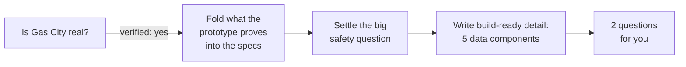

# What I did overnight — v4, first build-detail run

**What this is:** a plain-language readout of one overnight working session, for you to read in a sitting. What got done, what I found, and the two things that need your call. The machine-readable detail lives in the pull requests; this is the human layer on top. A companion file, [decisions in plain language](decisions-this-run-plain-english.md), walks through every choice this run made.

---

## The one-paragraph version

The next big phase is turning the 57 architecture sketches into build-ready detail. I front-loaded the one thing everything else depends on: checking whether **Gas City** — the runtime the whole factory sits on — is actually real and behaves the way we've been assuming. It's real (I confirmed the genuine repository myself, not on an AI's say-so), and you'd already handed me a working prototype of it. I folded what that prototype *proves* into our specs, settled the biggest open **safety** question through two rounds of adversarial review, and wrote build-ready detail for the five "data foundation" components. **Two things genuinely need your call** — both are "how cautious do we want to be on safety," which is yours, not mine. Everything else I either decided with a clear undo path or deliberately left alone.

## What got done

- **Confirmed Gas City is real — properly, not on faith.** An AI helper first told me it was real "version 1.2.0, install with brew" — and the version/date it gave contradicted itself, which is the tell for a made-up answer. So I checked the actual GitHub repository myself three different ways, with a known-good repository as a control to rule out the sandbox's network quirks. It's real. The prototype you pointed me at is a working, Dockerised Gas City built in a sandbox just like this one.
- **Folded the prototype's hard-won facts into our specs.** The prototype already figured out a dozen real things about how Gas City actually works (config file shapes, how it loads agent "packs," how the bead store persists). I wrote those into the relevant specs, marked as "verified against a real `gc`," and closed several open questions. One nice result: the helper that did the harvesting flagged three places where it thought the prototype *contradicted* our design — I checked each against what our specs actually say, and **all three were false alarms.** Our design had been careful to leave those exact things unspecified until we could check them. Discipline held.
- **One thing stays genuinely unknown:** whether Gas City *blocks* a forbidden access in the moment, or just *records it afterward*. The prototype proved the factory stands up and runs, but its authors skipped the test that would answer this (to save on token spend). So I wrote the exact test to run later — it just needs a machine with Docker — and left the question honestly open.
- **Settled the biggest safety decision** (the "fence," below) through two rounds of real adversarial review.
- **Wrote build-ready detail for the data foundation:** the five components that store and attribute every piece of work — the bead store, the bead schema, the trajectory store, the event log, and the provenance chain. A reviewer whose only job was checking the *seams between* these five caught a real bug two of them would have hit at build time (they'd agreed on a rule but disagreed on a field's exact shape). Fixed.

## The big safety question, and what I decided

The factory has a **fence**: it labels every action by whether it touches production, a sandbox, or a fake stand-in, and refuses the dangerous combinations. The fence is what stops Simon Willison's *lethal trifecta* — when one agent can read private data, be fed untrusted text, *and* send data out, all at once. You already decided to put the fence up **before** the factory runs unattended.

Here's the wrinkle. A fence is only a real fence if the runtime actually **blocks** the bad combination. If Gas City only **notices it afterward**, the "fence" is a sign, not a wall. We won't know which until the test above is run.

So the decision I had to settle was: *what happens to the plan if the runtime turns out to only notice, not block?* My first draft answered it by saying "then we build our own blocking layer." Three independent reviewers killed that answer — correctly — because building our own blocking is exactly the kind of custom hardening you told the whole project to avoid; the prototype's own stack is supposed to provide it. The second round reshaped it into something cleaner:

> **If the runtime only notices instead of blocks, the factory does not run unattended — it stays at human-in-the-loop review — until either the runtime is shown to block, or someone makes a deliberate, costed case for a blocking layer. We don't pre-bless building one.**

It's written as a *rule to apply to whatever the test finds*, not a pre-baked answer to a test we haven't run — because pre-deciding the test's result is the exact mistake the project is built to avoid. It also adds a sensible middle: the parts of the factory that *can't* assemble the trifecta in the first place (no private data, or no untrusted input, or no way to send data out) can still run unattended even if the runtime only notices.

**This reframes a decision you already made**, so I did **not** quietly write it into the specs. It's question #1 below.

## The two things that need you

| # | The question, in plain terms | My recommendation |
|---|---|---|
| 1 | When the runtime only *notices* bad access instead of *blocking* it, should that **stop** unattended running until we fix it — or just be a noted caveat? | **Treat it as a stop.** A fence that doesn't block is a sign, not a wall — and this factory edits its own code. |
| 2 | Should we allow the **safe parts** of the factory to run unattended even before the blocking question is settled (the parts that can't leak data by construction), keeping humans in the loop only on the risky parts? | **Yes.** It keeps the "lights-out factory" dream alive without building anything risky. |

Both are reversible — each is one decision record plus, eventually, a few spec edits. Neither blocks anything you'd merge today; they shape the *next* pass. The full reasoning, including the reviewers' objections, is in the decision record inside pull request #231, and in plain language in the [companion decisions file](decisions-this-run-plain-english.md).

## What I deliberately did NOT do

- **Run a live factory overnight.** That was your call — it spends real money on live agents. I prepared the test instead of running it.
- **Wire the safety rule (question #1) into the specs.** It changes a decision you'd already adopted, so it waits for your answer rather than sneaking in.
- **Detail the other ~52 components.** Build-ready detail for all 57 is more than one night. I did the five data-foundation ones; the next sessions take the workflow components and the evaluation components (the evaluation ones partly wait on question #1).
- **A handful of smaller improvements** an expert panel suggested earlier (a "who's grading the grader" independence check, pinning a library version, a drift tripwire). Each belongs with its own component's detail pass; none is lost.

## How to look at it

Five pull requests, meant to be read and merged **in order** (each builds on the one before):

1. **#229** — the plan for the night (the "scope envelope").
2. **#230** — the Gas City reality-check: the test to run, the harvested facts, the spec updates.
3. **#231** — the safety-fence decision (this is where question #1 lives).
4. **#232** — build-ready detail for the five data components, plus the seam fix.
5. **#233** — this summary, the companion decisions file, the updated handoff, and the session's lessons-learned.

You read the pull-request descriptions, not the code — each one is written to stand on its own. Every step has a one-line "undo this by reverting commit X" so nothing is a one-way door.

## Honest disclosure

- The single biggest unknown in the whole architecture — does the runtime *block* or merely *notice* — is **still open.** I couldn't run the test here (no Docker daemon in this sandbox), and I wasn't going to guess. The test is written and ready.
- Question #1 is a genuine **risk-tolerance** call. I have a recommendation, but it's your judgement to make, not mine — it trades a real (if narrow) exposure window against build sequencing.
- Everything I decided on my own went through real adversarial review and has a named undo path. Where reviewers proved me wrong (the "build our own blocking" first draft), I changed the decision and kept the wrong version visible, struck through, so you can see the reasoning move.
