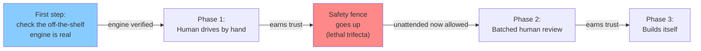

# How the Self-Building Software Factory Gets Built: A Plain-English Build Order

**Who this is for.** You don't write code, but you want to understand — and sanity-check — the plan for building a system that eventually builds software by itself. This is the map: what gets built first, what comes next, and why the order matters. No jargon survives here without a plain-language translation.

**The one-sentence version.** First we check that the engine we plan to build on is real; then we build a tool a person drives by hand; then — only after we put up a safety guardrail — we let it run in batches with a human reviewing its work; and finally, once it has earned trust, we let it build itself.

**The most important thing to know.** An expert panel reviewed the whole plan and reached one headline conclusion: the idea is sound, but the entire build is *gated* on one early check — confirming that the ready-made engine we plan to build on actually does what its makers claim. That check is the literal first practical step. If the engine doesn't behave as advertised, large parts of the plan rest on sand, so we look before we build.

**How to read this with the engineer's version.** This is the plain-English companion to the [engineer-level architecture guide](./architecture-guide-for-engineers.md), which names the exact components behind each plain-language term here. The operator decisions that shape the order below are recorded in [the decisions doc](./decisions-to-make.md). The two technical docs and this one are kept in sync.

---

## The three phases at a glance

The big idea: we don't flip a switch and walk away. We earn our way to autonomy in three steps (the "autonomy ladder"), each with a human doing less. But before the factory is ever allowed to run *unattended*, we put up a safety guardrail — the "fence." The fence is not the last thing we add; it is the price of admission to running on its own.

*Figure 1: The build order. The engine check comes first; a human does less at each phase; and the safety fence goes up before the factory is ever allowed to run unattended — not at the end.*

Here is the same picture in a table, so you can compare the phases side by side.

| Phase | Who's in control | What's new in this phase | What must already be true |
| --- | --- | --- | --- |
| **(before Phase 1)** | A person, checking the engine | Confirm the off-the-shelf engine does what it claims | Nothing — this is the first step |
| **Phase 1: Human drives** | A person, every step | The hand-driven loop; the corpus | The engine check passed |
| **Phase 2: Batched review** | A person, in batches | Batched-review loop; human "are the goals still right?" checkpoint | The **safety fence is up** |
| **Phase 3: Builds itself** | The factory itself | The twins; the automated drift detector | Fence proven in Phase 2; automated drift detector built |

---

## The off-the-shelf runtime check: the very first practical step

**What "off-the-shelf runtime" means.** It's the ready-made engine we plan to build the factory on top of — software someone else already wrote that runs the automated agents. ("Runtime" is just the thing that actually runs the program.) In this project it goes by the nickname "Gas City."

**Why it's first.** The expert panel called this out as the make-or-break assumption in the whole plan: everything downstream depends on that engine behaving as advertised. So before we build a single thing on top of it, we verify what it actually does versus what its makers claim. If it falls short, we find out now — when changing course is cheap — instead of after we've stacked the whole factory on top of it. This is why the panel made the runtime check a hard gate, and why it is the literal first practical step.

---

## Phase 1: A tool a person drives by hand

Phase 1 is where a person sits in the driver's seat the whole time. The factory proposes; the human decides. Nothing happens without a person clicking "yes."

**What gets built in Phase 1.**

- **The hand-driven loop.** A person gives the factory a task; it proposes a change; the person reviews and approves. This is the "human drives" loop — the first rung of the autonomy ladder.
- **The corpus.** The collection of design documents and decisions that the factory reads from. (The "corpus" is just the pile of writing that defines how the system should behave.)

Note what is *not* yet here: the factory is not allowed to run on its own. That permission is the boundary between Phase 1 and Phase 2 — and crossing it requires the safety fence first.

---

## The gate between Phase 1 and Phase 2: the safety fence goes up

This is the gate the factory must pass before it is ever allowed to run unattended.

**What the "lethal trifecta" is.** It's the dangerous combination of three things in one system: (1) access to private data, (2) the ability to read untrusted outside content, and (3) the ability to send data out. When all three line up, a booby-trapped input can trick the system into leaking secrets. The "fence" is the guardrail that breaks up that combination so the three powers can't be abused together.

**When the fence goes up — and why here.** The fence must be in place *before* the factory runs unattended. An unattended system with the lethal trifecta left unbroken is the single highest-severity risk in the entire plan — so it would be reckless to let the factory run in batches before the fence exists. The fence is therefore a gate at the Phase 1 → Phase 2 boundary, not a late add-on in the "builds itself" phase. Passing this gate is what *earns* the factory the right to run semi-unattended.

---

## Phase 2: Semi-unattended, with batched human review

Phase 2 is where the factory starts doing runs on its own and a person reviews the results in batches — not every single step, but a stack of work at a time. (This is the "semi-unattended" rung of the autonomy ladder.) It begins only after the fence is up.

**What gets built in Phase 2.**

- **The batched-review loop.** The factory does a chunk of work; a human reviews the whole batch at once.
- **The "are the goals still right?" checkpoint.** A cheap human check rides along with each batched review: as part of signing off on a batch, the reviewer also asks whether the work is still pointed at what you actually wanted. This is a quick gut-check by a person, not an automated system — that comes later.

---

## Phase 3: The factory builds itself

Phase 3 is full lights-out: the factory takes on work, does it, checks it, and only surfaces to a human when something genuinely needs a decision. This is the "builds itself" rung — the top of the autonomy ladder.

**What gets built in Phase 3.**

- **The twins.** Two copies of the factory that check each other's work. (The "twins" are a build-and-verify pair: one proposes, one independently confirms — so no single copy gets the last word.)
- **The automated objective-drift detector.** The automated version of the Phase 2 goal checkpoint. Before we go fully lights-out, the factory needs a machine that watches for the goals quietly drifting — because once a person is no longer reviewing each batch, there is no human left to ask "are the goals still right?" The factory cannot police its own goals until this detector exists, so it is a requirement *before* Phase 3 begins, not something we hope to add during it.

---

## The objective-drift watcher and detector

**The problem.** Over a long run, the factory can slowly wander away from what you actually asked for. ("Objective drift" just means the goals quietly changing out from under you.)

**The cheap human checkpoint (Phase 2).** While a person is still reviewing batches, drift is caught by that person: the "are the goals still right?" question is part of every batch sign-off. Cheap, human, good enough while a human is in the loop.

**The automated detector (Phase 3).** Once no human is reviewing each batch, the gut-check has to be done by a machine. The automated drift detector is therefore a hard prerequisite for going fully lights-out. No detector, no Phase 3.

---

## What unblocks what: the dependency spine

Read this as "you can't start the next thing until the previous thing is true":

1. **Check the off-the-shelf engine is real.** Unblocks everything — nothing is built on the engine until this passes.
2. **Build the hand-driven loop and the corpus (Phase 1).** A person drives every step.
3. **Put up the safety fence.** Unblocks running unattended. This gate must be passed before Phase 2.
4. **Run semi-unattended with batched review plus the human goals checkpoint (Phase 2).** Earns trust; proves the fence holds in real use.
5. **Build the automated drift detector and the twins.** Unblocks full lights-out.
6. **Let the factory build itself (Phase 3).**

The order matters most at two points: the engine check has to come first (or the whole stack may rest on sand), and the fence has to come before unattended running (or the highest-severity risk goes live with no human watching).

---

## How this maps to the engineer guide

Every plain-language term here has a precise counterpart in the [engineer-level architecture guide](./architecture-guide-for-engineers.md): "the fence" maps to the specific lethal-trifecta controls, "the twins" to the build-and-verify pair, "the autonomy ladder" to the staged-autonomy components, and "the off-the-shelf engine" to the named runtime. The decisions that fixed the build order — fence-before-unattended, the goals checkpoint, and engine-check-first — are recorded in [the decisions doc](./decisions-to-make.md).

---

*End of plain-English build order.*
