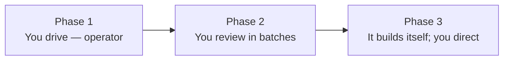

# How the factory gets built — in plain English

> **What this is:** a plain-language tour of the *order* we'd build this system in, for someone who doesn't write software. **The big idea:** we're building a "factory" that turns written instructions into working software — built so a person drives it at first, then supervises it in batches, then eventually lets it improve and extend itself. **How to read it:** three phases, in order; each says what gets built and, more importantly, what *you* can do once it's done.

## The one-paragraph version

Think of equipping a workshop. **Phase 1** builds the workshop and the tools, with a skilled person at the bench running everything by hand. **Phase 2** adds quality inspectors and safety guards, so the person can hand over a batch of work, walk away, and come back to review results instead of watching every cut. **Phase 3** teaches the workshop to design and build its *own* new tools — and to measure whether each change actually made it better — so it can extend itself while a human just checks in.

A few words used throughout:

- **The factory** — the whole system. You feed it a **spec** (a written description of what you want built); it produces working software.
- **Agent** — an AI worker (here, Claude) that reads instructions and does the work, like a tireless junior engineer.
- **Substrate** — the plumbing everything runs on (an off-the-shelf system plus the AI). Most of the factory is *assembled from existing open-source parts*, not invented from scratch — that's deliberate, to keep it buildable.
- **Held-out test** — a hidden exam. The factory keeps test cases the AI worker is *not allowed to see*, so it can't cheat by teaching to the test; a separate AI **judge** grades the work against them.
- **Autonomy** — how much the factory does without a human, on a ladder from "human does everything" up to "runs lights-out."

## Phase 1 — A human drives it

**Goal:** you write a spec, the factory attempts it, you review the result. Everything important still passes through human hands.

**What gets built (mostly assembled from existing open-source software):**

- The **workshop and plumbing** — the runtime the whole thing sits on, plus the AI worker.
- The **spec intake** — a structured way to write down what you want, clear enough to act on.
- The **path from spec to running software** — the wiring that turns your written spec into instructions the AI worker carries out.
- The **memory** — durable records of every task and every step the workers took, so nothing is lost between sessions.
- **Proof-readers** — automated checks that flag a malformed spec or a malformed workflow before any work starts.
- **Basic visibility** — so you can see what happened.

**What you can do at the end of Phase 1:** sit at the wheel, hand the factory a spec, watch it work, and review what it produced — with everything recorded. Useful, but it needs you watching.

**What's still manual:** judging whether the result is good; catching and fixing failures; deciding what to try next.

## Phase 2 — It checks its own work; you supervise in batches

**Goal:** the factory measures its own quality and recovers from its own failures, so you can review in batches instead of step-by-step.

**What gets built:**

- The **inspectors** — the held-out tests, the AI judge, and a "how satisfying is the result?" score. Quality is now *measured*, not eyeballed.
- The **self-healing loop** — the factory notices something went wrong, works out why, writes itself a fix task, and proves the fix worked.
- The **learning-from-corrections loop** — when you step in and override it, it asks "why?", remembers, and turns recurring corrections into new automatic rules.
- The **safety fence** *(this is decision #1 on your list)* — boundaries that stop the worker from doing dangerous things (reaching production systems, leaking data) by accident. The recommendation is that this lands **here**, before the factory runs with less supervision — not later.

**What you can do at the end of Phase 2:** hand over a batch of work, leave, and come back to a graded, partly-self-corrected result with a safety fence in place. You're a reviewer, not an operator.

**What's still manual:** approving big changes; the factory can't yet build genuinely new pieces of itself.

## Phase 3 — It builds and improves itself

**Goal:** the factory extends itself — authoring, validating, and tuning its own new parts — with a human checking in rather than driving.

**What gets built:**

- **Borrow-from-the-best discipline** — every new piece the factory builds must be modeled on a proven existing example *and* pass a test that it actually behaves like that example. ("The factory built it" must never mean "nobody checked it.")
- **The self-build loop** — the factory writes a spec for its *own* next component, builds it the normal way, and a human reviews it before it goes live.
- **Practice environments (twins) + the full safety fence** — realistic fakes of outside services so the factory can rehearse risky operations safely, plus the complete isolation that bounds the blast radius.
- **Self-improvement** — it tries variations of how it works, measures whether a variation was *actually* better (not just lucky), and promotes the winners — guarded so it can't "improve" by gaming its own score.
- The **drift-watcher** *(this is decision #2)* — a check that the factory is still pursuing what you asked for as it rewrites itself.
- Climbing the **autonomy ladder** toward lights-out.

**What you can do at the end of Phase 3:** let the factory propose and build its own improvements, reviewing in larger and larger batches — eventually approaching "it runs itself; you set the direction."

**Two honest caveats** (both on your decisions list): the hardest single piece — replaying a past run with one thing changed, to test an improvement — is only *partly* solved and stays human-supervised; and a couple of the safety mechanisms depend on first verifying that the off-the-shelf plumbing actually enforces what we're counting on — a check worth doing early.

## The shape of the whole thing

| Phase | You are the… | The factory can… | Still needs a human for… |
|---|---|---|---|
| **1 — Human drives** | Operator | Turn a spec into attempted software, all recorded | Judging, fixing, deciding what's next |
| **2 — Semi-unattended** | Reviewer | Measure its own quality + self-heal, behind a safety fence | Approving big changes; building new parts |
| **3 — Self-building** | Director | Build, validate, and tune its own new parts | Setting direction; final sign-off |

The open calls that shape Phases 2 and 3 — chiefly *when* the safety fence lands and *whether* to build the drift-watcher now — are written up for you in [the decisions guide](decisions-to-make.md).
