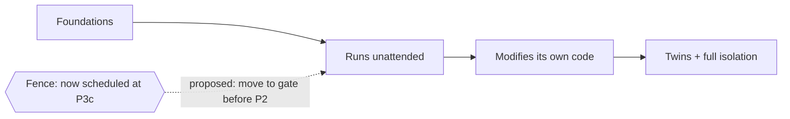

# Decisions to make — v4 Sweep-1 review items

> **What this is:** the handful of open questions the spec sweep surfaced that are genuinely *yours* to decide — written in plain language, not spec-ese. **What it's not:** the spec corpus itself (that's the machine-readable underlay). **How to read it:** each item is a question, with background, why it matters, the options with trade-offs, and my recommendation (clearly marked as opinion). Skim the summary table, then read the two security ones.

A few terms used throughout, defined once:

- **The factory** — the whole v4 system: a human-written spec flows in, working software comes out; a separate stream of *held-out tests* measures how satisfying the result is; a self-healing loop turns failures into fix tasks; and a *bootstrap* loop lets the factory build its own next pieces.
- **Gas City** (the `gc` runtime) — the off-the-shelf substrate everything sits on (workflow runner + agent dispatch + storage). It's the lineage Steve Yegge sketched as "Gas Town." **Important recurring caveat:** a lot of the factory assumes Gas City already does certain things ("native" behavior) that nobody has yet checked against a real install. Several decisions below are really "we won't know until we run `gc`."
- **The bar** — the rule that governed the whole build: only write custom code where off-the-shelf software genuinely can't deliver a capability tied to one of the 12 guiding principles; otherwise configure what already exists. It's why most components ended up as "config + glue," not new engines.
- **Autonomy ladder** — Laurent El Kaim's framing, from fully manual up to a lights-out "dark factory." v4 aims high (humans review in batches, or eventually not at all).

## The decisions at a glance

| # | The question, in plain terms | Kind | Urgency | My recommendation |
|---|---|---|---|---|
| 1 | Do we put the safety fence up *before* the factory runs unattended, or after? | Security trade-off | **Decide before any real build** | **Yes — put it up early** (split the work) |
| 2 | The "is it still doing what I asked?" watcher: build it, or just log that it's missing? | Security trade-off | Before running fully lights-out | **Log it now + a human checkpoint; build later** |
| 3 | The hardest unsolved piece (replaying a run with one thing changed): how far do we commit? | Research frontier | Not blocking | **Ship the easy half; keep the hard half experimental** |
| 4 | Does Gas City *prevent* bad access, or only *notice it after the fact*? | Depends on reality | First thing to check in the next pass | **Run a "Gas City reality check" before binding to either answer** |
| 5 | A wiring correction (one component reads from the wrong place on paper). | Housekeeping | Trivial | **Accept the fix; no real decision** |
| 6 | Secrets storage, and one library's confusing license. | Known gaps | When first needed | **Defer secrets to first real credential; pin a clearly-open license** |

---

## 1. Put the safety fence up before the factory runs unattended, or after?

*Filed in the decision log as **D-18** (marked "provisional — needs your confirmation").*

**Background.** Two different jobs guard the factory's blast radius:

- **The fence (deterministic boundary typing)** — labeling every action as touching *production*, an *isolated sandbox*, or a *twin* (a fake stand-in), and refusing the dangerous combinations by default. This is the defense against what Simon Willison named the **lethal trifecta**: when a single agent can read private data, *and* can be fed untrusted text, *and* can send data outward — that exact combination is what turns a prompt injection into real data theft. The fence keeps those three from lining up.
- **The twins (digital twins)** — behavioral clones of real external services (think LocalStack standing in for AWS) so the agent practices against a fake before touching the real thing.

The fence depends only on the permission/partition layer, which is already designed. The twins are a bigger, later build.

**What caused the issue.** The delivery plan currently schedules *all* of the isolation work — fence and twins together — late (the "build the twins" phase). But the same plan has the factory running **unattended at scale** and **modifying its own code** in *earlier* phases. So there's a window where the factory is doing its most dangerous things with no blast-radius fence in place — only after-the-fact detection.

**Impact of not addressing it.** During that window, a prompt-injection or a self-modification gone wrong has nothing stopping it in the moment; you'd only find out by reading the audit log afterward. On a system that edits itself, "we noticed after it happened" is the wrong failure mode.

**The options.**

| Option | Pros | Cons |
|---|---|---|
| **A — Split the work (recommended):** pull the *fence* forward to a gate the factory must pass *before* running unattended; leave the *twins* in the later phase. | Closes almost all of the dangerous window; the fence is cheap (it only needs the already-designed partition layer); reversible. | The fence without twins is partial — it can refuse dangerous combinations but can't yet offer a safe fake to run against, so some actions just get blocked rather than redirected. |
| **B — Leave it as-is:** fence + twins both land late. | Simplest plan; one isolation phase. | Accepts a real exposure window on a self-modifying system. This is the status quo the reviewer flagged as the run's single most consequential sequencing risk. |
| **C — Pull *everything* forward:** fence and twins both early. | Maximum safety earliest. | The twins are a major build; forcing them early delays everything and over-pays for safety you can stage. |

> **My recommendation (opinion):** **Option A.** The fence is low-cost and the window it closes is the scariest one in the whole plan. The twins genuinely can wait. **Rewind path:** this is one isolated entry in the decision log plus a one-line annotation in the phase plan; reverting it is a single commit if you decide the window is acceptable.

The shaded risk is the stretch from **Runs unattended** through **Modifies its own code** with no fence. Moving the fence to a gate before that stretch is the whole proposal.

---

## 2. The "is it still doing what I asked?" watcher — build it, or just log that it's missing?

*Filed as **OQ-C57-3** (the failure mode is catalogued as **F54, "objective drift"**).*

**Background.** **Objective drift** is the slow divergence between what you asked the factory to optimize and what it actually starts optimizing — especially once it tunes and rewrites itself. The capstone "residual-risk register" (the honest, hand-maintained list of every known failure mode and whether the factory handles it) lists a drift *audit* — a periodic check that goals still match intent — but **registers it as not built**, with no component owning it.

**What caused the issue.** Every other failure mode got assigned to a component that addresses it. The drift audit didn't — it's real, it matters most on a self-modifying system, and it fell into the gap between "governance" (the autonomy ladder) and "self-optimization" (the tuning loop). The register honestly marks it unbuilt rather than pretending it's covered.

**Impact of not addressing it.** A factory that optimizes and rewrites itself can gradually start hill-climbing the wrong hill — getting "better" at a proxy metric while drifting from your actual intent (the classic Goodhart problem: when a measure becomes a target, it stops being a good measure). With no watcher, drift is invisible until the output is visibly wrong.

**The options.**

| Option | Pros | Cons |
|---|---|---|
| **A — Log it + cheap human checkpoint (recommended):** keep it marked unbuilt, and tie a periodic "do the objectives still match intent?" review to each batched human-review point on the autonomy ladder. | Costs almost nothing (a checklist item at a review you're already doing); honest; good enough while a human is still in the loop in batches. | Not automated; relies on the human actually looking; insufficient once you go fully lights-out. |
| **B — Build a real drift detector now:** a component that watches the meta-metrics and the system's own edits for divergence. | Catches drift without a human; needed for true lights-out. | A genuine new build with no off-the-shelf answer; premature while you're still reviewing in batches — you'd be building the hardest governance piece before you need it. |
| **C — Do nothing, leave it unowned.** | Zero effort now. | The one residual the reviewer called loudest after the fence (item 1). Bad fit for a self-modifying system. |

> **My recommendation (opinion):** **Option A now, Option B before you ever run at the top of the autonomy ladder.** The cheap mitigation — a human eyeballing "are the goals still right?" at each batched review — buys you real safety while you're at the human-in-the-loop rungs, and defers the hard build until lights-out actually demands it.

---

## 3. The hardest unsolved piece — replaying a run with one thing changed

*Filed as **C49 / OQ-1** (the underlying gap is **G19**, flagged in the source material as "the most significant invention, largely unsolved").*

**Background.** **Counterfactual replay** means: take a recorded run, rewind to a midpoint, change one thing (a different prompt, a different setting), and replay forward to see if the variant would have done better. The trajectory store records everything and can branch cheaply, so rewinding is free. The *replaying* is the hard part, for two reasons: LLMs aren't deterministic (same input, different output), and external systems have state that's moved on since the recording.

**What caused the issue.** The source material itself calls this the factory's hardest, least-solved invention. The component was specced **honestly**: it split the problem rather than pretending to solve it.

- **The tractable half** — replaying the parts of a run that only touch *deterministic tools* or *twins* (the fakes from item 1) reproduces exactly. This is like a git cherry-pick or a Temporal workflow replay (Temporal is a durable-workflow engine that can deterministically re-run a recorded history).
- **The deferred half** — replaying the *LLM-thinking* parts can't claim to reproduce anything; it's offered as best-effort, variance-bounded, and human-reviewed.

**Impact of not addressing it.** Counterfactual replay is what the self-optimization loop wants in order to test variants cheaply. If you over-trust the LLM half — treat a non-reproducible replay as if it were a clean experiment — you'll promote "improvements" that were really just noise. The honest framing is the protection; the open question is *how much* to trust the LLM half before feeding it into a real decision.

**The options.**

| Option | Pros | Cons |
|---|---|---|
| **A — Ship the deterministic half, keep the LLM half experimental (recommended):** automate replay where it reproduces exactly; for the LLM half, require human review and never auto-promote on it alone. | Honest; delivers the real, usable capability now; can't be fooled by noise. | The self-optimization loop runs on a narrower base until the LLM half matures. |
| **B — Try to make the LLM half trustworthy now:** invest in calibration (how many samples, what variance bound, what false-positive guard makes an LLM replay "good enough"). | If it works, unlocks the full optimization loop. | Genuine research frontier; no known recipe; high risk of building something that quietly misleads. |
| **C — Gate the whole optimization loop on solving it.** | Intellectually clean. | Blocks a lot of working capability on the single hardest unsolved problem. |

> **My recommendation (opinion):** **Option A.** Take the half that works, keep the hard half clearly labeled and human-supervised, and let calibration (Option B) happen later as evidence accumulates — don't block the rest of the loop on it.

---

## 4. Does Gas City *prevent* bad access, or only *notice it after the fact*?

*Filed as the shared open question on the isolation and holdout components (**C43 / C34**), and it's one face of the bigger **"is Gas City real?"** caveat (gap **G11**).*

**Background.** Two safety mechanisms both hinge on the same unknown:

- **Holdout integrity** — keeping the held-out test scenarios unreadable by the coding agent, so it can't teach to the test.
- **The fence** from item 1 — keeping production access away from untrusted contexts.

Both can work two ways: **prevent** (the runtime physically refuses the access at the moment it's attempted) or **detect** (the access goes through, and an after-the-fact audit catches it). Prevention is strictly stronger.

**What caused the issue.** Which one you get depends on what Gas City actually enforces at the moment an agent makes a tool call — and nobody has verified that against a real `gc` install yet. The specs were written to work either way, honestly flagging that the strength of the guarantee is unknown until checked. This is the same caveat that hangs over every "Gas City does X natively" claim in the build.

**Impact of not addressing it.** If you assume "prevent" and it turns out to be "detect," your holdout and your fence are weaker than the design claims — the agent *could* read the test answers or reach production, and you'd only catch it in the audit. Build on the wrong assumption and you've baked a false sense of safety into the foundation.

**The options.**

| Option | Pros | Cons |
|---|---|---|
| **A — Run a "Gas City reality check" first (recommended):** before binding anything to either answer, stand up a real `gc` and test what it actually enforces (prevent vs. detect) for partitioned reads and tool access. | Replaces the single biggest assumption in the whole design with a fact; cheap (it's a focused spike, not a build); de-risks everything downstream. | A short delay before the next depth pass; might surface unwelcome news (which is the point). |
| **B — Assume "detect" and design around it:** treat both mechanisms as after-the-fact and add compensating checks. | Safe-by-pessimism; no surprises. | May over-build compensations Gas City didn't need; weaker than prevention if prevention was actually available. |
| **C — Assume "prevent" and proceed.** | Simplest; matches the optimistic reading. | If wrong, the foundation's safety is overstated and you find out late. |

> **My recommendation (opinion):** **Option A, and make it the first move of the next pass.** Almost every "native" claim in the build shares this unverified-substrate risk; a focused reality check against a real `gc` is the highest-leverage thing you can do before adding implementation depth. This is buildability-first thinking: verify the OSS substrate before assuming it.

---

## 5. A wiring correction (housekeeping)

*Filed as **OQ-6**.*

**Background and cause.** One component — the meta-metrics stream (which records things like cost-per-satisfaction over time) — is listed on paper as reading its cost signal from the raw-telemetry bridge. The reviewer found it actually gets that signal from the standard telemetry-metrics path and the trajectory store, with the bridge only writing provenance. So the dependency arrow in the inventory points at the wrong source.

**Impact of not addressing it.** Minimal — it's a paper inconsistency, not a behavior bug. Left unfixed it would mildly mislead whoever implements that component about where the data comes from.

> **Recommendation:** **Accept the correction in the next pass** (update the one dependency edge). There's no real trade-off here — it's a typo-class fix. Flagged only because it touches the shared inventory, which is why it surfaced as an item rather than being silently fixed.

---

## 6. Secrets storage, and one library's confusing license

*Filed as **G37** (secrets) and a license note on the A/B-routing component.*

**Background.** Two small known-gaps:

- **Secrets** — the factory will eventually need real credentials (API tokens, database passwords, certificates), and right now they'd live as plaintext in config. There's no secrets-management story. This also blocks the (deferred) signing feature, which needs somewhere safe to keep a key.
- **License** — one off-the-shelf feature-flag library (Unleash) is described one place as "commercial-with-open-core" and another as Apache-2.0. The two readings disagree.

**Impact of not addressing it.** Secrets: fine *until the first real credential* — at which point plaintext-in-config is a genuine exposure. License: trivial now, but you don't want to discover a commercial-license surprise after building on it.

**The options (secrets).**

| Option | Pros | Cons |
|---|---|---|
| **A — Defer until first real credential (recommended):** keep using config/env for now; adopt a minimal, off-the-shelf secrets approach (environment injection, or a tool like SOPS for encrypted files) the moment a real secret appears. | No premature build; matches "configure existing OSS"; nothing's exposed until there's something to expose. | Requires the discipline to actually do it at first-credential time, not after. |
| **B — Build/adopt a secrets layer now.** | Done before it's needed. | Premature; you'd pick a secrets model before you know the real requirements. |

> **Recommendation:** **Secrets — Option A.** **License — pin a known-open version of the flag tool, or pick an unambiguously-open alternative;** it's a version-pin, not a decision worth agonizing over.

---

## Honest disclosure

- Items **1 and 2** are real security trade-offs and genuinely yours — they trade a real exposure window against build sequencing, which is a risk-tolerance call I shouldn't make for you.
- Item **4** is the highest-leverage *fact-finding* move, not really a judgment call — the "decision" is just "go verify before assuming."
- Items **3, 5, 6** have a clear low-regret default; I've recommended it and you can mostly rubber-stamp.
- Everything here is **reversible** — each lives as an entry in the decision log or a single annotation, and the rewind path is named per item. None of these block merging the work that's done; they shape the *next* pass.
- What I don't know: the prevent-vs-detect answer (item 4) and the LLM-replay trustworthiness (item 3) both depend on facts not yet in evidence. I've flagged them as open rather than guessing.
