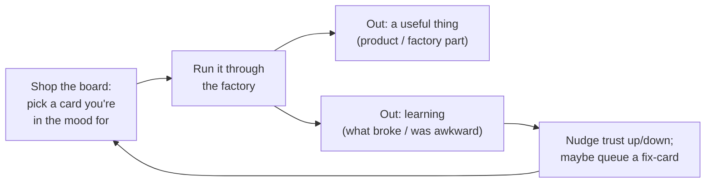

# The factory discovery charter — what we're doing, why, and how

> **Audience:** future agents (and the human, jonathan@manton.com) picking up this work. Read this to
> get the *feel* of the project before diving into specifics. It is the North Star; the
> [next-steps report](next-steps-plain-english.md) and the
> [methodology companion](methodology-and-formulas-plain-english.md) are the practical companions, and
> the working corpus in [`architectures/v4/_meta/next-steps/`](architectures/v4/_meta/next-steps/) is
> the evidence trail.
>
> **This charter was distilled from a working conversation.** An earlier draft of the next-steps plan
> got the framing wrong (it read as a march toward a *finished* factory, with agent-os as the single
> workload, run like a batched production line). This charter records the *corrected* understanding.
> Where the older artifacts disagree with this charter on framing, **this charter wins.**

---

## The North Star (one paragraph)

We are building an **AI software factory** (the v4 system in this repo) — but the factory is **not the
goal**. The goal is to build a *portfolio of real software projects* (agent-os is the first of several)
**semi-autonomously**, and to *learn* — about AI factories, about methodology, about what's actually
hard — by doing it. The factory is a **prototype** whose job is to be good enough to start real work so
that the real work *teaches us what the factory must become*. This is a **personal project, done for
enjoyment and learning.** If it stops being fun, it stops. So **fun is a first-class design
constraint**, not a nicety — every decision below is shaped by "would a curious person enjoy doing
this on a weekend?"

---

## Two load-bearing reframes

**1. Co-implementation, not hand-off.** We do *not* finish the factory and then use it. We build the
factory and the products **at the same time**. Each product component we build is a **driver**: real
work that exercises the factory, exposes its next weakness, and that weakness becomes the next factory
improvement. The factory and the products advance together, one component at a time.

**2. A prototype for discovery, not a destination.** The v4 factory *as designed* will **not** be the
system we ultimately want. It is scaffolding — deliberately a prototype — that exists to drive
development and evolution. Success is **not** "factory finished." Success is "real work has shown us,
with evidence, what to build next." **Discovery is the deliverable**, and it continues through every
component we exercise.

---

## How it's structured

### The core loop

You shop a **board** of candidate next things, pick one by mood, run it, and harvest two outputs: a
**useful artifact** and **learning**. The learning nudges your trust in the factory's parts and may
add a new card. Repeat. There is no rigid sequence after the short on-ramp (below).

### The trust map (how we track "is the factory any good yet?")
Nothing ever becomes *proven*; it just earns **gradually more trust**. Every built capability carries a
**trust level** on a deliberately-playful ladder:

- 🌑 **Untouched** — built, never exercised. No evidence.
- 🌒 **Smoke-OK** — survived one trivial run.
- 🌓 **Poked** — survived a *deliberate* pressure-test aimed at it.
- 🌔 **Worked** — helped build a real, useful thing at least once.
- 🌕 **Trusted** — survived several different real jobs, *including* a failure it recovered from.

**How to gauge it: mostly by feel, backed by free evidence.** Set a gut rating when you like; let the
work nudge it (each rung-up has a cheap trigger that is a *byproduct of work you already did* — was it
exercised? did a toy aimed at it pass? did it ship a real driver?). **Bookkeeping must be a byproduct,
never a chore** — the moment trust-tracking feels like filling a spreadsheet, it has failed.

### The board (a play menu of cards)
Not a queue, not two tracks — a **menu you shop by mood**. Each item is a **card** carrying:
*what it pressures* (and that target's current trust) · *size* · **fun/vibe** · *what you'll learn* ·
*dual-use payoff* (throwaway → scaffold-toward-real → real product → grows-the-factory) · *prereqs*.
You pick whatever you fancy, you can **insert your own** project anytime (we just tag it so it still
counts toward coverage), and a soft nudge surfaces **lonely capabilities** (low-trust, not visited
lately) as *suggestions, never mandates*.

### The two ledgers (the only "records" we keep — both byproducts)
- **Defect ledger** — every failed build, tagged by which corner of the *triangle* was at fault
  (spec / scenarios / system / judge). Keeps *product* quality honest.
- **Factory-gap ledger** — every time real work hits a factory limitation (missing part, awkward
  formula, judge weakness, substrate surprise, work-it-can't-build-yet). **This ledger — not a roadmap
  guessed up front — decides which factory part we build next.**

---

## The vocabulary (use these terms precisely)

| Term | Precise meaning |
|---|---|
| **Trust map** | The per-capability **trust level** (🌑→🌕) over everything the factory has built. Replaces the earlier (wrong) binary "proven/unproven." |
| **Pressure target** | The specific built-but-low-trust capability an exercise is *chosen to stress*. |
| **Pressure-test** | Running a workload picked specifically to drive its pressure target hard enough to expose defects. |
| **Exercise** | Umbrella term: any unit of work put through the factory mainly to *learn about the factory*. Attributes: pressure target, realism, fun, dual-use value. |
| **Driver** | An exercise whose output is *a real thing we want to exist* (so the test pays for itself). |
| **Dual-use** | Property: the exercise's output stays valuable after the lesson. Drivers are dual-use; pure toys may not be. |
| **Toy** | A deliberately minimal exercise that strips real-system complexity to stress *one or a few* capabilities **in isolation** — cheap, fail-fast. |
| **Reduced model** | A toy that is a *shrunk-down version of a real target component*, simplified until it mainly pressures the capabilities you care about. The sweet spot: isolating *and* on the path to the real thing, so learning transfers. |
| **Self-build (dogfood)** | An exercise whose target is one of the factory's *own* remaining v4 components. Maximally dual-use; it's the bootstrap thesis under test. |
| **Invented project** | A made-up *fun little project* created to pressure a capability that lacks a natural toy or reduced model. Pressure-testing and amusement, same move. |
| **Board / play menu** | The browsable set of **cards** you shop by mood. |
| **Card** | The unit you choose: a described candidate exercise (pressures / size / fun / learning / payoff / prereqs). |
| **Coverage (gentle nudge)** | How well the board, over time, visits every low-trust capability. A *soft pull* (surface lonely capabilities), never a nagging matrix. |
| **Complexity ramp** | The bias to go toy → reduced model → real driver, so gross defects surface in simple settings before real-system complexity. |
| **The triangle** | The defect-finding method: a build is "done" only when **spec**, **scenarios**, and **system** agree; the AI judge *diagnoses which corner* is at fault (or itself). See [ADR-0069](docs/adr/0069-spec-scenarios-system-triangle-evaluation-invariant.md). |

---

## The rules of the game (hard-won; respect these regardless of which card you play)

These came out of a six-expert adversarial review (see
[the verdict ledger](architectures/v4/_meta/next-steps/panel/VERDICT.md)) and are *not* up for
re-litigation without new evidence:

1. **Verify the substrate before trusting it.** The Gas City "native" claims (including whether it
   *prevents* bad access or only *detects* it after the fact) are unverified until run. The conformance
   check is the literal first move. If it's **detect-only**, unattended operation is **blocked** until
   prevention exists.
2. **Calibrate the measuring instruments before believing their readings.** The AI **judge** is the
   most important and most fragile instrument. Prove its false-green rate is low (statistically, with
   ≥2 human labellers) *before* its diagnoses drive any decision. Until then, every build gets full
   human review.
3. **Lock the test vault — including the write path.** Held-out scenarios must be unreadable *and*
   un-weakenable by the worker, and authored by an independent role (not solely from a component's own
   acceptance criteria).
4. **The triangle is how defects are found**, and the judge is a *diagnostician*, not a scorer.
5. **One operator, one AI seat, serial.** "Parallel rigs" is config partitioning, not added compute.
   Plan for getting it *right*, not *fast*; production-line speed is a much later horizon.
6. **Architecture specs aren't buildable specs.** Real product specs (e.g. agent-os) carry deliberate
   "undecided" holes; a **human-led spec-completion pass** is the real first step before a build.
7. **The factory is unproven by construction** — say so honestly in every artifact.

---

## The operating principle that ties it together: keep it fun

- **Bookkeeping is a byproduct, never a task.** Trust levels and ledgers fall out of the playing; if
  they ever feel like admin, simplify them away.
- **The board is mood-indexed.** Low-energy night → a 🌒 smoke-toy. "Let's go" night → a real driver.
- **Invented-for-fun projects are legitimate** when they pressure a lonely capability.
- **Fun and coverage are not in tension** — we just annotate whatever you feel like doing so it still
  contributes. The system serves the play, not the other way around.

---

## Pointers

- **Practical "what to do next":** [the next-steps report](next-steps-plain-english.md).
- **The concrete methodology (Gas City formulas + the co-implementation loop):**
  [the methodology companion](methodology-and-formulas-plain-english.md).
- **The reasoning trail** (three competing draft plans, the unified plan, the six-expert panel, the
  fact-check, the adopted-amendments verdict):
  [`architectures/v4/_meta/next-steps/`](architectures/v4/_meta/next-steps/).
- **The factory design itself:** [the v4 README](architectures/v4/README.md),
  [the implementer build order](architectures/v4/implementation-dependencies.md).

*This is a living charter. It will evolve as real work teaches us more — which is the whole point.*
