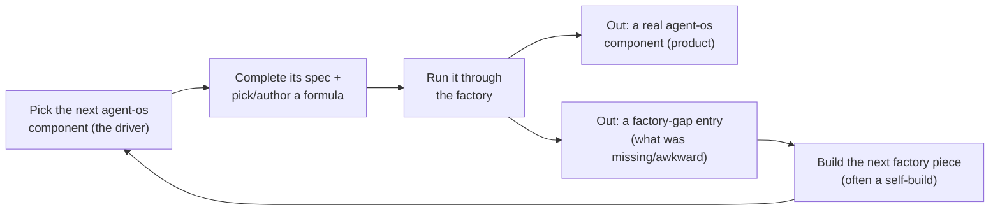

# The methodology: Gas City formulas, and the co-implementation loop

**Who this is for.** You, again — steering the project. This is the companion to
[the next-steps report](next-steps-plain-english.md). That report answered *what to do*; this one
answers the two things it under-served: **(1) the concrete methodology — the actual Gas City
"formulas" (workflow recipes) you feed the factory, how you author them, run them, and experiment
with them; and (2) the framing that this is a *co-implementation* — you are building the factory and
agent-os *at the same time*, using agent-os work as the driver that discovers what the factory needs
next.** The factory you have at the end is not the factory you want; it's a prototype whose job is to
*teach you* what to build.

> **One honesty flag up front.** The exact file format of a Gas City formula is *Gas City's own, and
> nobody has run it against our assumptions yet* (this is the same unverified-substrate caveat that
> makes the [conformance check](architectures/v4/spec/C12-formula-pipeline-file.md#9-open-questions) the
> literal first step). So every formula example below is the **shape** — the model of steps, kinds,
> and ordering that the design commits to — **not verified syntax.** Confirming the real keys against a
> live `gc` is part of Gate 0. I'd rather show you a clearly-labeled illustration than invent precise
> syntax and pass it off as fact.

---

## Part 1 — The reframe: a prototype for discovery, built alongside its first real job

The earlier report read like a march toward a finished factory. That's wrong, and you were right to
flag it. The truth is a **two-way build**:

- The **factory** (the v4 system) is a **prototype**. It will *not* be the system you ultimately want.
  Its purpose is to be *good enough to start real work*, so that the real work shows you — concretely,
  with evidence — what the factory actually needs to become.
- **agent-os** is the **real driver**. Each agent-os component you point the factory at is two things
  at once: **product progress** (a real piece of the platform you want) *and* a **test case that
  stresses the factory** and exposes its next weakness.

So the unit of progress isn't "factory done, then agent-os built." It's a **ratchet**: pick an
agent-os component → try to build it → the attempt reveals a factory gap → close that gap (often by
having the factory build its own next piece) → the stronger factory makes the next agent-os component
easier → repeat. **Discovery is the deliverable.** You're not trying to reach an end state; you're
trying to *learn the right end state* by doing non-trivial real work through an evolving tool.



The left-to-right is product progress; the loop back through **E → F → A** is the factory *evolving
because of* the real work. Both happen on every component.

---

## Part 2 — What a "formula" actually is

A **formula** is a **workflow recipe written as a version-controlled file** — a small graph of steps
and the order they run in. The single most important idea (this is the whole point of the design):
**the methodology lives in this file, not in the AI's head or its prompts.** Want to change *how* the
factory builds — add a review step, loop on failures, replace an AI step with a deterministic one?
You **edit the file.** That makes the methodology something you can *diff, lint, draw, and swap* — an
experiment you run, not an argument you have. (Grounded in
[the formula spec](architectures/v4/spec/C12-formula-pipeline-file.md).)

A formula is built from exactly **four kinds of step**:

| Step kind | Plain meaning | Why it matters |
|---|---|---|
| **`tool`** | A *deterministic* step — a script/program runs, no AI. (e.g. run the unit tests, lint the spec, render a config.) | **Free and reproducible.** No AI tokens, same output every time. The design wants these *wherever reasoning isn't needed*. |
| **`agent`** | An *AI* step — a model reasons and acts, following a named prompt template. (e.g. "implement from this plan.") | This is where the cost and the intelligence live. Use sparingly and on purpose. |
| **`gate`** | A *wait* — pause for a human approval or for a condition. (e.g. the human "ship it?" gate.) | This is where *you* sit in the loop. Gate placement is a methodology choice that lives in the file. |
| **`sub_formula`** | *Call another recipe* by name. | Lets you compose big workflows from small reusable ones. |

Two more pieces: a formula declares **parameters** (slots the run fills in, like *which spec*, *which
test set*), and iteration is expressed as a **bounded loop** (a step that re-enters under a condition,
*up to N times* — never an unbounded cycle). There's a built-in discipline check (the "discipline
linter") that **flags an `agent` step where a `tool` step would have done the job** — so the file
itself nudges you toward cheap, deterministic work.

---

## Part 3 — A concrete first formula (illustrative shape)

Here is the recipe for building one agent-os code component — the **design → plan → implement →
review → test** chain, with a human gate and the diagnostician judge. Read the comments; they're the
methodology.

```toml
# build-component-v1  —  ILLUSTRATIVE SHAPE (exact keys are Gas City's, confirm at Gate 0)
# The methodology IS this file: a plan step, a cheap spec-lint, an implement step,
# deterministic tests, the diagnostician judge, a human gate, and a bounded fix-loop.
name = "build-component-v1"

# Slots the run fills in at start:
params = ["spec_path", "scenario_set", "component_repo"]

[[node]]
id   = "lint_spec"
kind = "tool"                 # deterministic, no AI: is the spec even well-formed?
tool = "ears-spec-linter"     # <- references a tool node BY NAME (C17)
in   = ["$spec_path"]

[[node]]
id   = "plan"
kind = "agent"                # AI: turn the spec into an ordered build plan
prompt = "plan-from-spec"     # <- references a prompt template BY NAME (C09)
after  = ["lint_spec"]

[[node]]
id   = "implement"
kind = "agent"                # AI: write the code against the plan
prompt = "implement-from-plan"
after  = ["plan"]

[[node]]
id   = "unit_tests"
kind = "tool"                 # deterministic: run the component's own PyTest suite
tool = "pytest-runner"
after = ["implement"]

[[node]]
id   = "judge"
kind = "agent"                # AI judge in a SEPARATE rig: diagnose, don't just score
prompt = "diagnose-trajectory" # (a different model family is the AIM — see note below)
in   = ["$scenario_set"]      # the held-out tests the worker never saw
after = ["unit_tests"]

[[node]]
id   = "human_gate"
kind = "gate"                 # YOU sit here: the ship-it / don't-ship decision
after = ["judge"]

# Bounded loop: if the judge blames the CODE, re-implement — at most 3 tries, then stop.
[loop "fix_cycle"]
from = "judge"
to   = "implement"
condition = "root_cause == 'system'"
max_iterations = 3
```

Notice what's *in the file*: the order of work, where the human sits, that the judge is a separate
step, that tests are deterministic, and that failures loop a *bounded* number of times and only when
the fault is the code. None of that lives in a prompt. To **see** it, you export it to a picture:
`gc formula export build-component-v1 --format dot` renders the graph.

**Three honesty notes on that example** (so you don't take illustration for fact):
- **The judge's "different model family" is the *aim*, not today's reality.** The safer design wants
  the judge to be a *different* AI family from the coder (same-family judges share blind spots — this
  is why the
  [eval scientist on the panel](architectures/v4/_meta/next-steps/panel/03-eval-measurement.md) pushed
  for it). But the early design **relaxes cross-family to *advisory*** — at this phase the judge runs
  in a *separate sandbox* but may be the *same* family
  ([judge spec C32 §9](architectures/v4/spec/C32-judge-harness.md); model-floor C29 sets
  `cross_family_required: false` early). So if it's same-family for now, **trust its verdicts with
  extra caution** — which is exactly what the judge-calibration step in
  [the main report](next-steps-plain-english.md) is for.
- **The `$slot` parameter style is borrowed** from non-Gas-City pipeline examples, not from a verified
  Gas City formula ([C12 §3.1, the parameter FAITHFUL-FILL](architectures/v4/spec/C12-formula-pipeline-file.md#31-the-formula-artifact-named-structure)) — illustration only.
- **The `[loop]` block keys are invented for legibility.** Gas City's real loop primitive is unverified
  ([C12 open question #2](architectures/v4/spec/C12-formula-pipeline-file.md#9-open-questions)); the
  design only commits that iteration is *bounded and lintable*, not to these key names.

---

## Part 4 — How you actually run one (the operator's loop)

1. **Complete the spec.** Take the agent-os `spec-Bxx.md`, fill its deliberate "undecided" holes into
   a build-ready spec (the spec-completion pass — this is human-led early on). This is real work and
   the honest first step; the factory doesn't conjure a buildable spec from a blueprint.
2. **Pick or author the formula.** Start from `build-component-v1` above; later you'll have a small
   library (one shape for code components, another for install-and-configure components).
3. **Run it.** Point the formula at the spec, the held-out scenario set, and the target repo. The
   factory instantiates the recipe into a live run (a "molecule" — the recipe with real work attached),
   walks the steps in order, and dispatches each `agent` step to a worker and each `tool` step to a
   script.
4. **Watch it as beads.** Every step becomes a recorded, attributed unit of work you can inspect — who
   did what, what the judge diagnosed, where it looped.
5. **Hit the gate.** At `human_gate` you get the judge's diagnosis and the evidence, and you make the
   ship-it / don't-ship call. A "don't ship" is a *finding*, not a failure.

---

## Part 5 — How you *experiment* with formulas (this is the methodology science)

This is the heart of what you asked for. Because the methodology is a file, you can run **controlled
experiments on how to build** — and the factory already has the fair-comparison machinery: the *same*
held-out scenarios and the *same* judge ([the methodology-experiment loop, C55](architectures/v4/spec/C55-methodology-experiment.md)).

**The core experiment.** Take *one* agent-os component. Build it two ways — two formula files — and
score both against the **same** held-out scenarios with the **same** judge. Compare the satisfaction.
The better formula wins *for that kind of work*, on evidence, not opinion.

Concrete variations worth running early:

- **Add a review step.** `build-component-v2` inserts a `plan_review` agent (or human) gate between
  *plan* and *implement*. Question: does reviewing the plan before coding raise satisfaction enough to
  justify the extra cost?
- **Deterministic-first.** `build-component-v3` replaces an `agent` step with a `tool` step wherever a
  script suffices (e.g. scaffold the repo skeleton deterministically instead of asking the AI). The
  discipline linter is *already* pushing you here; this measures the payoff. Cheaper *and* more
  reproducible if it works.
- **Two-pass self-critique.** A variant where *implement* is followed by a `critique` agent that finds
  its own bugs before the judge sees it. Does catching your own mistakes beat looping after the judge?
- **Loop bound and topology.** Change `max_iterations`, or loop on `root_cause == 'spec'` to route
  ambiguous-spec failures back to a spec-fix step instead of dead-ending. The loop shape is a
  methodology choice you can tune and measure.

**The work-type discovery.** Install-and-configure components (the Workstream-A platform pieces) and
custom-code components (Workstream-B) almost certainly want *different* recipes — a config component's
"implement" is rendering Helm values and its "tests" are conformance checks against a (twinned)
cluster, where a code component's are PyTest. You don't guess which recipe fits which; you **run the
experiment per work-type and let the satisfaction numbers tell you** — exactly the
[methodology-as-config](architectures/v4/spec/C55-methodology-experiment.md) idea, made concrete on
real agent-os work.

**Keep it honest and cheap.** You have one AI seat working serially, so this is *deliberate, small*
experimentation — two or three formula variants on one component, not a giant grid. Each variant is a
version-controlled file; the diff *is* the record of the methodology change.

---

## Part 6 — The co-implementation loop, worked end-to-end

Here's the ratchet on a real example, so the abstract loop above is concrete:

1. **Driver:** you aim the factory at agent-os **B12** (the event schema registry — real, useful, no
   cluster needed).
2. **Run it** with `build-component-v1`.
3. **Two outputs.** *Product:* a B12 repo (maybe). *Discovery:* the run exposes factory gaps — say,
   "the spec-completion pass was painful and ad-hoc," or "the judge couldn't tell a *spec* defect from
   a *system* defect on schema work," or "I couldn't *see* what the formula did until I hand-drew it."
4. **Log the gap** in a **factory-gap ledger** (see Part 7).
5. **Close the top gap by improving the factory** — and here's the recursion: that improvement is
   itself often a build the factory can do. "I need to *see* formulas" → build the **DOT visualizer**.
   "The judge mis-blames" → recalibrate it. "Spec completion is ad-hoc" → strengthen the **intent
   crucible**. Each is a small factory component, built (where possible) *by the factory*, reviewed by
   you. **This isn't automatic, though** — a factory self-build rides on the same guardrails as any
   build: it needs a real external example to copy (no invention from scratch), it passes your
   mandatory design-review gate before it deploys, and the whole "factory builds factory" idea is
   itself one of the bets these weeks are testing. Early on, expect to hand-build some of these factory
   pieces yourself; handing more of them to the factory is part of what you're *discovering*.
6. **Re-run** B12 — or move to the next agent-os component — with the now-stronger factory.

Every agent-os component you tackle leaves the factory measurably better *and* leaves a real piece of
the product behind. That's the co-implementation: you are not finishing one before starting the other;
each turn of the crank advances both.

---

## Part 7 — What discovery looks like: two running ledgers

Discovery isn't a vibe; it's two lists you keep as you go.

- **The defect ledger** (from the main report): every failed build, tagged by *which corner of the
  triangle* was at fault — spec, tests, system, or the judge itself. This keeps *product* quality
  honest.
- **The factory-gap ledger** (new, and the engine of evolution): every time real agent-os work hits a
  factory limitation — a missing component, an awkward formula, a judge weakness, a substrate surprise,
  a kind of work the factory can't yet build (cluster-bound components will show up here fast). **This
  ledger — not a guess made in advance — is what decides which factory piece you build next.** It is
  the empirical replacement for any pre-baked "build these components next" list.

When the factory-gap ledger keeps saying the same thing ("can't build cluster components without
practice twins"), that's your signal for the next *big* factory investment (twins, almost certainly).
You build it because the real work *demonstrated* you need it — not because a roadmap predicted it.

---

## Part 8 — The honest end-state

After these weeks you will **not** have "the factory." You'll have a prototype that has *earned* a
real, evidence-backed list of what the factory must become: which formula shapes actually work for
which kind of agent-os component, how trustworthy the judge really is, where the substrate surprised
you, and what's blocking the next tranche of agent-os (twins, near-certainly). You'll also have a
handful of *real* agent-os components and a methodology you can *show* — files you can diff — rather
than a philosophy. That is the win condition: **not a finished factory, but a factory whose next
version you can now specify because real work taught you how.**

---

*Companion to [the next-steps report](next-steps-plain-english.md); both sit over the working corpus
in [`architectures/v4/_meta/next-steps/`](architectures/v4/_meta/next-steps/). Formula mechanics are
grounded in [the formula spec (C12)](architectures/v4/spec/C12-formula-pipeline-file.md) and
[the methodology-experiment loop (C55)](architectures/v4/spec/C55-methodology-experiment.md); exact
Gas City formula syntax is unverified pending the Gate-0 conformance check.*
