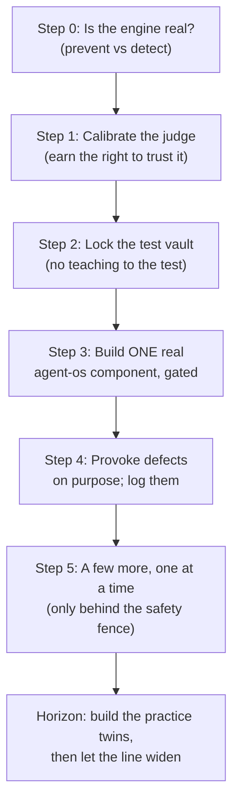

# What to do next: exercising the factory to build agent-os

**Who this is for.** You, the person steering this project. You don't write the code, but you decide
what the factory works on and when to trust it. This is the plain-language plan for the **2–3 weeks
after the first 25 components are built** — how to put *real* work through the factory, find its real
defects through a real process, fix them, and grow it toward the actual goal: **building
[`lago-morph/agent-os`](https://github.com/lago-morph/agent-os) semi-autonomously.**

**Two framings that shape everything below (and that an earlier draft of this got wrong).**
- **This is a *co-implementation*, not a hand-off.** You are **not** finishing the factory and *then*
  building agent-os. You build both at once: each agent-os component is a *driver* — real work that
  exercises the factory, exposes its next weakness, and that weakness becomes the next factory
  improvement. The factory and the product advance together, one component at a time.
- **The factory is a *prototype for discovery*, not a destination.** The v4 factory as designed is
  **not** the system you ultimately want — it is scaffolding good enough to start real work, so the
  real work can *teach you* what the factory must become. Success isn't "factory finished"; it's
  "real work has shown us, with evidence, what to build next." Discovery continues through every
  component you exercise.

**The concrete methodology — the actual Gas City "formulas" (the workflow recipes you feed in), how
you author, run, and experiment with them, and the co-implementation loop worked end-to-end — lives
in the companion: [the methodology &amp; formulas report](methodology-and-formulas-plain-english.md).**
Read this report for *what to do*; read the companion for *how the building actually works*.

This plan was drafted, then handed to a **panel of six experts** (a software architect, a
safety/security reviewer, an evaluation scientist, a delivery/operations lead, a "does this really
build itself?" skeptic, and an operator-experience reviewer). All six accepted the overall shape and
required specific fixes. Their fixes are folded in below. The full working corpus — three competing
draft plans, the unified plan, and all six critiques — lives in
[`architectures/v4/_meta/next-steps/`](architectures/v4/_meta/next-steps/); the adopted-amendments
ledger is [the panel verdict](architectures/v4/_meta/next-steps/panel/VERDICT.md).

---

## The one-paragraph answer

Spend the next 2–3 weeks proving — on *one real piece of agent-os* — that the factory can be
**trusted**, not that it can be busy. First make sure the engine actually does what we assumed.
Then **calibrate the factory's built-in inspector before you believe a word it says.** Then take one
genuinely useful agent-os component, finish turning its blueprint into a build-ready spec, build it,
and put the result through the safety gate. Then deliberately try to *break* the factory to find its
defects, writing each one down by cause. Only after that, and only behind the safety fence, build a
few more — one at a time. The big lesson you should expect to learn is **what the factory cannot yet
build on its own** (almost certainly: it needs "practice twins" of cloud services), and that becomes
the next thing you build.

---

## A few terms, defined once

- **The factory** — the v4 system in this repo: you give it a written spec, it produces working
  software, a separate set of held-out tests measures how good the result is, and a human signs off
  before anything ships. (Its nickname for the off-the-shelf engine it runs on is "Gas City.")
- **agent-os** — the *real product* you actually want. It's a platform for running AI agents safely on
  Kubernetes (with one controlled chokepoint for all AI and network traffic, policy enforcement
  everywhere, and a self-monitoring agent). Today it exists as a **big pile of design documents** —
  about **65 components**, each already carrying a written spec and an implementation plan — waiting to
  be turned into real code. That makes it the perfect fuel for a "specs in, software out" factory.
- **A component** — one bounded piece of software with its own repo and its own tests. agent-os has
  ~65 of them; we'll build the easiest *useful* ones first.
- **The judge** — the factory's built-in inspector: an AI that looks at a finished build and, instead
  of just giving a grade, **diagnoses** what's wrong and *where* the fault lies. It is the single most
  important — and most fragile — instrument in the whole system.
- **The triangle** — the method for finding defects (explained below). Every problem is blamed on one
  of three corners: the **spec**, the **tests**, or the **system** (the built code) — or on the judge
  itself.
- **The fence / twins** — the **fence** is the safety guardrail that stops the factory leaking private
  data when it runs on its own; the **twins** are realistic fakes of outside services (e.g. a fake AWS)
  so the factory can practice risky operations without touching anything real.

---

## Where we are, and what "the first 25 are done" actually buys us

The first 25 components are not 25 separate programs — they're **one engine plus six small custom
pieces** that together give the factory its core ability:

> **take a written spec → build the software in a sealed sandbox → have the judge score and diagnose it
> → and pass it through a human "ship it / don't ship it" gate.**

That ability is the whole point. Everything in this plan is about *using* it on real agent-os work and
learning where it's weak. (The detailed engineering version is
[the build order](architectures/v4/implementation-dependencies.md); the design of the ship-it gate is
[the bootstrap-validation milestone](architectures/v4/spec/C53-bootstrap-validation.md).)

**The honest reframe the panel forced.** It's tempting to think the factory can read an agent-os design
document and just build it. It can't — *yet* — and pretending otherwise would set us up to fail. The
agent-os documents are **blueprints of record**, deliberately dotted with little "we haven't decided
this detail yet" markers (their own good discipline). The factory's held-out tests would land exactly
on those undecided details and (correctly) report "the spec is incomplete" — over and over. So **the
real first job on any agent-os component is a spec-completion pass**: a human (with the factory's help)
fills in the undecided details to make a genuinely build-ready spec *before* handing it over. This
isn't a detour — it's the actual work, and naming it honestly is what keeps the whole effort from
chasing its own tail.

---

## The big idea: trust the inspector *before* you trust its verdicts

The factory's ship-it gate is only as good as the judge feeding it. If the judge quietly
mis-diagnoses — says "the code is fine" when it isn't, or blames the spec when the real fault is the
code — then every decision built on top is built on sand. So the first real move is not to build
anything impressive; it's to **measure whether the judge can be trusted**, and to keep every build
under full human review until it has earned that trust. The evaluation scientist on the panel was
blunt: as originally written, "the judge is calibrated" was a feeling, not a fact. The plan now makes
it a *measured* fact (details in Step 1).

---

## The 2–3 week walk

These are **ordered gates**, not a day-by-day schedule — each one has to be *true* before the next
begins. (Why no day counts: with one person and one AI "seat," real durations depend on how the early
gates go; naming fake dates would just be theater.)

### Step 0 — Confirm the engine is real (a day or two)
We *assume* the engine refuses dangerous actions outright. We've never verified it. The one question
that matters: when an agent tries to read something it shouldn't, does the engine **physically refuse
it** ("prevent"), or does it let it through and just **note it in a log afterward** ("detect")?
- **Why it matters:** "detect-only" makes the safety fence and the sealed test vault *weaker than the
  design claims.*
- **The binding consequence (panel fix):** if it's detect-only, then **the factory is not allowed to
  run unattended at all** until prevention is established — full human review stays on. This isn't a
  preference; it's the standing safety rule
  ([the fence decision](decisions-to-make.md#1-put-the-safety-fence-up-before-the-factory-runs-unattended-or-after)).
- **Also do here:** a five-minute cost sanity-check. We have **one AI seat**. Running many builds and
  many judge passes all goes through that one seat *one at a time* — so "run things in parallel" buys
  us almost nothing in speed. Better to know that now than to plan around throughput we don't have.
- **Done when:** you have a one-page note recording "prevent" or "detect," and the safety posture that
  follows from it.

### Step 1 — Calibrate the judge (earn the right to trust it)
Before the judge's diagnoses are allowed to drive any decision, we measure how often it's wrong — and
specifically how often it gives a **false green** (says "good" when it isn't), the dangerous error.
The panel turned this from a vibe into a real measurement:
- Show the judge a set of builds where we *already know* the right answer, including **deliberately
  broken** ones for each corner of the triangle. (Some of these we'll have to *fabricate* up front,
  because real broken builds don't exist before we've built anything — a small, honest workaround.)
- **Two people** label the known-answers independently and we check they agree; one fallible labeller
  isn't enough to grade a fallible judge.
- The judge **passes only if its false-green rate is provably low** (a statistical bound, not a lucky
  single score), and it must do well on *each* corner, not just on average.
- Run the judge in a **separate sandbox**, and *aim* for a **different AI family** from the one writing
  the code (same-family judges share blind spots). Note the early design **relaxes this to advisory** —
  so if the judge is the same family for now, treat its verdicts with extra caution; that's part of why
  this calibration matters.
- **Time-box it.** Use a small, fixed sample and a coarse bar; this is a gate, not a research project.
- **Done when:** the judge has cleared a written bar. Until then, **every build gets full human
  review** regardless.

> **This is one of your decisions** (see the decisions section): *how strict is the bar, and how big is
> the sample?* Stricter and bigger = more trustworthy but slower to clear. A sensible default is a
> deliberately modest first bar that you tighten as the judge proves itself.

### Step 2 — Lock the test vault (no teaching to the test)
The held-out tests only mean something if the code-writing agent **can't see them while it works** —
otherwise it "teaches to the test" and the scores are worthless. The panel added a subtle but crucial
point: it's not enough to stop the agent *reading* the tests; we must also stop it *quietly weakening
the spec or the tests* until its own work passes. So the integrity check covers the **write path**,
and the tests are authored by an **independent role**, not derived solely from the component's own
acceptance criteria. (Background:
[holdout integrity](architectures/v4/spec/C34-holdout-integrity.md).)
- **Done when:** a deliberate "try to cheat" probe — reading *and* tampering — is caught.

### Step 3 — Build ONE real agent-os component, all the way through the gate
This is the moment of truth: can the factory build a real, useful thing we trust? Pick a **small but
genuinely useful** agent-os component whose tests need **no Kubernetes cluster** — the cleanest
candidate is **B12, the "event schema registry"** (it's pure code with ordinary unit tests). Then:
- **Finish its spec first** (the spec-completion pass from above): close its undecided details into a
  build-ready spec. Be honest that *a human authored this*, with the factory assisting — the factory
  doesn't magically convert a blueprint into a buildable spec.
- **Name a real, openly-licensed example to copy from.** The factory's discipline requires every build
  to be modeled on a real external example — and it specifically *won't* let us count the obvious
  off-the-shelf libraries. So we name and license-check a genuine example before starting, or we pick a
  different first component that has one. (This was the skeptic's sharpest catch.)
- **Score only the part that can be honestly scored now.** Even B12 has a "talks to other running
  services" half we can't exercise yet; the first ship-it decision covers its **self-contained core**,
  and we say so plainly rather than pretending the whole thing passed.
- **Stand up a real "did we break the factory?" check with a rollback.** The ship-it gate's final
  condition is "after we add this, the factory itself still works." That check (and an undo) has to
  actually exist, not just be on paper — it's a self-modifying system.
- **Done when:** there's a recorded ship-it / don't-ship-it decision *with its evidence*, and — if it
  shipped — a real, passing agent-os component in its own repo. **A "don't ship" here is a success of
  the process, not a failure** — it tells us exactly what to fix next.

### Step 4 — Provoke defects on purpose, and write them down
Now we stop being gentle. The goal isn't features; it's to **make every kind of defect happen on
purpose** and confirm the factory points at the right cause. Push an intentionally-ambiguous spec; try
the cheating probe again under real conditions; and deliberately aim at a cluster-dependent component
to confirm the factory **correctly refuses** what it can't yet build. Every problem goes in a **defect
ledger**, tagged by which corner of the triangle it came from, with an owner.
- **Done when:** the ledger is populated and names the top few things the factory *itself* can't yet
  build around (the practice twins will almost certainly be #1).

### Step 5 — A few more, one at a time (only behind the fence)
With one real component shipped and the defect ledger in hand, build a **small number** more — and
here the panel was firm about scale: **this is serial, human-gated work, not a parallel production
line.** Three reasons: the judge is still earning trust (so full human review stays on); "parallel
rigs" don't actually add speed on one seat; and several tempting next components secretly depend on big
cluster pieces we haven't built. So a realistic in-window result is roughly **the threat-model design
doc (B22) plus the B12 core plus maybe one more** — a handful of *real, trustworthy* things, not a
dozen shaky ones. The fence must be up before any unattended step.
- **Done when:** you have a few shipped components, a working human-review rhythm, and a clear,
  evidence-based answer to "what's the next big thing the factory needs?"

---

## How defects get found: the triangle

The method is simple to hold in your head. Picture a triangle with three corners:

- **Spec** — what we asked for.
- **Tests** — the held-out checks of whether we got it.
- **System** — the code that got built.

A component is only "done" when **all three agree**. When they don't, the judge's job is to say *which
corner is wrong* — and that turns a vague "the factory has bugs" into a precise, fixable to-do:

| The judge blames… | It means… | Who fixes it |
|---|---|---|
| **Spec** | what we asked for was unclear or incomplete | tighten the spec (often the spec-completion pass) |
| **Tests** | a held-out check was itself broken | repair the test |
| **System** | the built code is wrong | re-run the build |
| **Judge** | the inspector mis-read it | re-calibrate the judge (Step 1) |

Across many builds, watch the **mix** of causes. A surge of "spec" blame means our spec-completion
pass is too thin; a surge of "judge" blame means stop and re-calibrate. That mix is your early-warning
dashboard — and your guard against the classic trap of optimizing a number while drifting from what
you actually wanted. (The formal version is
[the triangle decision record](docs/adr/0069-spec-scenarios-system-triangle-evaluation-invariant.md).)

---

## The longer horizon (named, not scheduled)

Once the factory has proven it can build a real agent-os component we trust, the question becomes
"what does agent-os need next that the factory *can't yet build*?" The order writes itself from there:

1. **Practice twins.** Most of agent-os is install-and-configure work on a live cluster. The factory
   can't safely or repeatably build that without realistic fakes of the cloud/cluster services to test
   against. Twins are almost certainly the **next big factory-build**, and they also finish the safety
   fence. (Treat this as a planned milestone you *decide* into, with a short brief — not a surprise.)
2. **Self-healing.** Give the factory memory of its past runs so it can diagnose its *own* recurring
   build failures, not just one-offs.
3. **Methodology experiments.** Only once the above is solid: try different "recipes" for how the
   factory builds, and measure which recipe builds which kind of agent-os work best — install-and-
   configure work and custom-code work may want different recipes. This is a *measured experiment*, not
   a guess.
4. **Self-tuning**, last and most carefully, with heavy human review.

And one standing rule: **before the factory is ever allowed to run fully unattended**, it needs a
watcher for "are we still building what was actually asked for?" — because once no human is reviewing
each batch, nothing else is watching the goal.

---

## The decisions that are genuinely yours

Most of this plan is mechanical. A few choices are real judgment calls only you should make:

1. **How strict is the judge's trust bar, and how big is its calibration sample?** (Step 1.) Stricter
   and bigger buys trust but costs time on one seat. *Suggested default:* a modest first bar you
   tighten as the judge earns it.
2. **If the engine turns out to be "detect-only" (Step 0): do we accept staying fully human-in-the-loop
   until we add real prevention, or pause to add prevention first?** The safe default is to **stay
   human-gated** — never run unattended on a detect-only engine.
3. **Which agent-os component is the very first build?** B12 is the recommended first; the real
   constraint is "needs no cluster *and* has a genuine, openly-licensed example to copy." If B12's
   example can't be cleared, we pick another.
4. **Who does the spec-completion pass — you, or the factory attempting it under review?** Early on,
   human-led is safer and faster; handing more of it to the factory is itself something to test later.

---

## What to honestly expect

- **The first weeks produce *few* components, on purpose.** The deliverable is **trust and a defect
  map**, not volume. A handful of real, trustworthy agent-os pieces beats a dozen shaky ones.
- **There's a felt "nothing's shipping yet" gap.** No agent-os *code* lands until Step 3. That's the
  price of calibrating the inspector before believing it — and it's the right price. (You can soften it
  by shipping the agent-os **threat-model design doc** early, since it needs no code.)
- **The factory will tell you "no" sometimes — and that's the system working.** A "don't ship," or a
  flat refusal to build a cluster-dependent component, is exactly the honest signal we built the gate
  to get.
- **Speed is capped by one AI seat, working serially.** Plan the early weeks around *getting it right*,
  not *getting it fast*; the production-line speed comes later, after twins and more capacity.
- **The real deliverable is discovery, not a finished factory.** What you'll have at the end is a
  prototype that has *earned* an evidence-backed list of what the factory must become next — kept in a
  running **factory-gap ledger** (every time real agent-os work hits a factory limitation). That
  ledger, not a roadmap guessed in advance, is what decides each next factory investment. The
  [methodology companion](methodology-and-formulas-plain-english.md) shows this co-implementation loop
  in detail.

---

*This is the plain-language companion to the working corpus in
[`architectures/v4/_meta/next-steps/`](architectures/v4/_meta/next-steps/) (the grounding brief, three
competing draft plans, the unified plan, and the six expert critiques). It is a point-in-time plan and
will evolve as the early gates teach us what's real.*
