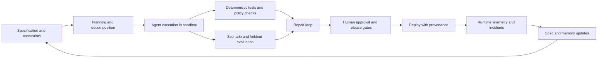
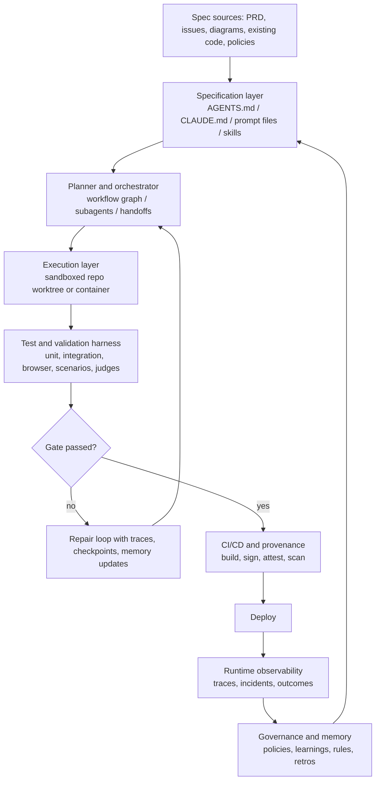
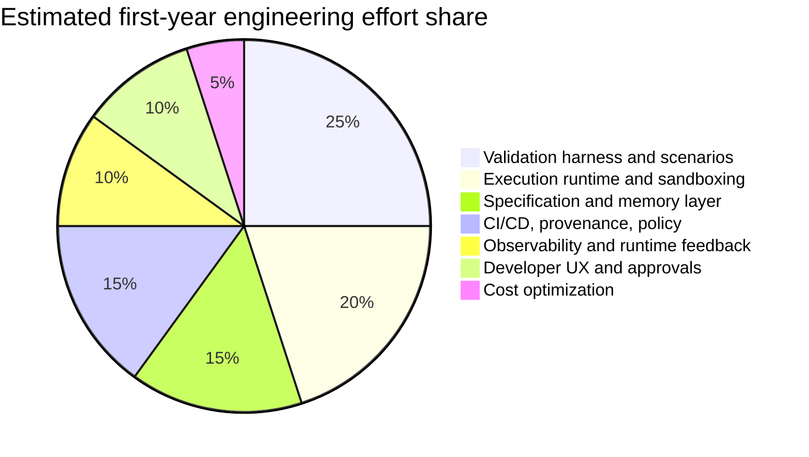
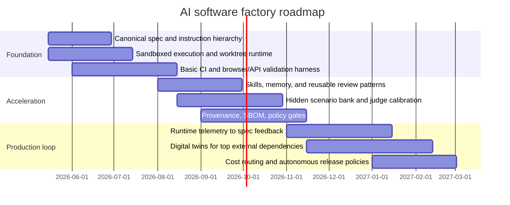

# Automated AI Software Factories

## Executive summary

The evidence is now strong that an “AI software factory” is not a bigger code model or a better prompt. It is a **closed-loop engineering system** around the model: specification capture, decomposition, execution in isolated environments, verification against holdout scenarios, iterative repair, provenance, policy, and human approval at the right points. That conclusion appears independently in the user-provided specification, StrongDM’s software-factory writeup, Every’s compound-engineering practice, Anthropic’s harness work, OpenAI’s Codex guidance, GitHub Copilot’s cloud-agent architecture, and the research literature on program synthesis and software-engineering agents. fileciteturn0file0 fileciteturn0file1 citeturn16view2turn16view0turn18view0turn18view1turn21view0turn29view0turn25view0turn1search0turn1search1turn1search10turn33view3

Current best-in-class products already cover meaningful pieces of the factory stack. GitHub Copilot cloud agent provides GitHub-native background execution in ephemeral GitHub Actions environments, planning, research, self-review, and PR generation. OpenAI Codex provides CLI, app, cloud, subagents, explicit instruction files, and programmable harness surfaces. Claude Code provides strong local and hosted coding loops, hooks, skills, permissions, checkpointing, subagents, and experimental agent teams. Replit Agent provides integrated app-building, deployment, connectors, and skills. Tabnine is comparatively strongest on enterprise context control, private deployment, and governance-oriented context layers. But none of these products alone constitutes a full autonomous software factory; the missing pieces are usually **holdout evaluation, digital-twin integration testing, policy/governance integration, release provenance, and runtime-to-spec feedback loops**. citeturn25view0turn25view4turn25view3turn29view4turn31view0turn31view1turn32view0turn32view2turn32view5turn27search0turn27search4turn28search0turn28search3turn4search0turn4search16

The research literature supports this operational view. AlphaCode showed that high-end code generation depends on **sampling, filtering, and candidate selection**, not single-shot generation. CodeGen emphasized multi-turn program synthesis. SWE-bench then demonstrated that real-world issue resolution is much harder than benchmark snippets, motivating systems such as SWE-agent and OpenHands that emphasize tool use, interfaces, sandboxes, and long-horizon execution. Public SWE-bench reporting also shows the field moving quickly, but benchmarks still largely measure **issue-resolution skill**, not “factory” capabilities such as spec refinement, deployment safety, or organizational governance. citeturn1search8turn1search1turn1search10turn33view3turn33view2turn33view0turn33view1turn33view5

For a greenfield enterprise build with no specified constraints on scale, budget, languages, or hosting, the best target is a **spec-first supervised factory**: keep humans on requirements, approvals, and exception handling; let agents own planning, code changes, test execution, first-pass review, and repair; make every loop traceable and reproducible; and refuse deployment without policy, provenance, and holdout validation. In practice, most organizations should sequence this in three waves: first build the spec/eval harness and isolated execution substrate; then add programmable memory, skills, and CI/CD integration; then close the loop with runtime telemetry, governance, and self-improving evaluation. fileciteturn0file0 citeturn16view0turn16view1turn18view1turn21view0turn23view0turn30view3turn7search2turn7search7turn8search2turn6search3

## Scope, assumptions, and evidence base

I treated the user-uploaded specification as a first-class design input because it already encodes several high-value factory concepts: layered specifications, implementation as a “probe” of the spec, explicit failure taxonomy, dual feedback channels, decision logs, automated compliance tests, human review for completeness failures, and a revelation cycle that turns surprises into spec updates. The uploaded source pack then pointed toward practitioner exemplars, especially StrongDM, Every, Simon Willison’s agentic-engineering patterns, and community Attractor implementations. fileciteturn0file0 fileciteturn0file1

I weighted sources in this order: original papers and official benchmark pages; official product docs; official engineering blogs from product builders; then practitioner writeups and open-source READMEs. That weighting matters because “software factory” is partly a research problem and partly an emerging operational discipline, so the best evidence is a blend of peer-reviewed or original technical work and direct reports from teams running these systems in production-like settings. citeturn1search8turn1search1turn1search10turn33view3turn33view5turn25view0turn29view4turn21view0turn16view2turn18view1

The core synthesis is shown below. It aligns the user specification with what the strongest public implementations and research now converge on.

That loop is visible, in different forms, in the uploaded spec, StrongDM’s “seed → validation harness → feedback loop,” Every’s “plan → work → review → compound,” Anthropic’s harness work, and OpenAI’s guidance to treat the agent like a teammate with explicit context and a clear definition of done. fileciteturn0file0 citeturn16view0turn18view1turn21view0turn31view3

## What current research and field experience actually show

The literature says the same thing practitioners are discovering: **tool use and harness design are now as important as the base model**. AlphaCode succeeded by generating huge candidate sets and then filtering and clustering them before submission, which is effectively an early “orchestration and verification” story. CodeGen explicitly framed code generation as multi-turn synthesis. SWE-bench then shifted the field toward realistic GitHub issues, showing that real repository work is much harder than toy problems, and SWE-agent showed that a better agent-computer interface materially changes outcomes. citeturn1search8turn1search1turn1search10turn33view3

Anthropic’s work is especially valuable because it exposes the engineering bottlenecks directly. Their November 2025 harness article frames the long-running-agent problem as one of **bridging context windows**, and their solution used an initializer agent plus a coding agent that leaves structured updates for the next session. Their later work on long-running application development, code execution with MCP, skills, sandboxing, and agent teams shows the same pattern over and over: externalize procedure, isolate context, load tools on demand, keep agents inside enforceable boundaries, and review harness assumptions as models improve. citeturn24view5turn23view0turn23view2turn23view3turn23view1turn32view3turn32view4

OpenAI’s public Codex material reaches a nearly identical conclusion. Codex is presented not just as a model but as a coding agent and harness surface across CLI, app, cloud, and SDK. OpenAI’s own internal “harness engineering” writeup reports roughly one million lines of code and about 1,500 merged pull requests in five months in a repository driven by a very small team using Codex, while the App Server writeup makes clear that the real product boundary is the **stable protocol around the agent loop**, not only the model itself. Their safety docs likewise make sandboxing, approval policy, isolated cloud execution, and telemetry first-class operational controls. citeturn11search1turn29view0turn29view3turn30view0turn30view3

The practitioner “software factory” reports are consistent with those vendor lessons but more extreme. StrongDM explicitly argues for non-interactive development in which specs plus scenarios drive agents without human code writing or review, and it replaces simple pass/fail tests with scenario-based “satisfaction” and digital twins of major third-party systems. Every’s compound engineering similarly makes the plan/review/compound loop the center of work, emphasizing persistent learnings, parallel reviews, and compounding rules so future agent runs improve. Simon Willison’s guide systematizes the same habits at the operator level: use Git carefully, test aggressively, isolate work, use subagents, and develop explicit engineering patterns instead of treating agentic coding as undisciplined “vibe coding.” citeturn16view2turn16view0turn16view1turn18view0turn18view1turn19view0turn19view1turn19view2

A useful quantitative snapshot is below. These numbers are not directly comparable across tasks, but they illustrate why the factory conversation has shifted from “can a model code?” to “how do we engineer reliable loops around it?”:

| Reference point | What it shows | Evidence |
|---|---|---|
| AlphaCode ranked in the top 54.3% of recent Codeforces competitions | Strong generative search/filtering for contest problems, but not a production SDLC | citeturn1search8 |
| Original SWE-bench framing found frontier models failed all but the simplest issues | Real repositories and issue resolution are far harder than benchmark snippets | citeturn1search10 |
| SWE-agent reported 12.5% pass@1 on SWE-bench in its paper | Interfaces and tools matter materially, but long-horizon software work remained hard | citeturn33view3 |
| SWE-bench now reports mini-SWE-agent at 65% on Verified | Agent systems have improved quickly, but the benchmark still measures only one slice of factory capability | citeturn33view4turn33view5 |
| Anthropic’s 16-agent compiler project used nearly 2,000 sessions and about $20,000 to produce a 100k-line compiler that can build Linux 6.9 | Parallel agents can deliver impressive artifacts, but reliability still depends on harnessing, evaluation, and explicit cost control | citeturn21view1 |
| OpenAI reports about 1,500 merged PRs over five months in a million-line repository driven by a small Codex-heavy team | High throughput is possible when the organization builds around the agent, not merely alongside it | citeturn29view0 |

## Comparative case studies

The current market can be understood as a spectrum from **interactive code assistants** to **partial software factories**.

| System | Main contribution | What it clearly covers today | What it still leaves to you | Evidence |
|---|---|---|---|---|
| GitHub Copilot cloud agent | GitHub-native background development | Ephemeral Actions-based execution, research, planning, code changes, PR creation, self-review, security scanning, custom agents, integrations with Jira/Slack/Teams/Linear/API | External holdout evals, deployment policy, runtime feedback loops, enterprise memory design | citeturn25view0turn25view1turn25view3turn25view4turn26search4turn26search5turn26search11 |
| OpenAI Codex | Full coding-agent surface plus embeddable harness | CLI/app/cloud, AGENTS.md instruction layering, subagents, app-server protocol, SDK/MCP orchestration, sandboxing, approvals, telemetry | Domain-specific eval harnesses, release governance, scenario banks, external digital twins | citeturn11search1turn31view0turn31view1turn31view2turn29view3turn30view0turn30view3 |
| Claude Code | Highly extensible agentic coding environment | Skills, CLAUDE.md, MCP, hooks, permission rules, checkpointing, subagents, agent teams, browser/web surfaces | Strong factory semantics still require custom harnesses and policy integration | citeturn32view0turn32view1turn32view2turn32view3turn32view4turn32view5turn32view6 |
| Replit Ghostwriter / Replit Agent | Integrated “idea to app” platform | Natural-language app generation, deployment, connectors, automations, skills, project guidance via `replit.md` | Lower emphasis on enterprise governance, provenance, hidden-holdout evals | citeturn27search1turn27search0turn27search2turn27search4turn27search8turn27search16turn27search17 |
| Tabnine | Enterprise context and controllability layer | Private/VPC/on-prem deployment, context engine, scoped repository context, agent guidelines, privacy posture, secure deployment options | Broader autonomous SDLC orchestration still needs surrounding tooling | citeturn28search2turn28search0turn28search3turn28search7turn4search0turn4search4turn4search16 |
| AlphaCode / CodeGen | Research baselines for code synthesis | Candidate generation, program synthesis, open model research | Production workflows, test harnessing, deployment, governance | citeturn1search8turn1search1 |
| SWE-agent / mini-SWE-agent / OpenHands | Open research and open-source agent frameworks | Tool use, repo issue fixing, sandbox-friendly experimentation, composable agent SDKs, hackable orchestration | Complete enterprise release/governance loops require integration work | citeturn33view2turn33view4turn33view0turn33view1 |
| StrongDM / Fabro / Kilroy / Arc / Attractor | Explicit “software factory” exemplars | Spec-first pipelines, DOT graphs, checkpoints, observability, model routing, human gates, digital twins, scenario validation | Public proof is still mostly case-study and practitioner evidence rather than standardized benchmarks | citeturn16view2turn16view0turn16view1turn12view0turn15view0turn14view0turn14view1 |
| Every compound engineering | Operational discipline for agent-native teams | Planning, review, compounding of learnings, parallel subagent review, pluginized workflows | Formal verification, release provenance, organizational governance remain external | citeturn18view0turn18view1turn17search4turn17search16 |

The key comparative pattern is simple. Commercial coding agents are strongest on **developer-surface ergonomics and execution**. Open-source agent frameworks are strongest on **inspectability and composability**. Software-factory exemplars are strongest on **closed-loop validation concepts**. The full factory only appears when those three categories are combined. citeturn25view0turn31view2turn33view0turn16view2turn18view1

## Layered reference architecture and implementation guidance

The most defensible target architecture is a **layered factory** in which each layer has an explicit contract and its own evaluation surface. That is also the architecture most consistent with the uploaded specification, which insists on layered refinement and distinguishes compliance failures from completeness failures. fileciteturn0file0

| Layer | Purpose | Concrete design patterns | Recommended tools and stacks | Integration points | Typical failure modes | Metrics | Initial effort and risk |
|---|---|---|---|---|---|---|---|
| Specification ingestion | Turn ambiguous intent into machine-actionable context | Layered spec docs, repository instruction files, prompt files, skills, issue templates, architecture notes | `AGENTS.md` in Codex, `CLAUDE.md` and Skills in Claude Code, Copilot custom agents and prompt files, Replit `replit.md`, Tabnine guidelines/context engine citeturn31view0turn32view5turn26search3turn26search4turn27search16turn28search11 | PM tools, design docs, repo root, ticketing | Silent assumptions, stale instructions, contradictory norms | Spec completeness rate, prompt reuse rate, clarification count, instruction drift | Medium effort; high leverage; biggest risk is hidden ambiguity |
| Orchestration and synthesis | Convert specs into work plans and agent loops | Planner/worker, graph workflows, subagents, agent teams, handoffs | Codex subagents and Agents SDK, Claude subagents/agent teams, LangGraph, OpenHands SDK, Attractor/Fabro/Kilroy/Arc citeturn31view1turn31view2turn32view3turn32view4turn6search10turn33view0turn12view0turn15view0turn14view0turn14view1 | Instruction layer, sandbox runtime, eval harness | Looping, task thrash, duplicate work, over-decomposition, cost blowups | Task success rate, turns per accepted change, token cost per successful patch | Medium-to-high effort; risk rises fast without strict observability |
| Modularization and memory | Keep context bounded while preserving organizational knowledge | Skills, subagents, progressive disclosure, directory-local overrides, persistent memories, checkpoints | Claude Skills, Copilot Memory/agent skills, Codex AGENTS layering, Tabnine Context Engine, Anthropic code-execution-with-MCP patterns citeturn23view3turn26search5turn26search11turn31view0turn28search3turn23view2 | Repo tree, vector/context stores, run database | Context overload, stale memory, retrieval of wrong exemplar, hidden global rules | Token/input budget, retrieval precision, memory hit rate, restart success | Medium effort; major risk is polluted memory that compounds errors |
| Execution runtime | Give agents a safe place to read, edit, build, and run | Ephemeral worktrees, containers, sandboxes, cloud workers, checkpoint commits | Copilot cloud agent with GitHub Actions, Codex cloud/CLI sandboxes, Claude Code sandboxing and checkpointing, Fabro Daytona VMs, Kilroy worktrees/CXDB citeturn25view0turn30view0turn30view1turn23view1turn5search0turn15view0turn14view0 | Git provider, build tools, secrets manager | Secret leakage, environment skew, non-reproducible builds, filesystem escape | Sandbox violation rate, reproducibility rate, setup time, resume success | High effort if self-hosted; largest operational and security risk |
| Testing and evaluation | Detect noncompliance and incomplete behavior | Unit/integration/E2E tests, browser automation, holdout scenarios, LLM-as-judge, digital twins | Playwright, GitHub Actions, SWE-bench-style harnesses, StrongDM DTU/scenarios, Anthropic browser/tool harnesses citeturn7search0turn7search1turn1search10turn16view2turn21view0 | CI, runtime clones, staging envs | Reward hacking, brittle tests, false positives from judges, data drift | Pass rate, holdout satisfaction, flake rate, escaped-defect rate | Highest leverage layer; also the biggest research gap |
| Verification and assurance | Raise confidence above “tests passed” | Property checks, differential testing, mutation testing, conformance specs, limited formal methods on critical modules | Traditional test frameworks plus policy/verification tools; use hidden-scenario sets and externally stored or generated holdouts as StrongDM recommends citeturn16view2turn16view1 | Test harness, model reviewer, domain validators | Green tests with wrong behavior, unverifiable requirements, overfitting to public tests | Mutation score, spec-to-test coverage, claim traceability | Medium effort; risk is false confidence |
| CI/CD and release control | Move from accepted patch to releasable artifact | Branch protections, staged pipelines, automated PR review, deploy gates, canaries | GitHub Actions, Copilot code review, SLSA, Sigstore, Codex/Copilot PR workflows citeturn7search1turn25view2turn7search18turn7search7turn25view4 | Git, artifact store, deployment system | Unreviewed merges, unsigned artifacts, broken environments | Lead time, change fail rate, rollback rate, attestations coverage | Mature tooling exists; integration is mostly engineering work |
| Dependency and data plane | Control libraries, external APIs, and data contracts | SBOM generation, component analysis, API schemas, contract tests, digital twins for third parties | SPDX, CycloneDX, Dependency-Track, MCP, Tabnine/Jira context, Replit connectors citeturn8search1turn8search0turn8search15turn5search2turn28search19turn27search4 | Package managers, external SaaS, data stores | Supply-chain risk, license surprises, API drift, rate limits | Vulnerability backlog, outdated deps, contract-test failures, schema drift | Medium effort; risk is underestimated until production integration |
| Runtime monitoring and observability | See whether released systems behave as intended | OTel traces, agent run logs, approval logs, scenario replay, incident-to-spec linkage | OpenTelemetry, Codex telemetry, CXDB-style run history, Fabro event streams citeturn6search3turn30view3turn14view0turn15view0 | Production services, run database, SIEM/APM | Blind spots, poor incident replay, inability to learn from failures | MTTR, trace completeness, incident recurrence, feedback-to-fix time | Medium effort; critical for factory self-improvement |
| Security and safety controls | Keep fast agents inside safe boundaries | OS sandboxing, network restrictions, approval policies, hooks, allow/deny rules, auto-review | Codex approvals/security, Claude permissions/hooks/sandboxing, Copilot security scanning, OPA policy-as-code citeturn30view0turn30view1turn32view2turn32view6turn25view3turn8search2 | Runtime, CI, repo permissions, network policy | Prompt injection, destructive shell commands, credential exposure, unsafe approvals | Approval override rate, blocked-action rate, secret incidents, policy violations | High priority from day one; risk is existential |
| Governance, legal, IP, reproducibility | Make the factory auditable and acceptable to real organizations | Signed builds, instruction/version traceability, reproducible environments, license and privacy controls | SLSA, Sigstore, SPDX/CycloneDX, Tabnine private deployment/privacy posture, containerized or devcontainer-based execution citeturn7search18turn7search7turn8search1turn8search0turn4search0turn4search16turn30view1 | CI/CD, artifact registry, legal/compliance review | Inability to prove provenance, IP contamination concern, environment skew | Provenance coverage, reproducible build rate, legal-review latency | Medium effort technically; often high organizational friction |
| Human-in-the-loop and developer UX | Keep humans focused on specification, approval, and exception handling | Plan approval, approval gates, structured reviews, agent session dashboards, rewind/resume, worktree UIs | Copilot plan-before-code, Claude checkpoints/teams, Codex approvals and app server, Fabro/Kilroy dashboards, Every plugin review loops citeturn25view4turn32view4turn5search0turn29view3turn15view0turn14view0turn18view1turn17search4 | IDE, GitHub, chat surfaces, dashboards | Reviewer fatigue, unclear accountability, hidden agent state | Human minutes per accepted change, review latency, rework rate, trust score | Low-to-medium effort; huge impact on adoption |
| Cost and latency optimization | Make autonomous loops economically sustainable | Model routing, cached search, progressive disclosure, cheap planner + expensive implementer, parallel where useful, stop-loss budgets | Fabro model stylesheets, Anthropic code-execution-with-MCP, Codex cached web search, Claude subagents, Copilot model picker citeturn15view0turn23view2turn30view0turn31view1turn25view3 | Orchestrator, LLM gateway, billing telemetry | Token blowups, long-tail retries, using frontier models on trivial work | Cost per accepted change, p95 task latency, token-per-pass, abandon rate | Continuous optimization; do not postpone until after launch |

A practical design rule follows from that table: the **minimum viable factory** is not “spec + agent.” It is **spec + isolated runtime + eval harness + memory + release governance**. Remove any one of those and you fall back to a powerful but non-factory coding assistant. fileciteturn0file0 citeturn16view0turn25view0turn30view0turn7search18turn6search3

## Gap analysis and actionable roadmap

The clearest gap between today’s strongest tools and a true software factory is shown below.

| Capability area | Market status now | Gap severity | Highest-priority next action |
|---|---|---|---|
| Base coding agent quality | Strong and improving rapidly | Low | Standardize on one or two primary coding surfaces, not five |
| Spec ingestion and persistent instructions | Available but fragmented | Medium | Create one canonical spec/instruction hierarchy and force all agents to read it |
| Long-horizon orchestration | Available in products and open-source frameworks | Medium | Add explicit planner/worker/reviewer roles with checkpoint-resume |
| Holdout evaluation and scenario validation | Weak in commercial products; stronger in factory exemplars | Very high | Build a hidden scenario bank and browser/API validation harness first |
| Digital twins for third-party dependencies | Rare and high-effort | Very high | Clone only the top 3–5 integrations that dominate risk and cost |
| Release provenance and supply-chain security | Mature traditional tooling, weakly tied into agent loops | High | Make signing, attestation, SBOM, and policy checks mandatory release gates |
| Runtime-to-spec feedback loop | Rare | High | Instrument incidents and user pain back into spec and skills updates |
| Governance, legal, and IP controls | Fragmented by vendor | High | Establish policy-as-code and provenance review for all agent-created artifacts |
| Standard benchmarks for full-factory behavior | Immature | High | Create internal evals for spec completeness, deploy safety, and incident recurrence |

The priority order should be: **evaluation before autonomy, isolation before scale, provenance before production, and runtime feedback before “self-improvement.”** The user’s uploaded spec is directionally correct here: it treats implementation as a probe, insists on failure classification, and separates compliance from completeness. That is exactly the discipline most organizations currently lack. fileciteturn0file0 citeturn16view0turn24view5turn25view4

The estimated first-year effort mix for a greenfield enterprise factory is roughly the following. This is an analytical estimate, not a vendor claim.

A concise roadmap that fits most unconstrained enterprise environments is:

In staffing terms, a realistic v1 usually means a **6–8 person platform pod** for 6–9 months: 3–4 platform/agent engineers, 1–2 developer-experience or CI/CD engineers, 1 security/supply-chain engineer, and fractional product/architecture support. If digital twins or regulated deployment are in scope, add dedicated integration and compliance capacity early. The highest execution risk is not model quality; it is building autonomy on top of weak specs and weak evals. citeturn16view2turn18view1turn21view0turn29view0turn30view0turn7search18turn7search7

**Open questions and limitations.** Public evidence still has three important gaps. First, there is no widely accepted benchmark for the full “spec → build → validate → release → monitor” factory loop; SWE-bench remains narrower than that. Second, strongest practitioner reports still come from teams with unusual internal tolerance for experimentation and token spend, so transferability to conservative organizations remains partly unproven. Third, many legal/IP and enterprise-governance details are product- and contract-specific, so this report can identify required controls, but not replace organization-specific legal review. citeturn1search10turn33view5turn16view2turn29view2turn4search16