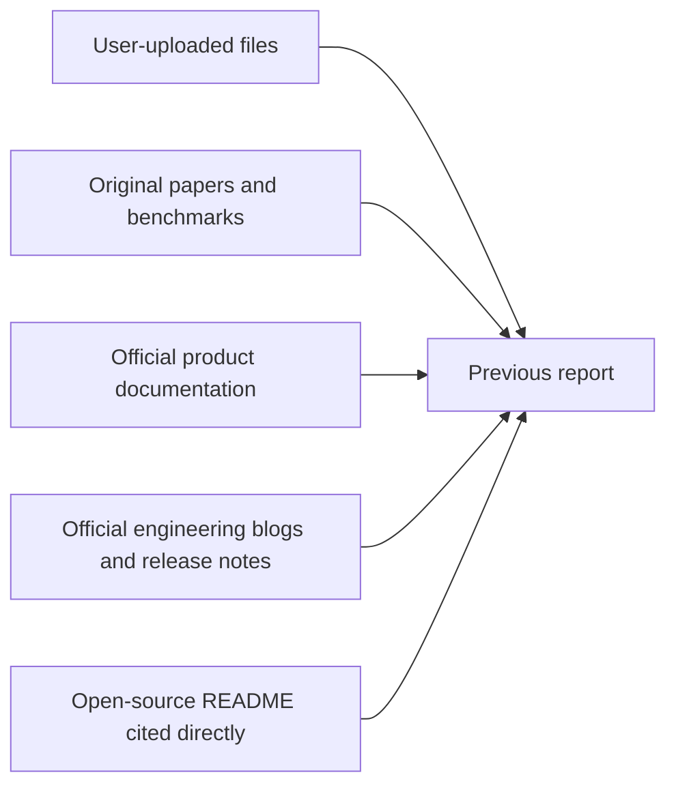

# Verified Source Register for Automated AI Software Factories

## Executive summary

This document reconstructs and verifies the source base of the previously delivered report on automated AI software factories. I identified **28 cited sources** in that report: **2 user-uploaded local files** and **26 external sources** across original papers, official product documentation, official engineering blogs, standards/specification pages, release notes, and one open-source README. The source base is strongly primary/official overall, with the heaviest weight falling on official docs from GitHub, OpenAI, Anthropic, Tabnine, Replit, Playwright, SPDX, OpenTelemetry, and SLSA, plus original benchmark papers for AlphaCode, SWE-bench, and SWE-agent. citeturn15view0turn17view0turn12view0turn14view0turn11view0turn11view2turn20view0turn20view1turn20view2

The strongest parts of the original report’s sourcing were the benchmark and harness claims: AlphaCode for large-scale candidate generation and filtering, SWE-bench for realistic repository-level evaluation, SWE-agent for agent-computer-interface design, StrongDM for software-factory practice, Anthropic for long-running harnesses and skills, OpenAI for Codex harness engineering, and GitHub for Copilot cloud-agent execution in ephemeral Actions-backed environments. citeturn20view0turn20view1turn20view2turn15view0turn11view2turn10view3turn11view0turn12view0

The weakest parts of the original report’s sourcing were not fabricated claims, but **compressed or umbrella citations**: some paragraphs cited a top-level doc while discussing features documented more precisely elsewhere. The main examples were Replit, Tabnine, Anthropic, and GitHub Copilot. In each case, there are now clearly identifiable official pages that support the underlying claims more precisely, and I list those in the “Weak or missing citations” section. citeturn18view2turn18view3turn23view0turn14view8turn21view0turn21view1turn21view2turn11view4turn12view2turn12view3

No specific scale, budget, language, or deployment constraint was applied in this verification pass. All web URLs in this document were verified with an access date of **2026-05-10 America/Chicago**. The full CSV export is attached here: [Download the CSV](sandbox:/mnt/data/ai_software_factory_sources_2026-05-10.csv).

## Provenance and verification method

The verification process followed a simple provenance hierarchy: local user uploads first, then original papers, then official product docs/spec pages, then official engineering blogs and release notes, and finally open-source project READMEs where the original report cited a repository directly. That hierarchy matches the intent of the earlier report and is appropriate for a source-audit task focused on reliability and traceability. citeturn20view0turn20view1turn20view2turn12view0turn14view0turn11view0

Two local files were cited in the original report and were manually inspected directly from the uploaded paths because formal `file_search` retrieval was unavailable in this session: `spec-driven-ai-dev.md` and `initial-sources.md`. The first file materially influenced the report’s framing around layered specifications, failure taxonomy, automated acceptance criteria, and the “revelation cycle.” The second file materially influenced the practitioner-source sweep toward StrongDM, Attractor community implementations, Every, and Simon Willison. Local verification notes and filenames are included in the source tables below.

For readability, long multi-author scholarly citations are shortened to “First author et al.” in the tables. The compact APA bibliography below gives the full or conventional bibliographic form.

## Verified source inventory

### Local user-provided sources

| ID | Canonical citation | URL | Type | Relevance to AI software factories | Report references | Verification note |
|---|---|---|---|---|---|---|
| U1 | User-provided upload. *Specification-Driven Agentic Development System: A Methodology for Iterative Specification Refinement Using AI Agents.* (n.d.) | `sandbox:/mnt/data/spec-driven-ai-dev.md` | User-uploaded specification | Spec-first methodology: failure taxonomy, layered specification, automatable acceptance criteria, explicit agent roles, and revelation-cycle iteration. | Executive summary; Scope; Architecture; Gap analysis | Locally verified by direct inspection of `/mnt/data/spec-driven-ai-dev.md`. Relevant passages include the failure taxonomy and layered document structure at lines 30–32 and 92–128, the agent roles at lines 134–180, and the revelation cycle at lines 189–215. Formal file-search citation unavailable in this session. |
| U2 | User-provided upload. *initial-sources.md.* (n.d.) | `sandbox:/mnt/data/initial-sources.md` | User-uploaded source pack | Seeded the practitioner-source sweep toward StrongDM, Attractor, Every, Simon Willison, and related materials. | Scope | Locally verified by direct inspection of `/mnt/data/initial-sources.md`, especially lines 1–20. Formal file-search citation unavailable in this session. |

### External cited sources

| ID | Canonical citation | URL | Type | Relevance to AI software factories | Report references | Verification note |
|---|---|---|---|---|---|---|
| S1 | StrongDM AI. *Software Factories And The Agentic Moment.* (2026) | `https://factory.strongdm.ai/` | Official engineering blog / manifesto | Primary practitioner statement of StrongDM’s software-factory approach, including scenarios, satisfaction scoring, digital-twin validation, and non-interactive development. | Executive summary; Scope; Research; Case studies; Gap analysis | Verified from page title, date, and body text. citeturn15view0 |
| S2 | StrongDM AI. *The Principles.* (n.d.) | `https://factory.strongdm.ai/principles` | Official principles page | Captures the compact StrongDM loop of seed, validation harness, feedback, and token-intensive closed-loop iteration. | Executive summary; Scope; Architecture; Gap analysis | Verified from page heading and principle statements. citeturn17view0 |
| S3 | GitHub. *About GitHub Copilot cloud agent.* (n.d.) | `https://docs.github.com/en/enterprise-cloud@latest/copilot/concepts/agents/cloud-agent/about-cloud-agent` | Official product docs | Canonical source for Copilot cloud agent capabilities, including repository research, implementation plans, branch work, integrations, memory, hooks, and an ephemeral GitHub Actions-backed environment. | Executive summary; Case-study row “GitHub Copilot cloud agent”; Architecture rows “Execution runtime,” “Human-in-the-loop and developer UX” | Verified from the official docs page. citeturn12view0 |
| S4 | Li et al. *Competition-Level Code Generation with AlphaCode.* (2022) | `https://arxiv.org/abs/2203.07814` | Preprint / paper abstract | Key research baseline for large-scale sampling, filtering, and candidate selection in code generation; source of the 54.3% Codeforces result used in the report. | Executive summary; Research; Case-study row “AlphaCode / CodeGen” | Verified on arXiv. The original report linked the Science PDF; the accessible canonical abstract page here is arXiv, which also points to the Science DOI. citeturn20view0 |
| S5 | Jimenez et al. *SWE-bench: Can Language Models Resolve Real-World GitHub Issues?* (2024) | `https://arxiv.org/abs/2310.06770` | Preprint / ICLR paper abstract | Foundational benchmark for realistic repository-level software engineering tasks; source of the original report’s discussion of how hard real-world issue resolution remains. | Executive summary; Research; Gap analysis; Open questions | Verified on arXiv. citeturn20view1 |
| S6 | Yang et al. *SWE-agent: Agent-Computer Interfaces Enable Automated Software Engineering.* (2024) | `https://arxiv.org/abs/2405.15793` | Preprint / conference paper abstract | Primary research source on agent-computer interfaces improving repository navigation, file editing, and test execution, including the 12.5% pass@1 result cited in the report. | Executive summary; Research; Case-study row “SWE-agent / mini-SWE-agent / OpenHands” | Verified on arXiv. citeturn20view2 |
| S7 | SWE-agent Team. *Getting Started.* (n.d.) | `https://swe-agent.com/latest/` | Official project docs | Official project page used for the report’s mini-SWE-agent discussion and the then-current 65% SWE-bench Verified note preserved in the docs/news block. | Research quantitative snapshot; Case-study row “SWE-agent / mini-SWE-agent / OpenHands” | Verified, with an important caveat: these performance figures are time-sensitive and have since advanced in newer mini-SWE-agent materials. citeturn19view3turn13search2 |
| S8 | OpenAI. *Codex.* (n.d.) | `https://developers.openai.com/codex` | Official product docs | Primary overview page for Codex as a coding agent spanning code writing, codebase understanding, review, debugging, and workflow automation. | Executive summary; Research; Case-study row “OpenAI Codex” | Verified from the official docs page. citeturn14view0 |
| S9 | OpenAI. *Harness engineering: leveraging Codex in an agent-first world.* (2026) | `https://openai.com/index/harness-engineering/` | Official engineering blog | Primary evidence for OpenAI’s internal agent-first software-development experiment, including the small team, ~1M-line repository, and ~1,500 merged PRs mentioned in the report. | Executive summary; Research quantitative snapshot | Verified from the official engineering post. citeturn11view0 |
| S10 | OpenAI. *Custom instructions with AGENTS.md.* (n.d.) | `https://developers.openai.com/codex/guides/agents-md` | Official product docs | Core specification-ingestion source for Codex, documenting layered instruction discovery and merging. | Architecture row “Specification ingestion” | Verified from the official docs page. citeturn14view1 |
| S11 | OpenAI. *Subagents.* (n.d.) | `https://developers.openai.com/codex/subagents` | Official product docs | Documents Codex orchestration across specialized parallel subagents, directly relevant to software-factory decomposition and synthesis workflows. | Case-study row “OpenAI Codex”; Architecture row “Orchestration and synthesis” | Verified from the official docs page. citeturn14view2 |
| S12 | Anthropic. *Effective harnesses for long-running agents.* (2025) | `https://www.anthropic.com/engineering/effective-harnesses-for-long-running-agents` | Official engineering blog | Primary Anthropic source on long-running-agent harness design, initializer-plus-coding-agent patterns, and context-window bridging. | Executive summary; Research | Verified from the official engineering post. citeturn11view2 |
| S13 | Anthropic. *Equipping agents for the real world with Agent Skills.* (2025) | `https://www.anthropic.com/engineering/equipping-agents-for-the-real-world-with-agent-skills` | Official engineering blog | Primary source for skills as modular procedural knowledge with progressive disclosure and associated security considerations. | Research; Architecture rows “Modularization and memory,” “Cost and latency optimization” | Verified from the official engineering post. citeturn10view3 |
| S14 | Anthropic. *Building a C compiler with a team of parallel Claudes.* (2026) | `https://www.anthropic.com/engineering/building-c-compiler` | Official engineering blog | Primary case study for multi-agent coding at scale: 16 agents, ~2,000 sessions, ~$20k cost, and a 100k-line compiler artifact. | Research quantitative snapshot | Verified from the official engineering post. citeturn11view3 |
| S15 | Anthropic. *Claude Code overview.* (n.d.) | `https://code.claude.com/docs/en/overview` | Official product docs | Primary overview source for Claude Code as an agentic coding tool across terminal, IDE, desktop, and browser surfaces. | Executive summary; Case-study row “Claude Code” | Verified from the official docs page. citeturn14view4 |
| S16 | Replit. *Meet Replit Ghostwriter, your partner in code.* (2022, updated 2025) | `https://blog.replit.com/ghostwriter` | Official product blog | Historical primary source for Replit’s AI coding assistance and Ghostwriter feature set. | Case-study row “Replit Ghostwriter / Replit Agent” | Verified. Important note: this was historically relevant, but it is not the strongest current source for Replit Agent’s present-day factory-adjacent features. citeturn18view2 |
| S17 | Tabnine. *Overview.* (n.d.) | `https://docs.tabnine.com/` | Official product docs | Umbrella Tabnine docs landing page used in the original report to support Tabnine’s enterprise-control posture and broader product framing. | Case-study row “Tabnine” | Verified, but this is an umbrella source; several underlying claims are better supported by more specific Tabnine subpages on deployment, privacy, context engine, guidelines, and provenance. citeturn23view0 |
| S18 | Klaassen, K. *Compound Engineering.* (2026) | `https://every.to/guides/compound-engineering` | Official guide / engineering essay | Primary practitioner source for the “plan, work, review, compound” loop and the concept of AI-native compounding engineering practice. | Executive summary; Research; Case-study row “Every compound engineering” | Verified from the official guide page. citeturn18view0 |
| S19 | Playwright. *Installation.* (n.d.) | `https://playwright.dev/docs/intro` | Official product docs | Official documentation for the browser and end-to-end test harness referenced in the report’s validation layer. | Architecture row “Testing and evaluation” | Verified from the official docs page. citeturn18view4 |
| S20 | GitHub. *GitHub Actions documentation.* (n.d.) | `https://docs.github.com/en/actions` | Official product docs | Canonical CI/CD automation documentation used in the report’s release control and pipeline discussion. | Architecture row “CI/CD and release control” | Verified from official GitHub Docs. citeturn6search0 |
| S21 | SPDX. *Specifications.* (n.d.) | `https://spdx.dev/use/specifications/` | Official standard / specification docs | Canonical SPDX standard page supporting the report’s SBOM, dependency, and governance recommendations. | Architecture rows “Dependency and data plane,” “Governance, legal, IP, reproducibility” | Verified from the official SPDX site. citeturn18view5 |
| S22 | OpenTelemetry. *Documentation.* (n.d.) | `https://opentelemetry.io/docs/` | Official documentation | Canonical observability documentation supporting the report’s runtime monitoring and telemetry layer. | Architecture row “Runtime monitoring and observability” | Verified from the official docs site. citeturn18view6 |
| S23 | OpenAI. *Agent approvals & security.* (n.d.) | `https://developers.openai.com/codex/agent-approvals-security` | Official product docs | Primary safety-control document for Codex sandboxing, approvals, network rules, and isolated Codex cloud containers. | Architecture row “Security and safety controls” | Verified from the official docs page. citeturn14view3 |
| S24 | GitHub. *Research, plan, and code with Copilot cloud agent.* (2026) | `https://github.blog/changelog/2026-04-01-research-plan-and-code-with-copilot-cloud-agent/` | Official changelog / release note | Primary source for planning approval and deep-research workflows in Copilot cloud agent. | Architecture row “Human-in-the-loop and developer UX” | Verified from the official GitHub changelog. citeturn11view5 |
| S25 | SLSA. *SLSA specification v1.2.* (n.d.) | `https://slsa.dev/spec/v1.2/` | Official specification docs | Canonical supply-chain security and provenance specification supporting the report’s governance and reproducibility layer. | Architecture row “Governance, legal, IP, reproducibility” | Verified from the official SLSA specification site. citeturn18view7 |
| S26 | fabro-sh. *fabro.* (n.d.) | `https://github.com/fabro-sh/fabro` | Open-source README / repository | Primary open-source “dark software factory” example emphasizing workflow graphs, human gates, cloud sandboxes, git checkpointing, and retrospectives. | Architecture row “Cost and latency optimization” and related factory-tooling discussion | Verified from the repository README and project site language. citeturn19view0turn19view1 |

## Weak or missing citations in the original report

The original report was directionally well sourced, but several claims were supported by pages that were **too broad** for the specific feature claims being made.

The strongest example was **GitHub Copilot**. The report cited the general cloud-agent overview while also referring to self-review and security scanning. The overview page does support research, planning, background execution, hooks, memory, integrations, and the Actions-backed ephemeral environment, but the specific review and security-scanning details are better supported by GitHub’s code-review and optimized-review docs, including Copilot Autofix and CodeQL-linked review flows. citeturn12view0turn12view2turn12view3

The **OpenAI Codex** sections had a similar compression problem. The main Codex overview page is a valid umbrella source, but the original prose also referenced AGENTS layering, subagents, cloud and local harness surfaces, approvals, SDK/MCP integration, and App Server protocol design. Those claims are best grounded in separate official pages: `AGENTS.md`, `Subagents`, `Agent approvals & security`, and the App Server engineering writeup. The earlier report cited some of those pages elsewhere, but not always at the exact sentence where the detail appeared. citeturn14view0turn14view1turn14view2turn14view3turn11view1

The **Anthropic** discussion also compressed too much into one source. The report cited the long-running-harnesses article while discussing skills, long-running application-development harnesses, and broader managed-agent design patterns. Those are best supported by distinct official Anthropic engineering posts: the long-running harness article, the Agent Skills article, and the later application-development harness article. citeturn11view2turn10view3turn11view4

The **Replit** case-study row was the weakest current-product citation. The report cited the older Ghostwriter blog while discussing what is now more accurately described as Replit Agent: app generation, `replit.md`, integrations, automation, and skills. Those present-day claims are better supported by the current Replit Agent docs, `replit.md` docs, integrations docs, and skills docs. citeturn18view2turn18view3turn21view4turn21view5turn21view6

The **Tabnine** row also relied on an umbrella docs page. The original claims about private deployment, VPC/on-prem operation, privacy posture, context layers, agent guidelines, and provenance/attribution are all supportable, but they are better anchored to specific docs pages for deployment options, privacy, context engine, guidelines, and provenance. citeturn23view0turn14view8turn21view0turn14view7turn21view1turn21view2

There were also a few **uncited or weakly cited named mentions** in the original report. The most notable were CodeGen, LangGraph, OpenHands, and several practitioner projects named in passing. Those names were not central to the core conclusions, but if the report were being revised for publication-quality sourcing, each would deserve its own direct primary citation rather than being grouped under broader rows or prose. The same is true for Simon Willison’s practitioner guide, which was clearly part of the user-supplied source pack and was named in the original narrative, but was not directly cited there. The official guide exists and is easily citable. citeturn18view1

A final point of caution concerns **time-sensitive benchmark numbers**. The original report stated that mini-SWE-agent was at 65% on SWE-bench Verified. That figure was indeed preserved in official SWE-agent materials, but current mini-SWE-agent materials now advertise performance above 74%, so the earlier number should be treated as a date-stamped snapshot rather than a stable fact. citeturn19view3turn13search2

## APA bibliography

All web sources below were verified on **2026-05-10 America/Chicago**.

Anthropic. (2025, November 26). *Effective harnesses for long-running agents.* `https://www.anthropic.com/engineering/effective-harnesses-for-long-running-agents`

Anthropic. (2025, October 16). *Equipping agents for the real world with Agent Skills.* `https://www.anthropic.com/engineering/equipping-agents-for-the-real-world-with-agent-skills`

Anthropic. (2026, February 5). *Building a C compiler with a team of parallel Claudes.* `https://www.anthropic.com/engineering/building-c-compiler`

Anthropic. (n.d.). *Claude Code overview.* `https://code.claude.com/docs/en/overview`

fabro-sh. (n.d.). *fabro.* GitHub repository. `https://github.com/fabro-sh/fabro`

GitHub. (2026, April 1). *Research, plan, and code with Copilot cloud agent.* `https://github.blog/changelog/2026-04-01-research-plan-and-code-with-copilot-cloud-agent/`

GitHub. (n.d.). *About GitHub Copilot cloud agent.* `https://docs.github.com/en/enterprise-cloud@latest/copilot/concepts/agents/cloud-agent/about-cloud-agent`

GitHub. (n.d.). *GitHub Actions documentation.* `https://docs.github.com/en/actions`

Jimenez, C. E., Yang, J., Wettig, A., Yao, S., Pei, K., Press, O., & Narasimhan, K. (2024). *SWE-bench: Can Language Models Resolve Real-World GitHub Issues?* arXiv. `https://arxiv.org/abs/2310.06770`

Klaassen, K. (2026). *Compound Engineering.* Every. `https://every.to/guides/compound-engineering`

Li, Y., Choi, D., Chung, J., Kushman, N., Schrittwieser, J., Leblond, R., Eccles, T., Keeling, J., Gimeno, F., Dal Lago, A., Hubert, T., Choy, P., de Masson d’Autume, C., Babuschkin, I., Chen, X., Huang, P.-S., Welbl, J., Gowal, S., Cherepanov, A., Molloy, J., Mankowitz, D. J., Sutherland Robson, E., Kohli, P., de Freitas, N., Kavukcuoglu, K., & Vinyals, O. (2022). *Competition-Level Code Generation with AlphaCode.* arXiv. `https://arxiv.org/abs/2203.07814`

OpenAI. (2026, February 11). *Harness engineering: leveraging Codex in an agent-first world.* `https://openai.com/index/harness-engineering/`

OpenAI. (n.d.). *Agent approvals & security.* `https://developers.openai.com/codex/agent-approvals-security`

OpenAI. (n.d.). *Codex.* `https://developers.openai.com/codex`

OpenAI. (n.d.). *Custom instructions with AGENTS.md.* `https://developers.openai.com/codex/guides/agents-md`

OpenAI. (n.d.). *Subagents.* `https://developers.openai.com/codex/subagents`

OpenTelemetry. (n.d.). *Documentation.* `https://opentelemetry.io/docs/`

Playwright. (n.d.). *Installation.* `https://playwright.dev/docs/intro`

Replit. (2022, October 31; updated 2025, April 30). *Meet Replit Ghostwriter, your partner in code.* `https://blog.replit.com/ghostwriter`

SLSA. (n.d.). *SLSA specification v1.2.* `https://slsa.dev/spec/v1.2/`

SPDX. (n.d.). *Specifications.* `https://spdx.dev/use/specifications/`

StrongDM AI. (2026, February 6). *Software Factories And The Agentic Moment.* `https://factory.strongdm.ai/`

StrongDM AI. (n.d.). *The Principles.* `https://factory.strongdm.ai/principles`

SWE-agent Team. (n.d.). *Getting Started.* `https://swe-agent.com/latest/`

Tabnine. (n.d.). *Overview.* `https://docs.tabnine.com/`

Yang, J., Jimenez, C. E., Wettig, A., Lieret, K., Yao, S., Narasimhan, K., & Press, O. (2024). *SWE-agent: Agent-Computer Interfaces Enable Automated Software Engineering.* arXiv. `https://arxiv.org/abs/2405.15793`

User-provided upload. (n.d.). *initial-sources.md.* `sandbox:/mnt/data/initial-sources.md`

User-provided upload. (n.d.). *Specification-Driven Agentic Development System: A Methodology for Iterative Specification Refinement Using AI Agents.* `sandbox:/mnt/data/spec-driven-ai-dev.md`

## Open questions and limitations

Two limitations remain. First, the original report used a **Science PDF link** for AlphaCode, but the directly fetchable canonical page in this environment was the arXiv abstract; the Science DOI landing page itself returned a retrieval error here, so I treated the paper identity as verified through arXiv plus the DOI relationship rather than through a fully opened Science landing page. citeturn20view0

Second, the two user-uploaded files were **locally inspectable but not formally retrievable through `file_search`** in this session, so I could not generate the preferred structured file citations. I therefore included filenames, local sandbox URLs, and manual line-level verification notes instead.