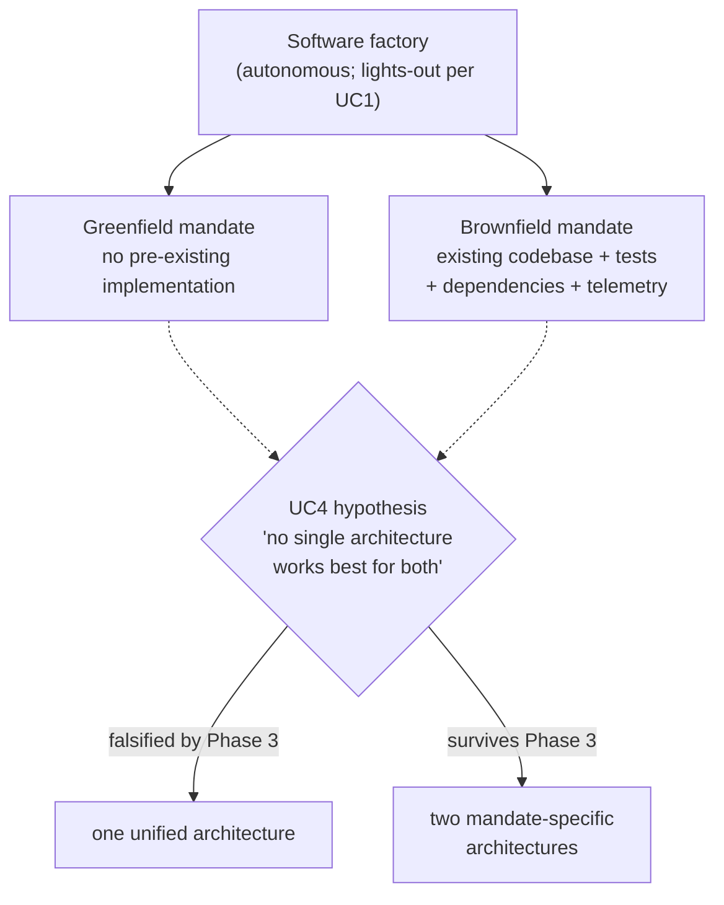
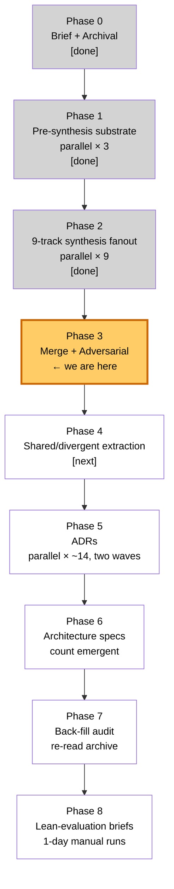
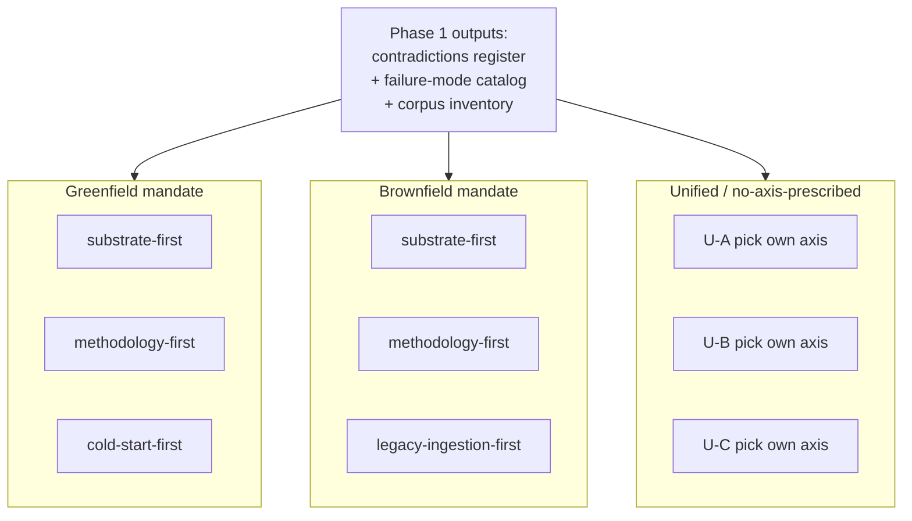
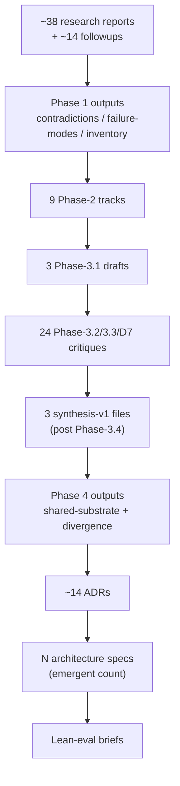
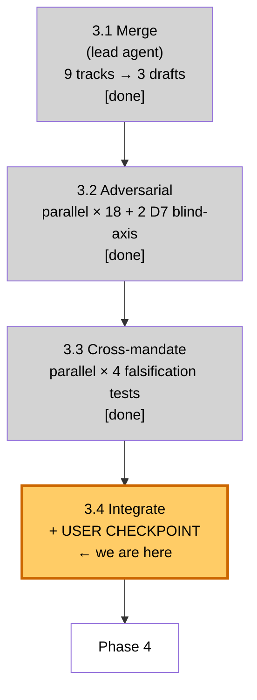
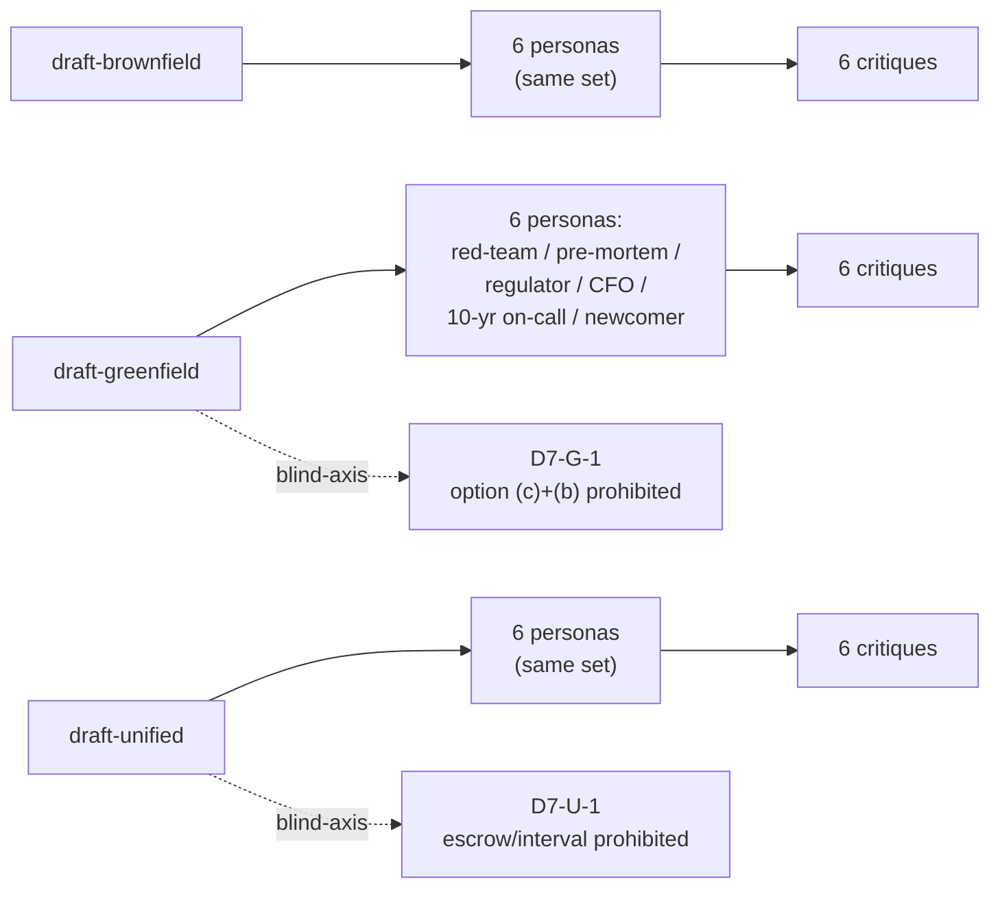
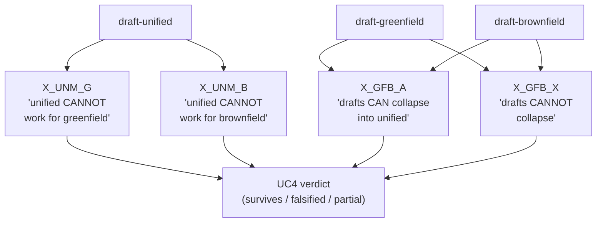
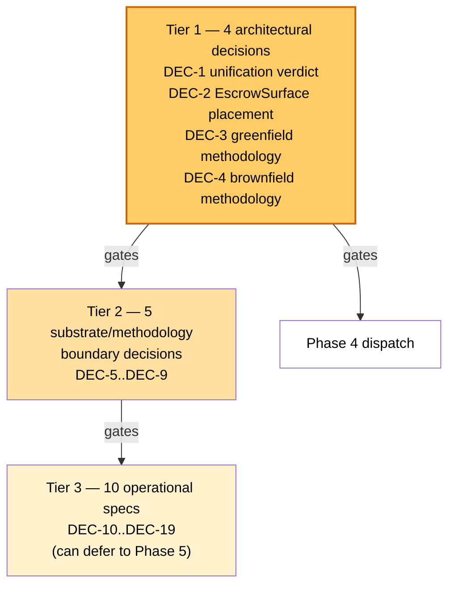
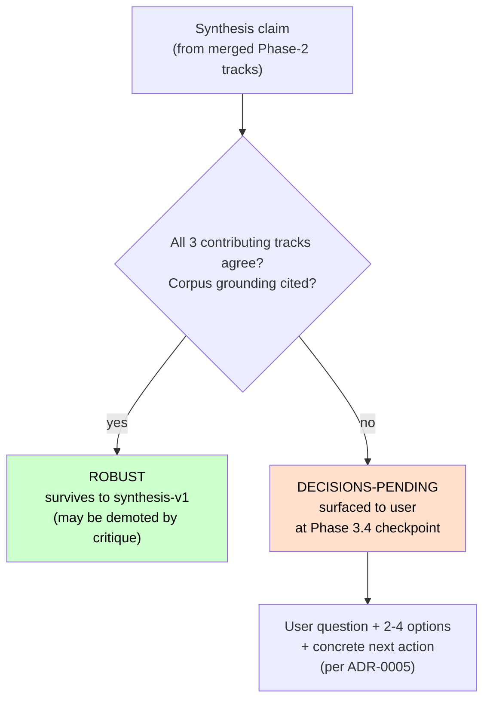
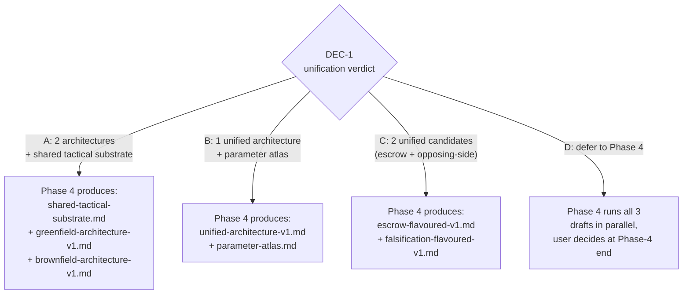

# Research Plan v3 — Process Primer

**Audience.** A technical reader who has not opened [`ARCHITECTURE-V3-SYNTHESIS-PLAN.md`](ARCHITECTURE-V3-SYNTHESIS-PLAN.md) and wants the process at a level where Phase-3.4 questions make sense. Conclusion-neutral — this document tells you *what is being done and why*, not *what has been found*.

---

## What we are building

The project is designing a **software factory**: an autonomous system that produces working software with minimal continuous human-in-the-loop intervention. The artifact-set we are designing is the *architecture* for that factory — substrate primitives (sandbox, watchdog, judge router, trajectory capture, etc.), a methodology layer on top, and the discipline that links them. The downstream consumers of this work are Phase-6 architecture specs, Phase-5 ADRs, and Phase-8 lean-evaluation briefs that ultimately get implemented and run.

Two mandates are treated as potentially distinct:

- **Greenfield**: the factory builds a system that has no pre-existing implementation.
- **Brownfield**: the factory operates on an existing codebase, with its tests, dependencies, telemetry, and history as constraining inputs.

The user has explicitly named UC4 as a *falsifiable hypothesis*: that no single architecture works best for both mandates. The v3 process is designed to test that hypothesis with structure rather than assume it.

---

## Why this process and not "just design the architecture"

Three reasons:

1. **Asymmetric stakes.** This step sets direction for hundreds or thousands of hours of downstream work. A wrong architecture costs enormously; an over-careful synthesis only costs tokens. The plan declares **accuracy ≫ speed ≫ tokens** as the operating principle.

2. **Bias resistance.** A single architect picking primitives will inherit framing from whatever they read most recently. The corpus that feeds this work has ~38 numbered research reports and ~14 followups; the bias surface is large. The plan responds with deliberate divergence (multiple independent tracks), [bias-guard](https://en.wikipedia.org/wiki/Cognitive_bias) subagents at every phase (not just at adversarial passes), and "blind-axis tests" — essentially [key-assumptions checks](https://en.wikipedia.org/wiki/Structured_analytic_techniques) — that prohibit converged-on framings to test whether the convergence is genuine or [anchoring](https://en.wikipedia.org/wiki/Anchoring_effect) contamination.

3. **Falsification over confirmation.** The plan structures itself so it can find out that v3 is wrong, not just confirm it — a [Popperian](https://en.wikipedia.org/wiki/Falsifiability) disposition. Phase 7 (back-fill audit) deliberately re-reads the archived v1/v2 material *after* v3 lands, specifically to look for what got lost. Cross-mandate falsification tests in Phase 3 attack the unified architecture from both mandate sides, looking for the case where one architecture cannot work for both.

---

## The 8-phase shape

### What each phase does, in one paragraph

- **Phase 0**: lock the brief, archive the existing v1/v2 architectures so they cannot anchor the new work. Done; the brief lives at [`architectures/v3/00-brief-v3.md`](architectures/v3/00-brief-v3.md).
- **Phase 1**: build inputs every Phase-2 track will read identically. The three products are a *contradictions register* (pairwise tensions in the corpus, no resolution attempted), a *failure-mode catalog* (F1..F61+ with greenfield/brownfield severity), and a *corpus inventory* (per-report one-paragraph anchor + mandate tag).
- **Phase 2**: dispatch 9 subagents in parallel to write candidate architectures from different angles. The "9" decomposes as 3 greenfield + 3 brownfield + 3 unified (no-axis-prescribed). Each subagent reads the same Phase-1 inputs but is *told to be strong on its axis, not comprehensive*. The divergence is the design.

- **Phase 3**: merge the 9 tracks into 3 syntheses (one per mandate plus unified), then attack each synthesis with persona-diverse adversarial subagents ([red team](https://en.wikipedia.org/wiki/Red_team), [pre-mortem](https://en.wikipedia.org/wiki/Pre-mortem), regulator, CFO, 10-year on-call, naive newcomer). Then [cross-mandate adversarial](https://en.wikipedia.org/wiki/Adversarial_collaboration) tests falsify (or fail to falsify) UC4.
- **Phase 4**: take the surviving syntheses and extract what is genuinely shared substrate vs. what genuinely diverges. This produces the load-bearing decision document for everything downstream.
- **Phase 5**: write [Architecture Decision Records](https://en.wikipedia.org/wiki/Architectural_decision) for every binding choice. Wave 1 is shared-substrate ADRs (sandbox model, holdout discipline, watchdog tiers, etc.). Wave 2 is mandate-specific ADRs.
- **Phase 6**: write the actual architecture specs *from the ADRs*. Specs cite synthesis; ADRs cite neither. This is a deliberate three-layer citation discipline so the dependency graph is auditable.
- **Phase 7**: re-read everything that was archived in Phase 0. For each archived claim/primitive/recommendation, classify as `absorbed` / `rejected with reason` / `TBD`. The purpose is to catch silent omissions.
- **Phase 8**: design a 1-day manual evaluation per architecture before any infrastructure work begins.

### Data flow from corpus to artifacts

---

## Where we are inside Phase 3

Phase 3 has four sub-phases. The first three are mechanical — they fan out subagents and collect results. The fourth is the integration step where lead agent and user meet to resolve open questions.

- **3.1**: lead-agent (me) read all 9 Phase-2 tracks and produced 3 *pre-adversarial* drafts — `draft-greenfield-synthesis.md`, `draft-brownfield-synthesis.md`, `draft-unified-synthesis.md`. Each draft marks each claim as either **ROBUST** (all 3 contributing tracks agree, corpus-grounded) or **DECISIONS-PENDING** (tracks diverge in a user-actionable way). The ROBUST/DECISIONS-PENDING distinction is the central data structure of Phase 3.
- **3.2**: 18 subagents attacked the drafts (6 personas × 3 drafts). Each persona is drawn from a bias-guard catalog (structurally similar to a [Six-Thinking-Hats](https://en.wikipedia.org/wiki/Six_Thinking_Hats)-style rotation, though the persona set is custom) and is told to find weaknesses in its lens. Their critiques live under `architectures/v3/bias-guards/phase-3/{greenfield,brownfield,unified}/`. Plus 2 mandatory "blind-axis" tests dispatched with the most-converged-on framings explicitly prohibited — an anti-[anchoring](https://en.wikipedia.org/wiki/Anchoring_effect) discipline.

- **3.3**: 4 cross-mandate [adversarial-collaboration](https://en.wikipedia.org/wiki/Adversarial_collaboration) subagents tested UC4 falsifiability — two arguing the unified architecture cannot work for one mandate or the other, and two arguing whether the separate mandate-drafts can or must not collapse. These are at `bias-guards/phase-3/cross-mandate/`.

- **3.4** (right now): I compiled all of the above into [`phase-3.4-integration-brief.md`](architectures/v3/phase-3.4-integration-brief.md) and surfaced the load-bearing decisions for user resolution. The plan explicitly designates this as a checkpoint: **before integration writes the final synthesis-v1 files, every architecturally-load-bearing DECISIONS-PENDING item is surfaced to the user**.

The plan's checkpoint table calls this out:

| Phase | What user reviews |
|---|---|
| 3.4 | Every divergence between tracks; whether unified-synthesis survives |

The integration brief lists 19 decision items, tiered:

- **Tier 1** (4 items): architectural shape — gating items, must resolve before integration.
- **Tier 2** (5 items): substrate/methodology boundary — depend on Tier 1.
- **Tier 3** (10 items): operational specifications — can be carried into Phase-5 as ADR questions if the user prefers.

The four AskUserQuestion items you dismissed are the Tier 1 set.

---

## The data structures you will see in DECISIONS-PENDING

Every claim in a synthesis draft is classified by the lead agent during the Phase-3.1 merge:

Each DECISIONS-PENDING item in the integration brief has the same shape:

- **Divergence**: what the tracks disagreed on (or what the cross-mandate verdict was split on).
- **User question**: a clean question with 2-4 options.
- **Concrete next action**: per ADR-0005 discipline, every open item names *who does what to which file*, so the answer flows mechanically into Phase-4/5/6 work.

The 4 Tier-1 items are organized this way:

- **DEC-1 (unification verdict)** — picks the Phase-4 shape. Options are derived from the cross-mandate verdict, which is split four ways.
- **DEC-2 (one specific substrate primitive's status)** — picks whether a contested primitive is substrate or methodology. The contestation is from a "blind-axis" test that partially confirmed contamination.
- **DEC-3 (greenfield methodology shape)** — picks among three structurally incompatible methodology proposals.
- **DEC-4 (brownfield methodology shape)** — same, for the other mandate.

Tier-2 and Tier-3 items can be answered later; Phase 4 cannot start without Tier 1.

---

## What happens after Tier-1 resolves

1. **Integration writes synthesis-v1 files.** Three `*-synthesis-v1.md` files (or fewer, depending on DEC-1's resolution). Each is the corresponding draft after applying critique demotions, with an objections-and-responses appendix pointing at the relevant Phase-3 critiques. ROBUST claims that were demoted to DECISIONS-PENDING by the critiques move down; DECISIONS-PENDING items with resolutions become DECISIONS-RESOLVED.
2. **Phase 4 dispatches.** Lead agent reads the surviving syntheses and produces `shared-substrate.md` + `divergence.md`. Bias guards: a splitter/lumper debate pair plus a substrate-vs-methodology classifier subagent.
3. **Phase 5 starts.** ~14 ADRs in two waves. Each ADR has a "Alternatives considered" section that must engage with the archived v1/v2 content (this is where back-fill starts naturally).

The shape Phase 4 takes is conditional on DEC-1, the most architecturally load-bearing decision:

---

## What process discipline you will keep seeing

A few patterns recur across phases:

- **YAML headers** with `based-on-commit` + `based-on-date` on every artifact, so the dependency graph survives rebases.
- **Concrete-task discipline** ([ADR](https://en.wikipedia.org/wiki/Architectural_decision)-0005): every open item names what specific action resolves it. No abstract "we should investigate X" items.
- **Three-layer citation discipline** (ADR-0002): specs cite synthesis; ADRs cite neither raw reports nor specs. Keeps the citation graph acyclic.

- **Bias-guard sharpening separated from corpus**: bias-guard outputs are findings, not corpus. Downstream artifacts cite the underlying corpus material the bias-guard pointed at, not the bias-guard finding ID. The bias-guard reports stay in their own directory.
- **Cross-session resumption**: every artifact committed and pushed; every phase ends with a commit; the plan's §7 resumption protocol is "read the plan, read PLAN.md for corpus state, `git log` to see what's landed, identify the current phase from the checkpoint table, continue."

---

## How to engage with Phase 3.4 specifically

Two routes:

1. **Answer the Tier-1 decisions**. Pick options on DEC-1 through DEC-4, possibly with the "Other" escape hatch for variants the options don't cover. Phase 3.4 then writes synthesis-v1 files and we're in Phase 4.
2. **Ask for a deeper writeup on any specific decision before answering**. The integration brief gives the headline; the underlying critiques and tracks have the substance. I can produce a focused brief on (for example) "what is `CodebaseModel` and why does it bear on DEC-1" without re-doing all the work.

The honest read: Tier-1 items are architecturally load-bearing but the *options* on each are well-defined now; the data to answer them is in the Phase-3 critiques. Tier-2 and Tier-3 items can be deferred to Phase-5 ADRs without breaking the pipeline.

---

## Appendix — research-synthesis techniques drawn from

**Important caveat up front.** The end-to-end synthesis pipeline described in this primer is **not an established, previously-tested, or externally-validated research methodology**. It is a bricolage I (the AI assistant executing this work, in concert with the AI sessions that authored [`ARCHITECTURE-V3-SYNTHESIS-PLAN.md`](ARCHITECTURE-V3-SYNTHESIS-PLAN.md)) assembled from validated pieces. Each *individual* piece below has its own track record in its own field — ADRs in software architecture, pre-mortem and red-team in decision analysis and security, falsifiability in philosophy of science, anchoring in behavioural economics. The *combination* — this specific 8-phase shape with these specific bias guards, this cross-mandate falsification structure, this blind-axis discipline, this ROBUST-vs-DECISIONS-PENDING data structure — is novel and has not been run before, validated empirically, or peer-reviewed. Treat the plan as a structured first attempt, not as best-practice. Phase 8's lean-evaluation step is partly there to begin generating the validation data the methodology itself currently lacks.

The plan is a bricolage of established techniques rather than a single methodology. This appendix lists the techniques it draws from, with Wikipedia entry points for follow-up reading. Honest about omissions: things the plan is *not* doing are listed at the end.

### Most directly in use

- **[Architecture Decision Records (ADR)](https://en.wikipedia.org/wiki/Architectural_decision)** — Michael Nygard's pattern for capturing binding architectural choices as numbered, immutable, context-decision-consequences records. The Phase-5 ADRs follow this pattern almost literally; ADR-0002 / ADR-0004 / ADR-0005 in `docs/adr/` set the citation discipline used throughout v3.
- **[Pre-mortem analysis](https://en.wikipedia.org/wiki/Pre-mortem)** — Gary Klein's "imagine it failed; tell the story" exercise. One of the six adversarial personas per draft is literally a pre-mortem.
- **[Red team](https://en.wikipedia.org/wiki/Red_team)** — adversarial position-taking originating in military planning. Another named persona; same role as the security-research red team but applied to architecture claims.
- **[Falsifiability](https://en.wikipedia.org/wiki/Falsifiability)** — Popper's criterion. UC4 is structured as a falsifiable hypothesis (no single architecture works best for both mandates), and Phase 3.3 dispatches subagents whose job is to falsify it. D7-U-1's alternative axis even calls its substrate primitive a "falsification commitment," explicitly invoking Popperian framing.
- **[Anchoring effect](https://en.wikipedia.org/wiki/Anchoring_effect)** — Tversky/Kahneman. The `F-ANCHOR-N` catalog in the Phase-2 bias guards is literally an anchoring-bias detector. D5/D7 in `decisions-captured.md` are anti-anchoring disciplines.
- **[Cognitive bias mitigation](https://en.wikipedia.org/wiki/Cognitive_bias)** — the bias-guard catalog (skeptic, naive newcomer, anchor-detector, splitter, lumper, etc.) is a working subset of the standard biases-and-debiasing literature.

### Patterns borrowed in pieces

- **[Six Thinking Hats](https://en.wikipedia.org/wiki/Six_Thinking_Hats)** — Edward de Bono's persona-rotation discipline. The 6 adversarial personas per draft (red-team / pre-mortem / regulator / CFO / on-call / newcomer) are structurally a Six-Hats-style rotation, though the persona set is custom rather than de Bono's six.
- **[Structured analytic techniques](https://en.wikipedia.org/wiki/Structured_analytic_techniques)** — Richards Heuer's analytic-tradecraft canon from US intelligence. Red team, devil's advocate, alternative analysis, key assumptions check, "high-impact / low-probability" analysis — many of the v3 bias-guard personas come from this tradition. The "blind-axis test" (D7) is essentially a key-assumptions check.
- **[Adversarial collaboration](https://en.wikipedia.org/wiki/Adversarial_collaboration)** — the Kahneman / Mellers protocol where opposing experts agree on a falsification test in advance. Phase 3.3's four-subagent cross-mandate pass (unify-advocate + cannot-unify-attacker + two unified-mandate-attackers) is adversarial-collaboration-shaped.
- **[Devil's advocate](https://en.wikipedia.org/wiki/Devil%27s_advocate)** — the Catholic-tribunal-origin discipline of structured opposition. Several bias-guards (anchor-detector, lumper, splitter) play this role.
- **[Triangulation in social research](https://en.wikipedia.org/wiki/Triangulation_(social_science))** — multi-source validation as a corpus-reading discipline. The contradictions register and the corpus inventory in Phase 1 are triangulation infrastructure.
- **[Pace layering](https://en.wikipedia.org/wiki/Pace_layering)** — Stewart Brand's framework (fast layers anchor on slow layers). One of the Phase-2 unified tracks (U-B) is built directly on Brier's pace-layer recasting; the corpus has it as a contested-but-load-bearing organizing principle.
- **[Multi-criteria decision analysis](https://en.wikipedia.org/wiki/Multiple-criteria_decision_analysis)** — the D2 mandate-fit matrix (rows = architectures, columns = work-unit-classes, cells = greenfield/brownfield/both/n/a) is an MCDA instance.

### Philosophy of science background

- **[Conjectures and Refutations](https://en.wikipedia.org/wiki/Conjectures_and_Refutations)** — Popper's 1963 book, the operational form of falsificationism. D7-U-1 explicitly invokes "Popperian conjecture-and-refutation applied at the artifact level" as its axis.
- **[Critical rationalism](https://en.wikipedia.org/wiki/Critical_rationalism)** — the broader Popperian programme. Sets the "we structure this so it can be wrong, not so it can be confirmed" disposition the plan runs on.

### What the plan is *not* drawing from (but you might expect)

- Not the [Delphi method](https://en.wikipedia.org/wiki/Delphi_method) — Delphi is multi-round expert convergence with anonymous feedback. Phase 2's parallel fanout is single-round and the subagents are not iterating to consensus; the deliberate divergence is the design.
- Not [systematic review / PRISMA](https://en.wikipedia.org/wiki/Preferred_Reporting_Items_for_Systematic_Reviews_and_Meta-Analyses) — the corpus is not a randomized literature; it's curated.
- Not formal [grounded theory](https://en.wikipedia.org/wiki/Grounded_theory) — there is no axial/selective coding pass.
- Not the [Cynefin framework](https://en.wikipedia.org/wiki/Cynefin_framework) — the regime-classification framing has surface similarity but the v3 work doesn't borrow Cynefin's complex/complicated/chaotic taxonomy directly.

---

*End of primer.*
