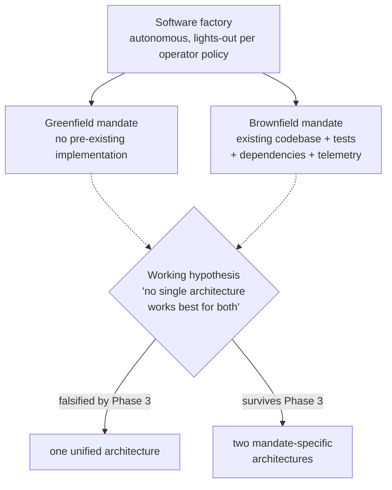
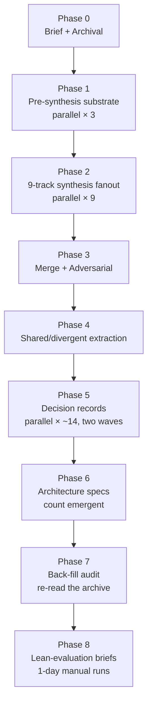
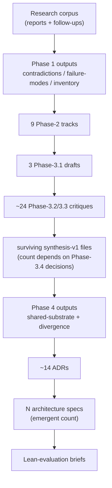
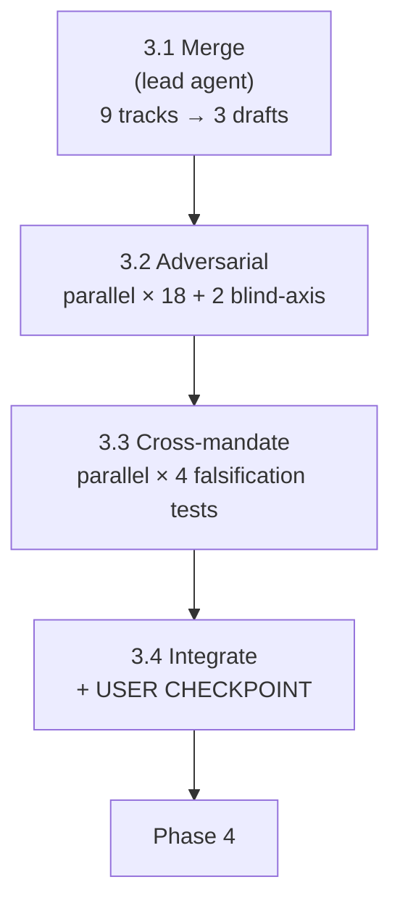
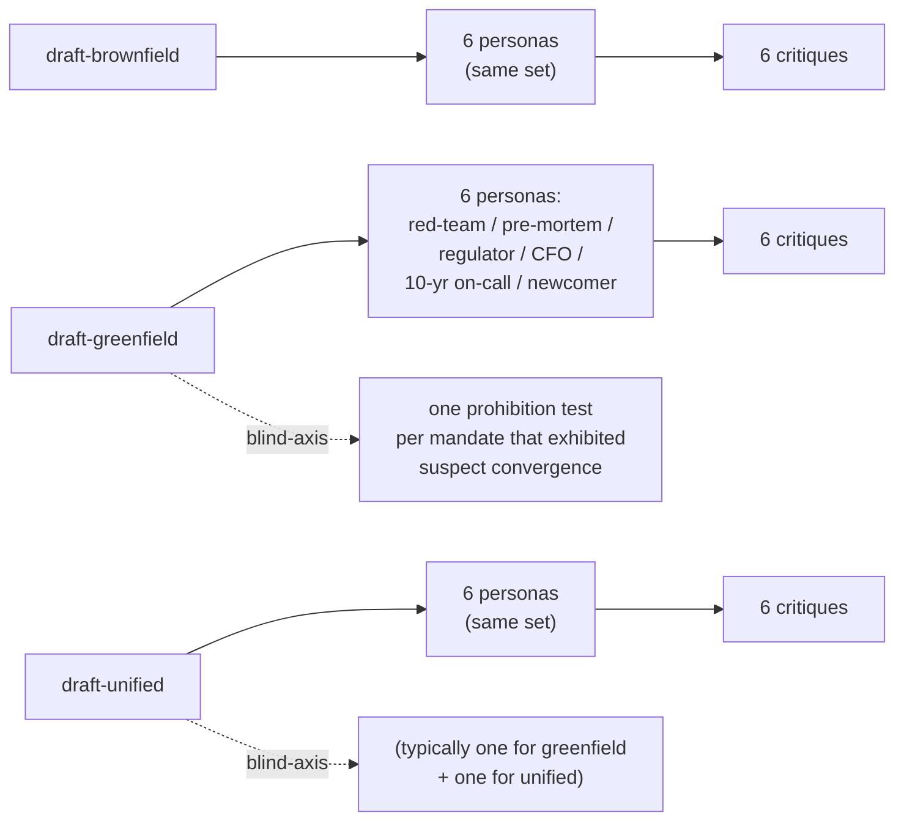
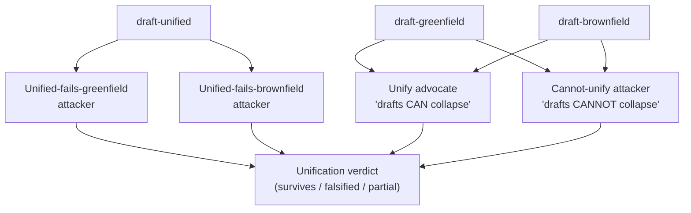
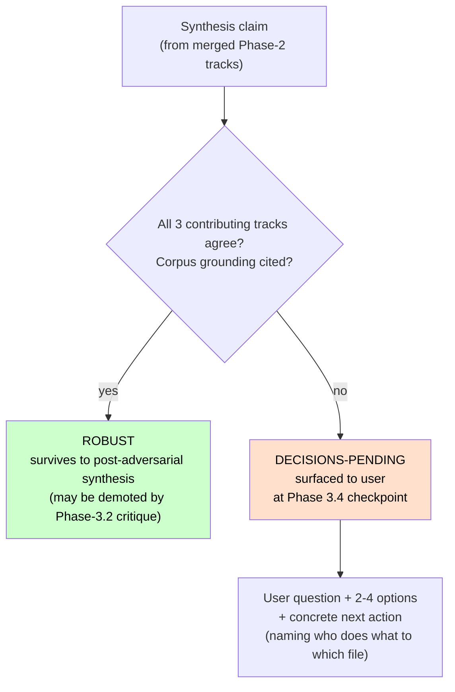
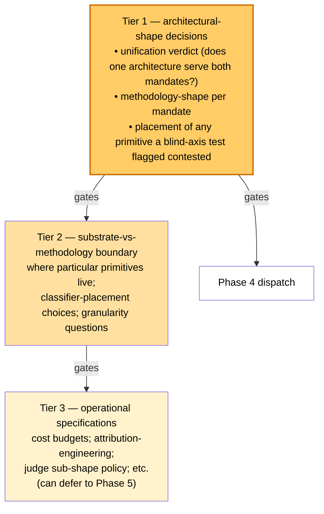
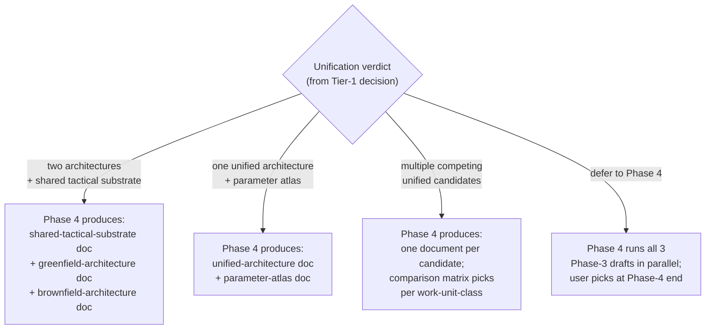
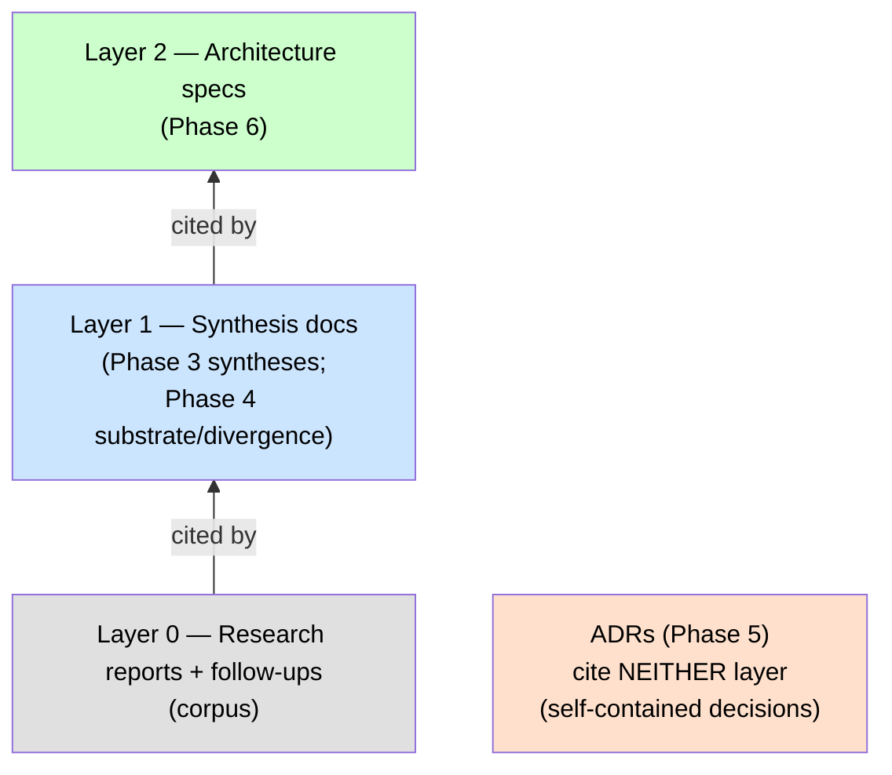

# Architecture Synthesis Methodology — Process Primer

**Audience.** A technical reader familiar with the vocabulary of *software factories* (autonomous code-producing systems, lights-out operation, substrate primitives, etc.) who wants to understand the **methodology** by which a factory's architecture gets synthesized from a research corpus. No prior knowledge of any specific synthesis run's intermediate artifacts is required.

**Scope.** This primer describes the synthesis pipeline as a reusable process. The v3 run of the pipeline (in this repository) is referenced throughout as the canonical worked example — counts of subagents, persona names, file-layout examples are taken from v3 — but everything described applies to any run. Conclusion-neutral: this tells you *what is being done and why*, not *what has been found*.

**A note on terminology.** The "factory" being designed has two operating regimes, each driving a different architecture conversation:

- **Greenfield mandate**: the factory builds software that has no pre-existing implementation. Priors from adjacent domains and exemplar projects are permitted; an existing codebase is not present.
- **Brownfield mandate**: the factory operates on an existing codebase — with its tests, dependencies, runtime telemetry, and accumulated history all being primary constraining inputs.

A central driving question for any run is whether **one architecture serves both mandates**, or whether the two mandates need separate architectures. The methodology treats this as a *falsifiable hypothesis*, designed to test rather than assume.

---

## Why a structured methodology and not "just design the architecture"

Three reasons:

1. **Asymmetric stakes.** Architecture choices set direction for hundreds or thousands of hours of downstream implementation, testing, and operation. A wrong architecture costs enormously; an over-careful synthesis only costs tokens and clock time. The methodology declares **accuracy ≫ speed ≫ tokens** as its operating principle.

2. **Bias resistance.** A single architect picking primitives will inherit framing from whatever they read most recently. Research corpora that feed factory-architecture work are large (v3's was ~38 research reports plus ~14 follow-ups), and the bias surface is significant. The methodology responds with three things: deliberate divergence (multiple independent tracks at each fanout phase), [bias-guard](https://en.wikipedia.org/wiki/Cognitive_bias) subagents at every phase (not just at the explicitly adversarial passes), and "blind-axis tests" — essentially [key-assumptions checks](https://en.wikipedia.org/wiki/Structured_analytic_techniques) — that prohibit converged-on framings to test whether the convergence is genuine or [anchoring](https://en.wikipedia.org/wiki/Anchoring_effect) contamination.

3. **Falsification over confirmation.** The methodology structures itself so it can find out that its output is wrong, not just confirm that it is right — a [Popperian](https://en.wikipedia.org/wiki/Falsifiability) disposition. A late "back-fill audit" phase deliberately re-reads any prior-version material that was archived at the start of the run, looking specifically for what got dropped. Cross-mandate falsification tests in the middle phase attack any "one architecture for both" claim from both mandate sides, looking for the case where the unified design cannot work for one mandate or the other.

---

## The 8-phase shape

### What each phase does, in one paragraph

- **Phase 0** (Brief + archival). Lock the brief that the rest of the pipeline will read. Archive any existing version's architectures and syntheses so they cannot anchor the new work. The brief carries the operating-mode mandate (lights-out per the operator's definition), the two mandate scopes (greenfield and brownfield), the user-stated working hypothesis (if any), and any explicit out-of-scope statements.
- **Phase 1** (Pre-synthesis substrate). Build inputs every Phase-2 track will read identically. Three products:
  - a **contradictions register** (pairwise tensions in the corpus, both sources cited, *no resolution attempted* at this stage),
  - a **failure-mode catalog** (enumerated risks with greenfield- and brownfield-specific severity ratings),
  - a **corpus inventory** (one-paragraph anchor per source, plus a greenfield / brownfield / both tag).
- **Phase 2** (9-track synthesis fanout). Dispatch 9 subagents in parallel to write candidate architectures from different angles. The "9" decomposes as 3 greenfield + 3 brownfield + 3 unified-mandate (no-axis-prescribed). Each subagent reads the same Phase-1 inputs but is *told to be strong on its axis, not comprehensive*. The deliberate divergence is the design.

- **Phase 3** (Merge + adversarial). Merge the 9 tracks into 3 syntheses (one per mandate plus one unified-candidate synthesis), then attack each synthesis with persona-diverse adversarial subagents drawn from a bias-guard catalog ([red team](https://en.wikipedia.org/wiki/Red_team), [pre-mortem](https://en.wikipedia.org/wiki/Pre-mortem), regulator, CFO, 10-year on-call engineer, naive newcomer). Then [cross-mandate adversarial](https://en.wikipedia.org/wiki/Adversarial_collaboration) tests attack the unification hypothesis. *Detailed treatment in the next section.*
- **Phase 4** (Shared/divergent extraction). Take the syntheses that survive Phase 3 and extract what is genuinely shared substrate vs. what genuinely diverges between mandates. This produces the load-bearing decision document that everything downstream depends on.
- **Phase 5** (Decision records). Write [Architecture Decision Records](https://en.wikipedia.org/wiki/Architectural_decision) for every binding choice. Wave 1 is shared-substrate ADRs (sandbox model, holdout discipline, watchdog tiers, etc.). Wave 2 is mandate-specific ADRs.
- **Phase 6** (Architecture specs). Write the actual architecture specs *from* the ADRs. Specs cite synthesis documents; ADRs cite neither raw corpus nor specs. This is a deliberate three-layer citation discipline so the dependency graph remains acyclic and auditable.
- **Phase 7** (Back-fill audit). Re-read everything that was archived in Phase 0. For each archived claim/primitive/recommendation, classify as `absorbed` / `rejected with reason` / `TBD`. The purpose is to catch silent omissions — primitives or insights the new architecture quietly dropped.
- **Phase 8** (Lean-evaluation briefs). Design a 1-day manual evaluation per architecture *before* any infrastructure work begins. The evaluation is the architecture's first contact with concrete-task reality.

### Data flow from corpus to artifacts

---

## Inside Phase 3 (the most subagent-heavy phase)

Phase 3 has four sub-phases. The first three are mechanical — they fan out subagents and collect results. The fourth is the integration step where lead agent and user meet to resolve open questions.

- **3.1 (lead-agent work).** Read all 9 Phase-2 tracks and produce 3 pre-adversarial drafts — one per mandate plus one unified-candidate draft. Each draft marks each claim as either **ROBUST** (all 3 contributing tracks agree, with corpus grounding) or **DECISIONS-PENDING** (tracks diverge in a way that requires user resolution). The ROBUST/DECISIONS-PENDING distinction is the central data structure of Phase 3.

- **3.2 (parallel adversarial dispatch).** 18 subagents attack the drafts — 6 personas × 3 drafts. The persona set is drawn from a bias-guard catalog. Plus 2 mandatory "blind-axis" tests dispatched with the most-converged-on framings explicitly prohibited — an anti-anchoring discipline that asks whether the convergence among the Phase-2 tracks reflected real corpus signal or shared inheritance from the brief.

- **3.3 (cross-mandate falsification).** 4 cross-mandate subagents (an [adversarial-collaboration](https://en.wikipedia.org/wiki/Adversarial_collaboration)-shaped grid) test the unification hypothesis from four angles — two arguing the unified architecture *cannot* work for one mandate or the other, and a third/fourth arguing whether the two separate mandate-drafts *can* or *cannot* collapse into a single architecture.

- **3.4 (lead-agent integration + user checkpoint).** Lead agent compiles all critiques into an integration brief and surfaces the load-bearing decisions for user resolution. The methodology designates this as a checkpoint: **before integration writes the final post-adversarial synthesis files, every architecturally-load-bearing DECISIONS-PENDING item is surfaced to the user**.

The plan's checkpoint table calls this out explicitly:

| Phase | What user reviews |
|---|---|
| 3.4 | Every divergence between tracks; whether the unified synthesis survives the cross-mandate attacks |

---

## The ROBUST / DECISIONS-PENDING data structure

Every claim in a synthesis draft is classified by the lead agent during the Phase-3.1 merge:

Each DECISIONS-PENDING item has the same shape:

- **Divergence**: what the tracks disagreed on (or what the cross-mandate verdict was split on).
- **User question**: a clean question with 2–4 options.
- **Concrete next action**: every open item names *who does what to which file*, so the answer flows mechanically into Phase-4/5/6 work. This is the methodology's "concrete-task discipline" — open items must be actionable, never abstract "we should investigate X" placeholders.

The decisions are tiered by load-bearingness:

- **Tier 1 (architectural shape).** Whether one architecture serves both mandates or they need separate architectures; what shape the methodology layer takes per mandate; the substrate-vs-methodology placement of any primitive that a blind-axis test flagged as contested. **Gating** — must resolve before Phase 4 can dispatch.
- **Tier 2 (substrate/methodology boundary).** Where particular substrate primitives live; classifier-placement choices; granularity-of-typed-object questions. Depend on Tier 1.
- **Tier 3 (operational specifications).** Cost-budget specs, attribution-engineering details, judge sub-shape policy, etc. Can be carried into Phase 5 as ADR questions if the user prefers.

(For scale: in v3, Tier 1 had 4 items, Tier 2 had 5, Tier 3 had 10. The exact count varies by run.)

---

## What happens after Tier-1 resolves

1. **Integration writes post-adversarial synthesis files.** One per surviving architecture — the count depends on how the Tier-1 unification decision resolves; see diagram below. Each is the corresponding pre-adversarial draft after applying Phase-3.2 critique demotions, with an objections-and-responses appendix pointing at the relevant critiques. ROBUST claims that were demoted by critique move down; DECISIONS-PENDING items with resolutions become DECISIONS-RESOLVED.
2. **Phase 4 dispatches.** Lead agent reads the surviving syntheses and produces a shared-substrate document and a divergence document. Bias guards at this phase: a [splitter/lumper](https://en.wikipedia.org/wiki/Lumpers_and_splitters)-style debate pair plus a substrate-vs-methodology classifier subagent.
3. **Phase 5 starts.** ~14 ADRs in two waves. Each ADR has an "Alternatives considered" section that must engage with the archived prior-version content (this is where the Phase-7 back-fill audit starts naturally).

The shape Phase 4 takes is conditional on the architectural-shape (unification) decision. Four canonical outcomes:

---

## Process-discipline patterns you will keep seeing across phases

A few patterns recur across phases:

- **YAML headers** with `based-on-commit` + `based-on-date` on every artifact, so the dependency graph survives rebases.
- **Concrete-task discipline**: every open item names what specific action resolves it (who does what to which file). No abstract "we should investigate X" items survive into a synthesis or decision document.
- **Three-layer citation discipline**: architecture specs cite synthesis documents; ADRs cite neither raw corpus nor specs. The citation graph is acyclic and the dependency direction is auditable.

- **Bias-guard sharpening separated from corpus.** Bias-guard outputs are findings, not corpus. Downstream artifacts cite the underlying corpus material the bias-guard pointed at, not the bias-guard finding ID. Bias-guard reports stay in their own directory tree.
- **Cross-session resumption.** Every artifact committed and pushed; every phase ends with a commit; the methodology's resumption protocol is "read the plan, read the corpus-state doc, `git log` to see what's landed, identify the current phase from the checkpoint table, continue."

---

## How to engage with the Phase-3.4 checkpoint

Two routes:

1. **Answer the Tier-1 decisions** surfaced in the integration brief. Pick options, possibly with an "Other" escape hatch for variants the options don't cover. Phase 3.4 then writes the post-adversarial synthesis files and Phase 4 begins.
2. **Ask for a deeper write-up on any specific decision before answering**. The integration brief gives the headline; the underlying critiques and Phase-2 tracks have the substance. Lead agent can produce a focused brief on any specific decision (for example: "what is this contested substrate primitive, and why does the unification verdict depend on its placement?") without re-doing the Phase-3 work.

The honest read: Tier-1 items are architecturally load-bearing, but the *options* on each are well-defined by the time the checkpoint is reached — the data to answer them is in the Phase-3 critiques. Tier-2 and Tier-3 items can be deferred to Phase-5 ADRs without breaking the pipeline.

---

## Appendix — research-synthesis techniques drawn from

**Important caveat up front.** The end-to-end synthesis pipeline described above is **not an established, previously-tested, or externally-validated research methodology**. It is a bricolage assembled by the AI sessions that authored the synthesis plan, drawing on validated individual pieces. Each *individual* piece below has its own track record in its own field — ADRs in software architecture, pre-mortem and red-team in decision analysis and security, falsifiability in philosophy of science, anchoring in behavioural economics. The *combination* — this specific 8-phase shape with these specific bias guards, this cross-mandate falsification structure, this blind-axis discipline, this ROBUST-vs-DECISIONS-PENDING data structure — is novel and has not been run before, validated empirically, or peer-reviewed. Treat the plan as a structured first attempt, not as best-practice. Phase 8's lean-evaluation step is partly there to begin generating the validation data the methodology itself currently lacks.

The pipeline is a bricolage of established techniques rather than a single methodology. This appendix lists the techniques it draws from, with Wikipedia entry points for follow-up reading. Honest about omissions: things the pipeline is *not* doing are listed at the end.

### Most directly in use

- **[Architecture Decision Records (ADR)](https://en.wikipedia.org/wiki/Architectural_decision)** — Michael Nygard's pattern for capturing binding architectural choices as numbered, immutable, context-decision-consequences records. The Phase-5 ADRs follow this pattern almost literally. The methodology's "concrete-task discipline" and "three-layer citation discipline" (specs cite synthesis; ADRs cite neither) are themselves codified as foundational ADRs that the rest of the pipeline inherits.
- **[Pre-mortem analysis](https://en.wikipedia.org/wiki/Pre-mortem)** — Gary Klein's "imagine it failed; tell the story" exercise. One of the six adversarial personas per draft is literally a pre-mortem.
- **[Red team](https://en.wikipedia.org/wiki/Red_team)** — adversarial position-taking originating in military planning. Another named persona; same role as the security-research red team but applied to architecture claims.
- **[Falsifiability](https://en.wikipedia.org/wiki/Falsifiability)** — Popper's criterion. The unification hypothesis is structured as falsifiable, and Phase 3.3 dispatches subagents whose job is to falsify it. The blind-axis tests in Phase 3.2 are a second falsification surface — they ask whether convergence among independent tracks reflected corpus signal or shared anchoring.
- **[Anchoring effect](https://en.wikipedia.org/wiki/Anchoring_effect)** — Tversky/Kahneman. The Phase-2 anchor-detector bias guard is literally an anchoring-bias detector running over the Phase-2 outputs; the blind-axis tests in Phase 3.2 are the falsifying complement.
- **[Cognitive bias mitigation](https://en.wikipedia.org/wiki/Cognitive_bias)** — the bias-guard catalog (skeptic, naive newcomer, anchor-detector, splitter, lumper, etc.) is a working subset of the standard biases-and-debiasing literature.

### Patterns borrowed in pieces

- **[Six Thinking Hats](https://en.wikipedia.org/wiki/Six_Thinking_Hats)** — Edward de Bono's persona-rotation discipline. The 6 adversarial personas per draft (red-team / pre-mortem / regulator / CFO / on-call / newcomer) are structurally a Six-Hats-style rotation, though the persona set is custom rather than de Bono's six.
- **[Structured analytic techniques](https://en.wikipedia.org/wiki/Structured_analytic_techniques)** — Richards Heuer's analytic-tradecraft canon from US intelligence. Red team, devil's advocate, alternative analysis, key assumptions check, "high-impact / low-probability" analysis — many of the bias-guard personas come from this tradition. The blind-axis test is essentially a key-assumptions check.
- **[Adversarial collaboration](https://en.wikipedia.org/wiki/Adversarial_collaboration)** — the Kahneman / Mellers protocol where opposing experts agree on a falsification test in advance. Phase 3.3's four-subagent cross-mandate pass (unify advocate + cannot-unify attacker + two unified-mandate-fails-X attackers) is adversarial-collaboration-shaped.
- **[Devil's advocate](https://en.wikipedia.org/wiki/Devil%27s_advocate)** — the Catholic-tribunal-origin discipline of structured opposition. Several bias-guards (anchor-detector, lumper, splitter) play this role.
- **[Triangulation in social research](https://en.wikipedia.org/wiki/Triangulation_(social_science))** — multi-source validation as a corpus-reading discipline. The contradictions register and the corpus inventory in Phase 1 are triangulation infrastructure.
- **[Pace layering](https://en.wikipedia.org/wiki/Pace_layering)** — Stewart Brand's framework (fast layers anchor on slow layers). It appears as one candidate organizing principle for the unified-mandate tracks in Phase 2.
- **[Multi-criteria decision analysis](https://en.wikipedia.org/wiki/Multiple-criteria_decision_analysis)** — the Phase-6 mandate-fit matrix (rows = architectures, columns = work-unit-classes, cells = greenfield-fit / brownfield-fit / both / n/a) is an MCDA instance.

### Philosophy of science background

- **[Conjectures and Refutations](https://en.wikipedia.org/wiki/Conjectures_and_Refutations)** — Popper's 1963 book, the operational form of falsificationism. The cross-mandate adversarial pass is conjecture-and-refutation applied at the architecture level: each synthesis is a conjecture; each adversarial attack is a refutation attempt.
- **[Critical rationalism](https://en.wikipedia.org/wiki/Critical_rationalism)** — the broader Popperian programme. Sets the "we structure this so it can be wrong, not so it can be confirmed" disposition the pipeline runs on.

### What the pipeline is *not* drawing from (but you might expect)

- Not the [Delphi method](https://en.wikipedia.org/wiki/Delphi_method) — Delphi is multi-round expert convergence with anonymous feedback. Phase 2's parallel fanout is single-round and the subagents are not iterating to consensus; the deliberate divergence is the design.
- Not [systematic review / PRISMA](https://en.wikipedia.org/wiki/Preferred_Reporting_Items_for_Systematic_Reviews_and_Meta-Analyses) — the corpus is not a randomized literature; it's curated.
- Not formal [grounded theory](https://en.wikipedia.org/wiki/Grounded_theory) — there is no axial / selective coding pass over the corpus.
- Not the [Cynefin framework](https://en.wikipedia.org/wiki/Cynefin_framework) — the regime-classification framing has surface similarity but the pipeline doesn't borrow Cynefin's complex / complicated / chaotic taxonomy directly.

---

*End of primer.*
