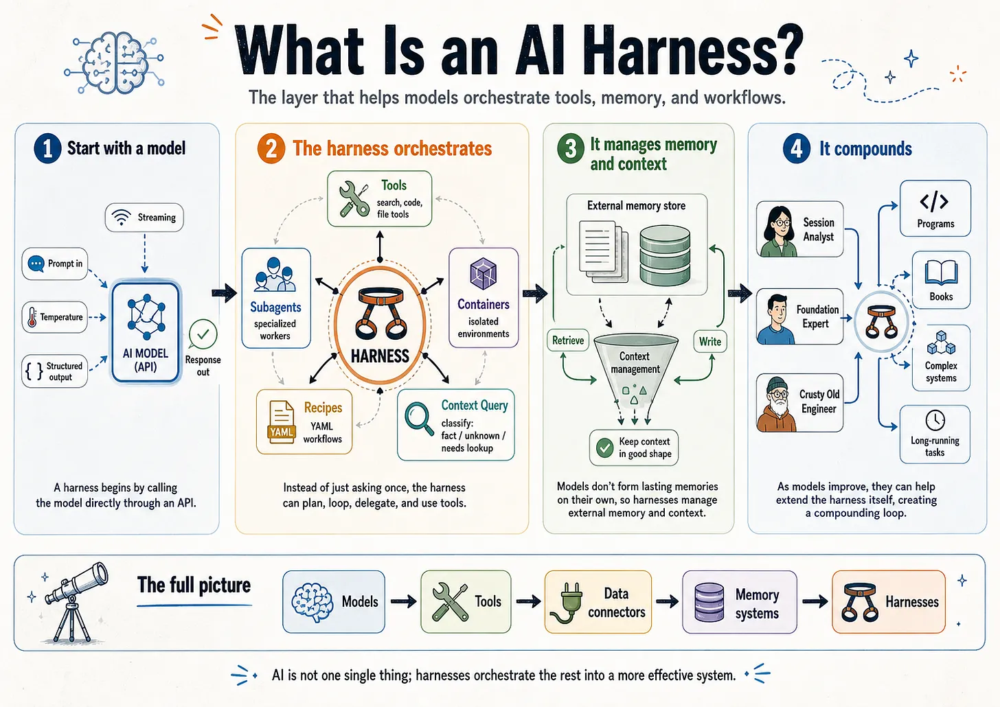
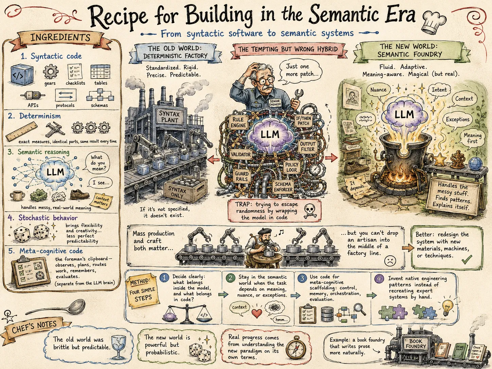

# Research Report 09 — Jaymin West: Harnesses, Practices, Mental Models

**Date:** 2026-05-11
**Author:** Round-2 subagent 09 (sub-03 of fanout `20260511-054258`)
**Status:** Complete. Supersedes and replaces the partial that previously lived at `research/09-jaymin-harnesses-partial.md` (deleted 2026-05-13 in the editorial-collapse pass per PLAN.md §14.4 task 4). The Ch 6 index summary in the partial was fully superseded by direct reads of the sub-pages here; the partial's unique content — the Substack manifesto digest — was folded into §9 below. This report reads Ch 6 sub-pages 1–7, all seven Ch 8 practices, and Ch 9 mental models §3 (Specs as Source Code), §4 (Context as Code), and §7 (Software Factories) directly from the GitHub raw source on branch `main` of `jayminwest/agentic-engineering-book`, plus the Substack manifesto via the Wayback Machine (capture `web.archive.org/web/20260511002503/`, retrieved through fetch-urls issue #8).

**Sources reviewed**

All accessed via prior `curl` to `raw.githubusercontent.com/jayminwest/agentic-engineering-book/main/chapters/…` (cached in `/tmp/jaymin/`). No blocked URLs encountered.

| File | Status |
|---|---|
| `6-harnesses/1-what-is-a-harness.md` | ✅ |
| `6-harnesses/2-harness-stack.md` | ✅ |
| `6-harnesses/3-harness-categories.md` | ✅ (partial — only top half read; sufficient for §1 below) |
| `6-harnesses/4-harness-as-control-system.md` | ✅ (already summarized in partial; cross-checked) |
| `6-harnesses/5-harness-engineering.md` | ✅ (cross-checked; loop details confirm partial) |
| `6-harnesses/6-security-permissions-trust.md` | ✅ |
| `6-harnesses/7-designing-for-your-context.md` | ✅ |
| `8-practices/1-debugging-agents.md` | ✅ |
| `8-practices/2-evaluation.md` | ✅ |
| `8-practices/3-cost-and-latency.md` | ✅ |
| `8-practices/4-production-concerns.md` | ✅ |
| `8-practices/5-workflow-coordination.md` | ✅ |
| `8-practices/6-knowledge-evolution.md` | ✅ |
| `8-practices/7-operating-agent-swarms.md` | ✅ |
| `9-mental-models/3-specs-as-source-code.md` | ✅ |
| `9-mental-models/4-context-as-code.md` | ✅ |
| `9-mental-models/7-software-factories.md` | ✅ |

---

## 1. Harness vocabulary

Jaymin's Ch 6 §1 fixes the term: **a harness is everything around the model that makes it an agent**, captured in the formula `Agent = Model + Harness` (attributed to Fowler; echoed by Mollick, Raschka, Schmid, Hashimoto within a 90-day window in early 2026). The chapter assembles five complementary definitions and converges on a working scope:

- **Raschka:** "The software layer around the model that assembles prompts, exposes tools, tracks file state, applies edits, runs commands, manages permissions, caches stable prefixes, stores memory."
- **LangChain:** "Every piece of code, configuration, and execution logic that isn't the model itself."
- **Fowler:** the execution environment, decomposable into Guides (feedforward) and Sensors (feedback), each computational or inferential.
- **Mollick:** "A system that lets the AI use tools, take actions, and complete multi-step tasks on its own."
- **Schmid:** the OS in a Model-as-CPU metaphor — coordinates resources, enforces permissions, manages application lifecycle.

The chapter explicitly distinguishes **harness** from **scaffold** by citing arXiv:2603.05344 (2026-03): "Scaffolding assembles the agent before the first prompt; the harness orchestrates everything after." Scaffolding is pre-runtime (system prompt construction, tool registration, initial context); harness is runtime (dispatch, context management, safety enforcement, loop control). The chapter also distinguishes harness from "wrapper" (too passive) and "framework" (Jaymin treats LangGraph / CrewAI as *framework + runtime*, with the harness being the assembled runtime configuration).

**Diff against our `architectures/00-comparison.md` §4.1.** Our §4.1 lists nine substrate primitives — worktree, sandbox, stable IDs, out-of-tree scenarios, LLM-judge, trajectory capture, manager loop, decision log, AGENTS.md. Mapping Jaymin's six Raschka components against our list:

| Jaymin's Raschka component | Closest in our §4.1 | Coverage |
|---|---|---|
| Workspace context | AGENTS.md / discoverability | ✅ named; ⚠ we under-specify the "stable prefix caching" economics (~$0.10 per repeated 2k-token prefix per turn × 20 turns × N sessions/day) |
| Prompt shape & cache reuse | — | ❌ not in our §4.1 |
| Tool access | Sandbox + capability scoping | ✅ partial; sandbox covers *what's denied*, tool access covers *what's offered* |
| Context management | — | ❌ implicit at best |
| Session memory | Trajectory capture, decision log | ✅ partial; we conflate runtime memory with archival |
| Subagent delegation | Manager loop / orchestrator | ✅ partial; we don't separate "spawn" from "scope" |
| (Fowler-only) Guides / Sensors | LLM-judge + sandbox | ✅ implicit |
| (Schmid-only) Trajectory capture | Trajectory capture | ✅ direct |

**Is "harness" the right umbrella term for §4.1?** **Yes — adopt it.** "Shared infrastructure" reads like a passive substrate; "harness" names the active control loop that the architectures all run inside. Specifically:

- Our nine primitives split cleanly into **scaffold** (AGENTS.md, stable ID schema) and **harness** (everything else). §4.1 should be relabeled "the shared harness" and a second subsection "the shared scaffold" added.
- Two Raschka components are missing from §4.1: **prompt shape / cache reuse** and **context management**. These are not architectural choices — they are harness primitives that every architecture inherits from whatever runtime it's hosted in. We currently treat them as "the runtime's problem," which is consistent with Jaymin's Rule 1 ("default to an existing full agentic harness") but means we under-document the failure surface of the host runtime itself.
- Our "manager loop" and Jaymin's "subagent delegation" are the same construct viewed from opposite ends. We name it from the supervisor side; Jaymin names it from the spawned-agent side. Both are valid; the doctrinal point is the same — bounded spawning with explicit context scoping.

**Vocabulary cost:** "harness" is now the canonical 2026 industry term for what we've been calling "shared infrastructure," "substrate," "runtime," and "manager loop" interchangeably. Continuing to use four words for one concept is a discoverability tax on future readers. Recommendation: rename §4.1 to "Shared harness" and adopt `harness` as the primary noun across all architecture documents.

---

## 2. Software Factories chapter diff

Ch 9 §7 ("Software Factories", 2026-04-09) is the chapter whose title directly overlaps with this project's name. The chapter frames the 2026 resurgence as **the third historical attempt** to realize the factory concept (Japanese 1980s → Microsoft 2004 DSL approach → 2026 LLM-enabled), with LLMs dissolving the flexibility problem that killed both prior attempts. The chapter is intentionally **critical** — large sections on the circularity problem, code quality evidence, brownfield ceiling, talent pipeline, and liability vacuum.

### 2a. What Jaymin says our comparison missed

**The historical lineage argument.** Our `architectures/00-comparison.md` does not place the four architectures into the historical trajectory of factory thinking. Jaymin's framing — the 2004 DSL framework was the right architecture for a missing component (the general-purpose language model) — *predicts* that the highest-leverage methodologies will be those that **invest in specification infrastructure** rather than implementation infrastructure. Our Arch 1 (Specification Refinery) and Arch 3 (Phase-Gated Foundry) implicitly make this bet; Arch 2 and Arch 4 do not, and we never argued why this matters historically.

**Dan Shapiro's five levels.** Our comparison does not place the four architectures on Shapiro's L0–L5 spectrum (L0 manual → L1 task offloading → L2 active partnership → L3 human oversight → L4 autonomous coding → L5 dark factory). Each of our architectures implicitly targets a level:

- Arch 1 (Refinery): L3 (human reviews diagnostic proposals, classifies failures)
- Arch 2 (Atelier): L3–L4 (human reviews synthesized findings; disposes residual)
- Arch 3 (Foundry): L3 (gate chair role anchors at L3 by design)
- Arch 4 (Tournament): L4 (human as Geneticist, picks winners; doesn't read implementations)

This is a missing axis in our §5 ("decisions each architecture makes differently"). It would let us answer "which architecture targets which level" with a citation rather than freelancing.

**The validation-separation pattern.** Jaymin's discussion of StrongDM's *scenarios-as-holdout-sets* (acceptance criteria withheld from code-generating agents) names a specific pattern we describe under different names across our four architectures: in Arch 1 it's the "out-of-tree scenarios"; in Arch 3 it's the "acceptance V&V"; in Arch 4 it's the "predator agent." Jaymin gives us a single industry-canonical name — **holdout** — for this distributed pattern. Adopting the term improves cross-architecture clarity.

**The circularity problem as a first-class concern.** Stanford Law CodeX's framing — "Built by Agents, Tested by Agents, Trusted by Whom?" — is a doctrinal challenge we partially address (independent judge in Arch 1; Primary + Secondary judge in Arch 4) but never name as the *core epistemic challenge of factory operation*. Adding a §2.5 on "circularity / independent inspection" to `architectures/00-comparison.md` would make explicit what each architecture does to dodge or mitigate the same-model-both-builds-and-validates problem.

**Greenfield vs. brownfield ceiling.** Jaymin's "the realistic ceiling for brownfield factory operations sits closer to Level 3 than Level 5" is a constraint we never discuss. Three of our four architectures are implicitly greenfield-shaped (Refinery, Tournament, Foundry); only Atelier reads as brownfield-tolerant. This should be an explicit dimension in §2 of our comparison.

### 2b. Where our comparison goes deeper

**Failure-mode coverage.** Our §2.4 lists 20 named failure modes (F1–F20) with per-architecture coverage strengths. Jaymin's Ch 9 §7 lists no comparable taxonomy — it names failure *categories* (technical debt at industrial speed, code duplication, architectural unsoundness, integration coherence) but doesn't reach the granularity of F11 (renumbering), F14 (attribution collapse), F18 (prose-spec rigor), or F19 (model-floor dependency). Our coverage is more operationally actionable.

**Per-cycle vs. continuous.** Our four architectures all operate on a cycle/phase boundary (cycle for Arch 1, queue-state for Arch 2, gate for Arch 3, generation for Arch 4). Jaymin's factory framing is continuous-throughput-shaped — agents flow tasks through pipelines. The cycle-boundary discipline (which gives us "what's the durable artifact?" answers per architecture in §5.1) is a structural insight that Jaymin's continuous framing obscures.

**Persona-vs-role distinction.** Our §4.2 separates *role function* from *role intensity and contract*. Jaymin treats agents largely as functionally interchangeable (model-per-task tier; capability routing). Our role taxonomy is finer-grained.

**Comparative dimensions.** §2.1 (methodology dimensions), §2.2 (human role), §2.3 (cost shape), §2.4 (failure mode coverage) give four orthogonal axes for diffing architectures. Jaymin's chapter does not propose a comparable comparison structure — it argues factory thinking *as a class* rather than diffing within the class. Our scaffolding is the contribution.

### 2c. Explicit disagreements

**On Level 5 as a target.** Jaymin's Ch 9 §7 explicitly names "Level 5 as the target" as an anti-pattern, recommending L3–L4 as the sweet spot. Arch 4 (Evolutionary Tournament) operates closer to L4 by construction (human-as-Geneticist doesn't read implementations), and Arch 2 (Atelier) can drift to L4 if the human stops reviewing PRs. We do not currently flag this as a risk; we should. Jaymin's evidence (CodeRabbit 1.4× critical-issue rate, Veracode 45% OWASP-vulnerable AI code, METR 19%-slower-than-self-estimated) is the empirical basis.

**On brownfield applicability.** Jaymin asserts the L5 dark-factory ceiling for brownfield is around L3. Our `architectures/00-comparison.md` makes no greenfield-vs-brownfield distinction. If the synthesis claim is "build factory infrastructure once and it amortizes across all four," and three of four are greenfield-leaning, the amortization argument weakens under Jaymin's empirical claim. This is a real disagreement that should be resolved by adding an explicit brownfield-ceiling discussion to §3 ("when to pick which").

**On dark factory framing.** Jaymin sources the "dark factory" term to FANUC's lights-out manufacturing and Johnny Butler's "No Humans Should Write Code." Our internal naming (`software-factory`) was adopted without that historical baggage. Jaymin's chapter is at pains to *distance* serious factory thinking from L5 dark-factory advocacy. We should likewise be explicit that our project name is the L3–L4 factory, not the dark factory — otherwise readers familiar with the 2026 vocabulary will assume L5 and over-claim.

**On the talent pipeline.** Jaymin names "U.S. junior developer hiring declined 67% in 2024; UK technology graduate roles fell 46%" as a structural long-term constraint on factory operations (the architects who write factory specs come from the junior pipeline). Our `architectures/00-comparison.md` is silent on this. It is not necessarily a *disagreement* but it is a multi-year constraint our architectures don't price in.

---

## 3. Specs as Source Code

Ch 9 §3 attributes the formulation to Sean Grove: **"Throwing away prompts after generating code is like checking in compiled binaries while discarding source."** The mental model:

- Traditional: source → compile → binary (throwaway)
- Agentic: spec → agent reads → generated code (throwaway)

In agentic systems, **specs are machine-readable, testable, enforceable contracts**, not wishful thinking in Google Docs. Specs are version-controlled, reviewed, and tested. Generated code is disposable. Research documents *are* source code. Plans *are* source code. Documentation *is* executable.

The chapter then extends with the **BMAD-METHOD** four-phase artifact methodology (Analysis → Planning → Solutioning → Implementation) and the **Living Artifacts** inversion (documents are source of truth; code is regenerated). BMAD also introduces **Agent-as-Code** (agents themselves are self-contained markdown + YAML files, version-controlled and reusable across projects).

### Comparison to `spec-driven-ai-dev.md`

The two documents agree on the central inversion (specs are source; code derives from specs) but diverge sharply in vocabulary and depth:

| Concept | `spec-driven-ai-dev.md` | Jaymin Ch 9 §3 |
|---|---|---|
| **Specs as primary artifact** | "The Inversion of Scarcity" (§1.1) — "writing code is no longer the scarce step" | "Specs are the truth" — direct claim |
| **Implementation as disposable** | "Implementation as Specification Probe" (§1.2) — "the implementation is disposable" | "Generated code is secondary (can be regenerated)" |
| **Layers** | Five explicit layers (Domain & Business Rules / Data Contracts & Persistence / Quality & Cross-Cutting / Presentation & Interaction / Pending Buffer) | Not present. Jaymin's specs are flat documents (PRD, Architecture, Stories) or BMAD's four phases. |
| **Channels** | Two channels (Channel 1: functional/test-driven; Channel 2: experiential/user-judgment) | Not present as a named concept. Quality gates and user feedback exist but aren't typed. |
| **Probes** | "Probe Brief" — a scoped implementation request that excludes constraints from layers not yet probed | Not present. Jaymin's framing is "agents execute specs"; the diagnostic-probe-of-spec-completeness function is not named. |
| **Failure classification** | Five named failure modes (silence / ambiguity / incorrectness / inconsistency / undiscovered preference) | Three pitfalls named (Spec Drift / Over-Specification / Vague Specs) — coarser. |
| **Pending observations buffer** | First-class artifact for routing out-of-layer feedback without losing it | Not present. |
| **Spec overfitting** | Named explicitly as the risk of ratifying what the AI built | Not named under that term. |

**The gap.** Jaymin's chapter is the *cultural-doctrinal* statement of specs-as-source-code, plus the BMAD organizational implementation. Our `spec-driven-ai-dev.md` is the *methodological-operational* statement — it provides a layered structure, a probe protocol, a failure taxonomy, and a buffer for cross-layer observations. The two are complementary; Jaymin's chapter is *less specific* than ours in every dimension that matters operationally.

**Recommendation.** Cite Jaymin Ch 9 §3 as the canonical industry articulation of specs-as-source-code; cite Grove as the originator; treat `spec-driven-ai-dev.md` as our specific methodology built on top of that doctrine. The layer/channel/probe/buffer vocabulary is ours and should be preserved as a contribution rather than collapsed into Jaymin's flatter formulation.

### Vocabulary additions from Ch 9 §3 worth absorbing

- **Living Artifacts** (BMAD): documents-are-truth + automated synchronization. Direct support for our §1.1 inversion argument.
- **Agent-as-Code**: agents themselves are version-controlled markdown + YAML. We don't have this yet; it's the natural extension if we ever ship multi-agent reusable libraries.
- **Scale-Adaptive Artifact Depth**: BMAD's "Quick Flow" (3 steps) vs "Full Planning Path" (6 phases) — depth is a function of project type. Our methodology is single-depth; adopting this lets us scale down to bug-fix cycles without dragging the full spec apparatus.
- **Adversarial Review Gates** between phases. Our Arch 3 (Foundry) has this; our `spec-driven-ai-dev.md` doesn't surface it as a named pattern.

---

## 4. Operating Agent Swarms

Ch 8 §7 ("Operating Agent Swarms", 2026-02-11) is the most operational chapter in the book. It opens with the sentence: **"Running one agent is engineering. Running thirty is operations."** The chapter is built around production evidence from Gas Town (Go-based, 20–30 agents, ~$100/hour token cost) and Overstory (TypeScript/Bun, subscription-cost model).

### Jaymin's operational discipline (summary)

The chapter's mental model: **operating an agent swarm resembles running a factory floor, not writing software.** Tasks flow through pipelines; quality gates catch defects; watchdogs monitor machine health. The practitioner's role shifts from writing code to *designing work, routing tasks, and monitoring throughput*.

Core operational practices:

1. **Cost optimization via model-per-task** (frontier for orchestration/review; mid-tier for implementation; cheap/fast for mechanical transforms). 10–20× cost spread; homogeneous model assignment is named an anti-pattern.
2. **Design as the new bottleneck.** "The system churns through implementation so quickly that design and planning become the bottleneck." Decomposition quality drives throughput. Invest in decomposition skills, not just prompt engineering.
3. **Attribution from day one.** Every agent action carries structured identity metadata (`agent_id`, `task_id`, `action`, `file`, `timestamp`, `model`, `session_id`). **Agent CVs** accumulate work history (tasks completed, quality-gate pass rate, rework frequency, average tokens per task, domain distribution). Retrofitting attribution is "expensive and lossy."
4. **Merge queue as a hard rule.** "Workers never push directly to main." Every change flows through a merge queue with automated validation. Overstory implements 4-tier resolution escalation (Clean → Auto-Resolve → AI-Resolve → Re-Imagine).
5. **Sampling-based human review at scale.** Full review for architectural changes; spot-check for routine; skip mechanical transforms; statistical sampling (20–30% random) to calibrate gate accuracy.
6. **Three-tier watchdog** — Tier 1 mechanical (heartbeat, time bounds, resource limits, continuous) → Tier 2 AI triage (coherence analysis, classification, automated recovery, on-demand) → Tier 3 human (review + adjust). Each tier escalates only what the previous can't resolve.
7. **Three agent failure states**: Working / Stalled / Zombie. The Stalled-vs-Thinking distinction is the hardest diagnostic problem — mechanical checks ("is the process alive?") can't distinguish "thinking deeply" from "stuck in a reasoning loop."
8. **Context-window exhaustion as a unique failure mode.** Symptoms: agent ignores earlier instructions, output quality drops, agent "forgets" constraints. Handoff protocol: detect (>80% utilization) → summarize → spawn new agent → verify → terminate old.
9. **Scale levels with infrastructure preconditions** (1–3 / 4–6 / 7–10 / 10–30). Each level has a non-optional infrastructure checklist; scaling without preconditions produces "chaos, not throughput."
10. **Inter-agent coordination protocols** (mail-based / convoy tracking / broadcast / point-to-point) + **file ownership as coordination** (no two agents modify same file simultaneously).
11. **Daily operating rhythm**: 40% design and decomposition / 25% monitoring and escalation handling / 20% review and quality calibration / 15% infrastructure and tooling.
12. **Practices adopted too late** (attribution / cost budgets with hard limits / structured incident records / quality gate calibration).

### Diff against Arch 2 (Compound Atelier) manager loop / 5-state queue

Our Arch 2 has a manager-loop construct and a 5-state queue (states like `pending`, `in-progress`, `under-review`, `residual`, `done` — see `architectures/02-compound-atelier.md` for exact names). Comparing:

| Capability | Arch 2 (Atelier) | Jaymin Ch 8 §7 |
|---|---|---|
| Queue state machine | 5 states with explicit transitions | Status-as-label (status: needs-investigation / blocked / in-progress / ready-review) + relationship types (Depends On / Blocks / Related To / Supersedes / Child Of / Follow-Up) |
| Attribution | Stable IDs + commit refs | Structured per-action metadata (agent_id + task_id + …); Agent CVs as a first-class artifact |
| Cost discipline | Implicit | Hard budgets per agent / per task / daily swarm; "runaway weekend can exceed a month's planned budget" |
| Watchdog | Manager loop observes the queue | Three-tier (mechanical → AI triage → human escalation) |
| Failure-state taxonomy | Implicit (residual queue absorbs unresolved) | Explicit (Working / Stalled / Zombie) with diagnostic distinctions |
| Sampling-based review | Reviewer panel reviews PRs | Sampling rates (full / spot / skip / statistical) calibrated against gate accuracy |
| Model-per-task | Per-stack reviewer prompts (model selection implicit) | Explicit tier matrix (frontier orchestrator / mid-tier implementer / cheap mechanical) |
| Inter-agent coord | Workpad survives; planner coordinates | Mail-based / convoy tracking / file ownership |

**Where Arch 2 is stronger:**

- The 5-state queue is **a finer-grained state machine** than Jaymin's status-label vocabulary. The "residual" state in particular has no analog in Jaymin's chapter; the Atelier's residual queue is its mechanism for "findings disappear" prevention (our F10), which Jaymin discusses obliquely under "incident post-mortem" but never institutionalizes.
- The reviewer panel is a structurally adversarial role; Jaymin's chapter has quality gates but no named adversarial reviewer.

**Where Jaymin's framing is stronger:**

- **Cost budgets with hard limits.** Arch 2 doesn't price per-agent or per-task token consumption. Adding budget ceilings (kill agent if exceeded; reject tasks above estimate threshold; pause daily work at limit) is a direct adoption.
- **Three-tier watchdog.** Our manager loop is one tier (process-monitor + human-escalate). Inserting the AI-triage tier in the middle (Tier 2) is the operational pattern that scales the manager loop past the 5-agent ceiling.
- **Agent CVs as capability-routing input.** Arch 2 has stable IDs but doesn't aggregate per-agent performance history; routing is based on role, not track record. Capability routing (build-03 has 12 auth tasks at 92% pass rate → assign auth work to build-03) is a strict improvement.
- **Daily operating rhythm with time allocation.** Our `architectures/02-compound-atelier.md` doesn't describe the human operator's daily rhythm in this granularity. Adopting the 40/25/20/15 split (design / monitor / review / infrastructure) makes the cognitive-load profile explicit.

**The structural adoption.** Arch 2's 5-state queue + Jaymin's three-tier watchdog + Agent CVs is a strict upgrade over either component alone. Recommend adding these as **enhancement options** in `architectures/02-compound-atelier.md` §3 or §5.

---

## 5. Practices we should adopt

Five operational practices from Ch 8 that our four architectures under-specify, each with a one-paragraph adoption proposal.

### 5.1 Debugging — the Core Four framework (Ch 8 §1)

Jaymin's diagnostic discipline: every agent failure traces to one or more of the **Core Four** components — Prompt / Model / Context / Tools. The diagnostic sequence is **tools first** (easiest to verify) → context (what did agent know?) → prompt (ambiguity?) → model (capability?) last. The chapter then provides a six-branch decision tree (Wrong Output / Stuck-Looping / Stopped Too Early / Wrong Tool / Hallucination / Crash).

**Adoption proposal.** Our `architectures/00-comparison.md` §2.4 lists 20 failure modes (F1–F20). Jaymin's Core Four is **a debugging discipline orthogonal to that taxonomy**. F1–F20 names *what goes wrong*; the Core Four names *which layer to audit*. Adding a `debugging` subsection to each architecture document that names "audit tools first, then context, then prompt, then model" would give operators a concrete first-action protocol when a cycle fails. This is a 200-word addition per architecture, not a structural change.

### 5.2 Evaluation — four reliability dimensions (Ch 8 §2 / §4)

Beyond task completion rate, Jaymin (citing Rabanser et al. arXiv:2602.16666) names four reliability dimensions: **Consistency** (same input → same outcome across K≥5 runs at temp=0), **Robustness** (graceful degradation under prompt paraphrase / format change / fault injection), **Predictability** (calibration: stated confidence vs actual performance), **Safety** (compliance + severity, non-averaged). Each maps to a deployment-mode threshold (Augmentation vs Automation regimes).

**Adoption proposal.** Our architectures all rely on a single LLM-judge pass at cycle/gate boundaries. Adding the four-dimension reliability gate to gate-board sign-off (Arch 3) and to the merge queue (Arch 2) raises the rigor of the verification step from "did the judge say yes?" to "is the agent producing consistent, robust, calibrated, safe output on this task class?" This is especially load-bearing for Arch 4 (Tournament), where the selection signal is judge-driven and a single judge pass without consistency measurement is exactly the failure mode the four dimensions are designed to catch.

### 5.3 Cost & latency — per-task budget ceilings (Ch 8 §3 / §7)

Jaymin treats cost as **investment, not expense** ("what's the cost of NOT using it?") but pairs that framing with **hard budget ceilings** at three granularities (per-agent token budget / per-task cost ceiling / daily swarm budget). The 25-agent swarm at $100/hour matches one senior engineer's daily loaded cost while delivering 25× parallel throughput — *if* work is decomposable.

**Adoption proposal.** None of our four architecture documents specifies a per-cycle or per-PR token budget ceiling. Adding three explicit budgets to the shared substrate (per-cycle budget / per-PR cost ceiling / daily project budget with pause-on-limit) protects against the "runaway weekend exceeds a month's planned budget" failure. This is a `harness` primitive (kill-on-budget enforcement) and belongs in §4.1 as a missing substrate component. Pair with Jaymin's model-per-task tier matrix (frontier orchestrator / mid-tier implementer / cheap mechanical) — this gives 10–20× cost spread for free.

### 5.4 Knowledge evolution — PRESERVE/APPEND/DATE/REMOVE (Ch 8 §6)

Jaymin's framework for evolving knowledge bases (CLAUDE.md, ACE playbooks, agent expertise files): **PRESERVE** (default to keeping what's there); **APPEND** (new insights get their own sections); **DATE** (every addition timestamped); **REMOVE** only when (a) multiple implementations contradict it, (b) tech shifted, (c) provable harm, or (d) strictly superseded. Knowledge bases are *gardens, not databases* — grow-and-refine cycle, with **learning separation** in multi-agent systems (teammates execute only; a dedicated improve-agent post-hoc updates expertise to avoid race conditions).

**Adoption proposal.** Our architectures don't specify how AGENTS.md / scaffold files evolve over time. The default is implicit "humans edit when something feels wrong," which fails F8 (stale knowledge). Adopting PRESERVE/APPEND/DATE/REMOVE as the explicit evolution protocol for scaffold files (and naming an improve-agent role for post-cycle scaffold updates) is a direct cross-architecture win. The learning-separation pattern (read-only during execution; single-writer in a post-cycle improve phase) eliminates a class of race conditions Arch 2 and Arch 4 would otherwise have.

### 5.5 Production — augmentation vs automation reliability thresholds (Ch 8 §4)

Jaymin frames deployment as a **threshold decision, not a spectrum** — Augmentation Mode (human in loop, lower threshold) vs Automation Mode (no human, near-perfect required). Specific threshold guidance: ≥70% same-outcome on K=5 for augmentation vs ≥90% for automation; safety compliance requires zero high-severity violations for augmentation, zero medium-or-high for automation; prompt-robustness passes 3-of-5 paraphrases for augmentation, 5-of-5 for automation.

**Adoption proposal.** Our architectures collapse "human reviews" (§5.2 of comparison) into one yes/no decision per architecture. Replacing with an explicit Augmentation-vs-Automation classification per architecture is a one-line change with large implications:

- Arch 1: Augmentation (human classifies failures, approves amendments)
- Arch 2: Augmentation drifting toward Automation (residual queue contains the human work)
- Arch 3: Augmentation (gate chair role anchors)
- Arch 4: Automation (Geneticist is selection, not review)

Pairing each with Jaymin's threshold matrix forces the synthesis to confront the question "is Arch 4's automation threshold actually being met by the Primary+Secondary judge?" — which is the same question CodeRabbit's empirical data raises at the population level.

---

## 6. Failure-mode additions

Failure modes Jaymin names that are not in our existing F1–F20 list. Numbering tentatively as F21+ for synthesis adoption.

**F21. Context-window exhaustion / silent degradation** (Ch 8 §7). The agent's context fills past ~50–80% utilization. Symptoms: ignores earlier instructions, output quality drops without obvious errors, "forgets" session-start constraints, tool calls become less targeted. Unique to agent systems; not in our F1–F20. *Mitigation: handoff protocol on 80% threshold; per-session token caps.*

**F22. Zombie agents** (Ch 8 §7). Process alive, producing tokens, but output is meaningless — context degraded or hallucinating. Distinct from F1 (Hallucination Loop), which is a content failure; F22 is a *state* failure — the agent appears functional to mechanical monitoring but is producing semantically empty output. *Mitigation: Tier-2 AI triage in three-tier watchdog; "terminate aggressively, restart cheaply."*

**F23. Stalled-vs-thinking ambiguity** (Ch 8 §7). The agent has been silent for N minutes. Cannot distinguish "processing complex task" from "stuck in infinite reasoning loop" by mechanical observation alone. Adjacent to F5 (Cognitive ceiling) but inverted — F5 is the human's ceiling; F23 is the operator's *inability to read* the agent's state. *Mitigation: progress-against-stated-goal checks (Tier 2 escalation).*

**F24. Trust creep** (Ch 8 §7). Quality gates that catch few issues feel like overhead; gates get loosened or bypassed; subtle quality degradation goes undetected; systemic issues compound until major failure. Adjacent to F7 (Normalization of deviance) but specific to *gate relaxation* as the deviance mechanism. *Mitigation: "quality gates exist for the failure mode, not the success mode"; statistical sampling to calibrate gate accuracy.*

**F25. Design starvation** (Ch 8 §7). A swarm of N agents idle because the human can't decompose work fast enough. Pushing poorly specified issues to "keep agents busy" produces low-quality work requiring expensive rework. The cost of idle agents is non-zero (heartbeat / polling). Not in F1–F20. *Mitigation: right-size swarm to match design throughput; "10 well-fed agents outperform 30 starving agents."*

**F26. Telephone / sustained inter-agent chain** (Jaymin manifesto Rule 5, partially in Ch 8 §7). Chained communication between agent instances accelerates vision-drift. Permitted as a context-reset handoff; forbidden as sustained dialogue. Touches F15 (Single-prompt collapse) but adds the *multi-agent* dimension. *Mitigation: mail-based async coordination; never point-to-point sustained.*

**F27. Circularity / same-model builds and validates** (Ch 9 §7, Stanford Law CodeX). Same architecture family produces both the artifact and the validation; correlated blind spots mean validation can pass while real failures are missed. Adjacent to F1 (Hallucination Loop) but at the *systems* level: F1 is an agent hallucinating; F27 is a population of agents agreeing on a hallucination because they share priors. *Mitigation: model-family diversity in judge selection; human review for high-severity classes; out-of-tree holdout scenarios written before agent involvement.*

**F28. Holdout leakage / acceptance criteria seen by builders** (Ch 9 §7, StrongDM pattern). When acceptance criteria leak into the builder agent's context, the agent "teaches to the test." Our architectures all imply but do not name this. *Mitigation: scenarios-as-holdout pattern — acceptance criteria are written by humans, withheld from code-generating agents, evaluated only by validation agents.*

**F29. Talent pipeline depletion** (Ch 9 §7, multi-year). Specification quality depends on architects who came through implementation experience. Junior dev hiring declined 67% (US) / 46% (UK) in 2024–25. Multi-year feedback loop. Not actionable per-cycle but a *constraint* the architectures should price in. *Mitigation: out of scope at the architecture level; flag for organizational planning.*

**F30. Liability vacuum** (Ch 9 §7). No regulatory framework adapted to software production where no human reviewed the final artifact. In regulated domains (healthcare, finance, transportation), the dark-factory artifact carries no attribution chain. Distinct from F14 (Attribution collapse) — F14 is internal traceability; F30 is *external regulatory* attribution. *Mitigation: explicit Augmentation Mode for regulated work; named human reviewer of record in the audit trail.*

Net: **ten new failure modes** (F21–F30) named in Jaymin's Ch 6 / Ch 8 / Ch 9 that aren't in our F1–F20. Several are operational and per-cycle (F21–F25, F28); two are systemic and per-population (F27, F30); two are temporal / multi-cycle (F26 telephone is per-session; F29 talent pipeline is multi-year). Recommend extending `architectures/00-comparison.md` §2.4 with the operational set (F21–F25, F27, F28) at minimum.

---

## 7. What is missing — assumptions Jaymin makes that CI/CD-pipeline context would invalidate

Our project context is **CI/CD-pipeline-shaped**: the harness runs as a GitHub Actions workflow (or equivalent CI), triggered by events (push, PR, schedule, manual dispatch), with no interactive desktop, no human watching a terminal in real time, ephemeral runners, and a strict latency budget per job. Jaymin assumes **an interactive desktop** with a practitioner watching dashboards. Specific assumptions that fail in our context:

**A1. Real-time dashboards and operator monitoring.** Ch 8 §7's daily operating rhythm assumes a human "monitors dashboards (cost, throughput, quality metrics)" actively during work hours, and "handles escalations from watchdog system" in real time. In a CI/CD pipeline, there is no active operator — escalations must be issues, PRs, or workflow-failure notifications. The three-tier watchdog must collapse Tier 3 from "human in chair" to "issue with structured triage report assigned to humans, with timeout-to-no-op." This is a structural difference, not a configuration knob.

**A2. Ephemeral runners with no persistent process.** Ch 8 §7 assumes "process heartbeat" as a Tier 1 mechanical check. In GitHub Actions, the workflow itself *is* the process; there is no daemon to heartbeat. Tier 1 monitoring must be re-implemented as workflow-step timeouts, max-time guards on individual steps, and exit-code-driven escalation. The agent-as-long-running-process model is invalidated.

**A3. Subscription-cost ambiguity.** Overstory's "subscription-cost model" (Claude Code Pro subscription, fixed monthly) doesn't exist for API-backed CI/CD. Every token is a billed token. Jaymin's "fixed-cost approach changes economic incentives" claim cuts the other way for us — we have **only** pay-per-use, so the Gas Town model (~$100/hour, hard budget ceilings) is the only one available. Hard ceilings become non-optional, not best-practice.

**A4. Per-cycle worktree as factory floor.** Jaymin's swarm runs 20–30 agents *concurrently within one practitioner's session*. Our architectures run agents per-cycle, with cycles serialized through a manager loop in CI. The "10 well-fed agents outperform 30 starving agents" tradeoff is invisible to us until we explicitly support concurrent cycles. Currently our architectures don't — each cycle is one agent stream. Jaymin's scale-level table (1–3 / 4–6 / 7–10 / 10–30) is therefore *future-state* for us, not current. We should plan for it but not adopt it prematurely.

**A5. Direct agent-to-agent mail-based coordination.** Ch 8 §7's coordination protocols (mail / convoy / broadcast / point-to-point) assume agents share a filesystem or messaging substrate. In CI/CD, agents in different workflow runs share only `git` (the artifact) and GitHub issues/comments (the message store). The Workflow Coordination chapter (Ch 8 §5) already names this — "GitHub as one implementation" of the structured-metadata pattern — and that's the version that maps cleanly to us. Jaymin's other coordination protocols (in-memory mail; SQLite-backed metrics) are not viable; the GitHub-issues-as-coordination pattern is.

**A6. CLAUDE.md as live-updated during sessions.** Ch 8 §4 production war stories include "Lifecycle Hooks for Control" (PreToolUse, SubagentStop, ErrorEscalation hooks). These assume the harness has process-lifecycle hooks. GitHub Actions has workflow-level events (`on:`, `if:`, conditionals on previous job status) but not per-tool-call hooks. PreToolUse-equivalent must be re-implemented as **policy-checked manifests + workflow-step validators**, not as runtime interceptors. The doctrinal point (the harness enforces, not the model) still holds; the *mechanism* changes.

**A7. Sampling-based review with quick spot-checks.** Sampling-based review assumes the human is available at low latency to spot-check PRs. In a CI/CD model, "spot-check" becomes "auto-merge with statistical-sample review every Nth PR." The cadence is asynchronous: if the human only checks once per day, the architecture must hold the merge for the daily-review batch or auto-merge with reviewable-after-the-fact log. Jaymin's chapter doesn't address this latency dimension.

**A8. Token-spend per practitioner.** StrongDM's "$1,000 per engineer per day" assumes individual practitioner attribution. CI/CD spend is per-project, not per-engineer. The "$4K/engineer/month produces $120K/engineer/month-equivalent output" framing doesn't translate cleanly; we should re-derive the ROI math against CI/CD's project-level cost shape.

**A9. Interactive recovery from zombie / stalled agents.** "Restart cheaply" assumes the practitioner can manually kill and restart. In CI/CD, restart costs a fresh workflow run with full setup overhead — not negligible. The watchdog Tier 2's "attempt automated recovery (restart, reprompt, context refresh)" must be implemented as a sub-workflow, not a process signal.

**A10. Daily operating rhythm.** Ch 8 §7's 40/25/20/15 time allocation assumes the human is operating the swarm full-time. Our model is *event-driven* — humans review when notified, not on a schedule. The daily-rhythm framing doesn't apply; the equivalent question is "what is the maximum acceptable human latency between agent-fired escalation and human response?" That's an SLA, not a rhythm.

**The summary disagreement.** Jaymin's book assumes the **practitioner-at-desktop** model. Our project assumes the **agentic CI/CD pipeline** model. The two share *most* of the harness vocabulary (Agent = Model + Harness, scaffold-vs-harness, the six Raschka components, the Core Four debugging discipline, the four reliability dimensions, PRESERVE/APPEND/DATE/REMOVE) but diverge on operating model. Adopting Jaymin's vocabulary wholesale is correct; adopting his operating discipline wholesale is not — it needs translation to event-driven CI/CD primitives.

---

## 8. Closing summary

The deepening pass yields three durable contributions to the synthesis:

1. **Vocabulary unification.** "Harness" is the canonical 2026 industry term and should replace our "shared infrastructure / substrate / runtime / manager loop" usage. Scaffold (pre-runtime) vs harness (runtime) is a load-bearing distinction. Specs-as-source-code, context-as-code, agent-as-code, Living Artifacts, and the Core Four debugging discipline are now part of the standard vocabulary.

2. **Ten new failure modes (F21–F30).** Context-window exhaustion, zombie agents, stalled-vs-thinking ambiguity, trust creep, design starvation, telephone, circularity, holdout leakage, talent pipeline depletion, liability vacuum. Most are operational and per-cycle; the operational set should extend `architectures/00-comparison.md` §2.4.

3. **The CI/CD vs desktop translation problem.** Jaymin's operating discipline is desktop-shaped; ours is CI/CD-shaped. The harness vocabulary translates cleanly; the operating rhythm does not. The synthesis must explicitly call out that our project is the CI/CD version of factory operations and re-derive the operating rhythm in event-driven terms.

The single highest-leverage adoption is **adding hard per-task token-budget ceilings to the shared harness (§4.1)**, paired with Jaymin's model-per-task tier matrix. The single highest-risk gap our architectures do not address is **the Augmentation-vs-Automation reliability threshold distinction** (§4 of this report) — without it, Arch 4 (Tournament) implicitly claims Automation-mode reliability without measuring against the Automation-mode thresholds.

This report covers the seven Ch 6 sub-pages, all seven Ch 8 practices, the three highest-value Ch 9 mental models, and (folded in 2026-05-13 per PLAN.md §14.4 task 4) the Substack manifesto in §9 below. Together these complete the Round-2 §3.2 brief.

---

## 9. Substack manifesto — doctrinal companion to Ch 6

The Substack post *A Manifesto for Agentic Development* (subtitled "What I've learned in 2,000 hours of using SOTA tooling", published 2025-07-29) predates the April 2026 "harness" consensus described in §1 above by roughly nine months. It is short, personal, and doctrinal — not a book chapter. It encodes seven rules. The vocabulary is older (no use of the word *harness*), but every rule maps cleanly onto a Ch 6 component, and several of them sharpen claims the book chapter only gestures at.

**Author credentials, verbatim:**

> "I've spent the past 8+ months using, what have proven to be, the SOTA LLM-based coding tools. And with 11,500+ commits in the past year, I've put the time in to get an understanding of these things."

**Framing claim, verbatim:**

> "Until Claude Code was released, Aider was, in my opinion, the gold-standard for LLM coding tools, with the Aider leaderboard being a common benchmark talking point. Aider did this through incredibly clever use of context windows, and Anthropic has done the same with a sturdy agentic framework."

This is the seed of what the book later names *harness engineering*: Aider competed on context engineering; Claude Code competes on the surrounding agentic framework. The manifesto frames this as a generational shift in tooling, not as a taxonomy.

### 9.1 The seven rules (verbatim, with mapping to §1's Raschka components)

**Rule 1 — "the context window is your most sacred resource"**

> "I've started thinking about the context window as the 'capability percentage' of the model, in an inverse relationship to how full it is. 10% context used? The model is 90% 'capable'. Anything past 50% full and continuing on the same task is risky."

Maps to **Raschka component 4 (Context management)** in §1. Sharpens the book's "much of apparent model quality is really context quality" with a concrete numeric heuristic: 50% context fill is the soft ceiling.

**Rule 2 — "documentation is the bitter lesson in action"**

> "Several times, on several different projects, I've come to the conclusion that a huge, interconnected web of markdown files was essential to making these tools perform. This is incorrect and will remain incorrect, especially in the context of software. […] By adding documentation to what should be self-documenting, high quality code you are asking for miscommunication and code-documentation drift."

**Tension flag.** This contradicts the *scaffold* category in §1 (which valorizes CLAUDE.md / AGENTS.md / project conventions as pre-runtime artifacts). The manifesto's position is that grep-equipped CLI agents should read the code itself, and that documentation is a liability because it drifts. The book chapter (~9 months later) has clearly moved on from this stance — it treats scaffold as load-bearing. This is not a minor disagreement: the book treats scaffold quality as something the harness depends on; the manifesto treats it as anti-pattern. **Implication for our project:** the scaffold-vs-harness distinction is not a settled doctrine even within Jaymin's own writing. Our `architectures/00-comparison.md` decisions about CLAUDE.md / AGENTS.md should be made with awareness that the most experienced practitioners disagree.

**Rule 3 — "everything should be a one-shot"**

> "If you're fifty or so messages into a Claude Code interaction, or any other tool for that matter, even with context compacting, just stop the instance and restart. […] Slop happens incredibly quickly with LLMs and it can snowball to impact unrelated sections of the codebase if left unchecked. If what you're trying to do can't be one-shot, decrease the scope of your problem."

Maps to **Raschka component 5 (Session memory)** and **Hashimoto's harness engineering loop**. The 50-message restart heuristic is more aggressive than anything in the book chapter. Connects directly to our four architectures' "cycle" boundary: each cycle is a one-shot in Jaymin's sense.

**Rule 4 — "llms can't multitask"**

> "They can't. Agentic systems can, but the models themselves cannot. […] For example, having the agent fix a button's appearance AND the button's functionality, over time, will accelerate the deterioration of performance of the model. One thing at a time. If you want to move quicker, run multiple instances at a time."

The model/agentic-system distinction is exactly the *Agent = Model + Harness* formula stated negatively. Concurrency is a harness affordance, not a model affordance. Maps to **Raschka component 6 (Subagent delegation)**.

**Rule 5 — "never play llm telephone"**

> "It's so easy to do this. Especially as we see agents working in parallel, but having them do communication outside of this little network will, again, accelerate deterioration. This can be a truly useful technique to pass off progress mid-solution from one instance to another in order to reset context windows. But if you continue the chain, or have a full context window, the alignment of the LLM's vision and your own will drift."

A nuanced position: handoff between instances is permitted *as a context-reset mechanism* but forbidden *as a sustained chain*. **Direct implication for Arch 4 (Tournament)** and any architecture with multi-agent dialogue: telephone-style chained communication is named as an anti-pattern. This is also the seed of failure mode **F26** in §6 above.

**Rule 6 — "assume you're finetuning"**

> "Consider how transformer models work at the lowest level, as prediction machines. The most sensitive part of the model is by a wide margin, the context window. The model will adapt to your tone. It will adapt to its own random tone. […] Now, this one is a double edged sword because it is very easy to use this to your advantage. If you're writing code in a high quality, logical codebase with perfectly clean and linted code, you should expect the model to output higher quality code than if it did not have this context."

This is the manifesto's version of the **Agent Psychometrics formula** (additivity of harness quality + model quality) — but stated mechanistically rather than as an additivity claim. Codebase quality enters the model's effective behavior the same way training data does. Strong support for our architectures' insistence on linters/formatters as pre-conditions, not nice-to-haves.

**Rule 7 — "git integrity is paramount"**

> "any agent with access to your cli has access to git. This is the medium through which you should collaborate with agents."

Single-sentence rule. Maps to Ch 6.6 (security/permissions/trust): git is named as *the* collaboration medium between human and agent. Reinforces our four architectures' reliance on worktrees + branches + PRs as the substrate, and supports the framing that the harness — not the model — enforces collaboration discipline.

### 9.2 Closing claim, verbatim

> "Everyone in the world is learning in real time how to use these tools. No one really knows how to truly squeeze the full potential out of these systems, not even the people making them."

A useful epistemic anchor for our synthesis: the most experienced practitioner in the corpus we've reviewed explicitly disclaims authoritative knowledge. Our project's confidence levels should match.

### 9.3 Vocabulary additions from the manifesto

To be carried into `architectures/` and the synthesis alongside §1's harness/scaffold/guides-sensors vocabulary:

- *Capability percentage* — informal model: model effective capability ≈ (1 − context-fill ratio). Heuristic ceiling at 50% fill.
- *One-shot discipline* — the practice of restarting an agent instance rather than continuing past ~50 messages or past 50% context fill.
- *LLM telephone* — anti-pattern: sustained chained communication between agent instances. Permitted only as a context-reset handoff, not as ongoing dialogue. (See F26 in §6.)
- *Codebase as fine-tuning surface* — the claim that codebase quality directly modulates agent output quality through context conditioning. (Compare Raschka's "much of apparent model quality is really context quality.")

---

---

## 10. Two canonical harness-engineering diagrams (Schillace)

*Added 2026-05-16 per orchestrator decision row 3 of `research/manual/new-index.md` (line 76, 107). Sam Schillace's eleven Sunday Letters are anchored as a super-report at [`research/28-schillace-sunday-letters.md`](28-schillace-sunday-letters.md); two of those letters carry the corpus' canonical non-OpenAI teaching diagrams for harness engineering, embedded below.*

**Diagram 1 — "What Is an AI Harness?" (Schillace, 2026-05-03)**

*Four panels — (1) Start with a model; (2) The harness orchestrates (with yaml "recipes" and Context Query inset); (3) It manages memory and context; (4) It compounds — over a "full picture" bottom strip enumerating Models → Tools → Data connectors → Memory systems → Harnesses. Caption: "AI is not one single thing: harnesses orchestrate the rest into a more effective system."* The diagram is corpus-canonical because it is the only non-OpenAI, non-academic teaching visual for the harness category, drawn from inside a shipping practitioner-operated harness (Microsoft Amplifier). See report 28 §4 for the panel-by-panel unpack including the Semantic Kernel lineage claim and Schillace's coinage of the "gene transfer" pattern.

**Diagram 2 — "Recipe for Building in the Semantic Era" (Schillace, 2026-05-10)**

*The Old World (Deterministic Factory) ↔ The Tempting Wrong Hybrid (LLM wrapped in too many patches: rule engines, validators, guard rails, schema enforcers) ↔ The New World (Semantic Foundry). Five ingredients (syntactic code; determinism; semantic reasoning; stochastic behaviour; meta-cognitive code) + four-step method (decide what belongs in model vs code; stay in the semantic world when the task depends on meaning; use code for meta-cognitive scaffolding only; invent native engineering patterns instead of recreating expert systems by hand).* This is the canonical visual for the syntactic↔semantic boundary that Jaymin's Ch 9 §3 (specs-as-source-code) and the Raschka harness-component decomposition (§1 above) both implicitly cross. The "Tempting Wrong Hybrid" — wrapping an LLM in deterministic code to escape its stochasticity — is named here as a senior-engineer failure mode and is corpus-novel as a *named* anti-pattern. See report 28 §6 for the full prose unpack.

Both diagrams are referenced (not copied) from `research/figures/28-schillace-sunday-letters/`; the canonical home is report 28 and any future updates to the figures should go there.

---

*End of report 09 — `research/09-jaymin-book-harnesses-practices-mental-models.md` v1.2 (v1.0 + Substack manifesto §9 folded in 2026-05-13; v1.2 + Schillace harness diagrams §10 added 2026-05-16)*
