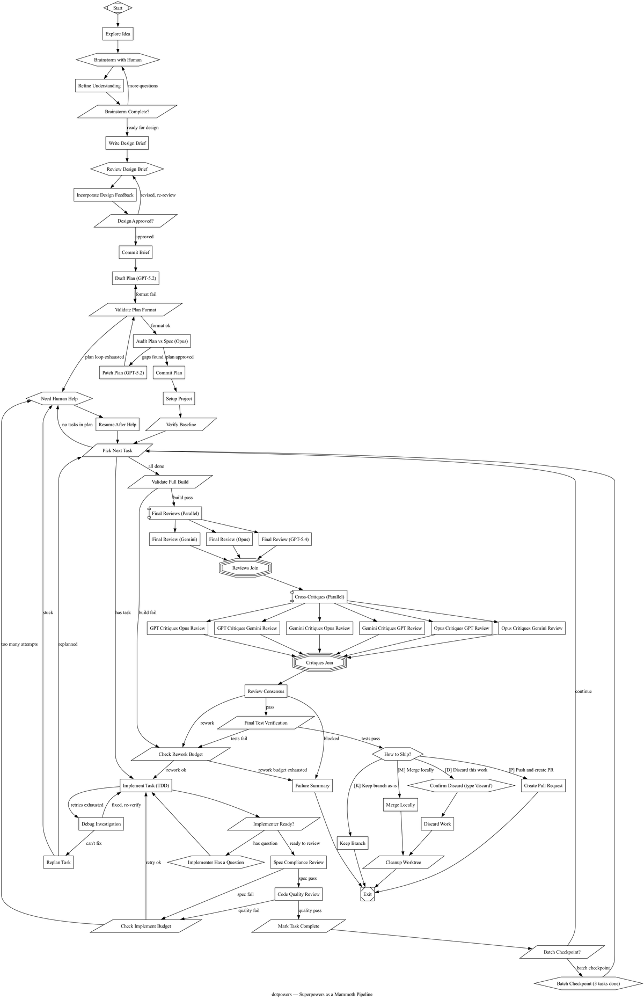
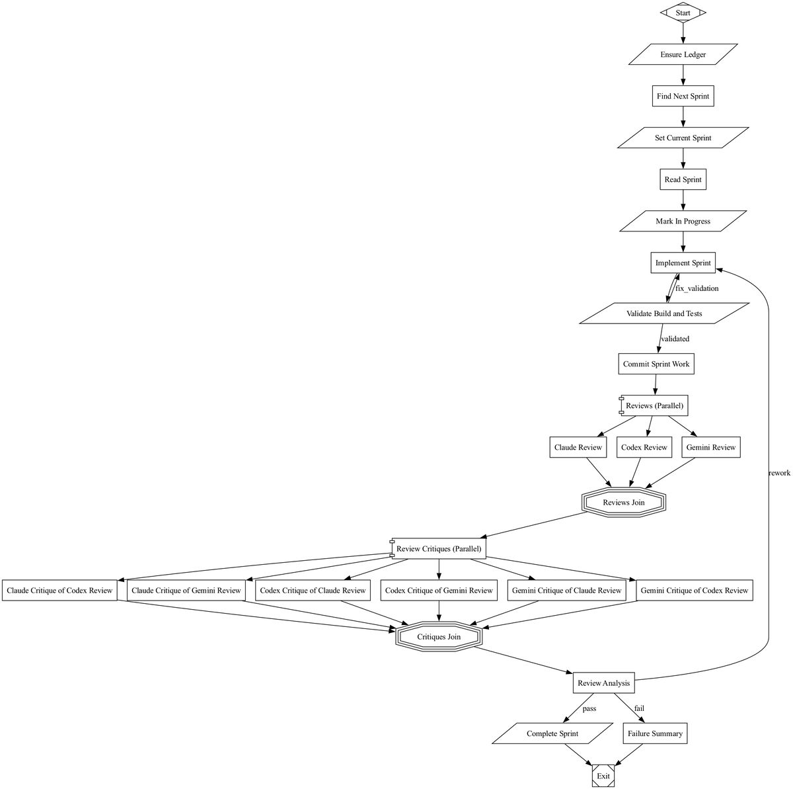
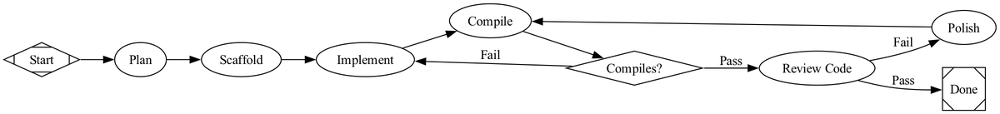

# Report 27 — Dotfile Pipelines as Product

**Themes:** attractor convergence · DOT pipelines as durable artifact · methodology payload · multi-model review · conformance benchmark
**Date:** 2026-05-16
**Author:** Subagent C (manual-drain dispatch, Cluster C)
**Status:** ✅ FULL — all four primary sources drained from manual `research/manual/` capture on 2026-05-16
**Source count:** 4 (Dark Factory essay MHTML + 3 embedded DOT-graph renders; `dotpowers.dot` blob; `danshapiro/kilroy` landing page; `strongdm/attractorbench` landing page)

## Lead question

If the *attractor* convergence claim is real — four independent runner implementations on the same three-layer architecture — what is the actual product being shipped? The runner code, which keeps getting rewritten? Or the **`.dot` pipeline file**, which encodes the methodology and runs on any compliant engine? This report makes the second case, refines it against the post-Feb-2026 ecosystem evidence (Tracker library extraction, dotpowers as a portable methodology payload, the `.dip`/`.dipx` succession to `.dot`, Kilroy's Platform reframe), and treats AttractorBench as the conformance surface that lets *blueprints* — not engines — become first-class shippable artifacts.

---

## 1. Thesis

The durable artifact in a dark-factory stack is not the runner. It is the pipeline file.

Engines proliferate. As of 2026-05-16 the corpus has surveyed seven of them — Kilroy (Go), Forge (Rust), brynary/attractor (TypeScript, archived), Fabro (Rust), Mammoth (Go, now a Tracker-frontend), Smasher (Rust), Tracker (Go) — plus a Python variant (Amol Kabe) that drops the DOT layer altogether. Four of the seven were drained in [`02-attractor-implementations`](followup/02-attractor-implementations.md); the Round-4 addendum to that followup added three more. The runners differ in language, sandbox model, persistence substrate, and front-end (CLI / TUI / server + React UI / chat-platform-federated). The pipelines they execute, however, **survive porting intact**: standard Graphviz DOT, the eight canonical node shapes, the same CSS-like model stylesheet, the same `goal_gate`/`retry_target` semantics, the same `prompt.md`/`response.md`/`status.json` per-node contract.

That is the leverage point. A DOT pipeline file is a self-contained, version-controllable, portable description of *what the factory builds and how*. It is not a script. It is a process definition — closer in spirit to a BPMN diagram than to a Makefile. Harper Reed's "Dark Factory Is a .dot file" essay (Mar 9, 2026, 2389 Research) makes the argument bluntly: *"The factory code is dorodango — polish it, throw it away, rebuild from spec. The pipeline files are the durable artifact. They're the part worth sharing."*

The companion observation is asymmetry. Reed notes that the engines are open-sourcing themselves at a healthy clip, but the pipelines — the actual blueprints — *are not*. Everyone is shipping the factory and hiding what they build with it. *"The factory implementations are open source and multiplying. Great. But the pipeline files — the DOT graphs that describe what the factory actually builds — are mostly private. Everyone's sharing the engine and hiding the blueprints."* This is the load-bearing claim of the report. If pipelines are the product, then the absence of a market for pipelines is the absence of a market for the methodology layer.

**Stretch claim (flagged for cross-corpus alignment).** `.dot` is in the process of being supplanted by `.dip` (the Dippin language) in the 2389 ecosystem — Tracker's primary pipeline format is now `.dip`, with `.dot` deprecated (`--format dot` emits a deprecation warning) and `.dipx` content-addressed bundles (SHA-256 over manifest) layered on top. This contradicts the framing in [`07-dark-factory`](07-dark-factory.md) (which still treats the DOT/Graphviz substrate as canonical) and in the headline of Reed's own essay. *But the underlying thesis — pipeline-as-deliverable, runner-agnostic, content-addressable, ship-the-blueprint — strengthens rather than weakens under the migration.* `.dipx` is in fact a more honest answer to the "what is the version-control unit?" question than a raw `.dot` blob: it is content-addressed, manifested, and explicitly designed to be the unit of distribution. The migration evidence sits in [`02-attractor-implementations`](followup/02-attractor-implementations.md) §11.1; this report inherits it.

Two corollaries follow from the thesis.

1. **The runner-vs-blueprint split is the same split as ML-framework-vs-model.** PyTorch is commodity infrastructure; the trained model is the asset. Tracker / Mammoth / Smasher / Kilroy are PyTorch-shaped. dotpowers — a 1,300-line DOT file that encodes the "superpowers" methodology — is the model-shaped artifact.

2. **The methodology layer needs an eval surface.** If pipelines are the product, then "is this a good pipeline?" must be answerable. AttractorBench (treated in §5) is the corpus's first behavioral benchmark for that question, even though its current focus is the *runner* tier. Once a blueprint registry exists, a blueprint-level benchmark is the next obvious tier.

This report assembles the evidence in five movements: §2 the four-independent-implementation convergence as Reed presents it; §3 the worked example (dotpowers.dot — six-phase pipeline, four-model assignment, hard loop caps); §4 Kilroy as the canonical reference implementation evolving past Level 5 into a "platform"; §5 AttractorBench as the conformance surface; §6 cross-corpus impact (the three flags); §7 open questions; §8 sources.

---

## 2. Convergence evidence from the Dark Factory essay

The essay is short (8-minute read, ~1,800 words) and structured as a four-move argument: (a) the convergence happened, here are the four implementations; (b) the explanation is *dorodango* — Vincent's polish-mud-throw-it-away mental model; (c) the engines are commodity, the pipelines are the product; (d) here are three concrete pipeline styles, share yours. The diagram inventory follows in §2.4.

### 2.1 The attractor pattern — Reed's framing

> *"So StrongDM published a natural language spec for building a coding agent pipeline runner. Dan Shapiro built one. We built three. All of them — independently, in two languages, by different people with different goals — landed on the same three-layer architecture. I keep coming back to that. Not the code. The convergence. That's the weird part."*

The four implementations Reed names are **Kilroy** (Go, Shapiro), **Mammoth** (Go), **Smasher** (Rust), and **Tracker** (Go) — the latter three from 2389 Research. He attributes the *spec* — `attractor-spec.md`, three natural-language specs of about 5,700 lines total — to StrongDM's February 2026 open-source release, and explicitly invokes the dynamical-systems sense of *attractor*: *"a state a system tends to evolve toward. StrongDM's bet is that these specs describe a design so natural for the problem that independent implementations will converge on it. Bold claim! But uh, that's exactly what happened."*

The three layers, in Reed's words: an **LLM client** (unified OpenAI/Anthropic/Gemini provider adapters with streaming, retries, provider quirks), an **agent loop** (steering rules, loop detection, subagents, tool dispatch), and a **pipeline engine** (DOT parser, graph engine, node handlers, checkpointing, human gates). The essay reproduces this as a four-column comparison table (Kilroy/Mammoth/Smasher/Tracker × Layer 1/2/3), which the followup/02 round-4 addendum has since extended to include Forge, Fabro, the Amol Kabe variant, Coven, and dotpowers-as-payload.

### 2.2 The dorodango mental model — why three were built without coordination

The essay's middle move is the explanation for the convergence: **codegen software is disposable**. Reed cites Jesse Vincent's blog post on *dorodango* (the Japanese art of polishing a mud ball into a high-gloss sphere) — explicitly noting that the Wikipedia "mud ball" disambiguation redirects to the "Big Ball of Mud" software anti-pattern and that "Jesse leaned into it." Reed's gloss:

> *"His point: codegen software is disposable. You spec it carefully, hand it to an agent, polish what comes out. When the result is fundamentally wrong, you don't debug your way to salvation. You throw it away and rebuild from the spec. He described waking up to find an agent's end-to-end test recording named e2e-test-full-run-33.mp4. Runs 1 through 32 were the agent working through problems one by one. Run 33 worked. Pretty cool."*

The operational corollary is the part this report builds on:

> *"This is the mental model that let us build three attractor implementations without thinking twice about it. Software is cheap now. Specs are the expensive part."*

If software is cheap and specs are expensive, then the version-control / IP / market-discipline focus belongs on the spec — and in a pipelined factory, the spec *is* the DOT graph plus the per-node prompts.

### 2.3 The "engines open, blueprints private" asymmetry

Reed's third move is the pivot from convergence to product. The runners are open-sourcing themselves (MIT for Kilroy, MIT for the 2389 family, Apache-2.0 for AttractorBench, Apache-or-similar for Forge and Fabro). But the actual pipeline files — *the part the factory runs* — are not being published.

> *"Ok so here's the thing that's been bugging me. The factory implementations are open source and multiplying. Great. But the pipeline files — the DOT graphs that describe what the factory actually builds — are mostly private. Everyone's sharing the engine and hiding the blueprints."*

> *"A pipeline DOT file is a reusable blueprint. It describes the workflow: which steps need an LLM, which need a human gate, where to fork into parallel branches, what verification commands to run before proceeding. Standard Graphviz syntax. Nothing proprietary. And honestly? The pipelines are way more interesting than the runners."*

He closes with an exhortation: *"Share your dot files. … What does your 'audit a Rails app' pipeline look like? Your 'onboard a new engineer' graph? Your 'ship a mobile release' DAG? Drop your .dot files in a gist, post them on your blog, open a PR somewhere."*

The closing tagline is the line we cite for the report's title: *"The question isn't how to build the factory anymore. It's what to build with it."*

### 2.4 The three diagrams the essay teaches with

The essay embeds nine images; four are decorative product hero shots; one is a header image; and three are the technically substantive payload: rendered DOT graphs for `dotpowers`, `sprint-exec`, and `build-pong`. (A fourth pipeline, the vulnerability analyzer, is shown only as inline DOT source, not a render.) Each tells the reader something different about the *shape* of a real-world DOT pipeline, and the choice of which three to show is itself an argument: a maximalist methodology pipeline, a hybrid deterministic-plus-LLM pipeline, and a minimalist linear pipeline. The corpus needs all three to make Reed's "two styles emerging" pivot legible.

**Diagram 1 — `dotpowers` (the full software development lifecycle as a 53-node DAG).** Saved here as `figures/27-dotfile-pipelines/dotpowers-dag.png` (303 KB, the largest of the three by a factor of ~2). The graph is rendered top-to-bottom in the essay's captured form; the entry point is a single Start (Mdiamond) at the top, flowing down through ~10 nodes per phase. Seven phases are visually distinguishable as horizontal bands: brainstorm-with-human (hexagon nodes for human gates interleaved with box nodes for the brainstorm agent); design-brief (Mdiamond approval gate); plan/audit (a draft-audit-patch loop with retry counter); setup; per-task TDD implement (a sub-loop containing Implement Task → Spec Compliance Review → Code Quality Review → Mark Task Complete, with a budget-check parallelogram); multi-model review fan-out and fan-in (three review boxes flowing into a Critiques Join octagon, with a Review Analysis diamond branching to pass/fail); and ship (parallelogram tool nodes for merge/PR/discard, ending in an Msquare Exit). The visible density of the graph is itself the lesson: *a methodology this rich fits in a single DOT file*. The retry-edges (curved arrows looping backward from review to implement, from audit back to draft) are an explicit declarative encoding of a process that on a normal whiteboard would be drawn as nested loops with arrows whose semantics depend on context. In a DOT pipeline they have *types* (`retry_target=...`).



**Diagram 2 — `sprint-exec` (deterministic tool nodes mixed with LLM nodes; multi-model review fan-out with cross-critique).** Saved here as `figures/27-dotfile-pipelines/sprint-exec-dag.png` (140 KB). The graph is rendered top-to-bottom and runs linearly through a setup phase — *Start → Ensure Ledger → Find Next Sprint → Set Current Sprint → Read Sprint → Mark In Progress → Implement Sprint* — where the parallelogram shapes (Ensure Ledger, Find Next Sprint, Set Current Sprint, Mark In Progress) are tool nodes (shell commands; no LLM cost) and the box shapes (Read Sprint, Implement Sprint) are LLM nodes. From Implement Sprint, an explicit *fix_validation* curved edge loops back from *Validate Build and Tests* (parallelogram) when the build fails, and a labelled *validated* edge advances to *Commit Sprint Work* (box, LLM-mediated commit message generation). After commit, the graph fans out into a **parallel review block**: Reviews (Parallel) splits into three boxes — Claude Review, Codex Review, Gemini Review — which all converge on a Reviews Join double-octagon (Attractor's canonical fan-in shape). The reviews then **cross-critique**: a Review Critiques (Parallel) double-rectangle splits into six boxes (Claude Critique of Codex Review, Claude Critique of Gemini Review, Codex Critique of Claude Review, Codex Critique of Gemini Review, Gemini Critique of Claude Review, Gemini Critique of Codex Review), which all flow into a Critiques Join double-octagon, then into a Review Analysis box that branches via a *pass*/*fail* diamond to Complete Sprint or Failure Summary, both terminating at Exit. There is a single backward *rework* curved edge from Review Analysis back to Implement Sprint — the only loop in the graph. The teaching value: the *6-way cross-critique* is a small adversarial-review tournament made entirely of DOT edges; the deterministic / LLM mix is visible at a glance via shape (parallelogram = tool = $0 cost / box = LLM = real cost); and the single rework loop is the only place the pipeline can spend extra tokens.



**Diagram 3 — `build-pong` (linear Plan → Scaffold → Implement → Compile → Review → Polish loop).** Saved here as `figures/27-dotfile-pipelines/build-pong-dag.png` (45 KB). The graph is rendered left-to-right (`rankdir=LR` is the load-bearing graph attribute here). All nodes are ellipses (box label-only shape) — *every* node is an LLM call; there are no tool/parallelogram nodes. The flow is Start (Mdiamond) → Plan → Scaffold → Implement → Compile → Compiles? (diamond) → Review Code or back to Implement, then Review Code → Done (Msquare) on Pass or Polish on Fail, then Polish → Compile (re-entry into the compile loop). The teaching value is by contrast with `sprint-exec`: this is the pure-LLM end of the design space. *Every node is an LLM call. No token-free deterministic verification. Slow, expensive, and nondeterministic. Useful for "build me a Pong game," useless for repeat-once-a-day production pipelines.*



Reed's commentary on the contrast is explicit: *"We've come to prefer the first style. Tool nodes with shell commands for anything that can be deterministic. LLM nodes only where you actually need reasoning. The vulnerability analyzer runs in seconds and costs nothing. The Pong builder might take 20 minutes and $15 in API calls, and you won't get the same game twice. Guess which one I want to run at 2am from my phone."*

The synthesis is **hybrid pipelines** like `sprint-exec`: deterministic tool nodes for setup, validation, and deployment plumbing; LLM nodes only at the points where reasoning is required; multi-model fan-out only where the cost of a wrong decision merits triple-spending. The argument the three diagrams jointly make is that DOT-as-pipeline-substrate is *expressive enough* to support all three styles — and that the substrate itself doesn't dictate a style. The style is a per-pipeline choice the methodology author is shipping.

### 2.5 Related referents the essay drops without dwelling

Reed name-drops three things the corpus has already drained or will drain:

- **Dan Shapiro's "Five Levels"** post (drained at [`01-shapiro-five-levels`](followup/01-shapiro-five-levels.md)). Reed cites Level 0 = vi / Level 2 = pair-program / Level 4 = "you've become a PM, you write specs, argue about specs, leave for 12 hours, check if the tests pass" / Level 5 = dark factory, lights off, nobody reviews.
- **Fanuc Robotics 2003** as the dark-factory etymology. The corpus has this in report 07 already.
- **AttractorBench tiers** — Reed names "smoke test, then a unified LLM SDK, then a coding agent loop, then the full pipeline runner. Language-agnostic. Agents pick their own implementation language. The only contract is make build, make test, and a conformance suite against a mock LLM server. No real API calls. Deterministic verification. Cost-aware scoring." This is the §5 material.

The essay's own URL is https://2389.ai/posts/the-dark-factory-is-a-dot-file/ (referenced from the kept MHTML `Snapshot-Content-Location` header).

---

## 3. `dotpowers.dot` as worked example

dotpowers is the corpus's first concrete instance of a DOT graph being shipped *as the product*, runner-agnostic, encoded as a portable methodology payload. The repository is `https://github.com/2389-research/dotpowers`; the canonical blob is `dotpowers.dot` (114 KB, ~1,300 lines, 48 commits, 1 tag). This section drains the substantive structure of the file — graph header, four-model assignment, a representative node-attribute block, the six-phase pipeline, and the loop-cap discipline. The blob has been processed verbatim from `research/manual/dotpowers_dotpowers.dot at main · 2389-research_dotpowers.txt`.

### 3.1 Graph header — the operating envelope

The DOT header is the file's operating envelope. Verbatim:

```dot
digraph dotpowers {
 graph [
  label="dotpowers — Superpowers as a Mammoth Pipeline",
  goal="Given a project idea or spec, brainstorm the design with the human, plan,
        implement with TDD, review via multi-model consensus, and ship working software.",
  rankdir=LR,
  default_max_retry=2,
  retry_target="ImplementTask",
  fallback_retry_target="ExploreIdea",
  default_fidelity="summary:high",
  model_stylesheet="
   * { llm_model: claude-opus-4-6; llm_provider: anthropic; reasoning_effort: high; }
   .implement { llm_model: gpt-5.4; llm_provider: openai; reasoning_effort: high; }
   .draft { llm_model: gpt-5.2; llm_provider: openai; reasoning_effort: high; }
   .opinion { llm_model: gemini-3.5-flash; llm_provider: gemini; reasoning_effort: high; }
  "
 ];
```

Five load-bearing decisions are encoded inline:

1. **`goal` is prose.** The pipeline's intent is itself a natural-language requirement at the graph level. It is not a comment; it is a typed graph attribute that the runner can present to the human at start-of-run and that retrospective-audit tools can grep against.
2. **`rankdir=LR`** lays the graph out left-to-right when rendered with Graphviz, which is the methodology-pipeline rendering convention (a long horizontal flow). Compare with `sprint-exec` (top-to-bottom) — the choice is editorial, not semantic.
3. **`default_max_retry=2` plus `retry_target="ImplementTask"` and `fallback_retry_target="ExploreIdea"`** establish the *default* retry semantics at the graph level: when an unspecified node fails, retry the implement loop twice, then fall back to brainstorm. Individual nodes override per-node.
4. **`default_fidelity="summary:high"`** sets the context-passing fidelity floor for downstream nodes (full context retention is the default, with high-detail summarization rather than truncation).
5. **`model_stylesheet`** is the CSS-cascade-shaped model assignment: a default (Opus 4.6 for all nodes), then class-scoped overrides (`.implement` → GPT-5.4 for code-writing TDD cycles; `.draft` → GPT-5.2 for plan drafting; `.opinion` → Gemini 3.5 Flash for third-opinion review). Audit, consensus, and debugging *inherit* the default Opus 4.6 because they carry no class. The four-model assignment is then a property of which nodes wear which classes, not a property of the runner.

The four-model logic is the methodology layer's most legible decision: **Opus audits, GPT-5.4 writes code under TDD, GPT-5.2 drafts plans, Gemini 3.5 Flash provides a structurally different third opinion**. Three families (Anthropic / OpenAI / Google), reasoning_effort=high across the board, with classes deciding routing. This is a hard claim about which model is best at which sub-task in May 2026 baked into a DOT graph — and it is portable: change the stylesheet, change the assignment, ship the new blueprint.

### 3.2 The six-phase pipeline

The dotpowers README and the file's section-divider comments identify six phases (the essay says seven; the README and the actual `// PHASE N` comments in the file resolve to six, with the resume/archive bootstrap as a pre-Phase-0):

0. **Pre-phase — Resume / Archive**: `CheckExistingPlans` (parallelogram tool) checks for an in-progress `docs/plans/plan.md`; on `resume` it skips the brainstorm phases; on `fresh` it archives old plans to a timestamped directory and proceeds.
1. **Phase 0 — Explore Idea / Brainstorm**: a `ExploreIdea` box (LLM, Opus default) reads the working directory exhaustively, identifies the single most important open question, formats it as multiple choice with a recommended answer, and writes to `docs/plans/brainstorm.md`. A `HumanBrainstorm` hexagon (`mode="freeform"`) accepts the human's answer. `RefineUnderstanding` iterates; when the LLM judges the brainstorm complete, it writes `READY_FOR_DESIGN`.
2. **Phase 1 — Write Design Brief**: a `WriteDesignBrief` box (LLM) writes the brief; `ApproveDesignBrief` is a human-gate hexagon. On rejection, `DesignFeedback` (hexagon) captures the critique and `IncorporateDesignFeedback` rewrites; on approval, `CommitBrief` (`class="implement"` → GPT-5.4) commits the brief to git.
3. **Phase 2 — Plan with TDD audit**: `DraftPlan` (`class="draft"` → GPT-5.2, `goal_gate=true`, `max_retries=3`) drafts a TDD plan. `ValidatePlanFormat` (parallelogram, zero cost) checks the format. `AuditPlanVsSpec` (Opus default, `goal_gate=true`) audits the plan against the brief. On failure, `PatchPlan` (`class="draft"`, `max_retries=2`) revises. **Plan validation iterates up to 5 times** (the audit→patch→audit loop carries an explicit budget counter).
4. **Phase 3 — Setup**: `CommitPlan` and `SetupProject` (both `class="implement"` → GPT-5.4) lay out the feature branch and project skeleton. `VerifyBaseline` (parallelogram) confirms the project builds and tests pass before any implementation.
5. **Phase 4 — Implement Tasks (TDD)**: the heart of the pipeline. `PickNextTask` (parallelogram) reads `docs/plans/plan.md`, picks the first unchecked `- [ ] task-N`, writes its ID to `docs/plans/current_task_id.txt`, and emits a routing marker. `ImplementTask` (`class="implement"` → GPT-5.4, `goal_gate=true`, `max_retries=2`) runs strict TDD with an explicit "IRON LAW: NO PRODUCTION CODE WITHOUT A FAILING TEST FIRST" prompt. `SpecReview` (Opus default — spec compliance check by the audit model) verifies. `QualityReview` (`class="implement"` → GPT-5.4 — quality check by the implement model after spec passes) double-checks. `CheckImplementBudget` (parallelogram) increments a per-task counter; on >5 it emits `budget_exhausted`. **Per-task review→re-implement loop budget = 5**; on exhaustion, the pipeline escalates to a `DebugInvestigation` Opus root-cause node, then to a human gate. A `batch human checkpoint` mechanism (mentioned in the README — *"batch human checkpoint every 3 completed tasks"*) pauses for human review at the end of every third successful task; this is the pipeline's headfake against "kept the human in the loop on a per-task cadence so cost-of-attention scales with cost-of-mistake."
6. **Phase 5 — Multi-Model Review with Cross-Critique**: three independent reviews (Opus, GPT-5.4, Gemini-3.5-flash), then six pairwise cross-critiques (each model critiques each other's review), then an Opus consensus call. Identical in shape to the `sprint-exec` review block §2.4 walked through. **Final-review rework cycles capped at 2** (after two full rework cycles the pipeline escalates to a human ship-choice gate regardless of consensus).
7. **Phase 6 — Ship**: a human-gate hexagon offers four choices (merge to main, open a PR, keep the branch, discard). Parallelogram tool nodes execute the chosen action.

### 3.3 A representative node-attribute block — the `ImplementTask` node

To make the prompt-encoding concrete, here is the load-bearing `ImplementTask` node (lines 926–1026 of the blob, abridged to the structurally significant fragments — the full prompt is ~95 lines):

```dot
ImplementTask [
  shape=box,
  class="implement",                     // → GPT-5.4 via model_stylesheet
  label="Implement Task (TDD)",
  goal_gate=true,
  retry_target="ImplementTask",
  max_retries=2,
  fidelity="full",                       // overrides graph default
  prompt="You are working in `run.working_dir`.

## Role
You are a disciplined software engineer implementing a single task using strict TDD.

## IRON LAW: NO PRODUCTION CODE WITHOUT A FAILING TEST FIRST
Write code before the test? Delete it. Start over. No exceptions.

## Before Starting — Check for Ambiguity
If you have ANY questions about the task spec that would change your implementation:
1. Write your question to docs/plans/implementer-status.txt
   (NOT the word READY_TO_IMPLEMENT)
2. End your response explaining the question
3. outcome=success (the question will be routed to the human)

If the spec is clear enough to proceed:
1. Write READY_TO_IMPLEMENT to docs/plans/implementer-status.txt
2. Continue with implementation below

## Process — RED GREEN REFACTOR
### RED — Write Failing Test
…
### GREEN — Write Minimal Implementation
…
### REFACTOR (only after green)
…
### COMMIT
…

## VERIFICATION GATE
Before claiming success, you MUST have fresh evidence from THIS session:
- Run the test suite. Read output. Check exit codes. Count failures. THEN claim.
- Do NOT say 'should work', 'probably passes', 'seems correct'.
- If you haven't run the tests in THIS session, you cannot claim they pass.
"
];
```

Two methodology-layer claims are baked into this node beyond the obvious "implement under TDD."

First, **the human-loop escape valve is encoded as a routing marker, not a separate node.** The prompt asks the implementer to *write a question* to a state file when ambiguous, and the *very next* tool node (`CheckImplementerReady`, a parallelogram with `tool_command="if grep -q 'READY_TO_IMPLEMENT' docs/plans/implementer-status.txt 2>/dev/null; then printf 'ready'; else printf 'has_question'; fi"`) reads that file and routes either to the implementation flow or to an `ImplementerQuestion` human-gate hexagon. The escape valve costs nothing when not used (a `grep` on a small file) and lets the LLM defer to a human via a deterministic check rather than a self-judgement.

Second, **the verification gate is in-prompt, not in-graph.** "Before claiming success, you MUST have fresh evidence from THIS session" is an anti-hallucination guard that lives at the LLM-prompt layer, not in a separate verifier node. The pipeline's *next* node will independently re-run the test suite via the SpecReview / QualityReview nodes, but the implementer's own prompt is engineered to make it cheaper to honestly admit failure than to claim a false pass. This is methodology-as-prompt-shape encoded inline.

### 3.4 The loop-cap discipline — 5 / 5 / 2

A theme across the file is the explicit declaration of every loop budget. The README enumerates the three hard caps:

| Loop | Budget | What it bounds |
|---|---|---|
| Plan validation (audit → patch → audit) | 5 iterations | Phase 2: stops infinite-revision spirals between Opus auditor and GPT-5.2 drafter. |
| Per-task review → re-implement | 5 per task | Phase 4: stops infinite review-fail → re-implement loops on a single task; escalates to human gate. |
| Final-review rework | 2 full cycles | Phase 5: stops infinite consensus-disagreement loops; escalates to human ship-choice. |

The budget is implemented via per-loop counters written to `.tracker/` paths (e.g., `.tracker/impl_count_${TASK}` for the per-task counter); on exceeding, the next tool-node check emits `budget_exhausted` and a different edge fires. Counters are gitignored. Counters reset per new run but **persist across resume**, which is the right semantics — resuming a half-finished pipeline shouldn't grant fresh budget.

The pedagogical claim is that *every loop must have a declared cap*. The dotpowers README backs this with a war story:

> *"It is not cheap. A full run hits Opus 4.6, GPT-5.4, GPT-5.2, and Gemini 3.5 Flash across dozens of nodes. If loops iterate (and they will), costs add up. **We burned 3.5M OpenAI tokens on a single bad run before adding loop limits.**"*

This is the corpus's first explicit dollars-on-the-floor figure for a runaway-loop incident. Tracker's own v0.28.2 release notes (drained in [`02-attractor-implementations`](followup/02-attractor-implementations.md) §11.4) describe a structurally identical failure mode (the `build_product` workflow spending ~10 minutes and ~39k output tokens inside the Start node before context-cancel), which suggests the budget discipline dotpowers encodes per-graph belongs *also* in the engine's defaults — at least as a `max_turns` cap on every codergen node and a graph-level budget gate. Tracker v0.19.0 onward supports declaring the latter inline (`defaults: max_total_tokens:` / `max_cost_cents:` / `max_wall_time:` in `.dip`); dotpowers achieves the former through per-node `max_retries`.

### 3.5 Batch-checkpoint-every-3-tasks — the headfake against per-task human review

The README explicitly calls out a *batched* human-review cadence:

> *"You approve the design brief. You review batch checkpoints every 3 completed tasks. You choose how to ship. If the implementer has questions, it pauses and asks. The pipeline runs headless between those gates."*

This is the dark-factory pattern made concrete in a DOT graph. Three completed tasks ≈ one meaningful unit of progress; per-task human review would defeat the headless-pipeline value proposition; no human review at all would invite the failure modes the multi-model fan-out is partly there to detect. The per-three-task batching is a methodology-layer decision (not an engine constraint) and it lives in the DOT file. A different methodology author shipping a different pipeline could pick a different cadence — every task, every 10, only at phase boundaries — by editing the file. The methodology becomes a configuration parameter of the substrate.

---

## 4. Kilroy as the canonical reference implementation evolving past "Level 5"

If dotpowers is the worked-example pipeline, Kilroy (https://github.com/danshapiro/kilroy) is the worked-example *runner*. As of `b55fb0f` (Apr 27, 2026): **944 commits, 197 stars, 49 forks, Go, MIT**, latest commit *"feat: expose KILROY_PREDECESSOR_NODE/OUTCOME env to handlers (#13) (#88)"* by mattleaverton. Kilroy was already drained in [`02-attractor-implementations`](followup/02-attractor-implementations.md) §1–§5 (canonical-DOT lineage, full eight node shapes, CXDB, `attractor ingest` skill, git-worktree-per-run, AGENTS.md "Prime Directive"). This section drains the **post-Feb-2026 evolution signals** the landing-page recapture surfaces — signals that show Kilroy moving from "the canonical Attractor reference implementation" to *"a layered platform"*, which is the natural shape of what an engine becomes once the methodology layer (the DOT file) is recognised as the product.

### 4.1 Platform reframe (PR #81, Apr 17 2026)

Three top-level files — `demo/`, `AGENTS.md`, `go.mod`, `go.sum` — were touched in PR #81 with the commit message *"Platform reframe: layered engine, tmux agents, workflow packages"*. The directory layout reframes Kilroy from a single CLI runner into a stack:

- **Layered engine.** Implied: the `internal/` Go package now exposes a substrate API rather than an in-process invocation. Workflows can be packaged and shipped independently.
- **`tmux` agents.** Long-lived agent sessions are run inside tmux panes (rather than ephemeral subprocesses), which is a load-bearing decision for the Platform reframe — agents persist across pipeline steps and across resumes, which matches the "agents as services" architecture more than "agents as one-shot LLM calls." The workflow packages substrate sits on top.
- **Workflow packages.** A `workflows/` top-level directory now exists alongside `cmd/kilroy`, `internal`, `skills`, `.agents/skills`, etc. — the same "ship the methodology as a package" move that dotpowers makes via a DOT blob, except Kilroy makes it via a directory layout. The `workflows/` directory's most recent commit is *"fix: validator-time guard on inbound-to-terminal edges (#3) (#85)"* (Apr 27, 2026), which shows active iteration on workflow packaging semantics.

The reframe is dated *one month* before this report (Apr 17, 2026 → May 16, 2026), which means Kilroy is in the middle of the transition, not done with it. The fact that the *engine* directories (`cmd/kilroy`, `internal`) and the *workflow* directory (`workflows/`) have *more recent commits than the engine alone* suggests the methodology layer is now the active development front.

### 4.2 `KILROY_PREDECESSOR_NODE` / `KILROY_PREDECESSOR_OUTCOME` env handed to handlers

The latest top-level commit (Apr 27, 2026) is *"feat: expose KILROY_PREDECESSOR_NODE/OUTCOME env to handlers (#13) (#88)"*. The naming is precise: a handler — Kilroy's term for a Go function bound to a node shape — now receives, as environment variables in its execution context, *which node fired the inbound edge* (`KILROY_PREDECESSOR_NODE`) and *what outcome that node emitted* (`KILROY_PREDECESSOR_OUTCOME`). This is the canonical answer to "how does a node know which edge it came in on?" without parsing the run database.

Tracker solves the same problem with declarative typed routing channels — `marker_grep:` (a node-level regex that populates `ctx.tool_marker`) and `_TRACKER_ROUTE=<value>` (a reserved stdout sentinel that populates `ctx.tool_route`) — both added in Tracker v0.28.0 (May 13, 2026), 14 days before the Kilroy commit. Two of the most active Attractor runners are *independently arriving at the same engineering decision* (predecessor-context injection as a first-class API) within two weeks of each other. The convergence story is not just at the orchestration-primitive layer Reed identified in March — it has propagated into the engineering-detail layer.

### 4.3 Run-completion events to `progress.ndjson`

`docs/` carries the commit *"feat: emit run_completed/run_failed terminal events in progress.ndjson"* (3 weeks ago, Apr 27, 2026). The choice of *NDJSON* (newline-delimited JSON) as the event-stream format is the corpus's third independent landing on the same substrate:

- Kilroy: `progress.ndjson`.
- Tracker: `activity.jsonl` (and `tracker.NewNDJSONWriter` as the public Go API).
- Forge: JSONL event-streaming contract (per [`02-attractor-implementations`](followup/02-attractor-implementations.md) §5).

NDJSON is a thinner substrate than CXDB (Kilroy's prior durable typed-event database) and replaces some — but not all — of the CXDB-event-replay surface. Reading run progress no longer requires reading CXDB; reading run state for resume still does. This is methodology-friendly: a pipeline author who wants to integrate with `progress.ndjson` does not need a Kilroy SDK.

### 4.4 Triple-skill substrate — `.agents/skills/`, `.claude/`, `.gemini/skills/`

The repository ships three skill directories at the top level, one per provider:

- `.agents/skills/` — provider-agnostic skill catalog (most recent commit: *"skills: add starting-a-project bootstrap skill"*, Mar 2, 2026).
- `.claude/` — Claude-specific skill catalog (same commit message, same date — implying co-installed).
- `.gemini/skills/` — Gemini-specific skill catalog (commit *"chore: add agent skill shims"*, Feb 7, 2026).

The layout mirrors the provider-aligned profile pattern (codex / claude / gemini CLIs as separate backends) but at the *skill layer* rather than the *binary layer*. The methodology-layer implication: a pipeline that selects different models per node (via `model_stylesheet` cascade) also routes to different skill catalogues per node, so a `.implement` node running GPT-5.4 reaches into `.agents/skills/` or a future `.codex/`, while a `.opinion` node running Gemini reaches into `.gemini/skills/`. Skills as per-provider library shards.

The two `SKILL.md`s named in the README — `skills/using-kilroy/SKILL.md` (operational workflow for ingest/validate/run/resume) and `skills/create-dotfile/SKILL.md` (requirements-to-DOT generation instructions) — are themselves the methodology-layer interface. `create-dotfile` is the *front door* through which a natural-language requirement becomes a DOT pipeline. The interface for *blueprint authorship* is itself a skill.

### 4.5 Cross-reference to followup/02

[`02-attractor-implementations`](followup/02-attractor-implementations.md) §11.7 already covers Kilroy's post-Feb-2026 evolution in similar detail; this report does not duplicate. The cross-reference annotation in §11.7 should now point back to this report (§4 here) for the *methodology-layer* implications (workflow packaging, blueprint authorship via skills, the pipeline-as-product framing); §11.7 remains the canonical *runner-implementation* coverage. The cross-reference is added in the followup/02 update (see Deliverable §2 of this report's commit).

---

## 5. AttractorBench — the conformance suite

The third primary source in this cluster is **`strongdm/attractorbench`** (https://github.com/strongdm/attractorbench): *"NLSpec instruction-following benchmark for https://factory.strongdm.ai/products/attractor"*, Apache-2.0, 17 stars, 8 forks, current head commit `cb5797e` (Feb 26, 2026). The README's framing is *"Benchmark for measuring how well coding agents implement systems from natural language specifications."*

### 5.1 Why this matters for the pipeline-as-product thesis

Reed's "engines open / blueprints private" asymmetry leaves a gap: *if pipelines are the product, how does anyone know whether a pipeline is good?* The runner-tier benchmark is a half-answer (it measures whether an *engine* can be built from spec), but it is the right shape — natural-language input, deterministic verifier, cost-aware scoring, language-agnostic — for a future *blueprint* tier. AttractorBench's existence as the corpus's only behavioural NLSpec benchmark *for the runner tier* establishes a substrate the methodology-layer market can plug into. This report flags it as the eval surface that lets us treat pipeline blueprints as a product.

### 5.2 What AttractorBench measures

The README's "Key properties" enumeration:

- **Spec-following ability.** *"Given a detailed NLSpec (natural language specification), can the agent produce a working system that satisfies the Definition of Done (DoD) checklist?"*
- **Scoring is granular.** Each tier has multiple conformance tests grouped by DoD section, so failures localise: *"it nailed the provider adapters but botched streaming and completely missed structured output."*
- **Language-agnostic.** *"Agents choose their own implementation language. The only contract is `make build`, `make test`, and `./bin/conformance <subcommand>`."*
- **Deterministic verifier.** A mock LLM server returns canned responses; no real API calls. Agents can still be non-deterministic.
- **Weighted composite score.** Main task: 5% build + 5% self-test + 30% each for T1/T2/T3 conformance. Single-tier: 10% build + 10% self-test + 80% conformance.
- **Cost-aware.** *"Track tokens and dollars per unit of compliance alongside raw scores."*

The cost-aware property is the one this report cares about most: a benchmark that scores *only* spec-conformance would push toward maximalist pipelines (the Pong-builder shape — every node an LLM call); one that scores conformance *per dollar* pushes toward hybrid pipelines (the sprint-exec shape — tool nodes for everything deterministic). The benchmark's incentive structure is therefore aligned with Reed's own preference for the deterministic-where-possible style.

### 5.3 Tier structure

Four tiers, summarised verbatim from the README:

| Tier | Name | Spec Lines | Conformance Tests | DoD Items | Coverage | Agent Timeout | Difficulty |
|---|---|---|---|---|---|---|---|
| 0 | Smoke Test | ~30 | 7 | 6 | 100% | 5 min | Easy |
| 1 | Unified LLM SDK | ~2,150 | 35 | 115 | 30% | 2 hours | Hard |
| 2 | Coding Agent Loop | ~1,450 | 20 | 104 | 19% | 2 hours | Hard |
| 3 | Attractor Pipeline | ~2,080 | 28 | 98 | 29% | 2 hours | Hard |

Tier 0 validates plumbing (Harbor integration, mock server, scoring pipeline); Tier 1 is the *flagship* — a multi-provider LLM client library with streaming, tool calling, structured output, and error handling; Tiers 2 and 3 build conceptually on Tier 1. The "Coverage" column is the fraction of DoD items that the tier's conformance tests actually exercise (which is itself a methodology-layer disclosure — the bench is honest about how much of the spec it tests).

The DoD-section grouping (each tier's tests grouped by DoD section) maps directly onto the spec-driven discipline `report 25` ([`25-requirements-engineering-foundations`](25-requirements-engineering-foundations.md)) drains from INCOSE GtWR — *"verifiable" is a per-requirement property, not a per-system property, and the unit of verification is the requirement, not the system.* AttractorBench's per-DoD-section scoring is the conformance-suite shape that INCOSE recommends. Worth noting for cross-corpus alignment.

### 5.4 Current leaderboard anchor — v13, Gemini = 0.508

The repository's `LEADERBOARD.md` was most recently updated by commit *"Add v13 slate results and update Gemini best to 0.508"* (3 months ago, Feb 26, 2026 — same date as the current head). The leaderboard tracks model performance on each tier; the v13 slate (the thirteenth benchmark version since launch) currently anchors Gemini's best score at 0.508. **The README explicitly warns this is provisional**: *"NOTE (02-23-2026): We are still tuning AttractorBench and do not regard current scores/totals as valid for ranking until we complete additional burn-in runs to characterize run-to-run variability."* The number is an anchor for future drains, not a stable claim.

A separate file `RUN_LOG.md` keeps the historical run ledger (uncurated); `LEADERBOARD.md` is the curated snapshot. The runbook for the manual curation lives at `docs/runbook/leaderboard.md`. The README explains the curation rationale: *"Both files are manually curated; see docs/runbook/leaderboard.md for the update process."* — a deliberate decision against auto-publishing scores, because deterministic-verifier benchmarks are still vulnerable to *eval contamination* (Tier 1's conformance tests and scoring harness are *intentionally excluded from the repo* and must be generated locally via `uv run attractorbench generate --output-dir tasks` to avoid agents training on the test set).

### 5.5 `AGENTS.md` runbook and `specs/` corpus

The repository ships an `AGENTS.md` (top-level, latest commit *"Add leaderboard curation runbook, consolidate update docs"* Feb 26, 2026) and a `specs/` directory (latest commit *"Rename full-stack to main and drop tier0 from headline scores"* Feb 26, 2026). The `AGENTS.md` is the per-repo agent-instructions file; the `specs/` directory holds the canonical NLSpec source-of-truth for each tier (Tier 1 = the LLM-client spec, etc.). The conformance tests and mock server are *generated* from `src/attractorbench/adapter.py` against those specs — which means the specs themselves are the durable artifact and the tests are derived.

This is *the same shape as dotpowers' methodology-as-DOT*. AttractorBench's spec-as-source-of-truth (`specs/`) and conformance-as-derived (`tasks/` regenerated) maps one-to-one onto dotpowers' DOT-as-source-of-truth and runtime-execution-as-derived. The pattern recurs.

### 5.6 Why this becomes a future drain target

This report flags AttractorBench for fuller drain into [`07-evals-deepdive`](followup/07-evals-deepdive.md) rather than draining it exhaustively here, because §1's thesis is *pipelines as product* and AttractorBench's current focus is *runner tier* (Tier 0–3), not blueprint-tier. The eval-deepdive followup is the right home for: (a) the tier structure as a model for blueprint-tier benchmarks; (b) the cost-aware scoring formula as an incentive-structure design lesson; (c) the v13 / Gemini = 0.508 anchor for future-comparable runs; (d) the eval-contamination defence (specs in repo, tests generated locally) as a methodology-layer reproducibility pattern. The flag has been added to [`07-evals-deepdive`](followup/07-evals-deepdive.md) §5 (see Deliverable §3 of this report's commit).

---

## 6. Cross-corpus impact

Three flags for the orchestrator.

### 6.1 Refines [`07-dark-factory`](07-dark-factory.md)

Report 07 is anchored on El Kaim's April 2026 Medium essay, which lifted Reed's convergence story but presented Tracker as *"a weekend-scale implementation that still converges on the same shape"*. The 2026-05-16 corpus knows this is no longer accurate: Tracker is v0.28.2, 52 releases, 9 contributors, ~10k lines of Go, with programmatic `Audit`/`Diagnose`/`Doctor`/`Simulate` APIs and a hardening push through April–May (security audit pass v0.24.2, runaway-agent fix v0.28.2, typed routing channels v0.28.0). The "weekend-scale" framing is a stale snapshot, fully updated in [`02-attractor-implementations`](followup/02-attractor-implementations.md) §11. Report 07 should either re-anchor on the primary Reed essay (which this report drains) or carry a footnote pointing to followup/02 §11 and this report §1.

Second refinement: report 07's framing treats the DOT/Graphviz substrate as canonical and stable, but the **2389 ecosystem is migrating to `.dip` (Dippin language)**, with legacy `.dot` deprecated and content-addressed `.dipx` bundles emerging as the actual ship unit. The DOT-as-product thesis survives the migration — arguably it strengthens — but Report 07's specific framing ("the dark factory is a `.dot` file") is moving stale even though Reed's essay title still reads that way. Flag for cross-corpus alignment: when report 07 is next revised, the `.dot` → `.dip` → `.dipx` succession should be footnoted with a pointer to this report §1 and to followup/02 §11.1 (the Tracker row).

### 6.2 Supplements [`02-attractor-implementations`](followup/02-attractor-implementations.md)

The runner-implementation coverage in followup/02 is canonical; this report does not duplicate it. The two reports are complementary: followup/02 maps the *engines* (Kilroy/Forge/brynary/Fabro/Coven/Mammoth/Smasher/Tracker/Amol Kabe + dotpowers as a row); this report frames the *pipeline-as-product* thesis and treats Kilroy / dotpowers / AttractorBench as worked examples of three different layers of that thesis (the canonical engine, the canonical methodology payload, the canonical conformance suite). A short cross-reference paragraph is added to followup/02 §13 pointing to this report.

### 6.3 Opens drain target for [`07-evals-deepdive`](followup/07-evals-deepdive.md)

AttractorBench is flagged into followup/07 as a future drain target. The flag captures: tier structure, cost-aware scoring formula (weighted composite — 5/5/30/30/30 for main task), v13 Gemini = 0.508 anchor, eval-contamination defence pattern, `AGENTS.md` curation runbook, manual leaderboard curation rationale. The full drain (paper-body of `specs/` per tier, the `src/attractorbench/adapter.py` test-generation logic, the actual leaderboard contents, the cost-vs-conformance Pareto frontier across the v1–v13 history) is deferred. This is the right partition: AttractorBench belongs *primarily* to the eval-discipline followup, with a methodology-layer pointer (this report) framing why it exists.

---

## 7. Open questions / followups

1. **`.dot` deprecation timeline.** Tracker emits a deprecation warning when `--format dot` is used; `.dip` is the current pipeline format. What is the actual migration timetable for the 2389 ecosystem? Does Mammoth's DOT linter (21 rules, drained in followup/02) get retargeted to `.dip`, retired, or kept as a legacy-compatibility tool? Does Kilroy migrate? Does Smasher? The conformance contract at the engine boundary (AttractorBench Tier 3) currently uses *DOT* — does it migrate to `.dip` in v14?
2. **Whether non-2389 runners will follow.** The DOT → `.dip` migration is 2389-internal so far. Kilroy still uses DOT; Forge still uses DOT; Fabro still markets "Graphviz DOT" as a feature. If `.dip` is genuinely a richer substrate (typed routing channels, declarative `reads:`, content-addressed bundles), the migration question is whether it gets standardised back into Attractor-spec land or stays a 2389 dialect. The conformance-suite tier is the natural disambiguator: if AttractorBench Tier 3 starts accepting `.dip`, the migration is universal; if not, it stays 2389-internal.
3. **The "engines open / blueprints private" asymmetry — does AttractorBench break it?** Reed's thesis assumes the asymmetry persists. AttractorBench is open-sourced (Apache-2.0), and its `specs/` corpus is in-repo. If a blueprint-tier benchmark emerges — measuring pipelines against a curated set of natural-language methodology specs — it would *force* the publication of competing pipelines, breaking the asymmetry. This is the most leveraged followup direction: is there evidence (HN, GitHub discussions, 2389 roadmap) of a blueprint-tier in the pipeline for AttractorBench v14+?
4. **If pipelines become first-class, what is the version-control unit?** Three candidates:
   - **The `.dot` blob** (Reed's recommendation: drop it in a gist, post on a blog, open a PR somewhere).
   - **A content-addressed `.dipx` bundle** (Tracker's choice — SHA-256 over a manifest of the pipeline + assets + per-node prompts).
   - **A skill-shaped directory** (Kilroy's choice — `skills/create-dotfile/SKILL.md` is the blueprint-authorship interface; a "blueprint" is a directory with a SKILL.md and supporting files).

   The three candidates correspond to three different distribution stories: blob in a gist (lowest friction); content-addressed bundle (best reproducibility); skill directory (best integration with skill substrate). Likely the eventual answer is layered — a `.dipx` bundle that contains a `.dip` file and an optional SKILL.md — but the corpus has no evidence yet that anyone has converged on this.
5. **Methodology-layer ownership.** Who owns the canonical methodology pipelines? If dotpowers becomes "the" methodology pipeline for TDD-style codegen, does 2389 Research become the methodology vendor and the runners stay commodity? Or does each runner ship its own canonical methodology library (Kilroy's `workflows/` directory suggests yes)? This is the methodology-layer commercial-positioning question.
6. **Blueprint diversity vs. attractor-style convergence.** Reed celebrates four runner implementations *converging*. But if pipelines are the product, the *opposite* may be desirable — many divergent methodology blueprints, each optimised for a different domain (Rails audit, mobile release, security review, data-migration). The convergence claim and the "share your dot files" claim may be in tension: engines converge because the spec is shared; blueprints *should* diverge because the use case is per-shop. Worth thinking through as a methodology-layer ADR candidate.

---

## 8. Sources

| Source URL | Status | Notes |
|---|---|---|
| https://2389.ai/posts/the-dark-factory-is-a-dot-file/ | ✅ FULL | MHTML capture drained 2026-05-16 (Harper Reed, Mar 9, 2026, ~1,800 words / 8-min read); three useful DOT-graph renders extracted to `figures/27-dotfile-pipelines/` (`dotpowers-dag.png` 303 KB, `sprint-exec-dag.png` 140 KB, `build-pong-dag.png` 45 KB). Six remaining images decorative (four product hero shots, one header, one author portrait). |
| https://github.com/2389-research/dotpowers/blob/main/dotpowers.dot | ✅ FULL | GitHub blob view (114 KB, ~1,300 lines, 48 commits, 1 tag at last capture) drained 2026-05-16; 6-phase methodology pipeline (brainstorm → design brief → plan/audit → setup → TDD implement → multi-model review with cross-critique → ship); four-model assignment via CSS stylesheet (Opus 4.6 audit / GPT-5.4 implement / GPT-5.2 draft / Gemini 3.5 Flash third opinion); hard loop caps 5/5/2; batch-checkpoint-every-3-tasks convention; "burned 3.5M OpenAI tokens" anecdote. |
| https://github.com/danshapiro/kilroy | ✅ FULL | Landing-page recapture at `b55fb0f` (Apr 27, 2026) drained 2026-05-16; 944 commits / 197 stars / 49 forks / Go / MIT; latest commit `feat: expose KILROY_PREDECESSOR_NODE/OUTCOME env to handlers (#13) (#88)`; PR #81 Platform reframe (Apr 17, 2026) — layered engine, tmux agents, workflow packages; `progress.ndjson` run-completion events; triple-skill substrate (`.agents/skills/`, `.claude/`, `.gemini/skills/`); `skills/using-kilroy/SKILL.md` + `skills/create-dotfile/SKILL.md`. |
| https://github.com/strongdm/attractorbench | ✅ FULL | Landing-page recapture at `cb5797e` (Feb 26, 2026) drained 2026-05-16; Apache-2.0; 17 stars / 8 forks / 1 watching; v13 leaderboard slate (Gemini best = 0.508, flagged as provisional pending burn-in); four tiers (Smoke / Unified LLM SDK / Coding Agent Loop / Attractor Pipeline); language-agnostic; deterministic mock-LLM verifier; cost-aware weighted composite (5/5/30/30/30 main); `AGENTS.md` curation runbook; `specs/` as source-of-truth, tests generated locally to defend against eval contamination. |

Legend: ✅ FULL = primary-source content (HTML / blob / MHTML body) captured; 🟡 partial; ⏳ pending; ❌ unavailable.

---

**Cross-references active in this report:** [`07-dark-factory`](07-dark-factory.md) (refines, §6.1); [`02-attractor-implementations`](followup/02-attractor-implementations.md) (supplements / cross-cites at §13 ← →, §6.2); [`07-evals-deepdive`](followup/07-evals-deepdive.md) (drain target flag, §6.3); [`01-shapiro-five-levels`](followup/01-shapiro-five-levels.md) (Five Levels referent, §2.5); [`25-requirements-engineering-foundations`](25-requirements-engineering-foundations.md) (per-DoD-section verification, §5.3). The [`PLAN`](PLAN.md) update for this report's incorporation is left to the orchestrator per Cluster-C dispatch instructions.
