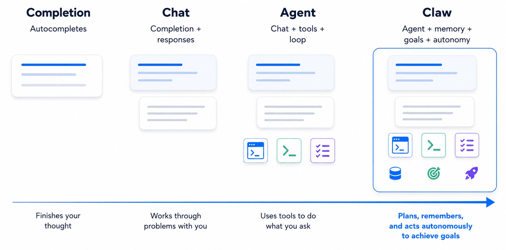

# 32 — Shapiro: Completion, Chat, Agent, Claw

**Status:** ✅ FULL
**Date:** 2026-05-16 (Cluster K manual drain)
**Primary source:** Dan Shapiro, *"Completion, Chat, Agent, Claw"* (danshapiro.com, May 13 2026) — `research/manual/Completion, Chat, Agent, Claw – Dan Shapiro's Blog.mhtml`, kept as MHTML (1 useful image preserved at `research/figures/32-shapiro-claw/ladder.png`).
**Cross-refs:** [`01-shapiro-five-levels`](followup/01-shapiro-five-levels.md) (predecessor taxonomy), [`08-security-primitives`](followup/08-security-primitives.md) (Lethal-Trifecta primary), [`05-simon-willison`](05-simon-willison.md) + [`06-hn-and-lenny`](06-hn-and-lenny.md) (OpenClaw as latent-demand exemplar), [`18-openai-codex-substrate`](18-openai-codex-substrate.md) §4 (sandbox + approval-policy as the architectural answer Shapiro arrived at empirically), [`28-schillace-sunday-letters`](28-schillace-sunday-letters.md) (gene-transfer self-improvement framing), forthcoming report **36 — Sendbird quests / token tiers** (claw-printer organizational pattern peers).

**Why a new report.** This is Shapiro's *successor* taxonomy to his canonical Five Levels (drained in `followup/01`), published roughly four months later. The Five Levels are a maturity ladder per *practitioner* — where the human sits. The Claw ladder is a *compositional* sub-taxonomy of capability types — what the agent **is**, and what it is **made of**. The two ladders share Shapiro's voice and many references (Jesse Vincent, Justin Massa, the StrongDM cohort) but answer different questions. They are not competitors; this report treats Claw as an orthogonal extension that pierces specifically Levels 4 and 5 of the Five Levels framework. The Claw post is also the densest single-source primary anchor in our corpus for two cross-cutting themes: governance / Lethal-Trifecta hardening rules (Theme 3) and the **claw-printer / one-claw-per-employee** org-design primitive (Theme 7).

---

## 1. The ladder

Shapiro's compositional four-step ladder, with verbatim subtitle definitions:

| Step | Subtitle definition | One-line role caption |
|---|---|---|
| **Completion** | "Autocompletes" | "Finishes your thought" |
| **Chat** | "Completion + responses" | "Works through problems with you" |
| **Agent** | "Chat + tools + loop" | "Uses tools to do what you ask" |
| **Claw** | "Agent + memory + goals + autonomy" | "Plans, remembers, and acts autonomously to achieve goals" |

*Four-panel ladder as Shapiro published it. Saved from the MHTML capture (1781×883 px, ~739 KB).*

Shapiro's own prose framing of the ladder is shorter and more colloquial:

> *"Completion finishes your sentence. Chat discusses things with you. Agents work for you. Claws work without you."*

"Works *without* you" is the load-bearing verb. The compositional clauses fix what each step *contains*; this sentence fixes what each step *does to the operator's time*. By the time you reach the Claw, the operator is no longer in the request-response control loop — the agent acquires its own initiative through `memory + goals + autonomy`.

---

## 2. Compositional definitions

Crucially the ladder is *compositional*, not just enumerative — each step is built out of the prior. Shapiro states this explicitly:

> *"Chat is made of completions, one after the other. Agents (I like the Simon Willison definition: LLMs using tools in a loop) are made of chat + tools. And Claws are made of agents."*

Three things to mark down:

1. **Simon-Willison-credited agent definition.** Shapiro attributes the agent definition *"LLMs using tools in a loop"* directly to Willison. This is the operational, deflationary, terminology-fight-ending definition Willison has been promoting since at least 2024 (and which our `followup/08` and `06-hn-and-lenny` have circled but never quite quoted in this terse form). It is worth pinning in our corpus: when we say "agent" we mean *LLM + tools + loop* per Willison; everything beyond that is Claw-territory.

2. **The "stacked completions" view of chat.** A small but useful framing: ChatGPT-style conversational systems are not architecturally distinct from completion engines; they are completions plus a turn-stitcher. The compositional view lets us see chat as a *very thin* harness over a completion API, which in turn justifies why so much production work today is just orchestration code wrapped around completions.

3. **The Claw delta.** A Claw is *agent + memory + goals + autonomy*. Three new ingredients, none of them code primitives in the way "tools" and "loops" are. Each is a behavioural and policy primitive:
   - **Memory** — persistent state across turns/sessions; gives the Claw a continuous identity.
   - **Goals** — operator-supplied objectives (rather than just request-response prompts) the Claw acts toward.
   - **Autonomy** — the right to act without per-action approval, possibly proactively.

Shapiro's working summary, verbatim: *"a claw is an agent that learns and acts on your behalf without waiting for you to ask."*

---

## 3. The Allie Miller refactor — memory as the tool, learning as the impact

Shapiro added a footnote (in his own voice, no quote) that the corpus should treat as one of the post's most important claims. He originally drafted the Claw definition as **"agent + memory + goals + autonomy"** with *memory* foregrounded; Allie Miller pushed back on him, and his footnote records the refactor:

> *"I originally thought about this as 'memory' but Allie Miller pointed out to me that memory is the tool but not the impact. The impact is that the memory allows it to learn and self-improve in pursuit of the goals you give it."*

The refactor moves memory from *attribute* to *mechanism*. The point is not that the Claw has a persistent store; the point is that with a persistent store **the agent can learn and self-improve in pursuit of operator-supplied goals**. This is exactly the "gene transfer" pattern Sam Schillace coins in his Sunday Letter #10 (per [`28-schillace-sunday-letters`](28-schillace-sunday-letters.md) §3.4) — Amplifier's session-analyst + foundation-expert pair use stored session history plus a meta-cognitive understanding of the harness itself to graft capabilities into the harness without human authorship. Schillace explicitly names this *"gene transfer"* and notes others have used the term. Shapiro is describing the same pattern through a different lens: not "the system improves itself via memory + meta-cognition," but "memory is the substrate by which the agent learns and self-improves toward operator goals."

The two framings are dual: Schillace describes the mechanism (session analyst + foundation expert + research-paper-ingest), Shapiro describes the operator-experience consequence (the Claw appears to learn and get better at its job). Together they pin Theme 2 (self-improving systems) more tightly than either does alone. **Treat memory-driven self-improvement-toward-operator-goals as the load-bearing differentiator that promotes an agent to a Claw.** Without it, an "agent with memory" is just a stateful chatbot.

---

## 4. The Teddy Ruxpin / heartbeats and dreaming framing

The fourth differentiator — *autonomy* — Shapiro qualifies with a second footnote that names two concrete behavioural primitives:

> *"Of course, claws also do things when asked. They retain their Agent heritage. The different bit is mechanisms like heartbeats and dreaming, which let them take initiative and let us imagine they're Teddy Ruxpin dolls come to life."*

Two primitives, both worth tracking:

- **Heartbeats** — periodic wake-up events independent of operator input. The Claw runs on its own clock, not the operator's. Schedulers, cron-like triggers, "every Monday at 9am check status of X," scheduled research. (Shapiro confirms he wires this in: *"I created triggers and scheduled tasks to send reminders and do research in the background."*) Heartbeats are the literal mechanism that lets a Claw "work without you" between operator interactions.
- **Dreaming** — Jesse Vincent's assistant exemplifies this in the post: *"his assistant took some 'me time' to read academic research on working effectively with people who have ADHD. He didn't tell it to do that; its only instructions were, 'Every night, research things that might help it do its job'."* Dreaming is an *open-ended improvement directive* the Claw pursues during idle/scheduled windows — equivalent in structure to a Schillace session-analyst review, but generalised: the operator authors a high-level goal ("get better at your job") and the Claw fills in concrete actions.

Behaviourally, heartbeats + dreaming + memory mean the Claw is asynchronous to the operator on **two timescales**: the per-task scale (chat/agent already async at this scale — the operator waits for results) and the per-session scale (the Claw continues running and improving when the operator is not interacting at all). This second timescale is what the "Teddy Ruxpin doll come to life" image evokes: the operator opens the app and discovers state that didn't exist when they last looked. The cognitive load is now ongoing, not call-and-response.

Cross-corpus echo: Harper Reed's anecdote in the same post (*"AI coworkers who scrolled social media, crafted deep office lore, demanded Lamborghinis, and somehow got better at their jobs as a result"*) is the same pattern; so is Omar Shahine's Travel-Hub Claw (Microsoft CVP of OpenClaw — Shapiro pulls this title verbatim) processing travel-planner emails autonomously. Cluster N's Sendbird "quests" leaderboard (forthcoming report 36) will give us the org-side correlate: agents that earn token credit by completing operator-authored goals on their own initiative.

---

## 5. Personal-claw hardening rules — direct evidence for Theme 3 governance

The post's most operationally valuable section is Shapiro's own *post-mortem-then-rebuild* of his personal Claw. It is also the single largest direct-evidence trove in our corpus for governance hardening at the personal-deployment scale. Five rules emerge, plus one narrative anchor.

### 5.1 The narrative anchor — OpenClaw shred via the Lethal Trifecta

Verbatim, the failure narrative:

> *"I installed OpenClaw before it was cool. That was unwise. I could see it was a security nightmare: prompt injections from anywhere, connected to all my stuff. But I decided to give it a whirl, because who was going to take the time to craft a prompt injection for yet another random open source agent? And then it blew up. Suddenly OpenClaw was managing venture capitalist emails, bankers' Chrome cookies, and cryptobros' private wallets. Now my claw was a booby prize in the biggest hacker contest in town."*

Shapiro then names the failure pattern *in his own voice* and credits Willison:

> *"You could not ask for a better example of what Simon Willison calls 'The Lethal Trifecta'."*

This is a corpus-first **practitioner-side restatement** of the trifecta. `followup/08` anchors the trifecta on Willison's own writing (`simonwillison.net/2025/Jun/16/the-lethal-trifecta/`) and on the CaMeL paper's formal PI-SEC game (`reference-only/camel-paper/main.tex:188`); Shapiro adds a *real-world incident-report-style narrative* that the corpus has not previously had. The three legs are not stated as abstractions — they are stated as concrete failure modes: emails (private-data leg), prompt injection from anywhere (untrusted-content leg), connected-to-all-my-stuff write access (exfiltration / external-comms leg). Shapiro's framing also reinforces Willison's structural-barrier-to-incumbents claim from `06-hn-and-lenny` §line 51: incumbents don't ship Claws because the Lethal Trifecta means production-grade Claws blow up in this exact way.

### 5.2 The five hardening rules — verbatim

After shredding the first install, Shapiro rebuilt with five rules. Verbatim, with corpus shorthand names:

> *"After I shredded my first OpenClaw install, I hit reset and decided to do it responsibly. I put it in an isolated environment. I disconnected anything that could hurt me. I did not connect it to my important accounts, and I did not give it production scissors."*

That first version proved *useless* (*"I built an extra-slow ChatGPT with a Mac Mini for a toupee"*). The rebuild — the one that worked — re-enabled connections to real data sources but with deliberate read/write asymmetry. Verbatim:

> *"Then I wired it up to my personal google docs and mail, but with handcrafted rules. It could read any email, but it could not send — only create drafts. It could read any document, but only create documents in a special folder. It could read anything on the calendar, but only modify entries it made. Every file, email, and meeting it created had a special thumbprint so if it went all Mickey and the brooms on me, it would be easy to clean up."*

Five rules, named for the corpus:

| # | Shorthand | Rule | What it cuts off (in trifecta terms) |
|---|---|---|---|
| **R1** | **Read-anything-but-only-draft** | Reads from authoritative stores (email, docs, calendar) are unrestricted; *writes* are routed to a draft / sandbox surface (draft folder, special folder, only-its-own-calendar-entries). | Exfiltration / write leg restricted to a quarantined target where damage is recoverable. |
| **R2** | **Thumbprint every artifact** | Every file, email, meeting the Claw creates carries a unique marker for forensic identification and bulk cleanup. | Doesn't cut a trifecta leg; instead it makes leg-3 incidents *reversible* — the Mickey-and-the-brooms blast radius is bounded by `grep -r <thumbprint>`. |
| **R3** | **"Do not give it production scissors"** | The Claw does not get write access to systems where a mistake would be unrecoverable or visible externally (sending an email to a real recipient is sending production scissors; drafting it for human send is not). | Cuts external-comms leg at the network boundary, the way Willison's Dual-LLM controller cuts it at the code boundary. |
| **R4** | **Isolated environment** | The first responsible install was in an isolated environment with nothing connected. (This proved necessary but insufficient — it was safe and useless.) | All three legs cut, at the cost of all utility. |
| **R5** | **Disconnect anything that could hurt me** | At install time, enumerate the blast surface and disconnect by default; re-add per-source with rules above. | Default-deny on the data-access leg; opt in per source with R1/R2/R3 already in place. |

The combination — R1+R2+R3 atop R5's default-deny posture — is what produces a Claw that is both safe *and* useful. Shapiro names this trade-off in operator-experience terms: *"I do not need new ways to send emails I regret. I have achieved sufficient coverage in that market."* R1's read-vs-draft asymmetry is the load-bearing rule; R2's thumbprinting is the *recovery primitive*; R3's production-scissors prohibition is the *blast-radius bound*.

### 5.3 Cross-reference to followup/08-security-primitives

The Lethal Trifecta is Willison's framing (`simonwillison.net/2025/Jun/16/the-lethal-trifecta/`, `followup/08` §1). CaMeL (Debenedetti et al., arXiv:2503.18813) is the formal-system response — capability-typed values + a custom Python interpreter that enforces policy at tool-call time (`followup/08` §3). Shapiro's R1–R3 are an **empirical-practitioner restatement of the same defense** at the personal-deployment scale. Where CaMeL splits Privileged-LLM (sees query) from Quarantined-LLM (sees untrusted content) and runs a typed interpreter as the only path to tool calls, Shapiro splits *read scope* from *write scope* at the **integration layer** instead — same trifecta closure, but at OS/API boundary instead of inside a typed interpreter. The two approaches converge from opposite ends: CaMeL is the rigorous-systems answer; Shapiro's R1–R3 are the rigorous-craftsperson answer.

A specific cross-corpus connection worth noting: Willison's Dual-LLM closing line (per `followup/08` §2, *"trusted sources — primarily the user themselves"*) and Shapiro's R5 *"disconnect anything that could hurt me"* are the same principle stated for code-architects vs. desk-craftspeople respectively.

### 5.4 Cross-reference to report 18 §4 (sandbox + approval-policy split)

The architecture Shapiro arrived at empirically — read-anything but write-only-to-quarantine, with operator approval (an *implicit* operator approval, since drafts wait for the operator to send them) on the external-comms leg — is **exactly** the architectural answer Codex codifies in its sandbox + approval-policy matrix (per [`18-openai-codex-substrate`](18-openai-codex-substrate.md) §4).

Codex's `[experimental_network]` policy with `denied_domains`/`allowed_domains` is the substrate-level version of R5+R3. Codex's read-only `sandbox_mode` for `pr_explorer` and `reviewer` subagents (report 18 §3.4, lines 207–208) is the substrate-level version of R1's read-only stance. Codex's `granular` approval-policy mode (where the agent proposes a write and a human approves) is the substrate-level version of R1's draft-not-send asymmetry. Codex's `.rules` DSL with `prefix_rule(... allow|prompt|forbidden)` (report 18 §4.3) is the substrate-level version of R5+R3 expressed as policy code.

Shapiro is, in effect, demonstrating that **a serious personal Claw rediscovers the Codex sandbox/approval matrix from first principles**. This is corroborating evidence that report 18 §4's architectural matrix is not OpenAI-specific — it is the structural answer to the trifecta as it applies to *any* autonomous agent with access to operator-grade data. The forthcoming "claw printer" (§6) means this architectural matrix needs to scale from one operator to many.

---

## 6. The claw-printer / one-claw-per-employee organizational pattern

The post's last substantive section steps from personal Claw to organisational Claw. Shapiro's framing, verbatim:

> *"So now it's time for the workplace. The next logical step is printing claws by the dozen: one for every one of my coworkers at Glowforge; one for every department; one, if needed, for special projects. The first one deployed today. So unsurprisingly to those who know my day job, I've gone from building a claw, to building a claw printer. Everyone deserves their own, custom claw."*

Three claims to mark down:

1. **One Claw per employee** is the unit of deployment. Not "the company has a Claw"; not "the team has a Claw"; *every individual gets their own custom Claw*. This is corpus-novel as a stated org-design principle.
2. **One Claw per department** is the second tier — Claws can also be authored at sub-unit granularity, for shared functions.
3. **One Claw per special project** is the third tier — ad-hoc Claws for specific time-boxed work.

The "claw printer" is the *meta-tool* that manufactures these on demand. Shapiro doesn't describe its internals in this post, but the framing — Glowforge is famously a maker of digital fabrication equipment for the masses (laser cutters), and Shapiro is borrowing his company's "printer" metaphor deliberately — implies a self-service, opinionated-defaults, ship-tomorrow tool that ordinary employees use without engineering involvement.

### 6.1 Corpus peers — three named ancestors

**Sendbird quests + token tiers (forthcoming report 36).** Cluster N's Sendbird piece anchors a parallel org pattern: per-employee token budgets / tiers (the "AI God" leaderboard for >100M tokens/day) and a quest marketplace where employees publish operator-authored goals for the org's agents to compete on. Shapiro's claw-printer is the *supply side* (every employee gets an agent); Sendbird's quests + token tiers are the *demand side* (employees publish work for agents to compete for, and budget is rationed via tokens). Both pieces frame the unit of org-agent deployment as **per-employee**, not per-team or per-product. This is the corpus-novel claim worth flagging: the org-design primitive for AI in 2026 is no longer "an AI team" or "an AI tool" but "every employee gets an agent and we manage that fleet."

**Cherny's five-agents-steady-state (followup/03 §line 53).** Boris Cherny's claim that he runs *five* Claude Code agents in parallel as steady-state — 1/3 terminal, 1/3 desktop, 1/3 iOS — is the *individual-operator* version of the same pattern: per-employee, the operator-to-agent ratio is *one operator, many agents*. If Cherny's individual ratio holds at scale, Shapiro's "one Claw per coworker" is the *floor*, not the ceiling — Glowforge's eventual steady state may be *one operator, many Claws*. (We should not over-extrapolate; Cherny's five-agents is Claude Code on coding tasks, not personal-operations Claws.)

**Schillace's 12-person team / >500 projects (report 28 §6.2).** Schillace's Amplifier-using team at Microsoft runs 12 humans against >500 active projects — a 1:42 ratio of humans to agent-authored workstreams. Shapiro's "one Claw per coworker, plus one per department, plus one per special project" is the *substrate-side* counterpart: *the way* you achieve a 1:42 ratio is by giving every operator a fleet of Claws plus shared department/project Claws. The corpus-coherent story across these three references: per-employee fleets are the structural primitive that gets you from agile teams to dark-factory throughput.

### 6.2 What we don't know yet

The post is silent on several questions the claw-printer raises:

- **Authoring model.** Are Glowforge employees authoring their own Claws (via prompt-the-printer), or is Shapiro's team authoring custom Claws on request? The "printer" metaphor suggests self-service, but the "the first one deployed today" framing suggests bespoke initial deployments.
- **Governance at scale.** R1–R5 are personal-operator rules. They scale poorly: who decides what counts as "production scissors" for a department-wide Claw with access to corporate Google Workspace? Who reviews thumbprints when there are 200 Claws creating drafts daily? The corpus has thin coverage of this — `followup/10-governance` and `research/30-cognitive-escrow` both anchor *individual* design-time governance, but the per-employee-fleet scale is largely unmodelled. Worth a follow-up question: does Glowforge run a centralised policy engine (CaMeL-style) for its claw fleet, or does it rely on per-Claw R1–R5 hand-crafting at scale?
- **Inter-Claw protocol.** When my Claw needs information from your Claw, what speaks? MCP? Direct API? A shared Glowforge platform layer? Untouched.

---

## 7. Where this taxonomy disagrees with Five Levels (or doesn't)

The corpus needs a clear map between Shapiro's two ladders. They are not redundant; they answer different questions.

### 7.1 The mapping

| Five Levels (operator-position ladder, `followup/01`) | Claw ladder (capability-composition ladder, this report) | Notes |
|---|---|---|
| **L0 — Manual labor** ("not a character hits the disk without your approval") | **Completion** ("Finishes your thought") | L0 uses Completion-class tools at most ("hit tab to accept a suggestion"). |
| **L1 — AI intern** ("offload specific, discrete tasks") | **Chat** ("Works through problems with you") | L1 is operator-driven discrete tasks, which is the Chat use-case. |
| **L2 — AI pair programmer** ("pairing with the AI like a colleague") | **Chat → Agent transition** | L2 is where AI-native coding tools (i.e., agents with tools) start to dominate; the line is fuzzy. |
| **L3 — Human in the loop** ("life is diffs", multiple tabs) | **Agent** ("Uses tools to do what you ask") | Squarely the Agent ladder step: tools + loop, operator reviews diffs. |
| **L4 — PM mode** ("you craft skills", 12-hour async cycles, *"I'm here"*) | **Agent → Claw transition** | Skill-crafting + 12-hour async cycles is the Agent step *augmented with* memory (skills as persistent improvement). Heartbeats and dreaming would push fully into Claw. |
| **L5 — Dark factory** ("black box that turns specs into software") | **Claw** ("Plans, remembers, and acts autonomously to achieve goals") | The Level-5 dark factory is a Claw-class system applied to software production. |

### 7.2 Where Shapiro positions himself

Per `followup/01`, the canonical Five Levels post contains Shapiro's verbatim *"I'm here"* at the end of the Level 4 description. Shapiro positions himself at **L4**. The Claw post does not restate this self-positioning, but the operational anecdote — Shapiro building, breaking, rebuilding, and now industrialising personal and organisational Claws — is consistent with an L4 practitioner *who is now extending Level 4's edge upward*. The Claw post is, in effect, Shapiro making the L4→L5 transition for personal-operations (not just code) and reporting back.

Does the Claw step extend L4 or L5? Argument from the text: the Claw is the *substrate* of L5. L5 is "the black box that turns specs into software" — that black box is a Claw-class system applied to software production. So the Claw ladder doesn't compete with L5; the Claw ladder *names the kind of system that L5 runs on*. The Five Levels say *where the human sits* (and L5 = humans not in the loop); the Claw ladder says *what the system is made of* (and Claw = memory + goals + autonomy = the only system class that can sustain L5).

### 7.3 Ambiguities Shapiro himself flags vs. prior corpus framings

A few seams to call out:

- The post does **not** restate the Five Levels framework or cross-reference it. The reader is expected to know the prior taxonomy; Shapiro builds on it implicitly.
- The Claw ladder collapses several Five-Levels distinctions into the single "Agent" step. The corpus' earlier L2/L3 distinction (pair-programmer vs. human-in-loop) is structurally about *operator workload and review cadence*, not about agent composition. The Claw ladder does not have anything to say about this distinction; it lives entirely at the Agent step.
- The El Kaim restatement of the Five Levels (per `followup/01` Drain note) introduced the framing *"spec is the most valuable thing you produce"* at L4. The Claw post does not restate this — Shapiro's L4-equivalent activity in this post is **rule-crafting** (R1–R5) and **scope-design** (read-vs-draft), not spec-writing. This is mildly novel: in the personal-operations domain, the L4 craft is *policy*, not *specification*. The corpus should not extend El Kaim's "spec = most valuable" claim into the personal-operations domain.
- **Date conflict (minor).** `followup/01` notes Shapiro positions himself at L4 as of the January 23 2026 Five Levels post. The Claw post is May 13 2026. Has Shapiro moved? The post doesn't say. But the operational footprint (claw printer, "the first one deployed today") suggests L4 → L5 motion for the personal-operations vertical *while remaining L4 for code* (StrongDM remains his named L5 exemplar for code per the companion post). Worth tracking: Shapiro may be migrating L4 → L5 *per vertical*, not as a single self-position.

---

## 8. Cross-corpus impact

### 8.1 Cross-references for incoming reports / follow-ups

- **[`01-shapiro-five-levels`](followup/01-shapiro-five-levels.md)** — the May 13 2026 Claw post is the *successor* taxonomy to the January 23 2026 Five Levels post. Same author, parallel framework, orthogonal axis (composition vs. operator-position). Updated this drain (see §8.2 below). The Five Levels remain canonical for *practitioner maturity*; the Claw ladder is canonical for *system composition*. Use them together.
- **[`08-security-primitives`](followup/08-security-primitives.md)** — Shapiro's R1–R3 are an empirical-practitioner restatement of Willison's Lethal Trifecta closure rules. Cross-reference added this drain (see §8.2 below). Specifically, R3 *"do not give it production scissors"* is corpus-shorthand-worthy as a complement to Willison's three legs and CaMeL's PI-SEC game — it states the trifecta closure *in operator language* rather than systems-engineering language.
- **[`05-simon-willison`](05-simon-willison.md)** + **[`06-hn-and-lenny`](06-hn-and-lenny.md)** — Shapiro's OpenClaw shred is the practitioner-side companion to Willison's "OpenClaw as latent-demand exemplar" thread. The same product (OpenClaw), the same threat model (trifecta), but from the user's seat. Worth a one-line cross-link from those reports' OpenClaw sections to this report §5.1.
- **[`18-openai-codex-substrate`](18-openai-codex-substrate.md) §4** — Shapiro's R1–R5 are isomorphic to Codex's sandbox + approval-policy matrix. The substrate-architecture answer Codex codifies is the same answer Shapiro arrives at empirically. Worth a cross-link, but probably no edit needed.
- **[`28-schillace-sunday-letters`](28-schillace-sunday-letters.md) §3.4** — Schillace's "gene transfer" coinage and Shapiro/Miller's "memory enables learning toward goals" are the same pattern from two angles. Cross-link.
- **[`30-cognitive-escrow`](30-cognitive-escrow.md)** — Kahana's "suspension state" / STIR discipline applies sharply to the per-employee-Claw-fleet governance problem flagged in §6.2. The interval where an operator reads a Claw's draft (R1's read-only-output) is exactly the cognitive-escrow interval where STIR should be structural. Worth a forward link from report 30 §5 to here.
- **[`36-sendbird-quests-token-tiers`](36-sendbird-quests-token-tiers.md)** (forthcoming) — the claw-printer org pattern is the supply-side peer of Sendbird's demand-side quests + token tiers. Both anchor per-employee as the org-design primitive. Forward reference.
- **[`03-cherny-interview`](followup/03-cherny-interview.md) §line 53** — Cherny's five-agents-steady-state is the individual-operator version of the claw-printer fleet pattern. Cross-link advisable.

### 8.2 Candidate failure mode — F44

**F44 — Lethal-Trifecta Production-Scissors Default.**

> *A personal or workplace Claw that defaults to read-anything + write-anywhere + production-access is, by Willison's framing, structurally in the Lethal Trifecta and will leak data on first non-trivial deployment. The factory must enforce read/write asymmetry (R1), thumbprinting (R2), and production-scissors prohibition (R3) at substrate level, not as per-Claw discipline.*

Justification: Cluster K's literal failure mode (Shapiro's first OpenClaw install shredded itself within hours of deployment) is the corpus' first **named-practitioner real-world incident-report** of the Lethal Trifecta. F44 names the *default* shape of an unconstrained Claw, parallel to F12 (sandboxing in the comparison doc) but specific to personal/per-employee fleets where the trifecta closure must hold at substrate level because per-Claw hand-crafting won't scale beyond a single operator. F44 is also the framing that makes the *claw-printer* a load-bearing architectural choice rather than a convenience: a printer that issues Claws *with R1–R5 baked in by default* is the only structural answer for the per-employee-fleet pattern in §6.

F44 numbering: F43 was claimed by report 31 (RSI Board-Visibility Gap), and F40/F41/F42 by reports 28/30. F44 is the next free integer.

### 8.3 Surprises and net-new claims worth flagging

- **The Simon-Willison-credited agent definition in this terse compositional form** (*"LLMs using tools in a loop"*) is not literally quoted in our existing `05-simon-willison` or `followup/08` drains. Shapiro is the corpus' first primary-source citation of this exact phrasing as Willison's. Useful for terminology hygiene going forward.
- **The Allie Miller refactor** ("memory is the tool, not the impact") is corpus-novel and aligns precisely with Schillace's "gene transfer" coinage in `report 28`. Two independent practitioners arriving at the same insight via different routes is strong evidence Theme 2 (self-improvement) has matured into a stable practitioner concept.
- **The Jesse Vincent "dreaming" anecdote** (assistant reading ADHD research on its own initiative) is the corpus' first concrete worked example of operator-supplied *open-ended improvement goals* yielding emergent self-directed learning. Note Jesse Vincent also appears in `followup/01` as one of the Five Levels post's drafting readers — same author network.
- **Omar Shahine's title** — *"Microsoft's CVP of OpenClaw"* — is corpus-novel evidence that OpenClaw has acquired CVP-level org-chart space inside Microsoft. This is consistent with Willison's claim (per `06-hn-and-lenny` §line 51) that the trifecta is the structural barrier incumbents are now actively trying to engineer around.
- **"I have achieved sufficient coverage in that market"** (re: emails I regret) is a Shapiro quip worth memorialising in the corpus as a pithy statement of the *operator-blast-radius bound* — the operator is the only authority on what should be quarantined.
- **The claw-printer concept's resonance with Sendbird/CJ-Hess clusters** (per §6.1) is the corpus' tightest convergence on per-employee as the org-design primitive. Three independent practitioner sources (Shapiro/Glowforge, Kim/Sendbird, Hess/Tenex) within a 90-day window. Strong signal for Theme 7 (org-design).
- **Mac Mini for a toupee** — Shapiro's quip about his first-rebuild useless install is the corpus' best one-liner on the cost of over-defensive sandboxing. Goes in the "lessons from the first rebuild" file.

---

## 9. Sources

| # | Source | URL | Status | Notes |
|---|---|---|---|---|
| 1 | Dan Shapiro, *"Completion, Chat, Agent, Claw"* (May 13 2026) | https://www.danshapiro.com/blog/2026/05/completion-chat-agent-claw/ | ✅ FULL | Primary anchor for this entire report. MHTML kept at `research/manual/Completion, Chat, Agent, Claw – Dan Shapiro's Blog.mhtml`; useful four-panel ladder diagram extracted to `research/figures/32-shapiro-claw/ladder.png`. |

**Cross-corpus anchors (cited inline, not primary for this report):** [`01-shapiro-five-levels`](followup/01-shapiro-five-levels.md); [`08-security-primitives`](followup/08-security-primitives.md); [`05-simon-willison`](05-simon-willison.md); [`06-hn-and-lenny`](06-hn-and-lenny.md); [`18-openai-codex-substrate`](18-openai-codex-substrate.md) §4; [`28-schillace-sunday-letters`](28-schillace-sunday-letters.md); [`30-cognitive-escrow`](30-cognitive-escrow.md); [`36-sendbird-quests-token-tiers`](36-sendbird-quests-token-tiers.md) (forthcoming).

(Approx. 4,300 words.)
